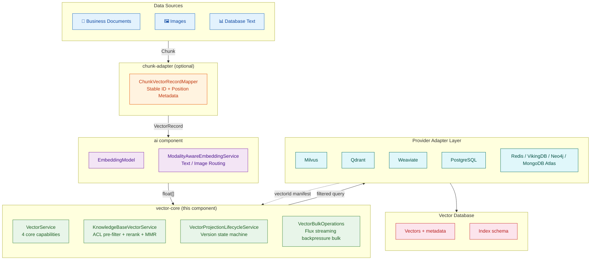
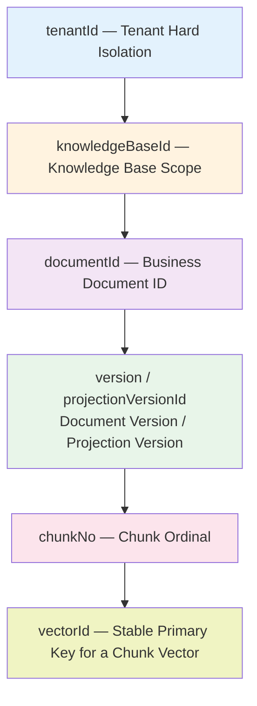
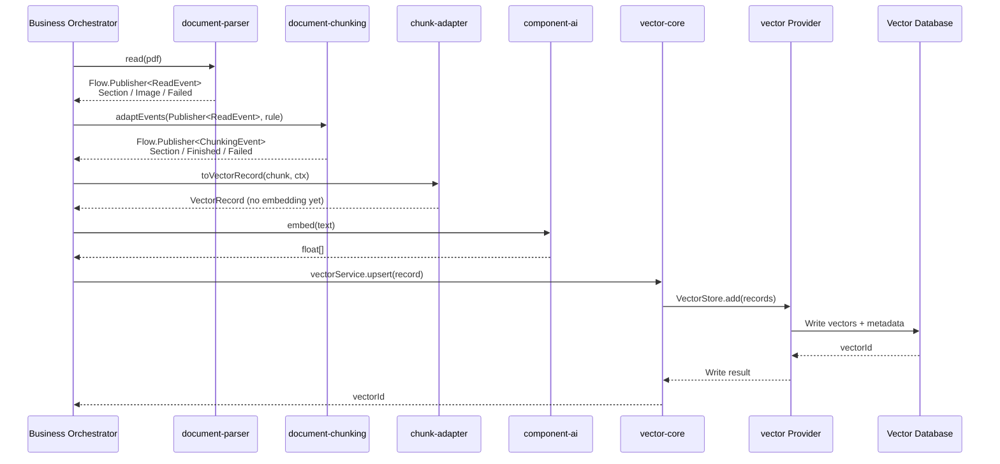
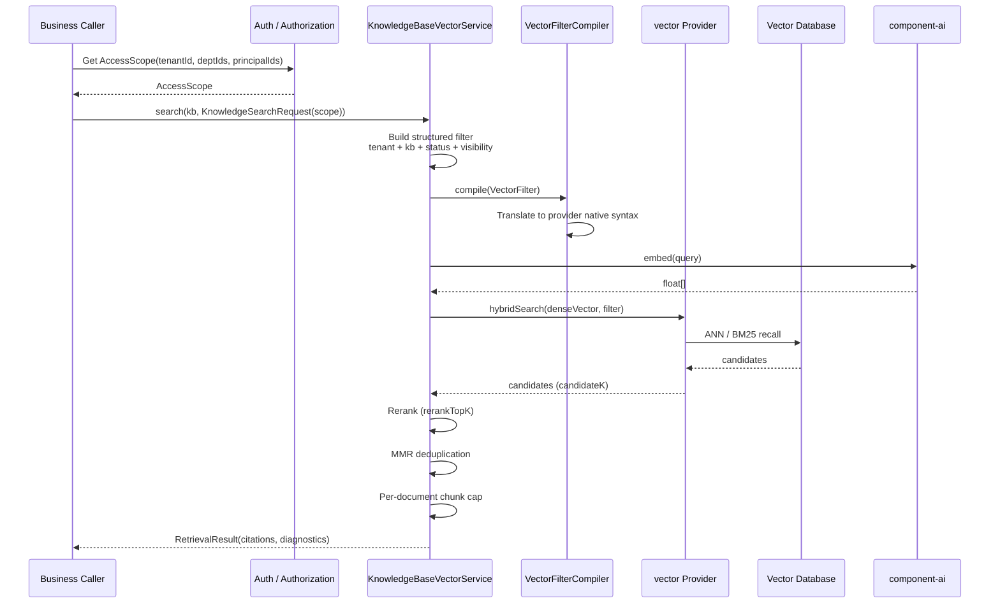
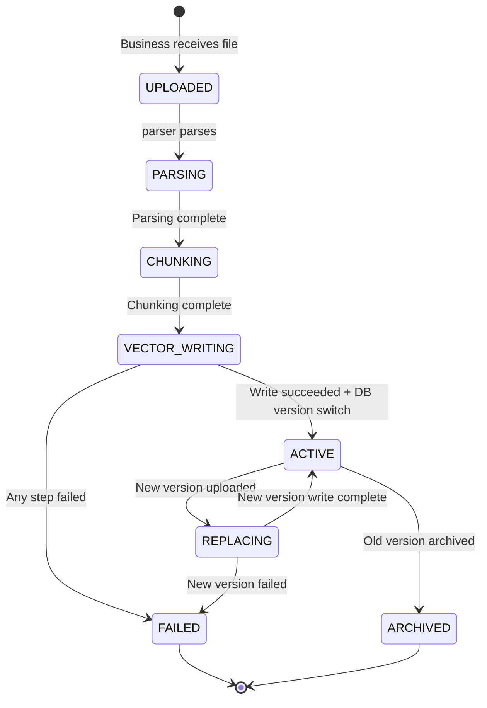
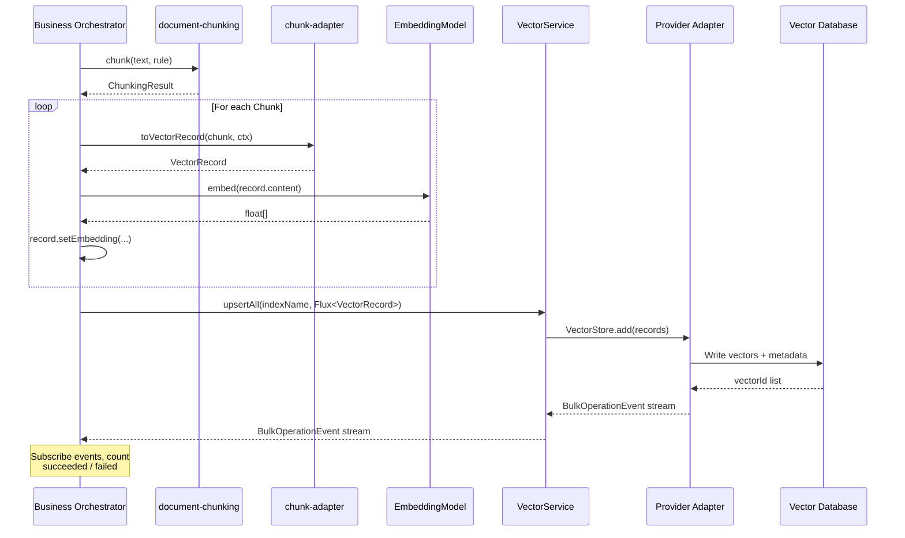
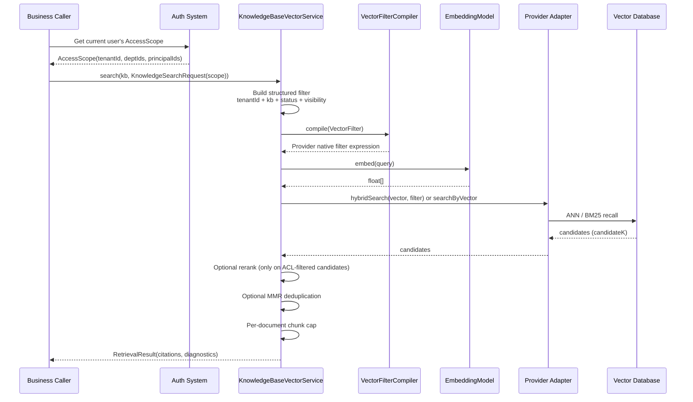
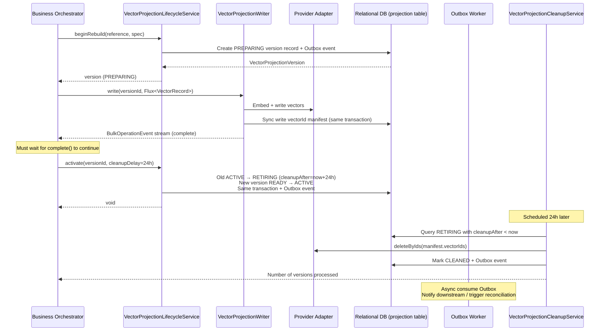

# Atlas Richie Vector Component (atlas-richie-component-vector)

> **One-line value**: The data-access foundation for commercial RAG knowledge bases. "Semantic similarity" and "is this
> content authorized for this caller" are resolved in a single query, with no binding to any specific vector database SDK.
>
> **Core positioning**: In the RAG pipeline, this component **only handles the vector data plane**—file parsing is
> delegated to `document-parser`, text chunking to `document-chunking`, Embedding/reranking to `component-ai`, and
> ACL/document facts are owned by the business system. The complete pipeline:

```text
document-parser → document-chunking → vector-chunk-adapter → vector
                                              │
                                              └── Optional: vector-projection-dao
```

---

## 📖 Table of Contents

- [🎯 Component Overview](#-component-overview)
    - [Key Features](#key-features)
    - [Boundaries with Peer Components](#boundaries-with-peer-components)
- [🏗️ Architecture Design](#️-architecture-design)
    - [Overall Architecture](#overall-architecture)
    - [Data Model Hierarchy](#data-model-hierarchy)
    - [Ingestion Pipeline](#ingestion-pipeline)
    - [Retrieval Pipeline](#retrieval-pipeline)
    - [Version Projection Lifecycle](#version-projection-lifecycle)
- [🚀 Quick Start Guide](#-quick-start-guide)
    - [1. Add Dependencies](#1-add-dependencies)
    - [2. Choose a Provider](#2-choose-a-provider)
    - [3. Basic Configuration](#3-basic-configuration)
    - [4. Write and Basic Retrieval](#4-write-and-basic-retrieval)
    - [5. Commercial Knowledge Base Retrieval](#5-commercial-knowledge-base-retrieval)
- [📚 Interface Reference](#-interface-reference)
    - [Core Interfaces (Required for All Providers)](#core-interfaces-required-for-all-providers)
    - [Optional Capability Interfaces](#optional-capability-interfaces)
    - [Public Method Index](#public-method-index)
- [🔧 Core Scenarios](#-core-scenarios)
    - [Scenario 1 — Document Ingestion with Version Governance](#scenario-1--document-ingestion-with-version-governance)
    - [Scenario 2 — Commercial RAG Retrieval with ACL Pushdown](#scenario-2--commercial-rag-retrieval-with-acl-pushdown)
    - [Scenario 3 — Streaming Bulk Ingestion with Backpressure](#scenario-3--streaming-bulk-ingestion-with-backpressure)
    - [Scenario 4 — Provider Switching and Multimodal Retrieval](#scenario-4--provider-switching-and-multimodal-retrieval)
- [⚙️ Configuration Reference](#️-configuration-reference)
    - [Core Configuration](#core-configuration)
    - [Bulk Ingestion Tuning](#bulk-ingestion-tuning)
    - [Provider Configuration Examples](#provider-configuration-examples)
- [🔧 Troubleshooting](#-troubleshooting)
    - [Common Issues and Solutions](#common-issues-and-solutions)
    - [Retrieval Quality Tuning](#retrieval-quality-tuning)
- [📎 📊 Provider Capability Comparison](#-📊-provider-capability-comparison)
    - [Milvus](#milvus)
    - [Qdrant](#qdrant)
    - [Weaviate](#weaviate)
    - [PostgreSQL/pgvector](#postgresqlpgvector)
    - [Redis](#redis)
    - [MongoDB Atlas](#mongodb-atlas)
    - [Neo4j](#neo4j)
    - [VikingDB](#vikingdb)
- [⏱️ Sequence Diagram Reference](#⏱️-sequence-diagram-reference)
    - [Vector Ingestion Sequence](#vector-ingestion-sequence)
    - [Knowledge Base Retrieval Sequence](#knowledge-base-retrieval-sequence)
    - [Version Projection Switch Sequence](#version-projection-switch-sequence)
- [📐 Design Notes](#📐-design-notes)
    - [Problems the Component Solves](#problems-the-component-solves)
    - [Boundaries and Responsibilities](#boundaries-and-responsibilities)
    - [Interface Segregation and Provider Capability Declaration](#interface-segregation-and-provider-capability-declaration)
    - [Safe Retrieval and Permission Model](#safe-retrieval-and-permission-model)
    - [Bulk Operations and Consistency](#bulk-operations-and-consistency)
    - [Auto-Configuration and Extension Principles](#auto-configuration-and-extension-principles)
- [✅ Production Checklist](#✅-production-checklist)

---

## 🎯 Component Overview

`atlas-richie-component-vector` is the data-access foundation for commercial RAG knowledge bases. The challenge is not
"how to write text into a vector database"—any SDK can do that. The real challenge is: in a multi-tenant,
strictly-permissioned, frequently-updated, quality-sensitive commercial scenario, how to keep business code free of any
specific vector database's filtering DSL, how to avoid being locked into one vector database's operational
characteristics, and how to guarantee permissions are enforced at the recall stage rather than as an afterthought.

This component abstracts the vector data plane into four universal capabilities: **write, delete by vectorId, read by
ID, basic semantic search**. Provider-specific capabilities (delete by documentId, alias, backup, native hybrid,
multi-vector) are split out into optional capability interfaces. A provider **either implements what it can truly
support, or doesn't implement at all**—this prevents business code from confusing "unsupported" with "empty result".

### Key Features

- ✅ **Unified Facade**: `VectorService` / `KnowledgeBaseVectorService` are the shared entry points for all providers;
  business code only depends on abstractions
- ✅ **10 Pluggable Providers**: Milvus, Qdrant, Weaviate, PostgreSQL/pgvector, Redis, MongoDB Atlas, Neo4j,
  VikingDB—declared by capability, not by brand
- ✅ **Forced ACL Pushdown**: `KnowledgeBaseVectorService` mandates that tenant, visibility, status, and other structured
  filters are pushed down to the provider's native query execution—never "fetch Top-K then filter in JVM" which leaks
  content
- ✅ **Capability-based Interface Segregation**: 4 core universal capabilities + 6 optional capability interfaces
  (hybrid / multi-vector / alias / backup / read / lifecycle); providers only declare what they truly support
- ✅ **Streaming Backpressure Bulk**: `Flux<VectorRecord>` input + `Flux<BulkOperationEvent>` output, with controllable
  backpressure and concurrency; never blows up the JVM
- ✅ **Structured Filtering**: `VectorFilter` sealed expression tree (Eq / In / Range / Exists / ContainsAny / Not /
  And / Or) translated to native syntax by the provider's `VectorFilterCompiler`—no string concatenation
- ✅ **Version Projection Plugin**: The optional `vector-projection-dao` plugin provides "write new version → switch
  visibility → delayed cleanup of old version" so document updates never cause a whole document to temporarily disappear
- ✅ **Embedding Decoupling**: `EmbeddingModel` is auto-injected by `component-ai`; this component holds no LLM/embedding
  vendor information
- ✅ **Chunk → VectorRecord Adapter**: `vector-chunk-adapter` combines `Chunk` with document context into a vector record
  with stable ID, version number, and position information
- ✅ **Multimodal Vectors**: Text and images can be routed through `ModalityAwareEmbeddingService` to the appropriate
  embedding model; CLIP-equivalent shared space supports cross-modal retrieval
- ✅ **Failure Observability**: `BulkOperationEvent` stream
  (`Started / ItemStarted / ItemSucceeded / ItemFailed / Completed`) + `ChunkingSignal` + `OcrException` sealed
  exception hierarchy across the full pipeline
- ✅ **Configuration-Driven**: `platform.component.vector.provider=milvus`—one line to switch backends, no business code
  changes

### Boundaries with Peer Components

| Component                   | Concerns                                                                   | Does NOT Cover                                                              |
|-----------------------------|----------------------------------------------------------------------------|-----------------------------------------------------------------------------|
| **component-vector** (this) | Vector data plane: write, delete, search, ACL pushdown, version projection | File parsing, chunking strategy, embedding model selection, ACL fact source |
| component-document-parser   | Multi-format document parsing (with SSRF protection)                       | Chunking, vectorization                                                     |
| component-document-chunking | 9 chunking strategies on plain text                                        | Vector store, ACL                                                           |
| component-ai                | Embedding / LLM / multimodal routing                                       | Vector store, document facts                                                |
| component-ocr               | 8 OCR vendor abstractions                                                  | Chunking, vectorization                                                     |
| **Business application**    | Document facts, permission facts, user management, task scheduling         | Vector store SDK, filtering DSL                                             |

---

## 🏗️ Architecture Design

### Overall Architecture



### Data Model Hierarchy



Each layer has its own responsibility:

| Layer          | Field                             | Why It's Needed                                                                                    |
|----------------|-----------------------------------|----------------------------------------------------------------------------------------------------|
| Tenant         | `tenantId`                        | First-level security boundary; must be filterable on the provider side                             |
| Knowledge Base | `knowledgeBaseId`                 | Subdivide vector space and permission domain within a tenant                                       |
| Document       | `documentId`                      | Group multiple chunks into one business document                                                   |
| Version        | `version` / `projectionVersionId` | Distinguish different content versions of the same document; enables "ready-then-switch" semantics |
| Chunk          | `chunkNo`                         | Return to original position; cap single-document result count                                      |
| Record         | `vectorId` / `id`                 | Idempotent write, exact delete, manifest cleanup, retry                                            |

### Ingestion Pipeline



### Retrieval Pipeline



### Version Projection Lifecycle



The `ACTIVE` version in the database is the only version visible at query time. Even if vector write succeeds, the new
version does not enter the search scope until the DB switches to the new version.

---

## 🚀 Quick Start Guide

### 1. Add Dependencies

Versions are managed by the platform BOM; business projects typically only need to import one provider module. For
example, with Milvus:

```xml
<dependency>
    <groupId>cn.richie696.component</groupId>
    <artifactId>vector-milvus</artifactId>
</dependency>
```

To map chunking results directly to vector records, also add:

```xml
<dependency>
    <groupId>cn.richie696.component</groupId>
    <artifactId>vector-chunk-adapter</artifactId>
</dependency>
```

For business documents that are frequently updated or deleted, also add the version projection plugin:

```xml
<dependency>
    <groupId>cn.richie696.component</groupId>
    <artifactId>vector-projection-dao</artifactId>
</dependency>
```

> ⚠️ **Only one Provider should be active per application instance**. Vector data is NOT automatically replicated across
> providers, nor will the component silently switch to another database when one fails. Doing so mixes two different data
> planes, producing results that are neither complete nor permission-correct.

### 2. Choose a Provider

| Scenario                                                        | Recommended Provider    | Reason                                                        |
|-----------------------------------------------------------------|-------------------------|---------------------------------------------------------------|
| Commercial production + full capabilities (hybrid/alias/backup) | **Milvus**              | Most complete capability set, best documentation              |
| Existing Qdrant deployment + small-to-medium scale              | **Qdrant**              | Clean API, single-binary deployment friendly                  |
| Already using Weaviate for modular vector + RAG                 | **Weaviate**            | Native hybrid is strong, integrates with GraphQL              |
| Already have a PostgreSQL cluster                               | **PostgreSQL/pgvector** | Reduced infrastructure, strong transactional consistency      |
| Extremely low latency + small-to-medium scale                   | **Redis**               | Simple deployment, high performance, but limited capabilities |
| MongoDB ecosystem                                               | **MongoDB Atlas**       | Integrates with existing document database                    |
| Knowledge graph + vector hybrid                                 | **Neo4j**               | Graph-RAG dedicated                                           |
| ByteDance ecosystem                                             | **VikingDB**            | Adapts to Volcano Engine ecosystem                            |

### 3. Basic Configuration

This component only manages vector database and index configuration. `EmbeddingModel` is provided by `component-ai`;
model vendor, API key, and model routing should NOT be configured in this component.

```yaml
platform:
  component:
    ai:
      models:
        text-embedding-v3:
          provider: DASHSCOPE
          api-key: ${DASHSCOPE_API_KEY}
          options:
            model: text-embedding-v3
            dimension: 1024

    vector:
      provider: milvus
      default-index: knowledge_chunks
      bulk:
        embedding-concurrency: 8
        write-batch-size: 100
        write-concurrency: 4
        write-flush-interval-ms: 1000
      indexes:
        knowledge_chunks:
          dimension: 1024
          metric: cosine
          index-type: hnsw
          additional-fields:
            tenantId: { data_type: VarChar, max_length: 64 }
            knowledgeBaseId: { data_type: VarChar, max_length: 64 }
            documentId: { data_type: VarChar, max_length: 64 }
            projectionVersionId: { data_type: VarChar, max_length: 64 }
            visibility: { data_type: VarChar, max_length: 32 }
            status: { data_type: VarChar, max_length: 32 }
            version: { data_type: Int64 }

    ocr:
      vendor: aliyun
      enabled: true
```

The provider's own connection address, authentication, and database-specific parameters are still configured by the
corresponding provider module.

### Scalar Fields Are Not Plain Metadata

For vector databases like Milvus and VikingDB, fields that can participate in database-side filtering **must be scalar
fields declared in the index schema**. Simply putting values into `metadata` JSON does NOT guarantee the database can
use them for filtering.

Therefore, define your field conventions before building the index, and keep three places consistent:

1. The `key` written in `VectorRecord.metadata`
2. The field name used by `VectorFilter`
3. The scalar field name in the vector database schema

The component will NOT guess whether `tenant_id` and `tenantId` are equivalent, nor will it rename fields for you. Teams
may use snake_case or camelCase, but must pick one and use it consistently across write, filter, and schema. Field types
should also be consistent; for example, numeric IDs should always be treated as numeric from write to filter—don't write
as string and query as numeric.

### 4. Write and Basic Retrieval

`VectorService` is the minimal entry point that all providers must implement. It only retains four truly universal
capabilities: semantic search, idempotent write, delete by vector ID, and streaming bulk operations.

```java
VectorRecord record = VectorRecord.text(
        "knowledge_chunks",
        "doc-100:v3:12",
        "Employees should submit business trip applications three days in advance.")
    .setDocumentId("doc-100")
    .setChunkNo(12)
    .setVersion(3L)
    .setMetadata(Map.of(
        "tenantId", "10000",
        "knowledgeBaseId", "hr",
        "visibility", "COMPANY",
        "status", "ACTIVE"));

String vectorId = vectorService.upsert(record);

List<VectorSearchResult> hits = vectorService.searchByText(
        "knowledge_chunks",
        "How far in advance must a business trip be applied for?",
        10,
        SearchOptions.builder()
            .filter(VectorFilter.and(
                VectorFilter.eq("tenantId", "10000"),
                VectorFilter.eq("knowledgeBaseId", "hr"),
                VectorFilter.eq("status", "ACTIVE")))
            .rerank(true)
            .build());

vectorService.deleteById("knowledge_chunks", vectorId);
```

`id` is the primary key of a vector record. It does NOT participate in similarity computation, but is indispensable for
idempotent write, exact delete, failure retry, and version cleanup. We recommend using a stable ID composed of
`documentId + version + chunkNo`; when the same chunk of the same version is rewritten, the result overwrites instead of
accumulating duplicates.

> ⚠️ **Do not use `documentId` as the ID of every vector**. A document typically contains multiple chunks; `documentId`
> associates them as one business document, while `id` uniquely locates one chunk vector within it.

### 5. Commercial Knowledge Base Retrieval

Plain `VectorService` faces "vector operations"; `KnowledgeBaseVectorService` faces "users safely find answers in the
knowledge base". Business RAG should prefer the latter.

```java
AccessScope scope = new AccessScope(
        "10000",
        Set.of("dept-hr"),
        Set.of("user-9527"),
        false);

KnowledgeSearchRequest request = new KnowledgeSearchRequest(
        "How far in advance must a business trip be applied for?",
        8,      // topK
        50,     // candidateK
        scope,
        true,   // rerank
        false,  // hybrid
        null,   // keywordQuery
        false,  // mmr
        0.6,    // mmrLambda
        2,      // maxChunksPerDocument
        null);  // additionalFilter

RetrievalResult result = knowledgeBaseVectorService.search("hr", request);
```

The knowledge base facade automatically constructs and pushes down the following base constraints:

```text
tenantId = current tenant
AND knowledgeBaseId = current knowledge base
AND status = ACTIVE
AND caller satisfies document visibility rules
```

The result includes `RetrievalCitation` (with `documentId`, `chunkNo`, content, score, metadata) and
`RetrievalDiagnostics` (candidate count, final return count, whether hybrid was used, whether rerank was applied, and
elapsed time).

---

## 📚 Interface Reference

### Core Interfaces (Required for All Providers)

```java
public interface VectorService extends
        VectorSearchOperations,
        VectorRecordWriteOperations,
        VectorRecordDeleteOperations,
        VectorBulkOperations {
}

public interface VectorSearchOperations {
    List<VectorSearchResult> searchByText(String indexName, String text, int limit);
    List<VectorSearchResult> searchByText(String indexName, String text, int limit, double minScore);
    List<VectorSearchResult> searchByText(String indexName, String text, int limit, SearchOptions options);
    List<VectorSearchResult> searchByImage(String indexName, byte[] image, String mimeType, int limit);
}

public interface VectorRecordWriteOperations {
    String upsert(VectorRecord record);
}

public interface VectorRecordDeleteOperations {
    void deleteById(String indexName, String vectorId);
    void deleteByIds(String indexName, Collection<String> vectorIds);
}

public interface VectorBulkOperations {
    Flux<BulkOperationEvent> upsertAll(String indexName, Flux<VectorRecord> records);
}
```

### Optional Capability Interfaces

```java
// Exact primary-key read (for detail backtracking, troubleshooting)
public interface VectorRecordReadOperations {
    Optional<VectorRecord> getById(String indexName, String vectorId);
    List<VectorRecord> getByIds(String indexName, Collection<String> vectorIds);
}

// Native hybrid search (dense + sparse/BM25)
public interface VectorHybridSearchOperations {
    List<VectorSearchResult> hybridSearch(String indexName, String text, String keyword,
                                         int limit, SearchOptions options);
}

// ACL-aware hybrid (filter pushed down on hybrid recall)
public interface VectorAclAwareHybridSearchOperations {
    List<VectorSearchResult> hybridSearch(String indexName, String text, String keyword,
                                         int limit, AccessScope scope, SearchOptions options);
}

// Multi-vector joint retrieval (named vectors, multimodal, multi-model)
public interface VectorMultiVectorSearchOperations {
    List<VectorSearchResult> searchByMultiVector(String indexName, List<float[]> vectors, int limit);
}

// Collection / index lifecycle
public interface VectorIndexLifecycleOperations {
    void createIndex(String indexName, VectorProperties.IndexConfig config);
    void deleteIndex(String indexName);
    boolean indexExists(String indexName);
}

// Index statistics
public interface VectorIndexStatsOperations {
    long countDocuments(String indexName);
    IndexInfo describeIndex(String indexName);
    Map<String, IndexInfo> listIndexes();
    boolean healthCheck(String indexName);
}

// Blue-green rebuild alias switching
public interface VectorIndexAliasOperations {
    boolean createAlias(String indexName, String alias);
    boolean switchAlias(String oldIndexName, String newIndexName, String alias);
}

// Snapshot / backup / restore
public interface VectorBackupOperations {
    void backup(String indexName, String targetPath);
    void restore(String indexName, String sourcePath);
}
```

> ⚠️ **If an interface is not implemented, that provider has NOT committed to that capability for business code**. Do
> not rely on a "default implementation returns empty collection" to determine lack of support; lack of support must be
> exposed through the type system or explicit exceptions.

### Public Method Index

| Method                                                | On Interface                       | When to Call                                 |
|-------------------------------------------------------|------------------------------------|----------------------------------------------|
| `vectorService.upsert(record)`                        | `VectorRecordWriteOperations`      | Single idempotent write                      |
| `vectorService.upsertAll(indexName, Flux)`            | `VectorBulkOperations`             | Streaming bulk write (backpressured)         |
| `vectorService.searchByText(...)`                     | `VectorSearchOperations`           | Plain semantic search                        |
| `vectorService.deleteById(indexName, vectorId)`       | `VectorRecordDeleteOperations`     | Exact delete one                             |
| `vectorService.deleteByIds(indexName, ids)`           | `VectorRecordDeleteOperations`     | Exact delete many                            |
| `knowledgeBaseVectorService.search(kb, request)`      | `KnowledgeBaseVectorService`       | Commercial RAG search (with ACL)             |
| `projectionService.beginRebuild(ref, spec)`           | `VectorProjectionLifecycleService` | Create new projection version                |
| `projectionService.activate(versionId, cleanupDelay)` | `VectorProjectionLifecycleService` | Activate new version, old version → RETIRING |
| `projectionService.markFailed(versionId, reason)`     | `VectorProjectionLifecycleService` | Mark as failed                               |
| `projectionService.findVersion(versionId)`            | `VectorProjectionLifecycleService` | Query version snapshot                       |
| `cleanupService.cleanupDueProjections(maxVersions)`   | `VectorProjectionCleanupService`   | Clean up expired RETIRING (caller schedules) |

---

## 🔧 Core Scenarios

### Scenario 1 — Document Ingestion with Version Governance

**Business scenario**: The HR knowledge base has dozens of policy documents updated daily. Users should always see the
latest version when searching, but "half-written batches visible to users" must not cause old content to flash back or
disappear.

**Implementation path**:

```java
@Service
@RequiredArgsConstructor
public class HrPolicyIngestService {

    private final VectorProjectionLifecycleService lifecycle;
    private final VectorProjectionWriter writer;
    private final DocumentParser reader;
    private final ChunkingService chunker;
    private final ChunkVectorRecordMapper mapper;
    private final EmbeddingModel embedding;
    private final VectorRecordWriteOperations vector;

    public void ingest(File pdf, String documentId, String tenantId, String sourceVersion) {
        // 1. Create new projection version (initial state PREPARING)
        VectorProjectionReference reference = new VectorProjectionReference(
                tenantId, "hr", documentId);
        VectorProjectionSpecification specification = new VectorProjectionSpecification(
                sourceVersion, "hr_policies", "text-embedding-v3");
        VectorProjectionVersion version = lifecycle.beginRebuild(reference, specification);

        // 2. Parse → chunk → embed → write (manifest synced automatically)
        List<Chunk> chunks = parseAndChunk(pdf);
        Flux<VectorRecord> records = Flux.fromIterable(chunks)
                .map(chunk -> mapper.toVectorRecord(chunk,
                        new VectorRecordContext("hr_policies", documentId, 1L, "default",
                                Map.of("visibility", "COMPANY", "status", "ACTIVE"))))
                .handle((rec, sink) -> {
                    rec.setEmbedding(embedding.embed(rec.getContent().text()));
                    sink.next(rec);
                });

        writer.write(version.versionId(), records)
                .doOnNext(event -> log.info("write event: {}", event.getClass().getSimpleName()))
                .blockLast();

        // 3. Activate new version (only after write completes and version is READY)
        lifecycle.activate(version.versionId(), Duration.ofHours(24));

        // 4. Old version is automatically marked RETIRING;
        //    cleanup task removes it per manifest after 24h.
    }

    private List<Chunk> parseAndChunk(File pdf) {
        ReadResult doc = reader.read(pdf);
        ChunkingResult result = chunker.chunk(doc.sections().get(0).text(),
                ChunkingRule.recursiveDefaults(1600, 160));
        return result.chunks();
    }
}
```

**Key constraints**:

- You MUST wait for `writer.write(...)`'s `Flux` to complete normally before calling `activate`
- On failure, call `markFailed(reason)`; the old version continues to serve
- Cleanup of old versions is scheduled by Quartz / XXL-Job / business scheduled tasks via
  `cleanupService.cleanupDueProjections(batchSize)`

### Scenario 2 — Commercial RAG Retrieval with ACL Pushdown

**Business scenario**: Employee Alice is in the HR department. She should be able to query HR department policies and
public company policies, but not sensitive finance documents and not other tenants' documents.

**Implementation path**:

```java
@Service
@RequiredArgsConstructor
public class HrQaService {

    private final KnowledgeBaseVectorService kbVector;
    private final AiChatService ai;

    public String answer(String question, AccessScope scope) {
        // 1. Retrieval (ACL pushed down automatically)
        RetrievalResult result = kbVector.search("hr",
                KnowledgeSearchRequest.builder()
                        .query(question)
                        .topK(8)
                        .candidateK(100)
                        .accessScope(scope)
                        .rerankTopK(30)
                        .mmr(true)
                        .mmrLambda(0.6)
                        .maxChunksPerDocument(2)
                        .build());

        // 2. Compose prompt + invoke LLM
        String context = result.citations().stream()
                .map(c -> "[Source: doc=" + c.documentId() + " chunk=" + c.chunkNo() + "]\n" + c.text())
                .collect(Collectors.joining("\n\n"));
        AiResponse resp = ai.call(AiRequest.ofSystemAndUser(
                "You are an HR knowledge base assistant. Answer strictly based on the references below.\n\n" + context,
                question));
        return resp.getContent();
    }
}
```

**Key constraints**:

- `AccessScope` MUST be parsed from the authentication system, NOT constructed by the frontend
- `topK=8`, `candidateK=100`, `rerankTopK=30`: leave enough room in the candidate pool for reranking
- `mmr=true` + `maxChunksPerDocument=2`: prevent a single document from dominating results
- `RetrievalCitation` MUST be displayed to the user so they can trace the source of answers

### Scenario 3 — Streaming Bulk Ingestion with Backpressure

**Business scenario**: Import 100,000 historical records at once. Cannot blow up the JVM; cannot push the embedding
model into rate limiting; write failures should be retryable per record.

**Implementation path**:

```java
@Service
@RequiredArgsConstructor
public class BulkImportService {

    private final VectorService vectorService;
    private final EmbeddingModel embedding;
    private final MeterRegistry meterRegistry;

    public Mono<Long> bulkImport(String indexName, Flux<RawRecord> source) {
        return source
                .map(raw -> {
                    VectorRecord record = VectorRecord.text(indexName, raw.id, raw.text)
                            .setDocumentId(raw.docId)
                            .setChunkNo(raw.chunkNo)
                            .setVersion(raw.version)
                            .setMetadata(raw.metadata);
                    record.setEmbedding(embedding.embed(record.getContent().text()));
                    return record;
                })
                .transform(vectorService::upsertAll)
                .doOnNext(event -> {
                    if (event instanceof BulkOperationEvent.ItemSucceeded s) {
                        meterRegistry.counter("vector.bulk.success").increment();
                    } else if (event instanceof BulkOperationEvent.ItemFailed f) {
                        meterRegistry.counter("vector.bulk.failure", "reason", f.errorClass()).increment();
                        log.warn("failed to write vectorId={}, reason={}", f.itemId(), f.message());
                    }
                })
                .filter(event -> event instanceof BulkOperationEvent.Completed)
                .cast(BulkOperationEvent.Completed.class)
                .map(c -> c.summary().succeeded());
    }
}
```

**Configuration tuning**:

```yaml
platform:
  component:
    vector:
      bulk:
        embedding-concurrency: 8       # 1/2 ~ 2/3 of model QPS
        write-batch-size: 100          # provider per-request batch size
        write-concurrency: 4           # write concurrency
        write-flush-interval-ms: 1000  # max batching wait time
```

**Key constraints**:

- `embedding-concurrency` is bounded by model QPS; setting too high causes 429s
- `write-batch-size` is bounded by the provider's per-request body size limit
- `Flux<BulkOperationEvent>` provides per-record fine-grained results; do not rely solely on `Completed` for stats

### Scenario 4 — Provider Switching and Multimodal Retrieval

**Business scenario**: Production uses Milvus; local dev uses Redis for lightweight testing; the product needs to
support "search by text, find image".

**Implementation (provider switching)**:

```java
// application-prod.yml
platform:
  component:
    vector:
      provider: milvus

// application-dev.yml
platform:
  component:
    vector:
      provider: redis
      redis:
        host: localhost
        port: 6379
```

Business code is **completely unchanged**—just swap the yaml file.

**Implementation (multimodal)**:

```java
@Service
@RequiredArgsConstructor
public class MultimodalSearchService {

    private final ModalityAwareEmbeddingService embeddingService;
    private final VectorService vectorService;
    private final KnowledgeBaseVectorService kbVector;

    public List<VectorSearchResult> searchByText(String question, AccessScope scope) {
        // text → vector → search
        return kbVector.search("products",
                KnowledgeSearchRequest.builder()
                        .query(question)
                        .accessScope(scope)
                        .build());
    }

    public List<VectorSearchResult> searchByImage(byte[] imageBytes, String mimeType,
                                                    AccessScope scope) {
        // image → CLIP multimodal vector → search (shares the same vector space)
        float[] imageVec = embeddingService.embedImage(imageBytes, mimeType);
        return kbVector.searchByVector("products", imageVec, scope, 10);
    }
}
```

**Key constraints**:

- Multimodal vectors MUST be generated by embedding models in the **same vector space** (e.g., CLIP); otherwise
  cross-modal retrieval will fail
- `ModalityAwareEmbeddingService` routes by `VectorContent.modality()` to the text or image model automatically
- Switching providers (e.g., to Redis) may disable cross-modal
  capabilities—see [Provider Capability Comparison](#-📊-provider-capability-comparison)

---

## ⚙️ Configuration Reference

### Core Configuration

| Config                             | Default  | Description                                                                                                         |
|------------------------------------|----------|---------------------------------------------------------------------------------------------------------------------|
| `provider`                         | (none)   | Active provider: `milvus` / `qdrant` / `weaviate` / `postgresql` / `redis` / `mongodb-atlas` / `neo4j` / `vikingdb` |
| `enabled`                          | `true`   | Master switch; when `false`, no provider autoconfig activates                                                       |
| `default-index`                    | (none)   | Default index name; used when `indexName` is not explicitly specified in `upsert`                                   |
| `indexes.<name>.dimension`         | (none)   | Vector dimension; must match the embedding model output dimension                                                   |
| `indexes.<name>.metric`            | `cosine` | Distance metric: `cosine` / `l2` / `ip`                                                                             |
| `indexes.<name>.index-type`        | `hnsw`   | Index type: provider-specific (e.g., Milvus supports HNSW / IVF_FLAT / ANNOY)                                       |
| `indexes.<name>.replicas`          | `1`      | Replica count (effective only for distributed providers)                                                            |
| `indexes.<name>.additional-fields` | (none)   | Custom scalar fields; used for ACL filtering                                                                        |

### Bulk Ingestion Tuning

| Config                         | Default | Recommended Range | Impact                                                                       |
|--------------------------------|---------|-------------------|------------------------------------------------------------------------------|
| `bulk.embedding-concurrency`   | 8       | 4~16              | Embedding model concurrency; too high causes rate limiting                   |
| `bulk.write-batch-size`        | 100     | 50~500            | Per-write batch size; too large exceeds provider request body limits         |
| `bulk.write-concurrency`       | 4       | 2~8               | Write concurrency; too large crushes the vector database                     |
| `bulk.write-flush-interval-ms` | 1000    | 500~3000          | Max batching wait; too small reduces throughput, too large increases latency |

### Provider Configuration Examples

**Milvus**:

```yaml
platform:
  component:
    vector:
      provider: milvus
      milvus:
        host: localhost
        port: 19530
        username: root
        password: ${MILVUS_PASSWORD}
```

**Qdrant**:

```yaml
platform:
  component:
    vector:
      provider: qdrant
      qdrant:
        host: localhost
        port: 6333
        api-key: ${QDRANT_API_KEY}
```

**PostgreSQL/pgvector**:

```yaml
platform:
  component:
    vector:
      provider: postgresql
      postgresql:
        url: jdbc:postgresql://localhost:5432/knowledge
        username: postgres
        password: ${POSTGRES_PASSWORD}
```

**Redis**:

```yaml
platform:
  component:
    vector:
      provider: redis
      redis:
        host: localhost
        port: 6379
        index-type: HNSW
        distance-metric: COSINE
```

---

## 🔧 Troubleshooting

### Common Issues and Solutions

#### 1. Cannot Find Data After Write

**Symptom**: `upsert` returns a `vectorId` successfully, but `searchByText` finds nothing.

**Troubleshooting path**:

- Check that `VectorRecord.metadata.tenantId` matches `VectorFilter.eq("tenantId", ...)` exactly (case-sensitive,
  snake_case vs camelCase)
- Check whether the provider needs `flush()` to make data visible (some providers have write latency)
- Check whether ACL conditions are too strict (use unfiltered `searchByText` first to verify data exists)

#### 2. Empty Results When Data Exists

**Symptom**: Searching via `KnowledgeBaseVectorService` returns nothing, but `VectorService.searchByText` can find data.

**Troubleshooting path**:

- Check that `AccessScope` is correct (does `tenantId` match?)
- Check the document's `visibility` field value (`COMPANY` / `DEPARTMENT` / `CUSTOM` / `PRIVATE`) covers the current
  user
- Check whether `status` field is `ACTIVE`
- Disable visibility filtering temporarily to see if results appear (debug-only)

#### 3. `MAX_CHUNKS_REACHED` Error During Chunking

**Symptom**: `IllegalStateException` when chunking a huge document that exceeds 10000 chunks.

**Solutions**:

- Increase `max-chunks-per-document` (business should evaluate whether it's reasonable)
- Decrease `max-characters` (e.g., 800 → finer-grained chunking)
- Split the document and ingest in multiple batches

#### 4. Retrieval Fails After Switching Providers

**Symptom**: Redis works locally but Milvus in production finds nothing.

**Troubleshooting path**:

- Check vector space compatibility: different embedding models must have matching output dimensions
- Check `metric` alignment (`cosine` vs `l2`)
- Check whether `index-type` is supported by the new provider
- Check whether ACL scalar fields are declared in the Milvus schema (Redis filters by default, Milvus requires explicit
  schema)

#### 5. Hybrid Silently Downgrades to Dense

**Symptom**: `hybrid=true` calls return only dense results from the provider.

**Reason**: The current provider does not support ACL-aware hybrid
(see [Provider Capability Comparison](#-📊-provider-capability-comparison)).

**Solutions**:

- Explicitly declare that the provider doesn't support hybrid; switch to other approaches (keyword preprocessing +
  dense) on the business side
- Switch to a provider that supports ACL-aware hybrid (e.g., Milvus, Weaviate)
- Do not assume hybrid is working just because it "looks fine"

#### 6. OOM on Large Documents

**Symptom**: OOM when importing large PDFs.

**Troubleshooting path**:

- Confirm you are using the `Flux<VectorRecord>` streaming interface, NOT `List<VectorRecord>`
- Decrease `bulk.write-batch-size` to reduce per-batch memory footprint
- Stream-ify the parser: `reader.readPublisher(...)` instead of `reader.read(...)`

### Retrieval Quality Tuning

| Symptom                    | Possible Cause                       | Tuning Direction                                     |
|----------------------------|--------------------------------------|------------------------------------------------------|
| Irrelevant recall          | Embedding model doesn't match domain | Switch to a domain-fine-tuned model                  |
| Too few results            | Distance metric too strict           | Lower the `minScore` threshold                       |
| Too many imprecise results | `candidateK` too large               | Reduce `candidateK`, raise `minScore`                |
| Single document dominates  | `maxChunksPerDocument` too high      | Lower `maxChunksPerDocument` to 2~3                  |
| Many duplicate passages    | MMR not enabled                      | Enable `mmr=true`, `lambda=0.6`                      |
| Inaccurate ranking         | Rerank not enabled                   | Enable `rerank=true`, choose a suitable rerank model |

---

## 📎 📊 Provider Capability Comparison

> ⚠️ **Do not assume identical native semantics or operational characteristics just because interface names are the
same**. Different providers' `createIndex` may involve completely different metadata, different replica models, and
> different availability guarantees.

### Milvus

| Capability                             | Support | Notes                            |
|----------------------------------------|---------|----------------------------------|
| `VectorSearchOperations`               | ✅      | Fully supported                  |
| `VectorRecordReadOperations`           | ✅      | Efficient read by vectorId       |
| `VectorRecordDeleteOperations`         | ✅      | Single + batch + byFilter        |
| `VectorDocumentOperations`             | ✅      | Delete by documentId             |
| `VectorIndexLifecycleOperations`       | ✅      | createIndex / dropIndex          |
| `VectorIndexStatsOperations`           | ✅      | Full statistics                  |
| `VectorIndexAliasOperations`           | ✅      | createAlias / switchAlias        |
| `VectorHybridSearchOperations`         | ✅      | dense + sparse                   |
| `VectorAclAwareHybridSearchOperations` | ✅      | **ACL pushdown on hybrid**       |
| `VectorMultiVectorSearchOperations`    | ✅      | named vector                     |
| `VectorBackupOperations`               | ⚠️      | Metadata backup only, no vectors |
| Multimodal (CLIP)                      | ✅      | 1024-d shared space              |

### Qdrant

| Capability                             | Support | Notes                                                                           |
|----------------------------------------|---------|---------------------------------------------------------------------------------|
| `VectorSearchOperations`               | ✅      | Complete                                                                        |
| `VectorRecordReadOperations`           | ✅      | Efficient                                                                       |
| `VectorRecordDeleteOperations`         | ✅      | Complete                                                                        |
| `VectorDocumentOperations`             | ✅      | byFilter                                                                        |
| `VectorIndexLifecycleOperations`       | ✅      | Collection management                                                           |
| `VectorIndexStatsOperations`           | ✅      | Complete                                                                        |
| `VectorIndexAliasOperations`           | ❌      | No alias concept                                                                |
| `VectorHybridSearchOperations`         | ⚠️      | dense + sparse, but sparse must be pre-generated                                |
| `VectorAclAwareHybridSearchOperations` | ⚠️      | Filter pushdown works, but hybrid dual channels need business-side coordination |
| `VectorMultiVectorSearchOperations`    | ❌      | No named vector concept                                                         |
| `VectorBackupOperations`               | ✅      | snapshot backup                                                                 |
| Multimodal (CLIP)                      | ❌      | Requires external CLIP service                                                  |

### Weaviate

| Capability                             | Support | Notes                           |
|----------------------------------------|---------|---------------------------------|
| `VectorSearchOperations`               | ✅      | Complete                        |
| `VectorRecordReadOperations`           | ✅      | Efficient                       |
| `VectorRecordDeleteOperations`         | ✅      | Complete                        |
| `VectorDocumentOperations`             | ✅      | byFilter                        |
| `VectorIndexLifecycleOperations`       | ✅      | Collection management           |
| `VectorIndexStatsOperations`           | ✅      | Complete                        |
| `VectorIndexAliasOperations`           | ❌      | No alias concept                |
| `VectorHybridSearchOperations`         | ✅      | **Native hybrid is a strength** |
| `VectorAclAwareHybridSearchOperations` | ✅      | Filter integrated with hybrid   |
| `VectorMultiVectorSearchOperations`    | ⚠️      | Implemented via named vectors   |
| `VectorBackupOperations`               | ✅      | Complete                        |
| Multimodal (CLIP)                      | ✅      | Native support                  |

### PostgreSQL/pgvector

| Capability                             | Support | Notes                                                                |
|----------------------------------------|---------|----------------------------------------------------------------------|
| `VectorSearchOperations`               | ✅      | Complete                                                             |
| `VectorRecordReadOperations`           | ✅      | Primary key read                                                     |
| `VectorRecordDeleteOperations`         | ✅      | SQL-level                                                            |
| `VectorDocumentOperations`             | ✅      | SQL WHERE                                                            |
| `VectorIndexLifecycleOperations`       | ✅      | Full DDL                                                             |
| `VectorIndexStatsOperations`           | ✅      | pg_stats                                                             |
| `VectorIndexAliasOperations`           | ❌      | No alias (can simulate with views)                                   |
| `VectorHybridSearchOperations`         | ❌      | Requires ES or tsvector combo                                        |
| `VectorAclAwareHybridSearchOperations` | ❌      | Not supported                                                        |
| `VectorMultiVectorSearchOperations`    | ❌      | Single form, single vector                                           |
| `VectorBackupOperations`               | ✅      | pg_dump                                                              |
| Multimodal (CLIP)                      | ❌      | Requires external integration                                        |
| **Strength**                           | —       | **Strong transactional consistency, reuses existing infrastructure** |

### Redis

| Capability                             | Support | Notes                                                      |
|----------------------------------------|---------|------------------------------------------------------------|
| `VectorSearchOperations`               | ✅      | High speed                                                 |
| `VectorRecordReadOperations`           | ✅      | Efficient                                                  |
| `VectorRecordDeleteOperations`         | ✅      | Complete                                                   |
| `VectorDocumentOperations`             | ⚠️      | byFilter has average performance                           |
| `VectorIndexLifecycleOperations`       | ✅      | Complete                                                   |
| `VectorIndexStatsOperations`           | ✅      | Basic                                                      |
| `VectorIndexAliasOperations`           | ❌      | None                                                       |
| `VectorHybridSearchOperations`         | ❌      | Not supported                                              |
| `VectorAclAwareHybridSearchOperations` | ❌      | Not supported                                              |
| `VectorMultiVectorSearchOperations`    | ❌      | Not supported                                              |
| `VectorBackupOperations`               | ⚠️      | Requires RDB                                               |
| Multimodal (CLIP)                      | ❌      | Not supported                                              |
| **Best For**                           | —       | Small-to-medium scale, low latency, existing Redis cluster |

### MongoDB Atlas

| Capability                             | Support | Notes                      |
|----------------------------------------|---------|----------------------------|
| `VectorSearchOperations`               | ✅      | Requires MongoDB 7.0+      |
| `VectorRecordReadOperations`           | ✅      | Complete                   |
| `VectorRecordDeleteOperations`         | ✅      | Complete                   |
| `VectorDocumentOperations`             | ✅      | byFilter                   |
| `VectorIndexLifecycleOperations`       | ✅      | Collection                 |
| `VectorIndexStatsOperations`           | ✅      | Basic                      |
| `VectorIndexAliasOperations`           | ❌      | None                       |
| `VectorHybridSearchOperations`         | ❌      | Not supported              |
| `VectorAclAwareHybridSearchOperations` | ❌      | Not supported              |
| `VectorMultiVectorSearchOperations`    | ❌      | Not supported              |
| `VectorBackupOperations`               | ✅      | mongodump                  |
| Multimodal (CLIP)                      | ❌      | Not supported              |
| **Best For**                           | —       | Existing MongoDB ecosystem |

### Neo4j

| Capability                             | Support | Notes                                                         |
|----------------------------------------|---------|---------------------------------------------------------------|
| `VectorSearchOperations`               | ✅      | Requires Neo4j 5.x + Vector Index                             |
| `VectorRecordReadOperations`           | ✅      | Efficient                                                     |
| `VectorRecordDeleteOperations`         | ✅      | Complete                                                      |
| `VectorDocumentOperations`             | ✅      | byFilter                                                      |
| `VectorIndexLifecycleOperations`       | ✅      | Complete                                                      |
| `VectorIndexStatsOperations`           | ✅      | Complete                                                      |
| `VectorIndexAliasOperations`           | ❌      | None                                                          |
| `VectorHybridSearchOperations`         | ❌      | Not supported                                                 |
| `VectorAclAwareHybridSearchOperations` | ❌      | Not supported                                                 |
| `VectorMultiVectorSearchOperations`    | ❌      | Not supported                                                 |
| `VectorBackupOperations`               | ✅      | Complete                                                      |
| Multimodal (CLIP)                      | ❌      | Not supported                                                 |
| **Best For**                           | —       | **Graph-RAG: entity relationships + vector hybrid retrieval** |

### VikingDB

| Capability                             | Support | Notes                  |
|----------------------------------------|---------|------------------------|
| `VectorSearchOperations`               | ✅      | Complete               |
| `VectorRecordReadOperations`           | ❌      | Currently not declared |
| `VectorRecordDeleteOperations`         | ✅      | Complete               |
| `VectorDocumentOperations`             | ⚠️      | Partial                |
| `VectorIndexLifecycleOperations`       | ✅      | Complete               |
| `VectorIndexStatsOperations`           | ✅      | Basic                  |
| `VectorIndexAliasOperations`           | ❌      | Currently not declared |
| `VectorHybridSearchOperations`         | ❌      | Not supported          |
| `VectorAclAwareHybridSearchOperations` | ❌      | Not supported          |
| `VectorMultiVectorSearchOperations`    | ❌      | Not supported          |
| `VectorBackupOperations`               | ❌      | Currently not declared |
| Multimodal (CLIP)                      | ❌      | Not supported          |
| **Best For**                           | —       | ByteDance ecosystem    |

---

## ⏱️ Sequence Diagram Reference

### Vector Ingestion Sequence



### Knowledge Base Retrieval Sequence



### Version Projection Switch Sequence



---

## 📐 Design Notes

### Problems the Component Solves

A vector database looks like "a table with an embedding column", but in commercial RAG, the real difficulty is not
"writing text into it"—any SDK can do that. The real difficulty is simultaneously guaranteeing:

1. When a user asks a question, semantically relevant chunks are recalled.
2. Other tenants', other knowledge bases', and unauthorized documents are excluded at the recall stage.
3. Document updates never cause the whole document to temporarily disappear or mix old/new content.
4. Large-volume ingestion never blows up the JVM with accumulated chunks and embeddings, and never double-calls the
   model.
5. Business code is not locked into one specific vector database's SDK, filtering DSL, or operational terminology.
6. Capabilities a provider does not support cannot be disguised as "usable"; unsafe or incomplete results cannot be
   silently returned.

All major design decisions in this component revolve around these problems.

### Boundaries and Responsibilities

**What this component IS responsible for**:

- Routing text or image content to the already-provided `EmbeddingModel`
- Writing, deleting, and retrieving vector records
- Translating structured filters into provider-executable conditions
- Force-joining ACL and version constraints for knowledge base retrieval
- Providing a streaming, concurrency-controlled bulk ingestion channel for batch tasks
- Providing chunk mapping and version projection governance as optional plugins

**What this component DELIBERATELY does NOT do**:

- File upload, document parsing, OCR, chunking strategy
- LLM vendor, model instance, API key, and model pricing strategy
- Storage and authorization decisions for users, departments, and roles
- Cross-provider data replication, distributed transactions, or automatic failover
- Disguising unsupported database capabilities as unified capabilities

### Interface Segregation and Provider Capability Declaration

The common surface of vector databases is small: write, delete, basic semantic search, and bulk streaming. Stuffing
read, alias, backup, hybrid, and other capabilities into one big interface forces providers to write many "not yet
supported" implementations, and callers cannot tell from the type whether they can use them.

Therefore the core interface is intentionally minimal:

```text
VectorService
  ├── VectorSearchOperations
  ├── VectorRecordWriteOperations
  ├── VectorRecordDeleteOperations
  └── VectorBulkOperations
```

Exact read, native hybrid, multi-vector, index lifecycle, stats, alias, and backup are split into independent capability
interfaces. Providers only implement interfaces they truly support AND for which semantics are reliable.

**This is not about "making the code prettier" — it's about preventing business code from mistaking "unsupported" for "
empty result"**:

- When hybrid is not supported, the provider MUST explicitly report unsupported; it cannot silently degrade to dense and
  pretend it's hybrid.
- When ACL-safe hybrid is not supported, the knowledge base facade MUST reject hybrid requests; the sparse channel
  cannot be allowed to bypass permissions.
- When delete-by-document is not supported, the version projection plugin can still clean up by `vectorId` using the
  manifest.
- When alias or backup is not supported, ops scripts can determine capability via interface checks before calling,
  instead of stepping on a landmine online.

### Safe Retrieval and Permission Model

**Permissions MUST be enforced BEFORE recall**: "Fetch Top-K first, then filter out unauthorized results in the app" is
unsafe. It causes authorized content to fail to be recalled because the candidate pool is filled with unauthorized
content; worse, downstream reranking, caching, logging, or exception branches can easily touch data that should never
have appeared.

Therefore `KnowledgeBaseVectorService` first constructs a `VectorFilter` from the trusted `AccessScope`, then calls the
provider. Only chunks passing the tenant / knowledge base / status / visibility constraints are eligible to enter the
dense, sparse, rerank, or MMR stages.

**Visibility is a data attribute; organization relationships are permission facts**: Storing `COMPANY`, `DEPARTMENT`,
`CUSTOM`, `PRIVATE` visibility projections in vector records lets the database filter. Which departments a user belongs
to and which roles they have is still maintained by the unified auth/authorization system, and is converted into an
immutable `AccessScope` at query time.

**Structured filtering beats string DSL**: Direct Provider string DSL concatenation by business code brings field
injection, cross-DB non-portability, hard-to-audit, and hard-to-test issues. `VectorFilter` uses a restricted expression
tree to describe "equality, set, range, and logical combinations", translated to native syntax by the provider's
`VectorFilterCompiler`.

### Bulk Operations and Consistency

**Why use streaming bulk instead of `List` one-shot processing**: After uploading a large PDF, parsing, chunking,
embedding, and writing may produce thousands of records. If each segment is put into a List first and then embedded and
ingested together, memory grows linearly with document size, and on failure it's hard to know which ones completed.

The bulk pipeline uses `Flux`, so data can be produced, embedded, and written concurrently; its backpressure, write
batch size, and concurrency protect the JVM, the model service, and the vector database respectively. The event stream
lets the task center show progress, record failures, or trigger retries—but it does NOT replace reliable messaging
systems.

**Why "update" is NOT implemented as delete-then-write**: Deleting old content first and then writing new content means
that if writing fails, the document disappears from the knowledge base entirely. The version projection plugin uses
write-new → activate → cleanup-old, with the relational database persisting projection state and Outbox. This is a
deliberate eventual-consistency design: it does not pretend there's a distributed transaction between the vector DB and
the relational DB, but it guarantees that every visible version is complete.

### Auto-Configuration and Extension Principles

Core and provider modules use explicit Spring Boot auto-configuration, NOT package scanning of the entire vector
package. This prevents accidentally creating multiple implementations when multiple providers are on the classpath, and
makes the Bean source for each module easier to audit.

When extending a new provider, follow these principles:

1. Implement only the capability interfaces the database truly supports
2. For retrieval that requires ACL, implement a trustworthy `VectorFilterCompiler` first, then expose the knowledge base
   facade
3. Make the write path explicit: "component pre-embeds" vs "store self-embeds"; never duplicate
4. Refuse unsupported advanced capabilities explicitly; never return pseudo-results
5. Establish Provider contract tests for index schema, field types, filter translation, and permission isolation

---

## ✅ Production Checklist

- [ ] Only one Provider is enabled per application instance
- [ ] Confirmed embedding model, vector dimension, and distance metric match for each index used
- [ ] ACL, tenant, knowledge base, status, and version fields are built as filterable scalar fields
- [ ] Metadata keys, filter fields, and physical schema field names/types are completely consistent
- [ ] Business RAG uses `KnowledgeBaseVectorService`, not in-app ACL filtering
- [ ] Document updates use "write new version → activate → delayed cleanup", not "delete-then-write"
- [ ] Bulk concurrency, batch size, and flush time are tuned to model and database capacity
- [ ] When enabling hybrid, MMR, alias, or backup, the current Provider's corresponding capability and semantics are
  verified
- [ ] Integration tests cover cross-tenant, cross-department, company-shared, permission change, and document version
  switch scenarios
- [ ] Provider switching has a complete schema migration and vector-space compatibility verification script
- [ ] Key metrics (write throughput, retrieval latency, hit rate, ACL rejection rate) are wired into monitoring
- [ ] Failure mode is explicit: provider failure should either reject service or fall back safely—not degrade to JVM
  filtering

---

*Atlas Richie Vector Component — "semantic similarity" and "is this content authorized for this caller" resolved in a
single query*
