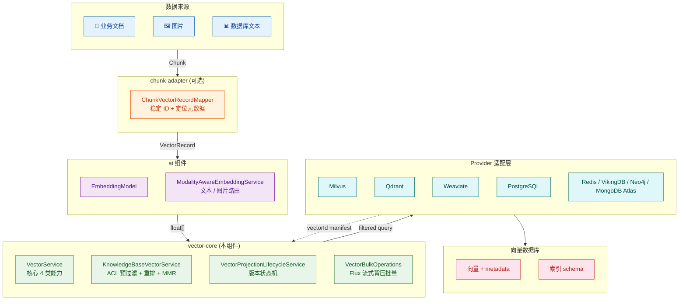
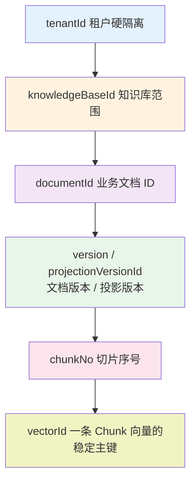
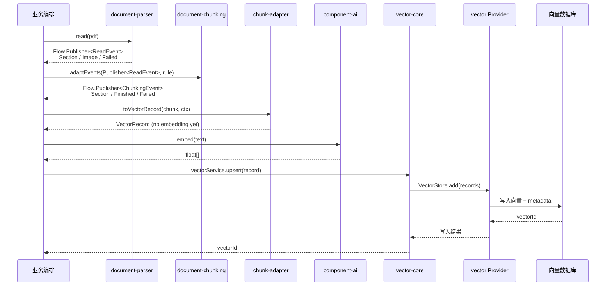
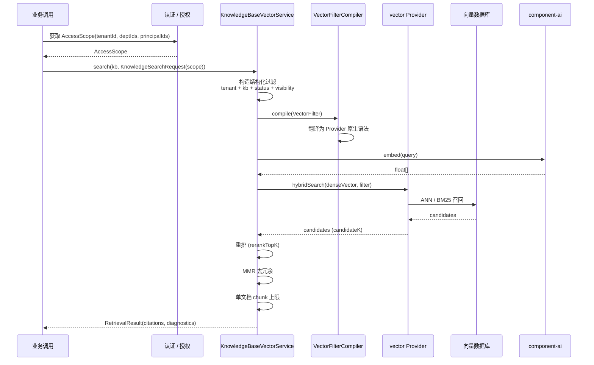
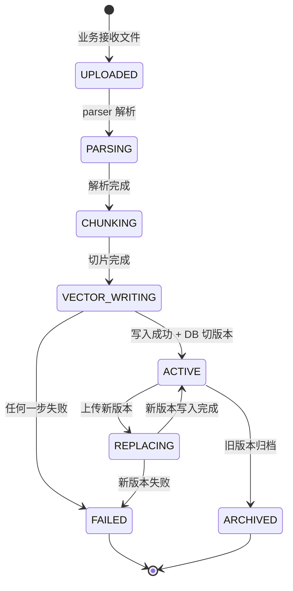
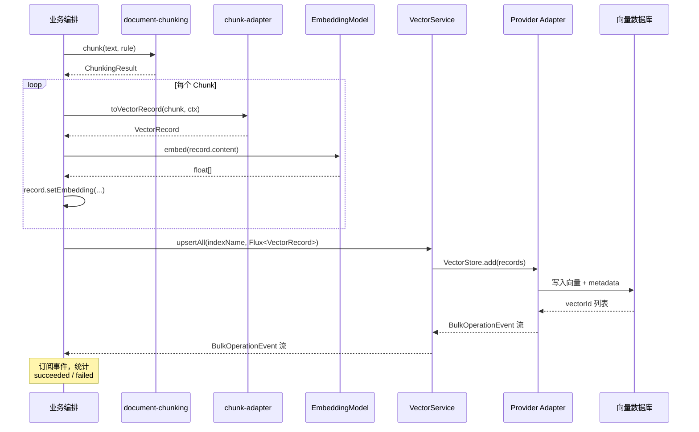
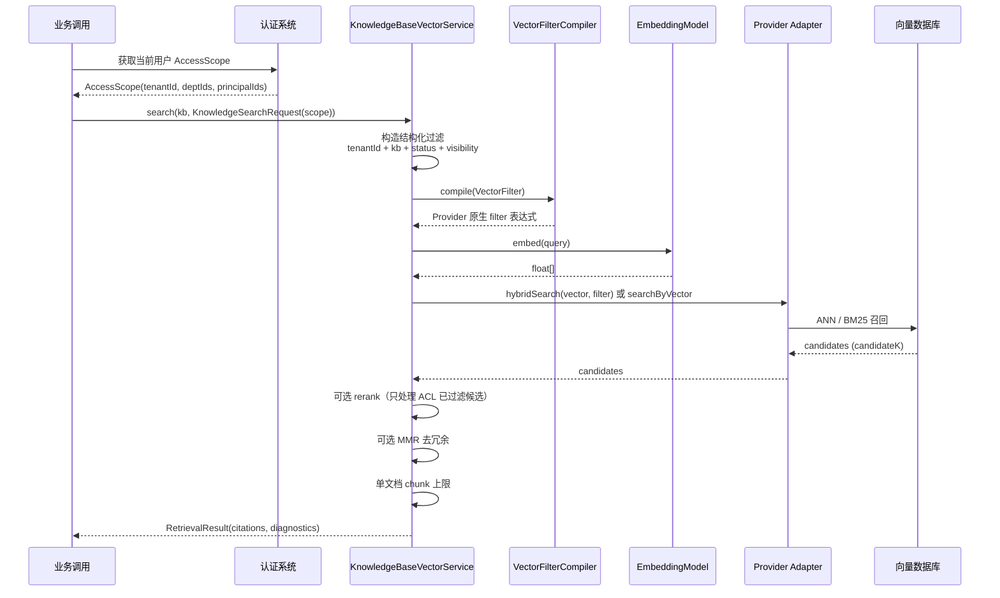
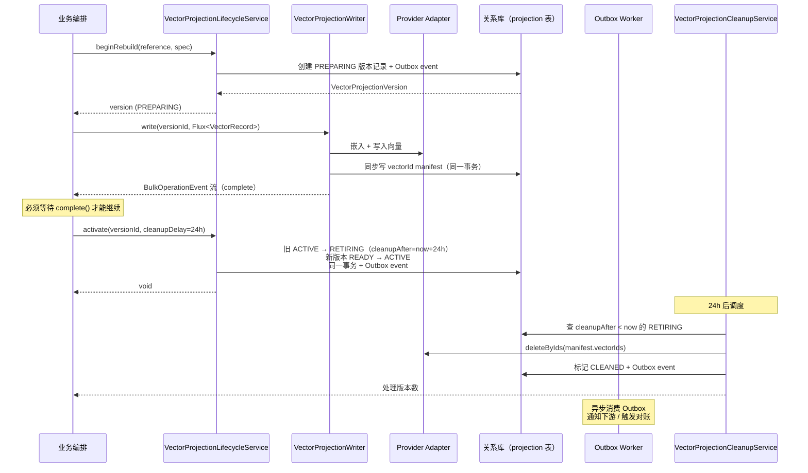

# Atlas Richie 向量组件 (atlas-richie-component-vector)

> **一句话价值**：商用 RAG 知识库的数据访问底座。把"语义相近"与"这条内容是否有权返回"放在同一次查询中完成，不绑定任何具体向量库
> SDK。
>
> **核心定位**：在 RAG 链路中，它 **只负责向量数据面**——文件解析交给 `document-parser`，文本切片交给 `document-chunking`
> ，Embedding/重排交给 `component-ai`，ACL/文档事实由业务系统承担。完整链路：

```text
document-parser → document-chunking → vector-chunk-adapter → vector
                                              │
                                              └── 可选：vector-projection-dao
```

---

## 📖 目录

- [🎯 组件概述](#🎯-组件概述)
    - [主要特性](#主要特性)
    - [与同类组件的边界](#与同类组件的边界)
- [🏗️ 架构设计](#🏗️-架构设计)
    - [整体架构](#整体架构)
    - [数据模型分层](#数据模型分层)
    - [入库链路](#入库链路)
    - [检索链路](#检索链路)
    - [版本投影生命周期](#版本投影生命周期)
- [🚀 快速上手指南](#🚀-快速上手指南)
    - [1. 添加依赖](#1-添加依赖)
    - [2. 选择 Provider](#2-选择-provider)
    - [3. 基础配置](#3-基础配置)
    - [4. 写入与普通检索](#4-写入与普通检索)
    - [5. 商用知识库检索](#5-商用知识库检索)
- [📚 接口详细说明](#📚-接口详细说明)
    - [核心接口（所有 Provider 必须支持）](#核心接口所有-provider-必须支持)
    - [可选能力接口](#可选能力接口)
    - [公共方法清单](#公共方法清单)
- [🔧 核心场景](#🔧-核心场景)
    - [场景 1 — 文档入库与版本治理](#场景-1--文档入库与版本治理)
    - [场景 2 — 商用 RAG 检索与 ACL 下推](#场景-2--商用-rag-检索与-acl-下推)
    - [场景 3 — 流式批量入库与背压控制](#场景-3--流式批量入库与背压控制)
    - [场景 4 — Provider 切换与多模态检索](#场景-4--provider-切换与多模态检索)
- [⚙️ 配置参考](#⚙️-配置参考)
    - [核心配置](#核心配置)
    - [批量入库调优](#批量入库调优)
    - [Provider 配置示例](#provider-配置示例)
- [🔧 故障排查](#🔧-故障排查)
    - [常见问题与解决方案](#常见问题与解决方案)
    - [检索质量调优](#检索质量调优)
- [📎 📊 Provider 能力对比](#📎-📊-provider-能力对比)
    - [Milvus](#milvus)
    - [Qdrant](#qdrant)
    - [Weaviate](#weaviate)
    - [PostgreSQL/pgvector](#postgresqlpgvector)
    - [Redis](#redis)
    - [MongoDB Atlas](#mongodb-atlas)
    - [Neo4j](#neo4j)
    - [VikingDB](#vikingdb)
- [⏱️ 时序图详解](#⏱️-时序图详解)
    - [向量入库时序图](#向量入库时序图)
    - [知识库检索时序图](#知识库检索时序图)
    - [版本投影切换时序图](#版本投影切换时序图)
- [📐 设计说明](#📐-设计说明)
    - [组件要解决的问题](#组件要解决的问题)
    - [边界与职责](#边界与职责)
    - [接口隔离与 Provider 能力声明](#接口隔离与-provider-能力声明)
    - [安全检索与权限模型](#安全检索与权限模型)
    - [批量与一致性](#批量与一致性)
    - [自动装配与扩展原则](#自动装配与扩展原则)
- [✅ 生产使用检查清单](#✅-生产使用检查清单)

---

## 🎯 组件概述

`atlas-richie-component-vector` 是商用 RAG 知识库的数据访问底座。它解决的不是"如何把文本写进向量库"——这件事任何 SDK
都能做——而是 **在多租户、强权限、文档频繁更新、检索质量要求严苛的商用场景下**，如何让业务方不必关心向量库的过滤
DSL、不被某个向量库的运维特性绑死、且仍能保证权限在召回阶段就生效。

组件把向量数据面抽象为四类最通用能力： **写入、按 vectorId 删除、按 ID 查、基础语义检索**。Provider-specific 能力（按
documentId 删除、alias、备份、原生 hybrid、多向量）拆为可选能力接口，Provider **没有的就不实现**
，避免业务方把"不支持"误判为"空结果"。

### 主要特性

- ✅ **统一门面**：`VectorService` / `KnowledgeBaseVectorService` 是所有 Provider 共用入口，业务侧只依赖抽象
- ✅ **10 种 Provider 可插拔**：Milvus、Qdrant、Weaviate、PostgreSQL/pgvector、Redis、MongoDB Atlas、Neo4j、VikingDB，按能力而非品牌声明
- ✅ **ACL 强制下推**：`KnowledgeBaseVectorService` 强制把租户、可见性、状态等结构化条件在 Provider 原生 query
  阶段执行，杜绝"先 Top-K 再 JVM 过滤"导致的内容泄露
- ✅ **能力按 capability 拆分**：核心 4 类通用能力 + 6 类可选能力接口（hybrid / multi-vector / alias / backup / read /
  lifecycle），Provider 只能声明真实支持的能力
- ✅ **流式背压批量**：`Flux<VectorRecord>` 输入 + `Flux<BulkOperationEvent>` 输出，背压可控，并发可调，不会撑爆 JVM
- ✅ **结构化过滤**：`VectorFilter` sealed 表达式树（Eq / In / Range / Exists / ContainsAny / Not / And / Or）由 Provider 的
  `VectorFilterCompiler` 翻译为原生语法，避免字符串拼接
- ✅ **版本投影插件**：`vector-projection-dao` 可选插件提供"新版本先就绪 → 切换可见 → 延迟清理旧版本"流程，让文档更新不出现整篇文档暂时消失
- ✅ **Embedding 解耦**：`EmbeddingModel` 由 `component-ai` 自动注入，组件不持有任何 LLM / 向量模型厂商信息
- ✅ **Chunk → VectorRecord 适配**：`vector-chunk-adapter` 把 `Chunk` 与文档上下文组合为带稳定 ID、版本号、定位信息的向量记录
- ✅ **多模态向量**：文本与图片可通过 `ModalityAwareEmbeddingService` 路由到对应嵌入模型，CLIP 等效空间支持跨模态检索
- ✅ **失败可观测**：`BulkOperationEvent` 流（`Started / ItemStarted / ItemSucceeded / ItemFailed / Completed`）+
  `ChunkingSignal` + `OcrException` 全链路 sealed 异常体系
- ✅ **配置驱动**：`platform.component.vector.provider=milvus` 一行切换底层，无需改业务代码

### 与同类组件的边界

| 组件                           | 关注                                             | 不关注                                               |
|--------------------------------|--------------------------------------------------|------------------------------------------------------|
| **component-vector**（本组件） | 向量数据面：写入、删除、检索、ACL 下推、版本投影 | 文件解析、切片策略、Embedding 模型选型、ACL 事实来源 |
| component-document-parser      | 多格式文档解析（含 SSRF 防护）                   | 切片、向量化                                         |
| component-document-chunking    | 文本切片的 9 种策略                              | 向量库、ACL                                          |
| component-ai                   | Embedding / LLM / 多模态路由                     | 向量库、文档事实                                     |
| component-ocr                  | 8 个 OCR vendor 抽象                             | 切片、向量化                                         |
| **业务应用**                   | 文档事实、权限事实、用户管理、任务调度           | 向量库 SDK、过滤 DSL                                 |

---

## 🏗️ 架构设计

### 整体架构



### 数据模型分层



每一层都有独立的职责：

| 层级     | 字段                              | 为什么需要                                 |
|----------|-----------------------------------|--------------------------------------------|
| 租户层   | `tenantId`                        | 第一层安全边界，必须可在 Provider 侧过滤   |
| 知识库层 | `knowledgeBaseId`                 | 同租户内细分向量空间与权限域               |
| 文档层   | `documentId`                      | 把多个 Chunk 关联为同一份业务文档          |
| 版本层   | `version` / `projectionVersionId` | 区分同文档不同内容版本；支持"先就绪再切换" |
| 切片层   | `chunkNo`                         | 回到原文位置、控制单文档结果数             |
| 记录层   | `vectorId` / `id`                 | 幂等写入、精确删除、manifest 清理、重试    |

### 入库链路



### 检索链路



### 版本投影生命周期



数据库中的 `ACTIVE` 版本是查询时唯一可见版本；向量写入成功但 DB 未切版本时，新版本不进入检索范围。

---

## 🚀 快速上手指南

### 1. 添加依赖

版本由平台 BOM 管理，业务工程通常只需要引入一个 Provider 模块。例如使用 Milvus：

```xml
<dependency>
    <groupId>cn.richie696.component</groupId>
    <artifactId>vector-milvus</artifactId>
</dependency>
```

需要把 chunking 结果直接映射为向量记录时，再额外引入：

```xml
<dependency>
    <groupId>cn.richie696.component</groupId>
    <artifactId>vector-chunk-adapter</artifactId>
</dependency>
```

业务文档会反复更新或删除时，推荐再引入版本投影插件：

```xml
<dependency>
    <groupId>cn.richie696.component</groupId>
    <artifactId>vector-projection-dao</artifactId>
</dependency>
```

> ⚠️ **同一应用实例只应激活一个 Provider**。向量数据不会在多个 Provider
> 间自动复制，更不会在某个库故障时悄悄切换到另一个库检索；这样做会把两个不同数据面混在一起，结果既不完整也无法证明权限正确。

### 2. 选择 Provider

| 场景                                     | 推荐 Provider           | 理由                            |
|------------------------------------------|-------------------------|---------------------------------|
| 商用生产 + 完整能力（hybrid/alias/备份） | **Milvus**              | 能力最全，文档最丰富            |
| 已有 Qdrant 部署 + 中小规模              | **Qdrant**              | API 简洁，单二进制部署友好      |
| 已用 Weaviate 做模块化向量 + RAG         | **Weaviate**            | 原生 hybrid 强，与 GraphQL 集成 |
| 已有 PostgreSQL 集群                     | **PostgreSQL/pgvector** | 减少基础设施，事务一致性强      |
| 极低延迟 + 中小规模                      | **Redis**               | 部署简单，性能高，但能力有限    |
| MongoDB 生态                             | **MongoDB Atlas**       | 与现有文档库融合                |
| 知识图谱 + 向量混合                      | **Neo4j**               | Graph-RAG 专用                  |
| 字节跳动生态                             | **VikingDB**            | 适配火山引擎生态                |

### 3. 基础配置

向量组件只管理向量库和索引配置。`EmbeddingModel` 由 `component-ai` 提供，模型厂商、API Key 和模型路由不应配置在本组件中。

```yaml
platform:
  component:
    ai:
      models:
        text-embedding-v3:
          provider: DASHSCOPE
          api-key: ${DASHSCOPE_API_KEY}
          options:
            model: text-embedding-v3
            dimension: 1024

    vector:
      provider: milvus
      default-index: knowledge_chunks
      bulk:
        embedding-concurrency: 8
        write-batch-size: 100
        write-concurrency: 4
        write-flush-interval-ms: 1000
      indexes:
        knowledge_chunks:
          dimension: 1024
          metric: cosine
          index-type: hnsw
          additional-fields:
            tenantId: { data_type: VarChar, max_length: 64 }
            knowledgeBaseId: { data_type: VarChar, max_length: 64 }
            documentId: { data_type: VarChar, max_length: 64 }
            projectionVersionId: { data_type: VarChar, max_length: 64 }
            visibility: { data_type: VarChar, max_length: 32 }
            status: { data_type: VarChar, max_length: 32 }
            version: { data_type: Int64 }

    ocr:
      vendor: aliyun
      enabled: true
```

Provider 自身的连接地址、认证方式和数据库特有参数仍由对应 Provider 模块配置。

### 标量字段不是普通 metadata

以 Milvus、VikingDB 这类向量库为例，能参加数据库侧过滤的字段 **必须是索引 schema 中声明的标量字段**。仅把值放进 `metadata`
JSON，并不能保证数据库可以用它过滤。

因此请在建索引前确定字段约定，并始终保持三处一致：

1. 写入 `VectorRecord.metadata` 的 key；
2. `VectorFilter` 使用的字段名；
3. 向量库 schema 中的标量字段名。

组件不会猜测 `tenant_id` 与 `tenantId` 是否等价，也不会替业务做字段重命名。团队可以使用 snake_case 或
camelCase，但必须选定一种并在写入、过滤和建表三处统一。字段类型也应一致；例如数值型 ID 应从写入到过滤都按数值处理，不要一部分写字符串、一部分按数值查询。

### 4. 写入与普通检索

`VectorService` 是所有 Provider 都必须实现的最小入口。它只保留四类真正通用的能力：语义检索、幂等写入、按向量 ID 删除和流式批量操作。

```java
VectorRecord record = VectorRecord.text(
        "knowledge_chunks",
        "doc-100:v3:12",
        "员工出差应提前三日提交申请。")
    .setDocumentId("doc-100")
    .setChunkNo(12)
    .setVersion(3L)
    .setMetadata(Map.of(
        "tenantId", "10000",
        "knowledgeBaseId", "hr",
        "visibility", "COMPANY",
        "status", "ACTIVE"));

String vectorId = vectorService.upsert(record);

List<VectorSearchResult> hits = vectorService.searchByText(
        "knowledge_chunks",
        "出差申请需要提前多久？",
        10,
        SearchOptions.builder()
            .filter(VectorFilter.and(
                VectorFilter.eq("tenantId", "10000"),
                VectorFilter.eq("knowledgeBaseId", "hr"),
                VectorFilter.eq("status", "ACTIVE")))
            .rerank(true)
            .build());

vectorService.deleteById("knowledge_chunks", vectorId);
```

`id` 是一条向量记录的主键。它不参与相似度计算，但对于幂等写入、精确删除、失败重试和版本清理不可或缺。推荐使用由
`documentId + version + chunkNo` 构成的稳定 ID；同一文档同一版本的同一切片重复写入时，结果会覆盖而不是重复累积。

> ⚠️ **不要把 `documentId` 用作每一条向量的 ID**。一份文档通常包含多个 Chunk；`documentId` 用于把它们关联为同一份业务文档，而
> `id` 用于唯一定位其中的一条 Chunk 向量。

### 5. 商用知识库检索

普通 `VectorService` 面向"向量库操作"；`KnowledgeBaseVectorService` 面向"用户在知识库里安全地找答案"。业务 RAG 应优先使用后者。

```java
AccessScope scope = new AccessScope(
        "10000",
        Set.of("dept-hr"),
        Set.of("user-9527"),
        false);

KnowledgeSearchRequest request = new KnowledgeSearchRequest(
        "出差申请需要提前多久？",
        8,      // topK
        50,     // candidateK
        scope,
        true,   // rerank
        false,  // hybrid
        null,   // keywordQuery
        false,  // mmr
        0.6,    // mmrLambda
        2,      // maxChunksPerDocument
        null);  // additionalFilter

RetrievalResult result = knowledgeBaseVectorService.search("hr", request);
```

知识库门面会自动构造并下推以下基础约束：

```text
tenantId = 当前租户
AND knowledgeBaseId = 当前知识库
AND status = ACTIVE
AND 调用人满足文档可见性规则
```

返回结果包含 `RetrievalCitation`（带 `documentId`、`chunkNo`、内容、得分、metadata）和 `RetrievalDiagnostics`（候选数、最终返回数、是否使用
hybrid、是否重排、耗时）。

---

## 📚 接口详细说明

### 核心接口（所有 Provider 必须支持）

```java
public interface VectorService extends
        VectorSearchOperations,
        VectorRecordWriteOperations,
        VectorRecordDeleteOperations,
        VectorBulkOperations {
}

public interface VectorSearchOperations {
    List<VectorSearchResult> searchByText(String indexName, String text, int limit);
    List<VectorSearchResult> searchByText(String indexName, String text, int limit, double minScore);
    List<VectorSearchResult> searchByText(String indexName, String text, int limit, SearchOptions options);
    List<VectorSearchResult> searchByImage(String indexName, byte[] image, String mimeType, int limit);
}

public interface VectorRecordWriteOperations {
    String upsert(VectorRecord record);
}

public interface VectorRecordDeleteOperations {
    void deleteById(String indexName, String vectorId);
    void deleteByIds(String indexName, Collection<String> vectorIds);
}

public interface VectorBulkOperations {
    Flux<BulkOperationEvent> upsertAll(String indexName, Flux<VectorRecord> records);
}
```

### 可选能力接口

```java
// 精确主键读取（适用于详情回溯、排障）
public interface VectorRecordReadOperations {
    Optional<VectorRecord> getById(String indexName, String vectorId);
    List<VectorRecord> getByIds(String indexName, Collection<String> vectorIds);
}

// 原生 hybrid 检索（dense + sparse/BM25）
public interface VectorHybridSearchOperations {
    List<VectorSearchResult> hybridSearch(String indexName, String text, String keyword,
                                         int limit, SearchOptions options);
}

// ACL-aware hybrid（hybrid 召回时也能下推权限过滤）
public interface VectorAclAwareHybridSearchOperations {
    List<VectorSearchResult> hybridSearch(String indexName, String text, String keyword,
                                         int limit, AccessScope scope, SearchOptions options);
}

// 多向量联合检索（named vector、多模态、多模型）
public interface VectorMultiVectorSearchOperations {
    List<VectorSearchResult> searchByMultiVector(String indexName, List<float[]> vectors, int limit);
}

// collection/index 生命周期
public interface VectorIndexLifecycleOperations {
    void createIndex(String indexName, VectorProperties.IndexConfig config);
    void deleteIndex(String indexName);
    boolean indexExists(String indexName);
}

// 索引统计
public interface VectorIndexStatsOperations {
    long countDocuments(String indexName);
    IndexInfo describeIndex(String indexName);
    Map<String, IndexInfo> listIndexes();
    boolean healthCheck(String indexName);
}

// 蓝绿重建 alias 切换
public interface VectorIndexAliasOperations {
    boolean createAlias(String indexName, String alias);
    boolean switchAlias(String oldIndexName, String newIndexName, String alias);
}

// 快照 / 备份 / 恢复
public interface VectorBackupOperations {
    void backup(String indexName, String targetPath);
    void restore(String indexName, String sourcePath);
}
```

> ⚠️ **没有实现某项接口，就表示该 Provider 没有向业务承诺这项能力**
> 。不要依赖"默认实现返回空集合"来判断不支持；不支持应当通过类型系统或明确异常暴露出来。

### 公共方法清单

| 方法                                                  | 在哪                               | 何时调用                        |
|-------------------------------------------------------|------------------------------------|---------------------------------|
| `vectorService.upsert(record)`                        | `VectorRecordWriteOperations`      | 单条幂等写入                    |
| `vectorService.upsertAll(indexName, Flux)`            | `VectorBulkOperations`             | 流式批量写入（背压）            |
| `vectorService.searchByText(...)`                     | `VectorSearchOperations`           | 普通语义检索                    |
| `vectorService.deleteById(indexName, vectorId)`       | `VectorRecordDeleteOperations`     | 精确删除单条                    |
| `vectorService.deleteByIds(indexName, ids)`           | `VectorRecordDeleteOperations`     | 精确删除多条                    |
| `knowledgeBaseVectorService.search(kb, request)`      | `KnowledgeBaseVectorService`       | 商用 RAG 检索（带 ACL）         |
| `projectionService.beginRebuild(ref, spec)`           | `VectorProjectionLifecycleService` | 创建新 projection 版本          |
| `projectionService.activate(versionId, cleanupDelay)` | `VectorProjectionLifecycleService` | 激活新版本，旧版本转 RETIRING   |
| `projectionService.markFailed(versionId, reason)`     | `VectorProjectionLifecycleService` | 标记失败                        |
| `projectionService.findVersion(versionId)`            | `VectorProjectionLifecycleService` | 查询版本快照                    |
| `cleanupService.cleanupDueProjections(maxVersions)`   | `VectorProjectionCleanupService`   | 清理到期 RETIRING（调用方调度） |

---

## 🔧 核心场景

### 场景 1 — 文档入库与版本治理

**业务场景**：HR
知识库每天有几十份制度文件更新，需要在用户搜索时永远返回最新版本，但不能因为"半批写入已对外可见"导致旧版本内容闪回或丢失。

**实现路径**：

```java
@Service
@RequiredArgsConstructor
public class HrPolicyIngestService {

    private final VectorProjectionLifecycleService lifecycle;
    private final VectorProjectionWriter writer;
    private final DocumentParser reader;
    private final ChunkingService chunker;
    private final ChunkVectorRecordMapper mapper;
    private final EmbeddingModel embedding;
    private final VectorRecordWriteOperations vector;

    public void ingest(File pdf, String documentId, String tenantId, String sourceVersion) {
        // 1. 创建新 projection 版本（初始状态 PREPARING）
        VectorProjectionReference reference = new VectorProjectionReference(
                tenantId, "hr", documentId);
        VectorProjectionSpecification specification = new VectorProjectionSpecification(
                sourceVersion, "hr_policies", "text-embedding-v3");
        VectorProjectionVersion version = lifecycle.beginRebuild(reference, specification);

        // 2. 解析 → 切片 → 嵌入 → 写入（manifest 自动同步）
        List<Chunk> chunks = parseAndChunk(pdf);
        Flux<VectorRecord> records = Flux.fromIterable(chunks)
                .map(chunk -> mapper.toVectorRecord(chunk,
                        new VectorRecordContext("hr_policies", documentId, 1L, "default",
                                Map.of("visibility", "COMPANY", "status", "ACTIVE"))))
                .handle((rec, sink) -> {
                    rec.setEmbedding(embedding.embed(rec.getContent().text()));
                    sink.next(rec);
                });

        writer.write(version.versionId(), records)
                .doOnNext(event -> log.info("write event: {}", event.getClass().getSimpleName()))
                .blockLast();

        // 3. 激活新版本（写入完成 + 版本 READY 之后才能调用）
        lifecycle.activate(version.versionId(), Duration.ofHours(24));

        // 4. 旧版本会被自动标记为 RETIRING，由定时任务按 manifest 在 24 小时后清理
    }

    private List<Chunk> parseAndChunk(File pdf) {
        ReadResult doc = reader.read(pdf);
        ChunkingResult result = chunker.chunk(doc.sections().get(0).text(),
                ChunkingRule.recursiveDefaults(1600, 160));
        return result.chunks();
    }
}
```

**关键约束**：

- 必须等待 `writer.write(...)` 的 `Flux` 正常 `complete()` 后再调用 `activate`
- 失败时调用 `markFailed(reason)`，原版本仍可服务
- 旧版本清理由 Quartz / XXL-Job / 业务定时任务调用 `cleanupService.cleanupDueProjections(batchSize)`

### 场景 2 — 商用 RAG 检索与 ACL 下推

**业务场景**：员工 Alice 在 HR 部门，她应该能查 HR 部门的制度、公司的公开制度，但不能查财务部的敏感文件，也不能查其他租户的文档。

**实现路径**：

```java
@Service
@RequiredArgsConstructor
public class HrQaService {

    private final KnowledgeBaseVectorService kbVector;
    private final AiChatService ai;

    public String answer(String question, AccessScope scope) {
        // 1. 检索（ACL 自动下推）
        RetrievalResult result = kbVector.search("hr",
                KnowledgeSearchRequest.builder()
                        .query(question)
                        .topK(8)
                        .candidateK(100)
                        .accessScope(scope)
                        .rerankTopK(30)
                        .mmr(true)
                        .mmrLambda(0.6)
                        .maxChunksPerDocument(2)
                        .build());

        // 2. 拼 prompt + 调 LLM
        String context = result.citations().stream()
                .map(c -> "[来源: doc=" + c.documentId() + " chunk=" + c.chunkNo() + "]\n" + c.text())
                .collect(Collectors.joining("\n\n"));
        AiResponse resp = ai.call(AiRequest.ofSystemAndUser(
                "你是 HR 知识库助手，只能基于以下参考资料回答。\n\n" + context,
                question));
        return resp.getContent();
    }
}
```

**关键约束**：

- `AccessScope` 必须由认证系统解析传入， **不要**由前端拼接
- `topK=8`、`candidateK=100`、`rerankTopK=30`：候选池留足重排空间
- `mmr=true` + `maxChunksPerDocument=2`：避免单一文档霸榜
- `RetrievalCitation` 必须展示给用户，让用户能追溯答案来源

### 场景 3 — 流式批量入库与背压控制

**业务场景**：一次性导入 10 万条历史记录到向量库，要求不能撑爆 JVM、嵌入模型不能被打到限流、写入失败可逐条重试。

**实现路径**：

```java
@Service
@RequiredArgsConstructor
public class BulkImportService {

    private final VectorService vectorService;
    private final EmbeddingModel embedding;
    private final MeterRegistry meterRegistry;

    public Mono<Long> bulkImport(String indexName, Flux<RawRecord> source) {
        return source
                .map(raw -> {
                    VectorRecord record = VectorRecord.text(indexName, raw.id, raw.text)
                            .setDocumentId(raw.docId)
                            .setChunkNo(raw.chunkNo)
                            .setVersion(raw.version)
                            .setMetadata(raw.metadata);
                    record.setEmbedding(embedding.embed(record.getContent().text()));
                    return record;
                })
                .transform(vectorService::upsertAll)
                .doOnNext(event -> {
                    if (event instanceof BulkOperationEvent.ItemSucceeded s) {
                        meterRegistry.counter("vector.bulk.success").increment();
                    } else if (event instanceof BulkOperationEvent.ItemFailed f) {
                        meterRegistry.counter("vector.bulk.failure", "reason", f.errorClass()).increment();
                        log.warn("failed to write vectorId={}, reason={}", f.itemId(), f.message());
                    }
                })
                .filter(event -> event instanceof BulkOperationEvent.Completed)
                .cast(BulkOperationEvent.Completed.class)
                .map(c -> c.summary().succeeded());
    }
}
```

**配置调优**：

```yaml
platform:
  component:
    vector:
      bulk:
        embedding-concurrency: 8       # 嵌入模型 QPS 的 1/2 ~ 2/3
        write-batch-size: 100          # provider 单次写入批大小
        write-concurrency: 4           # 写入并发
        write-flush-interval-ms: 1000  # 攒批最大等待时间
```

**关键约束**：

- `embedding-concurrency` 受限于模型 QPS，过高会被 429
- `write-batch-size` 受限于 provider 单次请求大小
- `Flux<BulkOperationEvent>` 提供每条记录的细粒度结果，不要依赖 `Completed` 单条统计

### 场景 4 — Provider 切换与多模态检索

**业务场景**：生产用 Milvus，本地开发用 Redis 做轻量测试；产品需要支持"以文搜图"。

**实现路径（Provider 切换）**：

```java
// application-prod.yml
platform:
  component:
    vector:
      provider: milvus

// application-dev.yml
platform:
  component:
    vector:
      provider: redis
      redis:
        host: localhost
        port: 6379
```

业务代码 **完全不变**——只换 yml 文件即可。

**实现路径（多模态）**：

```java
@Service
@RequiredArgsConstructor
public class MultimodalSearchService {

    private final ModalityAwareEmbeddingService embeddingService;
    private final VectorService vectorService;
    private final KnowledgeBaseVectorService kbVector;

    public List<VectorSearchResult> searchByText(String question, AccessScope scope) {
        // 文本 → 向量 → 检索
        return kbVector.search("products",
                KnowledgeSearchRequest.builder()
                        .query(question)
                        .accessScope(scope)
                        .build());
    }

    public List<VectorSearchResult> searchByImage(byte[] imageBytes, String mimeType,
                                                    AccessScope scope) {
        // 图片 → CLIP 多模态向量 → 检索（共享同一向量空间）
        float[] imageVec = embeddingService.embedImage(imageBytes, mimeType);
        return kbVector.searchByVector("products", imageVec, scope, 10);
    }
}
```

**关键约束**：

- 多模态向量必须由 **同一向量空间**的嵌入模型生成（如 CLIP），否则无法跨模态检索
- `ModalityAwareEmbeddingService` 自动按 `VectorContent.modality()` 路由到文本或图片模型
- 一旦换 Provider（如 Redis），跨模态能力可能消失，详见 [Provider 能力对比](#📎-📊-provider-能力对比)

---

## ⚙️ 配置参考

### 核心配置

| 配置                               | 默认值   | 含义                                                                                                                |
|------------------------------------|----------|---------------------------------------------------------------------------------------------------------------------|
| `provider`                         | (无)     | 激活的 provider：`milvus` / `qdrant` / `weaviate` / `postgresql` / `redis` / `mongodb-atlas` / `neo4j` / `vikingdb` |
| `enabled`                          | `true`   | 总开关；`false` 时所有 provider 自动配置不激活                                                                      |
| `default-index`                    | (无)     | 默认索引名；`upsert` 时若不显式指定 `indexName` 即使用此值                                                          |
| `indexes.<name>.dimension`         | (无)     | 向量维度；必须与 Embedding 模型输出维度一致                                                                         |
| `indexes.<name>.metric`            | `cosine` | 距离度量：`cosine` / `l2` / `ip`                                                                                    |
| `indexes.<name>.index-type`        | `hnsw`   | 索引类型：与 provider 相关（如 Milvus 支持 HNSW / IVF_FLAT / ANNOY）                                                |
| `indexes.<name>.replicas`          | `1`      | 副本数（仅分布式 provider 生效）                                                                                    |
| `indexes.<name>.additional-fields` | (无)     | 自定义标量字段；用于 ACL 过滤                                                                                       |

### 批量入库调优

| 配置                           | 默认值 | 推荐范围 | 影响                                         |
|--------------------------------|--------|----------|----------------------------------------------|
| `bulk.embedding-concurrency`   | 8      | 4~16     | 嵌入模型并发；过高会被限流                   |
| `bulk.write-batch-size`        | 100    | 50~500   | 单次写入批大小；过大超过 provider 请求体限制 |
| `bulk.write-concurrency`       | 4      | 2~8      | 写入并发；过大压垮向量库                     |
| `bulk.write-flush-interval-ms` | 1000   | 500~3000 | 攒批最大等待；过小降低吞吐，过大增加延迟     |

### Provider 配置示例

**Milvus**：

```yaml
platform:
  component:
    vector:
      provider: milvus
      milvus:
        host: localhost
        port: 19530
        username: root
        password: ${MILVUS_PASSWORD}
```

**Qdrant**：

```yaml
platform:
  component:
    vector:
      provider: qdrant
      qdrant:
        host: localhost
        port: 6333
        api-key: ${QDRANT_API_KEY}
```

**PostgreSQL/pgvector**：

```yaml
platform:
  component:
    vector:
      provider: postgresql
      postgresql:
        url: jdbc:postgresql://localhost:5432/knowledge
        username: postgres
        password: ${POSTGRES_PASSWORD}
```

**Redis**：

```yaml
platform:
  component:
    vector:
      provider: redis
      redis:
        host: localhost
        port: 6379
        index-type: HNSW
        distance-metric: COSINE
```

---

## 🔧 故障排查

### 常见问题与解决方案

#### 1. 写入后查不到数据

**症状**：`upsert` 成功返回 `vectorId`，但 `searchByText` 查不到。

**排查路径**：

- 检查 `VectorRecord.metadata.tenantId` 与 `VectorFilter.eq("tenantId", ...)` 是否完全一致（含大小写、下划线）
- 检查 provider 是否需要 `flush()` 才可见（部分 provider 写入有延迟）
- 检查 ACL 条件是否过于严格（先用无条件 `searchByText` 验证数据存在）

#### 2. 检索结果为空但数据存在

**症状**：用 `KnowledgeBaseVectorService` 检索为空，但 `VectorService.searchByText` 能查到数据。

**排查路径**：

- 检查 `AccessScope` 是否正确（`tenantId` 是否匹配）
- 检查文档 `visibility` 字段值（`COMPANY` / `DEPARTMENT` / `CUSTOM` / `PRIVATE`）是否覆盖当前用户
- 检查 `status` 字段是否为 `ACTIVE`
- 关闭 `Visibility` 过滤看是否能查出来（仅临时调试用）

#### 3. 切片报错 `MAX_CHUNKS_REACHED`

**症状**：超大文档切到 10000 个 chunk 时抛 `IllegalStateException`。

**解决**：

- 增加 `max-chunks-per-document`（业务侧评估是否合理）
- 调小 `max-characters`（比如 800 → 更细粒度切片）
- 分多次入库，拆分文档

#### 4. 跨 Provider 切换后检索失败

**症状**：开发用 Redis 测试正常，部署到 Milvus 后查不到。

**排查路径**：

- 检查向量空间兼容性：不同 Embedding 模型输出维度必须一致
- 检查 `metric` 是否对齐（`cosine` vs `l2`）
- 检查 `index-type` 是否被新 provider 支持
- 检查 ACL 标量字段是否在 Milvus schema 中声明（Redis 默认全过滤，Milvus 必须显式 schema）

#### 5. hybrid 检索被静默降级为 dense

**症状**：调用 `hybrid=true` 时 Provider 仅返回 dense 结果。

**原因**：当前 Provider 不支持 ACL-aware hybrid（参见 [Provider 能力对比](#📎-📊-provider-能力对比)）。

**解决**：

- 显式声明该 Provider 不支持 hybrid，业务侧选择其他方式（关键词预处理 + dense）
- 切换到支持 ACL-aware hybrid 的 Provider（如 Milvus、Weaviate）
- 不要靠"看起来工作"来假设 hybrid 在生效

#### 6. 大文档内存溢出

**症状**：导入大 PDF 时 OOM。

**排查路径**：

- 确认使用 `Flux<VectorRecord>` 流式接口而非 `List<VectorRecord>`
- 调小 `bulk.write-batch-size`，减小单批内存占用
- parser 流式化：`reader.readPublisher(...)` 而非 `reader.read(...)`

### 检索质量调优

| 现象             | 可能原因                    | 调优方向                                 |
|------------------|-----------------------------|------------------------------------------|
| 召回不相关       | Embedding 模型与领域不匹配  | 换领域微调后的模型                       |
| 召回过少         | 距离度量过严                | 调小 `minScore` 阈值                     |
| 召回过多且不精确 | `candidateK` 太大           | 减小 `candidateK`、调大 `minScore`       |
| 同一文档霸榜     | `maxChunksPerDocument` 过大 | 调小 `maxChunksPerDocument` 到 2~3       |
| 重复段落多       | MMR 未启用                  | 启用 `mmr=true`、`lambda=0.6`            |
| 排序不准         | 未启用 rerank               | 启用 `rerank=true`、选合适的 rerank 模型 |

---

## 📎 📊 Provider 能力对比

> ⚠️ **不要因为接口名称相同，就假设其具有相同的原生语义或运维能力**。不同 provider 的 `createIndex` 可能包含完全不同的
> metadata、不同的副本模型、不同的可用性保证。

### Milvus

| 能力                                   | 支持 | 备注                       |
|----------------------------------------|------|----------------------------|
| `VectorSearchOperations`               | ✅   | 完整支持                   |
| `VectorRecordReadOperations`           | ✅   | 按 vectorId 高效读取       |
| `VectorRecordDeleteOperations`         | ✅   | 单条 + 批量 + byFilter     |
| `VectorDocumentOperations`             | ✅   | 按 documentId 删除         |
| `VectorIndexLifecycleOperations`       | ✅   | createIndex / dropIndex    |
| `VectorIndexStatsOperations`           | ✅   | 完整统计                   |
| `VectorIndexAliasOperations`           | ✅   | createAlias / switchAlias  |
| `VectorHybridSearchOperations`         | ✅   | dense + sparse             |
| `VectorAclAwareHybridSearchOperations` | ✅   | **hybrid 时 ACL 下推**     |
| `VectorMultiVectorSearchOperations`    | ✅   | named vector               |
| `VectorBackupOperations`               | ⚠️   | 仅 metadata 备份，不含向量 |
| 多模态（CLIP）                         | ✅   | 1024 维共享空间            |

### Qdrant

| 能力                                   | 支持 | 备注                                          |
|----------------------------------------|------|-----------------------------------------------|
| `VectorSearchOperations`               | ✅   | 完整                                          |
| `VectorRecordReadOperations`           | ✅   | 高效                                          |
| `VectorRecordDeleteOperations`         | ✅   | 完整                                          |
| `VectorDocumentOperations`             | ✅   | byFilter                                      |
| `VectorIndexLifecycleOperations`       | ✅   | collection 管理                               |
| `VectorIndexStatsOperations`           | ✅   | 完整                                          |
| `VectorIndexAliasOperations`           | ❌   | 无 alias 概念                                 |
| `VectorHybridSearchOperations`         | ⚠️   | dense + sparse 但 sparse 需预先生成           |
| `VectorAclAwareHybridSearchOperations` | ⚠️   | filter 可下推但 hybrid 双通道需业务侧各自处理 |
| `VectorMultiVectorSearchOperations`    | ❌   | 无 named vector 概念                          |
| `VectorBackupOperations`               | ✅   | snapshot 备份                                 |
| 多模态（CLIP）                         | ❌   | 需第三方 CLIP 服务                            |

### Weaviate

| 能力                                   | 支持 | 备注                    |
|----------------------------------------|------|-------------------------|
| `VectorSearchOperations`               | ✅   | 完整                    |
| `VectorRecordReadOperations`           | ✅   | 高效                    |
| `VectorRecordDeleteOperations`         | ✅   | 完整                    |
| `VectorDocumentOperations`             | ✅   | byFilter                |
| `VectorIndexLifecycleOperations`       | ✅   | collection 管理         |
| `VectorIndexStatsOperations`           | ✅   | 完整                    |
| `VectorIndexAliasOperations`           | ❌   | 无 alias 概念           |
| `VectorHybridSearchOperations`         | ✅   | **原生 hybrid 强项**    |
| `VectorAclAwareHybridSearchOperations` | ✅   | filter 与 hybrid 集成   |
| `VectorMultiVectorSearchOperations`    | ⚠️   | 通过 named vectors 实现 |
| `VectorBackupOperations`               | ✅   | 完整                    |
| 多模态（CLIP）                         | ✅   | 原生支持                |

### PostgreSQL/pgvector

| 能力                                   | 支持 | 备注                               |
|----------------------------------------|------|------------------------------------|
| `VectorSearchOperations`               | ✅   | 完整                               |
| `VectorRecordReadOperations`           | ✅   | 主键读取                           |
| `VectorRecordDeleteOperations`         | ✅   | SQL 级                             |
| `VectorDocumentOperations`             | ✅   | SQL WHERE                          |
| `VectorIndexLifecycleOperations`       | ✅   | DDL 完整                           |
| `VectorIndexStatsOperations`           | ✅   | pg_stats                           |
| `VectorIndexAliasOperations`           | ❌   | 无 alias（可用视图模拟）           |
| `VectorHybridSearchOperations`         | ❌   | 需结合 ES 或 tsvector              |
| `VectorAclAwareHybridSearchOperations` | ❌   | 不支持                             |
| `VectorMultiVectorSearchOperations`    | ❌   | 单表单向量                         |
| `VectorBackupOperations`               | ✅   | pg_dump                            |
| 多模态（CLIP）                         | ❌   | 需外挂                             |
| **优点**                               | —    | **事务一致性强、复用现有基础设施** |

### Redis

| 能力                                   | 支持 | 备注                              |
|----------------------------------------|------|-----------------------------------|
| `VectorSearchOperations`               | ✅   | 高速                              |
| `VectorRecordReadOperations`           | ✅   | 高效                              |
| `VectorRecordDeleteOperations`         | ✅   | 完整                              |
| `VectorDocumentOperations`             | ⚠️   | byFilter 性能一般                 |
| `VectorIndexLifecycleOperations`       | ✅   | 完整                              |
| `VectorIndexStatsOperations`           | ✅   | 基础                              |
| `VectorIndexAliasOperations`           | ❌   | 无                                |
| `VectorHybridSearchOperations`         | ❌   | 不支持                            |
| `VectorAclAwareHybridSearchOperations` | ❌   | 不支持                            |
| `VectorMultiVectorSearchOperations`    | ❌   | 不支持                            |
| `VectorBackupOperations`               | ⚠️   | 需 RDB                            |
| 多模态（CLIP）                         | ❌   | 不支持                            |
| **适用**                               | —    | 中小规模、低延迟、已有 Redis 集群 |

### MongoDB Atlas

| 能力                                   | 支持 | 备注              |
|----------------------------------------|------|-------------------|
| `VectorSearchOperations`               | ✅   | 需 MongoDB 7.0+   |
| `VectorRecordReadOperations`           | ✅   | 完整              |
| `VectorRecordDeleteOperations`         | ✅   | 完整              |
| `VectorDocumentOperations`             | ✅   | byFilter          |
| `VectorIndexLifecycleOperations`       | ✅   | collection        |
| `VectorIndexStatsOperations`           | ✅   | 基础              |
| `VectorIndexAliasOperations`           | ❌   | 无                |
| `VectorHybridSearchOperations`         | ❌   | 不支持            |
| `VectorAclAwareHybridSearchOperations` | ❌   | 不支持            |
| `VectorMultiVectorSearchOperations`    | ❌   | 不支持            |
| `VectorBackupOperations`               | ✅   | mongodump         |
| 多模态（CLIP）                         | ❌   | 不支持            |
| **适用**                               | —    | 已有 MongoDB 生态 |

### Neo4j

| 能力                                   | 支持 | 备注                                   |
|----------------------------------------|------|----------------------------------------|
| `VectorSearchOperations`               | ✅   | 需 Neo4j 5.x + Vector Index            |
| `VectorRecordReadOperations`           | ✅   | 高效                                   |
| `VectorRecordDeleteOperations`         | ✅   | 完整                                   |
| `VectorDocumentOperations`             | ✅   | byFilter                               |
| `VectorIndexLifecycleOperations`       | ✅   | 完整                                   |
| `VectorIndexStatsOperations`           | ✅   | 完整                                   |
| `VectorIndexAliasOperations`           | ❌   | 无                                     |
| `VectorHybridSearchOperations`         | ❌   | 不支持                                 |
| `VectorAclAwareHybridSearchOperations` | ❌   | 不支持                                 |
| `VectorMultiVectorSearchOperations`    | ❌   | 不支持                                 |
| `VectorBackupOperations`               | ✅   | 完整                                   |
| 多模态（CLIP）                         | ❌   | 不支持                                 |
| **适用**                               | —    | **Graph-RAG：实体关系 + 向量混合检索** |

### VikingDB

| 能力                                   | 支持 | 备注           |
|----------------------------------------|------|----------------|
| `VectorSearchOperations`               | ✅   | 完整           |
| `VectorRecordReadOperations`           | ❌   | 当前不声明     |
| `VectorRecordDeleteOperations`         | ✅   | 完整           |
| `VectorDocumentOperations`             | ⚠️   | 部分支持       |
| `VectorIndexLifecycleOperations`       | ✅   | 完整           |
| `VectorIndexStatsOperations`           | ✅   | 基础           |
| `VectorIndexAliasOperations`           | ❌   | 当前不声明     |
| `VectorHybridSearchOperations`         | ❌   | 不支持         |
| `VectorAclAwareHybridSearchOperations` | ❌   | 不支持         |
| `VectorMultiVectorSearchOperations`    | ❌   | 不支持         |
| `VectorBackupOperations`               | ❌   | 当前不声明     |
| 多模态（CLIP）                         | ❌   | 不支持         |
| **适用**                               | —    | 字节跳动生态内 |

---

## ⏱️ 时序图详解

### 向量入库时序图



### 知识库检索时序图



### 版本投影切换时序图



---

## 📐 设计说明

### 组件要解决的问题

向量数据库看起来像"带了 Embedding 字段的表"，但在商用 RAG 中，真正难的不是把文本写进去，而是同时保证以下几件事：

1. 用户问一个问题时，能召回语义相关的 Chunk；
2. 召回阶段就排除其他租户、其他知识库和无权限文档；
3. 文档更新过程中不出现整篇文档暂时消失或新旧内容混杂；
4. 大批量入库不会因为堆积 Chunk 和 Embedding 撑爆 JVM，也不会重复调用模型；
5. 业务不被某一个向量数据库的 SDK、过滤 DSL 和运维术语绑死；
6. Provider 不具备的能力不能被伪装成"能用"，更不能安静地返回不安全或不完整的结果。

本组件的所有主要设计，都围绕这些问题展开。

### 边界与职责

**组件负责什么**：

- 将文本或图片内容路由到已经提供的 `EmbeddingModel`
- 写入、删除和检索向量记录
- 将结构化过滤翻译为 Provider 可执行的条件
- 为知识库检索强制拼接 ACL 与版本约束
- 为批量任务提供流式、受控并发的入库通道
- 以可选插件的形式提供切片映射和版本投影治理

**组件刻意不负责什么**：

- 文件上传、文档解析、OCR、切片策略
- 大模型厂商、模型实例、API Key 与模型费用策略
- 用户、部门、角色关系的事实存储与授权决策
- 跨 Provider 数据复制、分布式事务或故障自动切库
- 把不能可靠支持的数据库能力伪装成统一能力

### 接口隔离与 Provider 能力声明

向量数据库的共同部分很小：写入、删除、基础语义检索和批量流。把读取、alias、备份、hybrid 等能力都塞进一个大接口，会迫使 Provider
写出大量"暂不支持"的实现，调用方也无法从类型上判断能否使用。

因此核心接口采用最小集合：

```text
VectorService
  ├── VectorSearchOperations
  ├── VectorRecordWriteOperations
  ├── VectorRecordDeleteOperations
  └── VectorBulkOperations
```

精确读取、原生 hybrid、多向量、索引生命周期、统计、alias 和备份被拆为独立能力接口。Provider 只有真正支持且语义可靠时才实现相应接口。

**这不是为了让代码"更漂亮"，而是为了防止业务把"不支持"误当成"空结果"**：

- 不支持 hybrid 时，必须明确报不支持，不能降级成 dense 后假装是混合检索；
- 不支持 ACL-safe hybrid 时，知识库门面拒绝 hybrid 请求，不能让 sparse 通道绕过权限；
- 不支持按文档删除时，版本投影插件仍可借助 manifest 按 `vectorId` 清理；
- 不支持 alias、备份时，运维脚本可在调用前通过接口能力判断，而不是在线上临时踩坑。

### 安全检索与权限模型

**权限必须在召回之前生效**："先查询
Top-K，再在应用内删除无权限结果"是不安全的。它会导致真正有权限的内容因候选池被无权限内容占满而无法召回；更严重的是，后续重排、缓存、日志或异常分支很容易接触到不该出现的数据。

因此 `KnowledgeBaseVectorService` 先根据可信的 `AccessScope` 构造 `VectorFilter`，再调用 Provider。只有通过租户、知识库、状态和可见性约束的
Chunk，才有资格进入 dense、sparse、rerank 或 MMR 阶段。

**可见性是数据属性，组织关系是权限事实**：向量记录中保存 `COMPANY`、`DEPARTMENT`、`CUSTOM`、`PRIVATE`
等可见性投影，是为了让数据库能够过滤。用户属于哪些部门、有哪些角色，仍由统一认证授权系统维护，并在查询时转成不可变的
`AccessScope`。

**结构化过滤优于字符串 DSL**：业务方直接拼 Provider 字符串 DSL，会带来字段注入、跨库不可移植、难以审计和难以测试等问题。
`VectorFilter` 用一棵受限表达式树描述"等值、集合、范围与逻辑组合"，由 Provider 的 `VectorFilterCompiler` 翻译为原生语法。

### 批量与一致性

**为什么采用流式批量，而不是 `List` 一次性处理**：上传一个大型 PDF 后，解析、切片、嵌入和写入都可能产生成千上万条记录。如果每一段都先放进
List，再统一 Embedding 和入库，内存占用会随文档大小线性增长，失败时也难以知道哪些已经完成。

批量管道采用 `Flux`，使数据可以边产生、边嵌入、边写入；其背压、写入批大小和并发度分别保护
JVM、模型服务和向量库。事件流让任务中心能够展示进度、记录失败或触发重试，但它不替代可靠消息系统。

**为什么不把"更新"实现为先删后写**：先删除旧内容再写新内容，一旦写入失败，文档会直接从知识库消失。版本投影插件采用先写新版本、再激活、后清理旧版本的顺序，并用关系库保存投影状态和
Outbox。这是一种明确的最终一致性设计：不假装向量库与关系库之间存在分布式事务，但保证任何一个可见版本都是完整的。

### 自动装配与扩展原则

核心与 Provider 使用显式 Spring Boot 自动配置，而不扫描整个向量包。这样可以避免引入多个 Provider 后意外创建多个实现，也让每个模块的
Bean 来源更容易审计。

扩展新的 Provider 时，应遵循以下原则：

1. 只实现该数据库真实支持的能力接口
2. 对需要 ACL 的检索，先实现可信的 `VectorFilterCompiler`，再开放知识库门面
3. 明确写入路径是"组件预嵌入"还是"Store 自嵌入"，不得两者重复
4. 不支持的 advanced capability 明确拒绝，不返回伪结果
5. 为索引 schema、字段类型、过滤翻译和权限隔离建立 Provider 契约测试

---

## ✅ 生产使用检查清单

- [ ] 一个应用实例只启用一个 Provider
- [ ] 已为所用索引确认 Embedding 模型、向量维度和距离度量匹配
- [ ] ACL、租户、知识库、状态和版本字段已建成可过滤的标量字段
- [ ] metadata key、过滤字段和物理 schema 字段名/类型完全一致
- [ ] 业务 RAG 使用 `KnowledgeBaseVectorService`，而不是在应用内补做 ACL 过滤
- [ ] 更新文档使用"写新版本 → 激活 → 延迟清理"而不是"先删后写"
- [ ] 已根据模型和数据库容量调整批量并发、批大小与 flush 时间
- [ ] 如启用 hybrid、MMR、alias 或备份，已验证当前 Provider 的对应能力及语义
- [ ] 已对跨租户、跨部门、公司共享、权限变更和文档版本切换建立集成验证
- [ ] Provider 切换有完整的 schema 迁移与向量空间兼容性验证脚本
- [ ] 关键指标（写入吞吐、检索延迟、命中率、ACL 拒绝率）已接入监控
- [ ] 故障转移方案明确：Provider 故障时是降级到 JVM 过滤（不安全）还是直接拒绝服务

---

*Atlas Richie 向量组件 —— 把"语义相近"与"这条内容是否有权返回"放在同一次查询中完成*
