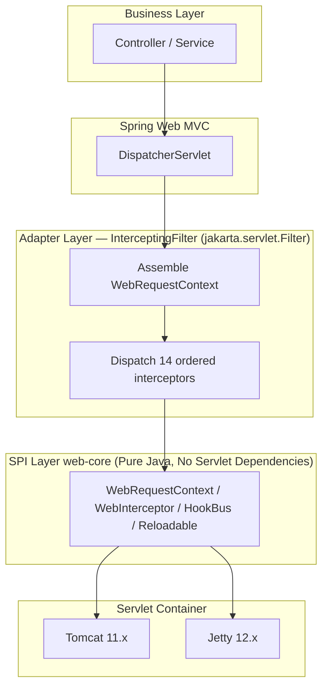
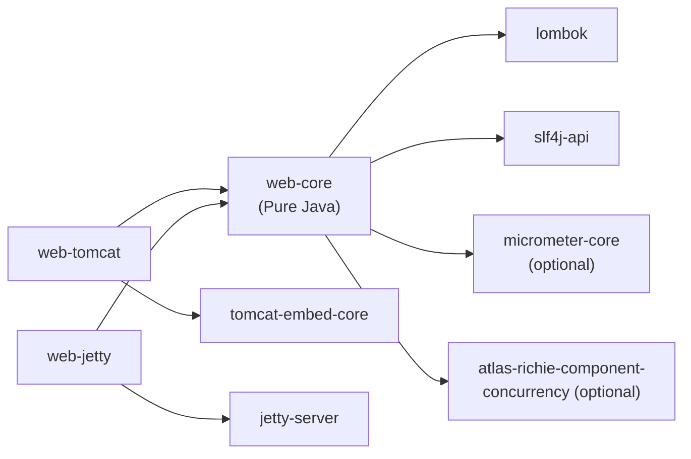

# Atlas Richie Web Component (atlas-richie-component-web)

> A **Servlet container-level capability bus** for Spring Boot 4.x / JDK 25. It weaves in nine cross-cutting value points uniformly before `DispatcherServlet`: **container-level rate limiting**, **circuit breaker and degradation**, **OTEL Trace propagation**, **slow/hanging request detection**, **request-level instrumentation hook**, **VT-friendly configuration hot reload**, **business degradation SPI**, **platform protection layer** (including BloomFilter pre-validation), and **business capability integration** (multi-tenancy / Idempotency / API version negotiation). The same SPI behaves consistently under **Tomcat 11.x** and **Jetty 12.x**, and business teams switch containers with zero code changes.

---

## 📖 Table of Contents

- [📖 Overview](#📖-overview)
  - [What This Component Is and Is Not](#what-this-component-is-and-is-not)
- [✨ Features](#✨-features)
  - [Core Capabilities (Nine Value Points)](#core-capabilities-nine-value-points)
  - [Design Choices](#design-choices)
- [🏗️ Architecture & Module Layout](#🏗️-architecture--module-layout)
  - [Three-Layer Model](#three-layer-model)
  - [Modules & Dependencies](#modules--dependencies)
  - [Interceptor Chain Execution Order](#interceptor-chain-execution-order)
- [🚀 Quick Start](#🚀-quick-start)
  - [1. Add Dependencies](#1-add-dependencies)
  - [2. Choose a Container Image](#2-choose-a-container-image)
  - [3. Minimal Configuration](#3-minimal-configuration)
  - [4. First Rate Limiting Example](#4-first-rate-limiting-example)
- [🔧 Core Capabilities](#🔧-core-capabilities)
  - [1. Container-Level Rate Limit (Rate Limit)](#1-container-level-rate-limit-rate-limit)
  - [2. Circuit Breaker (Circuit Breaker)](#2-circuit-breaker-circuit-breaker)
  - [3. Trace ID Propagation (OTEL Entry Point)](#3-trace-id-propagation-otel-entry-point)
  - [4. Slow/Hanging Request Detection (Hang Detection)](#4-slowhanging-request-detection-hang-detection)
  - [5. Request-Level Instrumentation Hook](#5-request-level-instrumentation-hook)
  - [6. VT-Friendly Configuration Hot Reload (Hot Reload)](#6-vt-friendly-configuration-hot-reload-hot-reload)
  - [7. Business Degrade (Business Degrade)](#7-business-degrade-business-degrade)
  - [8. Platform Protection Layer (Platform Protection)](#8-platform-protection-layer-platform-protection)
  - [9. Business Capability Integrations (Business Capability Integrations)](#9-business-capability-integrations-business-capability-integrations)
- [⚙️ Configuration Reference](#⚙️-configuration-reference)
  - [Common — `platform.component.web`](#common--platformcomponentweb)
  - [Rate Limit — `platform.component.web.rate-limit`](#rate-limit--platformcomponentwebrate-limit)
  - [Circuit Breaker — `platform.component.web.circuit-breaker`](#circuit-breaker--platformcomponentwebcircuit-breaker)
  - [Trace Propagation — `platform.component.web.tracing`](#trace-propagation--platformcomponentwebtracing)
  - [Slow/Hanging Requests — `platform.component.web.hang-detection`](#slowhanging-requests--platformcomponentwebhang-detection)
  - [Business Degrade — `platform.component.web.degrade`](#business-degrade--platformcomponentwebdegrade)
  - [Platform Protection — `platform.component.web.protection`](#platform-protection--platformcomponentwebprotection)
  - [Business Integration — `platform.component.web.business`](#business-integration--platformcomponentwebbusiness)
- [🎯 Best Practices](#🎯-best-practices)
  - [1. Container Image Selection](#1-container-image-selection)
  - [2. Protection Switch Strategy](#2-protection-switch-strategy)
  - [3. Working with Gateway](#3-working-with-gateway)
  - [4. Interceptor Short-Circuit Semantics](#4-interceptor-short-circuit-semantics)
  - [5. Hook Subscription Red Lines](#5-hook-subscription-red-lines)
  - [6. Division of Responsibilities with the logging side](#6-division-of-responsibilities-with-the-logging-side)
- [🔄 Existing Module Compatibility & Migration](#🔄-existing-module-compatibility--migration)
  - [Existing Code Handling](#existing-code-handling)
  - [Phase Breakdown (All Implemented)](#phase-breakdown-all-implemented)
- [⚠️ Known Limitations](#⚠️-known-limitations)
- [📋 Key Design Decisions](#📋-key-design-decisions)
- [❓ FAQ](#❓-faq)
  - [Q1: Why did the rate limit parameter change not take effect?](#q1-why-did-the-rate-limit-parameter-change-not-take-effect)
  - [Q2: What to do when HangDetection falsely kills long-lived connections?](#q2-what-to-do-when-hangdetection-falsely-kills-long-lived-connections)
  - [Q3: Can a single SPI be used without adding web-core?](#q3-can-a-single-spi-be-used-without-adding-web-core)
  - [Q4: Will protection be executed twice when deployed together with Spring Cloud Gateway?](#q4-will-protection-be-executed-twice-when-deployed-together-with-spring-cloud-gateway)
  - [Q5: How to disable WebSocket / SSE?](#q5-how-to-disable-websocket--sse)
  - [Q6: Is OTEL SDK a required dependency?](#q6-is-otel-sdk-a-required-dependency)
  - [Q7: Behavior when the `concurrency` module is not added?](#q7-behavior-when-the-concurrency-module-is-not-added)
  - [Q8: How to make BloomFilter return 404 automatically on miss?](#q8-how-to-make-bloomfilter-return-404-automatically-on-miss)
  - [Q9: How to hot-swap a business degrade strategy?](#q9-how-to-hot-swap-a-business-degrade-strategy)
  - [Q10: Will WebFlux be supported in the future?](#q10-will-webflux-be-supported-in-the-future)
- [📚 Related Documentation](#📚-related-documentation)

---

## 📖 Overview

### What We Solve

Cross-cutting concerns at the container layer that business teams hit when writing Spring Boot HTTP endpoints. Spring Web MVC already covers 90%, but the remaining 10% **cannot be solved by "just adding a `@Bean`"**:

- How to block **ingress traffic** before the Controller and exclude `actuator/health` at the same time
- When the failure rate on the same key rises, how to do **half-open probing** instead of a hard circuit break
- How **distributed trace context** propagates across the Servlet container layer and bridges with Micrometer Observation
- Which request is slow, where it is stuck, and can we **dump it online without blocking**
- Business teams want to listen to "what my request looks like when it reaches the container layer" without us injecting listeners into business code
- Rate limit / circuit breaker parameters changed — they should **take effect without restart**, and virtual threads should not read stale values

These 9 things are independent yet interdependent, and they need one Spring Boot autoconfig. Spring Boot has **no ready-made answer**: `Resilience4j` is a toolbox, not a container-layer hook; `Sentinel/Alibaba` requires a separate console; `OTEL SDK` is a client SDK, not Spring Web integration; `Spring Boot Actuator` provides metric endpoints but not "call observation hooks". **This component exists to close that gap.**

| Item | Value |
|---|---|
| **Coordinate set** | `atlas-richie-component-web` (parent POM) + 3 submodules |
| **Category** | Cross-cutting infrastructure — Servlet container-layer capability bus |
| **JDK / Spring Boot** | JDK 25 / Spring Boot 4.x |
| **Default container image** | `web-tomcat` (Tomcat 11.x) |
| **Cross-container image** | `web-jetty` (Jetty 12.x, behavior consistent with Tomcat) |
| **Dependency reuse** | `atlas-richie-component-concurrency` (`RateLimiter` / `CircuitBreaker` / Registry) |
| **Default behavior** | **Zero-config ready-to-use** — 9 value points + platform protection + business integration are **all disabled by default**; business teams opt-in as needed |
| **Hard requirement** | Add exactly one container image (`web-tomcat` or `web-jetty`); the other 9 value points, protection, and business integration are **fully optional** |

### What This Component Is and Is Not

| ✅ Provides | ❌ Does NOT Provide |
|--------|---------|
| Container-level unified interceptor chain (14 ordered interceptors + HookBus event bus) | API gateway (routing / load balancing / canary release; use `atlas-richie-gateway-service`) |
| 9 cross-cutting value points (rate limit / circuit breaker / OTEL / Hang / Hook / HotReload / degrade / protection / business integration), all opt-in | Authentication / authorization rules (use `atlas-richie-component-oauth`) |
| Cross-container symmetric SPI (zero code changes when switching Tomcat / Jetty) | Rate limit console / rule push (no Sentinel / Nacos / Apollo client bundled) |
| Platform protection layer (Group A + Group B, enable opt-in as needed) | Gateway-exclusive capabilities (cross-service Token issuance, canary routing) |
| Business degrade SPI (`DegradeStrategy` + `Trigger`) | Database slow query analysis (Datasource-side responsibility) |
| Business context injection (multi-tenancy / Idempotency / API version, opt-in as needed) | Persistent business objects |

> Relationship with the existing web module (the existing CORS / i18n / WebSocket / SSE in `README.zh.md` stay unchanged): the new design is "an independent capability bus layered above", **not a replacement** for existing features — it is additive.

---

## ✨ Features

### Core Capabilities (Nine Value Points)

> **Default behavior: all disabled (opt-in)** — business teams opt-in as needed. Any capability being disabled does not affect normal Spring MVC operation.

- ✅ **Container-level rate limit** — reuses `concurrency.RateLimiter`, per-key bucket token bucket, zero code intrusion; supports custom deny responses via `deny-status` / `deny-body-template` / `deny-headers`.
- ✅ **Circuit breaker and degrade** — reuses `concurrency.CircuitBreaker`, three states and three modes (CLOSED / OPEN / HALF_OPEN), composite trigger by window failure rate + slow call ratio; fallback 503 + JSON default response.
- ✅ **OTEL Trace propagation** — placed at the very front of the interceptor chain (`ORDER=50`), parses according to the W3C `traceparent` spec; writes response header `X-Trace-Id`; naturally compatible with downstream OTel SDK.
- ✅ **Slow/Hanging request detection** — three threshold tiers (`warn` / `dump` / `kill-switch`), static singleton `WatchdogScheduler`; each tier has an `AtomicBoolean` to prevent log flooding; the dump tier writes a `Thread.getAllStackTraces()` snapshot into logs.
- ✅ **Request-level instrumentation hook** — 3 lifecycle events (`RequestCompletedEvent` / `HangEvent` / `ReloadEvent`), synchronous serial dispatch; subscriber exception isolation does not affect other subscribers.
- ✅ **VT-friendly configuration hot reload** — `Reloadable` SPI + `HotReloadRegistry.reload/reloadAll()`; `AtomicReference` swap, VT does not need to wait for old requests to exit; automatically bridges Spring Cloud Config `EnvironmentChangeEvent`.
- ✅ **Business degrade SPI** — `DegradeStrategy` + `Trigger` enum (`RATE_LIMITED` / `BREAKER_OPEN` / `EXCEPTION` / `HANG_DETECTED` / `SLOW_CALL`); supports custom business fallback responses.
- ✅ **Platform protection layer** — Group A (request/header size, SSE/WS bypass, BloomFilter pre-validation) + Group B (Anomaly Detection / Brute Force / API signature); all opt-in; hardcoded Gateway mutual exclusion.
- ✅ **Business capability integration** — multi-tenant parsing (`X-Tenant-Id`), Idempotency same-fingerprint deduplication, API version negotiation (`X-Api-Version`); all opt-in, independent switches.

### Design Choices

> This section answers "why not just use existing solutions" — each is an engineering trade-off, not dogma.

- ✅ **Zero-config default** — adding web-core + a container image is enough to use it; all 9 value points are opt-in; it starts normally without writing any YAML. **All capabilities are optional add-ons; disabled ones do not affect Spring MVC operation.**
- ✅ **Cross-container symmetry** — the same SPI behaves identically on Tomcat / Jetty; the adaptation layer is `jakarta.servlet.Filter` (registered via `FilterRegistrationBean`), avoiding intrusion into container-internal APIs. **Business teams switch containers with zero code changes** (only the starter dependency changes).
- ✅ **Zero intrusion** — does not force business teams to change Controller annotations; does not replace the Spring Boot default container Factory; does not introduce hard dependencies on Nacos / Spring Cloud / Resilience4j. **Business teams should not be locked in**; this component only solves things that Spring Boot's ready-made solutions **cannot do** or **cannot do elegantly**.
- ✅ **Value over API surface** — every design decision must answer "why not just use an existing solution". **Counter-example**: we previously wrote 9 fields of `Connector` configuration, but Spring Boot's `server.tomcat.*` already has all 9 corresponding fields — duplication is waste, so `TomcatProductionCustomizer` / `JettyProductionCustomizer` were ultimately deleted.
- ✅ **SPI layer has no servlet API dependency** (enforcer rule enforced) — all cross-container abstractions are pure Java; web-core can be compiled and tested independently.
- ✅ **Observability is the result, not the input** — each value point ships its own Micrometer metrics (`web.rate_limit.*` / `web.cb.*` / `web.hang.detections` / `web.bloom.miss`); business teams can connect Prometheus/Grafana directly — **no extra Micrometer exporter configuration needed**.
- ✅ **Failures are visible** — any silent failure (rate limit swallowed / circuit breaker write failed / hook exception) logs at ERROR with `ctx.method + path + traceId` for accountability.
- ✅ **Categorically not introduced** — `spring-cloud-context` / `nacos-client` / `apollo-client` / `Resilience4j`. Business teams add these themselves. **Reject "symmetric API" overloads with zero callers** — APIs that exist but are unused are maintenance burden.

---

## 🏗️ Architecture & Module Layout

### Three-Layer Model



**Key boundaries**:
- **The SPI layer has no dependency on any servlet API** (enforcer rule enforced) — all cross-container abstractions are pure Java.
- **The adaptation layer is thin** — `InterceptingFilter` only does "get the underlying req/res, convert to ctx, call the chain, write ctx back to req/res".
- **The functional layer lives in web-core** — adding web-core gives business teams all 9 value points; the container image is responsible only for servlet adaptation.

### Modules & Dependencies



**Registry ownership**: `RateLimiterRegistry` / `CircuitBreakerRegistry` are extracted into `atlas-richie-component-concurrency` and are **not** redefined in web-core. `DegradeStrategyRegistry` stays in web-core (business degrade is a web-layer concept; do not pollute concurrency).

> ⚠️ web-core has zero compile-time spring-cloud dependencies; `HotReloadCloudBridge` activates only when the business application has already added `spring-cloud-context` via `@ConditionalOnClass(name=...)`.

### Interceptor Chain Execution Order

Registration order is execution order, **business teams cannot change it**:

```mermaid
flowchart LR
    subgraph OTel["Observability"]
        I1["① OtelTracing\nORDER=50"]
    end
    subgraph Protect["Platform Protection"]
        I2["② PlatformProtection\nORDER=100"]
        I3["③ BloomFilter\nORDER=150"]
        I4["④ AnomalyDetection\nORDER=200"]
        I5["⑤ BruteForce\nORDER=210"]
        I6["⑥ ApiSignature\nORDER=220"]
    end
    subgraph BizCtx["Business Context"]
        I7["⑦ KeyResolver\nORDER=250"]
        I8["⑧ Tenant\nORDER=260"]
        I9["⑨ Idempotency\nORDER=270"]
        I10["⑩ ApiVersion\nORDER=280"]
    end
    subgraph Limit["Rate Limit / Circuit Breaker"]
        I11["⑪ RateLimit\nORDER=300"]
        I12["⑫ Degrade\nORDER=350"]
        I13["⑬ CircuitBreaker\nORDER=400"]
    end
    subgraph Monitor["Monitoring"]
        I14["⑭ HangDetection\nORDER=500"]
    end

    I1 --> I2 --> I3 --> I4 --> I5 --> I6
    I6 --> I7 --> I8 --> I9 --> I10
    I10 --> I11 --> I12 --> I13
    I13 --> I14
    I14 --> Controller["➡ Business Controller"]
```



**Short-circuit semantics**:

| Decision point | Behavior | Remaining chain |
|---|---|---|
| Rate limit deny | Write 429 response → `ctx.setAttribute(DECISION_ATTRIBUTE)` → do not call `chain.proceed()` | Return immediately |
| Circuit breaker deny | Write 503 response → `ctx.setAttribute(DECISION_ATTRIBUTE)` → do not call `chain.proceed()` | Return immediately |
| Protection deny (Anomaly / BruteForce / ApiSig / PlatformProtection) | Same as above | Return immediately |
| Hang detect threshold triggered | Only publish `HangEvent` + call dump hook, **does not block** | Continue |
| Business exception | InterceptingFilter wraps as `ServletException` and throws | `InterceptingFilter.finally` forcibly publishes `RequestCompletedEvent` |

> Key detail: `HookBus.publish` is never skipped by short-circuit — `InterceptingFilter.finally` forcibly publishes `RequestCompletedEvent`, regardless of whether the request was short-circuited / threw an exception / completed normally.

#### Key Non-Trivial Details

These 4 items come from engineering practice — details that "if not written down, will trip people up":

1. **Requests broken/limited by circuit breaker or rate limit are not considered successful by OTEL** — `OtelTracingInterceptor` only writes response header `X-Trace-Id`; status tagging is decided by the business team by subscribing to `RequestCompletedEvent.responseStatus()`. This component **does not decide whether "this request counts as success" for the business**, because circuit breaker denial (business team may want to count as "success-circuit-break") and rate limit denial (count as "success-limit") have different business meanings.
2. **When multiple deny decisions occur simultaneously** — the response from the "first triggered" one wins (consistent with chain order). For example, rate limit deny (ORDER=300) and circuit breaker deny (ORDER=400) both match — write 429 response, not 503. **Trade-off between response consistency vs. fairness**: choose the former — business teams handle responses by status alone, and won't see status=429 and 503 at the same time.
3. **`HookBus.publish` is never skipped by short-circuit** — `InterceptingFilter.finally` forcibly publishes `RequestCompletedEvent`, regardless of whether the request was short-circuited / threw / completed normally. **This is the minimum contract of the instrumentation system**: once a business team subscribes, the event must be delivered, otherwise missing monitoring data will mislead alerts.
4. **Gateway bypass** — when the `X-Forwarded-From-Gateway` header exists, `PlatformProtectionInterceptor` sets `GATEWAY_BYPASS_ATTRIBUTE=true`; the three Group B interceptors (Anomaly / BruteForce / ApiSignature) check this attribute and skip execution. **This logic is hardcoded** and cannot be disabled by configuration — preventing business teams from accidentally enabling duplicate protection when web and gateway are deployed together.

---

## 🚀 Quick Start

### 1. Add Dependencies

```xml
<!-- Required: SPI + functional layer -->
<dependency>
    <groupId>com.richie.component</groupId>
    <artifactId>atlas-richie-component-web-core</artifactId>
</dependency>

<!-- Choose one container image (Tomcat by default; pick one of the two) -->
<dependency>
    <groupId>com.richie.component</groupId>
    <artifactId>atlas-richie-component-web-tomcat</artifactId>
</dependency>
<!--
<dependency>
    <groupId>com.richie.component</groupId>
    <artifactId>atlas-richie-component-web-jetty</artifactId>
</dependency>
-->

<!-- Optional: rate limit / circuit breaker Registry -->
<dependency>
    <groupId>com.richie.component</groupId>
    <artifactId>atlas-richie-component-concurrency</artifactId>
</dependency>
```

> A container image must be added; starting with only `web-core` fails because the servlet adaptation layer is missing.

### 2. Choose a Container Image

```yaml
# Default uses web-tomcat; switch to Jetty by just changing the dependency, zero changes to business code.
# server.tomcat.* / server.jetty.* are still controlled by Spring Boot standard configuration.
spring:
  threads:
    virtual:
      enabled: true   # VT-friendly: all interceptors run statelessly on VT
```

### 3. Minimal Configuration

**Zero-config ready-to-use** — after adding the dependency, no YAML is required; business teams opt-in any feature they need:

```yaml
# Nothing is required to run. All 9 value points + platform protection + business integration are disabled by default.
```

> Design principle: **all features are optional add-ons; disabled features do not affect normal Spring MVC operation**. Business teams opt-in based on their scenarios:
> - Need rate limit protection → enable `platform.component.web.rate-limit.enabled=true`
> - Need circuit breaker and degrade → enable `platform.component.web.circuit-breaker.enabled=true`
> - Need Trace propagation → enable `platform.component.web.tracing.enabled=true`
> - Need slow/hanging request detection → enable `platform.component.web.hang-detection.enabled=true`
> - Need business degrade → enable `platform.component.web.degrade.enabled=true`
> - Need platform protection (request size / SSE bypass / Bot detection / login brute force / signature verification) → enable `platform.component.web.protection.*`
> - Need business integration (multi-tenancy / Idempotency / API version) → enable `platform.component.web.business.*`

> **When business teams write no configuration**: only `InterceptingFilter` is registered into the servlet container (a thin layer, pure passthrough to DispatcherServlet); all 9 value points are not entered into the interceptor chain.

### 4. First Rate Limiting Example

```java
@RestController
@RequestMapping("/api/orders")
@RequiredArgsConstructor
public class OrderController {

    private final OrderService orderService;

    @GetMapping("/{id}")
    public Order get(@PathVariable String id) {
        return orderService.findById(id);
    }
}
```

```bash
# Trigger rate limit (100 req/s per key, 429 after exceeding)
for i in $(seq 1 200); do
  curl -s -o /dev/null -w "%{http_code}\n" http://localhost:8080/api/orders/123 &
done | sort | uniq -c
# Expected: 100× 200 + 100× 429
```

Subscribe to `RequestCompletedEvent` for accurate metrics:

```java
@Component
class OrderHook {
    OrderHook(HookBus bus) {
        bus.subscribe(RequestCompletedEvent.class, evt -> {
            metrics.counter("order_request_total")
                   .tag("status", String.valueOf(evt.responseStatus()))
                   .increment();
        });
    }
}
```

---

## 🔧 Core Capabilities

### 1. Container-Level Rate Limit (Rate Limit)

**Design purpose**: Let business teams apply per-key inbound rate limiting at the container layer **without writing a single annotation or adding any extra runtime**, decoupled from actuator/health.

**Problem solved**: Bucket4j is a single-key library; Resilience4j RateLimiter requires `@RateLimiter` annotations that intrude into business methods; Sentinel introduces a console. This component = container layer (no business intrusion) + per-key buckets (shared accounting) + no extra runtime.

**Explicitly not doing**:
- ❌ **Does not** provide fine-grained rate-limit semantics like "per method / per user / per IP" — this component focuses on "per clientKey bucket"; finer granularity is implemented by business teams writing `clientKey` into ctx.
- ❌ **Does not** handle quota pre-deduction / quota purchase — business scenarios vary too much; this component only answers "is this request allowed to pass".
- ❌ **Does not** synchronize "cluster-level" rate limiting — an in-memory token bucket on a single node is enough for most scenarios; distributed scenarios are left to business teams to extend with Redis.

**Implementation strategy**: **reuse `atlas-richie-component-concurrency:RateLimiter`**, do not write a TokenBucket yourself. `RateLimitInterceptor` is only a 50-line wrapper.

**Algorithm**: token bucket + lazy refill. The three parameters `capacity` + `refillTokens` + `refillPeriod` support bursts; thread safety is guaranteed by `ConcurrentHashMap.computeIfAbsent` + atomic operations within each key's bucket.

**Disabled by default (opt-in)**: business teams must explicitly enable `platform.component.web.rate-limit.enabled=true` to enter the interceptor chain; if not enabled, RateLimitInterceptor is not registered and `concurrency.RateLimiter` is never called.

**Configuration example**:

```yaml
platform:
  component:
    web:
      rate-limit:
        enabled: true   # Explicit opt-in; default false
        permits-per-second: 100
        deny-status: 429
        deny-body-template: '{"error":"too_many_requests","reason":"{reason}"}'
        deny-headers:
          Retry-After: "1"
```

**Metrics** (Micrometer Counter):
- `web.rate_limit.allow{key}` — number of allowed requests
- `web.rate_limit.reject{reason, pattern}` — number of rejected requests

**Per-interface granularity configuration** (pending implementation):

```yaml
platform:
  component:
    web:
      rate-limit:
        permits-per-second: 100      # Global default
        deny-status: 429
        deny-code: RATE_LIMITED
        deny-msg: "请求过于频繁 (key={key})"
        routes:                       # Override by path
          /api/v1/orders/**:
            permits-per-second: 5
            deny-code: ORDER_RATE_LIMITED
            deny-msg: "下单过快"
```

### 2. Circuit Breaker (Circuit Breaker)

**Design purpose**: Let business teams automatically circuit-break "failure rates shared by a group of keys" at the container layer **without writing annotations or intruding into business methods** — when one auth key's failure rate rises, all requests in the auth namespace are automatically circuit-broken to prevent cascading failure.

**Problem solved**: Resilience4j integration requires writing `@CircuitBreaker` annotations that intrude into business methods; it cannot do "container-layer circuit breaker shared by a group of keys" — when one auth key's failure rate is high, it should be circuit-broken, but current Resilience4j has no such shared key dimension.

**Explicitly not doing**:
- ❌ **Does not** provide "per method / per endpoint" circuit breaker semantics — this component focuses on "isolation by protected resource" (when routes match, CB key = matchedPattern).
- ❌ **Does not** do "semi-automatic recovery" probing (besides standard HALF_OPEN trial) — business teams that need "custom recovery conditions" should use §7 Business Degrade SPI.
- ❌ **Does not** retry — retries amplify cascading failure; if business teams really need retries, use Sentinel / `atlas-richie-component-microservice`.

**Implementation strategy**: **reuse `atlas-richie-component-concurrency:CircuitBreaker`**, do not write your own state machine. `CircuitBreakerInterceptor` is only an 80-line wrapper.

**Disabled by default (opt-in)**: business teams must explicitly enable `platform.component.web.circuit-breaker.enabled=true` to enter the interceptor chain; if not enabled, CircuitBreakerInterceptor is not registered.

**State machine** (three states, three modes):

| State | Behavior | Transition condition |
|---|---|---|
| CLOSED | Execute normally | Window failure rate ≥ threshold → OPEN |
| OPEN | Reject directly (fallback) | wait-duration expires → HALF_OPEN |
| HALF_OPEN | Allow trial traffic probing | trial succeeds → CLOSED / fails → OPEN |

**Parameters** (semantics compatible with Resilience4j):

| Parameter | Default | Meaning |
|---|---|---|
| `failure-rate-threshold` | 50% | Failure rate that triggers circuit breaking |
| `sliding-window-size` | 100 | Number of events in the sliding window |
| `minimum-number-of-calls` | 10 | Minimum count before triggering |
| `slow-call-threshold` | 60% | Slow call ratio that triggers circuit breaking |
| `slow-call-duration-threshold` | 5s | Slow determination threshold |
| `wait-duration-in-open-state` | 30s | OPEN duration |
| `permitted-calls-in-half-open` | 5 | Allowed count in half-open |
| `excluded-exceptions` | `[]` | Exceptions not counted as failures |

**Metrics** (Micrometer Counter/Gauge):
- `web.cb.not_permitted{pattern}` — number of requests rejected in OPEN state
- `web.cb.state{key}` — Gauge for the current CB state (CLOSED=0 / HALF_OPEN=1 / OPEN=2)
- `web.cb.calls{result, pattern}` — counter; business teams report inside a `cb.execute(callable)` closure

### 3. Trace ID Propagation (OTEL Entry Point)

**Design purpose**: Let the `traceId` of distributed tracing **flow through the entire servlet container layer at zero cost** — business teams only need to add web-core; all interceptors, response headers, and `ctx.traceId()` for that request will share the same traceId, naturally compatible when downstream adopts OTel SDK.

**Problem solved**: OTel SDK itself is complex (exporter / propagator / resource), but **the simplest weaving point is the servlet Filter**. This component establishes the trace context at the front of the interceptor chain (ORDER=50), so all subsequent interceptors see `ctx.traceId()` when making decisions — **OTEL SDK is an optional dependency; this component provides the "last mile" entry point for it**.

**Explicitly not doing**:
- ❌ **Does not** embed OTel SDK client / exporter / resource definitions — that is the business team's application-layer responsibility (different service names / exporters / sampling rates).
- ❌ **Does not** weave Spans (no `span.start` / `span.end` inside interceptors) — once the business team adopts OTel SDK, its auto-instrumentation handles this.
- ❌ **Does not** provide trace storage backends — Jaeger / Tempo / Zipkin selection is left to the business team.

**Disabled by default (opt-in)**: business teams must explicitly enable `platform.component.web.tracing.enabled=true` to enter the interceptor chain; if not enabled, OtelTracingInterceptor is not registered and requests do not write the `X-Trace-Id` response header.

**Shape** (current implementation):
- Front of the interceptor chain (`ORDER=50`)
- Reads `ctx.header("traceparent")` and parses traceId per the W3C spec (version 00 + 32-hex + 16-hex + flags)
- If no traceparent → reads `X-Request-Id` (legacy compatibility) → if still none, generates a 32-hex UUID
- Writes to `ctx.traceId()` + response header `X-Trace-Id` (lets downstream correlate)
- **Does not** introduce OTel SDK (business teams add it themselves)

**Configuration**:

```yaml
platform:
  component:
    web:
      tracing:
        enabled: true                          # Explicit opt-in; default false
        response-header-name: X-Trace-Id       # Response header name, default X-Trace-Id
        prefer-w3c: true                       # true: prefer parsing traceparent; false: prefer X-Request-Id
```

**Adopting OTel SDK** (done by the business team):

```java
// 1. Add dependency io.opentelemetry.instrumentation:opentelemetry-spring-boot-starter
// 2. Configure OTEL exporter / resource / service name
// 3. The traceparent written by OtelTracingInterceptor is naturally compatible with OTel auto-instrumentation
```

### 4. Slow/Hanging Request Detection (Hang Detection)

**Design purpose**: Let business teams **obtain a thread stack snapshot when a request actually becomes slow**, instead of merely seeing numeric alerts.

**Problem solved**: Spring Boot Actuator's `http.server.requests` is a metric reporter; it **does not know** the real state of a single request — it only tells you "average latency is 500ms", but not "this request is stuck waiting on JDBC". Datasource slow query logs also only report numbers, not stacks. This component provides **threshold-triggered online dump** (stack / heap / coverage) instead of just recording numbers.

**Explicitly not doing**:
- ❌ **Does not** provide a full "Application Performance Monitoring (APM)" solution — that is the domain of OTel / SkyWalking / Arthas; this component focuses on "stack snapshots when requests slow".
- ❌ **Does not** automatically kill hung request threads — the HTTP protocol contract does not kill worker threads; the kill-switch tier only cooperatively interrupts via `Thread.interrupt()`, and business code should respond to `InterruptedException` to exit actively.
- ❌ **Does not** analyze heap after automatic dump — it stops at dumping to logs; heap / coverage analysis is triggered by the business team with `arthas` / `async-profiler` (see optional trigger list in configuration section).
- ❌ **Does not** run slow detection for "SSE / WebSocket long-lived connections" — these are long-lived, so "slow" is meaningless; they are bypassed via §8 Group A `long-lived-bypass.paths`.

**Disabled by default (opt-in)**: business teams must explicitly enable `platform.component.web.hang-detection.enabled=true` to enter the interceptor chain; if not enabled, HangDetectionInterceptor is not registered and `WatchdogScheduler.DEFAULT` is never used.

**Shape**: when the interceptor starts, it registers a callback for `${thresholdMs}` later with `ScheduledExecutorService`; **does not block the request**.

**Trigger implementation**:
- **Static singleton `WatchdogScheduler.DEFAULT`** (double-checked locking lazy init, **not a spring bean**); core count = `Runtime.getRuntime().availableProcessors()`, daemon threads, name `richie-hang-detect-{n}`
- **3 `ScheduledFuture`s per request** (warn / dump / kill-switch each), not one Timer per request: at 1000 QPS, Timer's ThreadLocal pressure triggers GC jitter
- **The 3 `ScheduledFuture`s are `cancel(false)` at `ctx.close()`** (request completion): avoids dumping completed requests
- **Threshold chain with 3 tiers**:
  - `warn`: WARN log + publish `HangEvent` + metrics `web.hang.detections{level="warn"}`
  - `dump`: WARN log + **`Thread.getAllStackTraces()` snapshot to logs** + publish `HangEvent` + metrics `{level="dump"}`
  - `kill-switch`: ERROR log + thread dump + **`requestThread.interrupt()` cooperatively interrupts the business thread** (HTTP protocol contract — do not kill worker threads) + metrics `{level="kill_switch"}`
- **Backpressure**: each threshold tier has its own `AtomicBoolean`; during a single request lifecycle, each tier fires only once, preventing log flooding

**Configuration**:

```yaml
platform:
  component:
    web:
      hang-detection:
        enabled: true            # Explicit opt-in; default false
        warn-ms: 1000            # WARN + metric; default 30000
        dump-ms: 5000            # Trigger thread dump; default 40000
        kill-switch-ms: 30000    # Cooperative interrupt; default 90000
        dump-enabled: true       # Whether to actually capture stack at dump tier; default true (effective after hang-detection is enabled)
```

> The old field `threshold-millis` (single tier) is deprecated: if still configured, all three tiers use that value. New deployments should use `warn-ms` / `dump-ms` / `kill-switch-ms`.

### 5. Request-Level Instrumentation Hook

**Design purpose**: Let business teams **without writing a servlet Filter or understanding the OTel API** subscribe to 3 lifecycle events for "what my request looks like when it hits the container layer" — just write `bus.subscribe(...)`.

**Problem solved**: Business teams want to listen to "what my request looks like when it reaches the container layer", but they don't want to:
- Write `jakarta.servlet.Filter` (requires understanding the servlet lifecycle)
- Subscribe to OTel directly (requires understanding the OTel API)

**Explicitly not doing**:
- ❌ **Does not** provide fine-grained events "before / after controller invocation" — that is the domain of AOP aspects (use `atlas-richie-component-logging`).
- ❌ **Does not** dispatch asynchronously — subscribers execute synchronously on the request thread; if you want async, start your own thread pool.
- ❌ **Does not** buffer events — `RequestCompletedEvent` is a "completed" event, and buffering means subscribers will miss it forever; if you want async, the subscribers should buffer themselves.
- ❌ **Does not** expose servlet internal events like "HeadersParsed / BodyRead / Suspended / Resumed" — those are covered by OTel auto-instrumentation.

**Disabled by default (opt-in)**: business teams opt-in by injecting custom Subscribers through `HookBus`; when no Subscriber is injected, HookBus dispatches no events and is invisible to business code.

**Event types** (3 actually implemented):
- `RequestCompletedEvent` — forcibly published by `InterceptingFilter.finally` (method / path / responseStatus / startNanos / endNanos / shortCircuited / hasError / clientKey / traceId / durationMillis)
- `HangEvent` — published by `WatchdogScheduler` thresholds registered by `HangDetectionInterceptor` (method / path / elapsedMillis / thresholdMillis / clientKey / traceId / stackTrace)
- `ReloadEvent` — published by `DefaultHotReloadRegistry.reload/reloadAll()` (name / timestamp)

**Subscription example**:

```java
@Component
class MyHook {
    MyHook(HookBus bus) {
        bus.subscribe(RequestCompletedEvent.class, evt -> {
            metrics.counter("web_request_total")
                   .tag("status", String.valueOf(evt.responseStatus()))
                   .increment();
            log.info("{} {} → {} ({} ms)", evt.method(), evt.path(),
                     evt.responseStatus(), evt.durationMillis());
        });
        bus.subscribe(HangEvent.class, evt -> {
            log.warn("Hang detected: {} {} threshold={}ms actual={}ms stack={}",
                     evt.method(), evt.path(), evt.thresholdMillis(), evt.elapsedMillis(),
                     evt.stackTrace());
        });
    }
}
```

**Dispatch model**:
- **Synchronous serial**: all subscribers run serially on the same thread that calls `bus.publish(evt)`
- **No thread pool introduced**: avoids "hook can't see request context" — ThreadLocal / MDC cross-thread propagation needs `@Async` context propagation, which is over-complex
- **No buffering**: events are dispatched immediately; buffering would make "completed" events arrive only after the subscriber starts up
- **Failure isolation**: subscriber exceptions are caught with try-catch, logged at `WARN (subscriber=ClassName, event=EventType)`, and the next subscribers continue to dispatch
- **Backpressure**: a subscriber processing time threshold (default 100ms) — exceeding it logs ERROR — **a hook should not become the bottleneck**

### 6. VT-Friendly Configuration Hot Reload (Hot Reload)

**Design purpose**: Let config changes **take effect without restart**, and **virtual threads never read stale values** — the `AtomicReference` swap is the core mechanism.

**Problem solved**: `@RefreshScope` rebuilds beans → triggers Spring bean lifecycle rebuild → jitters business threads. When Nacos pushes config changes in batch, rebuilds of a dozen beans in sequence mean business threads see a dozen "reinitializations". **This is a disaster in the virtual thread era**: virtual threads are cheap, but **during the listener chain rebuild** all in-flight requests race.

**Explicitly not doing**:
- ❌ **Does not** embed Nacos / Apollo / Spring Cloud Config clients — this component only provides `HotReloadRegistry.reload(name)` / `reloadAll()` APIs; business teams wire Nacos and call it manually, or with Spring Cloud Config, `HotReloadCloudBridge` auto-bridges.
- ❌ **Does not** validate config changes — this component only swaps refs; business-defined `Reloadable` implementations do their own validation.
- ❌ **Does not** listen to "full config push" — it only bridges on `EnvironmentChangeEvent`, effective when business teams add spring-cloud-context; other scenarios are triggered by the business team.
- ❌ **Does not** rebuild Spring beans — this is key: uses `AtomicReference` swap with happens-before guaranteed by volatile, **does not trigger** `@PostConstruct` side effects.

**Shape** (independent of any interceptor configuration):

```
Business team triggers on Nacos push / @RefreshScope / custom event:
   ↓
HotReloadRegistry.reload("rate-limiter") or reloadAll()
   ↓
DefaultHotReloadRegistry iterates all registered Reloadable
   ↓
Call Reloadable.accept(newState) — interceptor internally uses AtomicReference swap
   ↓
Publish ReloadEvent to HookBus (for subscribers to notice)
```

**Key points**:
- No Spring bean rebuild (**does not** trigger `@PostConstruct` side effects)
- `AtomicReference` swap, happens-before guaranteed by volatile
- VT-friendly (VT is not a daemon wait, so swap completion does not require waiting for all VT to exit)

**Spring Cloud Config bridge**:

When the business team adds `spring-cloud-context`, `HotReloadCloudBridge` auto-activates — listens to `EnvironmentChangeEvent` via `SmartApplicationListener`:
- Depends only on event class name matching (`org.springframework.cloud.context.environment.EnvironmentChangeEvent`), no compile-time spring-cloud dependency
- Reflectively calls `getKeys()` to extract the changed key set
- Decision: if `keys` is null/empty, or any key starts with `richie.web.`, trigger `registry.reloadAll()`
- Config change example: `richie.web.rate-limit.permits-per-second=20` triggers reload — business remains unaware

**Configuration**: not required. The default Reloadable implementation is "reread the latest Properties then accept".

### 7. Business Degrade (Business Degrade)

**Design purpose**: Let business teams **customize degrade strategies via pure API + configuration** — no console, no rule-push center, **business teams write `DegradeStrategy` themselves to decide trigger scenarios and responses**.

**Problem solved**: Sentinel's "business degrade" requires the Sentinel console, with rule push through nacos/apollo, and a separately deployed component. Resilience4j has no "business degrade" concept, only CB fallback. This component's "business degrade" is **pure API + configuration**: business teams customize degrade strategies (fallback response, default value, cache, redirect) via SPI — no console required.

**Explicitly not doing**:
- ❌ **Does not** provide a "rule push center" — this component only provides SPI loading + Registry; business teams wire Nacos themselves and call `HotReloadRegistry.reloadAll()`.
- ❌ **Does not** provide a "console UI" — CLI-friendly API + configuration is enough; consoles belong to another product.
- ❌ **Does not** merge with §2 CB fallback — CB fallback is a **system-level fallback** (zero-config, non-customizable); business degrade is a **business-configurable strategy** (covers CB / rate limit / exception / slow / Hang); the former cannot be replaced, and the latter covers more.
- ❌ **Does not** abstract into the `concurrency` module — business degrade is a web-layer concept, do not pollute concurrency primitives (this is an explicit user red line).

**Disabled by default (opt-in)**: business teams must explicitly enable `platform.component.web.degrade.enabled=true` to register DegradeInterceptor; when disabled, even an injected `DegradeStrategy` SPI will not be called, and rate limit / circuit breaker / Hang trigger scenarios all follow default system behavior (write 429/503 or do not block).

**Why independent from §2 circuit breaker fallback**:
- §2 CB fallback is a **system-level fallback**: CB OPEN → auto-trigger → write 503 + JSON. Zero-config, non-customizable.
- §7 Business degrade is a **business-configurable strategy**: covers multiple trigger scenarios (CB OPEN / rate limit deny / business exception / slow call / Hang Detection), returns business-defined responses (e.g., "downgrade product detail to cached hot product list").

**Shape**:

```java
public interface DegradeStrategy {
    Set<Trigger> supports();                        // Which trigger scenarios this strategy responds to
    Response handle(WebRequestContext ctx);          // Business can write any response (body / status / header)
    default int order() { return 0; }                // Smaller value = higher priority
}

public enum Trigger {
    RATE_LIMITED, BREAKER_OPEN, EXCEPTION, HANG_DETECTED, SLOW_CALL
}
```

**Configuration example**:

```yaml
platform:
  component:
    web:
      degrade:
        enabled: true                   # Explicit opt-in; default false
        default-strategy: system-503    # Fallback when no SPI matches
        strategies:
          - name: cache-fallback        # Business implementation, SPI loaded
            trigger: [BREAKER_OPEN, SLOW_CALL]
            order: 10
            config:
              cache-key: "product:{id}"
              ttl: 60s
          - name: default-value
            trigger: [EXCEPTION]
            order: 20
            config:
              value: '{"status":"degraded","data":[]}'
```

Business teams define `class MyDegrade implements DegradeStrategy`; Spring auto-registers into the Registry. Property skip / custom trigger is done via request attributes (`degrade.skip` / `degrade.manual` / `degrade.exception` / `degrade.latencyMs`).

### 8. Platform Protection Layer (Platform Protection)

**Design purpose**: Provide **application-layer threat** baseline protection at the container layer — even without a gateway, business teams can block oversized requests that drag down threads, use BloomFilter to prevent cache penetration, block Bot UA scans, login brute force, and forged requests. **Gateway collaboration**: when web and gateway are deployed together, the `X-Forwarded-From-Gateway` header provides mutual exclusion to prevent duplicate protection.

**Problem solved**: Spring Boot itself has no application-layer protection suite; `atlas-richie-gateway-service` provides gateway-layer protection (routing-layer threats). When lightweight mini-programs / admin backends don't deploy a gateway, the container layer needs a protection layer that **needs no console and can be turned on/off purely by configuration**.

**Explicitly not doing**:
- ❌ **Does not** provide gateway-exclusive capabilities (routing / load balancing / canary / cross-service Token issuance) — use `atlas-richie-gateway-service`.
- ❌ **Does not** do "accurate client IP tracing" — `X-Forwarded-For` parsing is left to the business team; this component only reads `remoteAddr` to avoid being misled by forged XFF headers.
- ❌ **Does not** do "risk scoring" — blacklists / whitelists are static rules; complex risk control is left to the business team via professional risk control systems.
- ❌ **Does not** do interactive protection like "honeypot / CAPTCHA" — this component only provides zero-interaction protection that decides based on header / IP / UA.

**Disabled by default (opt-in)**: all Group A + Group B protections must be explicitly enabled by the business team. When no protection is enabled, `PlatformProtectionInterceptor` / `BloomFilterInterceptor` / `AnomalyDetectionInterceptor` / `BruteForceInterceptor` / `ApiSignatureInterceptor` do not enter the interceptor chain — web has zero protection; business teams opt-in as needed.

**Concept boundary**: baseline protection suite, **not** a "gateway capability fallback". The reason for not naming it `gateway-fallback`:
- It semantically couples to gateway (some lightweight mini-programs don't use a gateway at all)
- Protected objects differ: gateway handles **routing-layer threats** (cross-service / cluster attacks / canary routing), the platform protection layer handles **application-layer threats** (duplicate submission / forged requests / abnormal clients / large requests dragging down threads)

#### Three Design Principles

1. **All disabled by default**: both Group A and Group B default to false. Lightweight mini-programs that only add web should not "passively enable" any protection — all protections are opt-in.
2. **Once Group A opts in, all internal capabilities take effect**: when the business team enables `protection.request-size.enabled=true`, request/header size defense takes effect immediately; you cannot enable only one item in Group A and skip another. This is a web framework responsibility (defending against large requests that drag down threads).
3. **Gateway mutual exclusion (hardcoded, cannot be disabled)**: detect the `X-Forwarded-From-Gateway` header; if present, **automatically skip all Group B protection** — preventing duplicate execution when web and gateway are deployed together. **Group A is unaffected by the gateway header and runs normally**.

#### Protection Capability Groups

**Group A** (disabled by default, enabled opt-in; once enabled inside the group, all capabilities must take effect):

| Capability | Protected Object | Overlaps with gateway? |
|---|---|---|
| Request/Header size defense | Body too large / Header too long dragging down threads | gateway doesn't do this |
| SSE/WS bypass | HangDetection falsely killing long-lived connections | gateway doesn't do this (web-layer responsibility) |
| BloomFilter pre-validation | Prevent cache penetration / malicious probing | gateway occasionally does this but web often needs independent judgment |

> `LongLivedPathBypass` is an internal branch of `HangDetectionInterceptor` — when the request path matches `paths: ["/ws/**", "/sse/**", "/stream/**"]`, watchdog startup is skipped; non-matching paths run normally.

**Group B** (disabled by default, enable as needed; each item has an independent switch):

| Capability | Protected Object | Same-named gateway implementation | Mutual exclusion |
|---|---|---|---|
| Anomaly Detection (Bot / UA blacklist / IP blacklist) | Malicious crawlers, scanners | `AnomalyDetectionFilter` | Automatically skipped |
| Brute Force login protection | Password brute force | gateway custom | Automatically skipped |
| API signature verification (HMAC-SHA256) | Prevent forged requests | `InterfaceAuthFilter` / `EccCryptoFilter` | Automatically skipped |

#### BloomFilter Pre-Validation (Group A, ORDER=150)

Business teams often need to "first judge whether the target key exists, then go to DB / remote call" — typical scenarios: cache penetration protection, malicious probing, whitelist verification. web-core provides container-layer pre-interception; business teams only need to write `bloom.target` into ctx, and web automatically judges existence and short-circuits.

> ⚠️ When `protection.bloom-filter.enabled=true` but the `BloomFilter` bean is not initialized, startup **fails fast** — avoids silent failure (interceptor silently letting everything through would let business mistakenly think bloom is working). Business teams either provide a BloomFilter bean, or set `enabled=false`.

**SPI abstraction**:

```java
public interface BloomFilter {
    boolean mightContain(String key);
    void put(String key);
    void putAll(Collection<String> keys);
    boolean isExists();  // Whether the bean has been initialized (prevents empty-bloom false kills)
}
```

**Implementations**:
- **context module**: `GuavaBloomFilter` (default; `@ConditionalOnMissingBean`); a custom business bean automatically overrides it
- **cache module**: `RedissonBloomFilter` (`@Primary` + `@ConditionalOnProperty type=REDISSON`) overrides the context default

**Business usage example**:

```java
@Component
public class OrderQueryInterceptor implements WebInterceptor {
    @Override
    public void intercept(WebRequestContext ctx, WebInterceptorChain chain) throws Exception {
        String orderId = ctx.pathVariable("orderId");
        ctx.setAttribute("bloom.target", orderId);  // Mark that bloom validation is required
        chain.proceed(ctx);
    }
}
```

After that, `BloomFilterInterceptor` automatically reads `bloom.target`; on miss, returns 404 directly (default `deny-status: 404, deny-code: NOT_FOUND, deny-msg: "目标不存在"`), and business code does not need to be aware.

#### Gateway Integration Contract

**Gateway-side obligations** (must be written into the `atlas-richie-gateway-service` module README):

1. When gateway forwards requests to web, it **must** carry the `X-Forwarded-From-Gateway: <gateway-id>` header
2. `gateway-id` is used for audit tracing; format is strictly `<env>:<cluster>:<instance>`, **three segments** separated by the half-width colon `:`
   - Example: `dev:cluster-a:gateway-7d4f-jx9k2`
3. **Header absence is treated as "did not pass through gateway"**: web decides whether local opt-in protection takes effect based on configuration; no gateway mutual exclusion is applied.
4. **Business headers** (`X-Tenant-Id` / `X-Client-Key` / `X-Api-Version`) do not need to be rewritten by gateway: web-side interceptors parse them themselves, with gateway and web both writing and parsing (last writer wins).

**Web-side behavior**:
- `PlatformProtectionInterceptor.preCheck(ctx)` is called at the start of every request
- Detect `X-Forwarded-From-Gateway` header:
  - Present → Group A applies according to opt-in config; **all Group B is skipped**, with debug log `gateway-bypass`
  - Absent → Group A + Group B apply according to opt-in config
- **This logic is hardcoded** and cannot be disabled by configuration

### 9. Business Capability Integrations (Business Capability Integrations)

**Design purpose**: When web does **not deploy a gateway**, let business teams get business context handling equivalent to gateway at the container layer (multi-tenancy / Idempotency / API version / Client Key) — business code is written once, deployment shape is optional.

**Problem solved**: gateway's business interceptors (TenantFilter / DuplicateSubmitFilter / ClientKeyResolver) take effect on the gateway side. If business teams **don't deploy a gateway** (lightweight services / internal services), the container layer needs a fallback. §9 uses the same logic as the gateway interceptors of the same name — business teams move deployment shape with **zero code changes**.

**Explicitly not doing**:
- ❌ **Does not** do "tenant permission verification" — tenant parsing only writes `X-Tenant-Id` into ctx + MDC; permission verification is a business-layer responsibility.
- ❌ **Does not** provide an "idempotency storage backend" — this component only provides SPI + default in-memory implementation (`Caffeine`); distributed scenarios are left to business teams to extend with Redis.
- ❌ **Does not** do "API version semantic verification" (e.g., `v1` / `v2` ordering) — this component only parses `X-Api-Version` into ctx; compatibility is decided by the business team at the controller routing layer.
- ❌ **Does not** mix with §8 protection — this section is **business context injection** (non-blocking); §8 is **blocking protection** (writes 4xx/5xx responses).

**Differentiation from §8**: this section is **business-context-related** capability integration, not "protection". When web **does not deploy a gateway**, these capabilities provide business context handling equivalent to gateway.

**All default false**. Each item has an independent switch, independent interceptor, and independent tests.

| Capability | Description | Same-named gateway implementation | Mutual exclusion strategy |
|---|---|---|---|
| Client Key Resolver (single dimension) | Parses clientKey from header / token, writes into ctx (used by §1 rate limit) | gateway's `AuthenticationFilter` only does token verification | **No deduplication** (last writer wins) |
| Composite Key Resolver (multi-dimensional composition) | Multi-dimensional key composition (clientId / tenantId / ip / path), registered via `KeyDimension` SPI, concatenated by `@Order` as `name:value\|name:value` | No counterpart (gateway has fewer dimensions) | Same as above |
| Multi-tenant parsing | Parses tenant from `X-Tenant-Id`, writes ctx + SLF4J MDC | `gateway.filter.internal.business.TenantFilter` | **No deduplication** (double write and double parse) |
| Idempotency / Duplicate Submit | Rejects duplicate submission with the same fingerprint within N seconds | `gateway.filter.internal.business.DuplicateSubmitFilter` | **No deduplication** (requests already blocked by gateway won't reach web) |
| API version negotiation | Parses `X-Api-Version` and determines the controller routing version | No counterpart (gateway's `CanaryIdExtractorFilter` does canary traffic splitting by `X-Canary-Id`, which is semantically different from API version negotiation) | **No deduplication** (non-blocking; double parse has no side effects) |

> Mutual-exclusion strategy note: these capabilities **have no gateway mutual exclusion** — reason: §1 RateLimit reuses `ctx.clientKey`, multiple writes use the last value (interceptor chain order ensures web-side clientKey parsing runs last); the other three results are **business context injection** (non-blocking), double-write / double-parse has no business side effects.

---

## ⚙️ Configuration Reference

All properties bind to the `platform.component.web` prefix.

### Common — `platform.component.web`

| Property | Type | Default | Description |
|------|------|--------|------|
| `rate-limit.enabled` | boolean | **`false`** | Enables container-level rate limit (opt-in) |
| `circuit-breaker.enabled` | boolean | **`false`** | Enables circuit breaker and degrade (opt-in) |
| `tracing.enabled` | boolean | **`false`** | Enables Trace ID propagation (opt-in) |
| `tracing.response-header-name` | String | `X-Trace-Id` | Response header name |
| `tracing.prefer-w3c` | boolean | `true` | Prefer parsing `traceparent` |
| `hang-detection.enabled` | boolean | **`false`** | Enables slow/hanging request detection (opt-in) |
| `degrade.enabled` | boolean | **`false`** | Enables business degrade (opt-in) |
| `protection.*` | object | all `false` (see §Platform Protection) | Group A/B protection switches (opt-in) |
| `business.*` | object | all `false` (see §Business Integration) | Business capability integration switches (opt-in) |

### Rate Limit — `platform.component.web.rate-limit`

| Property | Type | Default | Description |
|------|------|--------|------|
| `permits-per-second` | int | `100` | Allowed requests per key per second |
| `deny-status` | int | `429` | Deny response status code |
| `deny-body-template` | String | `{"error":"too_many_requests"}` | Deny response body template |
| `deny-headers` | Map<String,String> | – | Extra deny response headers (e.g., `Retry-After`) |
| `deny-code` | String | `RATE_LIMITED` | Business error code |
| `deny-msg` | String | `请求过于频繁` | Business error message |
| `routes` | Map<String, object> | – | Per-path override (exact → Ant wildcard → global) |

### Circuit Breaker — `platform.component.web.circuit-breaker`

| Property | Type | Default | Description |
|------|------|--------|------|
| `failure-rate-threshold` | int (%) | `50` | Failure rate that triggers circuit breaking |
| `sliding-window-size` | int | `100` | Number of events in the sliding window |
| `minimum-number-of-calls` | int | `10` | Minimum count before triggering |
| `slow-call-threshold` | int (%) | `60` | Slow call ratio that triggers circuit breaking |
| `slow-call-duration-threshold` | Duration | `5s` | Slow determination threshold |
| `wait-duration-in-open-state` | Duration | `30s` | OPEN duration |
| `permitted-calls-in-half-open` | int | `5` | Allowed count in half-open |
| `excluded-exceptions` | List<Class> | `[]` | Exceptions not counted as failures |
| `deny-status` | int | `503` | Deny response status code |
| `deny-code` | String | `CIRCUIT_OPEN` | Business error code |
| `deny-msg` | String | `服务熔断中` | Business error message |
| `routes` | Map<String, object> | – | Per-path override |

### Trace Propagation — `platform.component.web.tracing`

| Property | Type | Default | Description |
|------|------|--------|------|
| `enabled` | boolean | **`false`** | Enables Trace propagation (opt-in) |
| `response-header-name` | String | `X-Trace-Id` | Response header name |
| `prefer-w3c` | boolean | `true` | true: prefer parsing `traceparent`; false: prefer `X-Request-Id` |

### Slow/Hanging Requests — `platform.component.web.hang-detection`

| Property | Type | Default | Description |
|------|------|--------|------|
| `enabled` | boolean | **`false`** | Enables Hang Detection (opt-in) |
| `warn-ms` | long | `30000` | WARN log + publish `HangEvent` |
| `dump-ms` | long | `40000` | thread dump snapshot to logs |
| `kill-switch-ms` | long | `90000` | Cooperatively `interrupt()` the business thread |
| `dump-enabled` | boolean | `true` | Whether dump tier actually captures stack |
| `threshold-millis` | long | – | **Deprecated**: old single-tier config; if still configured, all three tiers use this value |

### Business Degrade — `platform.component.web.degrade`

| Property | Type | Default | Description |
|------|------|--------|------|
| `enabled` | boolean | **`false`** | Enables business degrade (opt-in) |
| `default-strategy` | String | `system-503` | Fallback strategy when no SPI matches |
| `strategies` | List<Strategy> | `[]` | List of strategies registered by business team |

### Platform Protection — `platform.component.web.protection`

**Group A** (disabled by default, enabled opt-in; once enabled inside the group, all capabilities must take effect; only thresholds are tunable):

| Property | Type | Default | Description |
|------|------|--------|------|
| `request-size.enabled` | boolean | **`false`** | Request/Header size defense (opt-in) |
| `request-size.max-body-bytes` | int | `10485760` | 10 MB |
| `request-size.max-header-bytes` | int | `16384` | 16 KB |
| `long-lived-bypass.enabled` | boolean | **`false`** | SSE/WS long-lived connection bypass (opt-in) |
| `long-lived-bypass.paths` | List<String> | `["/ws/**", "/sse/**", "/stream/**"]` | Bypass match patterns |
| `bloom-filter.enabled` | boolean | **`false`** | BloomFilter pre-validation (opt-in; startup fails fast if bean is missing) |
| `bloom-filter.deny-status` | int | `404` | Response status on miss |
| `bloom-filter.deny-code` | String | `NOT_FOUND` | Business error code |
| `bloom-filter.deny-msg` | String | `目标不存在` | Business error message |

**Group B** (disabled by default, enable as needed; each item has an independent switch):

| Property | Type | Default | Description |
|------|------|--------|------|
| `anomaly-detection.enabled` | boolean | `false` | Enables Bot UA / IP blacklist |
| `anomaly-detection.bot-user-agents` | List<String> | `[]` | UA blacklist (glob) |
| `anomaly-detection.ip-blacklist` | List<String> | `[]` | IP blacklist (CIDR or single IP) |
| `anomaly-detection.deny-status` | int | `429` | Deny status |
| `brute-force.enabled` | boolean | `false` | Enables login brute force protection |
| `brute-force.window-seconds` | int | `60` | Statistics window |
| `brute-force.max-attempts` | int | `5` | Allowed attempts within the window |
| `brute-force.lockout-seconds` | int | `900` | Lockout duration after triggering |
| `api-signature.enabled` | boolean | `false` | Enables HMAC-SHA256 signature verification |
| `api-signature.algorithm` | String | `HMAC-SHA256` | Currently only this algorithm is supported |
| `api-signature.timestamp-skew-seconds` | int | `300` | Allowed timestamp skew |
| `api-signature.nonce-cache-ttl-seconds` | int | `600` | Nonce replay cache TTL |

### Business Integration — `platform.component.web.business`

| Property | Type | Default | Description |
|------|------|--------|------|
| `key-resolver.enabled` | boolean | `false` | Enables Client Key Resolver |
| `tenant.enabled` | boolean | `false` | Enables multi-tenant parsing |
| `idempotency.enabled` | boolean | `false` | Enables Idempotency |
| `api-version.enabled` | boolean | `false` | Enables API version negotiation |

---

## 🔄 Existing Module Compatibility & Migration

> This chapter tells business teams **which existing code is kept / removed / rewritten**, and the implementation milestones of the 9 value points. See each core-capability chapter for design details.

### Existing Code Handling

| Existing file | Handling | Notes |
|---|---|---|
| `TomcatProperties` / `JettyProperties` | **Kept** | Business-side tuning panel (accessLog / prefix / log dir, etc.); does not conflict with Spring Boot `server.tomcat.*` / `server.jetty.*` |
| `TomcatProductionCustomizer` / `JettyProductionCustomizer` | **Deleted** (2026-07) | Thread-pool logic moved down to Spring Boot standard configuration (e.g., `spring.threads.virtual.enabled`) |
| `TomcatThreadPoolUpdater` / `JettyThreadPoolUpdater` | **Kept** | Runtime thread-pool changes (e.g., webconsole / monitoring-side tuning), not reachable via Spring Boot standard config |
| `JsonAccessLogValve` / `JsonAccessLogHandler` + `StatisticValve` / `StatisticHandler` | **Kept** | Container-specific-layer JSON access log + statistics; complements `OtelTracingInterceptor` |
| `TraceIdInjectValve` / `TraceIdInjectHandler` | **Kept**, **not** rewritten as `InterceptingValve`/`InterceptingHandler` | Container-layer trace-injection backup; if duplicate instrumentation is found later, can be consolidated into an Interceptor |
| `web-core` / `web-tomcat` / `web-jetty` | **Rewritten** | web-core is container-agnostic + SPI adaptation; web-tomcat and web-jetty images consume web-core's interceptor chain and themselves keep only container-specific config |

> **The existing CORS / i18n / WebSocket / SSE in `README.zh.md` remain unchanged** — the new design is "an independent capability bus layered above", **not replacing** existing features — it is additive.

### Phase Breakdown (All Implemented)

| Phase | Scope | Verification Status |
|---|---|---|
| **Design** | All 9 value points (§4.1–§4.7 + §4.8 protection + §4.9 business integration) + architecture boundaries | ✅ User review passed |
| **R1 decision** | Adaptation layer & Spring bridging point | ✅ User chose D (`jakarta.servlet.Filter` + `FilterRegistrationBean`) |
| **A-1** | web-core SPI interfaces (WebRequestContext / WebInterceptor / Chain) | ✅ 23 unit tests all pass |
| **A-2** | Cross-container Servlet adaptation layer (InterceptingFilter + WebRequestContext + FilterRegistrationBean) | ✅ 15 unit tests all pass |
| **A-3** | Thin pluggable rate limit + circuit breaker (RateLimitInterceptor + CircuitBreakerInterceptor) | ✅ 8 integration scenarios all pass |
| **A-4** | Platform protection layer Group A + mutual exclusion (PlatformProtectionInterceptor) | ✅ 31 unit tests all pass (threshold boundaries + bypass hit + header detection) |
| **A-5** | Platform protection layer Group B (AnomalyDetection + BruteForce + ApiSignature) | ✅ 67 unit tests all pass (Bot/Brute/Signature three categories + default-false assembly isolation) |
| **A-6** | Business capability integration (Tenant + Idempotency + ApiVersion, ClientKey implemented in A-3 HeaderBasedKeyResolver) | ✅ 32 unit tests all pass |
| **B** | HangDetection + HookBus | ✅ 21 unit tests all pass (layered trigger + HookBus dispatch) |
| **C** | OTEL + HotReload (OtelTracingInterceptor + HotReloadRegistry) | ✅ 27 unit tests all pass |
| **D** | Jetty image (paired with web-tomcat + JettyPropertiesTest field fixes) | ✅ 4 unit tests all pass |

**Cumulative tests**: web-core 231 + web-jetty 4 + existing legacy web-tomcat tests ≈ **235/235 BUILD SUCCESS** (2026-07).

#### Plan C Increment (m1357 User Decision)

- **§6 HotReload enhancement**: `HotReloadCloudBridge` bridges Spring Cloud Config (`EnvironmentChangeEvent` → `reloadAll()`), implemented via `SmartApplicationListener` + class name matching; web-core adds **zero new dependencies** (`@ConditionalOnClass(name=...)`).
- **§7 Business degrade implemented**: complete SPI (`DegradeStrategy`) + `Trigger` enum (`EXCEPTION` / `HIGH_LATENCY` / `CUSTOM`) + `DegradeStrategyRegistry` + `DegradeInterceptor` (`ORDER=350`) + `DegradeAutoConfiguration`; degrade **stays in web-core**, not extracted to concurrency (user's explicit red line "no need to extract to concurrency").
- 6 new test classes (43 tests); cumulative **274/274 BUILD SUCCESS** (web-core 231 → 274 + web-jetty 4 = **278/278**).

---

## 🎯 Best Practices

### 1. Container Image Selection

| Scenario | Recommended Image | Reason |
|------|---------|------|
| General Spring Boot application | `web-tomcat` (default) | Mature Tomcat ecosystem, Spring Boot default container |
| Maximal resource utilization + existing Jetty experience | `web-jetty` | Behavior fully consistent; zero code changes to switch |
| JDK 25 virtual threads + low memory | `web-jetty` + `spring.threads.virtual.enabled=true` | Jetty 12 became VT-friendly earlier |

### 2. Protection Switch Strategy

- **Lightweight mini-programs** (admin backends / internal tools): Group A and Group B all `false` — do not enable any platform protection
- **Public APIs**: enable `anomaly-detection` + `api-signature`; enable `brute-force` separately for login endpoints
- **Microservice internal calls** (frontend → gateway → web): rely on the `X-Forwarded-From-Gateway` header so Group B is automatically skipped; Group A still defends against oversized requests

### 3. Working with Gateway

1. **The gateway must carry `X-Forwarded-From-Gateway: <env>:<cluster>:<instance>`** — requests without it are treated by web as "did not pass through gateway" and receive full protection.
2. **Business headers should not be rewritten by gateway** — `X-Tenant-Id` / `X-Client-Key` / `X-Api-Version` are parsed by web-side interceptors; web-side interceptors run after gateway (last writer wins).
3. **Group A always runs** — request/header size, SSE/WS bypass, and BloomFilter are web-side responsibilities; gateway does not do them.

### 4. Interceptor Short-Circuit Semantics

- **Requests broken/limited by circuit breaker or rate limit are not considered successful by OTEL** — `OtelTracingInterceptor` writes response header `X-Trace-Id`; status tagging is decided by the business team via subscription to `RequestCompletedEvent.responseStatus()`.
- **When multiple deny decisions occur simultaneously**: the response from the first triggered one wins (consistent with chain order).
- **`HookBus.publish` is never skipped by short-circuit** — `InterceptingFilter.finally` forcibly publishes `RequestCompletedEvent`.
- **Gateway bypass**: when `X-Forwarded-From-Gateway` exists, `PlatformProtectionInterceptor` sets `GATEWAY_BYPASS_ATTRIBUTE=true`, and the three Group B interceptors (Anomaly / BruteForce / ApiSignature) check it and skip.

### 5. Hook Subscription Red Lines

- **Subscriber exceptions do not affect other subscribers**, and they do not affect request processing.
- **Do not do heavy work inside subscribers** — hook dispatch is synchronous and serial; heavy work slows down all subsequent requests.
- **Subscriber timeout threshold** defaults to 100ms — exceeding it logs ERROR; for sustained timeouts consider adding a business-side async queue.
- **Do not buffer events** — events are dispatched immediately; buffering would make "completed" events arrive only after subscribers start up.

### 6. Division of Responsibilities with the logging side

| Domain | Join point level | Data shape | Consumer |
|---|---|---|---|
| **logging side** (`com.richie.component.logging.*`) | Service / Controller method level | Text log lines + DB persistence | Developer troubleshooting / post-incident audit |
| **web side** (this module) | Request level | Metrics (metric / span / event) | Monitoring system / alerting platform / distributed tracing |

**Rule of thumb**: logging = for humans, web metrics = for systems. **Do not try to "unify the timing statistics point"** — merging would force logging to depend on web-core and pollute logging's purity; the web side would be constrained by "aspects" (annotation-triggered behavior is not the web domain's responsibility).

---

## ⚠️ Known Limitations

| Limitation | Impact | Temporary solution |
|------|------|---------|
| **WebFlux not covered** | Only supports Spring MVC; Reactive applications cannot use it | Business teams choose another starter |
| **OTEL SDK not built-in** | Business teams need to add `opentelemetry-spring-boot-starter` themselves | Business teams configure exporter / resource |
| **When `concurrency` is not added**: rate limit / circuit breaker autoconfig skipped + startup WARN | `web-core` alone has no rate limit or circuit breaker capability | Add `atlas-richie-component-concurrency` |
| **`bloom-filter.enabled=true` but BloomFilter bean not initialized** | Startup fails fast (to avoid silent failure) | Provide a `BloomFilter` bean (context / cache module), or explicitly `enabled=false` |
| **Group B protections such as `anomaly-detection` default to false** | Public APIs must explicitly enable them | Enable manually based on business scenario |
| **Cross-module configuration between `platform.component.bloom.*` and `platform.component.cache.bloom-filter.*`** | Bloom capacity / false-positive rate live on the context side; web-side properties do not couple to cache implementation | Configure per each module README |
| **WebSocket authentication / CSRF / rate limiting** | Not built into the container layer | Business teams implement `HandshakeInterceptor` / `SecurityFilterChain` |
| **`HangDetection` long-lived connection bypass paths are hardcoded to `/ws/** /sse/** /stream/**`** | Custom business paths do not match | Add custom paths in `platform.component.web.protection.long-lived-bypass.paths` |
| **`HttpClient` rate limit accounting for async requests**: default 1/req, long async holding occupies capacity | Slow SQL and similar cases keep the bucket empty | Business teams raise bucket capacity or refill; not default behavior |

### Anti-Patterns (Not Accepted)

- ❌ Redefining `Connector` / `Http2` / `GracefulShutdown` fields (Spring Boot already has them all)
- ❌ "Symmetric API" overloads with zero callers
- ❌ Separate "controller customization" logic (not a Servlet container-layer concern)
- ❌ Any code path depending on Spring Cloud (business teams should not be locked in)
- ❌ Any runtime behavior that blocks waiting for config push (violates the "zero intrusion" principle)

---

## 📋 Key Design Decisions

> This chapter records key decisions that have been **closed** during implementation of the 9 value points. Business teams can avoid repeated discussion by understanding these. R1's jakarta.servlet.Filter choice, R6's concurrency reuse alignment, and R9's gateway mutual exclusion contract are the 3 most important.

| # | Topic | Decision | Impact |
|---|---|---|---|
| **R1** | Adaptation layer & Spring bridging point | **D: `jakarta.servlet.Filter` + `FilterRegistrationBean`** | Cross-container generality — any container following the Jakarta Servlet 6.0 protocol (Tomcat / Jetty / Undertow / Resin / Liberty) can reuse the same adaptation layer code; business teams are not tied to a container |
| **R2** | Rate-limit accounting for async requests | Default **1/req**, applicable to servlet sync / async / `@Async` backend; **does not** cover WebFlux (business teams choose another starter); **does not** introduce an active permit-return API (CAS complexity + unreliable return-timing semantics; time refill is enough); **long async holding occupies capacity** (e.g., slow SQL) handled by business teams by raising bucket capacity or refill (not default behavior); **SSE/WS** bypassed by §4.8.2 Group A LongLivedPathBypass and **does not enter RateLimit counting** | Design closed loop |
| **R3** | Whether OTEL SDK is an optional dependency | **optional + skip with warn** mode (implemented in phase C) — same strategy as the `concurrency` module | Design closed loop |
| **R4** | Whether Hang Detection-triggered dump is visible only to logged-in users | Default all off + ACL is the business team's responsibility (business-side responsibility; not web-core's) | Design closed loop |
| **R5** | Relationship between HotReload and existing `TomcatThreadPoolUpdater` | No overlap: HotReload swaps refs / Updater changes server.threads; API surface stays consistent | Design closed loop |
| **R6** | Reuse `atlas-richie-component-concurrency` API / parameter alignment | Implemented in A-3: rate-limit/cb configuration schema fully aligned with concurrency; business teams have zero learning cost | Design closed loop |
| **R7** | Behavior when users don't add `<optional>true</optional>` concurrency | **A-3 chose B: skip autoconfig + warn instead of startup fail** — to avoid blocking startup | Design closed loop |
| **R8** | Replace ScheduledThreadPool with JDK 25 Structured Concurrency for Hang Detector | Current ScheduledFuture is OK; VT upgrade to be revisited in phase C | Design closed loop |
| **R9** | Gateway mutual exclusion contract implementation | The `X-Forwarded-From-Gateway` header is carried by the user in the gateway module's forwarding interceptor; web-core only does detection — `InterceptingFilter` reads the header to decide whether to skip §4.8 Group B protection (Group A runs as usual) | **Cross-repo protocol** |
| **R10** | Within Group A, opt-in capabilities cannot be individually disabled after Group A opt-in | When the business team enables `protection.request-size.enabled=true`, request/header size defense takes effect immediately; you cannot enable only one item in Group A and skip another. Reason: Group A is the web framework's own responsibility (defending against oversized requests that drag down threads); there is no reasonable scenario of "want body defense but not header defense". If such a need truly arises later, introduce a `request-size.body-only` sub-switch | Design closed loop |
| **R11** | Double writes caused by §4.9's no-deduplication | Web-side interceptors run after gateway (gateway → DispatcherServlet → InterceptingFilter → §4.9 interceptor chain), so §4.9 interceptors write later and overwrite the values written by gateway | Design closed loop |

---

## ❓ FAQ

### Q1: Why did the rate limit parameter change not take effect?

**A**: The rate limit interceptor does not listen to `EnvironmentChangeEvent` by default — the configuration changed, but the interceptor's internal `RateLimiter` instance is still the old one. Two solutions:

1. **Manual reload**: inject `HotReloadRegistry` and call `reload("rate-limit")` or `reloadAll()`
2. **Wire Spring Cloud Config**: after adding `spring-cloud-context`, `HotReloadCloudBridge` activates automatically; any `richie.web.rate-limit.*` key change triggers `reloadAll()`

### Q2: What to do when HangDetection falsely kills long-lived connections?

**A**: Long-lived connections (WebSocket / SSE / large file downloads) should be added to `long-lived-bypass.paths`:

```yaml
platform:
  component:
    web:
      protection:
        long-lived-bypass:
          paths: ["/ws/**", "/sse/**", "/stream/**", "/api/long-poll/**"]
```

Requests matching these paths **do not start** the watchdog timer, nor **count toward** RateLimit (Group A rule).

### Q3: Can a single SPI be used without adding web-core?

**A**: In theory, web-core's SPI layer has no servlet API dependency, so business teams can reference it as pure Java; but **the practical way to introduce it is with the starter**. The 14 functional-layer interceptors are dispatched by `InterceptingFilter`, so web-core and a container image must be added together.

### Q4: Will protection be executed twice when deployed together with Spring Cloud Gateway?

**A**: **Group A runs as usual** (request/header size, SSE/WS bypass, BloomFilter are all web-side responsibilities, not handled by gateway). **Group B is automatically skipped** — as long as the gateway carries the `X-Forwarded-From-Gateway: <env>:<cluster>:<instance>` header during forwarding, `PlatformProtectionInterceptor` sets `GATEWAY_BYPASS_ATTRIBUTE=true`, and the three Group B interceptors check it and skip. This logic is **hardcoded and cannot be disabled**.

### Q5: How to disable WebSocket / SSE?

**A**: This component does not directly provide WebSocket / SSE autoconfig (§9 Business Integration only covers multi-tenancy / Idempotency / API version). WebSocket / SSE are provided by Spring Boot standard starters and should be introduced based on business needs. HangDetection bypass is configured via `long-lived-bypass.paths`.

### Q6: Is OTEL SDK a required dependency?

**A**: No. `OtelTracingInterceptor` only does traceId propagation (reads `traceparent` / writes response header `X-Trace-Id`), and **does not** introduce OTel SDK. Business teams who need to export span / metric should add `opentelemetry-spring-boot-starter` themselves; the traceparent written by web-core is naturally compatible with OTel auto-instrumentation.

### Q7: Behavior when the `concurrency` module is not added?

**A**: web-core has zero compile-time hard dependency on `concurrency`, using the `optional + skip with warn` mode. When `concurrency` is not added:
- `RateLimitInterceptor` / `CircuitBreakerInterceptor` autoconfig is **skipped**, and startup outputs WARN
- The other 7 value points (OTEL / Hang / Hook / HotReload / degrade / protection / business integration) work normally

If you need rate limiting and circuit breaking, add `atlas-richie-component-concurrency`.

### Q8: How to make BloomFilter return 404 automatically on miss?

**A**: Business teams need to opt-in by enabling `platform.component.web.protection.bloom-filter.enabled=true` (Group A is disabled by default), and provide a `BloomFilter` bean (the context module's `GuavaBloomFilter` is default; the cache module's `RedissonBloomFilter` is optional). After enabling, `deny-status: 404`; business teams only need to write `bloom.target` into ctx:

```java
ctx.setAttribute("bloom.target", orderId);
```

`BloomFilterInterceptor` automatically judges existence; on miss it directly returns 404. To switch to the Redisson implementation, configure `platform.component.cache.bloom-filter.type=REDISSON`.

### Q9: How to hot-swap a business degrade strategy?

**A**: `DegradeStrategyRegistry` is consistent with `HotReloadRegistry` — strategy instances support hot swap (CopyOnWriteRef + AtomicReference swap). Business teams implement `DegradeStrategy` and register it into the Spring container. During reload, `reloadAll()` triggers the swap, and **does not** trigger `@PostConstruct` side effects.

### Q10: Will WebFlux be supported in the future?

**A**: Not currently — `InterceptingFilter` is a `jakarta.servlet.Filter`, physically bound to the Servlet container. WebFlux applications need another starter; this component is explicitly positioned as an MVC container-layer capability bus.

---

## 📚 Related Documentation

- **Design document (detailed reasoning)**:
  - **Submodule documents**:
  - [`atlas-richie-component-web-core`](./atlas-richie-component-web-core/README.zh.md) — SPI layer + 14 interceptors + HookBus.
  - [`atlas-richie-component-web-tomcat`](./atlas-richie-component-web-tomcat/README.zh.md) — Tomcat 11.x adaptation image.
  - [`atlas-richie-component-web-jetty`](./atlas-richie-component-web-jetty/README.zh.md) — Jetty 12.x adaptation image.
- **Dependencies & collaborating platform components**:
  - [`atlas-richie-component-concurrency`](../atlas-richie-component-concurrency/README.zh.md) — source of `RateLimiter` / `CircuitBreaker` / Registry.
  - [`atlas-richie-gateway-service`](../../atlas-richie-gateway-service/README.zh.md) — gateway-side must forward the `X-Forwarded-From-Gateway` header.
  - [`atlas-richie-component-oauth`](../atlas-richie-component-oauth/README.zh.md) — authentication / authorization rules; complements Group B web protection.
  - [`atlas-richie-component-tenant`](../atlas-richie-component-tenant/README.zh.md) — multi-tenant business context.
  - [`atlas-richie-component-i18n`](../atlas-richie-component-i18n/README.zh.md) — internationalization resource files.
  - [`atlas-richie-component-microservice`](../atlas-richie-component-microservice/README.zh.md) — Sentinel / OpenFeign (rate limit / circuit breaker complements at the RPC layer).
  - [`atlas-richie-component-logging`](../atlas-richie-component-logging/README.zh.md) — Service / Controller method-level logs; division of responsibilities with web metrics.
  - [`atlas-richie-component-cache`](../atlas-richie-component-cache/README.zh.md) — source of `RedissonBloomFilter`.
- **External references**:
  - [Jakarta Servlet 6.0 Specification](https://jakarta.ee/specifications/servlet/6.0/)
  - [W3C Trace Context](https://www.w3.org/TR/trace-context/)
  - [OpenTelemetry Java Documentation](https://opentelemetry.io/docs/languages/java/)
  - [Spring Boot Reference — Embedded Container](https://docs.spring.io/spring-boot/reference/web/servlet.html)
  - [Micrometer Concepts](https://docs.micrometer.io/micrometer/reference/concepts.html)

---

**atlas-richie-component-web** — container-layer capability bus, zero intrusion into business code 🚀
