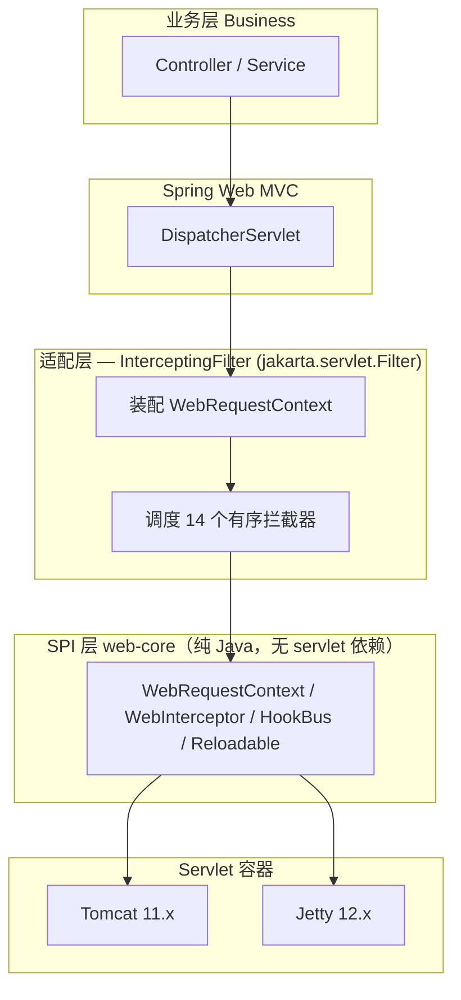
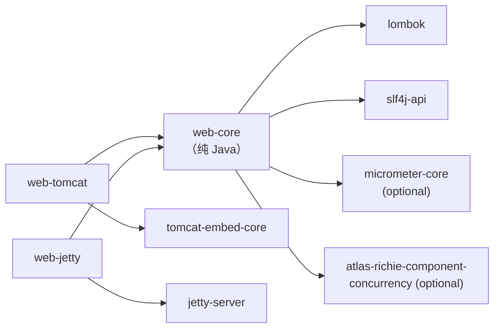

# Atlas Richie Web 组件 (atlas-richie-component-web)

> 面向 Spring Boot 4.x / JDK 25 的 **Servlet 容器层能力总线**。在 DispatcherServlet 之前统一织入九大横切价值点——**容器级限流**、**熔断降级**、**OTEL Trace 透传**、**慢/挂请求检测**、**请求级埋点 Hook**、**VT 友好的配置热加载**、**业务降级 SPI**、**平台防护层**（含 BloomFilter 前置预校验）与**业务能力集成**（多租户 / Idempotency / API 版本协商）。同一份 SPI 在 **Tomcat 11.x** 与 **Jetty 12.x** 下行为一致，业务方切换容器零代码改动。

---

## 📖 目录

- [📖 概述](#📖-概述)
  - [本组件的"是"与"不是"](#本组件的是与不是)
- [✨ 功能特性](#✨-功能特性)
  - [核心能力（九大价值点）](#核心能力九大价值点)
  - [设计选择](#设计选择)
- [🏗️ 架构与模块布局](#🏗️-架构与模块布局)
  - [三层模型](#三层模型)
  - [模块与依赖](#模块与依赖)
  - [拦截器链执行顺序](#拦截器链执行顺序)
- [🚀 快速开始](#🚀-快速开始)
  - [1. 引入依赖](#1-引入依赖)
  - [2. 选择容器镜像](#2-选择容器镜像)
  - [3. 最小配置](#3-最小配置)
  - [4. 第一个限流示例](#4-第一个限流示例)
- [🔧 核心能力](#🔧-核心能力)
  - [1. 容器级限流（Rate Limit）](#1-容器级限流rate-limit)
  - [2. 熔断降级（Circuit Breaker）](#2-熔断降级circuit-breaker)
  - [3. Trace ID 透传（OTEL 接入点）](#3-trace-id-透传otel-接入点)
  - [4. 慢/挂请求检测（Hang Detection）](#4-慢挂请求检测hang-detection)
  - [5. 请求级埋点 Hook](#5-请求级埋点-hook)
  - [6. VT 友好的配置热加载（Hot Reload）](#6-vt-友好的配置热加载hot-reload)
  - [7. 业务降级（Business Degrade）](#7-业务降级business-degrade)
  - [8. 平台防护层（Platform Protection）](#8-平台防护层platform-protection)
  - [9. 业务能力集成（Business Capability Integrations）](#9-业务能力集成business-capability-integrations)
- [⚙️ 配置参考](#⚙️-配置参考)
  - [公共——`platform.component.web`](#公共platformcomponentweb)
  - [限流——`platform.component.web.rate-limit`](#限流platformcomponentwebrate-limit)
  - [熔断——`platform.component.web.circuit-breaker`](#熔断platformcomponentwebcircuit-breaker)
  - [Trace 透传——`platform.component.web.tracing`](#trace-透传platformcomponentwebtracing)
  - [慢/挂请求——`platform.component.web.hang-detection`](#慢挂请求platformcomponentwebhang-detection)
  - [业务降级——`platform.component.web.degrade`](#业务降级platformcomponentwebdegrade)
  - [平台防护——`platform.component.web.protection`](#平台防护platformcomponentwebprotection)
  - [业务集成——`platform.component.web.business`](#业务集成platformcomponentwebbusiness)
- [🎯 最佳实践](#🎯-最佳实践)
  - [1. 容器镜像选择](#1-容器镜像选择)
  - [2. 防护开关策略](#2-防护开关策略)
  - [3. 与网关协同](#3-与网关协同)
  - [4. 拦截器短路语义](#4-拦截器短路语义)
  - [5. Hook 订阅红线](#5-hook-订阅红线)
  - [6. 与 logging 侧分工](#6-与-logging-侧分工)
- [🔄 现有模块兼容性与演进](#🔄-现有模块兼容性与演进)
  - [现有代码处置](#现有代码处置)
  - [阶段划分（已全部落地）](#阶段划分已全部落地)
- [⚠️ 已知限制](#⚠️-已知限制)
- [📋 关键设计决策](#📋-关键设计决策)
- [❓ 常见问题](#❓-常见问题)
  - [Q1：限流参数改了，为什么没生效？](#q1限流参数改了为什么没生效)
  - [Q2：HangDetection 误杀长连接怎么办？](#q2hangdetection-误杀长连接怎么办)
  - [Q3：能否不引 web-core 单独使用某个 SPI？](#q3能否不引-web-core-单独使用某个-spi)
  - [Q4：与 Spring Cloud Gateway 同时部署会重复执行防护吗？](#q4与-spring-cloud-gateway-同时部署会重复执行防护吗)
  - [Q5：怎么关闭 WebSocket / SSE？](#q5怎么关闭-websocket--sse)
  - [Q6：OTEL SDK 是必需依赖吗？](#q6otel-sdk-是必需依赖吗)
  - [Q7：`concurrency` 模块未引入时行为？](#q7concurrency-模块未引入时行为)
  - [Q8：怎么让 BloomFilter 不命中时自动 404？](#q8怎么让-bloomfilter-不命中时自动-404)
  - [Q9：业务降级策略如何热替换？](#q9业务降级策略如何热替换)
  - [Q10：未来会支持 WebFlux 吗？](#q10未来会支持-webflux-吗)
- [📚 相关文档](#📚-相关文档)

---

## 📖 概述

### 我们要解决什么

业务方写 Spring Boot HTTP 接口时遇到的"容器层横切关注点"——这些关注点 Spring Web MVC 已经做了 90%，但剩下 10% **不是"加一个 `@Bean`"就能解决**：

- **入口流量限制**怎么挡在 Controller 之前、连带把 `actuator/health` 排除
- 同一个 key 上的失败率升上来了，怎么**半开探测**而不是一刀切熔断
- **分布式 trace context** 怎么跨 Servlet 容器层传递、和 Micrometer Observation 对接
- 哪条请求慢、卡在哪个阶段、能不能**在线 dump 不阻塞**
- 业务方想监听"我的请求流到容器层时是什么样"但不让我们往业务代码里塞监听器
- 限流 / 熔断参数被改了，希望**生效不要重启**，而且虚拟线程下别脏读旧值

这 9 件事相互独立又互相依赖，要一个 Spring Boot autoconfig 解决。Spring Boot **没有现成答案**：`Resilience4j` 是工具箱不是容器层 hook；`Sentinel/Alibaba` 需要单独控制台；`OTEL SDK` 是客户端 SDK 不是 Spring Web 集成；`Spring Boot Actuator` 提供指标接口但不提供"调用观测 hook"。**本组件就是为了把这一块补齐**。

| 项 | 值 |
|---|---|
| **坐标集** | `atlas-richie-component-web`（父 POM）+ 3 个子模块 |
| **类别** | 横切基础设施——Servlet 容器层能力总线 |
| **JDK / Spring Boot** | JDK 25 / Spring Boot 4.x |
| **默认容器镜像** | `web-tomcat`（Tomcat 11.x） |
| **跨容器镜像** | `web-jetty`（Jetty 12.x，与 Tomcat 行为一致） |
| **依赖复用** | `atlas-richie-component-concurrency`（`RateLimiter` / `CircuitBreaker` / Registry） |
| **默认行为** | **零配置即用**——9 价值点 + 平台防护 + 业务集成**全部默认关闭**，业务方按需 opt-in |
| **强制要求** | 仅引入一个容器镜像（`web-tomcat` 或 `web-jetty`）；其他 9 价值点、防护、业务集成均**完全可选** |

### 本组件的"是"与"不是"

| ✅ 提供 | ❌ 不提供 |
|--------|---------|
| 容器层统一拦截器链（14 个有序拦截器 + HookBus 事件总线） | API 网关（路由 / 负载均衡 / 灰度；用 `atlas-richie-gateway-service`） |
| 9 大横切价值点（限流 / 熔断 / OTEL / Hang / Hook / HotReload / 降级 / 防护 / 业务集成），全部 opt-in | 鉴权 / 权限规则（用 `atlas-richie-component-oauth`） |
| 跨容器对称 SPI（Tomcat / Jetty 切换零代码改动） | 限流控制台 / 规则推送（不带 Sentinel / Nacos / Apollo 客户端） |
| 平台防护层（A 组 + B 组，按需 opt-in 启用） | 网关专属能力（跨服务 Token 颁发、灰度路由） |
| 业务降级 SPI（`DegradeStrategy` + `Trigger`） | 数据库慢查询分析（Datasource 侧职责） |
| 业务上下文注入（多租户 / Idempotency / API 版本，按需 opt-in） | 持久化业务对象 |

> 与现有 web 模块的关系（`README.zh.md` 中 CORS / i18n / WebSocket / SSE 保持不变）：新设计是"上方独立的能力总线"，**不替代**现有功能，是叠加。

---

## ✨ 功能特性

### 核心能力（九大价值点）

> **默认行为：全部关闭（opt-in）**——业务方按需开启。任何能力不开都不影响 Spring MVC 正常运行。

- ✅ **容器级限流** —— 复用 `concurrency.RateLimiter`，按 key 分桶令牌桶，零代码侵入；支持 `deny-status` / `deny-body-template` / `deny-headers` 自定义拒绝响应。
- ✅ **熔断降级** —— 复用 `concurrency.CircuitBreaker`，三态三模式（CLOSED / OPEN / HALF_OPEN），窗口失败率 + 慢调用比例复合触发；fallback 503 + JSON 默认响应。
- ✅ **OTEL Trace 透传** —— 拦截器最前置（`ORDER=50`），按 W3C `traceparent` 规范解析；写响应头 `X-Trace-Id`，下游 OTel SDK 天然兼容。
- ✅ **慢/挂请求检测** —— 三档阈值（`warn` / `dump` / `kill-switch`），静态单例 `WatchdogScheduler`；每档 `AtomicBoolean` 防日志洪水；dump 档 `Thread.getAllStackTraces()` 快照入日志。
- ✅ **请求级埋点 Hook** —— 3 个生命周期事件（`RequestCompletedEvent` / `HangEvent` / `ReloadEvent`），同步串行派发；subscriber 异常隔离不影响其他订阅者。
- ✅ **VT 友好的配置热加载** —— `Reloadable` SPI + `HotReloadRegistry.reload/reloadAll()`；`AtomicReference` swap，VT 无需等旧请求退出；自动桥接 Spring Cloud Config `EnvironmentChangeEvent`。
- ✅ **业务降级 SPI** —— `DegradeStrategy` + `Trigger` 枚举（`RATE_LIMITED` / `BREAKER_OPEN` / `EXCEPTION` / `HANG_DETECTED` / `SLOW_CALL`）；支持业务自定义 fallback 响应。
- ✅ **平台防护层** —— A 组（请求/头大小、SSE/WS 旁路、BloomFilter 前置预校验）+ B 组（Anomaly Detection / Brute Force / API 签名）；全部按需 opt-in 启用；硬编码 Gateway 互斥。
- ✅ **业务能力集成** —— 多租户解析（`X-Tenant-Id`）、Idempotency 同指纹去重、API 版本协商（`X-Api-Version`）；全部按需 opt-in，独立开关。

### 设计选择

> 本节回答"为什么不直接用现有方案"——每条都是工程取舍，不是教条。

- ✅ **零配置默认** —— 引入 web-core + 容器镜像即用，9 价值点全部 opt-in；不写任何 YAML 也正常启动。**所有能力都是锦上添花的可选能力，不开不影响 Spring MVC 正常运行**。
- ✅ **跨容器对称** —— 同一份 SPI 在 Tomcat / Jetty 下行为一致；适配层选型为 `jakarta.servlet.Filter`（`FilterRegistrationBean` 注册），避免侵入容器内部 API。**业务方切换容器零代码改动**（仅切换 starter 依赖）。
- ✅ **零侵入** —— 不强制业务方改 Controller 注解；不替换 Spring Boot 默认容器 Factory；不引入 Nacos / Spring Cloud / Resilience4j 强依赖。**业务方不应被绑死**，本组件只解决 Spring Boot 现成方案**做不到**或**做得不优雅**的事情。
- ✅ **价值优先于 API 表面** —— 每个设计决策都要能回答"为什么不直接用现有方案"。**反例**：我们之前写了 `Connector` 配置 9 字段，Spring Boot 的 `server.tomcat.*` 已经 9 个字段对应存在——重复就是浪费，所以最终删掉了 `TomcatProductionCustomizer` / `JettyProductionCustomizer`。
- ✅ **SPI 层不依赖 servlet API**（enforcer rule 强制）—— 所有跨容器抽象都是纯 Java，web-core 可独立编译测试。
- ✅ **可观测性是结果不是输入** —— 每个价值点自带 Micrometer 指标（`web.rate_limit.*` / `web.cb.*` / `web.hang.detections` / `web.bloom.miss`），业务方接 Prometheus/Grafana 即可——**不需另配 Micrometer exporter**。
- ✅ **失败可见** —— 任何 silent fail（限流被吞 / 熔断写不进去 / hook 抛异常）都打 ERROR 日志带 `ctx.method + path + traceId`，方便追责。
- ✅ **坚决不引入** —— `spring-cloud-context` / `nacos-client` / `apollo-client` / `Resilience4j`。业务方要这些自己加。**拒绝 0 调用方的"对称 API"重载**——存在但不用的 API 是维护负担。

---

## 🏗️ 架构与模块布局

### 三层模型



**关键边界**：
- **SPI 层不依赖任何 servlet API**（enforcer rule 强制）—— 所有跨容器抽象都是纯 Java。
- **适配层薄** —— `InterceptingFilter` 只做"拿到底层 req/res，转成 ctx，调 chain，把 ctx 写回 req/res"。
- **功能层在 web-core 里** —— 业务方引入 web-core 即获得全部 9 价值点；容器镜像只负责 servlet 适配。

### 模块与依赖



**Registry 归属**：`RateLimiterRegistry` / `CircuitBreakerRegistry` 抽到 `atlas-richie-component-concurrency`，**不**在 web-core 重复定义。`DegradeStrategyRegistry` 留在 web-core（业务降级是 web 层概念，不污染 concurrency）。

> ⚠️ web-core 编译期零 spring-cloud 依赖；`HotReloadCloudBridge` 通过 `@ConditionalOnClass(name=...)` 仅在业务方已引入 `spring-cloud-context` 时激活。

### 拦截器链执行顺序

注册顺序即执行顺序，**业务方不可改**：

```mermaid
flowchart LR
    subgraph OTel["可观测性"]
        I1["① OtelTracing\nORDER=50"]
    end
    subgraph Protect["平台防护"]
        I2["② PlatformProtection\nORDER=100"]
        I3["③ BloomFilter\nORDER=150"]
        I4["④ AnomalyDetection\nORDER=200"]
        I5["⑤ BruteForce\nORDER=210"]
        I6["⑥ ApiSignature\nORDER=220"]
    end
    subgraph BizCtx["业务上下文"]
        I7["⑦ KeyResolver\nORDER=250"]
        I8["⑧ Tenant\nORDER=260"]
        I9["⑨ Idempotency\nORDER=270"]
        I10["⑩ ApiVersion\nORDER=280"]
    end
    subgraph Limit["限流 / 熔断"]
        I11["⑪ RateLimit\nORDER=300"]
        I12["⑫ Degrade\nORDER=350"]
        I13["⑬ CircuitBreaker\nORDER=400"]
    end
    subgraph Monitor["监控"]
        I14["⑭ HangDetection\nORDER=500"]
    end

    I1 --> I2 --> I3 --> I4 --> I5 --> I6
    I6 --> I7 --> I8 --> I9 --> I10
    I10 --> I11 --> I12 --> I13
    I13 --> I14
    I14 --> Controller["➡ 业务 Controller"]
```



**短路语义**：

| 决策点 | 行为 | 后续链 |
|---|---|---|
| 限流 deny | 写 429 响应 → `ctx.setAttribute(DECISION_ATTRIBUTE)` → 不调 `chain.proceed()` | 立即返回 |
| 熔断 deny | 写 503 响应 → `ctx.setAttribute(DECISION_ATTRIBUTE)` → 不调 `chain.proceed()` | 立即返回 |
| 防护 deny（Anomaly / BruteForce / ApiSig / PlatformProtection） | 同上 | 立即返回 |
| Hang detect 触发阈值 | 仅 publish `HangEvent` + 调 dump hook，**不阻断** | 继续 |
| 业务异常 | InterceptingFilter 包装为 `ServletException` 抛出 | `InterceptingFilter.finally` 强制 publish `RequestCompletedEvent` |

> 关键细节：`HookBus.publish` 永远不被短路跳过——`InterceptingFilter.finally` 强制发布 `RequestCompletedEvent`，无论请求被短路 / 抛异常 / 正常完成。

#### 关键非琐碎细节

这 4 条都是从工程实践中沉淀下来的"不写下来就会被坑"的细节：

1. **被熔断 / 限流的请求不被 OTEL 视为成功** —— `OtelTracingInterceptor` 仅写响应头 `X-Trace-Id`；status 标记由业务方订阅 `RequestCompletedEvent.responseStatus()` 自决。本组件**不替业务方判断"这个请求算不算成功"**，因为熔断拒绝（业务方可能想算"成功-熔断"指标）和限流拒绝（算"成功-限流"）的业务含义不同。
2. **多个 deny 决策同时发生时** —— 以"首先触发的那个"的响应为准（与 chain 顺序一致）。例如限流 deny（ORDER=300）和熔断 deny（ORDER=400）同时满足时，写 429 响应而不是 503。**响应一致性 vs 公平性的取舍**：取前者——业务方处理响应只看 status，不会同时看 status=429 和 503。
3. **`HookBus.publish` 永远不被短路跳过** —— 由 `InterceptingFilter.finally` 强制发布 `RequestCompletedEvent`，无论请求被短路 / 抛异常 / 正常完成。**这是埋点系统的最低契约**：业务方订阅了就要保证收到事件，否则监控数据缺失会误导告警。
4. **Gateway bypass** —— 当 `X-Forwarded-From-Gateway` header 存在时，`PlatformProtectionInterceptor` 设置 `GATEWAY_BYPASS_ATTRIBUTE=true`，B 组三个拦截器（Anomaly / BruteForce / ApiSignature）自查该 attribute 后跳过执行。**这一逻辑硬编码**，无法通过配置关闭——避免业务方在 web 与 gateway 同时部署时误开配置导致防护双重执行。

---

## 🚀 快速开始

### 1. 引入依赖

```xml
<!-- 必选：SPI + 功能层 -->
<dependency>
    <groupId>com.richie.component</groupId>
    <artifactId>atlas-richie-component-web-core</artifactId>
</dependency>

<!-- 选一个容器镜像（默认 Tomcat；二选一） -->
<dependency>
    <groupId>com.richie.component</groupId>
    <artifactId>atlas-richie-component-web-tomcat</artifactId>
</dependency>
<!--
<dependency>
    <groupId>com.richie.component</groupId>
    <artifactId>atlas-richie-component-web-jetty</artifactId>
</dependency>
-->

<!-- 可选：限流 / 熔断 Registry -->
<dependency>
    <groupId>com.richie.component</groupId>
    <artifactId>atlas-richie-component-concurrency</artifactId>
</dependency>
```

> 必须引入一个容器镜像；只引 `web-core` 启动会因缺少 servlet 适配层而失败。

### 2. 选择容器镜像

```yaml
# 默认走 web-tomcat；切到 Jetty 只需改依赖，业务代码零改动。
# server.tomcat.* / server.jetty.* 仍由 Spring Boot 标准配置控制。
spring:
  threads:
    virtual:
      enabled: true   # VT 友好：所有拦截器在 VT 上无状态切换
```

### 3. 最小配置

**零配置即用**——引入依赖后无需任何 YAML，业务方按需开启任何功能：

```yaml
# 什么也不写也能跑。所有 9 价值点 + 平台防护 + 业务集成均默认关闭。
```

> 设计原则：**所有功能都是锦上添花的可选能力，不开不影响 Spring MVC 正常运行**。业务方根据自己的场景按需 opt-in：
> - 需要限流保护 → 开启 `platform.component.web.rate-limit.enabled=true`
> - 需要熔断降级 → 开启 `platform.component.web.circuit-breaker.enabled=true`
> - 需要 Trace 透传 → 开启 `platform.component.web.tracing.enabled=true`
> - 需要慢/挂请求检测 → 开启 `platform.component.web.hang-detection.enabled=true`
> - 需要业务降级 → 开启 `platform.component.web.degrade.enabled=true`
> - 需要平台防护（请求大小 / SSE旁路 / Bot检测 / 登录爆破 / 验签）→ 开启 `platform.component.web.protection.*`
> - 需要业务集成（多租户 / Idempotency / API版本）→ 开启 `platform.component.web.business.*`

> **业务方不写任何配置时**：仅 `InterceptingFilter` 注册到 servlet 容器（薄薄一层，纯透传到 DispatcherServlet），9 价值点全部不进入拦截器链。

### 4. 第一个限流示例

```java
@RestController
@RequestMapping("/api/orders")
@RequiredArgsConstructor
public class OrderController {

    private final OrderService orderService;

    @GetMapping("/{id}")
    public Order get(@PathVariable String id) {
        return orderService.findById(id);
    }
}
```

```bash
# 触发限流（每 key 100 req/s，超出后 429）
for i in $(seq 1 200); do
  curl -s -o /dev/null -w "%{http_code}\n" http://localhost:8080/api/orders/123 &
done | sort | uniq -c
# 预期：100× 200 + 100× 429
```

订阅 `RequestCompletedEvent` 拿到精确指标：

```java
@Component
class OrderHook {
    OrderHook(HookBus bus) {
        bus.subscribe(RequestCompletedEvent.class, evt -> {
            metrics.counter("order_request_total")
                   .tag("status", String.valueOf(evt.responseStatus()))
                   .increment();
        });
    }
}
```

---

## 🔧 核心能力

### 1. 容器级限流（Rate Limit）

**设计目的**：让业务方**不写一行注解、不引入额外运行时**，就能在容器层对入站请求做按 key 分桶限流，且与 actuator/health 解耦。

**解决什么问题**：Bucket4j 是单 key 库；Resilience4j RateLimiter 要 `@RateLimiter` 注解侵入业务方法；Sentinel 引入控制台。本组件=容器层（不必侵入业务）+ per-key 分桶（共享会计一）+ 不引入额外运行时。

**明确不做什么**：
- ❌ **不**做"按方法 / 按用户 / 按 IP"的细粒度限流语义——本组件专注"按 clientKey 分桶"，更细的粒度由业务方在 ctx 写入 `clientKey` 实现
- ❌ **不**做配额预扣 / 配额购买——业务场景差异大，本组件只解决"是否允许通过"
- ❌ **不**做"集群级"限流同步——单机内存令牌桶足够大多数场景；分布式场景由业务方引入 Redis 自行扩展

**实施策略**：**复用 `atlas-richie-component-concurrency:RateLimiter`**，不自己写 TokenBucket。`RateLimitInterceptor` 仅 50 行包装。

**算法**：令牌桶 + 惰性补充。`capacity` + `refillTokens` + `refillPeriod` 三参数支持 burst；线程安全由 `ConcurrentHashMap.computeIfAbsent` + 单 key 内桶原子操作保证。

**默认关闭（opt-in）**：业务方需显式开启 `platform.component.web.rate-limit.enabled=true` 才进入拦截器链；不开时 RateLimitInterceptor 不注册，`concurrency.RateLimiter` 完全不会被调用。

**配置示例**：

```yaml
platform:
  component:
    web:
      rate-limit:
        enabled: true   # 显式 opt-in；默认 false
        permits-per-second: 100
        deny-status: 429
        deny-body-template: '{"error":"too_many_requests","reason":"{reason}"}'
        deny-headers:
          Retry-After: "1"
```

**指标**（Micrometer Counter）：
- `web.rate_limit.allow{key}` — 放行请求数
- `web.rate_limit.reject{reason, pattern}` — 拒绝请求数

**按接口粒度配置**（待落地）：

```yaml
platform:
  component:
    web:
      rate-limit:
        permits-per-second: 100      # 全局默认
        deny-status: 429
        deny-code: RATE_LIMITED
        deny-msg: "请求过于频繁 (key={key})"
        routes:                       # 按 path 覆盖
          /api/v1/orders/**:
            permits-per-second: 5
            deny-code: ORDER_RATE_LIMITED
            deny-msg: "下单过快"
```

### 2. 熔断降级（Circuit Breaker）

**设计目的**：让业务方**不写注解、不侵入业务方法**，就能在容器层对"一组 key 共享的失败率"自动熔断——一个 auth key 失败率升高时，整个 auth namespace 的请求都自动被熔断，避免雪崩。

**解决什么问题**：Resilience4j 集成要写 `@CircuitBreaker` 注解侵入业务方法；做不到"容器层对一组 key 共享熔断器"——一个 auth key 失败率高了应该被熔断，但当前 Resilience4j 没有这种 key 维度共享。

**明确不做什么**：
- ❌ **不**做"按方法 / 按 endpoint"的熔断语义——本组件专注"按 protected resource 隔离"（命中 routes 时 CB key = matchedPattern）
- ❌ **不**做"半自动恢复"探测（除标准 HALF_OPEN trial 外）——业务方要的"自定义恢复条件"应该走 §7 业务降级 SPI
- ❌ **不**做"重试"——重试放大会放大雪崩，业务方真要重试请用 Sentinel / `atlas-richie-component-microservice`

**实施策略**：**复用 `atlas-richie-component-concurrency:CircuitBreaker`**，不自己写状态机。`CircuitBreakerInterceptor` 仅 80 行包装。

**默认关闭（opt-in）**：业务方需显式开启 `platform.component.web.circuit-breaker.enabled=true` 才进入拦截器链；不开时 CircuitBreakerInterceptor 不注册。

**状态机**（三态三模式）：

| 状态 | 行为 | 转换条件 |
|---|---|---|
| CLOSED | 正常执行 | 窗口内失败率 ≥ threshold → OPEN |
| OPEN | 直接拒绝（fallback） | wait-duration 到期 → HALF_OPEN |
| HALF_OPEN | 放 trial 流量探测 | trial 成功 → CLOSED / 失败 → OPEN |

**参数**（语义与 Resilience4j 兼容）：

| 参数 | 默认 | 含义 |
|---|---|---|
| `failure-rate-threshold` | 50% | 触发熔断的失败率 |
| `sliding-window-size` | 100 | 滑动窗口事件数 |
| `minimum-number-of-calls` | 10 | 不到不触发 |
| `slow-call-threshold` | 60% | 慢调用比例触发熔断 |
| `slow-call-duration-threshold` | 5s | 慢判定阈值 |
| `wait-duration-in-open-state` | 30s | OPEN 持续时间 |
| `permitted-calls-in-half-open` | 5 | 半开允许数 |
| `excluded-exceptions` | `[]` | 不计入失败的异常 |

**指标**（Micrometer Counter/Gauge）：
- `web.cb.not_permitted{pattern}` — OPEN 状态被拒请求数
- `web.cb.state{key}` — Gauge 当前 CB 状态（CLOSED=0 / HALF_OPEN=1 / OPEN=2）
- `web.cb.calls{result, pattern}` — counter，业务方在 `cb.execute(callable)` 闭包内上报

### 3. Trace ID 透传（OTEL 接入点）

**设计目的**：让分布式追踪的 `traceId` **零成本贯通整个 servlet 容器层**——业务方只引入 web-core，请求经过的所有拦截器、响应头、`ctx.traceId()` 都能拿到同一个 traceId，下游接入 OTel SDK 时天然兼容。

**解决什么问题**：OTEL SDK 本身复杂（exporter / propagator / resource），但**只在 servlet Filter 织入**最简单。本组件在拦截器链最前置（ORDER=50）建立 trace 上下文，让后续所有拦截器决策时 `ctx.traceId()` 都有值——**OTEL SDK 是可选依赖，本组件做它接入的"最后一公里"**。

**明确不做什么**：
- ❌ **不**内嵌 OTel SDK 客户端 / exporter / 资源定义——这是业务方应用层职责（不同服务名 / 不同 exporter / 不同采样率）
- ❌ **不**做 Span 编织（不在拦截器里 span.start / span.end）——业务方接 OTel SDK 后由其自动织入
- ❌ **不**做 trace 存储后端——Jaeger / Tempo / Zipkin 选型交给业务方

**默认关闭（opt-in）**：业务方需显式开启 `platform.component.web.tracing.enabled=true` 才进入拦截器链；不开时 OtelTracingInterceptor 不注册，请求不会写入 `X-Trace-Id` 响应头。

**形态**（当前实现）：
- 拦截器链最前置（`ORDER=50`）
- 读 `ctx.header("traceparent")` 按 W3C 规范解析 traceId（version 00 + 32-hex + 16-hex + flags）
- 若无 traceparent → 读 `X-Request-Id`（兼容旧协议）→ 仍无则自生成 32-hex UUID
- 写入 `ctx.traceId()` + 响应头 `X-Trace-Id`（让下游可关联）
- **不**引入 OTel SDK（业务方自行接入）

**配置**：

```yaml
platform:
  component:
    web:
      tracing:
        enabled: true                          # 显式 opt-in；默认 false
        response-header-name: X-Trace-Id       # 响应头名，默认 X-Trace-Id
        prefer-w3c: true                       # true: 优先解析 traceparent；false: 优先 X-Request-Id
```

**接入 OTel SDK**（业务方自行）：

```java
// 1. 加依赖 io.opentelemetry.instrumentation:opentelemetry-spring-boot-starter
// 2. 配置 OTEL exporter / resource / service name
// 3. OtelTracingInterceptor 写入的 traceparent 与 OTel 自动织入天然兼容
```

### 4. 慢/挂请求检测（Hang Detection）

**设计目的**：让业务方**在请求真的变慢时，能拿到线程栈快照**，而不是只看数字报警。

**解决什么问题**：Spring Boot Actuator 的 `http.server.requests` 是指标报告器，**不知道**单个请求的真实状态——它只告诉你"平均延迟 500ms"，不会告诉你"这条请求卡在 JDBC 等待"。Datasource slow query log 也只报数字不报堆栈。本组件提供**配阈值触发在线 dump**（stack / heap / coverage）而非仅记录数字。

**明确不做什么**：
- ❌ **不**做"应用性能监控（APM）"完整方案——那是 OTel / SkyWalking / Arthas 的领域；本组件专注"慢请求时的栈快照"
- ❌ **不**自动 kill 挂死的请求线程——HTTP 协议契约不杀工作线程；kill-switch 档仅 `Thread.interrupt()` 协作式中断，业务方应响应 `InterruptedException` 主动退出
- ❌ **不**做"自动 dump 后的 heap 分析"——dump 入日志即止，heap / coverage 分析由业务方用 `arthas` / `async-profiler` 触发（详见配置段的可选 trigger 列表）
- ❌ **不**做"SSE / WebSocket 长连接"的慢检测——这些是长连接，"慢"无意义；改由 §8 A 组 `long-lived-bypass.paths` 旁路掉 watchdog

**默认关闭（opt-in）**：业务方需显式开启 `platform.component.web.hang-detection.enabled=true` 才进入拦截器链；不开时 HangDetectionInterceptor 不注册，`WatchdogScheduler.DEFAULT` 也不会被使用。

**形态**：拦截器启动时把请求的 `${thresholdMs}` 后的回调注册到 `ScheduledExecutorService`；**不阻断请求**。

**触发器实现**：
- **静态单例 `WatchdogScheduler.DEFAULT`**（双检查锁懒初始化，**非 spring bean**）；核心数 = `Runtime.getRuntime().availableProcessors()`，守护线程，name `richie-hang-detect-{n}`
- **每个请求 3 个 `ScheduledFuture`**（warn / dump / kill-switch 各一），不为每请求一个 Timer：1000 QPS 下 Timer 的 ThreadLocalPressure 会触发 GC 抖动
- **3 个 `ScheduledFuture` 在 `ctx.close()`（请求完成）时 `cancel(false)`**：避免 dump 已完成请求
- **阈值链分级触发**（3 档）：
  - `warn`：WARN 日志 + publish `HangEvent` + metrics `web.hang.detections{level="warn"}`
  - `dump`：WARN 日志 + **`Thread.getAllStackTraces()` 快照入日志** + publish `HangEvent` + metrics `{level="dump"}`
  - `kill-switch`：ERROR 日志 + thread dump + **`requestThread.interrupt()` 协作式中断业务线程**（HTTP 协议不杀工作线程是契约）+ metrics `{level="kill_switch"}`
- **背压**：每档阈值都有独立的 `AtomicBoolean`，在该请求生命周期内每档只触发一次，避免日志洪水

**配置**：

```yaml
platform:
  component:
    web:
      hang-detection:
        enabled: true            # 显式 opt-in；默认 false
        warn-ms: 1000            # 打 warn + 指标；默认 30000
        dump-ms: 5000            # 触发 thread dump；默认 40000
        kill-switch-ms: 30000    # 协作 interrupt；默认 90000
        dump-enabled: true       # 是否在 dump 档实际抓栈；默认 true（hang-detection 开启后生效）
```

> 旧字段 `threshold-millis`（单档）已 deprecated：若仍配置，三档均按 `threshold-millis` 设值。新部署请用 `warn-ms` / `dump-ms` / `kill-switch-ms`。

### 5. 请求级埋点 Hook

**设计目的**：让业务方**不写 servlet Filter、不懂 OTel API**，就能订阅"我的请求流到容器层时是什么样"的 3 个生命周期事件——直接写 `bus.subscribe(...)` 即可。

**解决什么问题**：业务方想听"我的请求流到容器层时是什么样"，但不想：
- 写 `jakarta.servlet.Filter`（要懂 servlet 生命周期）
- 直接订阅 OTel（要懂 OTel API）

**明确不做什么**：
- ❌ **不**做"controller 调用前 / 后"的细粒度事件——那是 AOP 切面的领域（用 `atlas-richie-component-logging`）
- ❌ **不**做异步派发——subscriber 在请求线程上同步执行；想异步自己起线程池
- ❌ **不**做事件缓冲——`RequestCompletedEvent` 是"已完成"事件，buffer 会让订阅者永远错过；想异步请订阅者自己 buffer
- ❌ **不**做"HeadersParsed / BodyRead / Suspended / Resumed"等 servlet 内部事件——这些由 OTel 自动 instrumentation 覆盖

**默认关闭（opt-in）**：业务方通过 `HookBus` 注入自定义 Subscriber 即视为开启；未注入任何 Subscriber 时 HookBus 不派发任何事件，业务方零感知。

**事件类型**（实际实现 3 个）：
- `RequestCompletedEvent` — 由 `InterceptingFilter.finally` 强制发布（method / path / responseStatus / startNanos / endNanos / shortCircuited / hasError / clientKey / traceId / durationMillis）
- `HangEvent` — 由 `HangDetectionInterceptor` 注册的 `WatchdogScheduler` 阈值触发时发布（method / path / elapsedMillis / thresholdMillis / clientKey / traceId / stackTrace）
- `ReloadEvent` — 由 `DefaultHotReloadRegistry.reload/reloadAll()` 发布（name / timestamp）

**订阅示例**：

```java
@Component
class MyHook {
    MyHook(HookBus bus) {
        bus.subscribe(RequestCompletedEvent.class, evt -> {
            metrics.counter("web_request_total")
                   .tag("status", String.valueOf(evt.responseStatus()))
                   .increment();
            log.info("{} {} → {} ({} ms)", evt.method(), evt.path(),
                     evt.responseStatus(), evt.durationMillis());
        });
        bus.subscribe(HangEvent.class, evt -> {
            log.warn("Hang detected: {} {} threshold={}ms actual={}ms stack={}",
                     evt.method(), evt.path(), evt.thresholdMillis(), evt.elapsedMillis(),
                     evt.stackTrace());
        });
    }
}
```

**派发模型**：
- **同步串行**：在调用 `bus.publish(evt)` 的同一个线程上串行执行所有 subscriber
- **不引入线程池**：避免"hook 看不到请求上下文"（ThreadLocal / MDC 跨线程传递需要 `@Async` 上下文传播，过度复杂）
- **不缓冲**：event 立即派发；缓冲会让"已完成"事件在 subscriber 启动后才到达
- **失败隔离**：subscriber 抛异常被 try-catch 捕获，记 `WARN (subscriber=ClassName, event=EventType)`，继续派发后续 subscriber
- **背压**：subscriber 处理耗时阈值（默认 100ms）超时记 ERROR——**hook 不该成为瓶颈**

### 6. VT 友好的配置热加载（Hot Reload）

**设计目的**：让业务方改配置后**生效不要重启**，且**虚拟线程下不会脏读旧值**——`AtomicReference` swap 是核心机制。

**解决什么问题**：`@RefreshScope` 重建 bean → 触发 Spring bean lifecycle 重建 → 抖动业务线程。Nacos 配置变更批量推送时，连续重建十几个 bean，业务线程看到十几个"重新初始化"。**虚拟线程时代更是灾难**：虚拟线程是 cheap 的，但**重建 listener chain 的过程中**所有进行中的请求都会有 race。

**明确不做什么**：
- ❌ **不**内置 Nacos / Apollo / Spring Cloud Config 客户端——本组件只提供 `HotReloadRegistry.reload(name)` / `reloadAll()` API，业务方接 Nacos 时手工调即可；接 Spring Cloud Config 时 `HotReloadCloudBridge` 自动桥接
- ❌ **不**做"配置变更校验"——本组件只 swap ref，业务方自定义的 Reloadable 内部做合法性校验
- ❌ **不**做"全量配置推送监听"——只在 `EnvironmentChangeEvent` 上桥接，业务方引入 spring-cloud-context 后生效；其他场景业务方自己触发
- ❌ **不**重建 Spring bean —— 这是关键；用 `AtomicReference` swap，happens-before 由 volatile 保证，**不**触发 `@PostConstruct` 副作用

**形态**（不依赖任何拦截器配置）：

```
业务方在 Nacos 推送 / @RefreshScope / 自定义事件触发时调：
   ↓
HotReloadRegistry.reload("rate-limiter") 或 reloadAll()
   ↓
DefaultHotReloadRegistry 遍历已 register 的 Reloadable
   ↓
调 Reloadable.accept(newState) —— 拦截器内部用 AtomicReference swap
   ↓
发布 ReloadEvent 到 HookBus（供订阅者知悉）
```

**关键**：
- 不用 Spring bean 重建（**不**触发 `@PostConstruct` 副作用）
- 用 `AtomicReference` swap，happens-before 由 volatile 保证
- VT 下友好（VT 不是 daemon 等待，所以 swap 完成不需要等所有 vt 退出）

**Spring Cloud Config 桥接**：

当业务方引入 `spring-cloud-context` 时，`HotReloadCloudBridge` 自动激活——通过 `SmartApplicationListener` 监听 `EnvironmentChangeEvent`：
- 仅依赖事件类名匹配（`org.springframework.cloud.context.environment.EnvironmentChangeEvent`），不引入 spring-cloud 编译期依赖
- 反射调 `getKeys()` 提取变更 key 集合
- 决策：`keys` 为 null/empty 或任一键以 `richie.web.` 前缀开头 → 触发 `registry.reloadAll()`
- 配置变更示例：`richie.web.rate-limit.permits-per-second=20` 即触发 reload，业务无感

**配置**：不需要。Reloadable 实例默认实现是"重新读取最新 Properties 然后 accept"。

### 7. 业务降级（Business Degrade）

**设计目的**：让业务方**用纯 API + 配置**自定义降级策略——无需控制台、无需规则推送中心，**业务方自己写 `DegradeStrategy` 决定触发场景和响应**。

**解决什么问题**：Sentinel 的"业务降级"必须接 Sentinel 控制台，规则推送走 nacos/apollo，独立部署组件。Resilience4j 没有"业务降级"概念，只有 CB fallback。本组件的"业务降级"是**纯 API + 配置**：业务方用 SPI 自定义降级策略（fallback 响应、默认值、缓存、跳转），无需控制台。

**明确不做什么**：
- ❌ **不**做"规则推送中心"——本组件只提供 SPI 加载 + Registry，业务方要 Nacos 推送就自己接 Nacos 后调 `HotReloadRegistry.reloadAll()`
- ❌ **不**做"控制台 UI"——CLI 友好的 API + 配置就够，控制台是另一个产品的领域
- ❌ **不**和 §2 CB fallback 合并——CB fallback 是**系统级兜底**（零配置、不可定制），业务降级是**业务可配策略**（覆盖 CB / 限流 / 异常 / 慢 / Hang）；前者不可替代，后者覆盖更广
- ❌ **不**抽到 `concurrency` 模块——业务降级是 web 层概念，不污染 concurrency 通用原语（这是用户明确红线）

**默认关闭（opt-in）**：业务方需显式开启 `platform.component.web.degrade.enabled=true` 才注册 DegradeInterceptor；未开启时即使注入了 `DegradeStrategy` SPI 也不会被调用，限流/熔断/Hang 触发场景全部走默认系统行为（写 429/503 或不阻断）。

**为什么独立于 §2 熔断 fallback**：
- §2 CB fallback 是**系统级兜底**：CB OPEN → 自动触发 → 写 503 + JSON。零配置，不可定制
- §7 业务降级是**业务可配策略**：覆盖多种触发场景（CB OPEN / 限流 deny / 业务异常 / 慢调用 / Hang Detection），返回业务定义的响应（如"商品详情降级为缓存中的热门商品列表"）

**形态**：

```java
public interface DegradeStrategy {
    Set<Trigger> supports();                        // 哪些触发场景本策略响应
    Response handle(WebRequestContext ctx);          // 业务可写任意响应（body / status / header）
    default int order() { return 0; }                // 越小越优先
}

public enum Trigger {
    RATE_LIMITED, BREAKER_OPEN, EXCEPTION, HANG_DETECTED, SLOW_CALL
}
```

**配置示例**：

```yaml
platform:
  component:
    web:
      degrade:
        enabled: true                   # 显式 opt-in；默认 false
        default-strategy: system-503    # 无 SPI 命中时的兜底
        strategies:
          - name: cache-fallback        # 业务方实现，SPI 加载
            trigger: [BREAKER_OPEN, SLOW_CALL]
            order: 10
            config:
              cache-key: "product:{id}"
              ttl: 60s
          - name: default-value
            trigger: [EXCEPTION]
            order: 20
            config:
              value: '{"status":"degraded","data":[]}'
```

业务方定义 `class MyDegrade implements DegradeStrategy`，Spring 自动注册到 Registry；属性跳过 / 自定义触发通过 request attribute（`degrade.skip` / `degrade.manual` / `degrade.exception` / `degrade.latencyMs`）。

### 8. 平台防护层（Platform Protection）

**设计目的**：在容器层提供**应用层威胁**的基础防护——业务方不部署网关也能挡住大请求拖垮线程、BloomFilter 防缓存穿透、Bot UA 扫描、登录爆破、伪造请求。**与网关协同**：web 与 gateway 同时部署时通过 `X-Forwarded-From-Gateway` header 互斥，避免双重防护。

**解决什么问题**：Spring Boot 自身没有应用层防护套件；`atlas-richie-gateway-service` 是网关层防护（路由层威胁）。轻量小程序 / 管理后台不部署网关时，容器层需要一个**不需要控制台、可纯配置启停**的防护层。

**明确不做什么**：
- ❌ **不**做网关专属能力（路由 / 负载均衡 / 灰度 / 跨服务 Token 颁发）——用 `atlas-richie-gateway-service`
- ❌ **不**做"客户端 IP 精准溯源"——`X-Forwarded-For` 解析留给业务方；本组件只取 `remoteAddr`，避免被伪造的 XFF 头误导
- ❌ **不**做"风控评分"——黑名单 / 白名单是静态规则；复杂风控由业务方引入专业风控系统
- ❌ **不**做"蜜罐 / 验证码"等交互式防护——本组件只做"看 header / IP / UA 即决策"的零交互防护

**默认关闭（opt-in）**：所有 A 组 + B 组防护均需业务方显式开启。未开启任何防护时 `PlatformProtectionInterceptor` / `BloomFilterInterceptor` / `AnomalyDetectionInterceptor` / `BruteForceInterceptor` / `ApiSignatureInterceptor` 全部不进入拦截器链，web 端零防护——业务方按需 opt-in。

**概念边界**：基础防护套件，**不是**"网关能力 fallback"。命名不使用 `gateway-fallback` 的原因：
- 语义上耦合网关（某些轻量小程序根本不用网关）
- 防控对象不同：网关是**路由层威胁**（跨服务 / 集群攻击 / 灰度路由），平台防护层是**应用层威胁**（重复提交 / 伪造请求 / 异常客户端 / 大请求拖垮）

#### 三大设计原则

1. **默认全部关闭**：A 组与 B 组一律默认 false。轻量小程序只引 web 不应"被动启用"任何防护——所有防护 opt-in
2. **A 组一旦 opt-in，内部能力全部生效**：当业务方开启 `protection.request-size.enabled=true` 后，请求/头大小防御立即生效；不能只开 A 组中某一项而跳过另一项。这是 web 框架本身的职责（防御大请求拖垮线程）
3. **Gateway 互斥（硬编码,不可关）**：检测 `X-Forwarded-From-Gateway` header；有则**自动跳过所有 B 组防护**——避免 web 与 gateway 同时部署时重复执行。**A 组不受 gateway header 影响，照常执行**

#### 防护能力分组

**A 组（默认关闭，opt-in 启用；组内一旦开启则全部能力必生效）**：

| 能力 | 防护对象 | gateway 重叠？ |
|---|---|---|
| 请求/头大小防御 | Body 过大 / Header 过长拖垮线程 | gateway 不做 |
| SSE/WS 旁路 | HangDetection 误杀长连接 | gateway 不做（web 层职责） |
| BloomFilter 前置预校验 | 防缓存穿透 / 恶意探活 | gateway 偶尔做但 web 端常需独立判 |

> `LongLivedPathBypass` 是 `HangDetectionInterceptor` 的内部分支——当请求 path 命中 `paths: ["/ws/**", "/sse/**", "/stream/**"]` 时，跳过 watchdog 启动；非命中路径照常。

**B 组（默认关闭，按需启用；每项独立开关）**：

| 能力 | 防护对象 | gateway 同名实现 | 互斥 |
|---|---|---|---|
| Anomaly Detection（Bot / UA 黑名单 / IP 黑名单） | 恶意爬虫、扫描器 | `AnomalyDetectionFilter` | 自动跳过 |
| Brute Force 登录保护 | 密码爆破 | gateway 自定义 | 自动跳过 |
| API 签名校验（HMAC-SHA256） | 防伪造请求 | `InterfaceAuthFilter` / `EccCryptoFilter` | 自动跳过 |

#### BloomFilter 前置预校验（A 组，ORDER=150）

业务方常需要"先判目标 key 是否存在再走 DB / 远程调用"——典型场景：缓存穿透保护、恶意探活、白名单校验。web-core 提供容器层前置拦截，业务方只需在 ctx 写入 `bloom.target`，web 自动判存在性后短路。

> ⚠️ `protection.bloom-filter.enabled=true` 但 `BloomFilter` bean 未初始化时启动 **fail-fast**——避免静默失效（拦截器静默放行会让业务误以为 bloom 在工作）。业务方要么提供 BloomFilter bean，要么 `enabled=false`。

**SPI 抽象**：

```java
public interface BloomFilter {
    boolean mightContain(String key);
    void put(String key);
    void putAll(Collection<String> keys);
    boolean isExists();  // bean 是否已初始化（防空 bloom 误杀）
}
```

**实现**：
- **context 模块**：`GuavaBloomFilter`（默认；`@ConditionalOnMissingBean`）；业务方提供自定义 bean 自动覆盖
- **cache 模块**：`RedissonBloomFilter`（`@Primary` + `@ConditionalOnProperty type=REDISSON`）覆盖 context 默认

**业务使用示例**：

```java
@Component
public class OrderQueryInterceptor implements WebInterceptor {
    @Override
    public void intercept(WebRequestContext ctx, WebInterceptorChain chain) throws Exception {
        String orderId = ctx.pathVariable("orderId");
        ctx.setAttribute("bloom.target", orderId);  // 标记需 bloom 校验
        chain.proceed(ctx);
    }
}
```

之后 `BloomFilterInterceptor` 自动读 `bloom.target`，未命中直接 404（默认 `deny-status: 404, deny-code: NOT_FOUND, deny-msg: "目标不存在"`），业务代码无需感知。

#### 与 gateway 集成契约

**gateway 侧义务**（需写入 `atlas-richie-gateway-service` 模块 README）：

1. gateway 转发请求到 web 时，**必须**携带 `X-Forwarded-From-Gateway: <gateway-id>` header
2. `gateway-id` 用于审计追溯；格式严格 `<env>:<cluster>:<instance>`，**三段**用半角冒号 `:` 分隔
   - 示例：`dev:cluster-a:gateway-7d4f-jx9k2`
3. **未携带 header 视为"未经过 gateway"**：web 端按本地 opt-in 配置决定防护是否生效，不做 gateway 互斥
4. **业务头**（`X-Tenant-Id` / `X-Client-Key` / `X-Api-Version`）无需 gateway 重写：web 端拦截器自行解析，与 gateway 解析双写双解析（最后写入者赢）

**web 侧行为**：
- `PlatformProtectionInterceptor.preCheck(ctx)` 在每请求开头调用
- 检测 `X-Forwarded-From-Gateway` header：
  - 有 → A 组按 opt-in 配置生效；**B 组全部跳过**，并在 debug 日志记 `gateway-bypass`
  - 无 → A 组 + B 组按 opt-in 配置生效
- **这一逻辑硬编码**，无法通过配置关闭

### 9. 业务能力集成（Business Capability Integrations）

**设计目的**：当 web 端**不部署网关**时，让业务方在容器层也能拿到与 gateway 等价的业务上下文处理（多租户 / Idempotency / API 版本 / Client Key）——业务方写一次，部署形态可选。

**解决什么问题**：gateway 的业务拦截器（TenantFilter / DuplicateSubmitFilter / ClientKeyResolver）在网关侧生效。如果业务方**不部署网关**（轻量服务 / 内网服务），容器层需要兜底。§9 与 gateway 同名拦截器逻辑一致——业务方迁移部署形态时**业务代码零改动**。

**明确不做什么**：
- ❌ **不**做"租户权限校验"——租户解析只往 ctx + MDC 写 `X-Tenant-Id`，权限校验是业务层职责
- ❌ **不**做"幂等存储后端"——本组件只提供 SPI + 默认内存实现（`Caffeine`），分布式场景由业务方引入 Redis 自行扩展
- ❌ **不**做"API 版本号语义校验"（如 `v1` / `v2` 顺序）——本组件只解析 `X-Api-Version` 写入 ctx，是否兼容由业务方在 controller 路由层决定
- ❌ **不**和 §8 防护混淆——本节是**业务上下文注入**（非阻断），§8 是**阻断性防护**（写 4xx/5xx 响应）

**与 §8 区分**：本节是**业务上下文相关**的能力集成，不是"防护"。当 web 端**不部署网关**时，这些能力提供与 gateway 同等的业务上下文处理能力。

**全部默认 false**。每项独立开关、独立拦截器、独立测试。

| 能力 | 描述 | gateway 同名实现 | 互斥策略 |
|---|---|---|---|
| Client Key Resolver（单维） | 从 header / token 解析 clientKey，写入 ctx（供 §1 限流使用） | gateway 的 `AuthenticationFilter` 仅 token 校验 | **不去重**（最后一次写入为准） |
| Composite Key Resolver（多维组合） | 多维 key 组合（clientId / tenantId / ip / path），通过 `KeyDimension` SPI 注册，按 `@Order` 拼接 `name:value\|name:value` | 无对应（gateway 维度少） | 同上 |
| 多租户解析 | 从 `X-Tenant-Id` 解析租户，写入 ctx + SLF4J MDC | `gateway.filter.internal.business.TenantFilter` | **不去重**（双写双解析） |
| Idempotency / Duplicate Submit | 同请求指纹 N 秒内拒绝重复提交 | `gateway.filter.internal.business.DuplicateSubmitFilter` | **不去重**（gateway 拦过的到不了 web） |
| API 版本协商 | `X-Api-Version` 解析，决定 controller 路由版本 | 无对应（gateway 的 `CanaryIdExtractorFilter` 是灰度发布流量切分 `X-Canary-Id`，与 API 版本协商不同语义） | **不去重**（非阻断，双解析无副作用） |

> 互斥策略说明：这些能力**没有 gateway 互斥**——原因：§1 RateLimit 复用 ctx.clientKey，多次写入以最后一次为准（拦截器链顺序保证 web 端 clientKey 解析在后）；其余三项的结果是**业务上下文注入**（非阻断），双写双解析对业务无副作用。

---

## ⚙️ 配置参考

所有属性绑定到 `platform.component.web` 前缀。

### 公共——`platform.component.web`

| 属性 | 类型 | 默认值 | 说明 |
|------|------|--------|------|
| `rate-limit.enabled` | boolean | **`false`** | 启用容器级限流（opt-in） |
| `circuit-breaker.enabled` | boolean | **`false`** | 启用熔断降级（opt-in） |
| `tracing.enabled` | boolean | **`false`** | 启用 Trace ID 透传（opt-in） |
| `tracing.response-header-name` | String | `X-Trace-Id` | 响应头名 |
| `tracing.prefer-w3c` | boolean | `true` | 优先解析 `traceparent` |
| `hang-detection.enabled` | boolean | **`false`** | 启用慢/挂请求检测（opt-in） |
| `degrade.enabled` | boolean | **`false`** | 启用业务降级（opt-in） |
| `protection.*` | object | 全部 `false`（见 §平台防护） | A/B 组防护开关（opt-in） |
| `business.*` | object | 全部 `false`（见 §业务集成） | 业务能力集成开关（opt-in） |

### 限流——`platform.component.web.rate-limit`

| 属性 | 类型 | 默认值 | 说明 |
|------|------|--------|------|
| `permits-per-second` | int | `100` | 每 key 每秒允许的请求数 |
| `deny-status` | int | `429` | 拒绝响应状态码 |
| `deny-body-template` | String | `{"error":"too_many_requests"}` | 拒绝响应体模板 |
| `deny-headers` | Map<String,String> | – | 拒绝响应附加头（如 `Retry-After`） |
| `deny-code` | String | `RATE_LIMITED` | 业务错误码 |
| `deny-msg` | String | `请求过于频繁` | 业务错误消息 |
| `routes` | Map<String, object> | – | 按 path 覆盖（精确 → Ant 通配 → 全局） |

### 熔断——`platform.component.web.circuit-breaker`

| 属性 | 类型 | 默认值 | 说明 |
|------|------|--------|------|
| `failure-rate-threshold` | int (%) | `50` | 触发熔断的失败率 |
| `sliding-window-size` | int | `100` | 滑动窗口事件数 |
| `minimum-number-of-calls` | int | `10` | 不到不触发 |
| `slow-call-threshold` | int (%) | `60` | 慢调用比例触发熔断 |
| `slow-call-duration-threshold` | Duration | `5s` | 慢判定阈值 |
| `wait-duration-in-open-state` | Duration | `30s` | OPEN 持续时间 |
| `permitted-calls-in-half-open` | int | `5` | 半开允许数 |
| `excluded-exceptions` | List<Class> | `[]` | 不计入失败的异常 |
| `deny-status` | int | `503` | 拒绝响应状态码 |
| `deny-code` | String | `CIRCUIT_OPEN` | 业务错误码 |
| `deny-msg` | String | `服务熔断中` | 业务错误消息 |
| `routes` | Map<String, object> | – | 按 path 覆盖 |

### Trace 透传——`platform.component.web.tracing`

| 属性 | 类型 | 默认值 | 说明 |
|------|------|--------|------|
| `enabled` | boolean | **`false`** | 启用 Trace 透传（opt-in） |
| `response-header-name` | String | `X-Trace-Id` | 响应头名 |
| `prefer-w3c` | boolean | `true` | true: 优先解析 `traceparent`；false: 优先 `X-Request-Id` |

### 慢/挂请求——`platform.component.web.hang-detection`

| 属性 | 类型 | 默认值 | 说明 |
|------|------|--------|------|
| `enabled` | boolean | **`false`** | 启用 Hang Detection（opt-in） |
| `warn-ms` | long | `30000` | WARN 日志 + publish `HangEvent` |
| `dump-ms` | long | `40000` | thread dump 快照入日志 |
| `kill-switch-ms` | long | `90000` | 协作 `interrupt()` 业务线程 |
| `dump-enabled` | boolean | `true` | dump 档是否实际抓栈 |
| `threshold-millis` | long | – | **已 deprecated**：旧单档配置；若仍配置，三档均按此值 |

### 业务降级——`platform.component.web.degrade`

| 属性 | 类型 | 默认值 | 说明 |
|------|------|--------|------|
| `enabled` | boolean | **`false`** | 启用业务降级（opt-in） |
| `default-strategy` | String | `system-503` | 无 SPI 命中时的兜底策略 |
| `strategies` | List<Strategy> | `[]` | 业务方注册的策略列表 |

### 平台防护——`platform.component.web.protection`

**A 组**（默认关闭，opt-in 启用；组内一旦开启则全部能力必生效；仅可调阈值）：

| 属性 | 类型 | 默认值 | 说明 |
|------|------|--------|------|
| `request-size.enabled` | boolean | **`false`** | 请求/头大小防御（opt-in） |
| `request-size.max-body-bytes` | int | `10485760` | 10 MB |
| `request-size.max-header-bytes` | int | `16384` | 16 KB |
| `long-lived-bypass.enabled` | boolean | **`false`** | SSE/WS 长连接旁路（opt-in） |
| `long-lived-bypass.paths` | List<String> | `["/ws/**", "/sse/**", "/stream/**"]` | 旁路命中模式 |
| `bloom-filter.enabled` | boolean | **`false`** | BloomFilter 前置预校验（opt-in；缺 bean 启动 fail-fast） |
| `bloom-filter.deny-status` | int | `404` | 不命中响应状态 |
| `bloom-filter.deny-code` | String | `NOT_FOUND` | 业务错误码 |
| `bloom-filter.deny-msg` | String | `目标不存在` | 业务错误消息 |

**B 组**（默认关闭，按需启用；每项独立开关）：

| 属性 | 类型 | 默认值 | 说明 |
|------|------|--------|------|
| `anomaly-detection.enabled` | boolean | `false` | 启用 Bot UA / IP 黑名单 |
| `anomaly-detection.bot-user-agents` | List<String> | `[]` | UA 黑名单（glob） |
| `anomaly-detection.ip-blacklist` | List<String> | `[]` | IP 黑名单（CIDR 或单 IP） |
| `anomaly-detection.deny-status` | int | `429` | 拒绝状态 |
| `brute-force.enabled` | boolean | `false` | 启用登录爆破保护 |
| `brute-force.window-seconds` | int | `60` | 统计窗口 |
| `brute-force.max-attempts` | int | `5` | 窗口内允许尝试次数 |
| `brute-force.lockout-seconds` | int | `900` | 触发后锁定时长 |
| `api-signature.enabled` | boolean | `false` | 启用 HMAC-SHA256 验签 |
| `api-signature.algorithm` | String | `HMAC-SHA256` | 当前仅支持此算法 |
| `api-signature.timestamp-skew-seconds` | int | `300` | 时间戳允许偏差 |
| `api-signature.nonce-cache-ttl-seconds` | int | `600` | Nonce 重放缓存 TTL |

### 业务集成——`platform.component.web.business`

| 属性 | 类型 | 默认值 | 说明 |
|------|------|--------|------|
| `key-resolver.enabled` | boolean | `false` | 启用 Client Key Resolver |
| `tenant.enabled` | boolean | `false` | 启用多租户解析 |
| `idempotency.enabled` | boolean | `false` | 启用 Idempotency |
| `api-version.enabled` | boolean | `false` | 启用 API 版本协商 |

---

## 🔄 现有模块兼容性与演进

> 本章告诉业务方：**现有代码哪些被保留 / 哪些被删除 / 哪些被重写**，以及 9 价值点的落地里程碑。设计细节见各核心能力章节。

### 现有代码处置

| 现有文件 | 处置 | 说明 |
|---|---|---|
| `TomcatProperties` / `JettyProperties` | **保留** | 业务侧调优面板（accessLog / prefix / 日志目录等）；与 Spring Boot `server.tomcat.*` / `server.jetty.*` 不冲突 |
| `TomcatProductionCustomizer` / `JettyProductionCustomizer` | **已删除**（2026-07） | 线程池逻辑下沉到 Spring Boot 标准（`spring.threads.virtual.enabled` 等） |
| `TomcatThreadPoolUpdater` / `JettyThreadPoolUpdater` | **保留** | runtime 改线程池（如 webconsole / 监控侧调优），不通过 Spring Boot 标准配置可达 |
| `JsonAccessLogValve` / `JsonAccessLogHandler` + `StatisticValve` / `StatisticHandler` | **保留** | 容器特定层 JSON 访问日志 + 统计；与 `OtelTracingInterceptor` 互补 |
| `TraceIdInjectValve` / `TraceIdInjectHandler` | **保留**（**未**重写为 `InterceptingValve`/`InterceptingHandler`） | 容器层 trace 注入备份；如未来发现重复埋点，可统一收敛到 Interceptor |
| `web-core` / `web-tomcat` / `web-jetty` | **已重写** | web-core 容器无关 + SPI 适配；web-tomcat 与 web-jetty 镜像消费 web-core 的拦截器链，自身仅保留容器特定配置 |

> **README.zh.md 中既有的 CORS / i18n / WebSocket / SSE 保持不变**——新设计是"上方独立的能力总线"，**不替代**现有功能，是叠加。

### 阶段划分（已全部落地）

| 阶段 | 范围 | 验证状态 |
|---|---|---|
| **设计** | 全部 9 价值点（§4.1-§4.7 + §4.8 防护 + §4.9 业务集成）+ 架构边界 | ✅ 用户评审通过 |
| **R1 决议** | 适配层与 Spring 衔接点 | ✅ 用户已选 D（jakarta.servlet.Filter + FilterRegistrationBean） |
| **A-1** | web-core SPI 接口（WebRequestContext / WebInterceptor / Chain） | ✅ 23 个单测全过 |
| **A-2** | 跨容器 Servlet 适配层（InterceptingFilter + WebRequestContext + FilterRegistrationBean） | ✅ 15 个单测全过 |
| **A-3** | 限流 + 熔断薄插拔（RateLimitInterceptor + CircuitBreakerInterceptor） | ✅ 8 个集成场景全过 |
| **A-4** | 平台防护层 A 组 + 互斥（PlatformProtectionInterceptor） | ✅ 31 个单测全过（阈值边界 + 旁路命中 + header 检测） |
| **A-5** | 平台防护层 B 组（AnomalyDetection + BruteForce + ApiSignature） | ✅ 67 个单测全过（Bot/Brute/Signature 三类 + 默认 false 装配隔离） |
| **A-6** | 业务能力集成（Tenant + Idempotency + ApiVersion，ClientKey 在 A-3 HeaderBasedKeyResolver 实现） | ✅ 32 个单测全过 |
| **B** | HangDetection + HookBus | ✅ 21 个单测全过（分级触发 + HookBus 派发） |
| **C** | OTEL + HotReload（OtelTracingInterceptor + HotReloadRegistry） | ✅ 27 个单测全过 |
| **D** | Jetty 镜像（与 web-tomcat 对偶 + JettyPropertiesTest 字段修复） | ✅ 4 个单测全过 |

**累计测试**：web-core 231 + web-jetty 4 + 老 web-tomcat 既有测试 ≈ **235/235 BUILD SUCCESS**（2026-07）。

#### C 方案增量（m1357 用户拍板）

- **§6 HotReload 增强**：`HotReloadCloudBridge` 桥接 Spring Cloud Config（`EnvironmentChangeEvent` → `reloadAll()`），通过 `SmartApplicationListener` + 类名匹配实现，web-core **零新增依赖**（`@ConditionalOnClass(name=...)`）。
- **§7 业务降级落地**：完整 SPI（`DegradeStrategy`）+ `Trigger` 枚举（`EXCEPTION` / `HIGH_LATENCY` / `CUSTOM`）+ `DegradeStrategyRegistry` + `DegradeInterceptor`（`ORDER=350`）+ `DegradeAutoConfiguration`；降级**留在 web-core**，未抽到 concurrency（用户明确红线"无需抽取到 concurrency"）。
- 新增 6 个测试类（43 个测试），累计 **274/274 BUILD SUCCESS**（web-core 231 → 274 + web-jetty 4 = **278/278**）。

---

## 🎯 最佳实践

### 1. 容器镜像选择

| 场景 | 推荐镜像 | 原因 |
|------|---------|------|
| 通用 Spring Boot 应用 | `web-tomcat`（默认） | Tomcat 生态成熟，Spring Boot 默认容器 |
| 极致资源利用 + Jetty 已有经验 | `web-jetty` | 行为完全一致；切换零代码改动 |
| JDK 25 虚拟线程 + 低内存 | `web-jetty` + `spring.threads.virtual.enabled=true` | Jetty 12 对 VT 友好更早 |

### 2. 防护开关策略

- **轻量小程序**（管理后台 / 内部工具）：A 组与 B 组全部 `false`——不开启任何平台防护
- **公网 API**：开 `anomaly-detection` + `api-signature`；`brute-force` 按登录端点单独开
- **微服务内调用**（前端 → gateway → web）：依赖 `X-Forwarded-From-Gateway` header 让 B 组自动跳过；A 组照常防御大请求拖垮

### 3. 与网关协同

1. **gateway 必须带 `X-Forwarded-From-Gateway: <env>:<cluster>:<instance>`**——不带的请求 web 视为"未经过 gateway"，全量防护
2. **业务头不要 gateway 重写**——`X-Tenant-Id` / `X-Client-Key` / `X-Api-Version` 由 web 端拦截器解析；web 端拦截器在 gateway 之后执行（最后写入者赢）
3. **A 组永远执行**——请求/头大小、SSE/WS 旁路、BloomFilter 都是 web 端职责，gateway 不做

### 4. 拦截器短路语义

- **被熔断 / 限流的请求不被 OTEL 视为成功**——`OtelTracingInterceptor` 写响应头 `X-Trace-Id`；status 标记由业务方订阅 `RequestCompletedEvent.responseStatus()` 自决
- **多个 deny 决策同时发生时**：以"首先触发的那个"的响应为准（与 chain 顺序一致）
- **`HookBus.publish` 永远不被短路跳过**——`InterceptingFilter.finally` 强制发布 `RequestCompletedEvent`
- **Gateway bypass**：当 `X-Forwarded-From-Gateway` 存在时，`PlatformProtectionInterceptor` 设置 `GATEWAY_BYPASS_ATTRIBUTE=true`，B 组三个拦截器（Anomaly / BruteForce / ApiSignature）自查后跳过

### 5. Hook 订阅红线

- **Subscriber 抛异常不影响其他 subscriber**，也不影响请求处理
- **不要在 subscriber 里做重活**——hook 同步串行派发，重活会拖慢所有后续请求
- **subscriber 超时阈值**默认 100ms——超过记 ERROR；持续超时考虑加业务侧异步队列
- **不要 buffer event**——event 立即派发，buffer 会让"已完成"事件在 subscriber 启动后才到达

### 6. 与 logging 侧分工

| 域 | 切点层级 | 数据形态 | 消费方 |
|---|---|---|---|
| **logging 侧**（`com.richie.component.logging.*`） | Service / Controller 方法级 | 文本日志行 + DB 持久化 | 开发者排障 / 事后审计 |
| **web 侧**（本模块） | 请求级 | 指标（metric / span / event） | 监控系统 / 告警平台 / 分布式链路 |

**口诀**：logging = 给人看，web metrics = 给系统看。**不要试图"统一耗时统计点"**——合并会让 logging 强依赖 web-core，污染 logging 的纯净性；web 侧被"切面"束缚（annotation 触发不是 web 域的责任）。

---

## ⚠️ 已知限制

| 限制 | 影响 | 临时方案 |
|------|------|---------|
| **不覆盖 WebFlux** | 仅支持 Spring MVC；Reactive 应用不可用 | 业务方另选 starter |
| **OTEL SDK 不内置** | 需要业务方自行引入 `opentelemetry-spring-boot-starter` | 业务方配置 exporter / resource |
| **未引 concurrency 时**：限流 / 熔断自动装配跳过 + 启动 WARN | 仅 `web-core` 无限流熔断能力 | 引入 `atlas-richie-component-concurrency` |
| **`bloom-filter.enabled=true` 但 BloomFilter bean 未初始化** | 启动 fail-fast（避免静默失效） | 提供 `BloomFilter` bean（context / cache 模块）或显式 `enabled=false` |
| **`anomaly-detection` 等 B 组防护默认 false** | 公网 API 必须显式开启 | 按业务场景手动开 |
| **`platform.component.bloom.*` 与 `platform.component.cache.bloom-filter.*` 跨模块配置** | bloom 容量 / 误判率在 context 端；web 端 properties 不耦合 cache 实现 | 按各自模块 README 配置 |
| **WebSocket 鉴权 / CSRF / 限流** | 容器层不内置 | 业务方实现 `HandshakeInterceptor` / `SecurityFilterChain` |
| **`HangDetection` 长连接旁路路径写死 `/ws/** /sse/** /stream/**`** | 业务方自定义路径不命中 | 在 `platform.component.web.protection.long-lived-bypass.paths` 加自定义 |
| **`HttpClient` 限流对异步请求计费**：默认 1/req，长异步持有挤占 | 慢 SQL 等导致桶持续空 | 业务方调高桶 capacity 或 refill；非默认行为 |

### 反模式（不会纳入）

- ❌ 重复定义 `Connector` / `Http2` / `GracefulShutdown` 字段（Spring Boot 全有）
- ❌ 0 调用方的"对称 API" 重载
- ❌ 单独的"控制器自定义"逻辑（不是 Servlet 容器层关注点）
- ❌ 任何依赖 Spring Cloud 的代码路径（业务方不应该被绑死）
- ❌ 任何阻塞式等待配置推送的运行时行为（违反"零侵入"原则）

---

## 📋 关键设计决策

> 本章记录 9 价值点落地过程中已**关闭的关键决策**——业务方了解这些可避免重复讨论。R1 的 jakarta.servlet.Filter 选型、R6 的 concurrency 复用对齐、R9 的 gateway 互斥契约是其中最重要的 3 条。

| # | 主题 | 决策 | 影响 |
|---|---|---|---|
| **R1** | 适配层与 Spring 衔接点 | **D：`jakarta.servlet.Filter` + `FilterRegistrationBean`** | 跨容器通用——任何遵循 Jakarta Servlet 6.0 协议的容器（Tomcat / Jetty / Undertow / Resin / Liberty）都能复用同一份适配层代码，业务方不绑容器 |
| **R2** | 限流对异步请求计费方式 | 默认 **1/req**（servlet 同步 / 异步 / `@Async` 后端都适用）；**不**覆盖 WebFlux（业务方另选 starter）；**不**引入 permit 主动归还 API（CAS 复杂度 + 归还时机语义不可靠，时间 refill 足够）；**长异步持有挤占**（慢 SQL 等）由业务方调高桶 capacity 或 refill 应对（非默认行为）；**SSE/WS** 由 §4.8.2 A 组 LongLivedPathBypass 旁路，**不进入 RateLimit 计数** | 设计闭环 |
| **R3** | OTEL SDK 是否作为可选依赖 | **optional + 跳过 warn** 模式（C 阶段实施）——与 `concurrency` 模块同款策略 | 设计闭环 |
| **R4** | Hang Detection 触发 dump 是否限制为登录用户可见 | 默认全关 + ACL 业务方责任（业务侧职责，不归 web-core） | 设计闭环 |
| **R5** | HotReload 与现有 `TomcatThreadPoolUpdater` 关系 | 互不重叠：HotReload 换 ref / Updater 改 server.threads，API 表面一致 | 设计闭环 |
| **R6** | 复用 `atlas-richie-component-concurrency` API / 参数对齐 | A-3 已落地：rate-limit/cb 配置 schema 与 concurrency 完全对齐，业务方零学习成本达成 | 设计闭环 |
| **R7** | `<optional>true</optional>` 用户没引 concurrency 时行为 | **A-3 选 B：跳过自动装配 + warn 而非启动 fail**——避免阻断启动 | 设计闭环 |
| **R8** | JDK 25 Structured Concurrency 替代 ScheduledThreadPool 给 Hang Detector | 当前 ScheduledFuture OK；VT 升级归 C 阶段再论 | 设计闭环 |
| **R9** | gateway 互斥契约落地 | `X-Forwarded-From-Gateway` header 由用户在 gateway 模块转发拦截器中携带；web-core 仅做检测端——`InterceptingFilter` 读 header 决定是否跳过 §4.8 B 组防护（A 组照常） | **跨仓协议** |
| **R10** | A 组 opt-in 后内部能力不可单独关 | 当业务方开启 `protection.request-size.enabled=true` 后，请求/头大小防御立即生效；不能只开 A 组某一项而跳过另一项。理由：A 组是 web 框架本身的职责（防御大请求拖垮线程），不存在"只想防 body 不想防 header"的合理场景；如未来真有这种诉求，再引入 `request-size.body-only` 子开关 | 设计闭环 |
| **R11** | §4.9 不去重带来的双写 | web 端拦截器在 gateway 之后执行（gateway → DispatcherServlet → InterceptingFilter → §4.9 拦截器链），故 §4.9 拦截器后写入，覆盖 gateway 写入的值 | 设计闭环 |

---

## ❓ 常见问题

### Q1：限流参数改了，为什么没生效？

**A**：限流拦截器默认不监听 `EnvironmentChangeEvent`——配置改了但拦截器内部 `RateLimiter` 实例还是旧的。两种解决方式：

1. **手动 reload**：注入 `HotReloadRegistry`，调 `reload("rate-limit")` 或 `reloadAll()`
2. **接 Spring Cloud Config**：引入 `spring-cloud-context` 后 `HotReloadCloudBridge` 自动激活，`richie.web.rate-limit.*` 任意键变更即触发 `reloadAll()`

### Q2：HangDetection 误杀长连接怎么办？

**A**：长连接（WebSocket / SSE / 大文件下载）应加入 `long-lived-bypass.paths`：

```yaml
platform:
  component:
    web:
      protection:
        long-lived-bypass:
          paths: ["/ws/**", "/sse/**", "/stream/**", "/api/long-poll/**"]
```

命中路径的请求**不启动** watchdog 定时器，也**不计入** RateLimit 计数（A 组规则）。

### Q3：能否不引 web-core 单独使用某个 SPI？

**A**：理论上 web-core 的 SPI 层不依赖 servlet API，业务方可以纯 Java 引用；但**实际引入方式是带 starter**。功能层的 14 个拦截器通过 `InterceptingFilter` 调度，需要 web-core + 容器镜像一起引入。

### Q4：与 Spring Cloud Gateway 同时部署会重复执行防护吗？

**A**：**A 组照常执行**（请求/头大小、SSE/WS 旁路、BloomFilter 都是 web 端职责，gateway 不做）。**B 组自动跳过**——只要 gateway 在转发时携带 `X-Forwarded-From-Gateway: <env>:<cluster>:<instance>` header，`PlatformProtectionInterceptor` 设置 `GATEWAY_BYPASS_ATTRIBUTE=true`，B 组三个拦截器自查后跳过。该逻辑**硬编码不可关**。

### Q5：怎么关闭 WebSocket / SSE？

**A**：本组件不直接提供 WebSocket / SSE 自动装配（§9 业务集成只覆盖多租户 / Idempotency / API 版本）。WebSocket / SSE 由 Spring Boot 标准 starter 提供，按业务方需求引入即可。HangDetection 旁路通过 `long-lived-bypass.paths` 配置。

### Q6：OTEL SDK 是必需依赖吗？

**A**：不是。`OtelTracingInterceptor` 仅做 traceId 透传（读 `traceparent` / 写响应头 `X-Trace-Id`），**不**引入 OTel SDK。业务方要导出 span / metric，自行引入 `opentelemetry-spring-boot-starter`，web-core 写入的 traceparent 与 OTel 自动织入天然兼容。

### Q7：`concurrency` 模块未引入时行为？

**A**：web-core 编译期零 `concurrency` 强依赖（`optional + 跳过 warn` 模式）。未引入 `concurrency` 时：
- `RateLimitInterceptor` / `CircuitBreakerInterceptor` 自动装配**跳过**，启动输出 WARN
- 其他 7 价值点（OTEL / Hang / Hook / HotReload / 降级 / 防护 / 业务集成）正常工作

如需限流熔断，引入 `atlas-richie-component-concurrency` 即可。

### Q8：怎么让 BloomFilter 不命中时自动 404？

**A**：业务方需 opt-in 开启 `platform.component.web.protection.bloom-filter.enabled=true`（A 组默认关闭），并提供 `BloomFilter` bean（context 模块 `GuavaBloomFilter` 默认 / cache 模块 `RedissonBloomFilter` 可选）。开启后 `deny-status: 404`，业务方在 ctx 写入 `bloom.target` 即可：

```java
ctx.setAttribute("bloom.target", orderId);
```

`BloomFilterInterceptor` 自动判存在性，未命中直接 404。需要切换 Redisson 实现，配置 `platform.component.cache.bloom-filter.type=REDISSON`。

### Q9：业务降级策略如何热替换？

**A**：`DegradeStrategyRegistry` 与 `HotReloadRegistry` 一致——策略实例支持热替换（CopyOnWriteRef + AtomicReference swap）。业务方实现 `DegradeStrategy` + 注册到 Spring 容器即可；reload 时通过 `reloadAll()` 触发 swap，**不**触发 `@PostConstruct` 副作用。

### Q10：未来会支持 WebFlux 吗？

**A**：当前不支持——`InterceptingFilter` 是 `jakarta.servlet.Filter`，物理上绑定 Servlet 容器。WebFlux 应用需另选 starter；本组件定位明确为 MVC 容器层能力总线。

---

## 📚 相关文档

- **设计文档（详细论证）**：
  - **子模块文档**：
  - [`atlas-richie-component-web-core`](./atlas-richie-component-web-core/README.zh.md) — SPI 层 + 14 拦截器 + HookBus。
  - [`atlas-richie-component-web-tomcat`](./atlas-richie-component-web-tomcat/README.zh.md) — Tomcat 11.x 适配镜像。
  - [`atlas-richie-component-web-jetty`](./atlas-richie-component-web-jetty/README.zh.md) — Jetty 12.x 适配镜像。
- **依赖与协同平台组件**：
  - [`atlas-richie-component-concurrency`](../atlas-richie-component-concurrency/README.zh.md) — `RateLimiter` / `CircuitBreaker` / Registry 的来源。
  - [`atlas-richie-gateway-service`](../../atlas-richie-gateway-service/README.zh.md) — 网关侧需转发 `X-Forwarded-From-Gateway` header。
  - [`atlas-richie-component-oauth`](../atlas-richie-component-oauth/README.zh.md) — 鉴权 / 权限规则（与 web 防护 B 组互补）。
  - [`atlas-richie-component-tenant`](../atlas-richie-component-tenant/README.zh.md) — 多租户业务上下文。
  - [`atlas-richie-component-i18n`](../atlas-richie-component-i18n/README.zh.md) — 国际化资源文件。
  - [`atlas-richie-component-microservice`](../atlas-richie-component-microservice/README.zh.md) — Sentinel / OpenFeign（限流 / 熔断在 RPC 层的补充）。
  - [`atlas-richie-component-logging`](../atlas-richie-component-logging/README.zh.md) — Service / Controller 方法级日志（与 web 指标分工）。
  - [`atlas-richie-component-cache`](../atlas-richie-component-cache/README.zh.md) — `RedissonBloomFilter` 来源。
- **外部参考**：
  - [Jakarta Servlet 6.0 规范](https://jakarta.ee/specifications/servlet/6.0/)
  - [W3C Trace Context](https://www.w3.org/TR/trace-context/)
  - [OpenTelemetry Java 文档](https://opentelemetry.io/docs/languages/java/)
  - [Spring Boot Reference — Embedded Container](https://docs.spring.io/spring-boot/reference/web/servlet.html)
  - [Micrometer Concepts](https://docs.micrometer.io/micrometer/reference/concepts.html)

---

**atlas-richie-component-web**——容器层能力总线，业务代码零侵入 🚀