# Atlas Richie OAuth 2.1 Component (atlas-richie-oauth-parent)

> **OAuth 2.1 protocol kernel, reuse-first.** This component provides the reusable authorization-server protocol core, SPI ports, cache adapters and Spring Boot glue for the Atlas Richie platform. It is **not** a stand-alone deployable Authorization Server — login UI, user store, consent screen, audit DB and HTTP runtime belong to a separate `atlas-richie-oauth-server` (or any PaaS AS that follows the same Metadata / Token / Introspection contract).
>
> **RFC scope**: RFC 6749, RFC 7636 (PKCE), RFC 7591 (DCR), RFC 7009 (Revocation), RFC 7662 (Introspection), RFC 8414 (AS Metadata), RFC 8707 (Resource Indicators), RFC 9068 (JWT Access Tokens), RFC 8628 (Device Authorization Grant), RFC 8252 (Native Apps), RFC 9449 (DPoP).
>
> **Deep dive**: the design notes that previously lived under `docs/` have been folded into this file. The legacy `docs/` directory is scheduled for removal once this README is reviewed and accepted.

---

## 📖 Table of Contents

- [🎯 Component Overview](#-component-overview)
    - [What this component is — and what it isn't](#what-this-component-is--and-what-it-isnt)
- [✨ Key Features](#-key-features)
    - [Core capabilities](#core-capabilities)
    - [Design choices](#design-choices)
- [🏗️ Architecture Design](#-architecture-design)
    - [Three-Layer Boundary (read this first)](#three-layer-boundary-read-this-first)
    - [Core Component Architecture](#core-component-architecture)
    - [Module Layout](#module-layout)
    - [Module Dependency](#module-dependency)
    - [Layer Responsibilities](#layer-responsibilities)
    - [Data Ownership Matrix](#data-ownership-matrix)
    - [Token Lifecycle State Machine](#token-lifecycle-state-machine)
- [📎 🔄 RFC Coverage Matrix](#-rfc-coverage-matrix)
- [🚀 Quick Start](#-quick-start)
    - [1. Add the dependency](#1-add-the-dependency)
    - [2. Configure](#2-configure)
    - [3. Register a client (static)](#3-register-a-client-static)
    - [4. Request a token — `authorization_code` + PKCE](#4-request-a-token--authorization_code--pkce)
    - [5. Request a token — `client_credentials`](#5-request-a-token--client_credentials)
    - [6. Request a token — `refresh_token`](#6-request-a-token--refresh_token)
    - [7. Device Authorization Grant — `urn:ietf:params:oauth:grant-type:device_code`](#7-device-authorization-grant--urnietfparamsoauthgrant-typedefresh_token)
    - [8. Dynamic Client Registration](#8-dynamic-client-registration)
    - [9. Resource Server wiring](#9-resource-server-wiring)
- [📚 Interface Reference](#-interface-reference)
    - [`TokenEndpoint` — token lifecycle](#tokenendpoint--token-lifecycle)
    - [`ClientRegistry` — client registry](#clientregistry--client-registry)
    - [`ScopeResolver` — scope path matching](#scoperesolver--scope-path-matching)
    - [`AuthorizationEndpoint` / `AuthorizationCodeGrant` / `PKCESupport`](#authorizationendpoint--authorizationcodegrant--pkcesupport)
    - [`DynamicClientRegistrationEndpoint` + `SSRFProtection`](#` + `ssrfprotection`--client-registration-and-ssrf-defense)
    - [`DeviceAuthorizationService` + `TokenEndpoint.exchangeDeviceCode(...)`](#deviceauthorizationendpoint--tokenendpointexchangedevicecode--device-authorization-grant)
    - [`ResourceServerAuthenticator` — three modes](#resourceserverauthenticator--three-modes)
    - [`AccessTokenSigner` / `JwkSetProvider` / `AccessTokenClaimsCustomizer`](#accesstokensigner--jwksetprovider--accesstokenclaimscustomizer)
    - [`OAuthCache` / `TokenStore` / `AuthorizationCodeStore` SPI](#oauthcache--tokenstore--authorizationcodestore-spi)
- [🔧 Core Capabilities](#-core-capabilities)
    - [Scenario 1 — `authorization_code` + PKCE](#scenario-1--authorization_code--pkce)
    - [Scenario 2 — `client_credentials`](#scenario-2--client_credentials)
    - [Scenario 3 — `refresh_token` rotation + replay detection](#scenario-3--refresh_token-rotation--replay-detection)
    - [Scenario 4 — `device_code`](#scenario-4--device_code)
    - [Scenario 5 — Dynamic Client Registration](#scenario-5--dynamic-client-registration)
    - [Scenario 6 — Resource Server: JWT / Introspection / Hybrid](#scenario-6--resource-server-jwt--introspection--hybrid)
    - [Scenario 7 — OIDC Discovery + ID Token contract](#scenario-7--oidc-discovery--id-token-contract)
- [🎯 Best Practices](#-best-practices)
- [⚙️ Configuration Reference](#-configuration-reference)
- [🔧 Troubleshooting](#-troubleshooting)
    - [Common OAuth-specific failure modes](#common-oauth-specific-failure-modes)
    - [Monitoring metrics](#monitoring-metrics)
    - [Log configuration](#log-configuration)
- [📎 ⏱️ Sequence Diagram Reference](#-sequence-diagram-reference)
    - [Authorization Code + PKCE](#authorization-code--pkce)
    - [Refresh Token with replay detection](#refresh-token-with-replay-detection)
    - [Client Credentials](#client-credentials)
    - [Token Revocation](#token-revocation)
    - [Token Validation (Resource Server)](#token-validation-resource-server)
- [⚠️ Known Limitations](#-known-limitations)
- [❓ FAQ](#-faq)
- [🗑️ Documentation Migration Notice](#-documentation-migration-notice)

---

## 🎯 Component Overview

| Item                  | Value                                                                                                                          |
|-----------------------|--------------------------------------------------------------------------------------------------------------------------------|
| **Artifact**          | `cn.richie696.component:atlas-richie-oauth-parent`                                                                            |
| **Category**          | Identity & access — reusable OAuth 2.1 protocol kernel                                                                         |
| **Hard dependencies** | `atlas-richie-context`, Redis via `atlas-richie-component-cache` (refresh-token state, blacklist, replay markers, distributed locks) |
| **Optional add-ons**  | `atlas-richie-component-cache` (for JWKS / introspection cache), `atlas-richie-component-web` (Gateway Adapter)                |
| **Standards**         | RFC 6749 / 6750 / 7009 / 7591 / 7636 / 7662 / 8252 / 8414 / 8628 / 8707 / 9068 / 9449 + OAuth 2.1 (draft)                    |
| **Target runtime**    | Spring Boot 4.0.x, JDK 25                                                                                                      |

The component is built so that the same protocol code runs behind a stand-alone OAuth Service, a PaaS Authorization Server, or as the Resource Server inside the Gateway — clients and gateway only depend on the standard endpoint set and the `issuer`, `audience`, `scope`, `resource` claims.

### What this component is — and what it isn't

| ✅ It gives you                                                                                                              | ❌ It does not give you                                                                                                            |
|------------------------------------------------------------------------------------------------------------------------------|------------------------------------------------------------------------------------------------------------------------------------|
| Reusable OAuth 2.1 protocol kernel (Token, Authz, DCR, Device, Revoke, Introspect)                                          | A stand-alone Authorization Server with login UI / MFA / admin console / user database                                            |
| `TokenEndpoint` / `AuthorizationEndpoint` / `DynamicClientRegistrationEndpoint` services with pluggable storage and signing | SAML 2.0 / WS-Federation (not planned)                                                                                             |
| `TokenStore`, `ClientRegistry`, `AuthorizationCodeStore`, `OAuthCache` SPI ports                                              | LDAP / AD connector implementation                                                                                                |
| JWT access tokens with `iss` / `aud` / `sub` / `scope` / `client_id` / `jti` / `exp` / `iat` / `nbf` (RFC 9068)              | Consent screen rendering — the OAuth Service injects it through the SPI                                                          |
| PKCE S256 only (no `plain`), Refresh Token rotation, replay detection with consumed-markers                                 | A built-in IdP — the OAuth Service wires `OidcUserInfoProvider` and login/MFA                                                     |
| Optional OIDC Provider contract: Discovery, ID Token, UserInfo, RP-Initiated Logout, Front/Backchannel Logout               | HTTP runtime for endpoints — exposed by the OAuth Service                                                                         |
| Resource Server side: JWT (JWKS) verification, introspection fallback, optional DPoP proof (RFC 9449)                          | A gateway-side token issuer. Token issuance lives in the OAuth Service, never in the gateway                                       |

> **Three layers, three owners.** This component lives at the **protocol / capability** layer. Token issuance, login, MFA, consent and persistence live in the **AS service**. Token validation and request protection live in the **gateway / resource service**. The boundaries are described in [`Three-Layer Boundary`](#three-layer-boundary-read-this-first) below — read it before integrating.

---

## ✨ Key Features

### Core capabilities

- ✅ **`authorization_code` + PKCE S256** — the only PKCE method accepted, per OAuth 2.1. `plain` is rejected.
- ✅ **`client_credentials`** — machine-to-machine grants with scope / resource binding.
- ✅ **`refresh_token` rotation with replay detection** — every refresh issues a new refresh token; the old value is physically removed and a short-lived `consumed-marker` is recorded so any reuse is identified as a replay event.
- ✅ **Device Authorization Grant** (`device_code`, RFC 8628) — device code + user code lifecycle, polling interval, `slow_down` error, one-time exchange.
- ✅ **Dynamic Client Registration** (RFC 7591) with SSRF defense on every URL field (HTTPS-only, no IP literals, reserved-range check, DNS-rebinding-safe resolution, optional allow-list).
- ✅ **JWT access tokens** (RFC 9068) with the full standard claim set and an opt-in extension point (`AccessTokenClaimsCustomizer`) for trusted tenant / role claims. Reserved protocol claims (`iss` / `sub` / `aud` / `exp` / `iat` / `nbf` / `jti` / `scope` / `client_id`) cannot be overwritten.
- ✅ **Token introspection** (RFC 7662) and **revocation** (RFC 7009) — both implemented as protocol-level methods on `TokenEndpoint`.
- ✅ **Resource Indicators** (RFC 8707) — `resource` parameter is bound to `aud`, persisted with the authorization code, and revalidated on exchange so a code cannot be redirected to a different resource server.
- ✅ **OIDC Provider contracts** — Discovery (RFC 8414-extended), `query` / `form_post` / Hybrid response modes, ID Token signing (RS256), `openid` / `nonce` validation, scope-filtered UserInfo, RP-Initiated Logout and Front/Backchannel Logout contracts. HTTP delivery is injected by the OAuth Service.
- ✅ **Resource Server three modes** — JWT-only, introspection-only, or hybrid (JWT first, introspection fallback). `introspection-fallback` defaults to `true`.
- ✅ **DPoP resource binding** (RFC 9449, opt-in) — verifies the ES256 proof against `htm`, query-stripped `htu`, `iat`, `ath`, Access Token `cnf.jkt` and a single-use `jti`; replay state lives in the distributed cache.
- ✅ **Client authentication methods** — `client_secret_basic`, `client_secret_post` and public-client `none` are validated by one core service with constant-time secret comparison.
- ✅ **Key publication** — RSA signer publishes `kid`-based JWKS through `JwkSetProvider`; signing key rotation remains service-owned (active / retiring / retired lifecycle, keep the old public key published until the longest issued token expires).
- ✅ **Multi-tenant claim extension point** — `AccessTokenClaimsCustomizer` lets the OAuth Service inject a tenant claim from the trusted server-side context, never from the inbound request body.

### Design choices

- ✅ **Framework-neutral core** — the service layer can expose these capabilities through Spring MVC, Spring WebFlux, or a different HTTP runtime.
- ✅ **Storage-agnostic** — pluggable `TokenStore`, `ClientRepository`, `AuthorizationCodeStore`, `OAuthCache` ports. The Redis default lives behind `oauth-cache`; a JDBC or in-memory implementation only needs to honour the SPI contract.
- ✅ **Stateless access tokens** — JWT means no DB lookup per request when the Resource Server uses the local JWKS path.
- ✅ **Stateless refresh tokens** — opaque, hashed server-side; the protocol never logs or returns a raw refresh value past the issuance response.
- ✅ **Distributed lock for refresh** — `refresh-token-lock:{token}` prevents two concurrent refreshes from racing on the same token; the loser receives `rate_limit_exceeded`.
- ✅ **Daily issue budget** — `maxIssuesPerDay = max(24 / tokenValidDuration, 1) + 2`; tunable per client. M2M clients with a 1-hour access token can issue up to 26 per day, 24-hour tokens only 3 per day.
- ✅ **Tenant-aware by default** — Resource Server outputs a unified `AuthenticatedPrincipal` carrying `subject`, `clientId`, `scope`, `audience`, `resource`, `jti`, `tenantId`; downstream interceptors do not need to re-parse the JWT.

---

## 🏗️ Architecture Design

### Three-Layer Boundary (read this first)

This is the most important paragraph in the README. The OAuth story on the platform splits cleanly into three engineering layers with distinct responsibilities. Conflating them is the #1 source of design regressions in OAuth integrations.

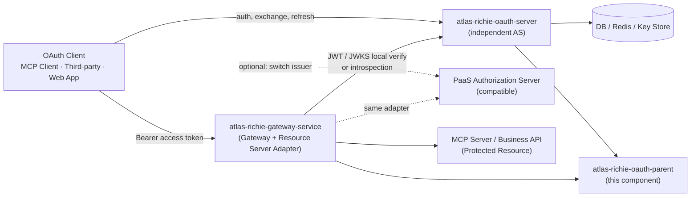

| Layer | Project | Owns | Explicitly does **not** own |
|---|---|---|---|
| **Capability** | `atlas-richie-oauth-parent` | Reusable protocol kernel, SPI ports, cache adapters, Spring Boot starter | Login page, admin UI, business user database, deployment entry-point |
| **Authorization Service** | `atlas-richie-oauth-server` (future, or PaaS AS) | Standard OAuth HTTP endpoints, user login, consent, client/scope/resource management, signing keys, audit, persistence | Gateway routing, downstream API authorization, business permission decisions |
| **Traffic Edge** | `atlas-richie-gateway-service` | Bearer extraction, JWKS / introspection validation, `issuer` / `audience` / `scope` / `resource` checks, principal propagation, edge rate-limit / anomaly detection, edge audit | issuing tokens, refreshing, revoking, client registration, consent, login, signing key custody |

> **A common mistake:** treating "Gateway does not own OAuth" as "Gateway does not use Redis". Gateway still uses Redis — but only for JWKS / introspection short-cache, distributed locks, JTI replay tracking and edge-side rate-limit. Gateway never treats Redis as authoritative Client / User / Consent / Refresh-Token state.

**Trust relationships:**

- The OAuth Service is the **sole** issuer of tokens and the **authoritative** source for Client, Scope, Resource, Consent and signing keys.
- Gateway trusts the configured `issuer`, JWKS, and introspection responses. Redis used by the gateway is **runtime cache**, not a new Authorization Server.
- Business services and MCP servers trust the `AuthenticatedPrincipal` produced by the Gateway or the local Resource Server adapter, not the JWT payload directly.

### Core Component Architecture

```mermaid
graph TB
    subgraph "atlas-richie-oauth-parent"
        direction TB

        subgraph Contract["oauth-contract"]
            direction TB
            C1["📋 Token / Introspection / Revoke DTOs"]
            C2["📋 GrantType / TokenType / Scope value objects"]
            C3["📋 Standard error code model"]
            C4["📋 RFC 8414 / 9728 metadata contracts"]
        end

        subgraph Core["oauth-core"]
            direction TB
            TE["🟢 TokenEndpoint"]
            CR["🟢 ClientRegistry"]
            SR["🟢 ScopeResolver"]
            TS["🟣 TokenStore (SPI)"]
            DT["🟣 DefaultTokenStore (Redis)"]
        end

        subgraph Authz["oauth-authz"]
            direction TB
            AE["🟠 AuthorizationEndpoint"]
            PKCE["🟠 PKCESupport (S256)"]
            ACG["🟠 AuthorizationCodeGrant"]
            ACS["🟣 AuthorizationCodeStore (SPI)"]
            ASM["🟠 AuthorizationServerMetadata (RFC 8414)"]
        end

        subgraph OIDC["oauth-oidc"]
            direction TB
            IDT["🔵 IdTokenSigner"]
            UIP["🔵 OidcUserInfoProvider SPI"]
            DSC["🔵 Discovery + JWKS contract"]
            LOG["🔵 RP-Initiated Logout + Front/Backchannel"]
        end

        subgraph DCR["oauth-dcr"]
            direction TB
            DCE["🔶 DynamicClientRegistrationEndpoint"]
            SSRF["🔶 SSRFProtection"]
            CMR["🔶 ClientIdMetadataDocumentResolver"]
        end

        subgraph ClientLib["oauth-client"]
            direction TB
            MDC["🟤 MetadataDiscoverer"]
            OAT["🟤 OAuthClient (authz-code · cc · refresh · device)"]
        end

        subgraph Resource["oauth-resource-server"]
            direction TB
            RSA["🟢 ResourceServerAuthenticator (JWT · INTRO · HYBRID)"]
            DP["🟢 DPoP proof verifier (RFC 9449)"]
        end

        subgraph Cache["oauth-cache"]
            direction TB
            OCH["🟣 OAuthCache SPI"]
            GCH["🟣 GlobalCacheOAuthCache (default)"]
        end

        subgraph Starter["oauth-spring-boot-starter + oauth-gateway-adapter"]
            direction TB
            CFG["⚙ AutoConfiguration"]
            GF["⚙ WebFlux Bearer + Principal filter"]
        end

        Authz --> Core
        OIDC --> Core
        OIDC --> Authz
        DCR --> Core
        ClientLib --> Contract
        Resource --> Contract
        Starter --> Core
        Starter --> Authz
        Starter --> OIDC
        Starter --> DCR
        Starter --> ClientLib
        Starter --> Resource
        Starter --> Cache
        Resource --> Cache
        Authz --> Cache
        DCR --> Cache

        Core --> Contract
        Authz --> Contract
        OIDC --> Contract
        DCR --> Contract
        Cache --> Contract
    end

    style Core fill:#e3f2fd,stroke:#1565c0,stroke-width:2px,color:#1565c0
    style Contract fill:#e3f2fd,stroke:none,color:#1565c0
    style Authz fill:#fff3e0,stroke:#e65100,stroke-width:2px,color:#e65100
    style OIDC fill:#e0f7fa,stroke:#00838f,stroke-width:2px,color:#00838f
    style DCR fill:#fce4ec,stroke:#c62828,stroke-width:2px,color:#c62828
    style ClientLib fill:#fff8e1,stroke:#f57f17,stroke-width:2px,color:#f57f17
    style Resource fill:#e8f5e9,stroke:#2e7d32,stroke-width:2px,color:#1b5e20
    style Cache fill:#f3e5f5,stroke:#7b1fa2,stroke-width:2px,color:#4a148c
    style Starter fill:#eceff1,stroke:#455a64,stroke-width:2px,color:#263238
```

### Module Layout

```
atlas-richie-oauth-parent/
├── atlas-richie-oauth-contract              # Protocol DTOs, error codes, cross-module contracts
├── atlas-richie-oauth-core                  # Token, Client, Scope, refresh rotation, replay markers
├── atlas-richie-oauth-authz                 # Authorization Code + PKCE (S256) + AS Metadata
├── atlas-richie-oauth-oidc                  # OIDC Provider: ID Token, UserInfo, Discovery, Logout
├── atlas-richie-oauth-dcr                   # Dynamic Client Registration (RFC 7591), SSRF defense
├── atlas-richie-oauth-client                # OAuth/OIDC client SDK: Metadata, Token, Introspection, UserInfo
├── atlas-richie-oauth-resource-server       # JWT/JWKS, Introspection, optional DPoP (RFC 9449)
├── atlas-richie-oauth-cache                 # Cache, distributed lock, replay-state port
├── atlas-richie-oauth-spring-boot-starter   # Spring Boot autoconfig + property binding
├── atlas-richie-oauth-gateway-adapter       # WebFlux Bearer + Principal filter facade
└── atlas-richie-oauth-test                  # Test fixtures (server, RSA/JWKS, Redis IT base)
```

| Module                          | Status                | Responsibility                                                                                                                                |
|---------------------------------|-----------------------|-----------------------------------------------------------------------------------------------------------------------------------------------|
| `oauth-contract`                | **Stable**            | Request / response DTOs, standard error codes, claim name constants                                                                          |
| `oauth-core`                    | **Stable**            | `TokenEndpoint`, `ClientRegistry`, `ScopeResolver`, `TokenStore` SPI                                                                          |
| `oauth-authz`                   | **Stable**            | `AuthorizationEndpoint`, `AuthorizationCodeGrant`, `PKCESupport` (S256 only), `AuthorizationCodeStore` SPI, `AuthorizationServerMetadata`    |
| `oauth-oidc`                    | **Stable contract**   | ID Token (RS256), `openid` / `nonce`, UserInfo Claims filter, Discovery, RP-Initiated Logout, Front/Backchannel Logout — HTTP injected by AS |
| `oauth-dcr`                     | **Stable**            | `DynamicClientRegistrationEndpoint`, `SSRFProtection`, `ClientIdMetadataDocumentResolver`                                                     |
| `oauth-client`                  | **Stable**            | OAuth / OIDC metadata discoverer, Authorization Code + PKCE client, Client Credentials client, Refresh Token rotation client              |
| `oauth-resource-server`         | **Stable**            | `ResourceServerAuthenticator` (JWT / Introspection / Hybrid), optional `DPoP` proof verifier                                                  |
| `oauth-cache`                   | **Stable**            | `OAuthCache` SPI; default `GlobalCacheOAuthCache` (Redis)                                                                                    |
| `oauth-spring-boot-starter`     | **Stable**            | Autoconfig + property binding for every module above                                                                                          |
| `oauth-gateway-adapter`        | **Stable**            | WebFlux Bearer + Principal facade; does not duplicate token business logic                                                                    |
| `oauth-test`                    | **Stable**            | Reusable test fixtures, OAuth Server harness, RSA/JWKS helpers                                                                                |

### Module Dependency

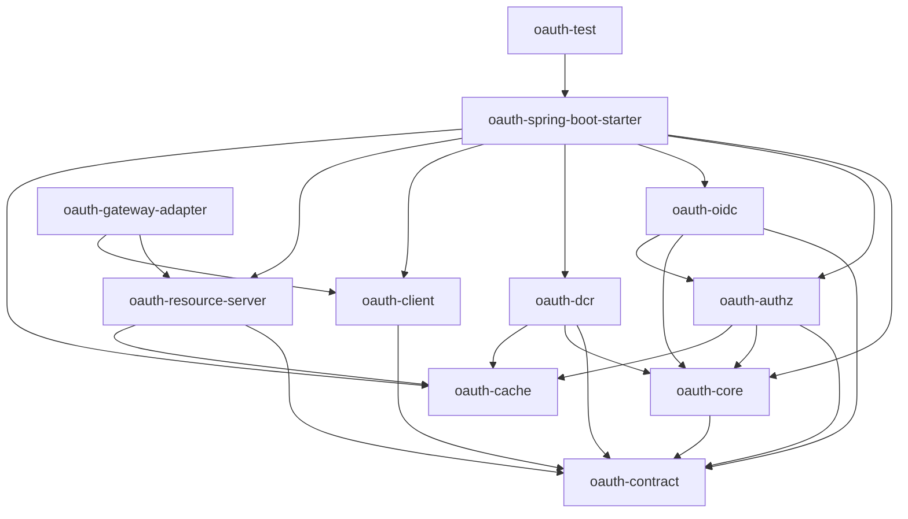

> Modules under `oauth-parent` MUST NOT depend on `atlas-richie-gateway-service` or on `atlas-richie-oauth-server` (when that is built). Reverse dependencies leak service-layer code into the public component and turn it into a "kitchen-sink" deployment.

### Layer Responsibilities

#### Contract Layer (`oauth-contract`)

- Protocol DTOs: Token, Introspection, Revocation, Authorization, DCR, AS Metadata, Protected Resource Metadata, JWKS.
- Standard error codes and the serialization rules (RFC 6749 §5.2 + extensions).
- Grant Type, Token Type, Client Authentication Method, Scope / Resource value objects.
- Standard claim name constants (`iss`, `sub`, `aud`, `scope`, `client_id`, `jti`, `cnf.jkt` …).

#### Core Layer (`oauth-core`)

- Validates client identity, grant type, scope and resource binding.
- Orchestrates access token and refresh token lifecycles (issue, refresh-rotate, revoke).
- `TokenStore`, `ClientRegistry`, `ScopeResolver` pluggable ports.
- Domain operations for refresh replay detection (consumed-marker + anomaly counter + audit hook).
- Standardized exceptions; never directly chooses HTTP status codes (the OAuth Service / Adapter maps them).

#### Authz Layer (`oauth-authz`)

- Validates the authorization request: client, redirect URI, response type, scope, resource, PKCE `code_challenge` (mandatory, `S256` only).
- Creates one-time authorization codes bound to client, user, redirect URI, scope, resource and PKCE challenge.
- Provides the `AuthorizationCodeStore` SPI for code persistence.
- Builds the AS Metadata (RFC 8414) DTO; the OAuth Service exposes it.

#### OIDC Layer (`oauth-oidc`)

- `openid` scope + `nonce` validation, RS256 ID Token issuance with `iss` / `aud` / `nonce` checks.
- `OidcUserInfoProvider` SPI lets the OAuth Service feed in user attributes; output is scope-filtered.
- Discovery metadata model and RP-Initiated Logout validation.
- Front-Channel and Backchannel Logout contracts; HTTP delivery and session lookup belong to the OAuth Service.

#### DCR Layer (`oauth-dcr`)

- RFC 7591 dynamic client registration and update.
- Validates redirect URI, client authentication method, grant type, scope and `jwks_uri`.
- SSRF defense for every URL field and for any remote metadata document fetch.

#### Client Layer (`oauth-client`)

- AS Metadata / Protected Resource Metadata discoverer.
- Standard OAuth client: Authorization Code + PKCE, Client Credentials, Refresh Token rotation.
- OIDC Discovery + UserInfo client.
- Token endpoint authentication, timeout, retry and standard error mapping.

#### Resource Server Layer (`oauth-resource-server`)

- JWT access token signature, `iss`, `aud` / `resource`, time window and scope verification.
- JWKS fetch + cache + key rotation. Cache is the runtime cache only — never authoritative.
- Introspection fallback (per mode).
- Optional `DPoP` proof verification (RFC 9449): ES256 signature, `htm`, query-stripped `htu`, `iat`, `ath`, Access Token `cnf.jkt`, single-use `jti`.
- Emits `AuthenticatedPrincipal` for the Gateway, MCP Server and any business service.

#### Cache Layer (`oauth-cache`)

- Authorization code, refresh token state, JTI blacklist, distributed lock, DPoP `jti` replay markers, rate-limit counters.
- Default Redis adapter via `atlas-richie-component-cache` (`GlobalCacheOAuthCache`).
- Cache Key schema is owned by the cache module — Gateway and business services never read those keys directly.

#### Starter + Gateway Adapter

- Starter: configuration binding, conditional autoconfig, default implementations, health checks.
- Gateway Adapter: WebFlux Filter façade for Bearer extraction, async verification, exception response, Principal propagation. **Does not** copy any token business logic.

### Data Ownership Matrix

| Data                                | Component-provided capability                                  | Authoritative owner            |
|-------------------------------------|----------------------------------------------------------------|--------------------------------|
| Client, Scope, Resource             | `ClientRegistry` / `ScopeResolver` SPI, default cache adapter | OAuth Service database         |
| Access Token signing                | `AccessTokenSigner` SPI (`RSA` recommended in production)      | OAuth Service Key Store        |
| Refresh Token                       | Rotation, consumption, replay detection (`TokenStore` SPI)    | OAuth Service DB / Redis       |
| Authorization Code                  | One-time write, consume, PKCE bind                             | OAuth Service Redis            |
| JWK Set                             | JWK parsing, cache, rotation adapter                           | OAuth Service Key Store / JWKS endpoint |
| User, login session, Consent        | Input port only (e.g. `OidcUserInfoProvider`, login callback)   | OAuth Service identity source  |
| JWKS / introspection cache          | Read-through cache                                            | Gateway / Resource Server      |
| DPoP `jti` replay / nonce state     | `OAuthCache` SPI                                               | Gateway / Resource Server      |

> Production deployments are ** refuse** to log client secret, password, full refresh token value or any signing private key in access tokens, logs, audit events or exception messages. Components return only the public identifier (`jti`, `kid`, hashed or truncated values).

### Token Lifecycle State Machine

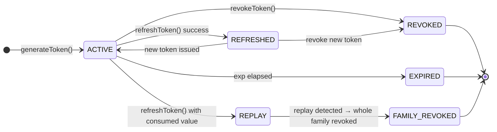

---

## 📎 🔄 RFC Coverage Matrix

The matrix below maps every RFC the component honours to the module that owns it, the public SPI used and the current status (`Stable` = API + tests + docs, `Contract` = SPI exists, behaviour owned by the OAuth Service, `Planned` = tracked but not shipped).

| RFC                                      | Title                                                       | Module                | SPI / Class                                            | Status   |
|------------------------------------------|-------------------------------------------------------------|-----------------------|--------------------------------------------------------|----------|
| [RFC 6749](https://datatracker.ietf.org/doc/html/rfc6749)     | OAuth 2.0 Authorization Framework                            | `oauth-core` / `oauth-authz` | `TokenEndpoint`, `AuthorizationEndpoint`             | Stable   |
| [RFC 6750](https://datatracker.ietf.org/doc/html/rfc6750)     | OAuth 2.0 Bearer Token Usage                                 | `oauth-contract` / `oauth-resource-server` | `BearerToken`, `ResourceServerAuthenticator`    | Stable   |
| [RFC 7009](https://datatracker.ietf.org/doc/html/rfc7009)     | OAuth 2.0 Token Revocation                                   | `oauth-core`          | `TokenEndpoint.revokeToken(...)`                        | Stable   |
| [RFC 7519](https://datatracker.ietf.org/doc/html/rfc7519)     | JSON Web Token (JWT)                                         | `oauth-core` / `oauth-oidc` | `AccessTokenSigner`, `IdTokenSigner`             | Stable   |
| [RFC 7591](https://datatracker.ietf.org/doc/html/rfc7591)     | Dynamic Client Registration Protocol                         | `oauth-dcr`           | `DynamicClientRegistrationEndpoint` + `SSRFProtection` | Stable   |
| [RFC 7636](https://datatracker.ietf.org/doc/html/rfc7636)     | PKCE for OAuth 2.0 (S256 only)                                | `oauth-authz`         | `PKCESupport` (`S256` enforced)                          | Stable   |
| [RFC 7662](https://datatracker.ietf.org/doc/html/rfc7662)     | OAuth 2.0 Token Introspection                                | `oauth-core` / `oauth-resource-server` | `TokenEndpoint.introspectToken(...)`, `ResourceServerAuthenticator` | Stable |
| [RFC 8252](https://datatracker.ietf.org/doc/html/rfc8252)     | OAuth 2.0 for Native Apps                                     | `oauth-authz` / `oauth-client` | PKCE + `none` + custom-scheme URI                 | Stable   |
| [RFC 8414](https://datatracker.ietf.org/doc/html/rfc8414)     | Authorization Server Metadata                                 | `oauth-authz`         | `AuthorizationServerMetadata`                            | Stable   |
| [RFC 8628](https://datatracker.ietf.org/doc/html/rfc8628)     | Device Authorization Grant                                   | `oauth-authz` / `oauth-core` | `DeviceAuthorizationService`, `TokenEndpoint.exchangeDeviceCode(...)` | Stable |
| [RFC 8707](https://datatracker.ietf.org/doc/html/rfc8707)     | Resource Indicators for OAuth 2.0                            | `oauth-authz` / `oauth-core` / `oauth-resource-server` | `resource` parameter, `aud` claim binding       | Stable   |
| [RFC 9068](https://datatracker.ietf.org/doc/html/rfc9068)     | JWT Profile for OAuth 2.0 Access Tokens                      | `oauth-core`          | `AccessTokenSigner` + `AccessTokenClaimsCustomizer`      | Stable   |
| [RFC 9449](https://datatracker.ietf.org/doc/html/rfc9449)     | DPoP (Demonstrating Proof of Possession)                     | `oauth-resource-server` (opt-in) | `DpopProofVerifier`                          | Contract |
| [RFC 9728](https://datatracker.ietf.org/doc/html/rfc9728)     | Protected Resource Metadata                                  | `oauth-resource-server` | `ProtectedResourceMetadata` (exposed by Resource)      | Contract |
| OAuth 2.1 (draft)                       | OAuth 2.1 Authorization Framework                            | `oauth-authz`         | PKCE mandatory, `plain` rejected, no implicit grant      | Stable   |

> **Where the OAuth Service still owns the HTTP runtime**: DCR HTTP endpoint, AS Metadata endpoint, JWKS endpoint, Login / Consent / MFA / Logout. The component supplies the SPI; the OAuth Service supplies the controllers.

---

## 🚀 Quick Start

### 1. Add the dependency

```xml
<dependency>
    <groupId>cn.richie696.component</groupId>
    <artifactId>atlas-richie-oauth-parent</artifactId>
</dependency>
```

> Importing the parent BOM pulls in `oauth-core`, `oauth-authz`, `oauth-dcr`, `oauth-oidc`, `oauth-resource-server`, `oauth-spring-boot-starter` and `oauth-gateway-adapter`. Add `atlas-richie-component-cache` if you want the Redis-backed default implementations.

### 2. Configure

The component exposes two configuration prefixes — `platform.oauth.*` for the standalone-AS profile (consumed by the OAuth Service) and `platform.component.oauth.*` for the gateway / resource-server profile. Both ship sensible defaults.

```yaml
platform:
  component:
    oauth:
      enabled: true
      # 32+ char random secret for HMAC fallback / opaque refresh signatures
      token-secret: ${OAUTH_TOKEN_SECRET:replace-me-with-a-32-char-random-secret}
      default-token-valid-duration: 2          # hours (access token)
      default-refresh-token-valid-duration: 720  # hours (refresh token, 30 days)
      revoke-previous-tokens-on-issue: false
      enable-daily-issue-limit: true

    oauth-authz:
      enabled: true
      authorization-code-ttl: 600              # 10 minutes

    oauth-dcr:
      enabled: true
      allowed-domains:
        - example.com
        - trusted-partner.com
      ssrf-cache-ttl: 3600                     # 1 hour

    oauth-resource-server:
      mode: hybrid                             # jwt | introspection | hybrid (default)
      issuer: https://auth.example.com
      jwk-set-uri: https://auth.example.com/oauth2/jwks
      introspection-uri: https://auth.example.com/oauth2/introspect
      introspection-client-id: gateway-resource
      introspection-client-secret: ${OAUTH_INTROSPECTION_SECRET}
      required-audience: business-api
      required-scopes: [api.read]
      introspection-fallback: true             # hybrid mode default
      fail-open: false
      dpop:
        enabled: false                         # opt-in
      cache:
        enabled: true
        jwks-ttl: PT10M
        introspection-ttl: PT30S
```

> Production deployments **must** set `token-secret` from a secret store (Vault / KMS / sealed secret) and **must** keep `issuer` aligned with the public DNS name used in issued JWT `iss` claims.

### 3. Register a client (static)

```yaml
platform:
  component:
    oauth:
      clients:
        - client-id: web-app
          client-secret: "{noop}change-me"
          grant-types: [authorization_code, refresh_token]
          redirect-uris: [https://app.example.com/callback]
          scopes: [openid, profile, email]
          require-pkce: true
          token-valid-duration: 1               # 1 hour
          refresh-token-valid-duration: 168     # 7 days
          ip-whitelist:
            - 203.0.113.0/24
        - client-id: billing-svc
          client-secret: "${BILLING_SVC_SECRET}"
          grant-types: [client_credentials]
          scopes: [invoice.read, invoice.write]
```

The full structure of `ClientConfig` is documented under [Interface Reference → `ClientRegistry`](#clientregistry--client-registry).

### 4. Request a token — `authorization_code` + PKCE

This flow assumes the Authorization Code was issued by the OAuth Service running on `https://auth.example.com`. The component owns the protocol semantics; the OAuth Service exposes the `/oauth2/authorize` endpoint, renders the consent page and calls `AuthorizationEndpoint.create(...)` once the user agrees.

**Step 1 — Authorization request** (issued by the OAuth Service):

```
GET https://auth.example.com/oauth2/authorize?
    response_type=code&
    client_id=web-app&
    redirect_uri=https://app.example.com/callback&
    scope=openid%20profile%20email&
    state=xyz&
    code_challenge=E9Mel... (BASE64URL(SHA256(verifier)))&
    code_challenge_method=S256&
    resource=https://mcp.example.com    # RFC 8707
```

**Step 2 — Token exchange**:

```bash
curl -X POST https://auth.example.com/oauth2/token \
  -H "Content-Type: application/x-www-form-urlencoded" \
  -d "grant_type=authorization_code" \
  -d "code=SplxlOBeZQQYbYS6WxSbIA" \
  -d "redirect_uri=https://app.example.com/callback" \
  -d "client_id=web-app" \
  -d "client_secret=change-me" \
  -d "code_verifier=dBjftJeZ4CVP-mB92K27uhbUJU1p1r_wW1gFWFOEjXk" \
  -d "resource=https://mcp.example.com"
```

Successful response (HTTP 200):

```json
{
  "access_token": "eyJhbGciOiJSUzI1NiIs...",
  "token_type": "Bearer",
  "expires_in": 3600,
  "refresh_token": "GEvxJVSMEt...",
  "scope": "openid profile email",
  "resource": "https://mcp.example.com"
}
```

`PKCESupport.verifyChallenge(...)` runs on the exchange — `S256` only, `plain` is rejected. `resource` is persisted with the code and verified at exchange time so a code cannot be redirected to a different resource server.

### 5. Request a token — `client_credentials`

```bash
# client_secret_basic
curl -X POST https://auth.example.com/oauth2/token \
  -u "billing-svc:${BILLING_SVC_SECRET}" \
  -d "grant_type=client_credentials" \
  -d "scope=invoice.read invoice.write" \
  -d "resource=https://billing-api.example.com"

# client_secret_post (alternative)
curl -X POST https://auth.example.com/oauth2/token \
  -d "grant_type=client_credentials" \
  -d "client_id=billing-svc" \
  -d "client_secret=${BILLING_SVC_SECRET}" \
  -d "scope=invoice.read"
```

The OAuth Service calls `TokenEndpoint.generateToken(clientId, clientSecret, clientIp)`. On success the component:

1. Verifies the client secret with constant-time comparison (`Strings.CS.equals`).
2. Loads `ClientConfig` from the SPI-backed `ClientRegistry`.
3. Increments the daily issue counter (`maxIssuesPerDay = max(24 / tokenValidDuration, 1) + 2`).
4. Optionally revokes previous refresh tokens (`revoke-previous-tokens-on-issue: true`).
5. Generates JWT access token + opaque refresh token; persists refresh via `TokenStore.storeRefreshToken(...)`; binds Access-Token IP via `bindAccessTokenIp(...)`.

### 6. Request a token — `refresh_token`

```bash
curl -X POST https://auth.example.com/oauth2/token \
  -u "web-app:change-me" \
  -d "grant_type=refresh_token" \
  -d "refresh_token=GEvxJVSMEt..."
```

`TokenEndpoint.refreshToken(refreshToken, ip)` runs the replay-defense flow:

1. Acquires `refresh-token-lock:{token}` (5-second TTL).
2. Loads the refresh entry; on mismatch returns `invalid_grant`.
3. Calls `TokenStore.consumeRefreshToken(...)`; if a `consumed-marker` already exists, increments the anomaly counter and emits a replay audit event — the whole token family is revoked.
4. Generates a new access token and rotates the refresh token.
6. The old refresh entry is physically removed; the consumed-marker is kept for the configured short window to catch delayed replays.

The distributed lock prevents two concurrent refreshes on the same token from racing; the loser receives `rate_limit_exceeded`.

### 7. Device Authorization Grant — `urn:ietf:params:oauth:grant-type:device_code`

```bash
# 1. Device asks for a code
curl -X POST https://auth.example.com/oauth2/device_authorization \
  -u "device-svc:${DEVICE_SVC_SECRET}" \
  -d "scope=mcp.read"

# Response
{
  "device_code": "GmRhmhcxhwAzkoEqiMEg_DnyE",
  "user_code": "WDJB-MJHT",
  "verification_uri": "https://auth.example.com/activate",
  "verification_uri_complete": "https://auth.example.com/activate?user_code=WDJB-MJHT",
  "expires_in": 1800,
  "interval": 5
}

# 2. User visits verification_uri and approves on the OAuth Service
#    (OAuth Service calls DeviceAuthorizationService.approve(userCode, subject))

# 3. Device polls /token
curl -X POST https://auth.example.com/oauth2/token \
  -u "device-svc:${DEVICE_SVC_SECRET}" \
  -d "grant_type=urn:ietf:params:oauth:grant-type:device_code" \
  -d "device_code=GmRhmhcxhwAzkoEqiMEg_DnyE"

# Too-frequent polling returns:
# 400 {"error": "slow_down", "interval": 10}
```

The component owns the device-code lifecycle (issue, store, approve, exchange, expiry). Login / MFA / consent belong to the OAuth Service — it injects the user identity back via `DeviceAuthorizationService.approve(userCode, subject)`.

### 8. Dynamic Client Registration

```bash
curl -X POST https://auth.example.com/oauth2/register \
  -H "Content-Type: application/json" \
  -d '{
    "client_name": "Mobile App",
    "redirect_uris": ["myapp://callback"],
    "grant_types": ["authorization_code", "refresh_token"],
    "token_endpoint_auth_method": "none",
    "scope": "openid profile",
    "jwks_uri": "https://mcp.example.com/.well-known/jwks.json"
  }'

# Response (HTTP 201)
{
  "client_id": "0192f3a5-...",
  "client_id_issued_at": 1718803200,
  "registration_access_token": "Kf3...",
  "registration_client_uri": "https://auth.example.com/oauth2/register/0192f3a5-...",
  "token_endpoint_auth_method": "none",
  "redirect_uris": ["myapp://callback"],
  "grant_types": ["authorization_code", "refresh_token"],
  "scope": "openid profile"
}

# Subsequent update
curl -X PUT https://auth.example.com/oauth2/register/0192f3a5-... \
  -H "Authorization: Bearer Kf3..." \
  -H "Content-Type: application/json" \
  -d '{ "client_name": "Mobile App v2" }'
```

`SSRFProtection` runs against every URL field (HTTPS only, no IP literals, reserved-range check, optional allow-list, DNS-rebinding-safe resolution). Anonymous DCR is **not** recommended — the OAuth Service is expected to gate registration with a registration code, admin approval, tenant policy or a trusted bootstrap token, and to write the resulting client into the persistent `ClientRepository`.

### 9. Resource Server wiring

```java
@Configuration
public class OAuth2ResourceServerConfig {

    @Bean
    public ResourceServerAuthenticator resourceServerAuthenticator(
            OAuthCache cache, OAuth2ResourceServerProperties props) {
        // mode = jwt / introspection / hybrid (default)
        return ResourceServerAuthenticator.builder()
                .mode(props.getMode())
                .issuer(props.getIssuer())
                .jwkSetUri(props.getJwkSetUri())
                .introspectionUri(props.getIdpIntrospectionUri())
                .introspectionClientId(props.getIntrospectionClientId())
                .introspectionClientSecret(props.getIntrospectionClientSecret())
                .requiredAudience(props.getRequiredAudience())
                .requiredScopes(props.getRequiredScopes())
                .introspectionFallback(props.isIntrospectionFallback())
                .dpopEnabled(props.getDpop().isEnabled())
                .cache(cache)
                .build();
    }
}
```

The authenticator produces an `AuthenticatedPrincipal` carrying `subject`, `clientId`, `scope`, `audience`, `resource`, `jti`, `tenantId`. The Gateway Adapter then forwards that principal via standard headers / Reactor Context — no second JWT parse downstream.

---

## 📚 Interface Reference

The tables below list the public methods of every reusable class. Internal helpers (private methods, `support.*` classes) are intentionally omitted.

### `TokenEndpoint` — token lifecycle

| Method | Purpose | Returns |
|---|---|---|
| `TokenResponse generateToken(String clientId, String clientSecret, String ip)` | `client_credentials` grant — issues JWT access + opaque refresh, persists refresh via `TokenStore`, binds IP, enforces daily budget | `TokenResponse` |
| `TokenResponse refreshToken(String refreshToken, String ip)` | `refresh_token` grant — acquires distributed lock, rotates, performs replay detection | `TokenResponse` |
| `TokenResponse exchangeCodeForToken(String clientId, String clientSecret, String code, String codeVerifier, String redirectUri, String resource, String ip)` | `authorization_code` + PKCE exchange — verifies PKCE S256, persists `resource` into `aud`, enforces one-shot code consumption | `TokenResponse` |
| `TokenResponse exchangeDeviceCode(String clientId, String deviceCode)` | `device_code` exchange — enforces interval / `slow_down`, returns the issued tokens | `TokenResponse` |
| `void revokeToken(String token, String tokenTypeHint)` | Revokes `access_token` (blacklist) or `refresh_token` (physical delete). `null` hint → inferred from the `.` character. | `void` |
| `TokenIntrospection introspectToken(String accessToken)` | RFC 7662 introspection payload: `active`, `client_id`, `scope`, `exp`, `sub`, `aud`, `jti`, `iss` | `TokenIntrospection` |
| `ClientConfig verifyAccessToken(String accessToken)` | Verifies JWT signature, expiry, blacklist, client enabled. Returns `null` on any failure. | `ClientConfig` |
| `ClientConfig verifyAccessToken(String accessToken, String expectedAudience)` | Adds audience verification — RFC 8707 binding | `ClientConfig` |
| `List<String> getIpWhitelist(String accessToken)` | Returns the IP whitelist bound to the token, or empty list | `List<String>` |

### `ClientRegistry` — client registry

| Method | Purpose | Returns |
|---|---|---|
| `<T> T getClientConfig(String clientId, ClientConfig.Field field)` | Read a single field (typed) | `T` |
| `Map<ClientConfig.Field, Object> getClientConfig(String clientId, Field f1, Field f2, ...)` | Read multiple fields in one round-trip | `Map<Field, Object>` |
| `boolean isClientValid(String clientId)` | Returns `true` only if the client is loaded and `enabled=true` | `boolean` |
| `boolean verifyClientSecret(String clientId, String clientSecret)` | Constant-time comparison via `Strings.CS.equals` | `boolean` |
| `ClientConfig registerTestClient(String clientName)` | Generates a random client_id/secret pair and persists it. **Dev/test only.** | `ClientConfig` |
| `void save(ClientConfig config)` (SPI) | Persist a client configuration | `void` |

### `ScopeResolver` — scope path matching

| Method | Purpose | Returns |
|---|---|---|
| `List<String> getRequiredScopes(String path, String method)` | Ant-path match the request path / method against `gateway.scope.*` configuration and return the required scopes | `List<String>` |
| `boolean verifyScope(Set<String> tokenScopes, List<String> requiredScopes)` | Returns `true` if any required scope is present in the token (OR logic) | `boolean` |
| `Set<String> extractScopesFromToken(String accessToken)` | Parse the `scope` claim out of the JWT | `Set<String>` |

### `AuthorizationEndpoint` / `AuthorizationCodeGrant` / `PKCESupport`

| Class | Method | Purpose |
|---|---|---|
| `AuthorizationEndpoint` | `void handleAuthorizationRequest(HttpServletRequest, HttpServletResponse)` | Render the OAuth Service's authorize UI. Verifies client, redirect URI, scope, resource, PKCE (`S256` mandatory). |
| `AuthorizationEndpoint` | `void handleAuthorizationConsent(HttpServletRequest, HttpServletResponse)` | Process the consent submission, mint the code, redirect back with `code` + `state`. |
| `AuthorizationCodeGrant` | `TokenResponse exchangeCodeForToken(clientId, clientSecret, code, codeVerifier, redirectUri, resource, ip)` | One-shot code consumption + PKCE verification + JWT issuance with `aud = resource`. |
| `PKCESupport` | `String generateCodeVerifier()` | 32-byte URL-safe base64, 43 chars | 
| `PKCESupport` | `String generateCodeChallenge(String codeVerifier)` | `BASE64URL(SHA256(codeVerifier))` |
| `PKCESupport` | `boolean verifyChallenge(String codeChallenge, String method, String codeVerifier)` | Verifies `S256` only — `plain` is rejected |

### `DynamicClientRegistrationEndpoint` + `SSRFProtection`

| Class | Method | Purpose |
|---|---|---|
| `DynamicClientRegistrationEndpoint` | `ClientRegistrationResponse registerClient(ClientRegistrationRequest request, HttpServletRequest http)` | DCR create. Validates URL fields through `SSRFProtection`. |
| `DynamicClientRegistrationEndpoint` | `ClientRegistrationResponse updateClient(String clientId, ClientRegistrationRequest request, HttpServletRequest http)` | DCR update, requires `Bearer registration_access_token`. |
| `SSRFProtection` | `boolean isUrlSafe(String url)` | Five-layer check: HTTPS only → no IP literal → no reserved range → allow-list → DNS resolve + range check (cache-backed). |

### `DeviceAuthorizationService` + `TokenEndpoint.exchangeDeviceCode(...)`

| Class | Method | Purpose |
|---|---|---|
| `DeviceAuthorizationService` | `DeviceAuthorizationResponse issueDeviceCode(String clientId, List<String> scopes, String resource)` | Mints `device_code` + `user_code`, returns `verification_uri` + `interval` |
| | `void approve(String userCode, String subject)` | Called by the OAuth Service once the user confirms on `verification_uri` |
| | `void deny(String userCode, String reason)` | Deny path; subsequent exchange returns `access_denied` |
| `TokenEndpoint` | `TokenResponse exchangeDeviceCode(String clientId, String deviceCode)` | Polling exchange. Enforces `interval`; too-frequent polling returns `slow_down`. |

### `ResourceServerAuthenticator` — three modes

```java
ResourceServerAuthenticator authenticator = ResourceServerAuthenticator.builder()
    .mode(Mode.JWT)                                  // or INTROSPECTION, or HYBRID
    .issuer("https://auth.example.com")
    .jwkSetUri("https://auth.example.com/oauth2/jwks")
    .introspectionUri("https://auth.example.com/oauth2/introspect")
    .introspectionClientId("gateway-resource")
    .introspectionClientSecret("...")
    .requiredAudience("business-api")
    .requiredScopes(List.of("api.read"))
    .introspectionFallback(true)                    // hybrid mode default
    .dpopEnabled(false)
    .cache(cache)
    .build();

AuthenticationResult result = authenticator.authenticate("Bearer eyJ...");
```

| Mode | Behavior |
|---|---|
| `JWT` | Local JWKS verify only. Fastest path; no AS call. `jwk-set-uri` required. |
| `INTROSPECTION` | Call the AS `introspect` endpoint on every request. Cache results for the configured short TTL. `introspection-uri` required. |
| `HYBRID` (default) | Try JWT first; if the token is opaque, unparseable or explicitly flagged for introspection, fall back to AS `introspect`. Both endpoints required. |

`introspection-fallback` defaults to `true` for `HYBRID`. Production builds that configure neither endpoint must reject the configuration at startup (fail-closed).

### `AccessTokenSigner` / `JwkSetProvider` / `AccessTokenClaimsCustomizer`

| SPI | Method | Purpose |
|---|---|---|
| `AccessTokenSigner` | `String sign(JwtClaims claims)` | Sign the JWT access token. `RSA` is the production recommendation. |
| `AccessTokenSigner` | `JwtClaims verifyAndParse(String token)` | Verify signature + standard claims, return parsed claims. |
| `JwkSetProvider` | `List<Jwk> keys()` | List of currently active public keys (advertised as JWKS). Implementations must support `active` / `retiring` / `retired` lifecycle. |
| `AccessTokenClaimsCustomizer` | `Map<String, Object> customize(String clientId, ClientConfig client, List<String> scopes, String resource)` | Trusted-server-side extension. Tenant and role claims live here. Reserved protocol claims (`iss` / `sub` / `aud` / `scope` / `client_id` / `jti` / `exp` / `iat` / `nbf`) cannot be overwritten. |

### `OAuthCache` / `TokenStore` / `AuthorizationCodeStore` SPI

| SPI | Default impl | Notes |
|---|---|---|
| `OAuthCache` | `GlobalCacheOAuthCache` (Redis) | Authorization code, refresh token state, JTI blacklist, distributed lock, DPoP `jti`, rate-limit counters |
| `TokenStore` | `DefaultTokenStore` (Redis) | Refresh-token storage, consumed-marker, anomaly counters, daily issue budget, IP binding |
| `AuthorizationCodeStore` | `DefaultAuthorizationCodeStore` (Redis) | One-shot codes, PKCE binding, default TTL 600s |
| `ClientRepository` | `RedisClientRepository` | Per-client configuration, secret hash, scope list |

> The Redis Key schema is owned by the cache module. Gateway and business services must not read those keys directly — going through the SPI keeps Service upgrades from breaking consumer code.

---

## 🔧 Core Capabilities

The seven scenarios below cover the full happy path of every grant type, the resource-server verification modes and the OIDC contract. Each scenario lists the entry-point service, the moving parts that get touched and a runnable snippet (curl or Java) you can copy into your test suite.

### Scenario 1 — `authorization_code` + PKCE

**Use case**: Web apps, mobile apps, SPAs, MCP user-agent flows. PKCE is mandatory (`S256` only).

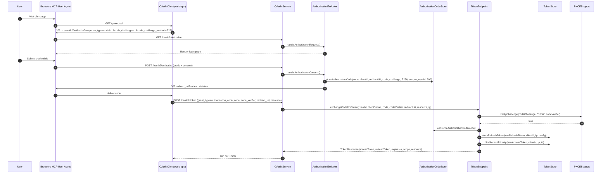

**Code (OAuth Service)**:

```java
@RestController
public class OAuth2AuthorizeController {

    private final AuthorizationEndpoint authorizationEndpoint;
    private final AuthorizationCodeGrant authorizationCodeGrant;

    @GetMapping("/oauth2/authorize")
    public void authorize(HttpServletRequest req, HttpServletResponse resp) throws IOException {
        authorizationEndpoint.handleAuthorizationRequest(req, resp);
    }

    @PostMapping("/oauth2/authorize")
    public void consent(HttpServletRequest req, HttpServletResponse resp) throws IOException {
        authorizationEndpoint.handleAuthorizationConsent(req, resp);
    }

    @PostMapping("/oauth2/token")
    public TokenResponse token(@RequestParam Map<String, String> params,
                              @RequestHeader(value = "Authorization", required = false) String auth,
                              HttpServletRequest http) {
        String[] credentials = BasicAuthExtractor.parse(auth);   // client_secret_basic OR client_secret_post
        return switch (params.get("grant_type")) {
            case "authorization_code" -> authorizationCodeGrant.exchangeCodeForToken(
                    nvl(params.get("client_id"), credentials[0]),
                    nvl(params.get("client_secret"), credentials[1]),
                    params.get("code"),
                    params.get("code_verifier"),
                    params.get("redirect_uri"),
                    params.get("resource"),
                    ClientIpExtractor.from(http));
            case "refresh_token" -> tokenEndpoint.refreshToken(params.get("refresh_token"), ClientIpExtractor.from(http));
            case "client_credentials" -> tokenEndpoint.generateToken(
                    nvl(params.get("client_id"), credentials[0]),
                    nvl(params.get("client_secret"), credentials[1]),
                    ClientIpExtractor.from(http));
            case "urn:ietf:params:oauth:grant-type:device_code" -> tokenEndpoint.exchangeDeviceCode(
                    nvl(params.get("client_id"), credentials[0]),
                    params.get("device_code"));
            default -> throw new BusinessException(OAuth2ErrorCode.UNSUPPORTED_GRANT_TYPE);
        };
    }
}
```

### Scenario 2 — `client_credentials`

**Use case**: service-to-service auth, M2M, MCP server-to-server.

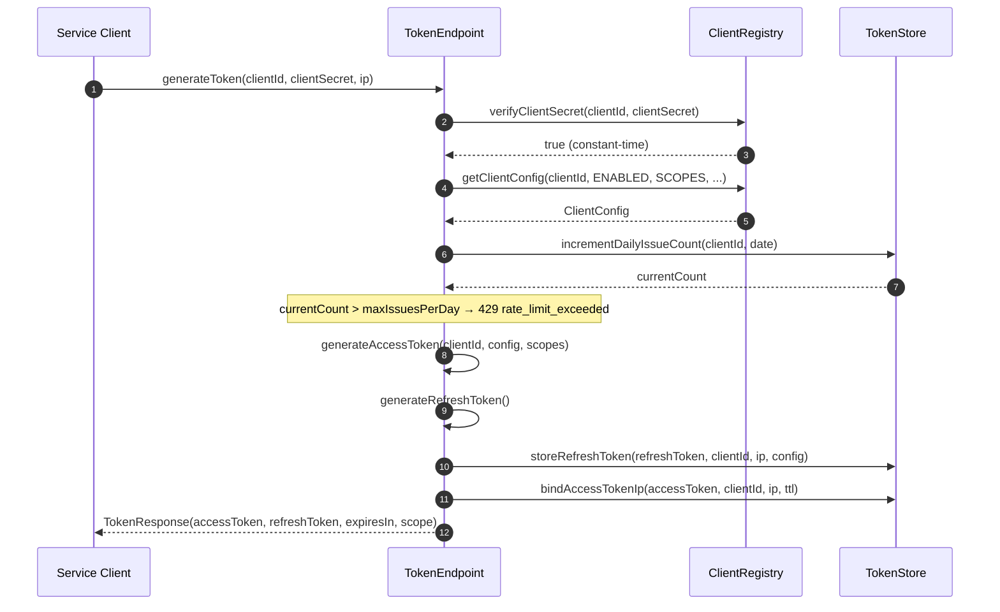

**Key implementation notes:**

- `Strings.CS.equals` for the secret comparison — prevents timing-channel attacks.
- `maxIssuesPerDay = max(24 / tokenValidDuration, 1) + 2` — a 1-hour token allows 26 issues / day, a 24-hour token only 3.
- IP binding on access tokens is **opt-in** (always on for `refresh_token` by default in the current core impl). Disable by leaving the whitelist empty.

### Scenario 3 — `refresh_token` rotation + replay detection

**Use case**: long-lived sessions for first-party clients, mobile apps. The single most security-critical flow.

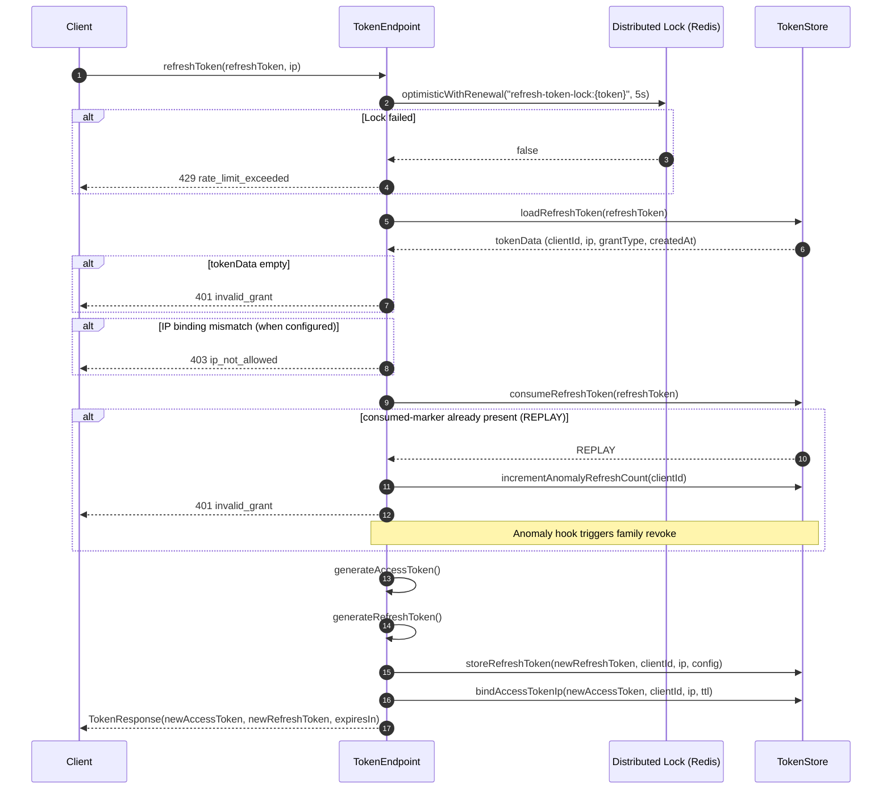

**Replay-detection contract:**

- Every successful refresh physically removes the old refresh entry and writes a short-lived `consumed-marker`.
- If the same refresh token shows up twice (concurrent retry, malicious replay), `consumeRefreshToken(...)` returns the `REPLAY` status. The component increments `anomaly.refresh.count` for the client and emits an audit event.
- The OAuth Service is expected to revoke the **entire token family** (every refresh issued under the same lineage) on replay detection.

### Scenario 4 — `device_code`

**Use case**: Smart TVs, CLI tools, headless devices.

**Service-side code**:

```java
@RestController
public class OAuth2DeviceController {

    private final DeviceAuthorizationService deviceService;
    private final AuthorizationCodeGrant    authCodeGrant;   // reuse TokenEndpoint.exchangeDeviceCode

    @PostMapping("/oauth2/device_authorization")
    public DeviceAuthorizationResponse issue(@RequestParam Map<String, String> params,
                                            @RequestHeader(value = "Authorization", required = false) String auth) {
        String[] credentials = BasicAuthExtractor.parse(auth);
        return deviceService.issueDeviceCode(
            nvl(params.get("client_id"), credentials[0]),
            ScopeParser.parse(params.get("scope")),
            params.get("resource"));
    }

    /** OAuth Service calls this once the user has confirmed the device on /activate. */
    @PostMapping("/internal/device/{userCode}/approve")
    public void approve(@PathVariable String userCode, @RequestParam String subject) {
        deviceService.approve(userCode, subject);
    }

    @PostMapping("/oauth2/token")
    public TokenResponse poll(@RequestParam Map<String, String> params,
                              @RequestHeader(value = "Authorization", required = false) String auth) {
        String[] credentials = BasicAuthExtractor.parse(auth);
        return tokenEndpoint.exchangeDeviceCode(
            nvl(params.get("client_id"), credentials[0]),
            params.get("device_code"));
    }
}
```

**Client flow**:

```
1. Device → POST /oauth2/device_authorization
   ← { device_code, user_code, verification_uri, interval, expires_in }
2. Device shows verification_uri + user_code to the user
3. User visits verification_uri on a separate device, enters user_code, approves
   OAuth Service → DeviceAuthorizationService.approve(user_code, subject)
4. Device polls POST /oauth2/token { grant_type=urn:ietf:params:oauth:grant-type:device_code, device_code }
   - Too soon → 400 slow_down (interval grows)
   - User approved → TokenResponse(access_token, refresh_token, ...)
   - User denied → 400 access_denied
   - Code expired → 400 expired_token
```

### Scenario 5 — Dynamic Client Registration

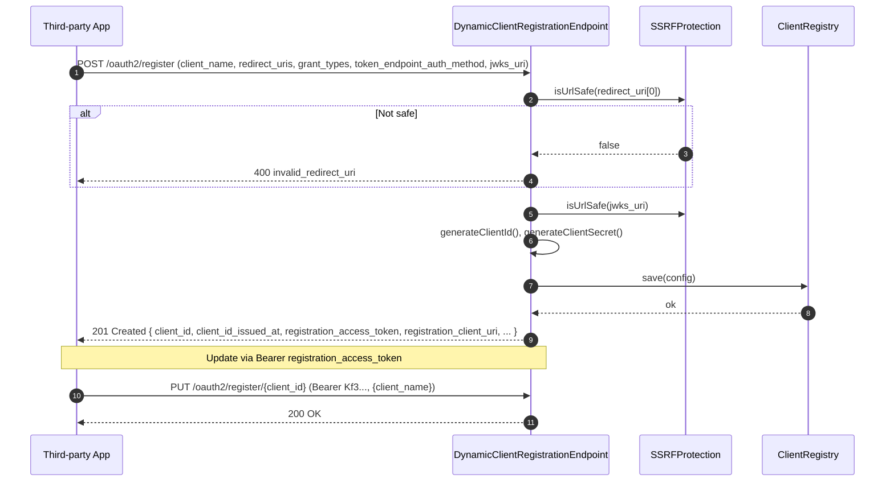

**SSRF defense layers** (`SSRFProtection.isUrlSafe`):

1. HTTPS protocol only — HTTP is rejected.
2. No IP literal (v4 or v6) — `https://10.0.0.1/...` is rejected.
3. Hostname must not resolve to a reserved range (`10.0.0.0/8`, `172.16.0.0/12`, `192.168.0.0/16`, `127.0.0.0/8`, `169.254.0.0/16`, IPv6 ULA, link-local).
4. Optional allow-list (`oauth-dcr.allowed-domains`) — rejects any host not on the list.
5. DNS resolution + cache + re-check the resolved IP — defeats DNS rebinding.

Anonymous open registration is **not** the recommended posture. Gate DCR behind a registration code, admin approval, tenant policy or a trusted bootstrap token, and write the resulting client into the persistent `ClientRepository`.

### Scenario 6 — Resource Server: JWT / Introspection / Hybrid

**Use case**: any service that consumes Bearer tokens — Gateway, MCP Server, business API.

```java
@Component
public class ResourceServerFilter extends OncePerRequestFilter {

    private final ResourceServerAuthenticator authenticator;
    private final HeaderForwarding             principalPropagator;

    @Override
    protected void doFilterInternal(HttpServletRequest req, HttpServletResponse resp, FilterChain chain) {
        Optional<String> token = BearerExtractor.from(req);
        if (token.isEmpty()) {
            chain.doFilter(req, resp);
            return;
        }
        AuthenticationResult result = authenticator.authenticate(token.get());
        if (!result.isAuthenticated()) {
            resp.setHeader("WWW-Authenticate",
                "Bearer realm=\"resource\", error=\"" + result.getError() + "\"");
            resp.sendError(result.status(), result.getError());
            return;
        }
        AuthenticatedPrincipal p = result.getPrincipal();
        principalPropagator.propagate(req, p);     // X-User-Id / X-Client-Id / X-Scopes / X-Audience / X-Jti
        chain.doFilter(req, resp);
    }
}
```

**Three modes**, choose per environment:

| Mode | Latency | AS dependency | When to pick |
|---|---|---|---|
| `JWT` | Low (cached JWKS) | None at request time | Stateless services; long-lived public keys |
| `INTROSPECTION` | Higher (every request) | One call per request | Strict revocation; opaque tokens |
| `HYBRID` (default) | Mixed | AS only when JWT path fails | Production general-purpose |

### Scenario 7 — OIDC Discovery + ID Token contract

```bash
# Discovery (RFC 8414 + OIDC extension)
curl https://auth.example.com/.well-known/openid-configuration
```

```json
{
  "issuer": "https://auth.example.com",
  "authorization_endpoint": "https://auth.example.com/oauth2/authorize",
  "token_endpoint": "https://auth.example.com/oauth2/token",
  "introspection_endpoint": "https://auth.example.com/oauth2/introspect",
  "revocation_endpoint": "https://auth.example.com/oauth2/revoke",
  "jwks_uri": "https://auth.example.com/oauth2/jwks",
  "response_types_supported": ["code"],
  "grant_types_supported": ["authorization_code", "client_credentials", "refresh_token", "urn:ietf:params:oauth:grant-type:device_code"],
  "subject_types_supported": ["public"],
  "id_token_signing_alg_values_supported": ["RS256"],
  "code_challenge_methods_supported": ["S256"],
  "scopes_supported": ["openid", "profile", "email"],
  "token_endpoint_auth_methods_supported": ["client_secret_basic", "client_secret_post", "none"],
  "introspection_endpoint_auth_methods_supported": ["client_secret_basic", "client_secret_post"],
  "claims_supported": ["sub", "iss", "aud", "exp", "iat", "auth_time", "nonce", "name", "email", "email_verified"]
}
```

The component supplies `AuthorizationServerMetadata` and the OIDC ID Token contract. The OAuth Service exposes the `/.well-known/openid-configuration` endpoint, renders the consent screen and feeds user attributes via `OidcUserInfoProvider`. Response modes `query`, `form_post` and Hybrid are configurable per client.

---

## 🎯 Best Practices

1. **Always use PKCE for public clients** (mobile / SPA / CLI). Set `oauth-authz` to require `code_challenge` and reject `plain` (already enforced by `PKCESupport`).
2. **Prefer short access tokens + rotated refresh tokens**. Access tokens 5–15 minutes; refresh tokens 7–30 days with rotation. Anything longer should be replaced by `client_credentials` + DP-oP / mTLS.
3. **Use JWT access tokens (`aud`+`scope`) for the gateway hot path.** `introspection` is for opaque tokens or strict immediate revocation.
4. **Bind `resource` (RFC 8707) at code exchange.** The component persists the resource with the code and verifies it on exchange. This prevents token forwarding across resource servers.
5. **Rotate signing keys every 90 days or less.** Keep the retiring public key published in JWKS for the duration of the longest issued token TTL. `JwkSetProvider` advertises both `active` and `retiring` keys; the signing service handles the switch.
6. **Hold the signing private key in OAuth Service, never in this component.** The component holds the protocol logic; the key store belongs to the AS runtime (HSM / sealed key file / KMS).
7. **Inject tenant claims from the trusted server-side context.** Implement `AccessTokenClaimsCustomizer` to read `tenantId` from your own context (HTTP header from gateway, session attribute, etc.) — never from the inbound OAuth request body.
8. **Fail-closed by default.** Do not set `fail-open: true` on `oauth-resource-server`. If `jwk-set-uri` and `introspection-uri` are both missing, refuse to start the Resource Server rather than silently accepting every request.
9. **Set introspection-cache TTL short** (`PT30S` recommended). A long cache hides revocation; a short cache lets the AS stay close to authoritative without paying a network round-trip on every request.
10. **Disable anonymous DCR in production.** Gate DCR behind a registration code, admin approval or tenant policy. Anonymous open DCR is for dev / partner onboarding only.
11. **Treat the Redis cache as runtime cache, not authoritative.** Gateway and Resource Server use `OAuthCache` for JWKS, introspection results, JTI replay and edge rate-limit. Client configuration, refresh tokens and user data live in the OAuth Service's persistent storage.
12. **Don't put secrets in YAML.** Reference them via `${OAUTH_TOKEN_SECRET}` and resolve through Vault / KMS / sealed secrets. Never commit raw `client-secret` values.
13. **SSRF allow-list for DCR.** Even with the five-layer SSRF defense, set `oauth-dcr.allowed-domains` in production to a tight allow-list (e.g. internal IdP and known partner domains).
14. **Audit sensitive events.** Emit audit events for: replay detection, anomalous refresh rate, DCR registration/update, JWKS key rotation, AS unavailability, client disable/enable.

---

## ⚙️ Configuration Reference

Two configuration prefixes coexist — pick the one that matches the deployment profile. `platform.oauth.*` is for the **AS service**; `platform.component.oauth.*` is for the **gateway / resource server**.

### `platform.component.oauth.*` (gateway / resource-server profile)

| Property                                                | Type           | Default          | Description                                                                                                                |
|---------------------------------------------------------|----------------|------------------|----------------------------------------------------------------------------------------------------------------------------|
| `enabled`                                               | boolean        | `false`          | Master switch                                                                                                              |
| `token-secret`                                          | String         | —                | 32+ char random secret for HMAC fallback / opaque refresh signatures                                                       |
| `default-token-valid-duration`                          | Integer (h)    | `2`              | Default access-token TTL                                                                                                   |
| `default-refresh-token-valid-duration`                  | Integer (h)    | `720`            | Default refresh-token TTL (30 days)                                                                                        |
| `revoke-previous-tokens-on-issue`                       | boolean        | `false`          | Revoke previous refresh token whenever a new one is issued                                                                |
| `enable-daily-issue-limit`                              | boolean        | `true`           | Enforce the daily issue budget                                                                                             |
| `clients`                                               | List           | `[]`             | Static client registrations (see [§3](#3-register-a-client-static))                                                        |
| `clients[].client-id`                                   | String         | —                | Client identifier                                                                                                          |
| `clients[].client-secret`                               | String         | —                | Secret hash or `{noop}plaintext` for dev                                                                                   |
| `clients[].grant-types`                                 | List           | `[]`             | Allowed grant types                                                                                                        |
| `clients[].redirect-uris`                               | List           | `[]`             | Allowed redirect URIs (Authorization Code)                                                                                 |
| `clients[].scopes`                                      | List           | `[]`             | Allowed scopes                                                                                                             |
| `clients[].require-pkce`                                | boolean        | `true`           | Force PKCE for this client                                                                                                  |
| `clients[].token-valid-duration`                        | Integer (h)    |                  | Per-client override                                                                                                        |
| `clients[].refresh-token-valid-duration`                | Integer (h)    |                  | Per-client override                                                                                                        |
| `clients[].ip-whitelist`                                | List           | `[]`             | Refresh-token IP whitelist                                                                                                 |
| `oauth-authz.enabled`                                   | boolean        | `true`           | Enable `AuthorizationEndpoint` + `AuthorizationCodeGrant`                                                                  |
| `oauth-authz.authorization-code-ttl`                    | Integer (s)    | `600`            | Authorization code TTL                                                                                                     |
| `oauth-dcr.enabled`                                     | boolean        | `true`           | Enable DCR                                                                                                                 |
| `oauth-dcr.allowed-domains`                             | List           | `[]`             | SSRF allow-list (in addition to the five built-in checks)                                                                  |
| `oauth-dcr.ssrf-cache-ttl`                              | Integer (s)    | `3600`           | DNS resolution cache TTL                                                                                                   |
| `oauth-resource-server.mode`                            | enum           | `hybrid`         | `jwt` / `introspection` / `hybrid`                                                                                         |
| `oauth-resource-server.issuer`                          | String         | —                | Trusted `iss` claim value                                                                                                  |
| `oauth-resource-server.jwk-set-uri`                     | String         | —                | JWKS endpoint URL (required for `jwt` and `hybrid`)                                                                        |
| `oauth-resource-server.introspection-uri`               | String         | —                | Introspection endpoint URL (required for `introspection` and `hybrid`)                                                     |
| `oauth-resource-server.introspection-client-id`        | String         | —                | Client ID used to call introspection                                                                                       |
| `oauth-resource-server.introspection-client-secret`    | String         | —                | Client secret used to call introspection                                                                                   |
| `oauth-resource-server.required-audience`               | String         | —                | Optional `aud` claim requirement                                                                                           |
| `oauth-resource-server.required-scopes`                 | List           | `[]`             | Required scopes required (any-of)                                                                                            |
| `oauth-resource-server.introspection-fallback`         | boolean        | `true`           | Hybrid mode: fall back to introspection when JWT path fails                                                                |
| `oauth-resource-server.fail-open`                       | boolean        | `false`          | If `true`, allows the request when neither validation path is reachable. **Must remain `false` in production.**              |
| `oauth-resource-server.dpop.enabled`                    | boolean        | `false`          | Opt-in DPoP proof verification                                                                                             |
| `oauth-resource-server.cache.enabled`                   | boolean        | `true`           | Enable JWKS / introspection result cache                                                                                   |
| `oauth-resource-server.cache.jwks-ttl`                  | Duration       | `PT10M`          | JWKS cache TTL                                                                                                             |
| `oauth-resource-server.cache.introspection-ttl`        | Duration       | `PT30S`          | Introspection cache TTL                                                                                                    |

### `platform.oauth.*` (AS service profile)

| Property               | Type    | Default | Description                                                              |
|------------------------|---------|---------|--------------------------------------------------------------------------|
| `issuer`               | String  | —       | Public issuer URL — used as `iss` claim and advertised in Metadata        |
| `authorization-endpoint` | String | —     | Authorization endpoint URL advertised in Metadata                       |
| `token-endpoint`       | String  | —       | Token endpoint URL advertised in Metadata                               |
| `provider`             | enum    | `self-hosted` | `self-hosted` / `paas` — switches endpoint resolution strategy |
| `authorization-server-metadata-uri` | String | — | Full URL of `/.well-known/oauth-authorization-server`                  |
| `jwks-uri`             | String  | —       | JWKS endpoint URL                                                        |
| `default-client-auth-method` | enum | `client_secret_basic` | Default client authentication method            |

### Daily Issue Limit Rules

```
maxIssuesPerDay = max(24 / tokenValidDuration, 1) + 2
```

| `tokenValidDuration` (hours) | `base` | `maxIssuesPerDay` |
|---|---|---|
| 1  | 24 | 26 |
| 2  | 12 | 14 |
| 4  | 6  | 8  |
| 8  | 3  | 5  |
| 24 | 1  | 3  |

Set `enable-daily-issue-limit: false` only for dev / test profiles.

### Redis Key Schema (owned by `oauth-cache`, do not read directly)

| Purpose                      | Key template                            |
|------------------------------|-----------------------------------------|
| Client config (Hash)         | `third-party-client:{clientId}`         |
| Refresh token (Hash)        | `refresh-token:{token}`                 |
| Refresh token consumed-marker | `refresh-token-used:{token}`           |
| Client refresh token index  | `client-refresh-token:{clientId}`       |
| Daily issue counter         | `oauth2:daily:issue-count:{clientId}:{date}` |
| Refresh token distributed lock | `refresh-token-lock:{token}`         |
| Access token blacklist      | `access-token-blacklist:{token}`        |
| Access token IP binding     | `access-token-ip:{token}`               |
| Anomaly refresh counter     | `oauth2:anomaly:refresh:count:{clientId}` |
| Anomaly rate-limit counter  | `oauth2:anomaly:ratelimit:oauth2:{clientId}` |
| Anomaly token IP list       | `oauth2:anomaly:token:ips:{clientId}`   |
| Audit events (List)         | `oauth2:audit:events`                   |
| Authorization code (Hash)   | `authz-code:{code}`                     |
| Client metadata (Hash)      | `client-meta:{clientId}`                |
| Registration access token   | `reg-token:{clientId}`                  |
| SSRF DNS resolution cache   | `ssrf:dns:{host}`                       |
| Gateway API index (Set)     | `gateway:api:index`                     |
| Gateway API config (Hash)   | `gateway:api:{path}`                    |
| Gateway API scopes (Set)    | `gateway:api:scopes:{path}`             |
| Gateway scope config (Hash) | `gateway:scope:{scope}`                 |

### Error Codes

| Error Code            | Type (RFC 6749 §5.2)     | When |
|-----------------------|--------------------------|------|
| `invalid_request`     | `invalid_request`        | Missing / malformed request parameters |
| `invalid_client`      | `invalid_client`         | Client authentication failed |
| `invalid_grant`       | `invalid_grant`          | Code / refresh token invalid, expired, or replayed |
| `unauthorized_client` | `unauthorized_client`    | Client not authorized for this grant type |
| `unsupported_grant_type` | `unsupported_grant_type` | Grant type not supported |
| `invalid_token`       | `invalid_token`          | Access token invalid or expired |
| `insufficient_scope`  | `insufficient_scope`     | Token lacks the required scope |
| `access_denied`       | `access_denied`          | User denied consent |
| `rate_limit_exceeded`  | (extension)             | Daily issue budget exhausted / distributed lock contended |
| `ip_not_allowed`      | (extension)             | Request IP outside the configured whitelist |
| `slow_down`           | RFC 8628                 | Device polling too frequent |

---

## 🔧 Troubleshooting

### Common OAuth-specific failure modes

#### 1. Token issuance returns `invalid_client`

**Symptoms**: `curl -X POST /oauth2/token` returns `401 {"error": "invalid_client"}`.

**Checklist**:
- The `client_id` exists in `ClientRegistry` (run `ClientRegistry.isClientValid(...)` or inspect `third-party-client:{clientId}` in Redis).
- The `enabled` field is `true`.
- The client secret matches **byte-for-byte** (no extra whitespace, no quotes, encoding is correct).
- For `client_secret_basic`, the Basic Auth header is parsed correctly — your extractor should split on `:` once.

**Common causes**: stale Redis Hash after a TTL expiry; the client was created via `registerTestClient` in a previous JVM and Redis was flushed; the YAML uses `{bcrypt}…` but the cache stores `{noop}…` (or vice-versa).

#### 2. Refresh request returns `invalid_grant` with `anomaly.refresh.count` incrementing

This**Diagnosis**: refresh-token replay. Either the client retried a stale refresh token after a network blip, or someone is reusing a captured refresh.

**Resolution**:
- Treat it as a **security event**. The OAuth Service should revoke the **entire token family** (every refresh issued under the same lineage) and force re-authentication.
- Inspect `oauth2:audit:events` for the replay event with `event=token.refresh.replay`.
- Rotate the client's `client-secret` if the replay occurred after a long quiet period (possible leak).

#### 3. Access token rejected by the Resource Server (HTTP 401)

**Checklist**:
- `iss` claim matches `oauth-resource-server.issuer` exactly (no trailing slash mismatch, no `http` vs `https` mismatch).
- `aud` / `resource` claim matches `required-audience`.
- Token is not in `access-token-blacklist:{token}` (it was revoked or your clock skew exceeded the TTL).
- JWKS cache hasn't expired; the `kid` in the JWT header is still in `JwkSetProvider.keys()`.

If `mode=hybrid` and JWKS validation fails, the authenticator falls back to introspection. Make sure `introspection-uri` and `introspection-client-*` are also configured.

#### 4. DCR returns `invalid_redirect_uri`

The most common cause is an SSRF defense rejection. Walk through the five layers:
1. `https://` prefix? → HTTP is rejected.
2. Hostname is not an IP literal? → `https://10.0.0.1/...` is rejected.
3. Hostname doesn't resolve to a reserved range?
4. Hostname is on `oauth-dcr.allowed-domains` (when configured)?
5. DNS resolution succeeded and the resolved IP is also not in a reserved range? (DNS-rebinding defense)

Inspect `ssrf:dns:{host}` to see if the resolution was cached.

#### 5. PKCE rejection — `invalid_grant` on `authorization_code` exchange

- `code_challenge_method` must be `S256`. `plain` is rejected by design.
- `code_verifier` must be 43–128 chars, URL-safe base64, no padding.
- `code_verifier` must hash (via SHA-256) to exactly the `code_challenge` originally sent.

#### 6. Device polling returns `slow_down` immediately

The component enforces the `interval` returned in the initial device authorization response. If your client polls faster than `interval`, increment the polling delay by `interval` seconds on every `slow_down`.

#### 7. JWKS endpoint returns empty `keys`

`JwkSetProvider.keys()` is empty because the OAuth Service hasn't generated / loaded a signing key yet. The Resource Server will fall back to introspection (`mode=hybrid`) or fail (if `mode=jwt`). Wait for the AS to finish initialization, or check the AS logs.

#### 8. CORS preflight blocked when calling `/oauth2/token` from a browser app

`/oauth2/token` should accept CORS preflight from the registered `redirect_uri` origin. The OAuth Service is expected to configure `Access-Control-Allow-Origin` dynamically based on the requested `client_id` / `redirect_uri`. Public-client Authorization Code + PKCE must always be over HTTPS in production.

### Monitoring metrics

The component emits Micrometer metrics when the Micrometer registry is on the classpath. Recommended metrics to scrape:

| Metric                                  | Type      | Tags                              | Use                                                |
|-----------------------------------------|-----------|-----------------------------------|----------------------------------------------------|
| `oauth.token.issue`                     | Counter   | `grant_type`, `client_id`         | Per-grant-type issuance rate                         |
| `oauth.token.refresh`                   | Counter   | `result` (success/replay/error)   | Track replay attempts as a security signal         |
| `oauth.token.replay.detected`           | Counter   | `client_id`                       | Replay signal — alert if non-zero                  |
| `oauth.token.revoke`                    | Counter   | `token_type_hint`                 | Revocation volume                                  |
| `oauth.dcr.register`                    | Counter   | `result`                          | DCR registration rate                               |
| `oauth.dcr.ssrf.rejected`               | Counter   | `reason`                          | SSRF rejection reason distribution                 |
| `oauth.resource.authenticate`           | Counter   | `mode` (jwt/intro/hybrid), `result` | Per-mode validation outcomes                       |
| `oauth.resource.cache.hit`              | Counter   | `kind` (jwks/introspection)      | Cache effectiveness                                 |
| `oauth.resource.dpop.rejected`          | Counter   | `reason`                          | DPoP proof failures (only when DPoP is enabled)     |
| `oauth.daily.issue.count`               | Gauge     | `client_id`                       | Per-client daily counter (scrape + alert)           |
| `oauth.lock.contended`                  | Counter   | `key`                             | Refresh-token lock contention                       |
| `oauth.authorization.code.consumed`     | Counter   | `result`                          | Code consumption success rate                       |

Configure your alerting:
- `rate(oauth.token.replay.detected[5m]) > 0` → page on-call.
- `rate(oauth.dcr.ssrf.rejected[1m]) > 0.1` → security review.
- `oauth.daily.issue.count{client_id="..."} > maxIssuesPerDay * 0.8` → warn.
- `rate(oauth.resource.authenticate{result="failure"}[5m]) > 0.05` → investigate JWKS / introspection endpoint.

### Log configuration

```yaml
logging:
  level:
    cn.richie696.component.oauth: INFO
    cn.richie696.component.oauth.core: INFO
    cn.richie696.component.oauth.authz: INFO
    cn.richie696.component.oauth.dcr: INFO
    cn.richie696.component.oauth.oidc: INFO
    cn.richie696.component.oauth.resource: INFO
    # Set to DEBUG when investigating PKCE / SSRF / replay paths
    cn.richie696.component.oauth.authz.PKCESupport: DEBUG
    cn.richie696.component.oauth.dcr.SSRFProtection: DEBUG
  pattern:
    console: "%d{yyyy-MM-dd HH:mm:ss} [%thread] %-5level %logger{36} [%X{traceId:-},%X{spanId:-}] - %msg%n"
```

> **Never** log client secret, raw refresh token, password or signing private key. The component already scrubs these; configure your logback/ log4j2 redaction filters to enforce it at the logger boundary too.

---

## 📎 ⏱️ Sequence Diagram Reference

The five sequences below cover the most security-sensitive and most-bug-prone paths. They are the canonical diagrams; for the full set (revoke, introspect, JWT validation, DCR variants, AS Metadata discovery, Client ID Metadata Document, Step-Up), see the `oauth-component-design` source notes that used to live under `docs/`.

### Authorization Code + PKCE

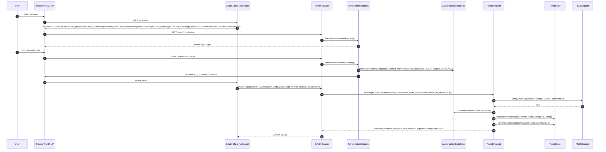

### Refresh Token with replay detection


### Client Credentials

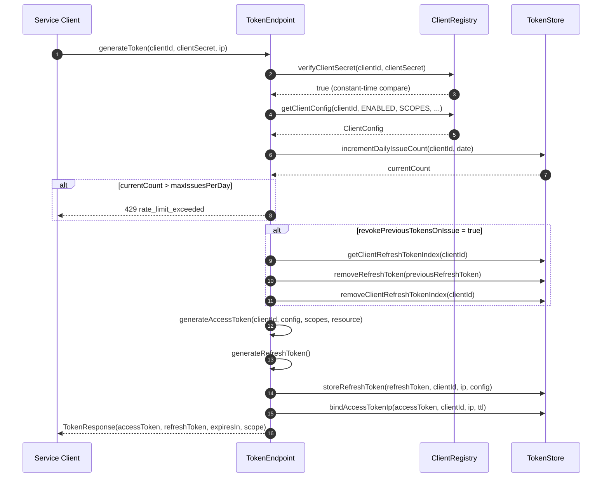

### Token Revocation

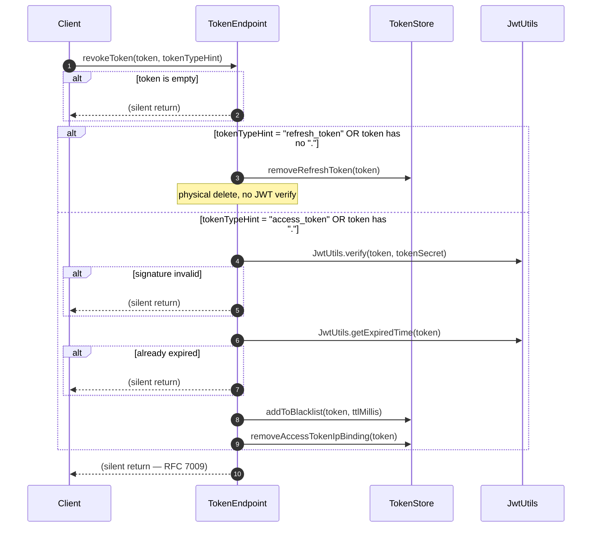

### Token Validation (Resource Server)

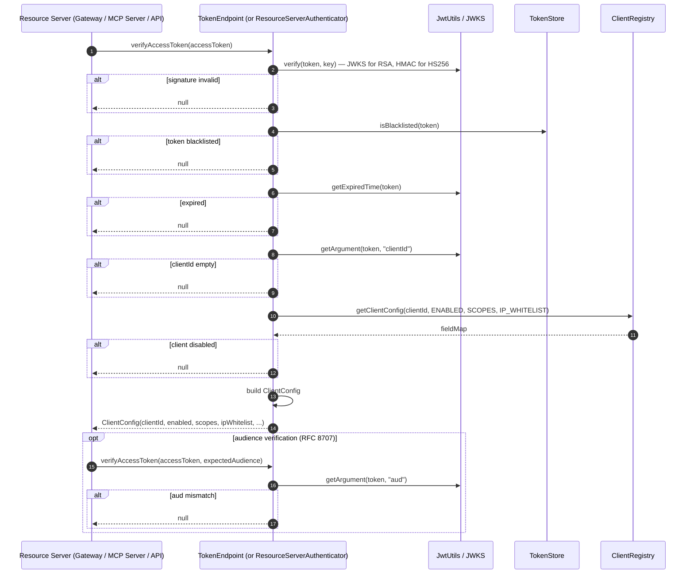

---

## ⚠️ Known Limitations

| Limitation                                        | Impact                                                                       | Workaround / Status                                                                   |
|---------------------------------------------------|------------------------------------------------------------------------------|---------------------------------------------------------------------------------------|
| **No HTTP runtime in this component**             | `/oauth2/authorize`, `/oauth2/token`, `/oauth2/jwks`, `/oauth2/register`, login and consent pages must be hosted by an OAuth Service | Tracked. `atlas-richie-oauth-server` is the planned home; current consumers can use any PaaS AS that follows the Metadata / Token / Introspection contract |
| **No SAML 2.0 / WS-Federation**                  | SAML-only federations not supported                                          | Out of scope; use a separate SAML IdP                                                  |
| **No built-in IdP**                               | You wire your own user store, login UI and MFA                              | Implement `OidcUserInfoProvider` and call the login SPI from the OAuth Service         |
| **Refresh-token rotation cannot be disabled**     | RFC 6749 §10.4 requires rotation; the protocol semantics enforce it           | Implement a custom `OAuth2TokenGenerator` if you need rotation-free refresh           |
| **`revoke-previous-tokens-on-issue` defaults to `false`** | A leaked refresh token remains valid until TTL | Set `true` for high-security first-party clients; accept the rotation cost            |
| **JWKS cache TTL is shared**                      | Rotating the signing key before the cache expires means new tokens may be signed with a key some Resource Servers still trust | Set `cache.jwks-ttl` to match the longest issued token TTL; use the `active` / `retiring` / `retired` lifecycle |
| **DCR `registration_access_token` lifetime**      | Spec recommends rotation; current implementation reuses one token until revoked | OAuth Service should expose rotation; treat as P0 backlog                              |
| **DPoP `jti` replay state lives in `OAuthCache`** | A single-instance Redis SPOF becomes a single point of failure for replay detection | Use a Redis cluster; or accept the trade-off for read-only / low-rate scenarios         |
| **OIDC UserInfo output is scope-filtered**        | Some apps want the same output regardless of scope                              | Provide a custom `OidcUserInfoProvider` that ignores scope filtering                   |
| **`fail-open` is intentionally not a default**   | Production builds that want graceful degradation must opt in explicitly         | Set `fail-open: true` per route after a documented security review                    |
| **No global client rate-limit beyond `enable-daily-issue-limit`** | Burst protection is per-client; no global bucket                  | Layer `atlas-richie-web` rate-limit at the Gateway                                     |

---

## ❓ FAQ

### Q1 — Is this a complete Authorization Server?

No. This component is the **protocol kernel, SPI, and adapter** layer. It does not own login, consent, MFA, the user database, or the HTTP runtime. A complete authorization server = this component + an OAuth Service that implements the HTTP endpoints, user flows, persistence and signing key custody. See [Three-Layer Boundary](#three-layer-boundary-read-this-first) for the full picture.

### Q2 — How is this different from `spring-security-oauth2-authorization-server`?

| Dimension              | `spring-security-oauth2-authorization-server`                  | `atlas-richie-oauth-parent`                                                          |
|------------------------|-----------------------------------------------------------------|----------------------------------------------------------------------------------------|
| Runtime               | Standalone AS with Spring Security glue                         | Reusable protocol kernel; HTTP runtime lives in `atlas-richie-oauth-server`           |
| Storage               | JDBC-only defaults; Redis optional                              | SPI-first; Redis default via `atlas-richie-component-cache`; JDBC via custom impl      |
| Multi-tenant           | Custom extension required                                       | First-class via `AccessTokenClaimsCustomizer` + `platform.oauth.tenant`               |
| MCP / RFC 8707 binding | Manual                                                          | Built-in `resource` parameter, persisted in code, bound to `aud`                       |
| PKCE                  | `S256` supported, `plain` accepted                              | `S256` only, `plain` rejected (OAuth 2.1)                                              |
| DCR + SSRF            | DCR available; SSRF depends on consumer                        | DCR + 5-layer SSRF defense built in                                                    |
| Refresh replay         | Manual                                                          | Built-in consumed-marker + anomaly counter + family-revoke hook                        |
| DPoP (RFC 9449)       | Custom extension                                                | Opt-in DPoP proof verifier with `ath`, `cnf.jkt`, nonce and distributed `jti` replay    |
| Platform integration   | Standalone                                                      | Part of the Atlas Richie component ecosystem: cache, web, webflux, mfa, tenant         |

### Q3 — Can I plug in my own token store?

Yes. Implement `TokenStore` (or `OAuthCache`, `AuthorizationCodeStore`, `ClientRepository`) and expose it as a `@Bean`. The default Redis implementation will be replaced by yours. Make sure to honour the consumed-marker contract — that is what makes refresh-replay detection work.

### Q4 — Is PKCE mandatory?

For public clients (mobile / SPA / CLI / MCP user agent): **yes** (`S256` only). For confidential clients: optional but **strongly recommended** — RFC 7636 was extended by OAuth 2.1 to cover confidential clients too.

### Q5 — How do I add custom claims to a JWT?

Implement `AccessTokenClaimsCustomizer` and read tenant information from your trusted server-side context (HTTP header from gateway, session, etc.). Never read tenant information from the inbound OAuth request.

```java
@Bean
public AccessTokenClaimsCustomizer accessTokenClaimsCustomizer() {
    return (clientId, client, scopes, resource) ->
        Map.of(
            "tenant_id", TrustedTenantContext.currentTenant(),
            "tenant_role", TrustedTenantContext.currentRole());
}
```

The component refuses to overwrite reserved protocol claims (`iss` / `sub` / `aud` / `scope` / `client_id` / `jti` / `exp` / `iat` / `nbf`).

### Q6 — Does this support OIDC?

Yes, through the `oauth-oidc` module. It provides ID Token signing (RS256), `openid` / `nonce` validation, scope-filtered UserInfo, Discovery metadata, RP-Initiated Logout and Front/Backchannel Logout contracts. The OAuth Service must provide the user store, login/MFA flow, consent UI and HTTP controllers.

### Q7 — How do I switch between the self-hosted AS and a PaaS AS?

Set `platform.oauth.provider` (`self-hosted` / `paas`) and update `issuer` + endpoint URIs. The protocol contract is unchanged; clients and the Gateway only need to follow the standard Metadata / Token / Introspection endpoints. If the PaaS provider has a non-standard claim shape, add a Provider Adapter inside `oauth-client` / `oauth-resource-server` — do not put branching logic in the Gateway filter.

### Q8 — What about RFC 8707 (`resource`)? Is it supported?

Yes. The `resource` parameter is persisted with the authorization code and revalidated on exchange. The minted access token's `aud` claim contains the resource URI. Resource Servers validate the `aud` claim against `required-audience`. This prevents token forwarding across resource servers.

### Q9 — Is the gateway supposed to issue tokens?

**No.** The gateway is a Resource Server, not an Authorization Server. Token issuance lives in the OAuth Service. Gateway may use Redis for JWKS / introspection cache, JTI replay state, distributed locks and edge-side rate-limit, but never as authoritative Client / User / Consent / Token state. The boundary is documented under [Three-Layer Boundary](#three-layer-boundary-read-this-first).

### Q10 — What's the recommended path from the current Gateway OAuth implementation?

Four stages (full detail is in `oauth-platform-architecture.md` → §8):

1. **Component contract hardening** — finish the SPI split (Servlet/Session out of `AuthorizationEndpoint`).
2. **Stand up `atlas-richie-oauth-server`** with DB + Liquibase, signing keys, consent UI.
3. **Gateway switch** — replace token-issuance code with Resource Server adapters; keep `/api/oauth2/*` reverse-proxied during migration.
4. **Operational hardening** — key rotation, replay / revoke / Redis-failure / DB-failure drills, multi-tenant isolation, audit, metrics.

---

**atlas-richie-oauth-parent** — OAuth 2.1 protocol kernel for the Atlas Richie platform.