# Atlas Richie OAuth 2.1 组件 (atlas-richie-oauth-parent)

> **OAuth 2.1 协议内核，可复用优先。** 本组件提供 Atlas Richie 平台下可复用的 Authorization Server 协议内核、SPI 端口、缓存适配与 Spring Boot 集成。**它不是一个可独立部署的 Authorization Server** —— 登录页、用户库、同意页、审计库与 HTTP 运行时属于独立的 `atlas-richie-oauth-server`（或遵循同一 Metadata / Token / Introspection 契约的任何 PaaS AS）。
>
> **RFC 范围**：RFC 6749、RFC 7636（PKCE）、RFC 7591（DCR）、RFC 7009（Revocation）、RFC 7662（Introspection）、RFC 8414（AS Metadata）、RFC 8707（Resource Indicators）、RFC 9068（JWT Access Tokens）、RFC 8628（Device Authorization Grant）、RFC 8252（Native Apps）、RFC 9449（DPoP）。
>
> **设计深读**：原本位于 `docs/` 下的设计资料已合并到本 README。`docs/` 目录在 review 通过后将被删除。

---

## 📖 目录

- [🎯 组件概览](#-组件概览)
    - [它能做什么和不能做什么](#它能做什么和不能做什么)
- [✨ 关键特性](#-关键特性)
    - [核心能力](#核心能力)
    - [设计选择](#设计选择)
- [🏗️ 架构设计](#-架构设计)
    - [三层职责边界（先读这一段）](#三层职责边界先读这一段)
    - [核心组件架构](#核心组件架构)
    - [模块清单](#模块清单)
    - [模块依赖关系](#模块依赖关系)
    - [各层职责说明](#各层职责说明)
    - [数据归属矩阵](#数据归属矩阵)
    - [Token 生命周期状态机](#token-生命周期状态机)
- [📎 🔄 RFC 覆盖矩阵](#-rfc-覆盖矩阵)
- [🚀 快速上手](#-快速上手)
    - [1. 添加依赖](#1-添加依赖)
    - [2. 配置文件](#2-配置文件)
    - [3. 注册客户端（静态）](#3-注册客户端静态)
    - [4. 申请令牌 —— `authorization_code` + PKCE](#4-申请令牌--authorization_code--pkce)
    - [5. 申请令牌 —— `client_credentials`](#5-申请令牌--client_credentials)
    - [6. 申请令牌 —— `refresh_token`](#6-申请令牌--refresh_token)
    - [7. 设备授权 —— `urn:ietf:params:oauth:grant-type:device_code`](#7-设备授权--urnietfparamsoauthgrant-typedefresh_token)
    - [8. 动态客户端注册](#8-动态客户端注册)
    - [9. Resource Server 装配](#9-resource-server-装配)
- [📚 接口详细说明](#-接口详细说明)
    - [`TokenEndpoint` —— 令牌生命周期](#tokenendpoint--令牌生命周期)
    - [`ClientRegistry` —— 客户端注册表](#clientregistry--客户端注册表)
    - [`ScopeResolver` —— Scope 路径匹配](#scoperesolver--scope-路径匹配)
    - [`AuthorizationEndpoint` / `AuthorizationCodeGrant` / `PKCESupport`](#authorizationendpoint--authorizationcodegrant--pkcesupport)
    - [`DynamicClientRegistrationEndpoint` + `SSRFProtection`](#dynamicclientregistrationendpoint--ssrfprotection)
    - [`DeviceAuthorizationService` + `TokenEndpoint.exchangeDeviceCode(...)`](#deviceauthorizationservice--tokenendpointexchangedevicecode--设备授权)
    - [`ResourceServerAuthenticator` —— 三种模式](#resourceserverauthenticator--三种模式)
    - [`AccessTokenSigner` / `JwkSetProvider` / `AccessTokenClaimsCustomizer`](#accesstokensigner--jwksetprovider--accesstokenclaimscustomizer)
    - [`OAuthCache` / `TokenStore` / `AuthorizationCodeStore` SPI](#oauthcache--tokenstore--authorizationcodestore-spi)
- [🔧 核心能力场景](#-核心能力场景)
    - [场景 1 —— `authorization_code` + PKCE](#场景-1--authorization_code--pkce)
    - [场景 2 —— `client_credentials`](#场景-2--client_credentials)
    - [场景 3 —— `refresh_token` 旋转与重放检测](#场景-3--refresh_token-旋转与重放检测)
    - [场景 4 —— `device_code`](#场景-4--device_code)
    - [场景 5 —— 动态客户端注册](#场景-5--动态客户端注册)
    - [场景 6 —— Resource Server 三种模式](#场景-6--resource-server-三种模式)
    - [场景 7 —— OIDC Discovery + ID Token 契约](#场景-7--oidc-discovery--id-token-契约)
- [🎯 最佳实践](#-最佳实践)
- [⚙️ 配置参考](#-配置参考)
- [🔧 故障排查](#-故障排查)
    - [OAuth 特有失败模式](#oauth-特有失败模式)
    - [监控指标](#监控指标)
    - [日志配置](#日志配置)
- [📎 ⏱️ 时序图详解](#-时序图详解)
    - [Authorization Code + PKCE](#authorization-code--pkce)
    - [Refresh Token 与重放检测](#refresh-token-与重放检测)
    - [Client Credentials](#client-credentials)
    - [Token Revocation](#token-revocation)
    - [Resource Server 验证流程](#resource-server-验证流程)
- [⚠️ 已知限制](#-已知限制)
- [❓ 常见问题](#-常见问题)
- [🗑️ 文档迁移说明](#-文档迁移说明)

---

## 🎯 组件概览

| 项目               | 取值                                                                                                                          |
|--------------------|-------------------------------------------------------------------------------------------------------------------------------|
| **工件**           | `cn.richie696.component:atlas-richie-oauth-parent`                                                                            |
| **类别**           | 身份与访问 —— 可复用的 OAuth 2.1 协议内核                                                                                    |
| **强依赖**         | `atlas-richie-context`、`atlas-richie-component-cache`（refresh token 状态、黑名单、重放标记、分布式锁）                       |
| **可选依赖**       | `atlas-richie-component-cache`（JWKS / introspection 缓存）、`atlas-richie-component-web`（Gateway Adapter）                  |
| **遵循规范**       | RFC 6749 / 6750 / 7009 / 7591 / 7636 / 7662 / 8252 / 8414 / 8628 / 8707 / 9068 / 9449，以及 OAuth 2.1（草案）                |
| **目标运行时**     | Spring Boot 4.0.x、JDK 25                                                                                                    |

本组件的设计目标是同一套协议代码既可被独立 OAuth Service 引用，也能作为 Gateway 内的 Resource Server 使用 —— 客户端与网关只依赖标准端点集合以及 `issuer` / `audience` / `scope` / `resource` 声明。

### 它能做什么和不能做什么

| ✅ 能做什么                                                                                                          | ❌ 不能做什么                                                                                                            |
|----------------------------------------------------------------------------------------------------------------------|--------------------------------------------------------------------------------------------------------------------------|
| 可复用的 OAuth 2.1 协议内核（Token、Authz、DCR、Device、Revoke、Introspect）                                         | 带登录页 / MFA / 管理控制台 / 用户数据库的独立 Authorization Server                                                      |
| `TokenEndpoint` / `AuthorizationEndpoint` / `DynamicClientRegistrationEndpoint` 服务，存储与签名均可替换              | SAML 2.0 / WS-Federation（不在规划内）                                                                                    |
| `TokenStore`、`ClientRegistry`、`AuthorizationCodeStore`、`OAuthCache` SPI 端口                                      | LDAP / AD 连接器实现                                                                                                    |
| JWT 访问令牌包含 `iss` / `aud` / `sub` / `scope` / `client_id` / `jti` / `exp` / `iat` / `nbf`（RFC 9068）          | 同意页渲染 —— 由 OAuth Service 通过 SPI 注入                                                                            |
| PKCE 仅 `S256`（拒绝 `plain`）、refresh token 旋转、基于 consumed-marker 的重放检测                                    | 内置 IdP —— 由 OAuth Service 接入 `OidcUserInfoProvider` 与登录/MFA                                                       |
| 可选 OIDC Provider 契约：Discovery、ID Token、UserInfo、RP-Initiated Logout、Front/Backchannel Logout                 | 端点的 HTTP 运行时 —— 由 OAuth Service 暴露                                                                              |
| Resource Server：JWT（JWKS）校验、introspection fallback、可选 DPoP 校验（RFC 9449）                                  | 网关侧 token 签发能力。Token 签发永远属于 OAuth Service，不属于网关                                                       |

> **三层边界，三方职责。** 本组件位于**协议能力层**。Token 签发、登录、MFA、同意与持久化位于**AS 服务层**。Token 校验与请求保护位于**网关 / 资源服务层**。边界在 [三层职责边界](#三层职责边界先读这一段) 中描述，集成前请先阅读。

---

## ✨ 关键特性

### 核心能力

- ✅ **`authorization_code` + PKCE S256** —— 唯一接受的 PKCE 方法，符合 OAuth 2.1。`plain` 一律拒绝。
- ✅ **`client_credentials`** —— 服务到服务授权，支持 scope / resource 绑定。
- ✅ **`refresh_token` 旋转与重放检测** —— 每次刷新都签发新 refresh token；旧值被物理删除并写入短 TTL 的 `consumed-marker`，任何复用都会被识别为重放事件。
- ✅ **设备授权 `device_code`**（RFC 8628）—— 设备码 + 用户码生命周期、轮询间隔、`slow_down` 错误、一次性兑换。
- ✅ **动态客户端注册**（RFC 7591），每个 URL 字段都经过 SSRF 防护（HTTPS only、禁止 IP 字面量、保留地址检查、可选 allow-list、防 DNS rebinding 解析）。
- ✅ **JWT 访问令牌**（RFC 9068），包含完整标准声明集，并通过 `AccessTokenClaimsCustomizer` 提供可信 tenant / role 声明扩展点。保留协议声明（`iss` / `sub` / `aud` / `scope` / `client_id` / `jti` / `exp` / `iat` / `nbf`）不可覆盖。
- ✅ **Token introspection**（RFC 7662）与 **Token revocation**（RFC 7009）—— 均通过 `TokenEndpoint` 上的协议级方法实现。
- ✅ **Resource Indicators**（RFC 8707）—— `resource` 参数绑定到 `aud`，随授权码一起持久化，并在兑换时重新校验，避免授权码被重定向到其他 resource server。
- ✅ **OIDC Provider 契约** —— Discovery（RFC 8414 扩展）、`query` / `form_post` / Hybrid 响应模式、ID Token 签名（RS256）、`openid` / `nonce` 校验、scope 过滤的 UserInfo、RP-Initiated Logout 与 Front/Backchannel Logout 契约。HTTP 投递由 OAuth Service 注入。
- ✅ **Resource Server 三种模式** —— JWT-only、introspection-only、hybrid（JWT 优先，introspection fallback）。`introspection-fallback` 默认 `true`。
- ✅ **DPoP 资源绑定**（RFC 9449，可选开启）—— 校验 ES256 proof、`htm`、去除查询参数后的 `htu`、`iat`、`ath`、访问令牌的 `cnf.jkt` 与一次性 `jti`；重放状态保存在分布式缓存中。
- ✅ **客户端认证方式** —— `client_secret_basic`、`client_secret_post`、公开客户端 `none`，由同一核心服务用常数时间比较校验。
- ✅ **密钥发布** —— RSA 签名器通过 `JwkSetProvider` 发布带 `kid` 的 JWKS；签名密钥轮换由服务侧负责（`active` / `retiring` / `retired` 生命周期，旧公钥需保留至最长 token TTL 过期）。
- ✅ **多租户声明扩展点** —— `AccessTokenClaimsCustomizer` 允许 OAuth Service 从可信服务端上下文注入 tenant 声明，绝不从入站请求参数读取。

### 设计选择

- ✅ **框架无关的内核** —— 服务层可通过 Spring MVC、Spring WebFlux 或其他 HTTP 运行时暴露这些能力。
- ✅ **存储无关** —— 可插拔的 `TokenStore`、`ClientRepository`、`AuthorizationCodeStore`、`OAuthCache` 端口。Redis 默认实现位于 `oauth-cache` 之后；JDBC 或内存实现只需遵守 SPI 契约。
- ✅ **无状态的访问令牌** —— JWT 意味着 Resource Server 使用本地 JWKS 路径时，每个请求不需要查数据库。
- ✅ **无状态 refresh token** —— 不透明值，服务端保存哈希；协议从不记录或返回签发响应之外的原始 refresh 值。
- ✅ **Refresh 的分布式锁** —— `refresh-token-lock:{token}` 防止同一 token 的并发刷新竞争；失败方收到 `rate_limit_exceeded`。
- ✅ **每日签发配额** —— `maxIssuesPerDay = max(24 / tokenValidDuration, 1) + 2`；每个客户端可调。M2M 客户端配 1 小时 token 每天可签发 26 次，配 24 小时 token 每天仅 3 次。
- ✅ **默认租户感知** —— Resource Server 输出统一的 `AuthenticatedPrincipal`，包含 `subject` / `clientId` / `scope` / `audience` / `resource` / `jti` / `tenantId`；下游拦截器无需再次解析 JWT。

---

## 🏗️ 架构设计

### 三层职责边界（先读这一段）

这是 README 中最重要的一段。平台上的 OAuth 故事清晰地切分为三个工程层，各自有独立职责。把它们混在一起，是 OAuth 集成中最常见的设计退化来源。

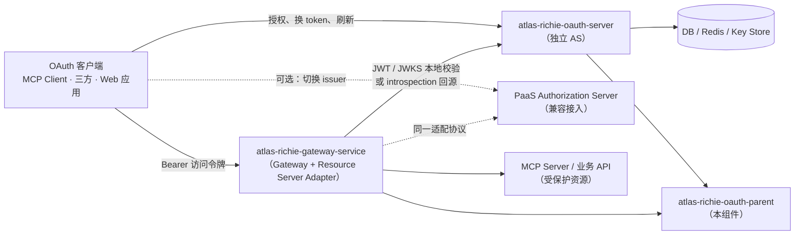

| 层级 | 工程 | 拥有 | **明确**不拥有 |
|---|---|---|---|
| **能力组件层** | `atlas-richie-oauth-parent` | 可复用的协议内核、SPI 端口、缓存适配、Spring Boot 启动器 | 登录页、管理后台、业务用户数据库、部署入口 |
| **认证服务层** | `atlas-richie-oauth-server`（未来，或 PaaS AS） | 标准 OAuth HTTP 端点、用户登录、授权同意、客户端/scope/resource 管理、签名密钥、审计、持久化 | 网关路由、下游业务鉴权、业务接口权限判断 |
| **流量入口层** | `atlas-richie-gateway-service` | Bearer 提取、JWKS / introspection 校验、`issuer` / `audience` / `scope` / `resource` 校验、Principal 透传、入口侧限流 / 异常检测、入口审计 | 签发 token、刷新、撤销、客户端注册、授权同意、登录、签名密钥托管 |

> **常见误区：** 把"网关不拥有 OAuth"理解为"网关不用 Redis"。网关仍然使用 Redis —— 但仅用于 JWKS / introspection 短缓存、分布式锁、JTI 重放跟踪与入口侧限流。网关绝不把 Redis 当作权威的 Client / User / Consent / Refresh Token 存储。

**信任关系：**

- OAuth Service 是 token 的**唯一签发者**，也是 Client、Scope、Resource、Consent 与签名密钥的**权威来源**。
- Gateway 信任配置的 `issuer`、JWKS 与 introspection 响应；网关使用的 Redis 是**运行时缓存**，不是新的 Authorization Server。
- 业务服务与 MCP Server 信任由 Gateway 或本地 Resource Server Adapter 产出的 `AuthenticatedPrincipal`，不直接信任 JWT 原文。

### 核心组件架构

```mermaid
graph TB
    subgraph "atlas-richie-oauth-parent"
        direction TB

        subgraph Contract["oauth-contract"]
            direction TB
            C1["📋 Token / Introspection / Revoke DTO"]
            C2["📋 GrantType / TokenType / Scope 值对象"]
            C3["📋 标准错误码模型"]
            C4["📋 RFC 8414 / 9728 Metadata 契约"]
        end

        subgraph Core["oauth-core"]
            direction TB
            TE["🟢 TokenEndpoint"]
            CR["🟢 ClientRegistry"]
            SR["🟢 ScopeResolver"]
            TS["🟣 TokenStore (SPI)"]
            DT["🟣 DefaultTokenStore (Redis)"]
        end

        subgraph Authz["oauth-authz"]
            direction TB
            AE["🟠 AuthorizationEndpoint"]
            PKCE["🟠 PKCESupport (S256)"]
            ACG["🟠 AuthorizationCodeGrant"]
            ACS["🟣 AuthorizationCodeStore (SPI)"]
            ASM["🟠 AuthorizationServerMetadata (RFC 8414)"]
        end

        subgraph OIDC["oauth-oidc"]
            direction TB
            IDT["🔵 IdTokenSigner"]
            UIP["🔵 OidcUserInfoProvider SPI"]
            DSC["🔵 Discovery + JWKS 契约"]
            LOG["🔵 RP-Initiated Logout + Front/Backchannel"]
        end

        subgraph DCR["oauth-dcr"]
            direction TB
            DCE["🔶 DynamicClientRegistrationEndpoint"]
            SSRF["🔶 SSRFProtection"]
            CMR["🔶 ClientIdMetadataDocumentResolver"]
        end

        subgraph ClientLib["oauth-client"]
            direction TB
            MDC["🟤 MetadataDiscoverer"]
            OAT["🟤 OAuthClient (authz-code · cc · refresh · device)"]
        end

        subgraph Resource["oauth-resource-server"]
            direction TB
            RSA["🟢 ResourceServerAuthenticator (JWT · INTRO · HYBRID)"]
            DP["🟢 DPoP proof 校验器 (RFC 9449)"]
        end

        subgraph Cache["oauth-cache"]
            direction TB
            OCH["🟣 OAuthCache SPI"]
            GCH["🟣 GlobalCacheOAuthCache (Redis 默认)"]
        end

        subgraph Starter["oauth-spring-boot-starter + oauth-gateway-adapter"]
            direction TB
            CFG["⚙ AutoConfiguration"]
            GF["⚙ WebFlux Bearer + Principal Filter"]
        end

        Authz --> Core
        OIDC --> Core
        OIDC --> Authz
        DCR --> Core
        ClientLib --> Contract
        Resource --> Contract
        Starter --> Core
        Starter --> Authz
        Starter --> OIDC
        Starter --> DCR
        Starter --> ClientLib
        Starter --> Resource
        Starter --> Cache
        Resource --> Cache
        Authz --> Cache
        DCR --> Cache

        Core --> Contract
        Authz --> Contract
        OIDC --> Contract
        DCR --> Contract
        Cache --> Contract
    end

    style Core fill:#e3f2fd,stroke:#1565c0,stroke-width:2px,color:#1565c0
    style Contract fill:#e3f2fd,stroke:none,color:#1565c0
    style Authz fill:#fff3e0,stroke:#e65100,stroke-width:2px,color:#e65100
    style OIDC fill:#e0f7fa,stroke:#00838f,stroke-width:2px,color:#00838f
    style DCR fill:#fce4ec,stroke:#c62828,stroke-width:2px,color:#c62828
    style ClientLib fill:#fff8e1,stroke:#f57f17,stroke-width:2px,color:#f57f17
    style Resource fill:#e8f5e9,stroke:#2e7d32,stroke-width:2px,color:#1b5e20
    style Cache fill:#f3e5f5,stroke:#7b1fa2,stroke-width:2px,color:#4a148c
    style Starter fill:#eceff1,stroke:#455a64,stroke-width:2px,color:#263238
```

### 模块清单

```
atlas-richie-oauth-parent/
├── atlas-richie-oauth-contract              # 协议 DTO、错误码、跨模块契约
├── atlas-richie-oauth-core                  # Token、Client、Scope、refresh 旋转、重放标记
├── atlas-richie-oauth-authz                 # Authorization Code + PKCE (S256) + AS Metadata
├── atlas-richie-oauth-oidc                  # OIDC Provider：ID Token、UserInfo、Discovery、Logout
├── atlas-richie-oauth-dcr                   # 动态客户端注册 (RFC 7591)、SSRF 防护
├── atlas-richie-oauth-client                # OAuth/OIDC 客户端 SDK：Metadata、Token、Introspection、UserInfo
├── atlas-richie-oauth-resource-server       # JWT/JWKS、Introspection、可选 DPoP (RFC 9449)
├── atlas-richie-oauth-cache                 # 缓存、分布式锁、重放状态端口
├── atlas-richie-oauth-spring-boot-starter   # Spring Boot 自动装配 + 配置绑定
├── atlas-richie-oauth-gateway-adapter       # WebFlux Bearer + Principal Filter 外观
└── atlas-richie-oauth-test                  # 测试夹具（Server、RSA/JWKS、Redis IT 基类）
```

| 模块                          | 状态            | 职责                                                                                                                              |
|-------------------------------|-----------------|-----------------------------------------------------------------------------------------------------------------------------------|
| `oauth-contract`              | **稳定**        | 请求 / 响应 DTO、标准错误码、声明名常量                                                                                          |
| `oauth-core`                  | **稳定**        | `TokenEndpoint`、`ClientRegistry`、`ScopeResolver`、`TokenStore` SPI                                                              |
| `oauth-authz`                 | **稳定**        | `AuthorizationEndpoint`、`AuthorizationCodeGrant`、`PKCESupport`（仅 S256）、`AuthorizationCodeStore` SPI、`AuthorizationServerMetadata` |
| `oauth-oidc`                  | **稳定契约**    | ID Token（RS256）、`openid` / `nonce`、UserInfo Claims 过滤、Discovery、RP-Initiated Logout、Front/Backchannel Logout —— HTTP 由 AS 注入 |
| `oauth-dcr`                   | **稳定**        | `DynamicClientRegistrationEndpoint`、`SSRFProtection`、`ClientIdMetadataDocumentResolver`                                          |
| `oauth-client`                | **稳定**        | OAuth / OIDC Metadata 发现器、Authorization Code + PKCE 客户端、Client Credentials 客户端、Refresh Token 旋转客户端              |
| `oauth-resource-server`       | **稳定**        | `ResourceServerAuthenticator`（JWT / Introspection / Hybrid），可选 `DPoP` proof 校验器                                            |
| `oauth-cache`                 | **稳定**        | `OAuthCache` SPI；默认 `GlobalCacheOAuthCache`（Redis）                                                                            |
| `oauth-spring-boot-starter`   | **稳定**        | 自动装配 + 配置绑定，覆盖上述全部模块                                                                                            |
| `oauth-gateway-adapter`       | **稳定**        | WebFlux Bearer + Principal 外观；不复制 token 业务逻辑                                                                            |
| `oauth-test`                  | **稳定**        | 可复用测试夹具、OAuth Server Harness、RSA/JWKS 助手                                                                              |

### 模块依赖关系

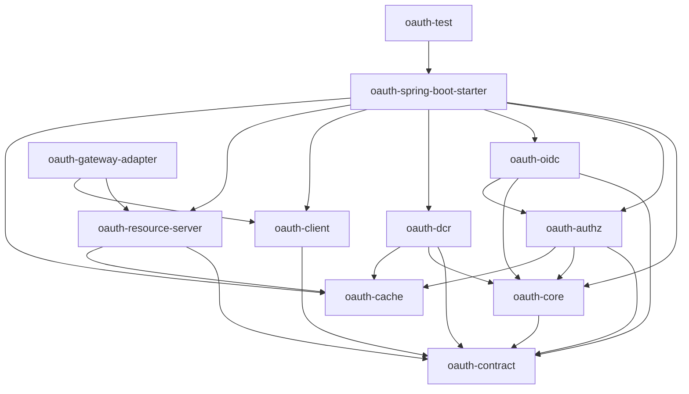

> `oauth-parent` 下的模块**绝不允许**依赖 `atlas-richie-gateway-service`，也不允许依赖未来的 `atlas-richie-oauth-server`。反向依赖会让服务层代码泄漏进公共组件，把它变成一个"全能大杂烩"部署包。

### 各层职责说明

#### 契约层 `oauth-contract`

- 协议 DTO：Token、Introspection、Revocation、Authorization、DCR、AS Metadata、Protected Resource Metadata、JWKS。
- 标准错误码与序列化规则（RFC 6749 §5.2 + 扩展）。
- Grant Type、Token Type、Client Authentication Method、Scope / Resource 值对象。
- 标准声明名常量（`iss`、`sub`、`aud`、`scope`、`client_id`、`jti`、`cnf.jkt` 等）。

#### 核心层 `oauth-core`

- 校验客户端身份、grant type、scope 与 resource 绑定。
- 编排访问令牌与 refresh token 的生命周期（签发、刷新旋转、撤销）。
- `TokenStore`、`ClientRegistry`、`ScopeResolver` 可插拔端口。
- 刷新重放检测（consumed-marker + 异常计数器 + 审计钩子）的领域操作。
- 标准化异常；不直接决定 HTTP 状态码（由 OAuth Service / Adapter 映射）。

#### 授权层 `oauth-authz`

- 校验授权请求：client、redirect URI、response type、scope、resource、PKCE `code_challenge`（必填，仅 `S256`）。
- 创建一次性授权码，绑定 client、user、redirect URI、scope、resource、PKCE challenge。
- 提供 `AuthorizationCodeStore` SPI 用于授权码持久化。
- 构建 AS Metadata（RFC 8414）DTO；由 OAuth Service 暴露。

#### OIDC 层 `oauth-oidc`

- `openid` scope + `nonce` 校验，RS256 ID Token 签发，含 `iss` / `aud` / `nonce` 校验。
- `OidcUserInfoProvider` SPI 让 OAuth Service 注入用户属性；输出按 scope 过滤。
- Discovery 元数据模型与 RP-Initiated Logout 校验。
- Front-Channel 与 Backchannel Logout 契约；HTTP 投递与会话查询由 OAuth Service 负责。

#### DCR 层 `oauth-dcr`

- RFC 7591 动态客户端注册与更新。
- 校验 redirect URI、客户端认证方式、grant type、scope 与 `jwks_uri`。
- 对所有 URL 字段以及远程 metadata document 抓取启用 SSRF 防护。

#### 客户端层 `oauth-client`

- AS Metadata / Protected Resource Metadata 发现器。
- 标准 OAuth 客户端：Authorization Code + PKCE、Client Credentials、Refresh Token 旋转。
- OIDC Discovery + UserInfo 客户端。
- Token 端点认证、超时、重试与标准错误映射。

#### 资源服务器层 `oauth-resource-server`

- JWT 访问令牌签名、`iss`、`aud` / `resource`、时间窗口与 scope 校验。
- JWKS 拉取 + 缓存 + 密钥轮换。缓存仅为运行时缓存，绝不是权威来源。
- Introspection fallback（按模式决定）。
- 可选 `DPoP` proof 校验（RFC 9449）：ES256 签名、`htm`、去除查询参数后的 `htu`、`iat`、`ath`、访问令牌 `cnf.jkt`、一次性 `jti`。
- 为 Gateway、MCP Server 与任意业务服务输出 `AuthenticatedPrincipal`。

#### 缓存层 `oauth-cache`

- 授权码、refresh token 状态、JTI 黑名单、分布式锁、DPoP `jti` 重放标记、限流计数器。
- 通过 `atlas-richie-component-cache` 提供 Redis 默认适配（`GlobalCacheOAuthCache`）。
- Cache Key 模式归属本模块——网关与业务服务绝不直接读取这些 Key。

#### 启动器 + Gateway Adapter

- 启动器：配置绑定、条件装配、默认实现、健康检查。
- Gateway Adapter：WebFlux Filter 外观，提供 Bearer 提取、异步校验、异常响应、Principal 透传。**绝不**复制任何 token 业务逻辑。

### 数据归属矩阵

| 数据                                | 组件提供能力                                            | 权威归属                |
|-------------------------------------|---------------------------------------------------------|-------------------------|
| Client、Scope、Resource             | `ClientRegistry` / `ScopeResolver` SPI、默认缓存适配   | OAuth Service 数据库    |
| Access Token 签名                  | `AccessTokenSigner` SPI（生产推荐 RSA）                | OAuth Service Key Store |
| Refresh Token                       | 旋转、消费、重放检测（`TokenStore` SPI）                | OAuth Service DB / Redis|
| Authorization Code                  | 一次性写入、消费、PKCE 绑定                              | OAuth Service Redis     |
| JWK Set                             | JWK 解析、缓存、轮换适配                                 | OAuth Service Key Store / JWKS endpoint |
| User、登录会话、Consent             | 仅输入端口（如 `OidcUserInfoProvider`、登录回调）     | OAuth Service 身份源    |
| JWKS / introspection 缓存           | Read-through 缓存                                        | Gateway / Resource Server|
| DPoP `jti` 重放 / nonce 状态        | `OAuthCache` SPI                                         | Gateway / Resource Server|

> 生产部署**严禁**在 access token、日志、审计事件或异常消息中记录 client secret、密码、完整 refresh token 值或任何签名私钥。组件返回的只是公开标识符（`jti`、`kid`、哈希或截断值）。

### Token 生命周期状态机

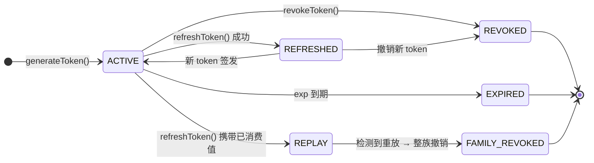

---

## 📎 🔄 RFC 覆盖矩阵

下表列出本组件遵循的每个 RFC、对应模块、所用公开 SPI 以及当前状态（`Stable` = API + 测试 + 文档齐备；`Contract` = SPI 存在，行为由 OAuth Service 负责；`Planned` = 已规划但暂未交付）。

| RFC                                                | 标题                                                       | 模块                            | SPI / 类                                                | 状态      |
|----------------------------------------------------|------------------------------------------------------------|------------------------|--------------------------------------------------------|-----------|
| [RFC 6749](https://datatracker.ietf.org/doc/html/rfc6749)  | OAuth 2.0 Authorization Framework                            | `oauth-core` / `oauth-authz`     | `TokenEndpoint`、`AuthorizationEndpoint`               | Stable    |
| [RFC 6750](https://datatracker.ietf.org/doc/html/rfc6750)  | OAuth 2.0 Bearer Token Usage                                 | `oauth-contract` / `oauth-resource-server` | `BearerToken`、`ResourceServerAuthenticator`    | Stable    |
| [RFC 7009](https://datatracker.ietf.org/doc/html/rfc7009)  | OAuth 2.0 Token Revocation                                   | `oauth-core`                    | `TokenEndpoint.revokeToken(...)`                        | Stable    |
| [RFC 7519](https://datatracker.ietf.org/doc/html/rfc7519)  | JSON Web Token (JWT)                                         | `oauth-core` / `oauth-oidc`      | `AccessTokenSigner`、`IdTokenSigner`             | Stable    |
| [RFC 7591](https://datatracker.ietf.org/doc/html/rfc7591)  | Dynamic Client Registration Protocol                         | `oauth-dcr`                     | `DynamicClientRegistrationEndpoint` + `SSRFProtection` | Stable    |
| [RFC 7636](https://datatracker.ietf.org/doc/html/rfc7636)  | PKCE for OAuth 2.0（仅 S256）                                 | `oauth-authz`                   | `PKCESupport`（强制 S256）                                | Stable    |
| [RFC 7662](https://datatracker.ietf.org/doc/html/rfc7662)  | OAuth 2.0 Token Introspection                                | `oauth-core` / `oauth-resource-server` | `TokenEndpoint.introspectToken(...)`、`ResourceServerAuthenticator` | Stable |
| [RFC 8252](https://datatracker.ietf.org/doc/html/rfc8252)  | OAuth 2.0 for Native Apps                                     | `oauth-authz` / `oauth-client`    | PKCE + `none` + custom-scheme URI                    | Stable    |
| [RFC 8414](https://datatracker.ietf.org/doc/html/rfc8414)  | Authorization Server Metadata                                 | `oauth-authz`                   | `AuthorizationServerMetadata`                            | Stable    |
| [RFC 8628](https://datatracker.ietf.org/doc/html/rfc8628)  | Device Authorization Grant                                   | `oauth-authz` / `oauth-core`    | `DeviceAuthorizationService`、`TokenEndpoint.exchangeDeviceCode(...)` | Stable |
| [RFC 8707](https://datatracker.ietf.org/doc/html/rfc8707)  | Resource Indicators for OAuth 2.0                            | `oauth-authz` / `oauth-core` / `oauth-resource-server` | `resource` 参数、`aud` 绑定                  | Stable    |
| [RFC 9068](https://datatracker.ietf.org/doc/html/rfc9068)  | JWT Profile for OAuth 2.0 Access Tokens                      | `oauth-core`                    | `AccessTokenSigner` + `AccessTokenClaimsCustomizer`      | Stable    |
| [RFC 9449](https://datatracker.ietf.org/doc/html/rfc9449)  | DPoP (Demonstrating Proof of Possession)                     | `oauth-resource-server`（可选） | `DpopProofVerifier`                                    | Contract  |
| [RFC 9728](https://datatracker.ietf.org/doc/html/rfc9728)  | Protected Resource Metadata                                  | `oauth-resource-server`        | `ProtectedResourceMetadata`（由 Resource 暴露）          | Contract  |
| OAuth 2.1（草案）                                  | OAuth 2.1 Authorization Framework                            | `oauth-authz`                   | PKCE 强制、拒绝 `plain`、无 implicit grant              | Stable    |

> **OAuth Service 仍然负责 HTTP 运行时的部分**：DCR HTTP 端点、AS Metadata 端点、JWKS 端点、登录 / 同意 / MFA / Logout。组件提供 SPI，OAuth Service 提供 Controller。

---

## 🚀 快速上手

### 1. 添加依赖

```xml
<dependency>
    <groupId>cn.richie696.component</groupId>
    <artifactId>atlas-richie-oauth-parent</artifactId>
</dependency>
```

> 引入 parent BOM 会同时拉入 `oauth-core`、`oauth-authz`、`oauth-dcr`、`oauth-oidc`、`oauth-resource-server`、`oauth-spring-boot-starter` 与 `oauth-gateway-adapter`。若希望使用 Redis 默认实现，再加入 `atlas-richie-component-cache`。

### 2. 配置文件

本组件暴露两个配置前缀 —— `platform.oauth.*` 用于独立 AS 配置文件（由 OAuth Service 消费），`platform.component.oauth.*` 用于网关 / Resource Server 配置文件。两套都带有合理默认值。

```yaml
platform:
  component:
    oauth:
      enabled: true
      # 32+ 位随机字符串，用作 HMAC 兜底 / 不透明 refresh token 签名
      token-secret: ${OAUTH_TOKEN_SECRET:请替换为-32-位-随机-字符串}
      default-token-valid-duration: 2          # 小时（访问令牌）
      default-refresh-token-valid-duration: 720  # 小时（refresh token，30 天）
      revoke-previous-tokens-on-issue: false
      enable-daily-issue-limit: true

    oauth-authz:
      enabled: true
      authorization-code-ttl: 600              # 10 分钟

    oauth-dcr:
      enabled: true
      allowed-domains:
        - example.com
        - trusted-partner.com
      ssrf-cache-ttl: 3600                     # 1 小时

    oauth-resource-server:
      mode: hybrid                             # jwt | introspection | hybrid（默认）
      issuer: https://auth.example.com
      jwk-set-uri: https://auth.example.com/oauth2/jwks
      introspection-uri: https://auth.example.com/oauth2/introspect
      introspection-client-id: gateway-resource
      introspection-client-secret: ${OAUTH_INTROSPECTION_SECRET}
      required-audience: business-api
      required-scopes: [api.read]
      introspection-fallback: true             # hybrid 模式默认
      fail-open: false
      dpop:
        enabled: false                         # 默认关闭
      cache:
        enabled: true
        jwks-ttl: PT10M
        introspection-ttl: PT30S
```

> 生产部署**必须**从 Vault / KMS / 密封 secret 等密钥存储加载 `token-secret`，并**必须**保持 `issuer` 与所签发 JWT `iss` 声明中使用的公网 DNS 名称一致。

### 3. 注册客户端（静态）

```yaml
platform:
  component:
    oauth:
      clients:
        - client-id: web-app
          client-secret: "{noop}change-me"
          grant-types: [authorization_code, refresh_token]
          redirect-uris: [https://app.example.com/callback]
          scopes: [openid, profile, email]
          require-pkce: true
          token-valid-duration: 1               # 1 小时
          refresh-token-valid-duration: 168     # 7 天
          ip-whitelist:
            - 203.0.113.0/24
        - client-id: billing-svc
          client-secret: "${BILLING_SVC_SECRET}"
          grant-types: [client_credentials]
          scopes: [invoice.read, invoice.write]
```

`ClientConfig` 完整结构详见 [接口详细说明 → `ClientRegistry`](#clientregistry--客户端注册表)。

### 4. 申请令牌 —— `authorization_code` + PKCE

本流程假设授权码由运行在 `https://auth.example.com` 的 OAuth Service  签发。组件负责协议语义；OAuth Service 暴露 `/oauth2/authorize` 端点、渲染同意页，并在用户同意后调用 `AuthorizationEndpoint.create(...)`。

**步骤 1 —— 授权请求**（由 OAuth Service 发起）：

```
GET https://auth.example.com/oauth2/authorize?
    response_type=code&
    client_id=web-app&
    redirect_uri=https://app.example.com/callback&
    scope=openid%20profile%20email&
    state=xyz&
    code_challenge=E9Mel...（BASE64URL(SHA256(verifier))）&
    code_challenge_method=S256&
    resource=https://mcp.example.com    # RFC 8707
```

**步骤 2 —— 令牌兑换**：

```bash
curl -X POST https://auth.example.com/oauth2/token \
  -H "Content-Type: application/x-www-form-urlencoded" \
  -d "grant_type=authorization_code" \
  -d "code=SplxlOBeZQQYbYS6WxSbIA" \
  -d "redirect_uri=https://app.example.com/callback" \
  -d "client_id=web-app" \
  -d "client_secret=change-me" \
  -d "code_verifier=dBjftJeZ4CVP-mB92K27uhbUJU1p1r_wW1gFWFOEjXk" \
  -d "resource=https://mcp.example.com"
```

成功响应（HTTP 200）：

```json
{
  "access_token": "eyJhbGciOiJSUzI1NiIs...",
  "token_type": "Bearer",
  "expires_in": 3600,
  "refresh_token": "GEvxJVSMEt...",
  "scope": "openid profile email",
  "resource": "https://mcp.example.com"
}
```

`PKCESupport.verifyChallenge(...)` 在兑换时执行 —— 仅 `S256`，`plain` 一律拒绝。`resource` 随授权码持久化，并在兑换时校验，避免授权码被重定向到其他 resource server。

### 5. 申请令牌 —— `client_credentials`

```bash
# client_secret_basic
curl -X POST https://auth.example.com/oauth2/token \
  -u "billing-svc:${BILLING_SVC_SECRET}" \
  -d "grant_type=client_credentials" \
  -d "scope=invoice.read invoice.write" \
  -d "resource=https://billing-api.example.com"

# client_secret_post（备选）
curl -X POST https://auth.example.com/oauth2/token \
  -d "grant_type=client_credentials" \
  -d "client_id=billing-svc" \
  -d "client_secret=${BILLING_SVC_SECRET}" \
  -d "scope=invoice.read"
```

OAuth Service 调用 `TokenEndpoint.generateToken(clientId, clientSecret, clientIp)`。成功后组件：

1. 使用常数时间比较（`Strings.CS.equals`）验证客户端密钥。
2. 通过 SPI 实现的 `ClientRegistry` 加载 `ClientConfig`。
3. 增加每日签发计数器（`maxIssuesPerDay = max(24 / tokenValidDuration, 1) + 2`）。
4. 可选作废旧 refresh token（`revoke-previous-tokens-on-issue: true` 时）。
5. 生成 JWT 访问令牌 + 不透明 refresh token；通过 `TokenStore.storeRefreshToken(...)` 持久化 refresh；通过 `bindAccessTokenIp(...)` 绑定访问令牌的 IP。

### 6. 申请令牌 —— `refresh_token`

```bash
curl -X POST https://auth.example.com/oauth2/token \
  -u "web-app:change-me" \
  -d "grant_type=refresh_token" \
  -d "refresh_token=GEvxJVSMEt..."
```

`TokenEndpoint.refreshToken(refreshToken, ip)` 执行重放防御流程：

1. 获取 `refresh-token-lock:{token}`（5 秒 TTL）。
2. 加载 refresh 条目；不匹配时返回 `invalid_grant`。
3. 调用 `TokenStore.consumeRefreshToken(...)`；若已存在 `consumed-marker`，则增加异常计数器并发出重放审计事件 —— 整个 token 族被撤销。
4. 生成新的访问令牌并旋转 refresh token。
5. 旧 refresh 条目被物理删除；consumed-marker 在配置的短窗口内保留，以捕捉延迟重放。

分布式锁防止同一 token 上的并发刷新产生竞态；失败方收到 `rate_limit_exceeded`。

### 7. 设备授权 —— `urn:ietf:params:oauth:grant-type:device_code`

```bash
# 1. 设备请求设备码
curl -X POST https://auth.example.com/oauth2/device_authorization \
  -u "device-svc:${DEVICE_SVC_SECRET}" \
  -d "scope=mcp.read"

# 响应
{
  "device_code": "GmRhmhcxhwAzkoEqiMEg_DnyE",
  "user_code": "WDJB-MJHT",
  "verification_uri": "https://auth.example.com/activate",
  "verification_uri_complete": "https://auth.example.com/activate?user_code=WDJB-MJHT",
  "expires_in": 1800,
  "interval": 5
}

# 2. 用户访问 verification_uri 并在 OAuth Service 上完成确认
#    （OAuth Service 调用 DeviceAuthorizationService.approve(userCode, subject)）

# 3. 设备轮询 /token
curl -X POST https://auth.example.com/oauth2/token \
  -u "device-svc:${DEVICE_SVC_SECRET}" \
  -d "grant_type=urn:ietf:params:oauth:grant-type:device_code" \
  -d "device_code=GmRhmhcxhwAzkoEqiMEg_DnyE"

# 轮询过快则返回：
# 400 {"error": "slow_down", "interval": 10}
```

组件负责设备码生命周期（签发、存储、批准、兑换、过期）。登录 / MFA / 同意属于 OAuth Service —— 它通过 `DeviceAuthorizationService.approve(userCode, subject)` 把用户身份注入回来。

### 8. 动态客户端注册

```bash
curl -X POST https://auth.example.com/oauth2/register \
  -H "Content-Type: application/json" \
  -d '{
    "client_name": "Mobile App",
    "redirect_uris": ["myapp://callback"],
    "grant_types": ["authorization_code", "refresh_token"],
    "token_endpoint_auth_method": "none",
    "scope": "openid profile",
    "jwks_uri": "https://mcp.example.com/.well-known/jwks.json"
  }'

# 响应（HTTP 201）
{
  "client_id": "0192f3a5-...",
  "client_id_issued_at": 1718803200,
  "registration_access_token": "Kf3...",
  "registration_client_uri": "https://auth.example.com/oauth2/register/0192f3a5-...",
  "token_endpoint_auth_method": "none",
  "redirect_uris": ["myapp://callback"],
  "grant_types": ["authorization_code", "refresh_token"],
  "scope": "openid profile"
}

# 后续更新
curl -X PUT https://auth.example.com/oauth2/register/0192f3a5-... \
  -H "Authorization: Bearer Kf3..." \
  -H "Content-Type: application/json" \
  -d '{ "client_name": "Mobile App v2" }'
```

`SSRFProtection` 对每个 URL 字段执行检查（HTTPS only、禁止 IP 字面量、保留地址检查、可选 allow-list、防 DNS rebinding 解析）。生产环境**不建议**开放匿名 DCR —— OAuth Service 应使用注册码、管理员审批、租户策略或受信任的 bootstrap token 控制入口，并把生成的客户端写入持久化的 `ClientRepository`。

### 9. Resource Server 装配

```java
@Configuration
public class OAuth2ResourceServerConfig {

    @Bean
    public ResourceServerAuthenticator resourceServerAuthenticator(
            OAuthCache cache, OAuth2ResourceServerProperties props) {
        // mode = jwt / introspection / hybrid（默认）
        return ResourceServerAuthenticator.builder()
                .mode(props.getMode())
                .issuer(props.getIssuer())
                .jwkSetUri(props.getJwkSetUri())
                .introspectionUri(props.getIdpIntrospectionUri())
                .introspectionClientId(props.getIntrospectionClientId())
                .introspectionClientSecret(props.getIntrospectionClientSecret())
                .requiredAudience(props.getRequiredAudience())
                .requiredScopes(props.getRequiredScopes())
                .introspectionFallback(props.isIntrospectionFallback())
                .dpopEnabled(props.getDpop().isEnabled())
                .cache(cache)
                .build();
    }
}
```

该认证器产生一个 `AuthenticatedPrincipal`，包含 `subject`、`clientId`、`scope`、`audience`、`resource`、`jti`、`tenantId`。Gateway Adapter 再把这些 principal 通过标准请求头 / Reactor Context 转发 —— 下游不再二次解析 JWT。

---

## 📚 接口详细说明

下列表格列出每个可复用类的公共方法。内部辅助（私有方法、`support.*` 类）刻意省略。

### `TokenEndpoint` —— 令牌生命周期

| 方法 | 用途 | 返回 |
|---|---|---|
| `TokenResponse generateToken(String clientId, String clientSecret, String ip)` | `client_credentials` 授权 —— 签发 JWT 访问令牌 + 不透明 refresh，通过 `TokenStore` 持久化 refresh，绑定 IP，强制每日配额 | `TokenResponse` |
| `TokenResponse refreshToken(String refreshToken, String ip)` | `refresh_token` 授权 —— 获取分布式锁、旋转、执行重放检测 | `TokenResponse` |
| `TokenResponse exchangeCodeForToken(String clientId, String clientSecret, String code, String codeVerifier, String redirectUri, String resource, String ip)` | `authorization_code` + PKCE 兑换 —— 校验 PKCE S256，将 `resource` 持久化到 `aud`，强制一次性消费授权码 | `TokenResponse` |
| `TokenResponse exchangeDeviceCode(String clientId, String deviceCode)` | `device_code` 兑换 —— 强制 `interval` / `slow_down`，返回签发的 token | `TokenResponse` |
| `void revokeToken(String token, String tokenTypeHint)` | 撤销 `access_token`（黑名单）或 `refresh_token`（物理删除）。`null` 提示则根据 `.` 字符推断 | `void` |
| `TokenIntrospection introspectToken(String accessToken)` | RFC 7662 introspection 载荷：`active`、`client_id`、`scope`、`exp`、`sub`、`aud`、`jti`、`iss` | `TokenIntrospection` |
| `ClientConfig verifyAccessToken(String accessToken)` | 校验 JWT 签名、过期、黑名单、客户端启用。任一失败返回 `null`。 | `ClientConfig` |
| `ClientConfig verifyAccessToken(String accessToken, String expectedAudience)` | 增加 audience 校验 —— RFC 8707 绑定 | `ClientConfig` |
| `List<String> getIpWhitelist(String accessToken)` | 返回 token 绑定的 IP 白名单，或空列表 | `List<String>` |

### `ClientRegistry` —— 客户端注册表

| 方法 | 用途 | 返回 |
|---|---|---|
| `<T> T getClientConfig(String clientId, ClientConfig.Field field)` | 读取单字段（带类型） | `T` |
| `Map<ClientConfig.Field, Object> getClientConfig(String clientId, Field f1, Field f2, ...)` | 单次往返读取多字段 | `Map<Field, Object>` |
| `boolean isClientValid(String clientId)` | 仅当客户端已加载且 `enabled=true` 时返回 `true` | `boolean` |
| `boolean verifyClientSecret(String clientId, String clientSecret)` | 通过 `Strings.CS.equals` 进行数时间比较 | `boolean` |
| `ClientConfig registerTestClient(String clientName)` | 生成随机 client_id/secret 对并持久化。**仅用于 dev/test。** | `ClientConfig` |
| `void save(ClientConfig config)`（SPI） | 持久化客户端配置 | `void` |

### `ScopeResolver` —— Scope 路径匹配

| 方法 | 用途 | 返回 |
|---|---|---|
| `List<String> getRequiredScopes(String path, String method)` | 对请求 path / method 用 Ant-path 匹配 `gateway.scope.*` 配置，返回所需 scopes | `List<String>` |
| `boolean verifyScope(Set<String> tokenScopes, List<String> requiredScopes)` | token scopes 包含任一所需 scope 时返回 `true`（OR 语义） | `boolean` |
| `Set<String> extractScopesFromToken(String accessToken)` | 从 JWT 中解析 `scope` 声明 | `Set<String>` |

### `AuthorizationEndpoint` / `AuthorizationCodeGrant` / `PKCESupport`

| 类 | 方法 | 用途 |
|---|---|---|
| `AuthorizationEndpoint` | `void handleAuthorizationRequest(HttpServletRequest, HttpServletResponse)` | 渲染 OAuth Service 的 authorize UI。校验 client、redirect URI、scope、resource、PKCE（强制 S256）。 |
| `AuthorizationEndpoint` | `void handleAuthorizationConsent(HttpServletRequest, HttpServletResponse)` | 处理同意提交，签发授权码，带 `code` + `state` 重定向回去。 |
| `AuthorizationCodeGrant` | `TokenResponse exchangeCodeForToken(clientId, clientSecret, code, codeVerifier, redirectUri, resource, ip)` | 一次性消费授权码 + PKCE 校验 + 签发 JWT，并将 `aud = resource`。 |
| `PKCESupport` | `String generateCodeVerifier()` | 32 字节 URL-safe base64，43 字符 |
| `PKCESupport` | `String generateCodeChallenge(String codeVerifier)` | `BASE64URL(SHA256(codeVerifier))` |
| `PKCESupport` | `boolean verifyChallenge(String codeChallenge, String method, String codeVerifier)` | 仅校验 `S256` —— `plain` 一律拒绝 |

### `DynamicClientRegistrationEndpoint` + `SSRFProtection`

| 类 | 方法 | 用途 |
|---|---|---|
| `DynamicClientRegistrationEndpoint` | `ClientRegistrationResponse registerClient(ClientRegistrationRequest request, HttpServletRequest http)` | DCR 创建。所有 URL 字段通过 `SSRFProtection` 校验。 |
| `DynamicClientRegistrationEndpoint` | `ClientRegistrationResponse updateClient(String clientId, ClientRegistrationRequest request, HttpServletRequest http)` | DCR 更新，要求 `Bearer registration_access_token`。 |
| `SSRFProtection` | `boolean isUrlSafe(String url)` | 五层检查：仅 HTTPS → 禁止 IP 字面量 → 禁止保留地址 → 允许列表 → DNS 解析 + 再次范围检查（带缓存）。 |

### `DeviceAuthorizationService` + `TokenEndpoint.exchangeDeviceCode(...)`

| 类 | 方法 | 用途 |
|---|---|---|
| `DeviceAuthorizationService` | `DeviceAuthorizationResponse issueDeviceCode(String clientId, List<String> scopes, String resource)` | 签发 `device_code` + `user_code`，返回 `verification_uri` + `interval` |
| | `void approve(String userCode, String subject)` | OAuth Service 在用户于 `verification_uri` 上确认后调用 |
| | `void deny(String userCode, String reason)` | 拒绝路径；后续兑换返回 `access_denied` |
| `TokenEndpoint` | `TokenResponse exchangeDeviceCode(String clientId, String deviceCode)` | 轮询兑换。强制 `interval`；轮询过快返回 `slow_down`。 |

### `ResourceServerAuthenticator` —— 三种模式

```java
ResourceServerAuthenticator authenticator = ResourceServerAuthenticator.builder()
    .mode(Mode.JWT)                                  // 或 INTROSPECTION，或 HYBRID
    .issuer("https://auth.example.com")
    .jwkSetUri("https://auth.example.com/oauth2/jwks")
    .introspectionUri("https://auth.example.com/oauth2/introspect")
    .introspectionClientId("gateway-resource")
    .introspectionClientSecret("...")
    .requiredAudience("business-api")
    .requiredScopes(List.of("api.read"))
    .introspectionFallback(true)                    // hybrid 模式默认
    .dpopEnabled(false)
    .cache(cache)
    .build();

AuthenticationResult result = authenticator.authenticate("Bearer eyJ...");
```

| 模式 | 行为 |
|---|---|
| `JWT` | 仅本地 JWKS 校验。最快路径；不调用 AS。要求 `jwk-set-uri`。 |
| `INTROSPECTION` | 每次请求调用 AS `introspect` 端点。按配置短 TTL 缓存结果。要求 `introspection-uri`。 |
| `HYBRID`（默认） | 优先 JWT；若 token 不透明、不可解析或被显式标记为 introspection，则 fallback 到 AS `introspect`。两者端点均必填。 |

`introspection-fallback` 对 `HYBRID` 默认 `true`。生产构建如果两个端点都未配置，必须在启动时拒绝该配置（fail-closed）。

### `AccessTokenSigner` / `JwkSetProvider` / `AccessTokenClaimsCustomizer`

| SPI | 方法 | 用途 |
|---|---|---|
| `AccessTokenSigner` | `String sign(JwtClaims claims)` | 签名 JWT 访问令牌。生产推荐 `RSA`。 |
| `AccessTokenSigner` | `JwtClaims verifyAndParse(String token)` | 校验签名 + 标准声明，返回解析后的 claims。 |
| `JwkSetProvider` | `List<Jwk> keys()` | 当前活跃公钥列表（通过 JWKS 发布）。实现必须支持 `active` / `retiring` / `retired` 生命周期。 |
| `AccessTokenClaimsCustomizer` | `Map<String, Object> customize(String clientId, ClientConfig client, List<String> scopes, String resource)` | 可信服务端扩展。Tenant 与 role 声明写在这里。保留协议声明（`iss` / `sub` / `aud` / `scope` / `client_id` / `jti` / `exp` / `iat` / `nbf`）不可覆盖。 |

### `OAuthCache` / `TokenStore` / `AuthorizationCodeStore` SPI

| SPI | 默认实现 | 说明 |
|---|---|---|
| `OAuthCache` | `GlobalCacheOAuthCache`（Redis） | 授权码、refresh token 状态、JTI 黑名单、分布式锁、DPoP `jti`、限流计数器 |
| `TokenStore` | `DefaultTokenStore`（Redis） | refresh token 存储、consumed-marker、异常计数器、每日签发配额、IP 绑定 |
| `AuthorizationCodeStore` | `DefaultAuthorizationCodeStore`（Redis） | 一次性授权码、PKCE 绑定、默认 TTL 600s |
| `ClientRepository` | `RedisClientRepository` | 每客户端配置、密钥哈希、scope 列表 |

> Redis Key 模式归属本模块。网关与业务服务不得直接读取这些 Key —— 走 SPI 路径才能在 Service 升级时不破坏消费方代码。

---

## 🔧 核心能力场景

下面七个场景覆盖了每种授权类型的完整成功路径、Resource Server 校验模式与 OIDC 契约。每个场景都列出入口服务、触达的组件以及可直接复制到测试套件的代码片段（curl 或 Java）。

### 场景 1 —— `authorization_code` + PKCE

**适用**：Web 应用、移动应用、SPA、MCP user-agent 流程。PKCE 强制（仅 S256）。

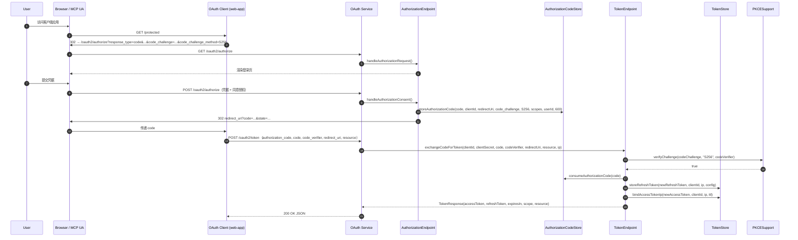

**OAuth Service 代码示例**：

```java
@RestController
public class OAuth2AuthorizeController {

    private final AuthorizationEndpoint authorizationEndpoint;
    private final AuthorizationCodeGrant authorizationCodeGrant;

    @GetMapping("/oauth2/authorize")
    public void authorize(HttpServletRequest req, HttpServletResponse resp) throws IOException {
        authorizationEndpoint.handleAuthorizationRequest(req, resp);
    }

    @PostMapping("/oauth2/authorize")
    public void consent(HttpServletRequest req, HttpServletResponse resp) throws IOException {
        authorizationEndpoint.handleAuthorizationConsent(req, resp);
    }

    @PostMapping("/oauth2/token")
    public TokenResponse token(@RequestParam Map<String, String> params,
                              @RequestHeader(value = "Authorization", required = false) String auth,
                              HttpServletRequest http) {
        String[] credentials = BasicAuthExtractor.parse(auth);   // client_secret_basic OR client_secret_post
        return switch (params.get("grant_type")) {
            case "authorization_code" -> authorizationCodeGrant.exchangeCodeForToken(
                    nvl(params.get("client_id"), credentials[0]),
                    nvl(params.get("client_secret"), credentials[1]),
                    params.get("code"),
                    params.get("code_verifier"),
                    params.get("redirect_uri"),
                    params.get("resource"),
                    ClientIpExtractor.from(http));
            case "refresh_token" -> tokenEndpoint.refreshToken(params.get("refresh_token"), ClientIpExtractor.from(http));
            case "client_credentials" -> tokenEndpoint.generateToken(
                    nvl(params.get("client_id"), credentials[0]),
                    nvl(params.get("client_secret"), credentials[1]),
                    ClientIpExtractor.from(http));
            case "urn:ietf:params:oauth:grant-type:device_code" -> tokenEndpoint.exchangeDeviceCode(
                    nvl(params.get("client_id"), credentials[0]),
                    params.get("device_code"));
            default -> throw new BusinessException(OAuth2ErrorCode.UNSUPPORTED_GRANT_TYPE);
        };
    }
}
```

### 场景 2 —— `client_credentials`

**适用**：服务到服务、M2M、Server-to-Server。

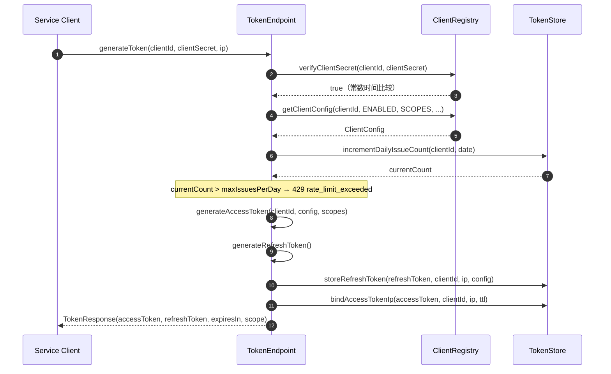

**关键实现要点：**

- 使用 `Strings.CS.equals` 比较密钥 —— 防止时序侧信道攻击。
- `maxIssuesPerDay = max(24 / tokenValidDuration, 1) + 2` —— 1 小时 token 每天最多 26 次，24 小时 token 每天仅 3 次。
- 访问令牌的 IP 绑定**可选**（当前核心实现的 refresh token 默认总是启用）。通过将白名单留空即可禁用。

### 场景 3 —— `refresh_token` 旋转与重放检测

**适用**：第一方客户端、移动应用的长期会话。最关键的安全路径。

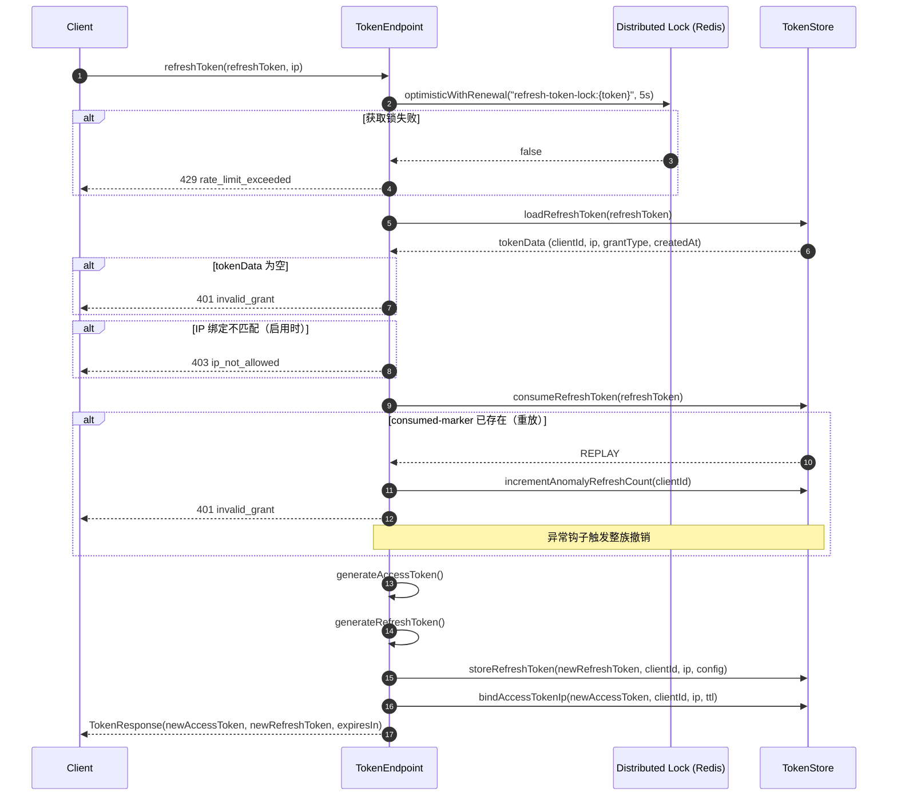

**重放检测契约：**

- 每次成功刷新物理删除旧 refresh 条目，并写入短 TTL 的 `consumed-marker`。
- 若同一 refresh token 出现两次（并发重试、恶意重放），`consumeRefreshToken(...)` 返回 `REPLAY` 状态。组件递增 `anomaly.refresh.count` 计数器并发出审计事件。
- OAuth Service 应在重放检测时撤销**整族 token**（同一血缘下的所有 refresh）。

### 场景 4 —— `device_code`

**适用**：智能电视、CLI 工具、无头设备。

**服务侧代码**：

```java
@RestController
public class OAuth2DeviceController {

    private final DeviceAuthorizationService deviceService;
    private final AuthorizationCodeGrant    authCodeGrant;   // 复用 TokenEndpoint.exchangeDeviceCode

    @PostMapping("/oauth2/device_authorization")
    public DeviceAuthorizationResponse issue(@RequestParam Map<String, String> params,
                                            @RequestHeader(value = "Authorization", required = false) String auth) {
        String[] credentials = BasicAuthExtractor.parse(auth);
        return deviceService.issueDeviceCode(
            nvl(params.get("client_id"), credentials[0]),
            ScopeParser.parse(params.get("scope")),
            params.get("resource"));
    }

    /** OAuth Service 在用户于 /activate 上确认设备后调用此方法。 */
    @PostMapping("/internal/device/{userCode}/approve")
    public void approve(@PathVariable String userCode, @RequestParam String subject) {
        deviceService.approve(userCode, subject);
    }

    @PostMapping("/oauth2/token")
    public TokenResponse poll(@RequestParam Map<String, String> params,
                              @RequestHeader(value = "Authorization", required = false) String auth) {
        String[] credentials = BasicAuthExtractor.parse(auth);
        return tokenEndpoint.exchangeDeviceCode(
            nvl(params.get("client_id"), credentials[0]),
            params.get("device_code"));
    }
}
```

**客户端流程**：

```
1. 设备 → POST /oauth2/device_authorization
   ← { device_code, user_code, verification_uri, interval, expires_in }
2. 设备向用户展示 verification_uri + user_code
3. 用户在另一台设备访问 verification_uri，输入 user_code，完成同意
   OAuth Service → DeviceAuthorizationService.approve(user_code, subject)
4. 设备轮询 POST /oauth2/token { grant_type=urn:ietf:params:oauth:grant-type:device_code, device_code }
   - 过早 → 400 slow_down（interval 增大）
   - 用户已批准 → TokenResponse(access_token, refresh_token, ...)
   - 用户拒绝 → 400 access_denied
   - 码已过期 → 400 expired_token
```

### 场景 5 —— 动态客户端注册

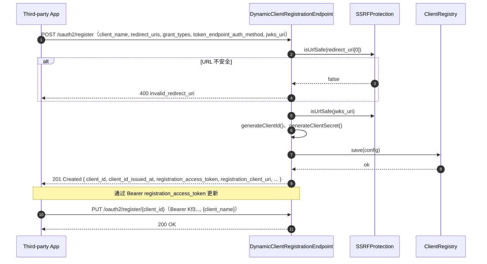

**SSRF 防护层**（`SSRFProtection.isUrlSafe`）：

1. 仅允许 HTTPS 协议 —— HTTP 一律拒绝。
2. 禁止 IP 字面量（v4 或 v6）—— `https://10.0.0.1/...` 拒绝。
3. 主机名不得解析到保留地址范围（`10.0.0.0/8`、`172.16.0.0/12`、`192.168.0.0/16`、`127.0.0.0/8`、`169.254.0.0/16`、IPv6 ULA、链路本地）。
4. 可选允许列表（`oauth-dcr.allowed-domains`）—— 不在列表的主机拒绝。
5. DNS 解析 + 缓存 + 重新检查解析后的 IP —— 抵御 DNS rebinding。

生产环境**不建议**开放匿名注册。应用注册码、管理员审批、租户策略或受信任的 bootstrap token 控制入口，并把生成的客户端写入持久化的 `ClientRepository`。

### 场景 6 —— Resource Server 三种模式

**适用**：消费 Bearer token 的任意服务 —— 网关、MCP Server、业务 API。

```java
@Component
public class ResourceServerFilter extends OncePerRequestFilter {

    private final ResourceServerAuthenticator authenticator;
    private final HeaderForwarding             principalPropagator;

    @Override
    protected void doFilterInternal(HttpServletRequest req, HttpServletResponse resp, FilterChain chain) {
        Optional<String> token = BearerExtractor.from(req);
        if (token.isEmpty()) {
            chain.doFilter(req, resp);
            return;
        }
        AuthenticationResult result = authenticator.authenticate(token.get());
        if (!result.isAuthenticated()) {
            resp.setHeader("WWW-Authenticate",
                "Bearer realm=\"resource\", error=\"" + result.getError() + "\"");
            resp.sendError(result.status(), result.getError());
            return;
        }
        AuthenticatedPrincipal p = result.getPrincipal();
        principalPropagator.propagate(req, p);     // X-User-Id / X-Client-Id / X-Scopes / X-Audience / X-Jti
        chain.doFilter(req, resp);
    }
}
```

**三种模式**，按环境选择：

| 模式 | 延迟 | AS 依赖 | 何时选 |
|---|---|---|---|
| `JWT` | 低（缓存 JWKS） | 请求时不依赖 AS | 无状态服务；长期稳定的公钥 |
| `INTROSPECTION` | 高（每次请求） | 每次请求一次调用 | 严格撤销；不透明 token |
| `HYBRID`（默认） | 混合 | 仅在 JWT 路径失败时依赖 AS | 生产通用 |

### 场景 7 —— OIDC Discovery + ID Token 契约

```bash
# Discovery（RFC 8414 + OIDC 扩展）
curl https://auth.example.com/.well-known/openid-configuration
```

```json
{
  "issuer": "https://auth.example.com",
  "authorization_endpoint": "https://auth.example.com/oauth2/authorize",
  "token_endpoint": "https://auth.example.com/oauth2/token",
  "introspection_endpoint": "https://auth.example.com/oauth2/introspect",
  "revocation_endpoint": "https://auth.example.com/oauth2/revoke",
  "jwks_uri": "https://auth.example.com/oauth2/jwks",
  "response_types_supported": ["code"],
  "grant_types_supported": ["authorization_code", "client_credentials", "refresh_token", "urn:ietf:params:oauth:grant-type:device_code"],
  "subject_types_supported": ["public"],
  "id_token_signing_alg_values_supported": ["RS256"],
  "code_challenge_methods_supported": ["S256"],
  "scopes_supported": ["openid", "profile", "email"],
  "token_endpoint_auth_methods_supported": ["client_secret_basic", "client_secret_post", "none"],
  "introspection_endpoint_auth_methods_supported": ["client_secret_basic", "client_secret_post"],
  "claims_supported": ["sub", "iss", "aud", "exp", "iat", "auth_time", "nonce", "name", "email", "email_verified"]
}
```

组件提供 `AuthorizationServerMetadata` 与 OIDC ID Token 契约。OAuth Service 暴露 `/.well-known/openid-configuration` 端点、渲染同意屏幕、并通过 `OidcUserInfoProvider` 注入用户属性。响应模式 `query`、`form_post`、Hybrid 可按客户端设置。

---

## 🎯 最佳实践

1. **公开客户端必须使用 PKCE**（移动 / SPA / CLI / MCP user agent）。设置 `oauth-authz` 要求 `code_challenge` 并拒绝 `plain`（已由 `PKCESupport` 强制执行）。
2. **优先短访问令牌 + 旋转的 refresh token**。访问令牌 5–15 分钟；refresh token 7–30 天并旋转。更长的会话应改为 `client_credentials` + DPoP / mTLS。
3. **网关热路径使用 JWT 访问令牌**（`aud` + `scope`）。`introspection` 用于不透明 token 或严格即时撤销。
4. **在授权码兑换阶段绑定 `resource`**（RFC 8707）。组件把 `resource` 与授权码一起持久化，并在兑换时校验。这能防止 token 跨 resource server 转发。
5. **签名密钥每 90 天或更短时间轮换一次。** 在 JWKS 中保留 retiring 公钥，时长不少于最长已签发 token 的 TTL。`JwkSetProvider` 同时发布 `active` 和 `retiring` 密钥；签名服务负责切换。
6. **签名私钥由 OAuth Service 持有，不要放在本组件。** 组件承载协议逻辑；Key Store 属于 AS 运行时（HSM / 密封 key 文件 / KMS）。
7. **从可信服务端上下文注入 tenant 声明。** 实现 `AccessTokenClaimsCustomizer`，从你自己的上下文（来自网关的 HTTP header、session 属性等）读取 `tenantId` —— 绝不要从入站 OAuth 请求体中读取。
8. **默认 fail-closed。** 不要在 `oauth-resource-server` 上设置 `fail-open: true`。如果 `jwk-set-uri` 与 `introspection-uri` 都未配置，应拒绝启动 Resource Server，而不是悄悄接受所有请求。
9. **Introspection 缓存 TTL 设置要短**（建议 `PT30S`）。长缓存会掩盖撤销；短缓存让 AS 保持准权威而不需要每个请求走一次网络。
10. **生产环境禁用匿名 DCR。** 通过注册码、管理员审批或租户策略控制 DCR 入口。匿名开放 DCR 只用于 dev / 合作方接入。
11. **把 Redis 缓存当作运行时缓存，不是权威存储。** Gateway 与 Resource Server 用 `OAuthCache` 存 JWKS、introspection 结果、JTI 重放与入口限流。客户端配置、refresh token、用户数据位于 OAuth Service 的持久化存储。
12. **不要把密钥写进 YAML。** 通过 `${OAUTH_TOKEN_SECRET}` 引用并由 Vault / KMS / 密封 secret 解析。永远不要提交明文 `client-secret`。
13. **生产环境使用 DCR 的 SSRF 允许列表。** 即使有五层 SSRF 防护，生产环境也要把 `oauth-dcr.allowed-domains` 配置为紧的允许列表（例如内部 IdP 与已知合作方域名）。
14. **审计敏感事件。** 对以下事件发出审计：重放检测、异常刷新率、DCR 注册/更新、JWKS 密钥轮换、AS 不可用、客户端启用/禁用。

---

## ⚙️ 配置参考

两套配置前缀并存 —— 按部署画像选择对应的那套。`platform.oauth.*` 用于 **AS 服务**，`platform.component.oauth.*` 用于 **网关 / Resource Server**。

### `platform.component.oauth.*`（网关 / Resource Server 画像）

| 配置项                                                  | 类型            | 默认值            | 说明                                                                                                                       |
|---------------------------------------------------------|-----------------|-------------------|----------------------------------------------------------------------------------------------------------------------------|
| `enabled`                                               | boolean         | `false`           | 总开关                                                                                                                     |
| `token-secret`                                          | String          | —                 | 32+ 位随机字符串，用作 HMAC 兜底 / 不透明 refresh token 签名                                                                |
| `default-token-valid-duration`                          | Integer（小时） | `2`               | 默认访问令牌 TTL                                                                                                            |
| `default-refresh-token-valid-duration`                  | Integer（小时） | `720`             | 默认 refresh token TTL（30 天）                                                                                            |
| `revoke-previous-tokens-on-issue`                       | boolean         | `false`           | 每次签发新 token 时作废旧 refresh token                                                                                     |
| `enable-daily-issue-limit`                              | boolean         | `true`            | 强制每日签发配额                                                                                                            |
| `clients`                                               | List            | `[]`              | 静态客户端注册（见 [§3](#3-注册客户端静态)）                                                                                  |
| `clients[].client-id`                                   | String          | —                 | 客户端标识                                                                                                                  |
| `clients[].client-secret`                               | String          | —                 | 密钥哈希，或 `{noop}明文` 用于开发                                                                                           |
| `clients[].grant-types`                                 | List            | `[]`              | 允许的 grant type                                                                                                          |
| `clients[].redirect-uris`                               | List            | `[]`              | 允许的 redirect URI（Authorization Code）                                                                                  |
| `clients[].scopes`                                      | List            | `[]`              | 允许的 scope                                                                                                                |
| `clients[].require-pkce`                                | boolean         | `true`            | 对该客户端强制 PKCE                                                                                                          |
| `clients[].token-valid-duration`                        | Integer（小时） |                   | 单客户端覆盖                                                                                                                |
| `clients[].refresh-token-valid-duration`                | Integer（小时） |                   | 单客户端覆盖                                                                                                                |
| `clients[].ip-whitelist`                                | List            | `[]`              | refresh token 的 IP 白名单                                                                                                 |
| `oauth-authz.enabled`                                   | boolean         | `true`            | 启用 `AuthorizationEndpoint` + `AuthorizationCodeGrant`                                                                       |
| `oauth-authz.authorization-code-ttl`                    | Integer（秒）   | `600`             | 授权码 TTL                                                                                                                  |
| `oauth-dcr.enabled`                                     | boolean         | `true`            | 启用 DCR                                                                                                                    |
| `oauth-dcr.allowed-domains`                             | List            | `[]`              | SSRF 允许列表（在五层内置检查之外）                                                                                          |
| `oauth-dcr.ssrf-cache-ttl`                              | Integer（秒）   | `3600`            | DNS 解析缓存 TTL                                                                                                            |
| `oauth-resource-server.mode`                            | enum            | `hybrid`          | `jwt` / `introspection` / `hybrid`                                                                                          |
| `oauth-resource-server.issuer`                          | String          | —                 | 受信任的 `iss` 声明                                                                                                          |
| `oauth-resource-server.jwk-set-uri`                     | String          | —                 | JWKS 端点 URL（`jwt` 与 `hybrid` 必填）                                                                                      |
| `oauth-resource-server.introspection-uri`               | String          | —                 | Introspection 端点 URL（`introspection` 与 `hybrid` 必填）                                                                 |
| `oauth-resource-server.introspection-client-id`        | String          | —                 | 用于调用 introspection 的 client ID                                                                                          |
| `oauth-resource-server.introspection-client-secret`    | String          | —                 | 用于调用 introspection 的 client secret                                                                                      |
| `oauth-resource-server.required-audience`               | String          | —                 | 可选的 `aud` 声明要求                                                                                                        |
| `oauth-resource-server.required-scopes`                 | List            | `[]`              | 必需 scope（任一匹配）                                                                                                       |
| `oauth-resource-server.introspection-fallback`         | boolean         | `true`            | hybrid 模式：JWT 路径失败时 fallback 到 introspection                                                                       |
| `oauth-resource-server.fail-open`                       | boolean         | `false`           | 若 `true`，两个校验路径都不可达时允许请求通过。**生产环境必须保持 `false`。**                                                |
| `oauth-resource-server.dpop.enabled`                    | boolean         | `false`           | 可选开启 DPoP proof 校验                                                                                                    |
| `oauth-resource-server.cache.enabled`                   | boolean         | `true`            | 启用 JWKS / introspection 结果缓存                                                                                          |
| `oauth-resource-server.cache.jwks-ttl`                  | Duration        | `PT10M`           | JWKS 缓存 TTL                                                                                                                |
| `oauth-resource-server.cache.introspection-ttl`        | Duration        | `PT30S`           | Introspection 缓存 TTL                                                                                                      |

### `platform.oauth.*`（AS 服务画像）

| 配置项                            | 类型    | 默认值            | 说明                                                              |
|-----------------------------------|---------|-------------------|------------------------------------------------------------------|
| `issuer`                          | String  | —                 | 公网 issuer URL —— 用作 `iss` 声明，并在 Metadata 中发布          |
| `authorization-endpoint`          | String  | —                 | 在 Metadata 中发布的 Authorization 端点 URL                       |
| `token-endpoint`                  | String  | —                 | 在 Metadata 中发布的 Token 端点 URL                                |
| `provider`                        | enum    | `self-hosted`     | `self-hosted` / `paas` —— 切换端点解析策略                        |
| `authorization-server-metadata-uri` | String | —                 | `/.well-known/oauth-authorization-server` 的完整 URL                |
| `jwks-uri`                        | String  | —                 | JWKS 端点 URL                                                      |
| `default-client-auth-method`      | enum    | `client_secret_basic` | 默认客户端认证方式                                                |

### 每日签发配额规则

```
maxIssuesPerDay = max(24 / tokenValidDuration, 1) + 2
```

| `tokenValidDuration`（小时） | `base` | `maxIssuesPerDay` |
|---|---|---|
| 1  | 24 | 26 |
| 2  | 12 | 14 |
| 4  | 6  | 8  |
| 8  | 3  | 5  |
| 24 | 1  | 3  |

仅在 dev / test profile 下设置 `enable-daily-issue-limit: false`。

### Redis Key 模式（归属 `oauth-cache`，不要直接读取）

| 用途                       | Key 模板                                       |
|----------------------------|------------------------------------------------|
| 客户端配置（Hash）         | `third-party-client:{clientId}`                |
| Refresh token（Hash）      | `refresh-token:{token}`                        |
| Refresh token consumed-marker | `refresh-token-used:{token}`               |
| 客户端 refresh token 索引  | `client-refresh-token:{clientId}`              |
| 每日签发计数器            | `oauth2:daily:issue-count:{clientId}:{date}`   |
| Refresh token 分布式锁    | `refresh-token-lock:{token}`                  |
| Access token 黑名单       | `access-token-blacklist:{token}`               |
| Access token IP 绑定      | `access-token-ip:{token}`                      |
| 异常刷新计数器            | `oauth2:anomaly:refresh:count:{clientId}`      |
| 异常限流计数器            | `oauth2:anomaly:ratelimit:oauth2:{clientId}`   |
| 异常 token IP 列表        | `oauth2:anomaly:token:ips:{clientId}`          |
| 审计事件（List）          | `oauth2:audit:events`                          |
| 授权码（Hash）            | `authz-code:{code}`                            |
| 客户端元数据（Hash）      | `client-meta:{clientId}`                       |
| 注册访问令牌              | `reg-token:{clientId}`                         |
| SSRF DNS 解析缓存         | `ssrf:dns:{host}`                              |
| 网关接口索引（Set）       | `gateway:api:index`                            |
| 网关接口配置（Hash）      | `gateway:api:{path}`                           |
| 网关接口 scope（Set）     | `gateway:api:scopes:{path}`                    |
| 网关 scope 配置（Hash）   | `gateway:scope:{scope}`                        |

### 错误码

| 错误码                  | 类型（RFC 6749 §5.2）    | 触发场景 |
|-------------------------|--------------------------|----------|
| `invalid_request`       | `invalid_request`        | 请求参数缺失或格式错误 |
| `invalid_client`        | `invalid_client`         | 客户端认证失败 |
| `invalid_grant`         | `invalid_grant`          | 授权码 / refresh token 无效、过期或被重放 |
| `unauthorized_client`   | `unauthorized_client`    | 客户端未被授权使用此 grant type |
| `unsupported_grant_type` | `unsupported_grant_type` | 不支持的 grant type |
| `invalid_token`         | `invalid_token`          | 访问令牌无效或过期 |
| `insufficient_scope`    | `insufficient_scope`     | token scope 不足 |
| `access_denied`         | `access_denied`          | 用户拒绝授权 |
| `rate_limit_exceeded`   | （扩展）                  | 每日签发配额耗尽 / 分布式锁竞争失败 |
| `ip_not_allowed`        | （扩展）                  | 请求 IP 不在配置的白名单内 |
| `slow_down`             | RFC 8628                 | 设备轮询过快 |

---

## 🔧 故障排查

### OAuth 特有失败模式

#### 1. 签发 token 返回 `invalid_client`

**症状**：`curl -X POST /oauth2/token` 返回 `401 {"error": "invalid_client"}`。

**检查清单**：
- `client_id` 存在于 `ClientRegistry` 中（运行 `ClientRegistry.isClientValid(...)` 或在 Redis 检查 `third-party-client:{clientId}`）。
- `enabled` 字段为 `true`。
- 客户端密钥**逐字节**匹配（没有多余空白、没有引号、编码正确）。
- 对于 `client_secret_basic`，Basic Auth header 解析正确 —— 你的解析器只切一次 `:`。

**常见原因**：TTL 过期后残留的 Redis Hash；上一台 JVM 中通过 `registerTestClient` 创建的客户端而 Redis 已被清；YAML 使用 `{bcrypt}…` 但缓存存的是 `{noop}…`（或反之）。

#### 2. 刷新请求返回 `invalid_grant`，`anomaly.refresh.count` 上升

**诊断**：refresh token 重放。可能是客户端在网络抖动后重试了陈旧 refresh token，也可能是有人复用了被截获的 refresh。

**处理**：
- 视为**安全事件**。OAuth Service 应撤销**整族 token**（同一血缘下的所有 refresh）并强制重新认证。
- 检查 `oauth2:audit:events` 中的 `event=token.refresh.replay` 事件。
- 若重放发生在一段较长的静默期之后（疑似泄露），轮换该客户端的 `client-secret`。

#### 3. Resource Server 拒绝访问令牌（HTTP 401）

**检查清单**：
- `iss` 声明与 `oauth-resource-server.issuer` 完全一致（无尾斜杠、`http` vs `https` 不一致）。
- `aud` / `resource` 声明与 `required-audience` 一致。
- Token 不在 `access-token-blacklist:{token}`（已被撤销或时钟漂移超过 TTL）。
- JWKS 缓存未过期；JWT header 中的 `kid` 仍在 `JwkSetProvider.keys()` 中。

如果 `mode=hybrid` 且 JWKS 校验失败，认证器会 fallback 到 introspection。确认 `introspection-uri` 与 `introspection-client-*` 也已配置。

#### 4. DCR 返回 `invalid_redirect_uri`

最常见的原因是 SSRF 防护拒绝。逐层检查：
1. URL 以 `https://` 开头？—— HTTP 一律拒绝。
2. 主机名不是 IP 字面量？—— `https://10.0.0.1/...` 会被拒绝。
3. 主机名未解析到保留地址范围？
4. 主机名在 `oauth-dcr.allowed-domains` 中（启用时）？
5. DNS 解析成功，且解析后的 IP 同样不在保留地址范围内？（DNS rebinding 防护）

可检查 `ssrf:dns:{host}` 查看解析是否已被缓存。

#### 5. PKCE 拒绝 —— 兑换授权码时返回 `invalid_grant`

- `code_challenge_method` 必须为 `S256`。`plain` 已被默认拒绝。
- `code_verifier` 必须为 43–128 字符，URL-safe base64，无 padding。
- `code_verifier` 的 SHA-256 哈希必须与最初发送的 `code_challenge` 完全一致。

#### 6. 设备轮询立即返回 `slow_down`

组件强制执行初次 device authorization 响应中返回的 `interval`。如果客户端轮询频率高于 `interval`，每次 `slow_down` 时将轮询延迟增加 `interval` 秒。

#### 7. JWKS 端点返回空 `keys`

`JwkSetProvider.keys()` 为空，因为 OAuth Service 还没生成 / 加载签名密钥。Resource Server 将 fallback 到 introspection（`mode=hybrid`）或直接失败（`mode=jwt`）。等待 AS 完成初始化，或检查 AS 日志。

#### 8. 从浏览器应用调用 `/oauth2/token` 时被 CORS 预检阻止

`/oauth2/token` 应允许来自已注册 `redirect_uri` origin 的 CORS 预检。OAuth Service 应基于请求中的 `client_id` / `redirect_uri` 动态配置 `Access-Control-Allow-Origin`。公开客户端 Authorization Code + PKCE 在生产环境必须始终使用 HTTPS。

### 监控指标

当 Micrometer Registry 在 classpath 上时，组件自动发布 Micrometer 指标。建议采集的指标：


| 指标                                 | 类型     | 标签                              | 用途                                          |
|--------------------------------------|----------|-----------------------------------|-----------------------------------------------|
| `oauth.token.issue`                  | Counter  | `grant_type`, `client_id`         | 每种 grant type 的签发速率                     |
| `oauth.token.refresh`                | Counter  | `result` (success/replay/error)   | 跟踪重放尝试作为安全信号                       |
| `oauth.token.replay.detected`        | Counter  | `client_id`                       | 重放信号 —— 非零即告警                        |
| `oauth.token.revoke`                 | Counter  | `token_type_hint`                 | 撤销量                                         |
| `oauth.dcr.register`                 | Counter  | `result`                          | DCR 注册速率                                   |
| `oauth.dcr.ssrf.rejected`            | Counter  | `reason`                          | SSRF 拒绝原因分布                             |
| `oauth.resource.authenticate`        | Counter  | `mode` (jwt/intro/hybrid), `result` | 各模式验证结果                              |
| `oauth.resource.cache.hit`           | Counter  | `kind` (jwks/introspection)      | 缓存有效性                                     |
| `oauth.resource.dpop.rejected`       | Counter  | `reason`                          | DPoP proof 失败（仅在启用 DPoP 时）            |
| `oauth.daily.issue.count`            | Gauge    | `client_id`                       | 每客户端每日计数（采集 + 告警）                |
| `oauth.lock.contended`               | Counter  | `key`                             | refresh token 锁竞争                           |
| `oauth.authorization.code.consumed`  | Counter  | `result`                          | 授权码消费成功率                               |

告警建议：
- `rate(oauth.token.replay.detected[5m]) > 0` → on-call 立刻响应。
- `rate(oauth.dcr.ssrf.rejected[1m]) > 0.1` → 触发安全审查。
- `oauth.daily.issue.count{client_id="..."} > maxIssuesPerDay * 0.8` → 警告。
- `rate(oauth.resource.authenticate{result="failure"}[5m]) > 0.05` → 排查 JWKS / introspection 端点。

### 日志配置

```yaml
logging:
  level:
    cn.richie696.component.oauth: INFO
    cn.richie696.component.oauth.core: INFO
    cn.richie696.component.oauth.authz: INFO
    cn.richie696.component.oauth.dcr: INFO
    cn.richie696.component.oauth.oidc: INFO
    cn.richie696.component.oauth.resource: INFO
    # 调试 PKCE / SSRF / 重放路径时设为 DEBUG
    cn.richie696.component.oauth.authz.PKCESupport: DEBUG
    cn.richie696.component.oauth.dcr.SSRFProtection: DEBUG
  pattern:
    console: "%d{yyyy-MM-dd HH:mm:ss} [%thread] %-5level %logger{36} [%X{traceId:-},%X{spanId:-}] - %msg%n"
```

> **永远不要**记录 client secret、原始 refresh token、密码或签名私钥。组件内部已做脱敏；请在 logger 边界上用 logback / log4j2 redaction 过滤器再次落实。

---

## 📎 ⏱️ 时序图详解

下面五个时序图覆盖最关键、最易出错的安全路径。它们是规范时序图；完整时序集（revoke、introspect、JWT 校验、DCR 变体、AS Metadata 发现、Client ID Metadata Document、Step-Up）请参考原先位于 `docs/` 下的 `oauth-component-design` 源文档。

### Authorization Code + PKCE

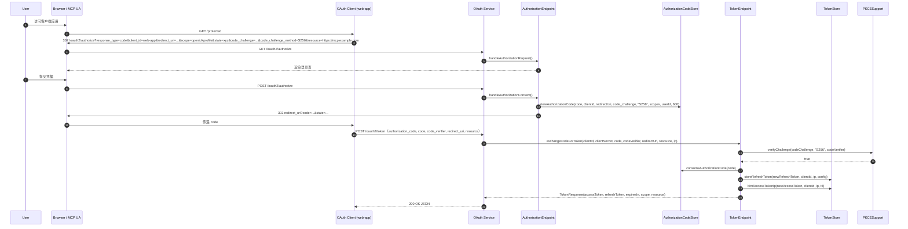

### Refresh Token 与重放检测


### Client Credentials

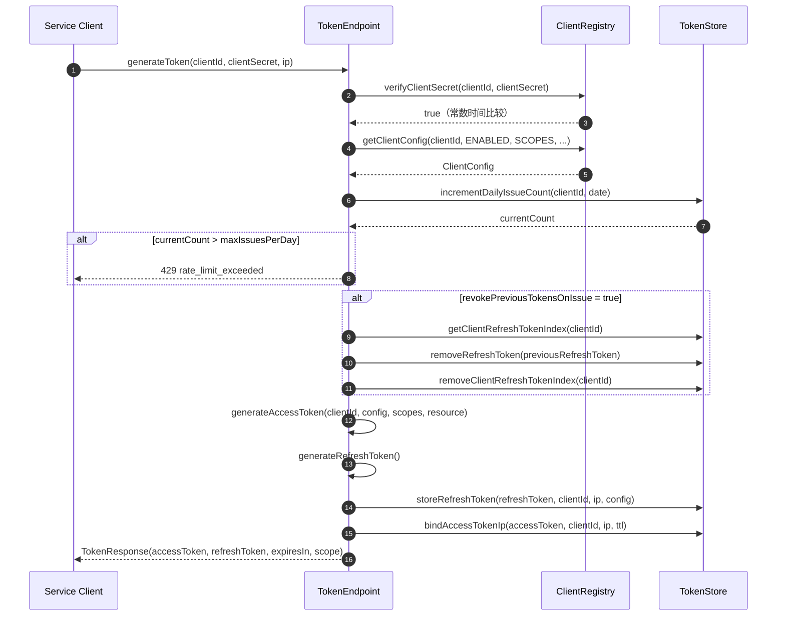

### Token Revocation

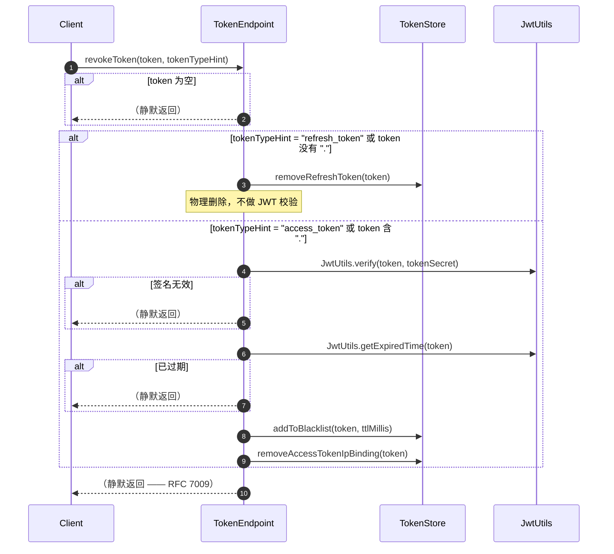

### Resource Server 验证流程

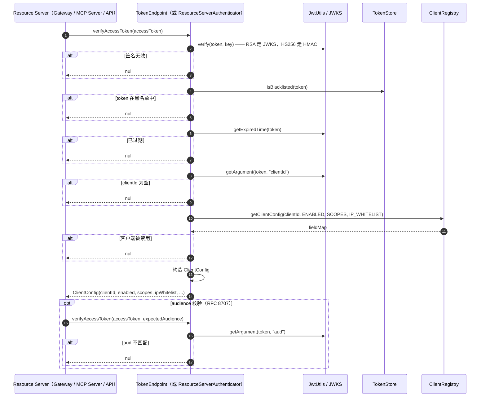

---

## ⚠️ 已知限制

| 限制                                            | 影响                                                                                                  | 解决办法 / 状态                                                                                       |
|-------------------------------------------------|------------------------------------------------------------------------------------------------------|-------------------------------------------------------------------------------------------------------|
| **本组件不提供 HTTP 运行时**                    | `/oauth2/authorize`、`/oauth2/token`、`/oauth2/jwks`、`/oauth2/register`、登录与同意页必须由 OAuth Service 托管 | 已规划。`atlas-richie-oauth-server` 是计划归宿；当前消费方可使用遵循 Metadata / Token / Introspection 契约的任何 PaaS AS |
| **不支持 SAML 2.0 / WS-Federation**            | 仅支持 SAML 的联邦不兼容                                                                              | 不在范围内；使用独立的 SAML IdP                                                                       |
| **没有内置 IdP**                                 | 自行接入用户存储、登录 UI、MFA                                                                       | 实现 `OidcUserInfoProvider`，并从 OAuth Service 调用登录 SPI                                          |
| **Refresh token 旋转无法关闭**                  | RFC 6749 §10.4 要求旋转；协议语义强制                                                                | 若需要不旋转的 refresh，请实现自定义 `OAuth2TokenGenerator`                                          |
| **`revoke-previous-tokens-on-issue` 默认 `false`** | 泄露的 refresh token 在 TTL 之前一直有效                                                          | 高安全第一方客户端设为 `true`；接受旋转开销                                                          |
| **JWKS 缓存 TTL 全局共享**                       | 签名密钥轮换早于缓存过期意味着新签发的 token 仍使用某些 Resource Server 已信任的密钥                    | 把 `cache.jwks-ttl` 设为不超过最长已签发 token 的 TTL；使用 `active` / `retiring` / `retired` 生命周期 |
| **DCR `registration_access_token` 生命周期**   | 规范建议轮换；当前实现复用同一 token 直至撤销                                                       | 由 OAuth Service 提供轮换能力；视为 P0 遗留项                                                        |
| **DPoP `jti` 重放状态位于 `OAuthCache`**        | 单实例 Redis SPOF 成为重放检测的单点故障                                                              | 使用 Redis 集群；或在只读 / 低流量场景下接受权衡                                                      |
| **OIDC UserInfo 输出按 scope 过滤**              | 部分应用希望无论 scope 如何都返回相同输出                                                            | 提供一个忽略 scope 过滤的自定义 `OidcUserInfoProvider`                                              |
| **`fail-open` 故意不作为默认值**                  | 希望优雅降级的生产构建必须显式开启                                                                   | 在完成书面安全评审后，对个别路由设置 `fail-open: true`                                                |
| **除 `enable-daily-issue-limit` 之外无全局客户端限流** | 突发保护仅针对单客户端；没有全局桶                                                              | 在网关层引入 `atlas-richie-web` 限流组件                                                              |

---

## ❓ 常见问题

### Q1 —— 这是不是完整的 Authorization Server？

不是。本组件是**协议内核、SPI 与适配层**。它不拥有登录、同意、MFA、用户数据库或 HTTP 运行时。完整的 Authorization Server = 本组件 + 一个 OAuth Service（实现 HTTP 端点、用户流程、持久化与签名密钥托管）。详见 [三层职责边界](#三层职责边界先读这一段)。

### Q2 —— 与 `spring-security-oauth2-authorization-server` 有什么区别？

| 维度                       | `spring-security-oauth2-authorization-server`                  | `atlas-richie-oauth-parent`                                                          |
|----------------------------|-----------------------------------------------------------------|----------------------------------------------------------------------------------------|
| 运行时                     | 独立的 AS，使用 Spring Security 粘合代码                         | 可复用的协议内核；HTTP 运行时位于 `atlas-richie-oauth-server`                          |
| 存储                       | 默认 JDBC；Redis 可选                                            | SPI 优先；Redis 通过 `atlas-richie-component-cache` 实现；JDBC 走自定义实现              |
| 多租户                     | 需要自定义扩展                                                   | 一等公民 —— `AccessTokenClaimsCustomizer` + `platform.oauth.tenant`                    |
| MCP / RFC 8707 绑定        | 手动                                                              | 内置 `resource` 参数，随授权码持久化，绑定到 `aud`                                       |
| PKCE                       | 支持 `S256`，同时接受 `plain`                                    | 仅 `S256`，`plain` 一律拒绝（OAuth 2.1）                                                |
| DCR + SSRF                 | 提供 DCR；SSRF 依赖消费方                                        | DCR + 五层 SSRF 防护内置                                                               |
| Refresh 重放               | 手动                                                              | 内置 consumed-marker + 异常计数器 + 整族撤销钩子                                          |
| DPoP（RFC 9449）           | 需要扩展                                                        | 可选 DPoP proof 校验，含 `ath`、`cnf.jkt`、nonce、分布式 `jti` 防重放                      |
| 平台集成                   | 独立                                                              | Atlas Richie 组件生态的一部分：cache、web、webflux、mfa、tenant                          |

### Q3 —— 能接入自己的 token store 吗？

可以。实现 `TokenStore`（或 `OAuthCache`、`AuthorizationCodeStore`、`ClientRepository`），并把它暴露为 `@Bean`。默认 Redis 实现会被你的实现替换。请务必遵守 consumed-marker 契约 —— 这是 refresh 重放检测能起作用的关键。

### Q4 —— PKCE 必须吗？

对公开客户端（移动 / SPA / CLI / MCP user agent）**必须**（仅 `S256`）。对机密客户端可选但**强烈推荐** —— RFC 7636 已被 OAuth 2.1 扩展到覆盖机密客户端。

### Q5 —— 如何向 JWT 添加自定义声明？

实现 `AccessTokenClaimsCustomizer`，从你的可信服务端上下文（来自网关的 HTTP header、session 等）读取 tenant 信息。绝不要从入站 OAuth 请求中读取 tenant 信息。

```java
@Bean
public AccessTokenClaimsCustomizer accessTokenClaimsCustomizer() {
    return (clientId, client, scopes, resource) ->
        Map.of(
            "tenant_id", TrustedTenantContext.currentTenant(),
            "tenant_role", TrustedTenantContext.currentRole());
}
```

组件拒绝覆盖保留协议声明（`iss` / `sub` / `aud` / `scope` / `client_id` / `jti` / `exp` / `iat` / `nbf`）。

### Q6 —— 支持 OIDC 吗？

支持，通过 `oauth-oidc` 模块。它提供 ID Token 签名（RS256）、`openid` / `nonce` 校验、scope 过滤的 UserInfo、Discovery 元数据、RP-Initiated Logout 与 Front/Backchannel Logout 契约。OAuth Service 必须提供用户存储、登录/MFA 流程、同意 UI 与 HTTP Controller。

### Q7 —— 如何在自建 AS 和 PaaS AS 之间切换？

设置 `platform.oauth.provider`（`self-hosted` / `paas`），并更新 `issuer` 与端点 URI。协议契约不变；客户端与网关只需要遵循标准 Metadata / Token / Introspection 端点。如果 PaaS 提供方的声明形状不符合规范，可在 `oauth-client` / `oauth-resource-server` 内加 Provider Adapter —— 不要在网关 filter 内放分支逻辑。

### Q8 —— RFC 8707（`resource`）支持吗？

支持。`resource` 参数随授权码持久化，并在兑换时重新校验。签发的访问令牌的 `aud` 声明包含 resource URI。Resource Server 校验 `aud` 声明是否匹配 `required-audience`。这能防止 token 跨 resource server 转发。

### Q9 —— 网关应该签发 token 吗？

**不应该。** 网关是 Resource Server，不是 Authorization Server。Token 签发在 OAuth Service。网关可以使用 Redis 存 JWKS / introspection 缓存、JTI 重放状态、分布式锁与入口侧限流，但绝不把 Redis 当作权威的 Client / User / Consent / Token 状态。边界在 [三层职责边界](#三层职责边界先读这一段) 中说明。

### Q10 —— 从当前网关 OAuth 实现迁移的推荐路径？

四个阶段（完整内容见 `oauth-platform-architecture.md` §8）：

1. **组件契约强化** —— 完成 SPI 拆分（把 Servlet/Session 从 `AuthorizationEndpoint` 移出）。
2. **新建 `atlas-richie-oauth-server`** —— 配 DB + Liquibase、签名密钥、同意 UI。
3. **网关切换** —— 用 Resource Server Adapter 替换 token 签发代码；迁移期内保留 `/api/oauth2/*` 反向代理。
4. **运营加固** —— 密钥轮换、重放 / 撤销 / Redis 故障 / DB 故障演练、多租户隔离、审计、指标。

---

**atlas-richie-oauth-parent** —— Atlas Richie 平台的 OAuth 2.1 协议内核。