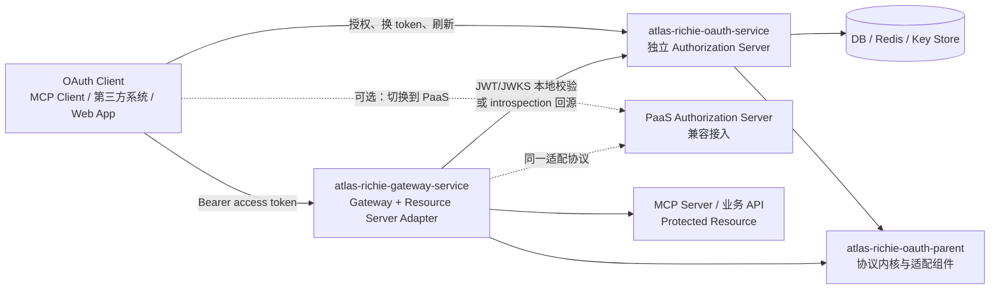
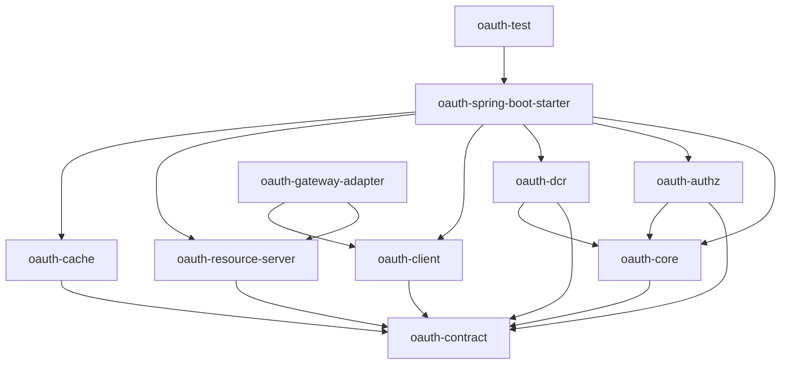
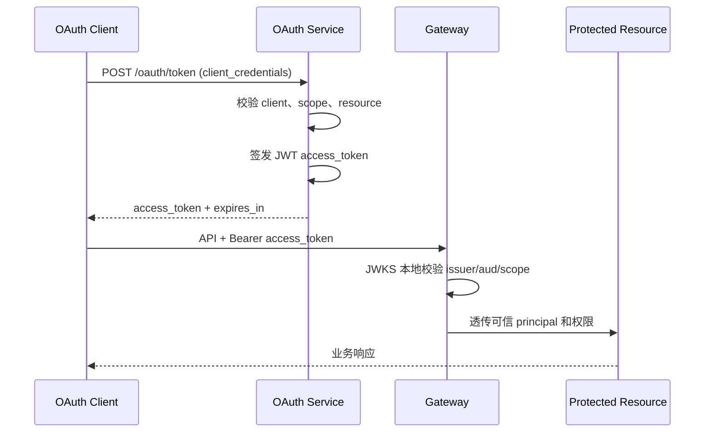
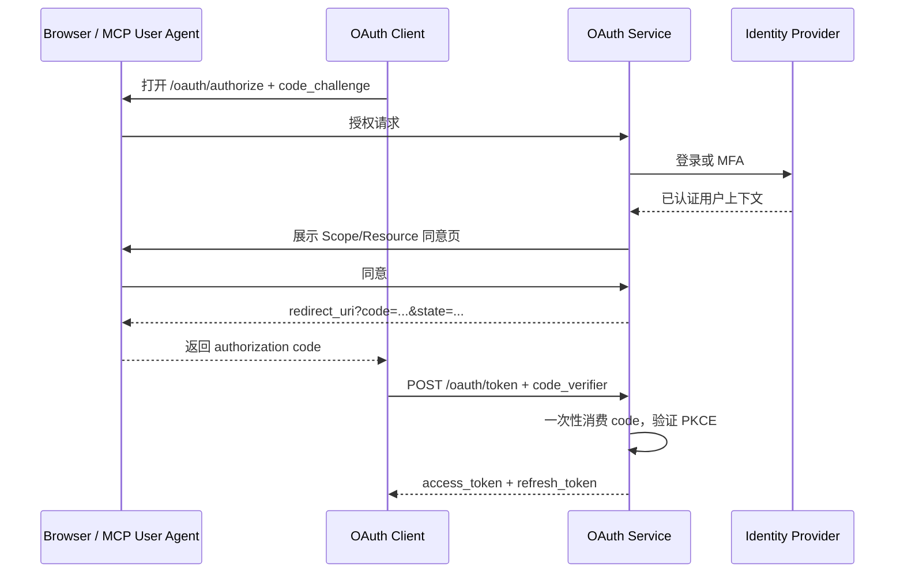

# OAuth 平台架构与职责边界设计

## 1. 文档定位

本文是以下三个工程的统一架构基线：

1. `atlas-richie-oauth-parent`：可复用的 OAuth 协议能力组件；
2. `atlas-richie-gateway-service`：统一入口和 Resource Server 适配层；
3. `atlas-richie-oauth-service`：独立部署的 OAuth Authorization Server（AS）服务。

本文先定义职责、模块、接口和数据边界，再指导后续代码迁移。除非另有说明，本文中的“当前实现”指仓库现状，“目标实现”指完成拆分后的生产形态。

> 关键结论：`atlas-richie-oauth-parent` 不是可直接部署的完整 AS。它提供协议内核、SPI、缓存适配和 Spring Boot 集成能力；真正负责登录、同意页、客户端管理、持久化和对外 HTTP 端点的，是独立的 `atlas-richie-oauth-service`。

### 1.1 术语约定

本文严格区分以下四个概念，后续设计和代码评审也应沿用这组表达：

| 概念 | 含义 | 示例 |
|---|---|---|
| 访问基础设施 | 服务是否连接某项基础设施 | Gateway 连接 Redis、数据库、消息系统 |
| 调用组件能力 | 服务是否通过组件获得某项技术能力 | Gateway 通过 `oauth-resource-server` 使用 JWKS 缓存和 introspection |
| 拥有权威数据 | 服务是否维护某类数据的最终一致性和生命周期 | OAuth Service 拥有 Client、User、Consent、Key 元数据 |
| 负责业务决策 | 服务是否决定协议或业务结果 | OAuth Service 决定是否签发 Token，Gateway 决定请求是否放行 |

因此，本文使用“Gateway 不负责 OAuth Server”时，具体指 Gateway 不拥有 OAuth 权威数据、不执行 Token 签发和授权决策；不表示 Gateway 不访问 Redis，也不表示 Gateway 不调用 OAuth 组件。

## 2. 总体架构



### 2.1 三层边界

| 层次 | 工程 | 核心定位 | 必须拥有 | 明确不拥有 |
|---|---|---|---|---|
| 能力组件层 | `atlas-richie-oauth-parent` | 协议、领域模型、SPI 和适配器 | Token/授权码/PKCE/DCR 等可复用能力，标准错误模型，Token 校验端口 | 登录页面、管理员 UI、业务用户数据库、服务部署入口 |
| 认证中心层 | `atlas-richie-oauth-service` | 独立 AS 产品和运行时 | 标准 OAuth HTTP 端点、用户登录、授权同意、客户端/Scope/Resource 管理、密钥、审计、持久化 | Gateway 路由、下游业务鉴权、业务接口权限判断 |
| 流量入口层 | `atlas-richie-gateway-service` | Gateway + Resource Server | Token 接收和校验、issuer/audience/scope/resource 校验、下游身份透传、入口审计和风控 | Token 签发、刷新、撤销、客户端注册、授权同意、用户认证 |

### 2.2 信任关系

- OAuth Service 是 Token 的唯一签发者，也是客户端、Scope、Resource 和授权记录的权威来源。
- Gateway 仍然可以、并且在集群部署中通常需要访问 Redis；该访问通过 OAuth 组件的 Cache/Resource Server Adapter 完成，用于 JWKS 和 introspection 结果缓存、分布式锁、JTI 重放检测、限流等运行时能力。
- Gateway 不再把 Redis 中的客户端配置、用户、授权记录或 Token 状态当作自己维护的 OAuth 权威数据，也不直接读写 OAuth Service 的数据库和内部 Key 结构。
- Gateway 信任的是配置的 `issuer`、JWKS 或 introspection endpoint 返回的验证结果；Redis 只是校验结果和安全策略的运行时存储，不是新的 Authorization Server。
- 业务服务和 MCP Server 只信任经过 Gateway 或自身 Resource Server Adapter 校验后的主体和权限声明。
- PaaS AS 与自建 AS 使用同一组标准协议端点和适配契约，Gateway/客户端只切换 issuer 与 endpoint 配置，不绑定实现方。

## 3. `atlas-richie-oauth-parent` 组件设计

### 3.1 当前模块与目标模块

当前 POM 已包含并完成基础实现的模块：

| 当前模块 | 当前职责 | 目标定位 |
|---|---|---|
| `atlas-richie-oauth-core` | Token 签发、刷新、验证、撤销；客户端注册表；Scope 解析；`TokenStore`、`ClientRepository`、`AccessTokenSigner` SPI | 无界面、可注入存储和密钥实现的协议核心 |
| `atlas-richie-oauth-authz` | Authorization Code、PKCE、授权码存储、AS Metadata 模型 | `AuthorizationService` 提供框架无关能力，Servlet/Session 仅保留兼容适配 |
| `atlas-richie-oauth-dcr` | 动态客户端注册 DTO、校验、SSRF 防护、注册服务 | `ClientRegistrationStore` 可注入，默认 Redis 实现，生产入口由 OAuth Service 控制 |

其余模块已经纳入当前聚合工程，由 `atlas-richie-oauth-parent` 统一做 Maven 聚合和版本管理：

```text
atlas-richie-oauth-parent/
├── atlas-richie-oauth-contract          # 协议 DTO、错误码、端点契约
├── atlas-richie-oauth-core              # Token、Client、Scope、授权核心领域能力
├── atlas-richie-oauth-authz             # Authorization Code + PKCE
├── atlas-richie-oauth-oidc              # OIDC Provider：ID Token、UserInfo、Discovery、Logout
├── atlas-richie-oauth-dcr               # Dynamic Client Registration，可选
├── atlas-richie-oauth-client            # OAuth/OIDC Client 调用端、Discovery 和 UserInfo 能力
├── atlas-richie-oauth-resource-server   # JWT/JWKS、introspection、Resource 校验
├── atlas-richie-oauth-cache             # 授权码、Refresh Token、黑名单、锁的缓存端口
├── atlas-richie-oauth-spring-boot-starter# Spring Boot 自动装配和配置绑定
├── atlas-richie-oauth-gateway-adapter   # Gateway/WebFlux Filter Facade
└── atlas-richie-oauth-test              # 协议一致性、端到端和测试工具
```

模块依赖原则：



组件模块不得依赖 `atlas-richie-gateway-service` 或未来的 `atlas-richie-oauth-service`，避免形成反向依赖和服务代码泄漏到公共组件。

### 3.2 组件功能明细

#### `oauth-contract`

- OAuth 请求和响应 DTO：Token、Introspection、Revoke、Authorization、DCR、Metadata、JWKS；
- 标准错误码和错误响应序列化规则；
- Grant Type、Token Type、认证方式、Scope/Resource 的值对象；
- issuer、audience、resource、client_id、subject 等声明名称；
- 对外 SPI 的稳定接口，确保自建 AS、PaaS AS、Gateway Adapter 使用同一契约。

#### `oauth-core`

- 校验客户端身份、Grant Type、Scope 和 Resource；
- 访问令牌和刷新令牌的生命周期编排；
- TokenStore、ClientRegistry、ScopeResolver 等可替换端口；
- Token 撤销、Refresh Token 旋转、重放检测所需的领域操作；
- 标准化异常，不直接决定 HTTP 状态码和 Web 页面。

当前 `TokenEndpoint` 已包含签发、刷新、验证、撤销、客户端认证、Resource 指示器和 Device Authorization 兑换流程。签名器、ClientRepository、TokenStore、OAuthCache、审计和 Claims 均通过 SPI/Bean 注入；独立 AS 只负责 HTTP 编排、用户认证和权威数据持久化。

#### `oauth-authz`

- 校验授权请求：client、redirect URI、response type、scope、resource、PKCE；
- 创建一次性授权码并绑定 client、user、redirect URI、scope、resource、code challenge；
- 授权码兑换所需的校验和消费语义；
- Authorization Server Metadata 的领域模型。

当前 `AuthorizationEndpoint` 直接依赖 `HttpServletRequest`、`HttpServletResponse` 和 HTTP Session，且存在 `user_id` 请求参数兜底逻辑。这只能作为开发阶段实现，生产版必须改为“请求对象 + 已认证用户上下文 + 授权决定”的纯服务接口；登录和 Session/浏览器交互由 OAuth Service 负责。

#### `oauth-oidc`

- OIDC Authorization Code 请求的 `openid` scope 和 nonce 校验；
- RS256 ID Token 签发与 issuer、audience、nonce 验证；
- UserInfo Claims SPI 和按 scope 的最小化输出；
- OIDC Discovery Metadata、RP-Initiated Logout 回调校验以及 Front-Channel/Backchannel Logout 契约；
- 不包含用户数据库、登录/MFA、同意页或 HTTP Controller，具体实现由 OAuth Service 注入。

#### `oauth-dcr`

- RFC 7591 动态客户端注册和更新的领域校验；
- redirect URI、客户端认证方式、Grant Type、Scope、JWKS URI 校验；
- SSRF 防护和注册访问令牌策略。

DCR 不应默认开放公网匿名注册。OAuth Service 应通过注册码、管理员审批、租户策略或受信任的 bootstrap token 控制入口，并将最终客户端写入持久化 Client Repository。

#### `oauth-client`

- Authorization Server Metadata 和 Protected Resource Metadata 的发现客户端；
- Authorization Code + PKCE、Client Credentials、Refresh Token 的标准调用器；
- OIDC Discovery 和 UserInfo 的标准客户端；
- Token endpoint 认证、超时、重试和错误映射；
- 支持自建 AS 与 PaaS AS 的统一配置模型。

#### `oauth-resource-server`

- JWT access token 的签名、issuer、audience/resource、时间窗口和 scope 校验；
- JWKS 拉取、缓存、密钥轮换和不可用时的安全降级；
- introspection fallback；
- 输出统一的 `AuthenticatedPrincipal`/`TokenIntrospection`，供 Gateway、MCP Server 和普通业务服务使用。

#### `oauth-cache`

- 授权码、Refresh Token 状态、Token 黑名单、JTI 重放、分布式锁和限流的缓存端口；
- 基于 `atlas-richie-component-cache` 的 Redis 默认适配；
- 不把 Redis Key 结构泄漏给 Gateway 或业务服务；
- 明确区分“权威持久化数据”和“可重建缓存数据”。

#### `oauth-spring-boot-starter` / `oauth-gateway-adapter`

- Starter 负责配置绑定、条件装配、默认实现和健康检查；
- Gateway Adapter 负责 WebFlux Filter 所需的 Bearer 提取、异步校验、异常响应和 Principal 透传；
- 两者只提供 Facade/Glue，不复制 Token 业务逻辑。

### 3.3 组件数据边界

| 数据 | 组件可提供的能力 | 权威归属 |
|---|---|---|
| Client、Scope、Resource | Repository/Registry SPI 与缓存适配 | OAuth Service 的数据库 |
| Access Token 签名 | TokenGenerator/Signer SPI | OAuth Service 的 Key Store |
| Refresh Token | 旋转、消费、重放检测 SPI | OAuth Service 的 DB/Redis |
| Authorization Code | 一次性写入、消费、PKCE 校验 | OAuth Service 的 Redis/短期存储 |
| JWK Set | JWK 解析、缓存和轮换适配 | OAuth Service 的 Key Store/JWKS endpoint |
| 用户、登录会话、同意记录 | 仅定义输入端口 | OAuth Service 的身份源和数据库 |

## 4. `atlas-richie-oauth-service` 设计

### 4.1 服务定位

`atlas-richie-oauth-service` 是可以在公网、专有云、内网和完全离线环境独立运行的 Authorization Server 产品。它可以使用本地组件，也可以通过标准协议对接外部 PaaS AS；对下游客户端和 Gateway 暴露统一的 OAuth 接口。

服务不依赖某一家 PaaS。涉密或断网环境下，数据库、Redis、用户目录、证书、签名密钥和前端静态资源均可本地部署。

### 4.2 建议工程模块

```text
atlas-richie-oauth-service/
├── oauth-service-boot          # Spring Boot 启动、配置、健康检查、运行时组装
├── oauth-service-web           # OAuth 标准端点、错误响应、协议过滤器
├── oauth-service-admin         # 客户端、Scope、Resource、密钥、租户和审计管理 API
├── oauth-service-identity      # 本地用户、LDAP/AD、外部 IdP/SSO 适配
├── oauth-service-persistence   # DB Repository、Liquibase、事务和数据迁移
├── oauth-service-ui            # 登录、授权同意、管理页面静态资源或前端工程
└── oauth-service-deployment    # Docker、K8s、离线安装包、配置和升级脚本
```

服务工程可以按团队规模合并物理模块，但逻辑边界必须保留。尤其不能让 `oauth-service-web` 直接操作 Redis Key 或绕过核心组件写 Token。

### 4.3 对外端点

目标端点如下，具体路径可配置，但 metadata 中公布的 URL 必须与实际部署一致：

| 端点 | 归属 | 说明 |
|---|---|---|
| `GET /.well-known/oauth-authorization-server` | OAuth Service | Authorization Server Metadata（RFC 8414） |
| `GET /oauth/authorize` | OAuth Service | Authorization Code + PKCE 授权入口 |
| `POST /oauth/token` | OAuth Service | Client Credentials、Authorization Code、Refresh Token |
| `POST /oauth/introspect` | OAuth Service | 受保护的 Token introspection |
| `POST /oauth/revoke` | OAuth Service | Access/Refresh Token 撤销 |
| `GET /oauth/jwks.json` | OAuth Service | 公钥集合和密钥轮换 |
| `POST /oauth/register` | OAuth Service，可选 | DCR，默认关闭或要求注册权限 |
| `GET/POST /login/*` | OAuth Service | 用户登录、MFA、外部身份源回调 |
| `/admin/*` | OAuth Service | 客户端、Scope、Resource、密钥、审计和租户管理 |

Protected Resource Metadata（RFC 9728）描述的是 MCP Server/业务资源，不属于 AS。它应由 Resource Server 或 MCP Adapter 按资源地址发布。

### 4.4 目标 Grant Type

首期支持：

- `client_credentials`：服务到服务、MCP 机器客户端；
- `authorization_code` + PKCE `S256`：Web、移动端、MCP 用户代理流程；
- `refresh_token`：刷新令牌轮换、单次消费和重放检测。

首期不支持 Resource Owner Password Credentials。Device Authorization Grant 可作为离线设备场景的后续扩展，但必须在单独的安全评审后启用。

### 4.5 Token 和密钥策略

- Access Token 首选非对称签名 JWT；至少包含 `iss`、`sub`、`aud`/`resource`、`client_id`、`scope`、`iat`、`exp`、`jti` 和租户声明；
- Gateway 和 Resource Server 优先本地 JWKS 校验，只有不适合 JWT 或需要即时失效时才调用 introspection；
- Refresh Token 使用高熵不透明值，服务端只保存哈希或不可逆摘要；
- Refresh Token 默认旋转，旧值重复使用必须触发重放告警，并按客户端策略撤销令牌族；
- 签名私钥只能由 OAuth Service 访问，使用本地 Key Store、HSM 或受控密钥文件；
- JWKS 支持 `active`/`retiring`/`retired` 生命周期，先发布公钥再切换签名，保留旧公钥到最长 Token TTL 之后；
- 离线部署支持导入初始密钥、轮换密钥和备份恢复，但禁止把私钥放在 Git、镜像或普通配置中心。

### 4.5.1 Logout 和 DPoP 运行时策略

- OAuth Service 负责维护登录 Session、生成 Backchannel Logout Token，并通过注入的 HTTP 投递器通知 RP；失败重试、熔断、补偿和最终 Session 清理属于 Service 层；
- Front-Channel Logout 由 Service 渲染 iframe，组件只生成带 `iss`/`sid` 的安全地址；
- Resource Server/Gateway 仅在显式启用时接受 `Authorization: DPoP` 或 Bearer + `DPoP` proof；proof 必须校验 ES256 签名、`htm`、去查询参数后的 `htu`、`iat`、`ath`、Access Token 的 `cnf.jkt` 和一次性 `jti`；
- DPoP `jti`、nonce 和刷新/注销事件状态必须使用跨实例一致的 Cache；单进程实现仅用于测试或明确的单节点部署。

### 4.6 服务数据归属

| 数据域 | 推荐存储 | 生命周期/一致性要求 |
|---|---|---|
| Client、Scope、Resource、Tenant | 关系型数据库 | 权威数据，事务更新，审计变更 |
| User、Role、Consent | 本地数据库或 LDAP/AD/外部 IdP | 登录和授权决定的权威来源 |
| Authorization Code | Redis 或短期 KV | 单次消费，默认 10 分钟内过期 |
| Refresh Token 状态 | DB + Redis 索引 | 旋转、撤销、重放检测必须原子化 |
| Access Token 黑名单/JTI | Redis，可选 DB 归档 | 仅在启用即时撤销时使用 |
| JWK 元数据 | DB/本地 Key Store | 私钥受限，公钥可缓存 |
| Audit Event | DB + 消息/文件出口 | 不记录完整 Token、Client Secret 或密码 |

`atlas-richie-component-cache` 解决的是跨实例缓存、锁和缓存适配问题。OAuth Service 使用它保存授权码、Refresh Token 状态等 OAuth 运行时数据；Gateway 也可以使用它保存 JWKS、introspection 结果、JTI 重放状态和入口风控状态。但这些都不替代 OAuth Service 的 Client/User/Consent 权威数据库，Gateway 也不应直接复用 OAuth Service 的内部 Redis Key。

## 5. `atlas-richie-gateway-service` 设计

### 5.1 目标职责

Gateway 只负责“请求进入受保护资源之前的校验和传播”：

- 从 `Authorization: Bearer` 提取 Access Token；
- 依据配置的 issuer、JWKS、audience/resource、scope 和时间窗口校验；
- JWT 校验失败或配置为 opaque token 时调用 introspection；
- 执行 Gateway 入口侧 IP 白名单、租户、限流、重放和异常检测策略；
- 将 subject、client_id、scope、tenant_id、jti 等可信结果写入下游约定的请求头或 Reactor Context；
- 记录访问审计、拒绝原因和关联 ID；
- 通过 OAuth 组件使用 Redis 保存 JWKS/introspection 缓存、分布式锁、JTI 重放状态和入口风控状态；
- 将旧 `/api/oauth2/*` 地址在迁移期反向代理到 OAuth Service。

### 5.2 明确移出 Gateway 的能力

- Access Token 和 Refresh Token 签发；
- Refresh Token 旋转和消费；
- ClientRegistry、Scope/Resource 管理；
- Authorization Code、PKCE 和授权同意；
- 用户登录、MFA、Session、Consent；
- DCR 和客户端密钥生成；
- OAuth 私钥持有和 JWK 发布；
- 直接读写 OAuth Service 的数据库或内部 Redis Key；
- 以 Gateway 自有缓存数据作为 OAuth Client/User/Consent/Token 的权威数据。

### 5.3 当前代码迁移映射

| 当前 Gateway 代码 | 迁移后的处理 |
|---|---|
| `controller/OAuth2TokenController` | 删除签发/刷新/撤销实现；迁移期改为 OAuth Service 反向代理或兼容重定向 |
| `filter/thirdparty/auth/InterfaceAuthFilter` | 保留过滤器外观，改为调用 `oauth-gateway-adapter` 的 Resource Server Facade |
| `filter/thirdparty/auth/OAuth2AnomalyDetectionFilter` | 保留入口访问侧风控；移除 Token 签发、刷新和 OAuth 状态写入逻辑 |
| `filter/thirdparty/auth/OAuth2AuditFilter` | 保留资源访问审计；Token 签发、授权、客户端变更审计归 OAuth Service |
| `config/OAuth2AnomalyDetectionConfig` | 保留 Gateway 侧限流、重放、IP 和异常规则，OAuth 协议策略转由组件配置 |
| `controller/OAuth2ClientTestController` | 仅保留开发测试用途，生产构建禁用或移除 |
| Gateway 本地 `GlobalCache` OAuth Key | 逐步迁移到 `oauth-cache` 统一抽象；保留 JWKS/introspection 结果、JTI 重放和入口风控缓存，但不保留客户端权威配置 |

### 5.4 Gateway 配置边界

Gateway 配置 Resource Server 连接信息、OAuth 组件的缓存依赖和入口策略。这里的 Redis 是共享运行时基础设施，不代表 Gateway 拥有 OAuth 权威数据：

```yaml
platform:
  oauth:
    resource-server:
      issuer: https://oauth.example.com
      jwk-set-uri: https://oauth.example.com/oauth/jwks.json
      introspection-uri: https://oauth.example.com/oauth/introspect
      introspection-client-id: gateway-resource
      introspection-client-secret: ${OAUTH_INTROSPECTION_SECRET}
      required-audience: business-api
      required-scopes: [api.read]
      fail-open: false
      cache:
        enabled: true
        redis-key-prefix: gateway:oauth:resource
        jwks-ttl: 10m
        introspection-ttl: 30s
  gateway:
    interface-auth:
      enabled: true
    oauth2-anomaly:
      enabled: true
```

生产环境禁止在 Gateway 中配置客户端注册列表、用户密码、签名私钥和作为 OAuth 权威来源的 Refresh Token 存储参数。Gateway 可以配置 Redis 连接和资源服务器缓存参数；`introspection-client-secret` 只用于 Gateway 作为受保护资源调用 AS 的 introspection，不代表 Gateway 拥有签发能力。

### 5.5 Gateway 的 Redis 使用边界

| Gateway Redis 用途 | 是否允许 | 说明 |
|---|---|---|
| JWKS 缓存 | 允许 | 缓存公钥，失效后可从 AS 的 JWKS endpoint 重新获取 |
| introspection 结果短缓存 | 允许 | TTL 必须短于安全策略要求，AS 撤销不应被长时间掩盖 |
| JTI 重放检测、Nonce、分布式锁 | 允许 | 通过 `oauth-cache` SPI 操作，要求跨实例一致 |
| Gateway 入口限流、异常检测、审计投递缓冲 | 允许 | 属于 Gateway 运行时能力 |
| Client/Scope/Resource 权威配置 | 不允许 | 由 OAuth Service 的 Repository/数据库负责 |
| User、Consent、Refresh Token 权威状态 | 不允许 | Gateway 不拥有授权中心数据 |
| 直接拼接 OAuth Service 内部 Redis Key | 不允许 | 避免服务间共享内部实现和升级耦合 |

因此，“Gateway 不负责 OAuth”不等于“Gateway 不连接 Redis”，而是指 Gateway 不负责 OAuth Server 的权威业务数据和签发决策。Gateway 仍可通过组件依赖获得必要的 OAuth Resource Server 运行时能力。

## 6. 关键业务流程

### 6.1 Client Credentials



### 6.2 Authorization Code + PKCE



### 6.3 Gateway 校验与 introspection fallback

1. Gateway 先根据 `iss` 找到本地缓存的 JWKS；
2. JWT 通过签名、时间、issuer、audience/resource、scope 校验后直接放行；
3. 对 opaque token、无法解析的 token 或显式配置的 introspection 模式，Gateway 使用受保护的 introspection client 调用 AS；
4. AS 返回 active、subject、client_id、scope、audience/resource、过期时间等结果；
5. Gateway 将结果放入短 TTL 缓存，并在撤销、过期、策略命中时拒绝请求；
6. AS 不可用时默认 fail-closed。只有低风险、只读且经过明确评审的路由才允许单独配置降级策略。

## 7. 自建 AS 与 PaaS AS 的兼容策略

### 7.1 统一适配面

客户端和 Gateway 不依赖 AS 的数据库、Redis 或 SDK，只依赖：

- Authorization Server Metadata；
- Token、Introspection、Revoke、JWKS 标准端点；
- 标准 OAuth 错误码和 HTTP 语义；
- issuer、audience/resource、scope 和 Token Claim 约定；
- 可选的 DCR 和管理 API，不纳入核心运行时依赖。

### 7.2 配置切换

```yaml
platform:
  oauth:
    provider: self-hosted       # self-hosted | paas
    issuer: https://oauth.local
    authorization-server-metadata-uri: ${platform.oauth.issuer}/.well-known/oauth-authorization-server
```

`provider` 只影响发现、端点和认证方式，不改变业务代码。若 PaaS 的 Claim 或 introspection 响应不完全一致，应在 `oauth-client`/`oauth-resource-server` 中增加 Provider Adapter，不在 Gateway Filter 内增加分支。

## 8. 迁移路线与验收标准

### 阶段一：组件契约化

- 把 Token、授权码、Client、Scope、Resource、Signer、JWK、Introspection 端口整理到稳定契约；
- 把 `AuthorizationEndpoint` 的 Servlet/Session 依赖移到服务层；
- 接入 `atlas-richie-component-cache` 的统一分布式存储、锁和缓存接口；
- 补齐 JWT/JWKS Resource Server 和 Gateway Adapter。

### 阶段二：新建独立 OAuth Service

- 实现 Metadata、Authorize、Token、Introspection、Revoke、JWKS 标准端点；
- 引入 DB + Liquibase，持久化 Client、Scope、Resource、User/Consent、Key 元数据和审计；
- 完成本地登录/同意页，并保留 LDAP/AD/外部 IdP Adapter；
- 默认启用 Client Credentials、Authorization Code + PKCE、Refresh Token rotation；
- 完成单机、集群、内网和离线部署包。

### 阶段三：Gateway 切换

- Gateway 通过 Resource Server Adapter 校验新 AS 签发的 Token；
- `/api/oauth2/token` 等旧地址改为代理，兼容期内保留旧响应格式；
- 下游服务切换到统一 Principal/Scope Header；
- 删除 Gateway 内的 Token 签发、刷新、客户端注册和 OAuth 权威缓存；
- 在生产 profile 中禁止测试控制器和旧签发逻辑。

### 阶段四：协议兼容与运营完善

- 使用同一套客户端和资源服务器测试套件验证自建 AS、PaaS AS；
- 验证密钥轮换、Refresh Token 重放、撤销、Redis 故障、DB 故障和 AS 不可用场景；
- 完成多租户隔离、审计脱敏、指标、告警、备份恢复和离线升级。

### 最低验收标准

- Gateway 代码中不存在 Token 签发和 Refresh Token 业务分支；
- OAuth Service 重启或扩容后，Client、Consent、Refresh Token 和密钥元数据不丢失；
- access token 能通过 JWKS 被 Gateway 和独立 Resource Server 校验；
- introspection 只能由认证后的 Resource Server 调用；
- 授权码只能使用一次，Refresh Token 旋转后的旧值再次使用会被拒绝并记录安全事件；
- 自建 AS 切换到 PaaS AS 时，客户端和 Gateway 只需要切换 issuer/endpoint/credential 配置；
- 断网环境不需要访问公网 SaaS、外部镜像仓库或在线密钥服务即可完成启动和核心认证流程。

## 9. 明确的非目标

- 不在 Gateway 中继续堆叠 OAuth Server 能力；
- 不把 `atlas-richie-oauth-parent` 做成带 UI、数据库表和部署脚本的“大一统应用”；
- 不让 OAuth Service 直接承担业务 API 的路由、熔断和流量治理；
- 不默认开放匿名 DCR；
- 不在 access token、日志、审计和异常消息中记录 client secret、密码、完整 refresh token 或私钥；
- 不以“Redis 可用”替代 Client/User/Consent 等权威数据的持久化设计。

## 10. 相关文档

- [OAuth 组件 README](../../README.zh.md)
- [OAuth 组件内部设计](oauth-component-design.md)
- [Gateway OAuth2 现状文档](../../../../atlas-richie-gateway-service/docs/zh/oauth2-authentication-architecture.md)
- [Gateway README](../../../../atlas-richie-gateway-service/README.zh.md)

当旧文档中的“Gateway 负责签发 Token”或“OAuth 组件本身就是完整 Authorization Server”与本文冲突时，以本文定义的拆分边界为后续实现准则；旧文档应在迁移阶段逐步修订。
