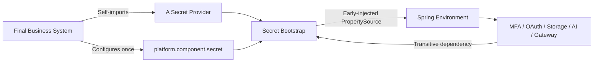

# Atlas Richie Secret Component (atlas-richie-secret)

`atlas-richie-secret` is the Atlas Richie technical platform's unified component for accessing secrets and sensitive configuration. Its goal is to shield the integration differences between Vault, cloud vendor Secret Manager/KMS, OpenBao, KMIP and other products, and to let business components such as MFA, OAuth, Storage, AI, and Gateway integrate transparently through configuration-driven patterns.

> Current status: **The M1 baseline, M2 Provider adaptation packages, M3 OpenBao/Barbican/KMIP/PKCS#11 Providers, transparent integration of business components, runtime two-phase atomic refresh, OAuth dual-version signing window, and MFA new-write bridge have all been landed. No Maven version has been released yet.** This is treated as a brand-new project; no historical MFA data migration is included. Vault 1.21.2's KV v2 + Transit, Token File/AppRole/Agent, Docker Desktop Kubernetes Auth and Storage/Gateway/AI real-service E2E have all passed. OpenBao 2.6.2 Docker KV/Transit E2E and SoftHSM2 PKCS#11 AES Wrap/Unwrap + RSA Sign/Verify E2E have passed. KMIP has completed local TLS/TTLV connectivity validation, but PyKMIP 0.10.0 does not support the AES Key Wrap Padding required by the Provider's current specification, so full Wrap/Unwrap E2E remains blocked. Barbican has no Keystone/Barbican service stack locally, so real E2E awaits environment availability. Real-cloud E2E, real HSM, permission-denial/authentication-renewal/certificate-rotation validations are still pending target-environment verification; the component must not be used in production GA before those validations are complete. Unified business audit events and trusted tenant-context isolation remain target architecture, not current public implementation.

For the complete design background, architecture, lifecycle, SPI, threat model, sequence diagrams, flow diagrams, testing and evolution plan, please refer to [Atlas-Richie-Secret Component Complete Design Document](docs/en/design.md). This document only describes the final usage.

## 📖 Table of Contents

- [🎯 Component Overview](#-component-overview)
    - [What End Users Will Get](#what-end-users-will-get)
    - [Default Off: Zero Migration for Existing Systems](#default-off-zero-migration-for-existing-systems)
- [🏗️ Architecture Design](#️-architecture-design)
    - [How Business Components Auto-Integrate](#how-business-components-auto-integrate)
- [🚀 Quick Start Guide](#-quick-start-guide)
    - [How to Enable](#how-to-enable)
- [📚 API Reference](#-api-reference)
    - [Project Facade API](#project-facade-api)
- [🔧 Core Capabilities](#-core-capabilities)
    - [Refresh and Rotation](#refresh-and-rotation)
    - [Provider Support Plan](#provider-support-plan)
- [⚙️ Configuration](#️-configuration)
    - [Provider Configuration Examples](#provider-configuration-examples)
    - [Configuration Priority](#configuration-priority)
    - [Common Configuration Items](#common-configuration-items)
    - [Multi-Provider Scenarios](#multi-provider-scenarios)
- [📎 🛡️ Rollout, Compatibility and Security Checklist](#-️-rollout-compatibility-and-security-checklist)
    - [Rollout Checklist](#rollout-checklist)
    - [Compatibility and Version Promise](#compatibility-and-version-promise)
- [🔧 Troubleshooting](#-troubleshooting)
    - [FAQ](#faq)
- [📎 📚 Related Documentation](#-📚-related-documentation)
- [📎 ⏱️ Sequence Diagrams](#-⏱️-sequence-diagrams)

## 🎯 Component Overview

### What End Users Will Get

When integrating transparently through configuration, the final business system only needs to complete three things:

1. Add a Provider of their choice in their own `pom.xml`, e.g. Vault, AWS or Aliyun;
2. Configure a set of global `platform.component.secret` parameters, and explicitly set `enabled: true`;
3. Create the required Bundles in the Secret backend.

After that, business components such as MFA, OAuth, Storage, AI, and Gateway that have already integrated Secret Bootstrap will automatically switch their local configuration items declared as sensitive to the values from the Secret backend—without writing per-component Secret clients, listeners, or adapter code.



The right to choose the Provider belongs solely to the final business system:

- Business components do not choose Providers;
- The technical platform does not bind cloud vendors for the business system;
- `atlas-richie-secret-bootstrap` does not package Vault, AWS, Aliyun or other vendor SDKs;
- In a single-Provider scenario, the Provider is auto-discovered from the classpath, without requiring repeated `provider: vault` configuration;
- In a multi-Provider scenario, explicit routing is required.

### Default Off: Zero Migration for Existing Systems

If the final business system has not enabled Secret, all business components continue to use the existing local configuration, environment variables, or configuration-center configuration.

You can either write no Secret configuration at all, or explicitly disable it:

```yaml
platform:
  component:
    secret:
      enabled: false
```

The disabled state must satisfy the following constraints:

- Do not create Secret runtime Beans;
- Do not load Providers;
- Do not initiate network requests;
- Do not create background threads;
- Do not register additional PropertySources;
- Do not change existing property priority and refresh behavior;
- Do not require the final application to introduce any Provider.

Therefore, for systems that have not enabled Secret, this component should behave as if it "does not exist".

## 🏗️ Architecture Design

### How Business Components Auto-Integrate

Final users do not need to configure a Secret switch for every component. Each business component only needs to complete the following conventions at build time:

1. Transitive dependency on the lightweight `atlas-richie-secret-bootstrap`;
2. Carry `META-INF/atlas-richie/secret-bindings.json` in its own JAR;
3. Declare in the Catalog the sensitive configuration paths to be transparently overridden, whether they are required, the scope they belong to, and the refresh strategy;
4. Continue to read attributes via the existing `@ConfigurationProperties`, `Environment` or existing configuration objects.

The expected outcome after enabling:

| Business Component | Typical Items Auto-Managed | Expected Switch Method |
| --- | --- | --- |
| Storage | Object AccessKey/SecretKey, FTP/SFTP/SMB Password | Pre-build all candidate clients then atomic switch; old clients wait for in-flight requests to drain before destruction |
| AI | Various model API Key/Key Pool, Secret ID/Key, App Code | Chat, multimodal, Key Pool, and STS signer switch as an immutable generation |
| Gateway | Interface authentication signing key | Atomically replace authentication Secret; ECC private keys are not managed as strings |
| OAuth | Token Secret, Introspection Client Secret | HMAC supports automatic dual-version verification; during RSA/OIDC rotation, JWKS publishes both current and previous public keys |
| MFA | TOTP data encryption KEK | Generate `arse:v1` envelopes via minimal facade; KEK is not exported |

Sensitive configuration transparent injection applies to exportable strings, bytes, or structured Secrets. Capabilities such as non-exportable private keys in cloud KMS, MAC keys, and data-key generation must be invoked via the runtime Crypto API and will not be masqueraded as ordinary configuration properties.

## 🚀 Quick Start Guide

### How to Enable

#### Step 1: Choose a Provider

The final business system selects a Provider based on its deployment environment. All Provider coordinates have been landed in the source repository but not yet released; Provider dependencies can still only be selected by the final business system.

##### HashiCorp Vault

```xml
<dependency>
    <groupId>cn.richie696.component</groupId>
    <artifactId>atlas-richie-secret-provider-vault</artifactId>
</dependency>
```

##### AWS Secrets Manager / KMS

```xml
<dependency>
    <groupId>cn.richie696.component</groupId>
    <artifactId>atlas-richie-secret-provider-aws</artifactId>
</dependency>
```

##### Aliyun KMS / Secrets Manager

```xml
<dependency>
    <groupId>cn.richie696.component</groupId>
    <artifactId>atlas-richie-secret-provider-aliyun</artifactId>
</dependency>
```

##### M2 Cloud Providers

M2 Providers are likewise chosen on demand by the final business system: `atlas-richie-secret-provider-azure`, `-gcp`, `-tencent`, `-huawei`, `-volcengine`, `-oci`, `-ibm-key-protect`, or `-baidu`.

These packages currently share a strict JSON Provider Transport, and provide a `wire` profile to declare paths and response fields from the vendor's official REST documentation as configuration: read, wrap, and unwrap support `{path}`, `{key}`, `{version}`, `{region}`, `{projectId}`, `{tenantId}`, `{namespace}`, `{apiVersion}` templates, and disallow plaintext or Base64 pseudo-encryption fallback. The official request signatures of Huawei Cloud, Tencent Cloud, Volcano Engine, and Baidu Cloud have been aggregated into the Transport; GCP/Azure/OCI/IBM use short-term Bearer Tokens or Token Files, with Token exchange handled by the workload identity Agent. Real-cloud E2E validations will be performed one-by-one once accounts and test tenants are available; until validated, the providers are not marked as production GA.

Example (Azure; other M2 Providers only need to replace the prefix and Maven artifact):

```yaml
platform:
  component:
    secret:
      enabled: true
      property-source:
        application: ${spring.application.name}
        environment: production
        paths: [common, components]
      azure:
        endpoint: https://secret-adapter.example.internal
        authentication:
          type: bearer-token
          token: ${AZURE_SECRET_ADAPTER_TOKEN}
        secrets:
          database-password:
            path: applications/order-service/database
            field: password
        key-bindings:
          default-envelope: order-service-envelope
        # Override paths/response fields according to the vendor's official REST documentation; default values follow the unified contract
        wire:
          secret-path: /secrets/{path}
          wrap-path: /keys/{key}/wrap
          unwrap-path: /keys/{key}/unwrap
          secret-value-field: value
          wrapped-key-field: wrappedKey
          plaintext-field: plaintext
```

Business components themselves only depend on the lightweight Bootstrap, and must not pass any of the above Providers to the final application.

##### M3 Self-Hosted and Standard Protocol Providers

M3 Providers are likewise introduced by the final business system:

```xml
<dependency><groupId>cn.richie696.component</groupId><artifactId>atlas-richie-secret-provider-openbao</artifactId></dependency>
<dependency><groupId>cn.richie696.component</groupId><artifactId>atlas-richie-secret-provider-barbican</artifactId></dependency>
<dependency><groupId>cn.richie696.component</groupId><artifactId>atlas-richie-secret-provider-kmip</artifactId></dependency>
<dependency><groupId>cn.richie696.component</groupId><artifactId>atlas-richie-secret-provider-pkcs11</artifactId></dependency>
```

The four packages have different implementation boundaries: OpenBao independently uses KV v2/Transit HTTP API; Barbican only declares Secret/Metadata read capabilities; KMIP uses KMIP 2.1 TTLV Encrypt/Decrypt (AES Key Wrap Padding) over TLS; PKCS#11 uses JDK `SunPKCS11` and AES Wrap/Unwrap as well as `SIGN`/`VERIFY` on HSM Tokens. KMIP, PKCS#11, and KMS-only Providers such as IBM/Baidu do not register `SecretBackend`, and will not masquerade key objects as ordinary configuration Secrets. All four Providers ship E2E tests gated by explicit environment variables; tests will skip when the corresponding service, certificates, or HSM is not available, and will not fake a pass.

OpenBao example:

```yaml
platform:
  component:
    secret:
      enabled: true
      openbao:
        endpoint: https://openbao.example.internal
        tls:
          trust-store: /etc/atlas/openbao-truststore.p12
          trust-store-password: ${OPENBAO_TRUSTSTORE_PASSWORD}
        proxy:
          host: egress-proxy.internal
          port: 8443
        authentication:
          type: token-file
          token-file: /var/run/secrets/openbao/token
        kv:
          mount: secret
          runtime-prefix: runtime
        transit:
          mount: transit
          key-bindings:
            mfa.totp.data-key: atlas-mfa
```

#### Step 2: Configure Global Secret Parameters

The minimal common configuration is as follows:

```yaml
platform:
  component:
    secret:
      enabled: true
      strict-mode: true
      property-source:
        application: ${spring.application.name}
        environment: production
        paths: [common, components]
        missing-policy: fail
        local-fallback: false
      refresh:
        enabled: true
        initial-delay: 1m
        interval: 1m
```

It is recommended to obtain access identity through workload identity, instance role, Kubernetes ServiceAccount, or local Agent. Do not write back the long-term AccessKey, Token, or password used to read the Secret backend into the same plaintext configuration file.

#### Step 3: Create Secret Bundles in the Secret Backend

Recommended path model:

```text
atlas-richie/{environment}/{application}/{scope}
```

For example:

```text
atlas-richie/production/order-service/common
atlas-richie/production/order-service/components
atlas-richie/production/order-service/blue
```

Keys in the Bundle continue to use the existing Spring configuration paths, so business components do not need to switch to a new value-fetching API:

```yaml
# Logical content in the Secret backend, NOT in application.yml
platform.component.storage.object.access-key-id: "..."
platform.component.storage.object.access-key-secret: "..."
platform.component.ai.chat.openai.api-keys[0]: "..."
platform.gateway.security.authentication.secret-key: "..."
platform.component.oauth.token-secret: "..."
```

MFA's `mfa.totp.data-key` is a native logical Key and does not enter the Bundle; it is mapped to a Vault Transit Key, AWS KMS Key ARN/Alias, or Aliyun KMS Key ID through the selected Provider's `key-bindings`.

The component only imports sensitive attributes explicitly declared by the Binding Catalog. Ordinary business configuration will not be wholly managed just because Secret is enabled.

The whitelist currently landed in stage 3 is as follows; attributes outside this table will be discarded even if they appear in the Bundle:

| Component | Integrated Attribute / Logical Key |
| --- | --- |
| Storage | `object.access-key-id/access-key-secret`, `ftp/sftp/smb3.password` |
| AI | Supported API Key, Key Pool, Secret ID/Key, Access Key, App Code under `chat/rerank/image/image-embedding/tts/stt/voice-chat.{name}` |
| OAuth | `platform.component.oauth.token-secret`, `platform.oauth.resource-server.introspection-client-secret` |
| Gateway | `platform.gateway.security.authentication.secret-key` |
| MFA | Native logical Key `mfa.totp.data-key`; does not enter Spring PropertySource |

For AI, `{name}` only matches a normalized kebab-case attribute segment, and `{index}` in `api-keys[{index}]` can only be a number; `*`, cross-level matching, or arbitrary regular expressions are not supported.

### MFA Historical Secret Migration

`atlas-richie-mfa-management` provides `MfaSecretMigrationService`, which reads old `mfa/{tenant}/{user}` references batch-by-batch and writes them back to the enabled Secret Provider, only writing back `mfa_user_info.secret_reference`. The API returns only scan/success/failure counts, never plaintext or complete Secret paths:

```java
MfaSecretMigrationService.MigrationResult result =
        migrationService.migrateBatch(200, true); // dry-run first
```

First use `dryRun=true` to validate the read permission for the old Provider, then execute with `false` in small batches until `mayHaveMore=false`. Records that fail migration will not update the database and can be safely retried; the actual historical execution is still an operations change, which must be performed only after backup, dual-person review, and target Provider E2E are all complete.

## 📚 API Reference

### Project Facade API

Transparent property override cannot replace all secret-usage scenarios. The following scenarios should invoke the unified runtime API:

- Fetch dynamic database credentials or short-term leases;
- Generate data keys and perform envelope encryption;
- Use non-exportable keys in cloud KMS for signing, verification, encryption, decryption or MAC;
- Write, update, rotate or revoke application-managed Secrets;
- Read tenant-level, user-level, or request-level Secrets;
- Obtain version, lease, expiration time, and rotation metadata.

Ordinary projects only need to inject a `SecretOperations` facade:

```java
private final SecretOperations secrets;

String result = secrets.read(
        "storage.object.credential",
        credential -> invokeStorage(credential));

String encrypted = secrets.encrypt("mfa.totp.data-key", plaintextBytes);

SignatureValue signature = secrets.sign("oauth.signing", payloadBytes);
boolean valid = secrets.verify("oauth.signing", payloadBytes, signature);

VerificationResult verification = secrets.decrypt(
        encrypted,
        plaintext -> verifyTotp(plaintext));
```

Project code only passes the changing logical Secret/Key names and business data. Provider ID, physical path, KMS Key ARN, Vault Mount, version routing, AAD, Wrapped DEK, algorithm, Envelope codec, and temporary plaintext zeroization are all encapsulated inside the component. After the `read/decrypt` callback returns, the component immediately zeroes out the temporary array passed in.

`SignatureValue` is a non-parseable signature value object. Business code must not disassemble or rewrite its contents; the Key Version, signature format, and algorithm context required by Vault Transit, cloud KMS, or HSM are preserved by the Provider inside the signature value. Private keys never enter application memory. When the selected Provider has not declared `SIGN` and `VERIFY`, the call fails fast and will not fall back to a local private key or plaintext configuration.

If the business system only needs signing capability, you can also inject `SigningService`; ordinary business code should prefer `SecretOperations` to maintain a single facade. `SigningBackend`, `KeyReference`, `CryptoContext`, and Provider Session belong to the extension SPI and should not be created directly by business systems.

Version metadata queries, Rewrap, and management operations are not included in the default facade; they are handled by the rotation workflow or dedicated management interfaces. `SecretResolver`, `SecretValue`, `CryptoContext`, `EnvelopeCrypto`, `KeyWrappingBackend`, `CipherEnvelope`, and Provider SPI belong to the Core/Provider extension surface and should not be injected directly by ordinary business projects. The principle is: **what's externally variable (configuration file or code invocation) is provided externally; what is invariant stays encapsulated in the component.**

## 🔧 Core Capabilities

### Refresh and Rotation

After global Secret is enabled, runtime refresh is enabled by default; it can be turned off separately via `refresh.enabled: false`. Each polling cycle reads the complete Bundle, rather than patching field-by-field:

```mermaid
flowchart LR
    P[Provider event or polling] --> F[Read new version]
    F --> V[Integrity and version check]
    V --> S[Provisionally install candidate PropertySource]
    S --> C[All participants pre-build candidate generation]
    C --> A[Sequential commit into atomic reference]
    A --> D[Drain and release old generation]
    D --> O[Publish version event with no Secret values]
```



Key constraints:

- Refresh operates at the granularity of complete versions; no half-updated state is exposed field-by-field;
- When any participant's pre-check or commit fails, the PropertySource and already-committed components are rolled back in reverse order, and the Last Good Snapshot continues to be used;
- Storage atomically switches proxy references only after all Provider clients have been pre-built successfully; old clients wait for in-flight calls in stable proxies to exit before being released;
- AI atomically replaces the Chat/multimodal model snapshot, builds Key Pools in isolation, and simultaneously replaces the STS signer generation;
- Gateway only replaces the authentication Secret, and does not mix ordinary configuration like algorithms or security modes into Secret refresh;
- OAuth HMAC new signatures only use the current version; verification accepts the previous version within the `signing-key-verification-window`; for RSA Access Token and OIDC ID Token, JWKS publishes both `kid`s during the same window;
- Logs, exceptions, metrics, and audit events only record names, versions, Providers, durations and results, never values;
- OAuth signing keys, MFA data encryption keys, etc., which cannot be simply overridden, must use versioned rotation protocols;
- Startup-required Secrets and runtime-refreshable Secrets should define separate failure strategies.

### Provider Support Plan

| Priority | Provider | Current Status | Target Capability |
| --- | --- | --- | --- |
| P0 | HashiCorp Vault | KV v2, Transit Wrap/Unwrap/Sign/Verify implemented; real local-signing E2E requires creating RSA/ECDSA Transit Keys for verification | KV v2, Transit, Kubernetes/Token File/AppRole/JWT/Auth Agent; cloud and JWT trust-root E2E verified separately |
| P0 | AWS | Secrets Manager/KMS Wrap/Unwrap/Sign/Verify implemented; real cloud E2E pending | Secrets Manager, KMS, default credential chain, Profile, role identity |
| P0 | Aliyun | Baseline implemented; real cloud E2E pending | KMS Secret Manager, KMS, default credential chain, RAM Role/workload identity |
| P1 | Azure | M2 adaptation package landed; real cloud E2E pending | Key Vault Secrets/Keys, Managed Identity |
| P1 | Google Cloud | M2 adaptation package landed; real cloud E2E pending | Secret Manager, Cloud KMS, Workload Identity |
| P1 | Tencent Cloud | M2 adaptation package landed; real cloud E2E pending | SSM, KMS, role identity |
| P1 | Huawei Cloud | M2 adaptation package landed; real cloud E2E pending | CSMS, KMS, agency or temporary credentials |
| P1 | Volcano Engine | M2 adaptation package landed; real cloud E2E pending | KMS, key hosting service, instance role |
| P1 | OCI Vault | M2 adaptation package landed; real cloud E2E pending | Vault Secrets, Vault KMS |
| P1 | IBM Key Protect | M2 adaptation package landed; real cloud E2E pending | KMS Wrap/Unwrap; Secret Store integration separately |
| P1 | Baidu Cloud KMS | M2 adaptation package landed; real cloud E2E pending | KMS Wrap/Unwrap |
| P1 | OpenBao | M3 KV/Transit Wrap/Unwrap/Sign/Verify passed OpenBao 2.6.2 Docker local E2E | KV v2, Transit, Token/Token File |
| P2 | KMIP 2.1 | TLS/TTLV passed PyKMIP local connectivity gate; AES Key Wrap Padding not passed due to server capability | Encrypt/Decrypt as Wrap/Unwrap, certificate authentication |
| P2 | PKCS#11 HSM | SoftHSM2 local E2E passed; real hardware HSM not yet verified | HSM Token AES Wrap/Unwrap, non-exportable private-key Sign/Verify |
| P2 | OpenStack Barbican | Provider implemented; locally no Keystone/Barbican service stack, real E2E awaits environment | Secret payload, Metadata, Token |

Whether a Provider is available must be based on the corresponding version's release notes, compatibility matrix, and test reports.

### Vendor Signature and Workload Identity Compatibility Matrix

The table below shows the current code-level compatibility boundaries. `Implemented` means Contract Test and configuration validation are already in place; `Pending environment verification` means target vendor accounts, identity injectors, or middleware instances are still required, and production compatibility cannot be claimed based solely on compilation results.

| Provider | Workload Identity / Credential Entry | Request Signature | TLS/Proxy | Current Verification Status |
| --- | --- | --- | --- | --- |
| AWS | SDK default credential chain, EKS/ECS/EC2 role | AWS SDK native signature | SDK/HTTPS; real proxy matrix pending verification | Contract passed; real cloud pending verification |
| Aliyun | SDK default credential chain, RAM Role/ACK/ECS identity | SDK native signature | SDK/HTTPS; real proxy matrix pending verification | Contract passed; real cloud pending verification |
| Azure | Bearer, Token File, Managed Identity Agent | No generic HMAC enabled | TrustStore/Proxy | Wire/Contract passed; real cloud pending verification |
| GCP | Bearer, Token File, Workload Identity Agent | No generic HMAC enabled | TrustStore/Proxy | Wire/Contract passed; real cloud pending verification |
| OCI | Bearer, Token File, Instance/Resource Principal Agent | No generic HMAC enabled | TrustStore/Proxy | Wire/Contract passed; real cloud pending verification |
| IBM Key Protect | Bearer, Token File | No generic HMAC enabled | TrustStore/Proxy | Wire/Contract passed; real cloud pending verification |
| Tencent Cloud | AccessKey, Token File/identity Agent | TC3-HMAC-SHA256 | TrustStore/Proxy | Signature Contract passed; real cloud pending verification |
| Huawei Cloud | AccessKey, Token File/Agency Agent | SDK-HMAC-SHA256 | TrustStore/Proxy | Signature Contract passed; real cloud pending verification |
| Volcano Engine | AccessKey, Token File/identity Agent | HMAC-SHA256, KMS Encrypt/Decrypt | TrustStore/Proxy | Wire/signature Contract passed; real cloud pending verification |
| Baidu Cloud KMS | AccessKey, Token File/identity Agent | BCE v2 | TrustStore/Proxy | Signature Contract passed; real cloud pending verification |
| OpenBao | Token, Token File | No vendor HMAC enabled | TrustStore/Proxy; Kubernetes/JWT/AppRole exchanged to Token by Agent | OpenBao 2.6.2 Docker E2E passed |
| Barbican | Bearer, Token File | No vendor HMAC enabled | TrustStore/Proxy | Protocol gate passed; local service stack missing |
| KMIP 2.1 | mTLS client certificate | KMIP TTLV, no HTTP HMAC | mTLS; proxy provided by deployment network | Local TLS/TTLV connected; PyKMIP does not support AES KWP |
| PKCS#11 HSM | Local Token/PIN, numeric slot | HSM/JCA Sign/Verify | Does not use HTTP proxy | SoftHSM2 E2E passed; real HSM pending verification |

### Local Verifiability Record

| Provider | Local Dependency | Result | Notes |
| --- | --- | --- | --- |
| OpenBao | Docker `openbao/openbao:latest` (2.6.2) | Passed | KV v2 read/write, Transit RSA sign/verify; `OpenBaoIntegrationTest` 1/1 |
| PKCS#11 | SoftHSM2 2.7.0 + JDK SunPKCS11 | Passed | AES wrap/unwrap, RSA sign/verify; `Pkcs11IntegrationTest` 1/1; not equivalent to real HSM |
| KMIP | PyKMIP 0.10.0 + TLS mutual material | Partial | TLS handshake, KMIP 2.0 TTLV request/response verified; PyKMIP's crypto engine does not support AES Key Wrap Padding, complete wrap-loop not passed |
| Barbican | No local Keystone/Barbican service stack | Not tested | Provider unit/configuration tests runnable; real REST/Token E2E requires OpenStack environment |

Workload identity files only carry short-term tokens; the Secret component does not perform token exchange for cloud platforms, nor does it write long-term AK/SK back to configuration. Specific identity Agents, ServiceAccounts, instance roles, and certificate rotation must be verified in the target deployment environment according to vendor documentation.

`No Plaintext Fallback` applies to managed business Secrets and encryption keys: a provider failure never reactivates local business plaintext. AWS/Aliyun bootstrap identity is a separate trust boundary and follows the vendor SDK credential chain. Environment-variable AK/SK remains technically reachable through that chain for local development or controlled emergency use, but production must prefer workload/instance roles and enforce the allowed credential sources through deployment policy; the component never copies those credentials into business Properties.

## ⚙️ Configuration

### Provider Configuration Examples

Different Providers only provide connection, identity, region, and product-specific parameters; common behavior is always controlled by `platform.component.secret`.

The default wire profile of M2 Providers has been aggregated inside the component: GCP uses separate Secret Manager and Cloud KMS endpoints, `projects/{project}/secrets/{secret}/versions/{version}:access`, and the Base64 payload at `payload.data`; OCI uses `secretBundle`; Azure uses Key Vault `secrets`/`wrapkey`, `RSA-OAEP-256`, and Base64URL; IBM Key Protect uses `/api/v2/keys/{id}/actions/{wrap,unwrap}`. Volcano Engine uses the official KMS `Encrypt`/`Decrypt` actions, operation-specific `Plaintext`/`CiphertextBlob` fields, and `EncryptionContext`; it declares only `KEY_WRAP/KEY_UNWRAP`, so Secret reads must be routed to another Provider. Tencent Cloud, Huawei Cloud, and Baidu Cloud also provide default official resource paths, request fields, and operation-specific Action/API Version values. If the corporate gateway or vendor API version differs, paths and response fields can be overridden through `wire.*`. The component does not write access keys to logs, nor does it fall back to plaintext or fake values when HTTP fails.

Cloud vendor authentication tokens, workload identity exchange, and request signatures must be configured according to the corresponding official documentation. Currently the generic REST transport supports `BEARER_TOKEN`, `TOKEN_FILE`, `WORKLOAD_IDENTITY_TOKEN_FILE`, `ACCESS_KEY`, and `NONE`. When using `ACCESS_KEY`, Huawei Cloud, Tencent Cloud, Volcano Engine, and Baidu Cloud automatically select the corresponding HMAC signature protocol, which can also be explicitly overridden via `authentication.signature`; the short-term JWT in the workload identity file is only used as a Bearer Token, with Token exchange handled by the cloud platform Agent or identity injector. AWS and Aliyun's native SDK Providers continue to use their respective default credential chains.

Tencent SSM and KMS use different service endpoints and signing scopes. Operation-specific Action, API Version, and `ssm`/`kms` signing service values are internal wire-profile details and do not need to be repeated by applications:

```yaml
platform.component.secret.tencent:
  secret-endpoint: https://ssm.tencentcloudapi.com
  kms-endpoint: https://kms.tencentcloudapi.com
  region: ap-guangzhou
  authentication:
    type: access-key
    access-key-id: ${TENCENT_SECRET_ID}
    access-key-secret: ${TENCENT_SECRET_KEY}
    signature: tencent-tc3-hmac-sha256
```

When Secret Store and KMS genuinely share one service entry point, or an enterprise reverse proxy consolidates both behind one origin, the compatibility field `endpoint` remains sufficient. Otherwise configure `secret-endpoint` and `kms-endpoint` separately. Azure `key-bindings` must use `<key-name>/<key-version>` so versioned `wrapkey`/`unwrapkey` calls cannot silently select an unintended version.

AWS KMS and PKCS#11 signing rotation use a “current signing key plus historical verification keys” model. Historical keys verify existing data only and are never used for new signatures; retain them for at least the longest business token/signature validity period:

```yaml
platform.component.secret.aws.kms:
  key-bindings:
    oauth-signing: arn:aws:kms:ap-southeast-1:123456789012:key/current
  verification-key-bindings:
    oauth-signing:
      - arn:aws:kms:ap-southeast-1:123456789012:key/previous

platform.component.secret.pkcs11:
  key-bindings:
    oauth-signing: oauth-signing-v2
  verification-key-bindings:
    oauth-signing: [oauth-signing-v1]
```

Generic REST Provider TLS and proxy configuration:

```yaml
platform.component.secret.gcp:
  tls:
    trust-store: /etc/atlas/provider-truststore.p12
    trust-store-password: ${PROVIDER_TRUSTSTORE_PASSWORD}
    key-store: /etc/atlas/provider-client.p12
    key-store-password: ${PROVIDER_CLIENT_PASSWORD}
  proxy:
    host: egress-proxy.internal
    port: 8443
    username: ${PROXY_USERNAME}
    password: ${PROXY_PASSWORD}
```

Without real accounts, signature Contracts, TLS/proxy configuration validation, and HTTP facade failure matrices can still run; real cloud E2E will be skipped via explicit environment variable gates.

#### Vault

```yaml
platform:
  component:
    secret:
      enabled: true
      strict-mode: true
      property-source:
        application: ${spring.application.name}
        environment: production
        paths: [common, components]
        missing-policy: fail
        local-fallback: false
      vault:
        endpoint: https://vault.example.internal
        namespace: atlas
        authentication:
          type: kubernetes
          role: order-service
          kubernetes-path: kubernetes
          service-account-token-file: /var/run/secrets/kubernetes.io/serviceaccount/token
        kv:
          mount: secret
          runtime-prefix: runtime
        transit:
          mount: transit
          key-bindings:
            default-envelope: order-service-envelope
            mfa.totp.data-key: order-service-mfa-totp
            oauth.signing: order-service-oauth-signing
        secrets:
          database-password:
            path: applications/order-service/database
            field: password
```

The caller only uses `default-envelope` and `database-password`; `order-service-envelope`, the KV path, and the field will not enter the project facade API. When `secrets` mapping is not explicitly configured, the logical Secret `name` is internally mapped to:

```text
atlas-richie/{environment}/{application}/{runtime-prefix}/{name}
```

The Vault Provider currently supports the following authentication types:

| `authentication.type` | Purpose | Required Configuration |
| --- | --- | --- |
| `kubernetes` | Kubernetes workload identity, default recommended | `role`, optional override of auth path and ServiceAccount Token file |
| `token-file` | Vault Agent Sink or platform-injected rotating Token file | `token-file` |
| `agent` | Application only connects to the local Vault Agent proxy; Agent handles authentication | No Token; `endpoint` points to Agent Listener |
| `approle` | Machine identity for non-Kubernetes workloads | `role-id` or `role-id-file`, and `secret-id` or `secret-id-file` |
| `jwt` | OIDC/JWT workload identity | `jwt-role` and `jwt` or `jwt-file`, optional override of `jwt-path` |
| `token` | Local development and controlled testing | `token`; not recommended for production |

Custom JVM TrustStore:

```yaml
platform:
  component:
    secret:
      vault:
        tls:
          trust-store: /etc/atlas/vault-truststore.p12
          trust-store-password: ${VAULT_TRUSTSTORE_PASSWORD}
```

Connection and read timeouts, as well as max attempts, reuse the common configuration:

```yaml
platform.component.secret.resilience:
  connect-timeout: 3s
  read-timeout: 5s
  max-attempts: 3
```

Bounded retries are only performed on network errors, HTTP 429, and 5xx; permanent errors like authentication failure, permission denial, or path-not-found will not be retried.

#### Vault Minimum Permission Example

The following policy only demonstrates the minimum runtime permissions for reading the Bundle, reading a runtime Secret, and using a Transit Key. Mount points, application paths, and Key names must be replaced according to the actual configuration:

```hcl
path "secret/data/atlas-richie/production/order-service/*" {
  capabilities = ["read"]
}

path "secret/data/applications/order-service/database" {
  capabilities = ["read"]
}

path "transit/encrypt/order-service-envelope" {
  capabilities = ["update"]
}

path "transit/decrypt/order-service-envelope" {
  capabilities = ["update"]
}

path "transit/sign/order-service-signing" {
  capabilities = ["update"]
}

path "transit/verify/order-service-signing" {
  capabilities = ["update"]
}
```

The runtime identity does not need `sys/mounts`, Transit Key creation/rotation, KV write or delete permissions. Keys and auth roles must be pre-created by a separate management process, and the Provider will not create resources beyond its permission at application startup.

OpenBao's `secret` and `transit` mounts are interoperability defaults, not tenant-isolation boundaries. A production multi-application or multi-tenant deployment must configure dedicated mounts/namespaces or constrain the token policy to the application's exact path prefix. Barbican `project-id` may be omitted only when the Keystone token is already project-scoped; otherwise it must be configured explicitly. Both cases require a negative cross-project/cross-tenant authorization test before production.

#### AWS

```yaml
platform:
  component:
    secret:
      enabled: true
      strict-mode: true
      property-source:
        application: ${spring.application.name}
        environment: production
        paths: [common, components]
        missing-policy: fail
        local-fallback: false
      aws:
        region: ap-southeast-1
        authentication:
          type: default-chain
        secrets-manager:
          path-prefix: company
        kms:
          key-bindings:
            default-envelope: alias/order-service
            mfa.totp.data-key: alias/order-service-mfa-totp
            oauth.signing: alias/order-service-oauth-signing
          signing-algorithm: RSASSA_PSS_SHA_256
```

In EKS/ECS/EC2, the corresponding workload or instance role should be preferred, without filling in static AccessKeys in configuration files.

#### Aliyun

```yaml
platform:
  component:
    secret:
      enabled: true
      strict-mode: true
      property-source:
        application: ${spring.application.name}
        environment: production
        paths: [common, components]
        missing-policy: fail
        local-fallback: false
      aliyun:
        region: cn-hangzhou
        secrets-manager:
          path-prefix: company
        kms:
          key-bindings:
            default-envelope: alias/order-service
            mfa.totp.data-key: alias/order-service-mfa-totp
```

The Aliyun Provider is fixed to use the official default credential chain and does not provide an entry to fill in AccessKey in Properties. In ACK, ECS, and other environments, RAM Role or workload identity should be preferred; a dedicated KMS gateway must additionally configure HTTPS `endpoint` and `ca-file`.

`secrets-manager.path-prefix` is an optional organization-level physical prefix. When configured as `company`, the full Bundle name is `company/atlas-richie/{environment}/{application}/{scope}`; when not configured, the unified logical path is used directly.

### Configuration Priority

After enabling, sensitive attributes use the following priority:

```text
Secret PropertySource
    > Command-line arguments
    > System properties
    > Environment variables
    > Configuration center / application.yml
    > Component defaults
```

This priority only applies to sensitive attributes declared by the Binding Catalog.

Behavioral conventions:

- `enabled=false`: no Secret PropertySource exists, fully following Spring's original priority;
- `enabled=true` and Secret exists: Secret value overrides same-named local value;
- `enabled=true`, `strict-mode=true`, and required Secret missing: startup fails;
- Silent degradation to local plaintext due to remote unavailability or missing Secret is not allowed;
- On runtime refresh failure, only the loaded, verified, and still-valid in-memory Last Good Snapshot may continue to be used; after application restart, the Provider must be re-accessed.

### Common Configuration Items

| Configuration Item | Default | Description |
| --- | --- | --- |
| `platform.component.secret.enabled` | `false` | Master Secret switch; only `true` enables it |
| `platform.component.secret.strict-mode` | `true` | Whether required Secret missing, Provider ambiguity, etc. should fail closed |
| `platform.component.secret.active-provider` | None | Specifies the default Provider in multi-Provider scenarios; not needed for single Provider |
| `platform.component.secret.property-source.application` | `${spring.application.name}` | Current application logical name |
| `platform.component.secret.property-source.environment` | `dev` | Environment namespace, e.g. `production` |
| `platform.component.secret.property-source.paths` | `common,components` | Bundle scopes loaded in order |
| `platform.component.secret.property-source.missing-policy` | `fail` | Missing policy for required Secrets at startup |
| `platform.component.secret.property-source.local-fallback` | `false` | Whether local value fallback is allowed; production must remain disabled |
| `platform.component.secret.refresh.enabled` | `true` | Whether to start complete Bundle polling when Secret is enabled; no thread created when global `enabled=false` |
| `platform.component.secret.refresh.initial-delay` | `1m` | Wait time before the first polling after application startup; must be positive |
| `platform.component.secret.refresh.interval` | `1m` | Fixed delay between two complete refreshes; must be positive |
| `platform.component.oauth.signing-key-verification-window` | `2h` | Window after OAuth signing rotation during which the previous version continues to verify / JWKS publishes; should be no less than the longest Access/ID Token TTL |
| `platform.component.secret.resilience.connect-timeout` | `3s` | Provider connection timeout |
| `platform.component.secret.resilience.read-timeout` | `5s` | Provider per-read timeout |
| `platform.component.secret.resilience.max-attempts` | `3` | Maximum attempts for network errors, 429, 5xx |
| `platform.component.secret.envelope.format` | `arse` | Envelope ciphertext format identifier |

Provider-specific configurations are located at:

```text
platform.component.secret.vault.*
platform.component.secret.aws.*
platform.component.secret.aliyun.*
platform.component.secret.azure.*
platform.component.secret.gcp.*
...
```

M2 adaptation packages uniformly support `endpoint` (same-origin compatibility entry), `secret-endpoint`, `kms-endpoint`, `authentication`, `secrets`, `key-bindings`, `wire`, `tls`, and `proxy`; `authentication.type` can be `none`, `bearer-token`, `token-file`, `workload-identity-token-file`, `access-key`, and credentials are validated for completeness at startup. Endpoints enforce HTTPS; only loopback local contract tests allow HTTP. `wire` only describes the vendor's official REST paths and fields, and does not disguise ciphertext as plaintext, nor does it record credentials in configuration. IBM Key Protect, Volcano Engine, and Baidu Cloud currently only declare `KEY_WRAP/KEY_UNWRAP`, and will not masquerade as a Secret Store; Huawei, Tencent, Volcano Engine, and Baidu Cloud signature protocols have been implemented; real identity chains for Azure, GCP, OCI, IBM, and real E2E for all Providers still need target account verification before entering the GA compatibility matrix.

M3 specific fields are: OpenBao `kv`/`transit`/`namespace`; Barbican `project-id` and Secret UUID mapping; KMIP `kmips` endpoint, trust-store/client keystore, and unique identifier mapping; PKCS#11 `library`, numeric `slot`, `pin`, `signing-algorithm` and HSM key alias. SunPKCS11 has no portable token-label selector, so `token-label` is rejected at startup instead of being silently ignored. PIN, Token, and certificate passwords can only be injected through controlled environment variables, files, or external configuration, and must not be written to Git.

The Vault Provider has generated Spring Configuration Metadata for `platform.component.secret.vault.*`, enabling IDE auto-completion for single-Provider configuration items. The named Provider's `providers.<id>.*` belongs to advanced multi-Provider configuration; the IDE cannot predict dynamic `<id>`, but the field structure is consistent with the single-Provider Vault configuration.

### Multi-Provider Scenarios

The vast majority of business systems should introduce only one Provider. When hybrid cloud, migration period, or capability split requirements truly exist, multiple Providers can be introduced simultaneously, but the selection ambiguity must be eliminated.

```yaml
platform:
  component:
    secret:
      enabled: true
      active-provider: vault-primary
      providers:
        vault-primary:
          type: vault
          endpoint: https://vault.example.internal
          authentication:
            type: kubernetes
            role: order-service
        aws-kms:
          type: aws
          region: ap-southeast-1
          authentication:
            type: default-chain
      routing:
        property-source: vault-primary
        secret-read: vault-primary
        envelope-crypto: aws-kms
        signing: aws-kms
```

Routing assigns Providers by capability; capabilities not explicitly routed fall back to `active-provider`. If multiple Providers exist on the classpath, but neither a default Provider nor complete capability routing is configured, the application must fail to start; random selection is not allowed.

## 📎 🛡️ Rollout, Compatibility and Security Checklist

### Rollout Checklist

#### Application Development

- Only introduce the chosen Provider in the final business system;
- Confirm that only one default Provider exists, or that complete multi-Provider routing is configured;
- Confirm that all required sensitive attributes are declared by the component's Binding Catalog;
- Remove unneeded local plaintext, but keep ordinary configuration unrelated to Secrets;
- For non-exportable keys, use the Crypto API and do not attempt to inject the plaintext private key;
- For refreshable credentials, confirm that the client can atomically replace or re-authenticate.

#### Platform Operations

- Use the minimum-permission workload identity;
- Separate read, write, rotation, and management policies;
- Configure TLS validation, private network access, and outbound network policies;
- Set alerts for Provider timeout, throttling, authentication failure, version rollback, and lease expiration;
- Confirm that log platforms and Actuator output do not expose sensitive values;
- Drill Provider short-term unavailability, regional failure, identity expiration, and erroneous rotation;
- Clarify the responsibility boundaries for recovery keys, snapshot keys, and business KMS keys.

#### Security Audit

- Verify authorization paths for each application, environment, and tenant;
- Verify that production identities cannot read test or other application paths;
- Verify that audit events do not contain secret values, full ciphertext, or authentication tokens;
- Verify that management endpoints are not exposed via the public network;
- Verify that Secret deletion, rotation, and policy changes have dual-person review and traceable records.

### Compatibility and Version Promise

After the formal implementation is released, the following promises should be followed:

- New optional configuration, capabilities, and Providers are backward-compatible changes;
- Removing configuration, changing the default failure strategy, or modifying Binding semantics are breaking changes;
- Provider SDK upgrades must pass the Provider's Contract Test and real-service integration test;
- Binding Catalog requires an independent Schema version;
- Ciphertext format, Key Reference, and audit event format must all be versioned;
- Design documents, README, configuration metadata, and actual code must remain consistent in the same version.

## 🔧 Troubleshooting

### FAQ

#### Do business components need to introduce Vault/AWS/Aliyun Provider themselves?

No, and business components are not allowed to decide. Providers are only introduced by the final business system.

#### What happens if the final business system does not introduce a Provider?

- `enabled=false`: starts normally, continuing to use the existing implementation;
- `enabled=true`: startup fails, with a clear indication that no Provider was found.

#### What happens if two Providers are introduced but `active-provider` is not configured?

If complete and unambiguous routing is not present, startup fails. The component must not randomly select based on class-loading order.

#### When the Secret backend is unavailable, will it automatically fall back to the old password in application.yml?

No. After Secret is enabled, silently falling back to local plaintext would mask the failure and use potentially revoked credentials. When runtime refresh fails, the loaded, verified, and still-valid in-memory Last Good Snapshot may continue to be used within policy boundaries; it cannot be persisted as a disk plaintext cache, and the Provider must still be re-accessed after application restart.

#### Should I migrate all configuration to the Secret backend?

No. Only migrate sensitive content such as passwords, Tokens, API Keys, access credentials, signing and encryption keys. Ordinary configuration like ports, thread counts, and feature switches should still be placed in the existing configuration system.

#### Can I use placeholders like `${secret:...}`?

The main path of transparent integration does not require modifying existing configuration keys. The goal is to let existing `@ConfigurationProperties` obtain values from the Secret PropertySource. Explicit reference syntax can serve as an advanced capability, but cannot become a prerequisite for business component integration.

#### What is the difference between KMS and Secret Manager?

Secret Manager mainly hosts readable secrets such as passwords, Tokens, and certificates; KMS mainly manages keys and provides cryptographic operations such as encryption/decryption, signing/verification, MAC, and data keys. `atlas-richie-secret` unifies the entry, but does not incorrectly compress the two types of capabilities into a single string-read interface.

#### After enabling refresh, will all components immediately support no-restart rotation?

Only directories that have implemented refresh participants will switch without restart. Currently, Storage, AI, Gateway, and OAuth HMAC have integrated into the unified two-phase executor; OAuth RSA/OIDC has a dual-version/JWKS window, with the authorization server's key-loading process calling the signer's rotation capability to commit new Key Material. MFA user-level envelope ciphertext continues to use the dedicated Key rotation/migration protocol and is not treated as an ordinary PropertySource field override.

## 📎 📚 Related Documentation

### Documentation Index

- [Complete Design Document](docs/en/design.md)
- Provider implementation guide: see [Configuration](#configuration) and [Vendor Signature and Workload Identity Compatibility Matrix](#vendor-signature-and-workload-identity-compatibility-matrix)
- Binding Catalog Schema: see [Project Facade API](#project-facade-api) and the [Business Component Integration Specification](docs/en/design.md#business-component-integration-specification) in the complete design document
- Security Operations Manual: see [Rollout, Compatibility and Security Checklist](#-rollout-compatibility-and-security-checklist) and [Deployment and Operations](docs/en/design.md#deployment-and-operations) in the complete design document
- [Vendor Signature and Workload Identity Compatibility Matrix](#vendor-signature-and-workload-identity-compatibility-matrix): code-level matrix has been landed; real-environment verification is recorded separately per Provider

## 📎 ⏱️ Sequence Diagrams

The startup, shutdown, loading, reading, encrypt/decrypt, and refresh sequences are all maintained in the complete design document:

- [Disabled Startup Sequence](docs/en/design.md#disabled-startup-sequence)
- [Enabled Startup Sequence](docs/en/design.md#enabled-startup-sequence)
- [Secret Read Sequence](docs/en/design.md#secret-read-sequence)
- [Encryption Flow](docs/en/design.md#encryption-flow)
- [Decryption Flow](docs/en/design.md#decryption-flow)
- [Atomic Refresh Flow](docs/en/design.md#atomic-refresh-flow)
