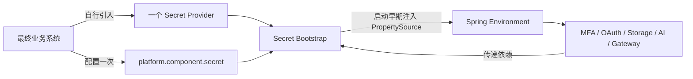
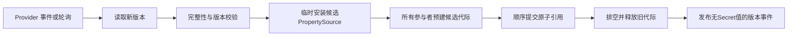

# Atlas Richie Secret组件 (atlas-richie-secret)

`atlas-richie-secret` 是 Atlas Richie 技术中台统一的密钥与敏感配置访问组件，目标是屏蔽 Vault、云厂商 Secret Manager/KMS、OpenBao、KMIP 等产品之间的接入差异，并让 MFA、OAuth、Storage、AI、Gateway 等业务组件以配置驱动的方式透明接入。

> 当前状态：**M1 基线、M2 Provider 适配包、M3 OpenBao/Barbican/KMIP/PKCS#11 Provider、业务组件透明接入、运行期两阶段原子刷新、OAuth 双版本签名窗口和 MFA 新写桥接均已落地；尚未发布 Maven 版本。** 当前按全新项目处理，不包含 MFA 历史数据迁移。Vault 1.21.2 的 KV v2 + Transit、Token File/AppRole/Agent、Docker Desktop Kubernetes Auth 与 Storage/Gateway/AI 真实服务 E2E 已通过；OpenBao 2.6.2 Docker KV/Transit E2E、SoftHSM2 PKCS#11 AES Wrap/Unwrap + RSA Sign/Verify E2E 已通过。KMIP 已完成本地 TLS/TTLV 连通性验证，但 PyKMIP 0.10.0 不支持 Provider 当前要求的 AES Key Wrap Padding，完整 Wrap/Unwrap E2E 保持阻塞；Barbican 本机没有 Keystone/Barbican 服务栈，真实 E2E 保持待环境。云厂商真实 E2E、真实 HSM、权限拒绝/认证续期/证书轮换仍待目标环境验收，在这些验收完成前不可用于生产 GA。统一业务审计事件和可信租户上下文隔离仍是目标架构，不属于当前公开实现。

完整的设计背景、架构、生命周期、SPI、威胁模型、时序图、流程图、测试与演进计划，请参阅 [Atlas-Richie-Secret 组件完整设计方案](docs/zh/design.md)。本文只说明最终使用方式。

## 📖 目录

- [🎯 组件概述](#🎯-组件概述)
    - [使用者最终会得到什么](#使用者最终会得到什么)
    - [默认禁用：现有系统零迁移](#默认禁用现有系统零迁移)
- [🏗️ 架构设计](#🏗️-架构设计)
    - [业务组件如何自动接入](#业务组件如何自动接入)
- [🚀 快速上手指南](#🚀-快速上手指南)
    - [启用方式](#启用方式)
- [📚 接口详细说明](#📚-接口详细说明)
    - [项目外观 API](#项目外观-api)
- [🔧 核心能力](#🔧-核心能力)
    - [刷新与轮换](#刷新与轮换)
    - [Provider 支持计划](#provider-支持计划)
- [⚙️ 配置说明](#⚙️-配置说明)
    - [Provider 配置示例](#provider-配置示例)
    - [配置优先级](#配置优先级)
    - [公共配置项](#公共配置项)
    - [多 Provider 场景](#多-provider-场景)
- [📎 🛡️ 上线、兼容性与安全检查](#📎-🛡️-上线兼容性与安全检查)
    - [上线检查清单](#上线检查清单)
    - [兼容性与版本承诺](#兼容性与版本承诺)
- [🔧 故障排查](#🔧-故障排查)
    - [常见问题](#常见问题)
- [📎 📚 相关文档](#📎-📚-相关文档)
- [📎 ⏱️ 时序图详解](#📎-⏱️-时序图详解)

## 🎯 组件概述

### 使用者最终会得到什么

透明配置接入时，最终业务系统只需要完成三件事：

1. 在自己的 `pom.xml` 中引入一个实际 Provider，例如 Vault、AWS 或阿里云；
2. 配置一套全局 `platform.component.secret` 参数，并显式设置 `enabled: true`；
3. 在 Secret 中间件中按约定创建 Bundle。

之后，已经接入 Secret Bootstrap 的 MFA、OAuth、Storage、AI、Gateway 等组件会自动把各自声明为敏感的本地配置项切换为 Secret 中间件中的值，无须逐个组件编写 Secret 客户端、监听器或适配代码。



Provider 的选择权只属于最终业务系统：

- 业务组件不选择 Provider；
- 技术中台不替业务系统绑定云厂商；
- `atlas-richie-secret-bootstrap` 不打包 Vault、AWS、阿里云等厂商 SDK；
- 单 Provider 场景根据 classpath 自动发现，不要求重复配置 `provider: vault`；
- 多 Provider 场景才需要显式路由。

### 默认禁用：现有系统零迁移

如果最终业务系统没有启用 Secret，则所有业务组件继续使用当前的本地配置、环境变量或配置中心配置。

可以完全不写任何 Secret 配置；也可以显式关闭：

```yaml
platform:
  component:
    secret:
      enabled: false
```

禁用状态必须满足以下约束：

- 不创建 Secret 运行期 Bean；
- 不加载 Provider；
- 不发起网络请求；
- 不创建后台线程；
- 不注册额外 PropertySource；
- 不改变原有属性优先级和刷新行为；
- 不要求最终应用引入任何 Provider。

因此，对于未启用 Secret 的系统，这个组件应当像“不存在”一样。

## 🏗️ 架构设计

### 业务组件如何自动接入

最终使用者不需要对每个组件配置一遍 Secret 开关。各业务组件在构建时完成以下约定即可：

1. 传递依赖轻量级 `atlas-richie-secret-bootstrap`；
2. 在自己的 JAR 中携带 `META-INF/atlas-richie/secret-bindings.json`；
3. 在 Catalog 中声明需要透明覆盖的敏感配置路径、是否必需、所属作用域和刷新策略；
4. 继续通过原有 `@ConfigurationProperties`、`Environment` 或既有配置对象读取属性。

启用后的预期结果如下：

| 业务组件 | 自动托管的典型内容 | 预期切换方式 |
| --- | --- | --- |
| Storage | Object AccessKey/SecretKey、FTP/SFTP/SMB Password | 预建全部候选客户端后原子切换；旧客户端等待在途请求排空再销毁 |
| AI | 各模型 API Key/Key Pool、Secret ID/Key、App Code | Chat、多模态、Key Pool 与 STS signer 按不可变代际整体切换 |
| Gateway | 接口鉴权签名密钥 | 原子替换鉴权 Secret；ECC 私钥不作为字符串托管 |
| OAuth | Token Secret、Introspection Client Secret | HMAC 自动双版本验签；RSA/OIDC 轮换时 JWKS 同时发布当前与上一公钥 |
| MFA | TOTP 数据加密 KEK | 通过最小外观生成 `arse:v1` 信封；不导出 KEK |

敏感配置透明注入适用于可以导出的字符串、字节或结构化 Secret。云 KMS 中不可导出的私钥、MAC Key、数据密钥生成等能力，必须通过运行期 Crypto API 使用，不会伪装成普通配置属性。

## 🚀 快速上手指南

### 启用方式

#### 第一步：选择一个 Provider

最终业务系统根据部署环境自行选择一个 Provider。Provider 坐标均已在源码仓库落地但尚未发布；Provider 依赖仍只能由最终业务系统选择。

##### HashiCorp Vault

```xml
<dependency>
    <groupId>cn.richie696.component</groupId>
    <artifactId>atlas-richie-secret-provider-vault</artifactId>
</dependency>
```

##### AWS Secrets Manager / KMS

```xml
<dependency>
    <groupId>cn.richie696.component</groupId>
    <artifactId>atlas-richie-secret-provider-aws</artifactId>
</dependency>
```

##### 阿里云 KMS / Secrets Manager

```xml
<dependency>
    <groupId>cn.richie696.component</groupId>
    <artifactId>atlas-richie-secret-provider-aliyun</artifactId>
</dependency>
```

##### M2 云 Provider

M2 同样由最终业务系统按需选择：`atlas-richie-secret-provider-azure`、`-gcp`、`-tencent`、`-huawei`、`-volcengine`、`-oci`、`-ibm-key-protect` 或 `-baidu`。

这些包当前共享严格的 JSON Provider Transport，并提供 `wire` profile 将厂商官方 REST 文档中的路径和响应字段声明为配置：读取、包裹、解包支持 `{path}`、`{key}`、`{version}`、`{region}`、`{projectId}`、`{tenantId}`、`{namespace}`、`{apiVersion}` 模板，禁止明文或 Base64 伪加密回退。华为云、腾讯云、火山引擎和百度云的官方请求签名已经内聚在 Transport；GCP/Azure/OCI/IBM 使用短期 Bearer Token 或 Token File，Token 交换由 workload identity Agent 负责。真实云 E2E 在账号和测试租户到位后逐一验收，未验收前不标记为生产 GA。

示例（Azure，其他 M2 Provider 只替换前缀与 Maven artifact）：

```yaml
platform:
  component:
    secret:
      enabled: true
      property-source:
        application: ${spring.application.name}
        environment: production
        paths: [common, components]
      azure:
        endpoint: https://secret-adapter.example.internal
        authentication:
          type: bearer-token
          token: ${AZURE_SECRET_ADAPTER_TOKEN}
        secrets:
          database-password:
            path: applications/order-service/database
            field: password
        key-bindings:
          default-envelope: order-service-envelope
        # 按厂商官方 REST 文档覆盖路径/响应字段；默认值为统一契约
        wire:
          secret-path: /secrets/{path}
          wrap-path: /keys/{key}/wrap
          unwrap-path: /keys/{key}/unwrap
          secret-value-field: value
          wrapped-key-field: wrappedKey
          plaintext-field: plaintext
```

业务组件自身只依赖轻量级 Bootstrap，不得将上述任何 Provider 传递给最终应用。

##### M3 自建与标准协议 Provider

M3 Provider 同样由最终业务系统自行引入：

```xml
<dependency><groupId>cn.richie696.component</groupId><artifactId>atlas-richie-secret-provider-openbao</artifactId></dependency>
<dependency><groupId>cn.richie696.component</groupId><artifactId>atlas-richie-secret-provider-barbican</artifactId></dependency>
<dependency><groupId>cn.richie696.component</groupId><artifactId>atlas-richie-secret-provider-kmip</artifactId></dependency>
<dependency><groupId>cn.richie696.component</groupId><artifactId>atlas-richie-secret-provider-pkcs11</artifactId></dependency>
```

四个包的实现边界不同：OpenBao 独立使用 KV v2/Transit HTTP API；Barbican 只声明 Secret/Metadata 读取能力；KMIP 使用 TLS 上的 KMIP 2.1 TTLV Encrypt/Decrypt（AES Key Wrap Padding）；PKCS#11 使用 JDK `SunPKCS11` 和 HSM Token 上的 AES Wrap/Unwrap 以及 `SIGN`/`VERIFY`。KMIP、PKCS#11 和 IBM/百度等 KMS-only Provider 不注册 `SecretBackend`，不会把密钥对象伪装成普通配置 Secret。四个 Provider 均提供显式环境变量门禁的 E2E 测试；没有对应服务、证书或 HSM 时测试会跳过，不会伪造通过。

OpenBao 示例：

```yaml
platform:
  component:
    secret:
      enabled: true
      openbao:
        endpoint: https://openbao.example.internal
        tls:
          trust-store: /etc/atlas/openbao-truststore.p12
          trust-store-password: ${OPENBAO_TRUSTSTORE_PASSWORD}
        proxy:
          host: egress-proxy.internal
          port: 8443
        authentication:
          type: token-file
          token-file: /var/run/secrets/openbao/token
        kv:
          mount: secret
          runtime-prefix: runtime
        transit:
          mount: transit
          key-bindings:
            mfa.totp.data-key: atlas-mfa
```

#### 第二步：配置全局 Secret 参数

最小公共配置如下：

```yaml
platform:
  component:
    secret:
      enabled: true
      strict-mode: true
      property-source:
        application: ${spring.application.name}
        environment: production
        paths: [common, components]
        missing-policy: fail
        local-fallback: false
      refresh:
        enabled: true
        initial-delay: 1m
        interval: 1m
```

推荐通过工作负载身份、实例角色、Kubernetes ServiceAccount 或本机 Agent 获取访问身份。不要把用于读取 Secret 中间件的长期 AccessKey、Token 或密码再写回同一个明文配置文件。

#### 第三步：在 Secret 中间件中创建 Secret Bundle

推荐路径模型：

```text
atlas-richie/{environment}/{application}/{scope}
```

例如：

```text
atlas-richie/production/order-service/common
atlas-richie/production/order-service/components
atlas-richie/production/order-service/blue
```

Bundle 中的键继续使用现有 Spring 配置路径，因此业务组件不需要改用新的取值 API：

```yaml
# Secret 中间件中的逻辑内容，不是 application.yml
platform.component.storage.object.access-key-id: "..."
platform.component.storage.object.access-key-secret: "..."
platform.component.ai.chat.openai.api-keys[0]: "..."
platform.gateway.security.authentication.secret-key: "..."
platform.component.oauth.token-secret: "..."
```

MFA 的 `mfa.totp.data-key` 是原生逻辑 Key，不进入 Bundle；它通过所选 Provider 的
`key-bindings` 映射到 Vault Transit Key、AWS KMS Key ARN/Alias 或阿里云 KMS Key ID。

组件只会导入 Binding Catalog 明确声明的敏感属性。普通业务配置不会因为启用 Secret 而被全量托管。

当前阶段 3 已落地的白名单如下；表外属性即使出现在 Bundle 中也会被丢弃：

| 组件 | 已接入属性/逻辑 Key |
| --- | --- |
| Storage | `object.access-key-id/access-key-secret`、`ftp/sftp/smb3.password` |
| AI | `chat/rerank/image/image-embedding/tts/stt/voice-chat.{name}` 下受支持的 API Key、Key Pool、Secret ID/Key、Access Key、App Code |
| OAuth | `platform.component.oauth.token-secret`、`platform.oauth.resource-server.introspection-client-secret` |
| Gateway | `platform.gateway.security.authentication.secret-key` |
| MFA | 原生逻辑 Key `mfa.totp.data-key`；不进入 Spring PropertySource |

AI 的 `{name}` 只能匹配一个规范化 kebab-case 属性段，`api-keys[{index}]` 的 `{index}` 只能是数字；不支持 `*`、跨层级匹配或任意正则。

### MFA 历史 Secret 迁移

`atlas-richie-mfa-management` 提供 `MfaSecretMigrationService`，按批次把旧的 `mfa/{tenant}/{user}` 引用读取后重新写入启用后的 Secret Provider，并只回写 `mfa_user_info.secret_reference`。接口只返回扫描/成功/失败计数，不返回明文或完整 Secret 路径：

```java
MfaSecretMigrationService.MigrationResult result =
        migrationService.migrateBatch(200, true); // 先 dry-run
```

先以 `dryRun=true` 验证旧 Provider 读取权限，再以小批次执行 `false`，重复直到 `mayHaveMore=false`。迁移失败的记录不会更新数据库，可安全重试；历史实际执行仍属于运维变更，必须在备份、双人复核和目标 Provider E2E 完成后进行。

## 📚 接口详细说明

### 项目外观 API

透明属性覆盖不能代替所有密钥使用场景。以下场景应调用统一运行期 API：

- 获取动态数据库凭证或短期租约；
- 生成数据密钥并执行信封加密；
- 使用云 KMS 中不可导出的密钥进行签名、验签、加密、解密或 MAC；
- 写入、更新、轮换或撤销由应用管理的 Secret；
- 读取租户级、用户级或请求级 Secret；
- 获取版本、租约、过期时间和轮换元数据。

普通项目只需要注入一个 `SecretOperations` 外观：

```java
private final SecretOperations secrets;

String result = secrets.read(
        "storage.object.credential",
        credential -> invokeStorage(credential));

String encrypted = secrets.encrypt("mfa.totp.data-key", plaintextBytes);

SignatureValue signature = secrets.sign("oauth.signing", payloadBytes);
boolean valid = secrets.verify("oauth.signing", payloadBytes, signature);

VerificationResult verification = secrets.decrypt(
        encrypted,
        plaintext -> verifyTotp(plaintext));
```

项目代码只传递会变化的逻辑 Secret/Key 名称和业务数据。Provider ID、物理路径、KMS Key ARN、Vault Mount、版本路由、AAD、Wrapped DEK、算法、Envelope 编解码和临时明文清零均由组件内聚。`read/decrypt` 回调返回后，组件会立即清零传入的临时数组。

`SignatureValue` 是不可解析的签名值对象。业务代码不得拆解或重写其内容；Vault Transit、云 KMS 或 HSM 所需的 Key Version、签名格式和算法上下文由 Provider 保留在签名值中。私钥永不进入应用内存。选中的 Provider 未声明 `SIGN` 和 `VERIFY` 时，调用会快速失败，不回退到本地私钥或明文配置。

如果业务系统只需要签名能力，也可以注入 `SigningService`；普通业务优先使用 `SecretOperations`，以保持单一外观。`SigningBackend`、`KeyReference`、`CryptoContext` 和 Provider Session 属于扩展 SPI，不应由业务系统直接创建。

版本元数据查询、Rewrap 和管理操作没有放进默认外观；它们由轮换流程或专用管理接口负责。`SecretResolver`、`SecretValue`、`CryptoContext`、`EnvelopeCrypto`、`KeyWrappingBackend`、`CipherEnvelope` 和 Provider SPI 属于 Core/Provider 扩展面，普通业务项目不应直接注入。原则是：**可变的外部提供（配置文件或代码调用），不变的组件内聚。**

## 🔧 核心能力

### 刷新与轮换

全局 Secret 启用后，运行期刷新默认随之启用；可通过 `refresh.enabled: false` 单独关闭。每次轮询读取的是完整 Bundle，而不是逐字段补丁：



关键约束：

- 刷新以完整版本为单位，不逐字段暴露半更新状态；
- 任一组件预校验或提交失败时，PropertySource 和已提交组件按逆序回滚，继续使用 Last Good Snapshot；
- Storage 在全部 Provider 客户端预建成功后一次切换代理引用，旧客户端等待稳定代理中的在途调用退出后再释放；
- AI 原子替换 Chat/多模态模型快照、隔离构建 Key Pool，并同步替换 STS signer 代际；
- Gateway 只替换鉴权 Secret，不把算法、安全模式等普通配置混入 Secret 刷新；
- OAuth HMAC 新签名只使用当前版本，验签在 `signing-key-verification-window` 内接受上一版本；RSA Access Token 与 OIDC ID Token 的 JWKS 在同一窗口同时发布两个 `kid`；
- 日志、异常、指标和审计事件只记录名称、版本、Provider、耗时和结果，不记录值；
- OAuth 签名密钥、MFA 数据加密密钥等不能简单覆盖，必须采用带版本的轮换协议；
- 启动必需 Secret 与运行期可刷新 Secret 应分别定义失败策略。

### Provider 支持计划

| 优先级 | Provider | 当前状态 | 目标能力 |
| --- | --- | --- | --- |
| P0 | HashiCorp Vault | KV v2、Transit Wrap/Unwrap/Sign/Verify 已实现；本地签名真实 E2E 需创建 RSA/ECDSA Transit Key 后验收 | KV v2、Transit、Kubernetes/Token File/AppRole/JWT/Auth Agent；云端与 JWT 信任根 E2E 另行验收 |
| P0 | AWS | Secrets Manager/KMS Wrap/Unwrap/Sign/Verify 已实现，真实云 E2E 待完成 | Secrets Manager、KMS、默认凭证链、Profile、角色身份 |
| P0 | 阿里云 | 基线已实现、真实云 E2E 待完成 | KMS Secret Manager、KMS、默认凭证链、RAM Role/工作负载身份 |
| P1 | Azure | M2 适配包已落地，真实云 E2E 待完成 | Key Vault Secrets/Keys、Managed Identity |
| P1 | Google Cloud | M2 适配包已落地，真实云 E2E 待完成 | Secret Manager、Cloud KMS、Workload Identity |
| P1 | 腾讯云 | M2 适配包已落地，真实云 E2E 待完成 | SSM、KMS、角色身份 |
| P1 | 华为云 | M2 适配包已落地，真实云 E2E 待完成 | CSMS、KMS、委托或临时凭证 |
| P1 | 火山引擎 | M2 适配包已落地，真实云 E2E 待完成 | KMS、密钥托管服务、实例角色 |
| P1 | OCI Vault | M2 适配包已落地，真实云 E2E 待完成 | Vault Secrets、Vault KMS |
| P1 | IBM Key Protect | M2 适配包已落地，真实云 E2E 待完成 | KMS Wrap/Unwrap；Secret Store 另行接入 |
| P1 | 百度云 KMS | M2 适配包已落地，真实云 E2E 待完成 | KMS Wrap/Unwrap |
| P1 | OpenBao | M3 KV/Transit Wrap/Unwrap/Sign/Verify 已通过 OpenBao 2.6.2 Docker 本地 E2E | KV v2、Transit、Token/Token File |
| P2 | KMIP 2.1 | TLS/TTLV 已通过 PyKMIP 本地连通性门禁；AES Key Wrap Padding 因服务端能力不足未通过 | Encrypt/Decrypt 作为 Wrap/Unwrap、证书认证 |
| P2 | PKCS#11 HSM | SoftHSM2 本地 E2E 已通过；真实硬件 HSM 尚未验收 | HSM Token AES Wrap/Unwrap、非导出私钥 Sign/Verify |
| P2 | OpenStack Barbican | Provider 已实现；本机无 Keystone/Barbican 服务栈，真实 E2E 待环境 | Secret payload、Metadata、Token |

Provider 是否可用必须以对应版本的发布说明、兼容性矩阵和测试报告为准。

### 厂商签名与工作负载身份兼容矩阵

下表是当前代码级兼容边界。`已实现`表示已有 Contract Test 和配置校验；`待环境验收`表示还需要目标厂商账号、身份注入器或中间件实例，不能仅凭编译结果宣称生产兼容。

| Provider | 工作负载身份/凭据入口 | 请求签名 | TLS/代理 | 当前验收状态 |
| --- | --- | --- | --- | --- |
| AWS | SDK 默认凭据链、EKS/ECS/EC2 角色 | AWS SDK 原生签名 | SDK/HTTPS；真实代理矩阵待验收 | Contract 已通过；真实云待验收 |
| 阿里云 | SDK 默认凭据链、RAM Role/ACK/ECS 身份 | SDK 原生签名 | SDK/HTTPS；真实代理矩阵待验收 | Contract 已通过；真实云待验收 |
| Azure | Bearer、Token File、Managed Identity Agent | 不启用通用 HMAC | TrustStore/Proxy | Wire/Contract 已通过；真实云待验收 |
| GCP | Bearer、Token File、Workload Identity Agent | 不启用通用 HMAC | TrustStore/Proxy | Wire/Contract 已通过；真实云待验收 |
| OCI | Bearer、Token File、Instance/Resource Principal Agent | 不启用通用 HMAC | TrustStore/Proxy | Wire/Contract 已通过；真实云待验收 |
| IBM Key Protect | Bearer、Token File | 不启用通用 HMAC | TrustStore/Proxy | Wire/Contract 已通过；真实云待验收 |
| 腾讯云 | AccessKey、Token File/身份 Agent | TC3-HMAC-SHA256 | TrustStore/Proxy | 签名 Contract 已通过；真实云待验收 |
| 华为云 | AccessKey、Token File/Agency Agent | SDK-HMAC-SHA256 | TrustStore/Proxy | 签名 Contract 已通过；真实云待验收 |
| 火山引擎 | AccessKey、Token File/身份 Agent | HMAC-SHA256、KMS Encrypt/Decrypt | TrustStore/Proxy | Wire/签名 Contract 已通过；真实云待验收 |
| 百度云 KMS | AccessKey、Token File/身份 Agent | BCE v2 | TrustStore/Proxy | 签名 Contract 已通过；真实云待验收 |
| OpenBao | Token、Token File | 不启用厂商 HMAC | TrustStore/Proxy；Kubernetes/JWT/AppRole 由 Agent 交换为 Token | OpenBao 2.6.2 Docker E2E 已通过 |
| Barbican | Bearer、Token File | 不启用厂商 HMAC | TrustStore/Proxy | 协议门禁已通过；本机服务栈缺失 |
| KMIP 2.1 | mTLS 客户端证书 | KMIP TTLV，不使用 HTTP HMAC | mTLS；代理由部署网络提供 | 本地 TLS/TTLV 已连通；PyKMIP 不支持 AES KWP |
| PKCS#11 HSM | 本地 Token/PIN、数字 slot | HSM/JCA Sign/Verify | 不走 HTTP 代理 | SoftHSM2 E2E 已通过；真实 HSM 待验收 |

### 本地可验证性记录

| Provider | 本地依赖 | 结果 | 说明 |
| --- | --- | --- | --- |
| OpenBao | Docker `openbao/openbao:latest`（2.6.2） | 通过 | KV v2 读写、Transit RSA 签名/验签；`OpenBaoIntegrationTest` 1/1 |
| PKCS#11 | SoftHSM2 2.7.0 + JDK SunPKCS11 | 通过 | AES 包裹/解包、RSA 签名/验签；`Pkcs11IntegrationTest` 1/1；不等价于真实 HSM |
| KMIP | PyKMIP 0.10.0 + TLS 双向材料 | 部分通过 | TLS 握手、KMIP 2.0 TTLV 请求/响应已验证；PyKMIP 加密引擎不支持 AES Key Wrap Padding，完整包裹回环未通过 |
| Barbican | 无本地 Keystone/Barbican 服务栈 | 未测试 | Provider 单元/配置测试可运行，真实 REST/Token E2E 需 OpenStack 环境 |

工作负载身份文件只承载短期令牌；Secret 组件不负责替云平台执行令牌交换，也不会把长期 AK/SK 写回配置。具体身份 Agent、ServiceAccount、实例角色和证书轮换必须在目标部署环境按厂商文档验收。

`No Plaintext Fallback` 约束的是受管业务 Secret 和加密密钥：Provider 失败时绝不会重新启用本地业务明文。AWS/阿里云的启动身份属于独立信任边界，遵循厂商 SDK 默认凭据链；环境变量 AK/SK 因而仍可用于本地开发或受控应急，但生产必须优先使用工作负载/实例角色，并通过部署策略限制允许的凭据来源。组件不会把这些启动凭据复制到业务 Properties。

## ⚙️ 配置说明

### Provider 配置示例

不同 Provider 只提供连接、身份、区域和产品特有参数；公共行为始终由 `platform.component.secret` 控制。

M2 Provider 的默认 wire profile 已收口在组件内部：GCP 使用相互独立的
Secret Manager 与 Cloud KMS endpoint，并通过
`projects/{project}/secrets/{secret}/versions/{version}:access` 和
`payload.data` Base64 载荷，OCI 使用 `secretBundle`，Azure 使用 Key Vault
`secrets`/`wrapkey`、`RSA-OAEP-256` 和 Base64URL，IBM Key Protect 使用
`/api/v2/keys/{id}/actions/{wrap,unwrap}`。
火山引擎使用官方 KMS `Encrypt`/`Decrypt` Action、操作专属的
`Plaintext`/`CiphertextBlob` 字段和 `EncryptionContext`，并且只声明
`KEY_WRAP/KEY_UNWRAP`，Secret 读取必须路由到其他 Provider。腾讯云、华为云和百度云
同样提供官方资源路径、请求字段和操作级 Action/API Version 默认值；如果企业网关或
厂商 API 版本不同，可以只通过 `wire.*` 覆盖路径和响应字段。组件不会把访问密钥
写入日志，也不会在 HTTP 失败时回退到明文或伪造值。

云厂商的认证 token、工作负载身份交换和请求签名必须按对应官方文档配置。当前
通用 REST 传输支持 `BEARER_TOKEN`、`TOKEN_FILE`、`WORKLOAD_IDENTITY_TOKEN_FILE`、
`ACCESS_KEY` 和 `NONE`。当使用 `ACCESS_KEY` 时，华为云、腾讯云、火山引擎和百度云
会自动选择对应的 HMAC 签名协议，也可以通过 `authentication.signature` 显式覆盖；
工作负载身份文件中的短期 JWT 只作为 Bearer Token 使用，Token 交换由云平台 Agent
或身份注入器完成。AWS、阿里云的原生 SDK Provider 继续使用各自的默认凭据链。

腾讯云 SSM 与 KMS 使用不同服务域名和不同签名作用域；Action、API Version 与
`ssm`/`kms` signing service 已由操作级 wire profile 内聚，使用者不需要重复配置：

```yaml
platform.component.secret.tencent:
  secret-endpoint: https://ssm.tencentcloudapi.com
  kms-endpoint: https://kms.tencentcloudapi.com
  region: ap-guangzhou
  authentication:
    type: access-key
    access-key-id: ${TENCENT_SECRET_ID}
    access-key-secret: ${TENCENT_SECRET_KEY}
    signature: tencent-tc3-hmac-sha256
```

当 Secret Store 与 KMS 本来就共用同一服务入口，或企业反向代理把两者收口到同一
origin 时，仍可只配置兼容字段 `endpoint`；否则必须分别配置 `secret-endpoint` 和
`kms-endpoint`。Azure `key-bindings` 必须使用 `<key-name>/<key-version>`，以确保
版本化 `wrapkey`/`unwrapkey` 请求不会悄然落到非预期版本。

AWS KMS 和 PKCS#11 的签名轮换采用“当前签名 Key + 历史验签 Key”模型。历史 Key
仅用于验签，不会参与新签名；最长保留时间应覆盖业务 Token/签名数据的最长有效期：

```yaml
platform.component.secret.aws.kms:
  key-bindings:
    oauth-signing: arn:aws:kms:ap-southeast-1:123456789012:key/current
  verification-key-bindings:
    oauth-signing:
      - arn:aws:kms:ap-southeast-1:123456789012:key/previous

platform.component.secret.pkcs11:
  key-bindings:
    oauth-signing: oauth-signing-v2
  verification-key-bindings:
    oauth-signing: [oauth-signing-v1]
```

通用 REST Provider 的 TLS 和代理配置：

```yaml
platform.component.secret.gcp:
  tls:
    trust-store: /etc/atlas/provider-truststore.p12
    trust-store-password: ${PROVIDER_TRUSTSTORE_PASSWORD}
    key-store: /etc/atlas/provider-client.p12
    key-store-password: ${PROVIDER_CLIENT_PASSWORD}
  proxy:
    host: egress-proxy.internal
    port: 8443
    username: ${PROXY_USERNAME}
    password: ${PROXY_PASSWORD}
```

没有真实账号时，签名 Contract、TLS/代理配置校验和 HTTP facade 故障矩阵仍可运行；
真实云 E2E 会以显式环境变量门禁跳过。

#### Vault

```yaml
platform:
  component:
    secret:
      enabled: true
      strict-mode: true
      property-source:
        application: ${spring.application.name}
        environment: production
        paths: [common, components]
        missing-policy: fail
        local-fallback: false
      vault:
        endpoint: https://vault.example.internal
        namespace: atlas
        authentication:
          type: kubernetes
          role: order-service
          kubernetes-path: kubernetes
          service-account-token-file: /var/run/secrets/kubernetes.io/serviceaccount/token
        kv:
          mount: secret
          runtime-prefix: runtime
        transit:
          mount: transit
          key-bindings:
            default-envelope: order-service-envelope
            mfa.totp.data-key: order-service-mfa-totp
            oauth.signing: order-service-oauth-signing
        secrets:
          database-password:
            path: applications/order-service/database
            field: password
```

调用方只使用 `default-envelope` 和 `database-password`；`order-service-envelope`、KV 路径与字段都不会进入项目外观 API。未显式配置 `secrets` 映射时，逻辑 Secret `name` 会内聚映射为：

```text
atlas-richie/{environment}/{application}/{runtime-prefix}/{name}
```

Vault Provider 当前支持以下认证类型：

| `authentication.type` | 用途 | 必要配置 |
| --- | --- | --- |
| `kubernetes` | Kubernetes 工作负载身份，默认推荐 | `role`，可选覆盖 auth path 与 ServiceAccount Token 文件 |
| `token-file` | Vault Agent Sink 或平台注入的轮换 Token 文件 | `token-file` |
| `agent` | 应用只连接本机 Vault Agent 代理，由 Agent 完成认证 | 无 Token；`endpoint` 指向 Agent Listener |
| `approle` | 非 Kubernetes 工作负载的机器身份 | `role-id` 或 `role-id-file`，以及 `secret-id` 或 `secret-id-file` |
| `jwt` | OIDC/JWT 工作负载身份 | `jwt-role` 与 `jwt` 或 `jwt-file`，可选覆盖 `jwt-path` |
| `token` | 本地开发和受控测试 | `token`；生产不推荐 |

自定义 JVM TrustStore：

```yaml
platform:
  component:
    secret:
      vault:
        tls:
          trust-store: /etc/atlas/vault-truststore.p12
          trust-store-password: ${VAULT_TRUSTSTORE_PASSWORD}
```

连接和读取超时、最大尝试次数复用公共配置：

```yaml
platform.component.secret.resilience:
  connect-timeout: 3s
  read-timeout: 5s
  max-attempts: 3
```

只对网络错误、HTTP 429 和 5xx 进行有界重试；认证失败、权限拒绝、路径不存在等永久错误不会重试。

#### Vault 最小权限示例

以下策略仅展示读取 Bundle、读取一个运行期 Secret 以及使用一个 Transit Key 的最小运行权限。挂载点、应用路径和 Key 名必须按实际配置替换：

```hcl
path "secret/data/atlas-richie/production/order-service/*" {
  capabilities = ["read"]
}

path "secret/data/applications/order-service/database" {
  capabilities = ["read"]
}

path "transit/encrypt/order-service-envelope" {
  capabilities = ["update"]
}

path "transit/decrypt/order-service-envelope" {
  capabilities = ["update"]
}

path "transit/sign/order-service-signing" {
  capabilities = ["update"]
}

path "transit/verify/order-service-signing" {
  capabilities = ["update"]
}
```

运行时身份不需要 `sys/mounts`、Transit Key 创建/轮换、KV 写入或删除权限。Key 与 auth role 必须由独立的管理流程预先创建，Provider 不会在应用启动时越权创建资源。

OpenBao 的 `secret` 与 `transit` mount 只是互操作默认值，不是租户隔离边界。生产多应用/多租户部署必须配置独立 mount/namespace，或把 Token Policy 限制在应用自己的精确路径前缀。Barbican 只有在 Keystone Token 已完成项目作用域绑定时才可以省略 `project-id`，否则必须显式配置；两种场景上线前都要做跨项目/跨租户拒绝用例。

#### AWS

```yaml
platform:
  component:
    secret:
      enabled: true
      strict-mode: true
      property-source:
        application: ${spring.application.name}
        environment: production
        paths: [common, components]
        missing-policy: fail
        local-fallback: false
      aws:
        region: ap-southeast-1
        authentication:
          type: default-chain
        secrets-manager:
          path-prefix: company
        kms:
          key-bindings:
            default-envelope: alias/order-service
            mfa.totp.data-key: alias/order-service-mfa-totp
            oauth.signing: alias/order-service-oauth-signing
          signing-algorithm: RSASSA_PSS_SHA_256
```

在 EKS/ECS/EC2 中应优先使用对应的工作负载或实例角色，不在配置文件中填写静态 AccessKey。

#### 阿里云

```yaml
platform:
  component:
    secret:
      enabled: true
      strict-mode: true
      property-source:
        application: ${spring.application.name}
        environment: production
        paths: [common, components]
        missing-policy: fail
        local-fallback: false
      aliyun:
        region: cn-hangzhou
        secrets-manager:
          path-prefix: company
        kms:
          key-bindings:
            default-envelope: alias/order-service
            mfa.totp.data-key: alias/order-service-mfa-totp
```

阿里云 Provider 固定使用官方默认凭据链，不提供在 Properties 中填写 AccessKey 的入口。在 ACK、ECS 等环境中应优先使用 RAM Role 或工作负载身份；专属 KMS 网关还必须配置 HTTPS `endpoint` 与 `ca-file`。

`secrets-manager.path-prefix` 是可选的组织级物理前缀。配置为 `company` 时，Bundle 的完整名称为 `company/atlas-richie/{environment}/{application}/{scope}`；不配置时直接使用统一逻辑路径。

### 配置优先级

启用后，敏感属性采用以下优先级：

```text
Secret PropertySource
    > 命令行参数
    > 系统属性
    > 环境变量
    > 配置中心 / application.yml
    > 组件默认值
```

该优先级只作用于 Binding Catalog 声明的敏感属性。

行为约定：

- `enabled=false`：不存在 Secret PropertySource，完全沿用 Spring 原有优先级；
- `enabled=true` 且 Secret 存在：Secret 值覆盖同名本地值；
- `enabled=true`、`strict-mode=true` 且必需 Secret 缺失：启动失败；
- 不允许因远端不可用或 Secret 缺失而静默降级到本地明文；
- 运行期刷新失败时只能继续使用已加载、已验证且仍有效的内存 Last Good Snapshot；应用重启后必须重新访问 Provider。

### 公共配置项

| 配置项 | 默认值 | 说明 |
| --- | --- | --- |
| `platform.component.secret.enabled` | `false` | Secret 总开关；只有显式为 `true` 才启用 |
| `platform.component.secret.strict-mode` | `true` | 必需 Secret 缺失、Provider 歧义等情况是否失败关闭 |
| `platform.component.secret.active-provider` | 无 | 多 Provider 场景指定默认 Provider；单 Provider 不需要 |
| `platform.component.secret.property-source.application` | `${spring.application.name}` | 当前应用逻辑名 |
| `platform.component.secret.property-source.environment` | `dev` | 环境命名空间，例如 `production` |
| `platform.component.secret.property-source.paths` | `common,components` | 按顺序加载的 Bundle Scope |
| `platform.component.secret.property-source.missing-policy` | `fail` | 启动期必需 Secret 缺失策略 |
| `platform.component.secret.property-source.local-fallback` | `false` | 是否允许本地值回退；生产必须保持关闭 |
| `platform.component.secret.refresh.enabled` | `true` | Secret 已启用时是否启动完整 Bundle 轮询；全局 `enabled=false` 时不会创建线程 |
| `platform.component.secret.refresh.initial-delay` | `1m` | 应用启动后第一次轮询前的等待时间，必须为正数 |
| `platform.component.secret.refresh.interval` | `1m` | 两次完整刷新之间的固定延迟，必须为正数 |
| `platform.component.oauth.signing-key-verification-window` | `2h` | OAuth 签名轮换后上一版本继续验签/JWKS 发布的窗口；应不小于最长 Access/ID Token TTL |
| `platform.component.secret.resilience.connect-timeout` | `3s` | Provider 建连超时 |
| `platform.component.secret.resilience.read-timeout` | `5s` | Provider 单次读取超时 |
| `platform.component.secret.resilience.max-attempts` | `3` | 网络错误、429、5xx 的最大尝试次数 |
| `platform.component.secret.envelope.format` | `arse` | 信封密文格式标识 |

Provider 专属配置位于：

```text
platform.component.secret.vault.*
platform.component.secret.aws.*
platform.component.secret.aliyun.*
platform.component.secret.azure.*
platform.component.secret.gcp.*
...
```

M2 适配包统一支持 `endpoint`（同源兼容入口）、`secret-endpoint`、`kms-endpoint`、`authentication`、`secrets`、`key-bindings`、`wire`、`tls` 和 `proxy` 等稳定字段；`authentication.type` 可取 `none`、`bearer-token`、`token-file`、`workload-identity-token-file`、`access-key`，并在启动期校验凭据完整性。endpoint 强制 HTTPS，只有 loopback 本地契约测试允许 HTTP。`wire` 只描述厂商官方 REST 的路径和字段，不把密文伪装成明文，也不在配置中记录凭据。IBM Key Protect、火山引擎与百度云当前只声明 `KEY_WRAP/KEY_UNWRAP`，不会伪装成 Secret Store；华为、腾讯、火山、百度的签名协议已经实现，Azure、GCP、OCI、IBM 的真实身份链与所有 Provider 的真实 E2E 仍需目标账号验收后再进入 GA 兼容矩阵。

M3 的专属字段为：OpenBao `kv`/`transit`/`namespace`；Barbican `project-id` 与 Secret UUID 映射；KMIP `kmips` endpoint、信任库/客户端密钥库和唯一标识映射；PKCS#11 `library`、数字 `slot`、`pin`、`signing-algorithm` 和 HSM key alias。SunPKCS11 没有可移植的 token-label 选择器，因此配置 `token-label` 会在启动期失败，避免静默选错 Token。PIN、Token、证书密码只能通过受控环境变量、文件或外部配置注入，不得写入 Git。

Vault Provider 已生成 `platform.component.secret.vault.*` 的 Spring Configuration Metadata，使 IDE 能提示单 Provider 的正式配置项。命名 Provider 的 `providers.<id>.*` 属于多 Provider 高级配置，IDE 无法预知动态 `<id>`，字段结构与单 Provider Vault 配置一致。

### 多 Provider 场景

绝大多数业务系统应只引入一个 Provider。确有混合云、迁移期或能力分拆需求时，可以同时引入多个 Provider，但必须消除选择歧义。

```yaml
platform:
  component:
    secret:
      enabled: true
      active-provider: vault-primary
      providers:
        vault-primary:
          type: vault
          endpoint: https://vault.example.internal
          authentication:
            type: kubernetes
            role: order-service
        aws-kms:
          type: aws
          region: ap-southeast-1
          authentication:
            type: default-chain
      routing:
        property-source: vault-primary
        secret-read: vault-primary
        envelope-crypto: aws-kms
        signing: aws-kms
```

路由按能力指定 Provider，未显式路由的能力回落到 `active-provider`。如果 classpath 中存在多个 Provider，却既没有默认 Provider 也没有完整能力路由，应用必须启动失败，不得随机选择。

## 📎 🛡️ 上线、兼容性与安全检查

### 上线检查清单

#### 应用开发

- 只在最终业务系统中引入所选 Provider；
- 确认只存在一个默认 Provider，或已完整配置多 Provider 路由；
- 确认所有必需敏感属性已由组件 Binding Catalog 声明；
- 删除不再需要的本地明文，但保留与 Secret 无关的普通配置；
- 对不可导出密钥改用 Crypto API，不尝试注入私钥原文；
- 对刷新型凭证确认客户端可以原子替换或重新认证。

#### 平台运维

- 使用最小权限工作负载身份；
- 将读、写、轮换、管理策略分离；
- 配置 TLS 校验、私网访问和出站网络策略；
- 为 Provider 超时、限流、认证失败、版本回退和租约到期设置告警；
- 确认日志平台和 Actuator 输出不会暴露敏感值；
- 演练 Provider 短时不可用、区域故障、身份过期和错误轮换；
- 明确恢复密钥、快照密钥和业务 KMS 密钥的职责边界。

#### 安全审计

- 核对每个应用、环境和租户的授权路径；
- 核对生产身份不能读取测试或其他应用的路径；
- 核对审计事件没有秘密值、密文全文或认证令牌；
- 核对管理端点未通过公网暴露；
- 核对 Secret 删除、轮换和策略变更有双人复核与可追溯记录。

### 兼容性与版本承诺

正式实现发布后应遵循以下承诺：

- 新增可选配置、能力和 Provider 属于向后兼容变更；
- 删除配置、改变默认失败策略或修改 Binding 语义属于破坏性变更；
- Provider SDK 升级必须经过该 Provider 的契约测试和真实服务集成测试；
- Binding Catalog 需要独立 Schema 版本；
- 密文格式、Key Reference 和审计事件格式都必须版本化；
- 设计文档、README、配置元数据和实际代码必须在同一版本中保持一致。

## 🔧 故障排查

### 常见问题

#### 业务组件是否需要自己引入 Vault/AWS/阿里云 Provider？

不需要，也不允许由业务组件决定。Provider 只由最终业务系统引入。

#### 最终业务系统没有引入 Provider 会怎样？

- `enabled=false`：正常启动，沿用原有实现；
- `enabled=true`：启动失败，并明确提示没有发现 Provider。

#### 引入了两个 Provider，但没有配置 `active-provider` 会怎样？

如果没有完整且无歧义的路由，启动失败。组件不得按类加载顺序随机选择。

#### Secret 中间件不可用时，会自动回退到 application.yml 中的旧密码吗？

不会。启用 Secret 后静默回退到本地明文会掩盖故障并使用可能已撤销的凭证。运行期刷新失败时可以在策略边界内继续使用已加载、已验证且仍有效的内存 Last Good Snapshot；它不能持久化为磁盘明文缓存，应用重启后仍必须从 Provider 重新获取。

#### 是否要把所有配置都迁移到 Secret 中间件？

不要。只迁移密码、Token、API Key、访问凭证、签名与加密密钥等敏感内容。端口、线程数、功能开关等普通配置仍放在原有配置体系中。

#### 能否使用 `${secret:...}` 之类的新占位符？

透明接入的主路径不要求修改既有配置键。目标是让原有 `@ConfigurationProperties` 获得 Secret PropertySource 中的值。显式引用语法可以作为高级能力，但不能成为业务组件接入的前提。

#### KMS 和 Secret Manager 有什么区别？

Secret Manager 主要托管可读取的密码、Token、证书等秘密；KMS 主要管理密钥并提供加解密、签名、验签、MAC、数据密钥等密码学操作。`atlas-richie-secret` 统一入口，但不会把两类能力错误压缩成一个字符串读取接口。

#### 开启刷新后，所有组件都会立即支持无重启轮换吗？

只有已经实现刷新参与者的目录才会无重启切换。当前 Storage、AI、Gateway 与 OAuth HMAC 已接入统一两阶段执行器；OAuth RSA/OIDC 已具备双版本/JWKS 窗口，由授权服务的密钥装载流程调用 signer 的轮换能力提交新 Key Material。MFA 用户级信封密文继续走专用 Key 轮换/迁移协议，不把它当作普通 PropertySource 字段覆盖。

## 📎 📚 相关文档

### 文档索引

- [完整设计方案](docs/zh/design.md)
- Provider 实现指南：见[配置说明](#配置说明)及[厂商签名与工作负载身份兼容矩阵](#厂商签名与工作负载身份兼容矩阵)
- Binding Catalog Schema：见[项目外观 API](#项目外观-api)和完整设计方案的[业务组件接入规范](docs/zh/design.md#中台业务组件集成规范)
- 安全运维手册：见[上线、兼容性与安全检查](#上线兼容性与安全检查)及完整设计方案的[部署与运维](docs/zh/design.md#部署与运维)
- [厂商签名与工作负载身份兼容矩阵](#厂商签名与工作负载身份兼容矩阵)：代码级矩阵已落地，真实环境验收按 Provider 单独登记

## 📎 ⏱️ 时序图详解

启停、加载、读取、加解密和刷新时序统一维护在完整设计方案中：

- [禁用启动时序](docs/zh/design.md#禁用启动时序)
- [启用启动时序](docs/zh/design.md#启用启动时序)
- [Secret读取时序](docs/zh/design.md#secret-读取时序)
- [加密流程](docs/zh/design.md#加密流程)
- [解密流程](docs/zh/design.md#解密流程)
- [原子刷新流程](docs/zh/design.md#原子刷新流程)
