# Atlas Richie Secret Component Complete Design Document (atlas-richie-secret)

> Document Status: Design Baseline  
> Target Component: `atlas-richie-secret-parent`  
> Target Version: `1.0.0`  
> Applicable Platforms: JDK 25, Spring Boot 4.1.x, Spring Cloud 2025.1.x  
> Last Updated: 2026-08-23  
> Current Implementation Status: Stages 0 and 1 completed; Stage 2 M1/M2 Providers and M3 OpenBao, Barbican, KMIP 2.1, PKCS#11 adapters landed; Stage 3 has completed bootstrap-time transparent property takeover for five business domains, constrained dynamic catalog, unified two-phase runtime refresh, Storage/AI/Gateway atomic generation switching, OAuth dual-version signing / JWKS window, MFA `arse:v1` new-write bridge. M2 Transport has implemented separate Secret/KMS endpoints, operation-specific official wire profiles, HMAC request signing for Huawei Cloud, Tencent Cloud, Volcano Engine, and Baidu Cloud, plus Workload Token File mode, with credential, TLS, proxy, and path safety validation at bootstrap; OpenBao 2.6.2 Docker and SoftHSM2 PKCS#11 have passed local E2E. KMIP local TLS/TTLV connectivity has been validated, but PyKMIP 0.10.0 does not support the current AES Key Wrap Padding; this machine lacks a Keystone/Barbican service stack, and Barbican real E2E has not been executed. Vault has passed 1.21.2 real-service KV v2 + Transit E2E. Code-level vendor signing / Workload identity compatibility matrix, TLS/proxy/permission error gates are in place; vendor cloud real-environment E2E, OpenBao/Barbican/KMIP/HSM real target services, authentication renewal, certificate rotation, and target-environment failure drills remain pending environment acceptance; MFA historical data migration is outside the scope of this project. The unified business-audit-event and trusted tenant-context sections describe target architecture; current 1.0 public APIs and runtime do not implement them.

---

## 📖 Table of Contents

- [🎯 Component Overview](#🎯-component-overview)
    - [Background and Design Intent](#background-and-design-intent)
    - [Component Positioning, Scope, and Boundaries](#component-positioning-scope-and-boundaries)
    - [Terminology and Core Concepts](#terminology-and-core-concepts)
    - [Design Philosophy](#design-philosophy)
    - [Design Principles](#design-principles)
- [🏗️ Architecture Design](#🏗️-architecture-design)
    - [Overall Architecture](#overall-architecture)
    - [Module and Dependency Architecture](#module-and-dependency-architecture)
    - [Enabled and Disabled State Model](#enabled-and-disabled-state-model)
- [📎 🔐 Secret Core Mechanisms](#📎-🔐-secret-core-mechanisms)
    - [Bootstrap-Time Transparent Configuration Takeover](#bootstrap-time-transparent-configuration-takeover)
    - [Component Secret Catalog](#component-secret-catalog)
    - [Provider Discovery, Selection, and Lifecycle](#provider-discovery-selection-and-lifecycle)
    - [Secret Store Design](#secret-store-design)
    - [Cryptographic Operations and Envelope Encryption](#cryptographic-operations-and-envelope-encryption)
    - [Authentication and Bootstrap Trust Chain](#authentication-and-bootstrap-trust-chain)
    - [Multi-Tenancy and Namespace Isolation](#multi-tenancy-and-namespace-isolation)
    - [Dynamic Refresh, Rotation, and Client Rebuild](#dynamic-refresh-rotation-and-client-rebuild)
    - [Fault Tolerance, Degradation, and Disaster Recovery](#fault-tolerance-degradation-and-disaster-recovery)
    - [Security Design and Threat Model](#security-design-and-threat-model)
- [🚀 Business Component Integration Guide](#🚀-business-component-integration-guide)
    - [Middleware Business Component Integration Specification](#middleware-business-component-integration-specification)
    - [MFA Migration Design](#mfa-migration-design)
- [📚 Interface Detailed Specification](#📚-interface-detailed-specification)
    - [Core API and SPI](#core-api-and-spi)
- [🔧 Core Capabilities](#🔧-core-capabilities)
    - [Provider Support Matrix and Evolution Order](#provider-support-matrix-and-evolution-order)
    - [Vendor Signing and Workload Identity Compatibility Matrix](#vendor-signing-and-workload-identity-compatibility-matrix)
- [⚙️ Configuration Specification](#⚙️-configuration-specification)
    - [Configuration Model and Priority](#configuration-model-and-priority)
- [📎 🧪 Testing and Evolution](#📎-🧪-testing-and-evolution)
    - [Testing Strategy and Acceptance Criteria](#testing-strategy-and-acceptance-criteria)
    - [Compatibility, Versioning, and Evolution](#compatibility-versioning-and-evolution)
    - [Implementation Roadmap](#implementation-roadmap)
    - [Architecture Decision Records](#architecture-decision-records)
    - [Non-Goals, Limitations, and Open Questions](#non-goals-limitations-and-open-questions)
- [🔧 Troubleshooting and Operations](#🔧-troubleshooting-and-operations)
    - [Exception Model and Error Codes](#exception-model-and-error-codes)
    - [Observability and Audit](#observability-and-audit)
    - [Performance, Capacity, and Resource Model](#performance-capacity-and-resource-model)
    - [Deployment and Operations](#deployment-and-operations)
- [📎 📚 Appendix](#📎-📚-appendix)
- [📎 ⏱️ Sequence Diagram Details](#📎-⏱️-sequence-diagram-details)
    - [Disabled Startup Sequence](#disabled-startup-sequence)
    - [Enabled Startup Sequence](#enabled-startup-sequence)
    - [Secret Read Sequence](#secret-read-sequence)
    - [Encryption Flow](#encryption-flow)
    - [Decryption Flow](#decryption-flow)
    - [Atomic Refresh Flow](#atomic-refresh-flow)
- [📎 Document Conclusion](#📎-document-conclusion)

## 🎯 Component Overview

### Background and Design Intent

#### Current Problems

The Atlas Richie technology platform already contains MFA, OAuth, Storage, AI, Gateway, Messaging, Tenant, Tracing, and other components, and has long adopted a design approach with unified interfaces, configuration-driven behavior, and pluggable Providers. However, secret data and cryptographic operation capabilities have not yet formed a unified system:

1. Storage, AI, OAuth, Gateway and other components still receive sensitive values such as Access Key, API Key, Client Secret, Password, and Token Secret through their own `@ConfigurationProperties`.
2. These values may come from local YAML, environment variables, or configuration centers, but the platform has no unified declaration of which properties belong to secrets, and no unified loading, sanitization, audit, rotation, or invalidation policies.
3. MFA internally already has concepts like Vault, Cloud KMS, HSM, Local, but they are coupled with the MFA domain; the interface mixes cryptographic operations and Secret CRUD, and some Cloud KMS implementations remain placeholders, which cannot be reused directly as a generic component.
4. If business components integrate Vault, AWS KMS, and Alibaba Cloud KMS separately, they will repeatedly handle authentication, client lifecycle, exception mapping, retry, audit, tenant isolation, and safety fallbacks.
5. Ultimately, business systems cannot seamlessly switch all platform components from local secret configuration to the enterprise's designated Secret middleware through one global configuration set.

#### Design Intent

The design intent of `atlas-richie-secret` is not to add a "universal encryption utility class" nor to have the platform host all root keys itself, but to establish a unified secret governance chain across components, clouds, and middleware:

- The platform defines the unified protocol, default security behaviors, and business component integration specifications.
- Provider packages implement specific Vault, Cloud KMS, Cloud Secret Manager, HSM, or standard protocol access capabilities.
- The final business system determines the specific Provider through POM dependencies and determines whether to enable and how to connect through a global Properties set.
- When Secret is disabled, all business components continue using the current configuration approach, and the component is nearly invisible to the business system.
- When Secret is enabled, secret properties are injected in a unified manner before Spring configuration binding, so existing business components can switch without changing their public API.
- For non-exportable keys, user-level secrets, and runtime cryptographic operations, use the native Secret/Crypto API to avoid degrading high-value keys to ordinary strings.

#### Expected Value

| Dimension | Current State | After Introducing Secret |
|---|---|---|
| Integration Cost | Each component adapts separately | Business system selects a Provider once and configures once |
| Technology Choice | Business code aware of vendor SDKs | Business components depend only on unified protocol |
| Default Security | Depends on developers handling it themselves | No plaintext fallback, unified sanitization, least privilege |
| Configuration Migration | Per-component refactoring | Bootstrap-time transparent PropertySource takeover |
| Key Rotation | Static configuration, often requires restart | Unified version, event, and rebuild protocol |
| Multi-Tenancy | Each component builds its own path | Unified context, namespace, and AAD constraints |
| Audit | Vendor logs and application logs separated | Unified operation events correlated with vendor audit IDs |
| Evolvability | New vendor requires repeated development | Provider SPI + Contract Testkit |

### Component Positioning, Scope, and Boundaries

#### Component Positioning

`atlas-richie-secret` is the Atlas Richie technology platform's unified secret access and cryptographic capability abstraction component, located between business components and external Secret/KMS/HSM products.

It covers two related but separate capability domains:

1. **Secret Management**: Read and controlled management of static secrets, versioned secrets, dynamic credentials, and leases.
2. **Cryptographic Key Management**: Envelope encryption, data keys, key wrapping, rewrapping, signing, verification, HMAC, and other cryptographic operations.

#### What the Component Is Responsible For

- Enable switch and disabled transparency.
- Bootstrap-time discovery, runtime assembly, and capability verification of Providers.
- Transparent mapping of Secret Bundle to Spring PropertySource.
- Discovery, merge, conflict detection, and whitelist restriction of component secret catalogs.
- Unified reference models for Secret, Key, Backend, Tenant, Version, and so on.
- Secret read, version query, controlled write, lease, and dynamic credential abstraction.
- Envelope encryption, data key zeroization, AAD, ciphertext format, and rewrapping.
- Unified error codes, timeout, retry, circuit breaking, metrics, health checks, and audit events.
- Multi-tenant namespace isolation and context binding.
- Atomic snapshot after Secret changes, change events, and business component refresh protocols.
- Provider Contract Testkit and unified acceptance standards.

#### What the Component Is NOT Responsible For

- Not deploying or operating Vault, HSM, or Cloud KMS services.
- Not replacing ordinary configuration centers such as Nacos or Spring Cloud Config.
- Not claiming etcd, Consul, databases, or Kubernetes Secrets as cryptographic KMS.
- Not automatically creating production root keys, Vault Mounts, Cloud IAM Policies, or admin accounts.
- Not automatically granting business applications permissions to manage keys, delete keys, or modify policies.
- Not promising fully identical vendor features across different Providers.
- Not providing false cross-cloud transparent failover without key replicas or multi-wrapping infrastructure.
- Not guaranteeing that every historical string copy in the Java heap can be completely erased.
- Not caching plaintext Secrets or unwrapped data keys by default.
- Not allowing Providers to modify ordinary business configurations not in the secret whitelist through Secret Bundle.

#### User Boundary

| Role | Responsibility |
|---|---|
| Platform Component Maintainer | Declare sensitive properties, refresh strategies, and native Crypto integration points |
| Secret Core Maintainer | Maintain unified protocol, bootstrap loading, security defaults, and testing specifications |
| Provider Maintainer | Implement vendor access, authentication, capability mapping, and exception translation |
| Final Business System | Introduce specific Providers, configure connections, select namespaces and enable switch |
| Security / Platform Operations | Create Keys, Policies, Roles, Mounts, audit, and backup strategies |
| Business Developer | Use according to original business component API; does not directly touch vendor SDKs |

### Terminology and Core Concepts

| Term | Meaning |
|---|---|
| Secret | Passwords, API Keys, Access Keys, Tokens, certificate private keys, and other secret values |
| Secret Store | A system that stores and versions Secrets, such as Vault KV, AWS Secrets Manager |
| KMS | A service that manages cryptographic keys and performs cryptographic operations |
| HSM | A security module that uses hardware isolation for key material and cryptographic operations |
| Provider | An end-implementation package for a specific product or protocol |
| Backend | A capability implementation exposed by a Provider, such as Secret Store, Transit, Key Wrapping |
| KEK | Key Encryption Key, a long-term key used to wrap DEKs |
| DEK | Data Encryption Key, a one-time or short-term data key used to encrypt business data |
| Envelope Encryption | Encrypt business data with DEK, then wrap DEK with KEK |
| AAD | Additional Authenticated Data, context that is not encrypted but participates in integrity verification |
| Rewrap | Change only the KEK wrapping the DEK, without re-encrypting business data |
| Secret Bundle | A mapping from property names to Secret values aggregated by application, environment, and component |
| Secret Binding Catalog | The whitelist and refresh metadata declared by each business component for sensitive properties |
| Bootstrap Identity | The initial identity on which the application depends to access the Secret system; cannot depend on Secret itself |
| Capability | Capabilities explicitly declared by a Provider, such as `SECRET_READ`, `DATA_KEY`, `SIGN` |
| Strict Mode | When Secret is missing or unavailable, startup/calls fail; local plaintext fallback is forbidden |
| Native Handle | A structured reference pointing to a non-exportable Key/Secret, rather than a plaintext value |

### Design Philosophy

#### Transparent to Users, Strict in Framework Implementation

Business systems should not configure Secrets separately for MFA, OAuth, Storage, AI, and Gateway. Users only introduce one Provider and configure one set of `platform.component.secret`. Transparency is achieved through strict contracts within the framework, not by ignoring errors or falling back to plaintext.

#### Variable External Provision, Invariant Component Cohesion

The project's usage surface follows the principle of least knowledge. Provider selection, logical Secret/Key names, and actual business data are variables at deployment or call time, provided by Properties, POM, or function parameters; Provider routing, namespace construction, AAD normalization, physical Key mapping, algorithms, Envelope, version protocol, retry, and temporary plaintext zeroization belong to stable mechanisms and must be cohesive within the component.

Ordinary business code only injects `SecretOperations`. Callers must not be required to compose `SecretResolver + EnvelopeCrypto + Codec`, nor should `SecretValue.close()`, array zeroization, or Provider SDK lifecycle be offloaded to business projects.

#### Separate "Configuration-Type Secrets" from "Cryptographic Operations"

Storage AK/SK, AI API Key, and so on are suitable for compatibility with existing Properties through PropertySource; OAuth non-exportable signing keys, MFA user TOTP Secrets, and so on must be operated through native interfaces. A unified component does not equate to a typeless `String get(String key)`.

#### Capability-Oriented Rather Than Lowest Common Denominator

Providers declare real capabilities through Capability. Core exposes corresponding functions only when capabilities exist, avoiding default methods throwing `UnsupportedOperationException`, and even less allowing Providers to use Base64, plaintext, or pseudo-implementations to masquerade as encryption.

#### POM Selects Provider, Properties Configures Provider

The final business system determines available implementations by introducing dependencies such as `atlas-richie-secret-provider-vault`, `-aws`, `-aliyun`. Single-Provider scenarios automatically select; multi-Provider scenarios must explicitly specify routing. Business components and the platform's aggregation POM do not decide middleware for the final business system.

#### Bootstrap Identity Independent of Secret Content

The identity needed to access the Secret system must come from external trust roots such as Workload Identity, IAM/RAM Role, Managed Identity, Kubernetes ServiceAccount, Vault JWT/AppRole, etc. The recursive dependency of "reading the password to access Secrets from a Secret" must not occur.

#### Default Does Not Change Existing Systems

Secret is disabled by default. When disabled, it must not merely "not use"; it must guarantee no Provider initialization, no networking, no thread creation, no property injection, no change to validation results or business Bean graphs.

#### Key Unavailability Takes Priority Over Plaintext Availability

When a security component fails, it should fail explicitly. Plaintext fallback converts infrastructure failure into data leakage and should be forbidden at the design layer.

### Design Principles

#### Core Principles

1. **Default Off**: Disabled by default, explicitly enabled.
2. **Fail Closed**: Fail on missing, authentication failure, decryption failure, capability mismatch.
3. **No Plaintext Fallback**: Never fall back to local plaintext or fixed local keys in production environments.
4. **Least Privilege**: Runtime identities have only the necessary read or cryptographic operation permissions.
5. **Provider Neutral**: Core does not reference vendor SDK types.
6. **Capability Explicit**: Capabilities must be declared and validated at startup/testing.
7. **Typed Reference**: Use structured Secret/Key references; business must not arbitrarily splice remote paths.
8. **Secret Allowlist**: Only declared sensitive properties are allowed to enter the transparent PropertySource.
9. **Atomic Refresh**: New snapshot is validated completely then replaced at once; partial effect is forbidden.
10. **No Secret in Logs**: Logs, exceptions, metrics, traces, and health details must not contain secret values.
11. **Provider SDK Isolation**: Vendor dependencies exist only in the end Provider package.
12. **Backward Compatible When Disabled**: Maintain current implementation when disabled.
13. **Operator-Provisioned Keys**: Production Keys, Policies, Mounts are created by the operations control plane.
14. **Risk-Proportional Verification**: Cryptographic protocols, tenancy, rotation, failover must have real integration tests.
15. **Least Knowledge API**: Business projects only know logical Secret/Key names and necessary business context; Provider, physical path, namespace, Wrapped Key, and protocol encoding are propagated only within Core/SPI.

#### Prohibitions

- Providers must not return plaintext and log "not yet implemented".
- Base64 encoding must not be used to masquerade as encryption.
- Runtime identities must not be used to automatically create production Keys at startup.
- PII and Secrets must not be written into AAD, Metrics Tags, or Trace Attributes.
- Provider raw exceptions must not be returned directly to clients.
- Arbitrary business configurations in Secret Bundles must not be scanned and imported automatically.
- One global mutable `String` must not be used to long-term cache all plaintext Secrets.
- Non-idempotent management operations such as delete, rotate, and create must not be retried unconditionally.
- Secret must not be automatically enabled just because a Provider package is on the classpath.

## 🏗️ Architecture Design

### Overall Architecture

#### System Context Architecture

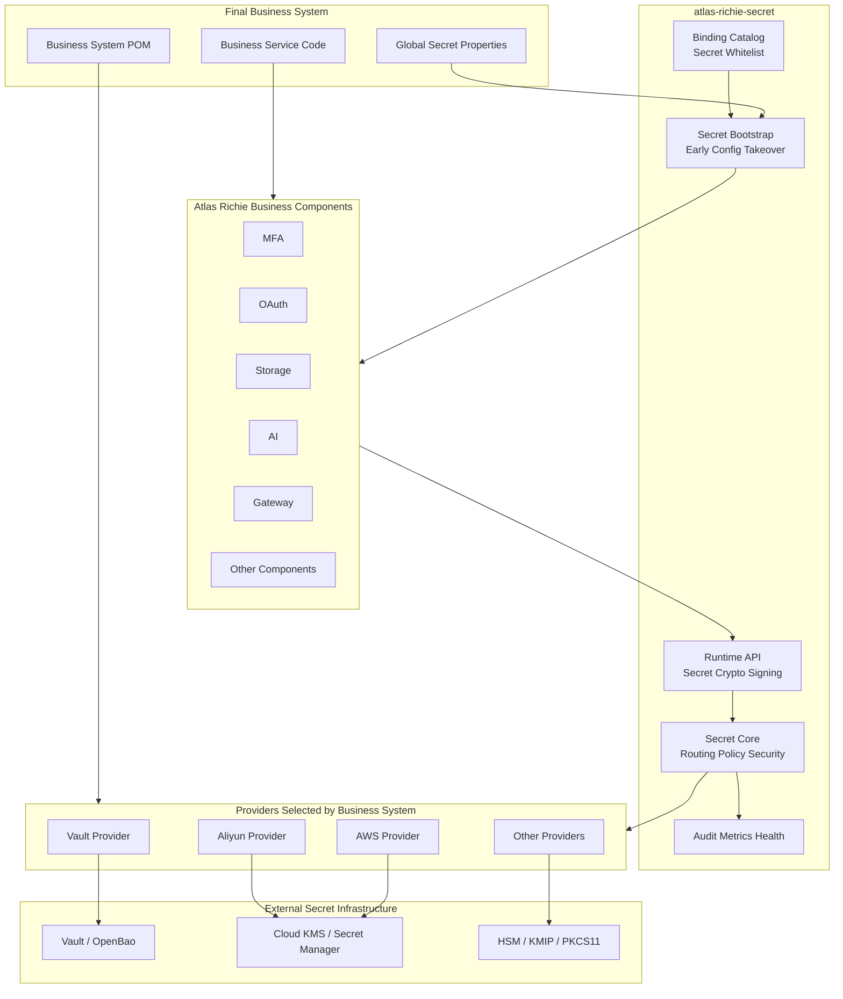

#### Responsibility Layering

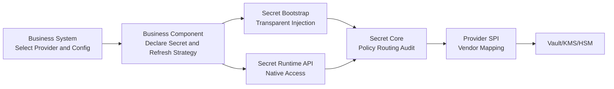

#### Data Plane and Control Plane

| Plane | Typical Operations | Enabled by Default | Permission Characteristics |
|---|---|---:|---|
| Bootstrap Data Plane | Read Secret Bundle at startup | Yes when Secret is enabled | Read-only |
| Runtime Data Plane | Read Secret, decrypt, sign | Yes by Capability | Use permissions |
| Refresh Plane | Read new version, replace snapshot | Explicitly configured | Read-only + events |
| Management Plane | Create/update Secret versions | Disabled by default | Write permissions |
| Key Admin Plane | Create, rotate, disable, delete Key | Separate module | Admin permissions |

Business applications by default only assemble the first three. Management plane and Key Admin plane must be enabled through independent dependencies, independent configuration, and stricter identities.

### Module and Dependency Architecture

#### Target Module Structure

```text
atlas-richie-secret-parent
├── atlas-richie-secret-api
├── atlas-richie-secret-bootstrap
├── atlas-richie-secret-core
├── atlas-richie-secret-spring-boot-starter
├── atlas-richie-secret-management
├── atlas-richie-secret-testkit
├── atlas-richie-secret-provider-vault
├── atlas-richie-secret-provider-openbao
├── atlas-richie-secret-provider-aws
├── atlas-richie-secret-provider-azure
├── atlas-richie-secret-provider-gcp
├── atlas-richie-secret-provider-aliyun
├── atlas-richie-secret-provider-tencent
├── atlas-richie-secret-provider-huawei
├── atlas-richie-secret-provider-volcengine
├── atlas-richie-secret-provider-kmip
└── atlas-richie-secret-provider-pkcs11
```

#### Module Responsibilities

| Module | Responsibility | Contains Vendor SDK |
|---|---|---:|
| `secret-api` | References, DTO, Capability, runtime Facade | No |
| `secret-bootstrap` | Early Provider SPI, Binding Catalog, PropertySource | No |
| `secret-core` | Routing, policy, envelope encryption, events, audit | No |
| `secret-spring-boot-starter` | Internal reuse module for Core auto-configuration; not required to be introduced separately by end applications | No |
| `secret-management` | Secret write, rotation orchestration, Key Admin extension | No/by interface |
| `secret-testkit` | Provider contract tests, fake Backend, fault injection | No |
| `secret-provider-*` | Vendor bootstrap-time and runtime implementation | Yes |

#### Dependency Direction

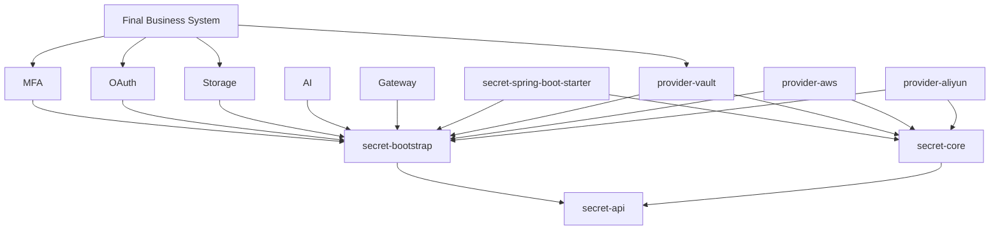

#### Mandatory Dependency Rules

- Business components may only depend on `secret-bootstrap` and necessary `secret-api`.
- Business components must not depend on any `secret-provider-*`.
- Providers must not depend backward on MFA, OAuth, Storage, AI, or Gateway.
- Core must not expose vendor SDK types in public APIs.
- Provider SDK versions are uniformly constrained by platform dependency management, but whether to introduce them is decided by the final business system.
- Provider end packages must transitively include the Bootstrap/Core/auto-configuration needed for runtime; final applications already using platform business components do not additionally need to introduce `secret-spring-boot-starter`.
- Providing a "mega Provider bundle" transitively introduced by all business components is forbidden.

### Enabled and Disabled State Model

#### State Definitions

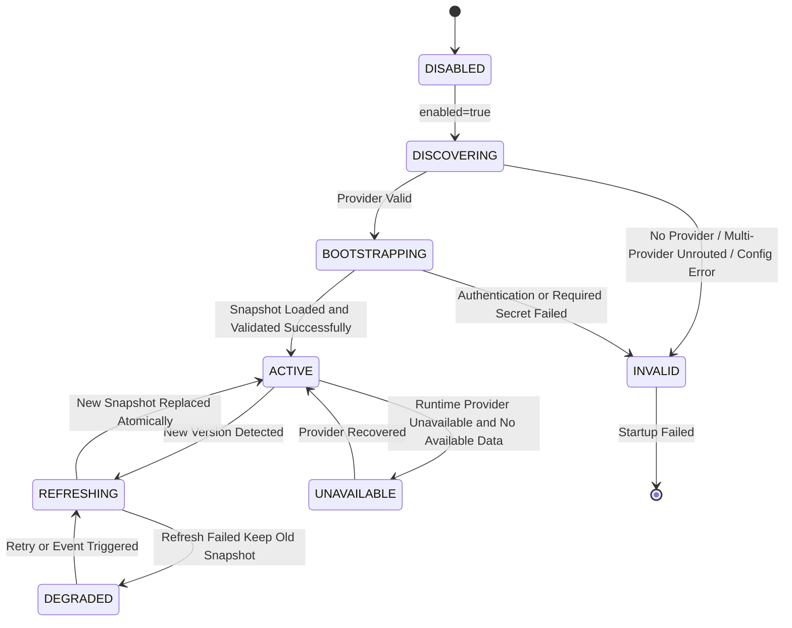

#### Disabled Contract

When `platform.component.secret.enabled` is missing or `false`:

- `AtlasSecretEnvironmentPostProcessor` only reads the switch and returns immediately.
- Does not discover or instantiate Providers.
- Does not load the Binding Catalog.
- Does not create a Secret PropertySource.
- Does not access network, file credentials, or instance metadata endpoints.
- Does not register refresh schedulers, listeners, HealthIndicators, or MeterBinders.
- Does not change the source or result of any existing `@ConfigurationProperties`.
- Does not require business systems to introduce Providers.
- Does not output Info/Warn logs; at most allows Debug-level "disabled" diagnostics.

#### Enabled Contract

When `enabled=true`:

- At least one bootstrap Provider Factory must be discovered.
- Single Provider auto-selects; multiple Providers must be explicitly routed.
- Bootstrap configuration must be validated before connecting to external services.
- Startup fails when required Secrets are missing.
- Under Strict Mode, local same-named secrets must not be used as fallback source.
- PropertySource must take effect before business component configuration binding.
- Runtime Backend must be consistent with bootstrap Provider identity and configuration.

#### Disabled Startup Sequence

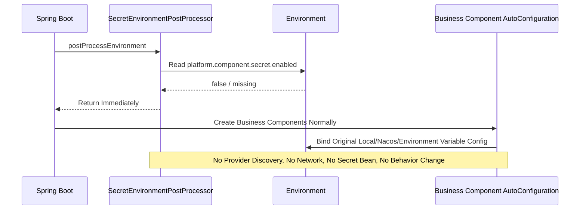

#### Enabled Startup Sequence

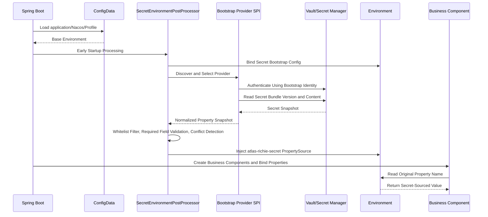

## 📎 🔐 Secret Core Mechanisms

### Bootstrap-Time Transparent Configuration Takeover

#### Why It Must Happen Before Context Refresh

When ordinary Spring AutoConfiguration creates Beans, many business components' `@ConditionalOnProperty`, `@ConfigurationProperties`, and SDK Clients have begun to evaluate or create. Modifying configuration at this point will cause:

- Conditional assembly judgment has already used old values.
- Properties can be rebound, but already-constructed clients will not be automatically rebuilt.
- Some Beans use Secrets, others use local values.
- Startup logs and exceptions may expose local secrets in advance.

Therefore, transparent configuration takeover must complete after ConfigData is loaded and before the ApplicationContext refreshes.

#### Processor Order

Target processor:

```text
cn.richie696.component.secret.bootstrap.AtlasSecretEnvironmentPostProcessor
```

Design order:

1. Spring Boot loads defaults, system, command line, and ConfigData.
2. Secret Processor executes after `ConfigDataEnvironmentPostProcessor.ORDER`.
3. Secret Processor uses the finally activated Profile and `spring.application.name` to compute the path.
4. Secret PropertySource joins the Environment before Context refresh.
5. Business AutoConfiguration starts conditional judgment and property binding.

The processor is registered through `META-INF/spring.factories` and uses the current Spring Boot 4.x `org.springframework.boot.EnvironmentPostProcessor`.

#### Bootstrap Context

The Processor uses `ConfigurableBootstrapContext` to save:

- Resolved read-only Bootstrap Properties.
- Selected `SecretBootstrapProviderFactory`.
- Bootstrap-time Provider Client.
- Loaded `SecretSnapshot`.

Runtime AutoConfiguration can take over the created thread-safe Client from the Bootstrap Context to avoid duplicate authentication and connections. If the vendor Client does not support transfer, close the bootstrap Client and create the runtime Client with the same configuration.

#### PropertySource Behavior

Target name:

```text
atlas-richie-secret[<providerId>:<snapshotVersion>]
```

The property source needs to carry:

- Provider ID.
- Secret Bundle logical path.
- Secret version, but must not carry Secret values.
- Load time and hash digest.
- Original vendor Request ID (internal audit only).

#### Loading Process

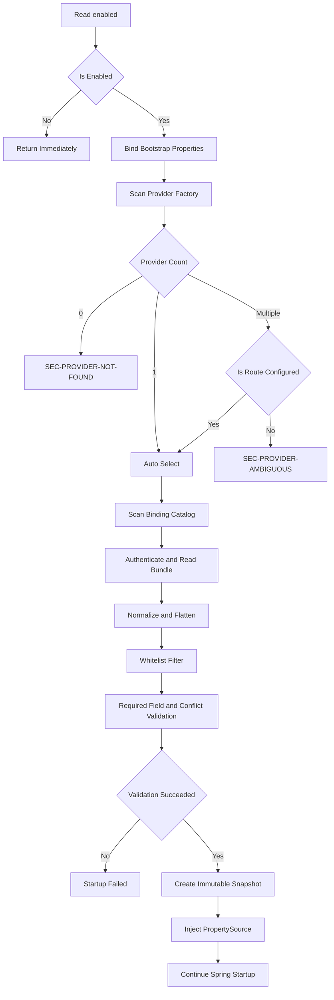

#### Secret Bundle Organization

Default context:

```text
atlas-richie/<environment>/<application>/common
atlas-richie/<environment>/<application>/components
atlas-richie/<environment>/<application>/<active-profile>
```

Loading order goes from general to specific; the latter overrides the former, but can only override an already-declared secret property. The Provider is responsible for mapping vendor paths, Secret names, and versions into a unified Bundle.

#### Preventing Configuration Injection from Expanding Permissions

Even if the Bundle contains the following properties, they must be discarded and security events recorded:

```text
server.port
spring.datasource.url
platform.component.secret.enabled
platform.component.oauth.enabled
platform.gateway.authentication.mode
management.endpoints.web.exposure.include
```

Unless these properties are explicitly added to the custom secret whitelist by the business system and do not belong to the forbidden override list. The responsibility of Secret is to provide secrets, not to remotely modify system security policies.

### Component Secret Catalog

#### Purpose

The Binding Catalog is the static contract between business components and Secret Bootstrap, answering four questions:

1. Which configuration properties belong to secrets?
2. Which secrets are required and what are the required conditions?
3. How do business components take effect after Secret changes?
4. Is exporting values to Spring Environment allowed?

#### File Location

Each business component Jar provides:

```text
META-INF/atlas-richie/secret-bindings.json
```

The reason for choosing JSON over Spring Beans is that the ApplicationContext has not been created yet at bootstrap, and the Processor must read static metadata directly from the classpath.

#### Metadata Model

```json
{
  "schemaVersion": "1",
  "component": "atlas-richie-storage-core",
  "bindings": [
    {
      "property": "platform.component.storage.object.access-key-secret",
      "logicalName": "storage.object.access-key-secret",
      "kind": "CREDENTIAL",
      "exposure": "PROPERTY_SOURCE",
      "requiredWhen": {
        "property": "platform.component.storage.object.engine",
        "in": ["aliyun_oss", "tencent_cos", "huawei_obs", "aws_s3"]
      },
      "refresh": "RECREATE_CLIENT",
      "owner": "storage"
    }
  ]
}
```

#### Field Definitions

| Field | Required | Meaning |
|---|---:|---|
| `schemaVersion` | Yes | Catalog format version |
| `component` | Yes | Declaring component Artifact ID |
| `property` | Yes | Existing Spring property full name |
| `logicalName` | Yes | Provider-independent logical name |
| `kind` | Yes | `CREDENTIAL`, `TOKEN`, `PASSWORD`, `PRIVATE_KEY`, etc. |
| `exposure` | Yes | `PROPERTY_SOURCE` or `NATIVE_HANDLE` |
| `requiredWhen` | No | Conditional required rules |
| `refresh` | Yes | Refresh strategy |
| `owner` | Yes | Audit and conflict locating owner |
| `allowLocalWhenDisabled` | No | Whether existing local values are allowed when disabled, default `true` |
| `allowLocalWhenEnabled` | No | Whether local values are allowed after enabling, production default `false` |
| `maxLength` | No | Input upper bound, used only for validation, does not record actual length |

#### Secret Types

| Kind | Example | Default Exposure |
|---|---|---|
| `API_KEY` | AI Provider API Key | `PROPERTY_SOURCE` |
| `ACCESS_KEY_ID` | Cloud vendor AccessKey ID | `PROPERTY_SOURCE` |
| `ACCESS_KEY_SECRET` | Cloud vendor Secret | `PROPERTY_SOURCE` |
| `PASSWORD` | FTP/SFTP/SMB/DB Password | `PROPERTY_SOURCE` |
| `CLIENT_SECRET` | OAuth Client Secret | `PROPERTY_SOURCE` |
| `TOKEN_SECRET` | HMAC Token Secret | `PROPERTY_SOURCE` or `NATIVE_HANDLE` |
| `SIGNING_KEY` | Gateway/OAuth Signing Key | `PROPERTY_SOURCE` or `NATIVE_HANDLE` |
| `ENCRYPTION_KEY` | Data encryption KEK | `NATIVE_HANDLE` |
| `PRIVATE_KEY` | Signing private key | `NATIVE_HANDLE` |
| `CERTIFICATE` | Certificate | `PROPERTY_SOURCE`/dedicated Certificate API |
| `USER_SECRET` | TOTP user secret | `NATIVE_HANDLE` |

#### Refresh Strategies

| Refresh | Meaning | Applicable Scenarios |
|---|---|---|
| `STATIC` | Load only at startup; changes require restart | Old components that do not support secure rebuild |
| `REBIND_PROPERTIES` | Rebinding Properties is enough | Real-time Property reading on each call |
| `RECREATE_CLIENT` | Atomically create new client and switch | Storage, HTTP SDK Client |
| `REFRESH_SERVICE` | Call component explicit `refresh()` | AI models and Key Pool |
| `DUAL_VERSION` | Old and new versions coexist for a period | OAuth signing, database credential rotation |
| `NATIVE` | Component reads directly by reference and version | MFA user Secret, dynamic credentials |

#### Catalog Merge Rules

- Same `property`, same metadata: deduplicate.
- Same `property`, different `kind/exposure`: startup fails.
- Same `logicalName` maps to multiple Properties: allowed, but must explicitly declare `shared=true`.
- Unrecognized Schema Version: startup fails, no speculative parsing.
- Custom business Catalog conflicts with platform Catalog: business system cannot override platform security classification, only supplement stricter rules.

Dynamic Map/List properties only allow two constrained placeholders: `{name}` matches a normalized kebab-case property segment, `{index}` matches non-negative numeric index. Placeholder patterns cannot declare `requiredWhen`; if a property matches multiple patterns at runtime, fail closed. Catalog does not accept `*`, `**`, arbitrary regex, or cross-property-segment matching, to prevent dynamic keys like AI model names from expanding into the injection permission of the entire configuration tree.

#### Catalog Validation Process

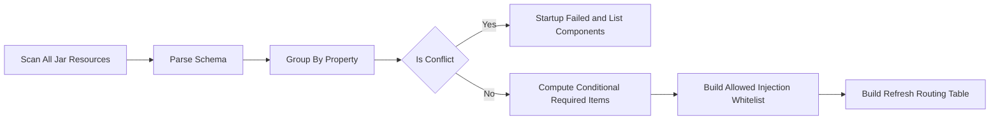

### Provider Discovery, Selection, and Lifecycle

#### Provider Package End Goal

Each `atlas-richie-secret-provider-*` is an independently introducible end-implementation package that contains at the same time:

1. Bootstrap Provider Factory.
2. Runtime Provider Factory/AutoConfiguration.
3. Vendor Properties validator.
4. Capability Descriptor.
5. Vendor exception to unified error code mapping.
6. Client lifecycle, TLS, proxy, timeout, and authentication implementation.
7. Provider Contract Test.
8. Least privilege example and operations documentation.

#### Single Provider Selection

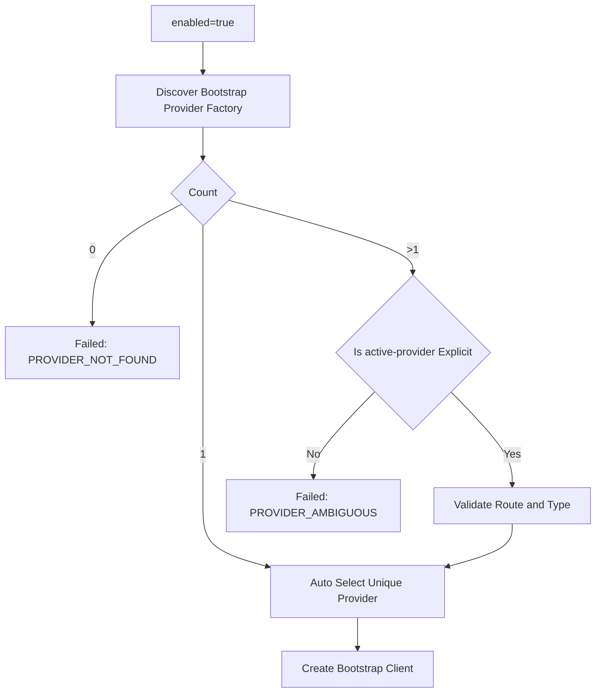

#### Provider Packages Cannot Self-Enable

Even if the business system introduces `provider-vault`, if `enabled=false`, the Provider must not create `VaultTemplate`, authenticate Token Supplier, Lease Scheduler, or Health Check. Whether to enable is decided only by the global Secret switch.

#### Client Lifecycle

- Client is singleton by default and reuses connection pools.
- Provider must declare whether Client is thread-safe.
- When Bootstrap Client and Runtime Client can be safely reused, they are transferred by Bootstrap Context.
- Provider Session is uniformly closed when Spring Context is closed.
- Authentication Token/STS Credential refresh is done internally by the Provider, not exposed to business components.
- Provider must not perform additional remote `isAvailable()` before each business call.

#### Provider Configuration Consistency

Bootstrap and runtime use the same immutable Provider Configuration Hash. If the runtime finds the configuration hash inconsistent, refuse to reuse the Bootstrap Client and record a configuration drift event.

#### Multi-Provider Routing

Routing is performed by Capability; temporary guessing based on business calls is forbidden:

```text
PROPERTY_SOURCE -> vault-primary
SECRET_READ     -> vault-primary
ENVELOPE_CRYPTO -> aws-kms
SIGNING         -> aws-kms
```

Each logical Key/Secret can also specify a fixed Backend, but it must be resolved into a routing table at startup; the runtime does not read arbitrary user input to decide Provider.

### Secret Store Design

#### Two Storage Modes

| Mode | Description | Applicable Backends |
|---|---|---|
| `REMOTE_STORE` | Secret values are stored in a dedicated Secret Store; applications read by reference | Vault KV, AWS/Aliyun/GCP Secrets Manager, Azure Key Vault Secrets |
| `ENCRYPTED_CONFIG` | Ciphertext is stored in YAML/Nacos/DB; decrypt at bootstrap or runtime by calling KMS | Environments with only KMS but no Secret Store |

KMS is usually responsible for keys and cryptographic operations, and is not naturally equivalent to any Secret storage. Providers must declare modes according to real capabilities.

#### Bundle Model

```java
public record SecretSnapshot(
        String providerId,
        String logicalPath,
        String version,
        Instant loadedAt,
        Map<String, SecretValue> values,
        SecretSnapshotMetadata metadata
) implements AutoCloseable {
}
```

Snapshots must be immutable. During refresh, build a complete new snapshot, replace it atomically via reference after validation, then destroy the old snapshot.

#### Bundle Flattening

Providers can return a flat Map or nested JSON. Core uses Spring Relaxed Binding compatible normalization rules to convert to property names, but uncertain conversion is forbidden:

- `accessKeySecret` and `access-key-secret` are unified to the canonical key.
- Lists use `[index]`.
- Map Keys retain original meaning and undergo path character validation.
- When the same canonical key is generated by multiple original fields, startup fails.

#### Version Selection

Production recommendations:

- Resolve explicit versions or controlled Alias at startup.
- Do not permanently bind all applications to `latest`.
- Rotation first creates a new version, then gradually modifies Alias/Stage.
- On validation failure, Alias can be rolled back to the old version, but old values must not be copied as "new latest" without audit records.

#### Secret Read Sequence

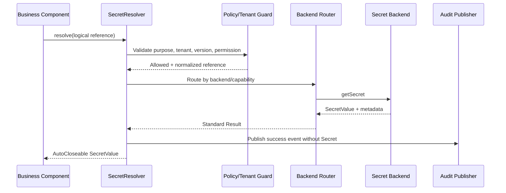

#### Secret Write

Write is not assembled by default. After enabling, still required:

- Specify expected old version or ETag to avoid blind overwrites.
- After new version is written, verify external dependencies first, then advance Alias.
- Delete uses soft delete / scheduled delete semantics; Provider clearly marks differences when unsupported.
- Any write and delete produce high-priority audit events.

#### Dynamic Credentials

Dynamic credentials are modeled separately from static Secrets:

```java
public record SecretLease(
        LeaseId id,
        SecretValue value,
        Instant expiresAt,
        boolean renewable
) implements AutoCloseable {
}
```

Leases must support renewal failure notification, expiration destruction, and active revocation. Dynamic credentials must not be injected into a permanently existing static PropertySource and then lose the lease lifecycle.

### Cryptographic Operations and Envelope Encryption

#### Default Algorithms

- Data encryption: AES-256-GCM.
- Nonce: 96-bit random value unique per DEK/message.
- Authentication Tag: 128 bit.
- DEK: 256 bit by default.
- Random source: platform secure random source or Provider data key API.
- ECB is forbidden.
- CBC, PKCS#1 v1.5, etc. are only allowed in explicit compatibility mode and not as default values for new data.

#### Why Default Envelope Encryption

- Cloud KMS direct encryption is usually suitable for small data and has size limits.
- Local AEAD handling of business data has more stable performance.
- KEK never leaves KMS/Vault/HSM in plaintext.
- When replacing KEK, only the DEK is rewrapped, no need to re-encrypt large business objects.
- Multiple Wrapped Keys can be saved for one DEK, achieving real disaster recovery decryption paths.

#### Encryption Flow

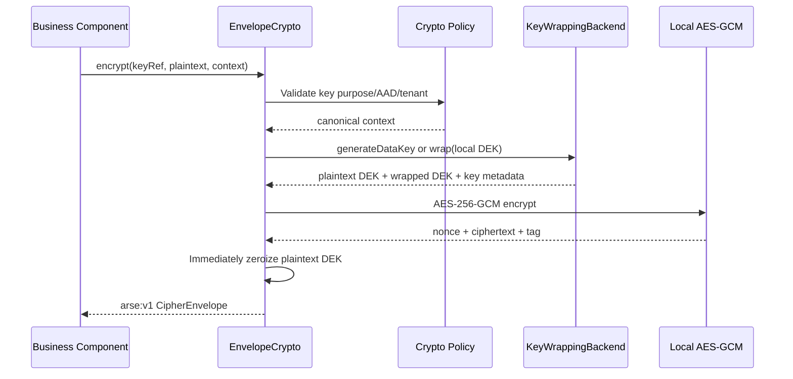

#### Decryption Flow

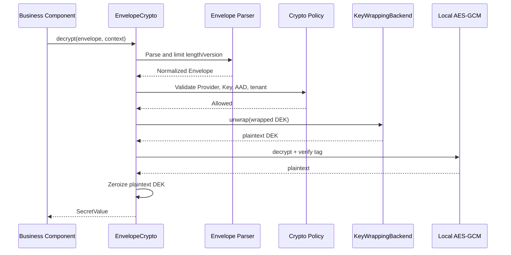

#### Ciphertext Format `arse:v1`

Logical structure:

```json
{
  "format": "arse",
  "version": 1,
  "key": {
    "logical": "oauth-signing",
    "version": "current",
    "purpose": "ENVELOPE_ENCRYPTION"
  },
  "wrapAlgorithm": "KMS_NATIVE",
  "contentAlgorithm": "AES_256_GCM",
  "wrappedDataKeys": ["base64..."],
  "nonce": "base64...",
  "ciphertext": "base64...",
  "tag": "base64...",
  "aadSchema": "atlas-context-v1"
}
```

`arse:v1` is a stable text envelope prefix; the internal version byte is currently V2; V1 only retains decryption compatibility. Binary encoding remains strict length-prefixed; the text form is `arse:v1:` plus URL-safe Base64 (no padding). V2 sequentially encodes Magic, version, content algorithm, logical Key Reference, wrap algorithm, Wrapped DEK, Nonce, and Ciphertext including GCM Tag, and incorporates logical Key, logical version, purpose, envelope version, algorithm, and nonce digest together with the caller's Context into AAD. V1 uses the old `arse\0v1\0AES_256_GCM\0` AAD rule and is only allowed for decryption; new writes and Rewrap uniformly generate V2. Rewrap will recompute AAD, generate new nonce and content ciphertext, so business ciphertext bytes are no longer promised to remain unchanged. Provider and physical Key ID are parsed by the Provider based on logical Key, version, and its own trusted configuration, and do not require business projects to know about them, nor allow business requests to inject them.

Implementations must:

- Have fixed Magic/Prefix and version.
- Have total length, field length, and collection count limits.
- Reject unknown critical fields and unsupported versions.
- Incorporate Header together with caller Context into AAD.
- Not accept arbitrary Endpoint, Region, or authentication configuration from the Envelope.

#### AAD Design

Default AAD Schema:

```text
application=<logical application>
environment=<environment>
purpose=<secret purpose>
tenant=<non-PII tenant identifier or pseudonym>
resourceType=<type>
resourceId=<non-sensitive stable identifier>
logicalKey=<canonical logical key>
keyVersion=<logical key version>
keyPurpose=<key purpose>
envelopeVersion=<envelope version>
algorithm=<content algorithm>
nonceSha256=<nonce digest>
```

AAD may enter cloud audit logs, so names, phone numbers, emails, IDs, Secrets, Tokens, and complete business payloads are forbidden.

#### Rewrap

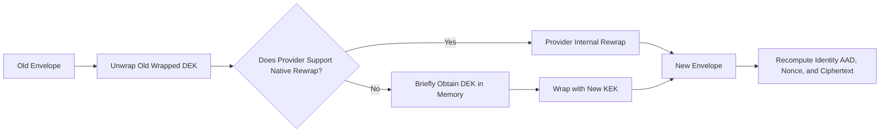

Cross-Provider Rewrap requires briefly unwrapping DEK within a trusted process and recomputing the content ciphertext for the identity AAD; business plaintext only briefly exists in component-controlled memory and is immediately zeroized thereafter. Operations must be individually authorized, audited, and batch-limited.

#### Data Key Cache

Disabled by default. If high-frequency MFA verification or low-latency scenarios truly require caching, it must:

- Be explicitly enabled and risk acceptance recorded.
- Use short TTL, max entry count, and active zeroization.
- Cache Key includes Provider, Key Version, Tenant, Purpose.
- Be invalidated immediately when key is disabled, rotated, or tenant is deactivated.
- Not use cache state as the basis for unlimited continued operation during KMS failure.

### Authentication and Bootstrap Trust Chain

#### Bootstrap Paradox

The application needs an identity to access the Secret system. If the access credentials themselves can only be read from the same Secret system, an unstartable recursion will form. The solution is to hand the initial identity to the runtime environment rather than the application configuration.

#### Recommended Authentication Order

| Provider | Recommended Production Authentication |
|---|---|
| AWS | EKS Web Identity, ECS/EC2 IAM Role, Default Credential Chain |
| Azure | Workload Identity, Managed Identity, DefaultAzureCredential |
| GCP | Workload Identity Federation, Attached Service Account, ADC |
| Alibaba Cloud | RAM Role, OIDC RAM Role, ECS Instance Role |
| Tencent Cloud | CAM Role, TKE Workload Identity / Temporary Credentials |
| Huawei Cloud | IAM Agency, Workload Identity / Temporary Credentials |
| Volcano Engine | IAM Role, STS Temporary Credentials |
| Vault/OpenBao | Kubernetes Auth, JWT/OIDC, AppRole + Response Wrapping, mTLS |
| KMIP/HSM | mTLS, hardware slot authentication, protected PIN source |

#### Static Credential Compatibility Mode

If the vendor or deployment environment cannot use Workload Identity, file mount, environment injection, or external Credential Process may be supported, but:

- Long-term Secret Keys in YAML are not accepted by default.
- Credential file permissions must be validated.
- File content, Token, or full path must not be logged.
- Expiration and refresh must be supported.
- A security alert metric is generated when static credentials are enabled in production.

#### TLS

- Production Endpoints must default to HTTPS/mTLS.
- Globally trusting all certificates and disabling hostname verification are forbidden.
- Custom CAs are configured through independent Trust Store.
- Certificate rotation must not require disabling verification.
- Endpoints can only come from Bootstrap configuration, not from business requests or Envelopes.

#### Least Privilege

Runtime application roles in principle only include:

- Read specified Secret paths/versions.
- Perform necessary operations such as Encrypt/Decrypt/GenerateDataKey/Sign on specified Keys.
- Read necessary Key Metadata.

Must not include by default:

- Create, import, export, delete Keys.
- Modify Policy/Role.
- Enumerate the entire Secret space.
- Read other applications' or tenants' namespaces.
- Enable/disable audit and modify retention policies.

### Multi-Tenancy and Namespace Isolation

> Implementation boundary: this section describes target architecture. Current 1.0 does not publish a `TenantContext`, tenant path resolver, or tenant-level AAD policy. Do not treat the model below as an active isolation control; deployment-level Provider policy, application/environment namespaces, and separate identities must provide isolation today.

#### Isolation Goals

- Tenant A cannot construct references to read Tenant B's Secrets.
- The same logical name maps to different namespaces in different tenants.
- Tenant identity must come from a trusted Tenant Context; ordinary request parameters cannot directly determine physical paths.
- Secret Backend IAM/Policy and in-application policy form defense in depth.

#### Namespace Model

```text
atlas-richie/<environment>/<application>/shared/<logical-name>
atlas-richie/<environment>/<application>/tenants/<tenant-token>/<logical-name>
```

`tenant-token` uses a normalized and length-limited stable identifier, using irreversible mapping when necessary; direct splicing of inputs containing `/`, `..`, URL-encoded separators is forbidden.

#### Key Granularity

Default recommendations:

- One KEK per environment + application + purpose.
- Tenant as AAD binding.
- Highly isolated or regulated tenants can be configured with independent KEKs.

Defaulting to creating multiple Cloud KMS Keys per tenant is not recommended, as it brings quota, cost, rotation, and policy operational pressure.

#### Tenant Access Flow

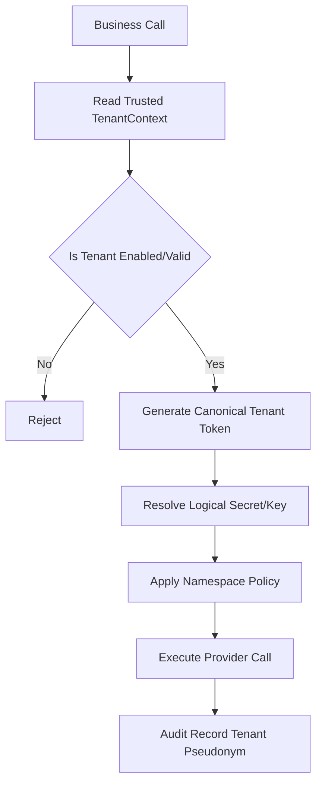

#### Shared Secrets

Shared Secrets must explicitly mark `scope=APPLICATION`; the tenant scope defaults to `TENANT`. It is forbidden to automatically fall back to a shared Secret when the tenant Secret cannot be found, unless the Binding Catalog explicitly declares an inheritance strategy.

### Dynamic Refresh, Rotation, and Client Rebuild

#### Refresh Goal

After the Secret version changes, the framework should securely and completely deliver new values to already running components, while avoiding partial configuration taking effect, connection interruption, and immediate invalidation of old versions.

#### Event Model

```java
public record SecretSnapshotChangedEvent(
        String previousProviderId,
        String previousVersion,
        String currentProviderId,
        String currentVersion,
        Instant changedAt
) {}
```

The event does not contain old or new values. If Spring Cloud Context exists, Core additionally bridges `EnvironmentChangeEvent`; if not, business components listen to Secret native events.

#### Atomic Refresh Flow

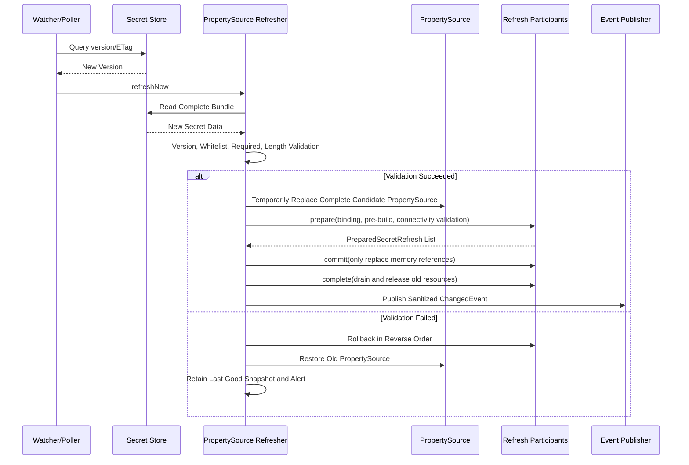

#### Two-Phase Refresh Internal Contract

Runtime refresh is coordinated by the Starter's internal `SecretRefreshParticipant` and `PreparedSecretRefresh`. Ordinary business systems do not inject or call these SPIs:

1. `prepare`: Bind business components' original Properties from the candidate `Environment`, complete format validation, pre-build SDK Client/Model/Key Pool/signer; candidate state must not be published.
2. `commit`: Only allowed to perform immutable snapshot or proxy delegate memory reference switching; no network I/O may be initiated.
3. `rollback`: When any subsequent participant fails, restore old references in reverse order and release unused candidate resources.
4. `complete`: After all participants commit, drain in-flight requests, release the previous generation connection pool/client; cleanup exceptions only alert, do not roll back already consistently committed new versions.

The executor uses a single-thread fixed-delay poll; only when `platform.component.secret.enabled=true` and `refresh.enabled=true` is the daemon thread created. `refreshNow` within the same instance executes serially; when neither Provider nor version changes, return directly, no client rebuild, no event publishing.

The current business domain commit units are as follows:

| Business Domain | prepare | commit | rollback/complete |
| --- | --- | --- | --- |
| Storage | Execute validate/create/afterPropertiesSet for all registered non-Local engines | Replace type proxy, object proxy, Normalizer and Engine ID within the same critical section | Roll back all references; after success acquire proxy write lock, wait for in-flight calls to exit then destroy old engine |
| AI | Isolate build Chat Client, Key Pool, five multimodal models and STS signer list; reject if any configuration item fails to build | `AtomicReference`/immutable Map publish complete generation | Roll back Chat/Model/Pool/signer generation; close old Pool immediately if not borrowed, delay recycling otherwise |
| Gateway | Only bind and validate authentication Secret | Write `volatile secretKey` | Restore previous Secret; algorithm, routing, and security switch do not participate in Secret refresh |
| OAuth HMAC | Bind new Token Secret and verify window is positive | Current version used for new signing, previous version records expiration time | Roll back current/previous version and Properties; after window ends, old version no longer participates in verification |
| OAuth RSA/OIDC | Authorization server loads complete new Key Material first | Signer atomically replaces current/previous KeyWindow | Access Token verification selects current/previous public key by `kid`; JWKS only publishes two public keys within window |

#### Component Refresh Is Not Equivalent to Properties Rebinding

`@ConfigurationProperties` rebinding can only change configuration objects. Already-constructed SDK Clients, connection pools, signers, and Key Pools may still hold old values. Therefore each Binding must declare a Refresh Strategy, and business components must provide the corresponding Refresher.

#### Dual-Version Rotation

Applicable to OAuth signing keys and database credentials:

1. Create new version.
2. Verify new version is usable.
3. New writes/signing use new version.
4. Old version continues to decrypt/verify or accept connections.
5. Wait for token TTL, connection drain, or grayscale window.
6. Disable old version.
7. Plan deletion after observation.

OAuth defaults to `platform.component.oauth.signing-key-verification-window=2h`; production configuration must be no less than the longest Access Token/ID Token TTL in the system (and should include allowed clock skew). HMAC rotation is automatically driven by Secret refresh participants; RSA Access Token and OIDC ID Token Key Material usually come from non-exportable KMS/HSM or authorization-server dedicated loaders, so they do not enter the general string PropertySource, but are called by that loader through the signer's controlled rotation entry. Regardless of source, new signing only uses current; verification/JWKS accepts both current and previous within the window; after the window ends, previous automatically disappears from verification candidates and JWKS.

#### Refresh Failure Strategy

- Startup first-load failure: Fail Closed, application does not start.
- Runtime new version load failure: Retain Last Good Snapshot and alert.
- Current snapshot forcibly revoked remotely: When security incidents are involved, continued use indefinitely is not allowed.
- Client rebuild failure: Keep old client, half-switching is forbidden.
- Multi-instance applications: Prioritize event broadcast; polling must include random jitter to avoid hitting Provider simultaneously.

#### Semantics of Deleted Values

After deleting configuration values, ordinary `EnvironmentChangeEvent` may not enable all Beans to correctly perceive "property does not exist". Secret Refresh uses complete snapshot replacement, and component Refreshers explicitly handle deletion, not relying solely on field rebinding.

### Fault Tolerance, Degradation, and Disaster Recovery

#### Fault Classification

| Fault | Example | Default Handling |
|---|---|---|
| Configuration Error | Endpoint, Region, Mount missing | Startup failure |
| Authentication Error | Token expired, Role lacks permission | Startup failure / runtime circuit breaking alert |
| Secret Missing | Required field does not exist | Startup failure |
| Temporary Network Error | Timeout, 5xx, rate limiting | Bounded retry + circuit breaking |
| Permanent Permission Error | 403, Key disabled | No retry, clear failure |
| Ciphertext Corruption | Tag verification failed, format error | Security error, no degradation |
| New Version Error | Format invalid, client cannot connect | Retain old snapshot |
| Provider Unavailable | Vault/KMS down | Handle by operation and available snapshot, no plaintext fallback |

#### Retry Rules

- Only retry on errors explicitly identified as temporary by the vendor.
- Use exponential backoff, max attempts, and random jitter.
- Secret Read, Metadata, Decrypt are safely retryable.
- Encrypt retry may produce multiple legal ciphertexts; return only the final successful result and record call count.
- Create, Rotate, Delete must use idempotent Token/ETag or forbid automatic retry.

#### Circuit Breaking

Circuit breaking is isolated by Provider + Capability dimension. Secret Store failure must not automatically break local AES-GCM; AWS Signing failure must not block Vault KV reading.

#### Transparent Failover Limitations

Decryption Provider can only be switched when one of the following conditions is met:

1. The same DEK has been wrapped by both primary and backup KEKs, and the Envelope contains multiple Wrapped DEKs.
2. The Provider natively provides verified multi-region/replica Keys.
3. Controlled cross-Provider Rewrap is completed and the new Envelope is persisted.

Configuring only one backup Provider does not enable it to decrypt another Provider's ciphertext.

#### Multi-Wrap Disaster Recovery

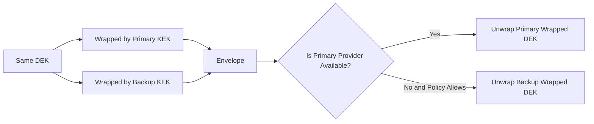

The use of backup Keys must have independent audit, alerting, and policy permission, and cannot occur silently.

#### Local Cache Boundary

- Loaded configuration-type Secret Snapshot can serve as the runtime Last Good Snapshot.
- Snapshot must not be persisted to disk plaintext cache.
- After application restart, must still be fetched from Provider, not depending on last in-memory state.
- Dynamic credentials must not continue to be used indefinitely after expiration due to Provider failure.

### Security Design and Threat Model

#### Protected Assets

- Secret plaintext.
- Unwrapped DEK.
- Asymmetric private keys and HMAC Keys.
- Bootstrap Token, temporary cloud credentials, mTLS private keys.
- Secret/Key paths, tenant mapping, and version relationships.
- Provider Policy and access audit.

#### Trust Boundary Diagram

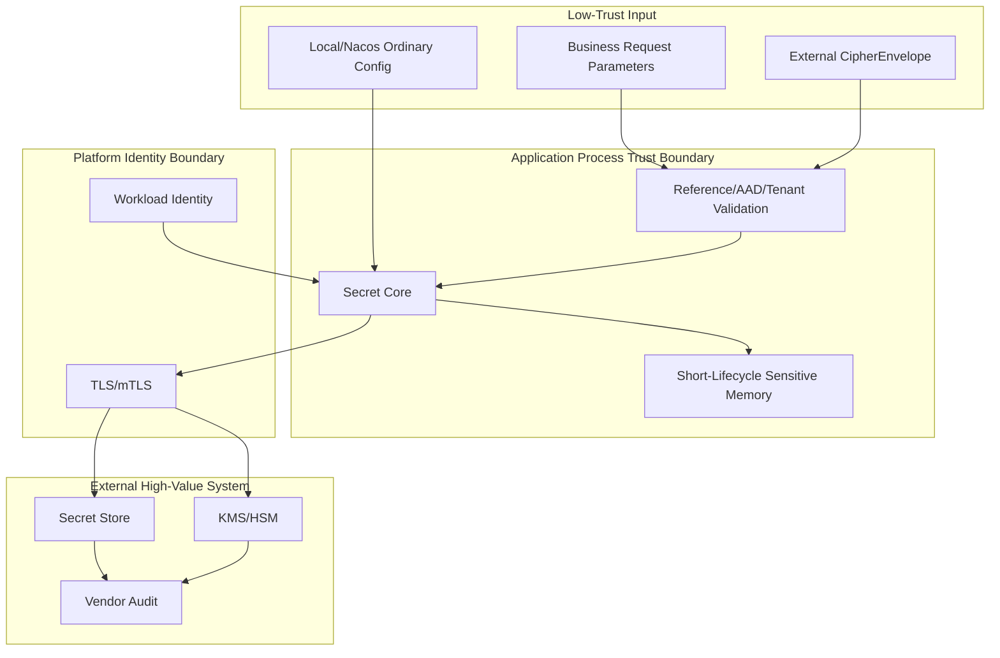

#### Threats and Controls

| Threat | Control |
|---|---|
| Local plaintext overrides Secret | Strict Mode, managed property Secret priority, duplicate source detection |
| Secret Bundle modifies ordinary security configuration | Catalog whitelist + forbidden override list |
| Cross-tenant path injection | Trusted Tenant Context, structured reference, path normalization |
| Malicious Envelope pointing to attacker Endpoint | Endpoint only from Bootstrap, Key Allowlist |
| Ciphertext tampering | AES-GCM Tag + Header/AAD binding |
| AAD leaking PII | Schema whitelist, log check, forbidden sensitive fields |
| Provider SDK exception leaking Secret | Unified exception mapping and message cleaning |
| Log/Actuator exposure | `toString` sanitization, SanitizingFunction, default hidden value |
| SSRF | Endpoint not business input, Scheme/Host Allowlist, disable arbitrary redirects |
| Long-term AK/SK leakage | Workload Identity priority, static mode alert |
| Bootstrap identity permission too large | Runtime/management identity separation, least privilege template |
| Provider pseudo-implementation | Contract Test forbidding plaintext equivalence, real E2E |
| Memory dump | Short-lifecycle array, disable Heap Dump or encryption protection, operations access control |
| Supply chain conflict | Provider SDK isolation, BOM, dependency scanning and signed artifacts |
| Replay old Secret version | Version policy, Alias advance, minimum version constraint |

#### Log Rules

Allowed to record:

- Provider ID, Capability, logical Key name.
- Normalized error code, elapsed time, Request ID.
- Irreversible digest or non-sensitive Alias of Secret Version.
- Tenant pseudonym.

Forbidden to record:

- Secret, Token, Password, Private Key, DEK.
- Full Ciphertext and Wrapped DEK.
- URIs that may contain username/password.
- Vault Token, cloud temporary credentials.
- Original request Body or Provider original exception Body.

#### Actuator

- `/env`, `/configprops` maintain the `show-values=never` recommended value.
- Register a `SanitizingFunction` based on the Binding Catalog to forcibly clean Secret properties even if the business system changes to `when-authorized` or `always`.
- Health Details must not contain the Endpoint full path, Secret path, and Policy content.
- It is forbidden to override managed secrets by writing Environment through Actuator.

## 🚀 Business Component Integration Guide

### Middleware Business Component Integration Specification

#### Overall Principles

Components like MFA, OAuth, Storage, AI, Gateway uniformly introduce the lightweight `atlas-richie-secret-bootstrap`, but must not select a specific Provider. Business components only do three things:

1. Declare which existing properties are secrets.
2. Declare the refresh strategy after Secret is enabled.
3. Use native APIs for non-exportable Keys or user-level Secrets.

#### Integration Architecture

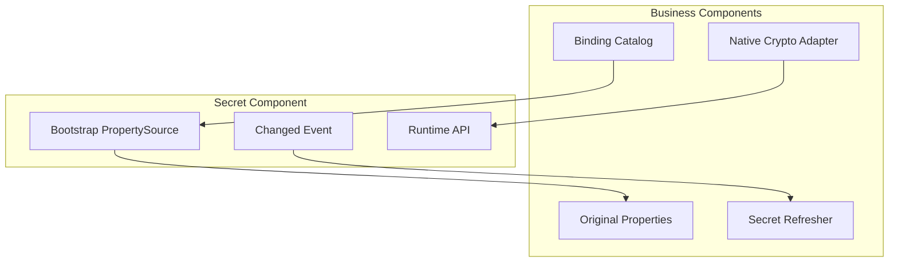

#### Storage

Transparent properties:

- Object storage Access Key ID/Secret.
- FTP/SFTP/SMB Password.
- Proxy authentication information.

Refresh strategy: `RECREATE_CLIENT`. Use existing Storage Registry/Proxy to first create and validate new client, then atomically replace Delegate; old client waits for in-flight requests to end before closing.

Priority note: If the cloud SDK supports Workload Identity, it is recommended not to save AK/SK; Secret is only used as the credential source when Workload Identity cannot be used.

The vendor SDK default credential chain is the bootstrap identity boundary, not a fallback for managed business plaintext. Environment-variable AK/SK remains a deliberately supported development/emergency source, while production policy must constrain the chain to workload or instance identity. Provider failure never causes managed Secret values to fall back to local configuration.

#### AI

Transparent properties:

- API Key, API Key Pool.
- Secret ID/Secret Key.
- App Code, Vendor Token.

Refresh strategy: `REFRESH_SERVICE`. Reuse existing AI Refresh mechanism to rebuild Model, Signer, and Key Pool; only rebinding Properties while retaining the old pool is forbidden.

#### Gateway

Transparent properties:

- Internal Token/HMAC Secret.
- Third-party OAuth Client Secret.
- Certificate passwords that need to be loaded.

Refresh strategy is divided by purpose: ordinary Client Secret can use `REBIND_PROPERTIES`/rebuild client; signing keys use `DUAL_VERSION`. Security authentication mode and routing switch do not belong to the Secret whitelist.

#### OAuth

- Exportable external Client Secret can be through PropertySource.
- Authorization Server private key prefers `SigningService` and non-exportable `KeyReference`.
- Rotation must allow old public keys to continue verifying until all Tokens expire.
- JWKS simultaneously publishes current and still in verification window old Keys.

#### MFA

- MFA Provider connection configuration is uniformly migrated to the Secret component.
- User TOTP Secret is business data, not application global property; business side only uses `SecretOperations` facade.
- Plaintext Secret must not be returned when KMS is unavailable.
- Local Crypto only exists in test Provider and cannot be used as production default value.

#### Other Components

Any new component containing Password, Token, API Key, Private Key, Certificate Password must simultaneously submit Binding Catalog and sanitization/refresh tests; it cannot just add a `String secret` field.

#### Business Component Acceptance Matrix

| Scenario | Required Result |
|---|---|
| Provider not introduced + Secret disabled | Start normally, behavior consistent with before refactoring |
| Provider introduced + Secret disabled | Start normally, no Provider network access |
| Secret enabled + Provider missing | Startup fails, error message actionable |
| Secret enabled + Bundle correct | Component uses Secret values |
| Secret enabled + Required value missing | Startup fails, no fallback to local values |
| Secret refresh success | Client/service atomically switches by strategy |
| Secret refresh failure | Retain old instance and alert |

### MFA Migration Design

This project is built as a brand new system; there is currently no historical MFA data; therefore no historical batch migration, dual-write observation window, or backfill tasks are arranged. The following sections only retain the security boundaries of the new write path, for future projects with existing data to be set up separately.

#### Migration Goals

Remove MFA's internal generic implementation responsibilities for Vault, Cloud KMS, HSM, and Local Crypto; MFA only retains TOTP Secret generation, binding, verification, and business lifecycle.

#### Current Risk Handling

Must identify and prohibit before migration:

- Cloud KMS placeholder implementation returns Base64 plaintext.
- `isAvailable=false` causes encryption to return plaintext.
- Vault automatically creates Transit Key at startup.
- Long-term storage of cloud Access Key Secret in configuration.
- Interface mixes Secret CRUD with KMS encryption/decryption.

#### Target Storage Strategy

Recommend storing TOTP Secret as `arse:v1` envelope ciphertext in MFA database:

- Database stores business ciphertext, Wrapped DEK, and Key Metadata.
- KEK only exists in Vault/KMS/HSM.
- Provider switching is done through Rewrap.
- Database leakage cannot directly obtain TOTP Secret.

If customers explicitly require Secrets not to enter the business database, Vault KV/Secret Manager reference mode can be selected, but network dependency, latency, cost, and cache risk of each verification must be evaluated.

#### Compatibility Bridge

During migration, provide:

```text
MfaKeyManagementBridge
```

Bridge the old MFA interface to the new `SecretOperations` facade, only as a transition; new callers must not directly depend on low-level Crypto/SPI.

Current Stage 3 implementation constraints:

- When Secret is disabled, old `KeyManagementProvider`, Vault/KMS/Local configuration, and read paths remain unchanged.
- When Secret is enabled, MFA's own old Provider is not instantiated, and `MfaKeyManagementBridge` serves as Primary compatibility bridge.
- New bindings write `arse:v1` envelope to `mfa_user_info.secret_reference`; old mode can still save external logical reference in that column.
- Verification end prefers reading `secret_reference` from record or cache; when historical record is empty, only deterministic old path under Secret disabled old mode is used.
- Existing Vault/Redis old references must not be guessed or silently treated as plaintext after Secret is enabled; must be switched after explicit migration in Stage 5.
- MFA only holds the fixed logical Key `mfa.totp.data-key`; physical Key mapping is provided by the final business system in Provider `key-bindings`.

#### Data Migration State Machine

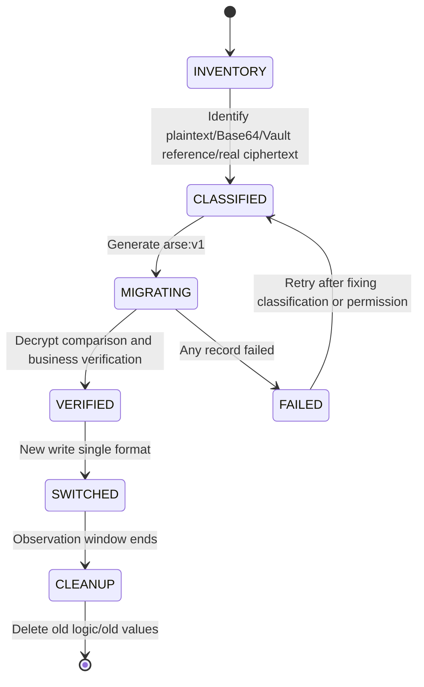

#### Migration Constraints

- Do not automatically guess whether a Base64 string is real ciphertext.
- Each old format must have explicit type or reliable evidence.
- Backup before migration, migration task idempotent, save record-level state but not plaintext.
- During dual-read, only "new format priority, known old format compatibility" is allowed; arbitrary unknown values must not be treated as plaintext.
- New write only writes `arse:v1` from the start of migration.
- Engineering has provided `MfaSecretMigrationService`: limited by `batchSize`, supports `dryRun`, failed records retryable, only persists new references and returns count; before actual switching, backup, old Provider read permission verification, and target Provider E2E must still be completed.
- Cleaning up old Key/Secret must wait for full verification and rollback window.

## 📚 Interface Detailed Specification

### Core API and SPI

#### API Layering

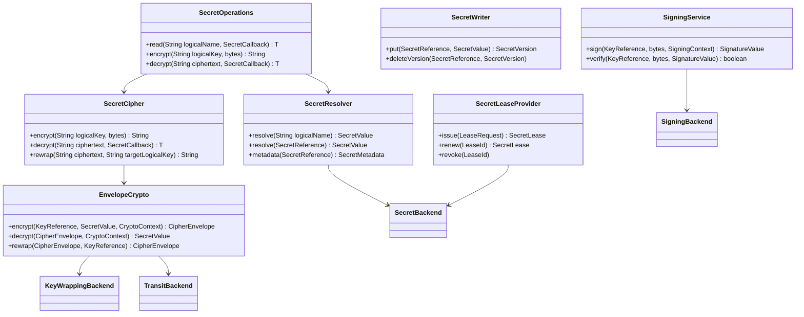

### Actual Public Boundary for Non-Exportable Key Signing/Verification

The `SigningService` in the diagram above now corresponds to the runtime capability in source code. The business side does not touch `KeyReference`, Provider SDK, physical Key name, or private key; the minimum call surface is:

```java
SignatureValue signature = secretOperations.sign("oauth.signing", payload);
boolean valid = secretOperations.verify("oauth.signing", payload, signature);
```

`SignatureValue` is a Provider-independent unparseable value object. The Provider can retain the signing format, key version, and rotation information required by Transit/KMS/HSM in its encoded value; the business side can only save, transmit, and return it, and cannot disassemble or modify it. The private key never enters application memory through `read`, configuration properties, or callbacks.

Core internally maps logical Key to `KeyPurpose.SIGNING` through the `SigningBackend` SPI, and then hands it to the Provider for signing and verification. Provider Session only registers `SigningService` when both `SIGN` and `VERIFY` are declared; when capabilities are insufficient, calls fail fast, and fallback to local private keys, plaintext, or ordinary `encrypt/decrypt` is forbidden.

```mermaid
sequenceDiagram
    participant B as Business Component
    participant O as SecretOperations
    participant S as SigningService
    participant P as SigningBackend
    participant V as Vault/KMS/HSM

    B->>O: sign(logicalKey, payload)
    O->>S: sign(logicalKey, payload)
    S->>S: Construct SIGNING KeyReference
    S->>P: sign(KeyReference, payload, context)
    P->>V: Provider Native sign
    V-->>P: opaque signature
    P-->>S: SignatureValue
    S-->>O: SignatureValue
    O-->>B: SignatureValue
    B->>O: verify(logicalKey, payload, signature)
    O->>S: verify(logicalKey, payload, signature)
    S->>P: verify(KeyReference, payload, signature)
    P->>V: Provider Native verify
    V-->>P: valid/invalid
    P-->>O: boolean
    O-->>B: boolean
```

Vault Transit currently uses `/transit/sign/:key` and `/transit/verify/:key`; OpenBao uses the compatible `v1/{mount}/sign/{key}` and `v1/{mount}/verify/{key}`. Cloud KMS/HSM Providers must connect through the same SPI, and `SIGN`, `VERIFY` can only be added to the capability declaration when actually implemented.

#### `SecretReference`

```java
public record SecretReference(
        String logicalName,
        SecretVersionSelector version,
        String field
) {
}
```

Constraints:

- `logicalName` is the stable logical name agreed by business and platform; Provider is responsible for mapping vendor paths.
- `version` supports `latest`, fixed version, Stage/Alias, but production configuration-type secrets prefer fixed or grayscale Alias.
- `field` is only used for structured Secret Bundle and must undergo allowlist validation.
- Backend selection, application/tenant namespace, and physical path do not enter the project API; Core constructs them based on configuration and trusted context.

#### `KeyReference`

```java
public record KeyReference(
        String logicalKey,
        String version,
        KeyPurpose purpose
) {
}
```

The project only declares logical Key, logical version, and purpose. Physical identifiers such as ARN, Vault Transit Key, and Cloud Key Resource can only exist in Provider configuration or Provider private Handles; business API, external requests, and business database fields must not determine Endpoint, account, or physical Key ID.

#### Project API and Extension SPI Boundary

Ordinary business projects only inject `SecretOperations`. The default facade only retains `read/encrypt/decrypt`, returns an `arse:v1` string that can be directly persisted, and provides temporary plaintext within a controlled lifecycle through `SecretCallback`; the caller does not need to manage `SecretValue`, assemble `KeyReference`, construct `CryptoContext`, parse `CipherEnvelope`, or choose wrap algorithm. Metadata, Rewrap, write, and Key management belong to the dedicated extension surface and do not enter the default business facade.

`SecretResolver`, `SecretCipher`, `SecretValue`, `CryptoContext`, `EnvelopeCrypto`, `CipherEnvelope`, `KeyWrappingBackend`, `SecretBackend`, `SecretProviderFactory`, and Bootstrap SPI are Core/Provider extension contracts. Provider implementations can understand vendor capabilities and physical identifiers, but must not propagate this knowledge back to business projects.

#### `SecretValue`

```java
public interface SecretValue extends AutoCloseable {
    byte[] copyBytes();
    char[] copyChars();
    int size();
    boolean destroyed();
    @Override void close();
}
```

Design requirements:

- Internally prefer overwritable `byte[]/char[]`.
- After `close()`, overwrite the internal array and refuse to read again.
- `toString()` always returns sanitized identifier.
- Implicit JSON serialization is not provided.
- Copy calls must be explicit; caller is responsible for zeroizing copies as soon as possible.
- Java GC, JIT, and third-party SDKs may produce uncontrollable copies; documentation must not claim absolute memory erasure.

#### Capability

```java
public enum SecretCapability {
    SECRET_READ,
    SECRET_WRITE,
    SECRET_VERSIONING,
    SECRET_DELETE,
    DYNAMIC_CREDENTIAL,
    LEASE_RENEW,
    DIRECT_ENCRYPT,
    DIRECT_DECRYPT,
    DATA_KEY_GENERATE,
    KEY_WRAP,
    KEY_UNWRAP,
    REWRAP,
    SIGN,
    VERIFY,
    HMAC,
    RANDOM,
    KEY_ROTATE
}
```

The business Facade checks Capability before calling; the Provider Testkit must perform positive and negative contract tests on each declared capability.

#### Bootstrap SPI

```java
public interface SecretBootstrapProviderFactory {
    String providerType();
    boolean supports(BootstrapSecretProperties properties);
    Set<SecretCapability> capabilities();
    SecretBootstrapClient create(
            BootstrapSecretProperties properties,
            BootstrapContext context);
}
```

Bootstrap SPI is discovered through `ServiceLoader` or dedicated Spring Factory and cannot depend on ordinary Spring Beans because the ApplicationContext has not been created yet.

#### Runtime SPI

```java
public interface SecretProviderFactory {
    String providerType();
    SecretProviderDescriptor descriptor();
    SecretProviderSession open(SecretProviderConfiguration configuration);
}
```

`SecretProviderSession` holds thread-safe clients and each Capability Backend, uniformly implementing `AutoCloseable`.

#### Management API Isolation

`SecretWriter`, `KeyLifecycleAdmin` do not enter the default Starter. If the business runtime only needs to read, write and Key Admin auto-configuration should not exist on the classpath, preventing misinjection and permission expansion.

## 🔧 Core Capabilities

### Provider Support Matrix and Evolution Order

#### Target Support Matrix

| Provider | Secret Store | Direct Crypto | Data Key/Wrap | Sign/Verify | Dynamic Secret | First Phase |
|---|---:|---:|---:|---:|---:|---|
| HashiCorp Vault | KV v2 | Transit | Transit Datakey | Yes | Database, etc. | M1 |
| AWS | Secrets Manager | KMS | GenerateDataKey/ReEncrypt | Yes/HMAC | Rotation Integration | M1 |
| Alibaba Cloud | Secrets Manager | KMS | GenerateDataKey | Yes | Partial Dynamic/Rotation | M1 |
| Azure | Key Vault Secrets | Key Vault/Managed HSM | Wrap/Unwrap | Yes | Version/Rotation | M2 |
| Google Cloud | Secret Manager | Cloud KMS | Local DEK + KMS Wrap | Yes/MAC | Version/Rotation Workflow | M2 |
| Tencent Cloud | SSM/KMS Companion | KMS | GenerateDataKey | Yes | Per Official Capability | M2 |
| Huawei Cloud | CSMS/DEW Companion | DEW KMS | GenerateDataKey | Yes | Per Official Capability | M2 |
| Volcano Engine | Routed to another Provider | KMS Encrypt/Decrypt | Encrypt/Decrypt | Yes | KMS only in this adapter | M2 |
| OCI Vault | Vault Secrets | OCI Vault/KMS | Wrap/Unwrap | Per Service Capability | Version/Rotation | M2 |
| IBM Key Protect | None (Current Package) | Key Protect | Wrap/Unwrap | Per Service Capability | No | M2 |
| Baidu Cloud KMS | None (Current Package) | KMS | Wrap/Unwrap | Per Service Capability | No | M2 |
| OpenBao | KV | Transit | Transit Datakey | Yes | Database, etc. | M3 |
| OpenStack Barbican | Secret/Container | Per Plugin | Per Plugin | Per Plugin | No/Extension | M3 |
| KMIP 2.1 | Key Object | Yes | Wrap/Unwrap | Yes | No | M3 |
| PKCS#11 HSM | Key Object | Local Hardware Operation | Wrap/Unwrap | Yes | No | M3 |

#### Vendor Signing and Workload Identity Compatibility Matrix

This matrix describes the authentication/signing boundaries that the code has already converged on; the Real Environment column must be executed after the target account, identity Agent, certificate, and middleware instance are available; Contract Test cannot replace the production compatibility conclusion.

| Provider | Workload Identity / Credential Entry | Request Signing or Protocol | TLS/Proxy Boundary | Code Status | Real Environment Status |
|---|---|---|---|---|---|
| AWS | SDK Default Chain, EKS/ECS/EC2 Role | AWS SDK Native Signing | SDK HTTPS | Contract | Pending Real Cloud Account |
| Alibaba Cloud | Default Chain, RAM Role/ACK/ECS | SDK Native Signing | SDK HTTPS | Contract | Pending Real Cloud Account |
| Azure | Bearer, Token File, Managed Identity Agent | No General HMAC | TrustStore/Proxy | Wire/Contract | Pending Real Cloud Account |
| GCP | Bearer, Token File, Workload Identity Agent | No General HMAC | TrustStore/Proxy | Wire/Contract | Pending Real Cloud Account |
| OCI | Bearer, Token File, Instance/Resource Principal Agent | No General HMAC | TrustStore/Proxy | Wire/Contract | Pending Real Cloud Account |
| IBM Key Protect | Bearer, Token File | No General HMAC | TrustStore/Proxy | Wire/Contract | Pending Real Cloud Account |
| Tencent Cloud | AccessKey, Token File / Identity Agent | TC3-HMAC-SHA256 | TrustStore/Proxy | Signing Contract | Pending Real Cloud Account |
| Huawei Cloud | AccessKey, Token File / Agency Agent | SDK-HMAC-SHA256 | TrustStore/Proxy | Signing Contract | Pending Real Cloud Account |
| Volcano Engine | AccessKey, Token File / Identity Agent | HMAC-SHA256 | TrustStore/Proxy | Signing Contract | Pending Real Cloud Account |
| Baidu Cloud KMS | AccessKey, Token File / Identity Agent | BCE v2 | TrustStore/Proxy | Signing Contract | Pending Real Cloud Account |
| OpenBao | Token, Token File; Other authentication exchanged by Agent for Token | OpenBao HTTP/KV/Transit | TrustStore/Proxy | OpenBao 2.6.2 Docker E2E | Target environment renewal/rotation pending acceptance |
| Barbican | Bearer, Token File | Barbican REST | TrustStore/Proxy | Protocol Gate | Machine lacks Keystone/Barbican service stack |
| KMIP 2.1 | mTLS Client Certificate | KMIP TTLV | mTLS; no built-in HTTP proxy | Local TLS/TTLV Connectivity | PyKMIP AES KWP capability insufficient; target KMIP pending acceptance |
| PKCS#11 HSM | Token/PIN, numeric slot | HSM/JCA Sign/Verify | Local interface; no HTTP proxy | SoftHSM2 E2E | Real HSM pending acceptance |

The unified REST Transport has implemented bootstrap-time validation for Workload Token File, TLS TrustStore/KeyStore, proxy and proxy authentication; Huawei, Tencent, Volcano, and Baidu signers each implement the official HMAC form. Workload identity exchange is handled by cloud platform Agent or deployment system; the component only reads short-term tokens and uses them at request time, without persisting long-term credentials.

A Provider may configure `secret-endpoint` and `kms-endpoint` independently; the compatibility field `endpoint` is only valid when the services genuinely share an origin or an enterprise proxy has consolidated them. Request path variables use RFC 3986 percent encoding. Current official profiles also fix these operation-level protocol details: Tencent SSM `GetSecretValue` (`2019-09-23`, signing service `ssm`) versus KMS `Encrypt/Decrypt` (`2019-01-18`, `kms`); Azure `RSA-OAEP-256`, Base64URL, and `<key-name>/<key-version>`; Huawei CSMS/DEW nested responses and `plain_text/cipher_text`; Baidu KMS `Encrypt/Decrypt` actions with `algorithmMode=GCM`. These remain Provider-internal protocol details and do not enter the business facade API.

The Starter publishes `SecretBackend`, `KeyWrappingBackend`, `SigningBackend`, and their higher-level facades according to the runtime `SecretProviderSession.descriptor().capabilities()`, never a guessed union from factory declarations. AWS KMS and PKCS#11 retain historical verification keys through `verification-key-bindings`: the current key signs new data, historical keys only verify, and removing a historical entry makes the old signature fail closed immediately.

The Volcano Engine adapter maps the official KMS `Encrypt`/`Decrypt` actions, operation-specific request fields, and `EncryptionContext`. It intentionally advertises only `KEY_WRAP/KEY_UNWRAP`; property-source and Secret reads must use the multi-Provider route. PKCS#11 selects a token by numeric `slot`; `token-label` is rejected because SunPKCS11 does not expose it as a portable selector.

OpenBao default mounts are interoperability defaults only; isolation is enforced by a dedicated mount/namespace or exact-path token policy. Barbican may rely on token project scope when `project-id` is absent, but production must make that choice explicit in deployment review and verify cross-project denial.

#### Local Verification Conclusion (2026-08-23)

| Provider | Local Verification Dependencies | Conclusion | Evidence and Boundary |
|---|---|---|---|
| OpenBao | Docker `openbao/openbao:latest` (2.6.2) | Passed | KV v2 read/write, Transit RSA sign/verify; `OpenBaoIntegrationTest` 1/1. |
| PKCS#11 | SoftHSM2 2.7.0, JDK SunPKCS11 | Passed | AES wrap/unwrap, RSA sign/verify; `Pkcs11IntegrationTest` 1/1. SoftHSM2 cannot prove real HSM's hardware isolation, audit, HA, or vendor mechanisms. |
| KMIP | PyKMIP 0.10.0, TLS client/trust store | Partially Passed | TLS handshake, KMIP 2.0 TTLV request parsing and server response verified; PyKMIP encryption engine does not support Provider's default AES Key Wrap Padding; complete Wrap/Unwrap loop must be accepted on a KMIP service that supports this mode. |
| Barbican | No Keystone/Barbican service stack on this machine | Not Tested | Provider configuration / unit tests runnable; real Secret API, Bearer/Token File, and tenant permissions require OpenStack environment. |

The above results only represent reproducible facts verifiable by local dependencies, and do not substitute for production certificate rotation, permission denial, authentication renewal, protocol extension, HA, audit, and performance failure drills.

M2 has landed Provider artifact, ServiceLoader factory, capability declaration, unified configuration binding/validation, strict JSON Transport, official REST wire profile, Huawei/Tencent/Volcano/Baidu request signing, Workload Token File, TLS/proxy configuration, and lifecycle transfer. GCP/Azure/OCI/IBM use short-term Bearer Token or Token File; token exchange is handled by Workload Identity Agent; real cloud E2E still requires verification after accounts are in place. M3 has further landed independent OpenBao HTTP, Barbican Secret API, KMIP 2.1 TTLV TLS, and JDK PKCS#11 implementations, and provides real-environment E2E gates; these implementations still need to be verified with corresponding versions of official compatibility matrix and target environment tests, and cannot automatically claim production support just because the protocol package compiles.

#### Evolution Order Basis

##### M1: Vault + AWS + Alibaba Cloud

The three respectively verify:

- Vault has KV, Transit, Datakey, and lease semantics simultaneously.
- AWS separates KMS and Secrets Manager, verifying multi-service combined Provider.
- Alibaba Cloud verifies domestic cloud authentication, SDK, KMS instance, and Secret Manager semantics.

##### M2: Mainstream Cloud Coverage

The target is to form `1.0 GA` only after real-account E2E and failure drills pass for Azure, GCP, Tencent Cloud, Huawei Cloud, and Volcano Engine. Completing adapter artifacts or Contract Tests alone is not GA.

##### M3: Self-built and Standard Protocols

OpenBao must be independently certified, not just sharing untested identifiers with Vault API because of similarity. KMIP and PKCS#11 respectively face remote standard protocols and local HSM interfaces, not sharing one vague HSM Provider.

#### Provider Completion Definition

A Provider is marked as supported only when the following conditions are met simultaneously:

- No placeholder implementation, no plaintext fallback, no Base64 pseudo-encryption.
- All declared capabilities pass Contract Test.
- At least one real-service E2E completed.
- Authentication chain, timeout, proxy, TLS, and client shutdown tests completed.
- Negative tests for permission denial, Key disabled, Secret missing, Version mismatch, etc. completed.
- README has dependency, configuration, least privilege, and operations documentation.
- Dependency vulnerability and License review completed.

## ⚙️ Configuration Specification

### Configuration Model and Priority

#### Configuration Prefix

Unified configuration prefix:

```text
platform.component.secret
```

Business components are forbidden from adding their own Vault, KMS, Secret Manager connection configurations. After migration is complete, MFA, OAuth, Storage, AI, Gateway can only declare business secret logical names or native Key References; specific Provider connections are uniformly under Secret configuration.

#### Single Provider Recommended Configuration

```yaml
platform:
  component:
    secret:
      enabled: true
      strict-mode: true

      property-source:
        application: ${spring.application.name}
        environment: prod
        paths:
          - common
          - components
        missing-policy: fail
        local-fallback: false

      refresh:
        enabled: true
        mode: event-or-poll
        poll-interval: 60s
        failure-policy: keep-last-good

      vault:
        endpoint: https://vault.example.com
        namespace: platform
        authentication:
          type: kubernetes
          role: atlas-richie-app
          kubernetes-path: kubernetes
        kv:
          mount: secret
          version: 2
        transit:
          mount: transit
```

In a single Provider scenario, configuring `provider: vault` is not needed because the Provider Artifact introduced by the final business system already expresses the choice.

#### Multi-Provider Advanced Configuration

```yaml
platform:
  component:
    secret:
      enabled: true
      active-provider: vault-primary

      providers:
        vault-primary:
          type: vault
          endpoint: https://vault.example.com
          authentication:
            type: kubernetes
            role: atlas-richie-app

        aws-kms:
          type: aws
          region: ap-southeast-1
          authentication:
            type: default-chain

      routing:
        property-source: vault-primary
        secret-read: vault-primary
        envelope-crypto: aws-kms
        signing: aws-kms
```

Multi-Provider is only used for explicit hybrid scenarios. When multiple Providers are discovered, default implementation must not be guessed by classpath order, Bean order, or name.

#### Bootstrap Configuration and Managed Secret Separation

The following configurations belong to Bootstrap Trust and are not allowed to be injected from Secret Bundle:

- `enabled`
- Provider Endpoint, Region, Namespace
- Auth Type, Role, Audience, Mount
- TLS Trust Store path
- Bundle path and version policy
- Routing and Strict Mode
- Timeout, Retry, Proxy, security allowlist

These values can come from local non-sensitive configuration, Nacos, environment variables, or platform injection. Bootstrap identity credentials preferably come from Workload Identity and should not appear as plaintext configuration values.

#### PropertySource Priority

After enabling Strict Mode, for properties entering the Binding Catalog, adopt:

```text
Secret Snapshot
    >
Command line / System properties / Environment variables / Nacos / application.yml same-name managed secrets
```

For ordinary properties not entering the Catalog, the original Spring priority remains completely unchanged.

The reason is: if environment variables are allowed to override Secret, plaintext from old deployment scripts will silently become the real credential source again, breaking the "enable and take over" semantics.

#### Local Duplicate Value Strategy

| Environment | Default Behavior |
|---|---|
| prod/staging | Alert when same-name local secret is detected; can be configured to fail directly |
| dev/test | Secret value priority, can explicitly allow local fallback |
| Secret disabled | Completely follow existing local configuration |

Logs only record property names and PropertySource names, without recording any value or derivable length.

#### Missing Strategy

| Strategy | Behavior | Allowed Environment |
|---|---|---|
| `fail` | Startup fails when required item is missing | Production default |
| `keep-last-good` | Continue old snapshot on refresh missing | Runtime refresh only |
| `local` | Fall back to local value | dev/test explicit enable |
| `ignore` | Ignore optional items | Only `required=false` |

## 📎 🧪 Testing and Evolution

### Testing Strategy and Acceptance Criteria

#### Test Pyramid

```mermaid
flowchart TB
    E2E[Real Provider E2E\nMinimal but Critical]
    IT[Container/Sandbox Integration Test]
    Contract[Provider Contract Test]
    Unit[Core/Parser/Policy Unit Test]
    Unit --> Contract --> IT --> E2E
```

#### Core Unit Tests

- Catalog scanning, conflicts, Schema Version.
- Property normalization and forbidden override list.
- Provider count and selection rules.
- Strict/Disabled state.
- Secret Snapshot atomic replacement.
- Envelope parsing, length limits, AAD, and tampering detection.
- Reference normalization, path traversal, tenant overreach.
- Exception sanitization and `toString()`.

#### Disabled Contract Test

Each business component must prove:

- Secret dependency exists but no Secret Bean is created when disabled.
- Provider Factory is not called.
- No thread startup or network connection.
- Original configuration values, Bean count, and conditional assembly results remain consistent.
- Build, unit tests, and representative integration tests are consistent with before refactoring.

#### Provider Contract Test

Automatically execute by declared Capability:

- Secret write/read/version/delete.
- Encrypt/Decrypt positive closed loop.
- Wrong AAD, wrong Key, tampered Ciphertext must fail.
- Data Key length, randomness, and Wrapped Key unwrappable.
- After Rotate, old ciphertext remains decryptable per policy.
- Sign/Verify positive and tampered negative.
- Authentication expiration, insufficient permission, rate limiting, timeout, TLS error.
- Client concurrency and shutdown.
- Test Secret is not included in log capture.

#### Real Cloud E2E

Simulators cannot prove real IAM, KMS ciphertext format, rotation, and audit. Each GA Provider must execute real E2E in an isolated test account:

- Temporarily create test Secret/Key or use pre-set test resources.
- Use least privilege role.
- Plan deletion after test ends and verify resource cleanup.
- CI output only retains resource ID digest and Request ID.
- Test Secret is random temporary value, not production credentials.

#### Security Tests

- SSRF, custom Endpoint, redirect.
- Path Traversal, double URL encoding, Unicode obfuscation.
- Malicious oversized Envelope, deep JSON, compression bomb.
- Log, Actuator, Trace, Heap Dump exposure check.
- Multi-tenant cross-reference.
- Local Fallback bypass.
- Provider pseudo-implementation returning plaintext detection.

#### Refresh Tests

- New version successfully switched.
- New version missing field retains old snapshot.
- AI Key Pool rebuild.
- Storage Client atomic replacement and in-flight request drain.
- OAuth new and old Key verification window.
- Multi-instance event/poll does not produce thundering herd.

#### 1.0 GA Acceptance

- Core, Bootstrap, Starter, Testkit completed.
- M1/M2 target Providers pass Contract and real E2E.
- MFA/OAuth/Storage/AI/Gateway complete Disabled and Enabled integration tests.
- No plaintext fallback code paths.
- Documentation, README, configuration metadata, and least privilege templates complete.
- Dependency scanning, License, SBOM, and security review completed.

### Compatibility, Versioning, and Evolution

#### Compatibility Commitment

- Secret disabled behavior is a strong compatibility contract for 1.x.
- Public APIs follow semantic versioning.
- Provider Capability addition is backward compatible; deletion or semantic change requires a major version.
- Binding Catalog Schema is independently versioned.
- CipherEnvelope format is independently versioned, maintaining old version read-only decryption window.

#### Configuration Compatibility

- New configurations provide secure default values.
- Provider properties are not silently renamed.
- Old property migration requires Metadata Deprecation and startup alert.
- Compatibility is not achieved by "read any old value if new configuration cannot be matched".

#### Provider Upgrade

Provider SDK upgrade must verify:

- Whether default credential chain has changed.
- HTTP Client, proxy, TLS, and threading model.
- Ciphertext/signing format and algorithm default values.
- Retry and timeout default values.
- Exception classification and Request ID.
- Native Image/AOT constraints.

#### AOT and Native Image

Bootstrap SPI, ServiceLoader, reflection, SDK serialization, and Spring Cloud Refresh may require Runtime Hint. Dynamic refresh capabilities not supported by Native Image must be explicitly disabled at build time or provide alternative implementations, and cannot fail silently at runtime.

### Implementation Roadmap

#### Stage 0: Design Solidification

- [x] Complete this design document and README.
- [x] Confirm module naming, SPI, Properties, and error codes.
- [x] Review Secret Bundle, Strict Mode, Provider selection, and MFA migration.

#### Stage 1: Core and Testkit

- [x] Create parent/api/bootstrap/core/starter/testkit.
- [x] Implement Disabled Contract, Catalog, Provider Discovery.
- [x] Implement PropertySource, Snapshot, events, Sanitizer.
- [x] Implement `arse:v1` and envelope encryption core.

#### Stage 2: M1 Provider

- [x] Vault KV v2, Transit Key Wrap/Unwrap and logical reference mapping baseline.
- [x] Vault Transit Sign/Verify, minimal `SecretOperations.sign/verify` facade and `SignatureValue`.
- [x] OpenBao Transit Sign/Verify protocol adaptation and capability declaration.
- [x] Vault Bootstrap Factory, Runtime AutoConfiguration, configuration validation, and lifecycle transfer.
- [x] Vault 1.21.2 real KV v2 + Transit E2E and least privilege template.
- [x] Vault permission denial, Kubernetes Token renewal, TLS, proxy, timeout, and failure drill environment gates provided.
- [ ] Execute the above permission, renewal, TLS, proxy, and failure drills on the target Vault cluster.
- [x] AWS Secrets Manager + KMS baseline, default credential chain/Profile, logical mapping, and module contract tests.
- [x] Alibaba Cloud KMS Secret Manager + KMS baseline, default credential chain, shared/exclusive gateway, and module contract tests.
- [ ] AWS, Alibaba Cloud real cloud service E2E, permission denial, identity renewal, TLS/proxy, and failure drills.

Vault Provider currently declares `SECRET_READ`, `SECRET_VERSIONING`, `KEY_WRAP`, `KEY_UNWRAP`, `SIGN`, and `VERIFY`; signing is executed through Transit sign/verify, private key not exported. AWS KMS and PKCS#11 HSM have also been connected to the same signing SPI, where AWS uses `RSASSA_PSS_SHA_256` default algorithm, and PKCS#11 uses configurable JCA signing algorithm. M2 REST Provider's HMAC request signing is only enabled when the vendor explicitly supports it and configures corresponding capability; other Providers still do not declare not-yet-implemented `SIGN`, `VERIFY`, `DIRECT_ENCRYPT`, `DIRECT_DECRYPT`, or `REWRAP`.

#### Stage 3: Business Component Integration

- [x] Storage bootstrap-time transparent property catalog and Enabled/Disabled binding tests.
- [x] AI constrained dynamic model catalog and Enabled/Disabled binding tests.
- [x] Gateway authentication key catalog and Enabled/Disabled binding tests; ECC private key remains non-PropertySource.
- [x] OAuth Token/Introspection Secret catalog and Enabled/Disabled binding tests.
- [x] MFA `SecretOperations` bridge, `arse:v1` new write path, field migration, and old Provider isolation.
- [x] Storage/AI/Gateway runtime refresh executor and atomic client switching.
- [x] OAuth dual-version signing verification window and JWKS rotation implementation.

#### Stage 4: M2 Provider and 1.0 GA

- [x] Azure, GCP, Tencent, Huawei, Volcano Engine, OCI, IBM Key Protect, Baidu Cloud Provider adapter packages, unified strict Transport and configurable official REST wire profile (including nested fields and Base64 payload decoding).
- [x] Complete M2 Provider's official REST wire mapping, Huawei/Tencent/Volcano/Baidu request signing, Workload Token File, credential/region/TLS/proxy configuration validation.
- [ ] Complete cloud vendor real-account credentials, temporary identity renewal, and permission matrix acceptance.
- [ ] Complete performance, failure, rotation, and security tests.
- [ ] Release 1.0 GA.

#### Stage 5: M3 Self-built and Standard Protocols

- [x] OpenBao independent KV v2/Transit Provider, Token/Token File authentication, and version metadata.
- [x] OpenStack Barbican Secret/Metadata/Raw Payload Provider; only declares Secret Read/Versioning.
- [x] KMIP 2.1 TLS/TTLV Encrypt/Decrypt (AES Key Wrap Padding) Provider; only declares Key Wrap/Unwrap.
- [x] PKCS#11 JCA Provider; uses HSM Token AES Wrap/Unwrap, does not export wrapped key.
- [x] Add OpenBao, Barbican, KMIP services and PKCS#11 HSM explicit environment variable E2E gates; OpenBao Docker and SoftHSM2 local E2E passed.
- [x] Complete local dependency verifiable items: OpenBao, SoftHSM2/PKCS#11; KMIP has completed TLS/TTLV connectivity verification and recorded PyKMIP AES KWP capability boundary.
- [ ] Execute OpenBao, Barbican, KMIP, PKCS#11 real E2E, certificate rotation, permission denial, protocol extension, and performance failure tests in target environment.

#### Stage 6: Migration and Extension

- [x] MFA new project path uses Secret Bridge and `arse:v1` new write protection; current project has no historical data, no historical migration executed.
- [x] MFA historical data migration is not included in this project's delivery scope.
- Dynamic credentials and management plane.
- Multi-wrap disaster recovery and cross-Provider Rewrap.

### Architecture Decision Records

#### ADR-001: Secret Disabled by Default

**Decision**: `enabled=false` is the default value.
**Reason**: Introducing dependencies cannot change existing business system behavior.
**Consequence**: Provider packages must delay initialization; each business component must have a Disabled Contract Test.

#### ADR-002: Provider Decided by Final Business System POM

**Decision**: Business components and platform do not select specific Providers.
**Reason**: Secret infrastructure is the enterprise decision of the final deployment environment.
**Consequence**: Business systems introduce one or more `secret-provider-*` and configure routing.

#### ADR-003: Single Provider Does Not Repeatedly Configure Type

**Decision**: When only one Provider is on the classpath, auto-select without `provider: vault`.
**Reason**: Avoid inconsistency between POM and YAML expression.
**Consequence**: Multiple Providers must use naming and explicit routing.

#### ADR-004: Transparent Integration Uses Bootstrap-Time PropertySource

**Decision**: Configuration-type secrets are injected under original property name before Context refresh.
**Reason**: Maintain existing business Properties and conditional assembly unchanged.
**Consequence**: Provider packages must simultaneously provide Bootstrap SPI; ordinary AutoConfiguration is not enough to complete integration.

#### ADR-005: Secret Bundle Constrained by Catalog Whitelist

**Decision**: Secret Store is not allowed to inject arbitrary configuration.
**Reason**: Secret Manager cannot gain implicit permission to modify all system behaviors.
**Consequence**: Each component maintains a static Binding Catalog.

#### ADR-006: Configuration-Type Secret and Native Handle Dual Track

**Decision**: Compatibility credentials enter PropertySource; non-exportable Key/user Secret use native API.
**Reason**: Complete Stringification will break KMS/HSM security value.
**Consequence**: Components like OAuth, MFA need dedicated adaptation, not just declaring properties.

#### ADR-007: Production Fail Closed

**Decision**: When Provider fails or required Secret is missing, no fallback to local plaintext.
**Reason**: Plaintext fallback converts availability failure into data leakage.
**Consequence**: First load failure prevents startup; refresh failure only retains already verified old snapshot.

#### ADR-008: Production Key Created by Operations in Advance

**Decision**: Runtime Provider does not automatically create Key/Mount/Policy.
**Reason**: Maintain least privilege and change audit.
**Consequence**: README and Provider documentation must provide preset list and IaC examples.

#### ADR-009: Default Envelope Encryption

**Decision**: Business data uses AES-256-GCM + Provider wrapping DEK.
**Reason**: Performance, size limit, rotation, and portability.
**Consequence**: Define versioned `arse` Envelope, and implement strict parsing.

#### ADR-010: `arse:v1` Uses Strict Binary Encoding

**Decision**: Text maintains `arse:v1:` compatible prefix; internal version byte uses V2 binding new identity AAD; V1 only used for historical ciphertext decryption.
**Reason**: Avoid JSON field aliases, duplicate keys, deep structure, and normalization differences, limit pre-parse memory allocation, and keep ciphertext compact.
**Consequence**: Field order and length upper bound belong to compatibility protocol; new incompatible fields must publish new Envelope version.

### Non-Goals, Limitations, and Open Questions

#### Confirmed Non-Goals

- 1.0 does not build a centralized Secret Proxy Service.
- 1.0 does not automatically deploy Vault/HSM.
- 1.0 does not provide management console for all Providers.
- 1.0 does not commit to cross-language SDK.
- 1.0 does not migrate entire Nacos configuration into Secret Store.
- 1.0 does not provide transparent database column encryption for arbitrary business fields.

#### Known Limitations

- PropertySource compatibility mode will cause plaintext to enter some Spring/SDK objects in String form.
- Different Secret Managers have different support for Secret size, name, version, Alias, and rotation.
- Multi-cloud switching requires Key/Secret data preparation, cannot just change one Provider name.
- Spring Cloud `@RefreshScope` cannot automatically and safely rebuild all stateful Beans.
- Under Native Image, dynamic refresh and some SDKs may be limited.

#### Pending Confirmation for Subsequent Stages

1. Whether Binding Catalog provides JSON Schema and joins Maven validation plugin.
2. Whether Secret Bundle defaults to application aggregation or component splitting, and the splitting strategy under each Provider's size limit.
3. Whether Providers simultaneously provide Spring Factory registration outside `ServiceLoader` to enhance AOT compatibility.
4. Whether Refresh Watcher requires event mode for every Provider in 1.0, or allows polling as unified baseline.
5. Whether MFA high-concurrency verification allows short TTL DEK Cache, and corresponding risk acceptance process.
6. Whether management plane is independently released in 1.x.

## 🔧 Troubleshooting and Operations

### Exception Model and Error Codes

#### Exception Hierarchy

```text
SecretException
├── SecretBootstrapException
├── SecretProviderException
├── SecretAuthenticationException
├── SecretAuthorizationException
├── SecretNotFoundException
├── SecretVersionException
├── SecretCapabilityException
├── SecretCryptoException
├── SecretIntegrityException
├── SecretTenantIsolationException
├── SecretRefreshException
└── SecretConfigurationException
```

#### Error Codes

| Error Code | Meaning | Retry |
|---|---|---:|
| `SEC-BOOT-001` | Secret enabled but Provider not found | No |
| `SEC-BOOT-002` | Multiple Providers without specified route | No |
| `SEC-BOOT-003` | Bootstrap configuration illegal | No |
| `SEC-AUTH-001` | Provider authentication failed | Per credential refresh |
| `SEC-AUTHZ-001` | Provider permission insufficient | No |
| `SEC-STORE-001` | Required Secret does not exist | No |
| `SEC-STORE-002` | Secret version does not exist / invalid | No |
| `SEC-CAP-001` | Provider does not support required capability | No |
| `SEC-CRYPTO-001` | Encryption failed | Only temporary errors |
| `SEC-CRYPTO-002` | Decryption failed | Only temporary errors |
| `SEC-CRYPTO-003` | Integrity/AAD verification failed | No |
| `SEC-TENANT-001` | Tenant context missing or overreach | No |
| `SEC-REFRESH-001` | New snapshot load failed | Bounded |
| `SEC-PROVIDER-001` | Provider temporarily unavailable | Yes |
| `SEC-PROVIDER-002` | Key disabled / scheduled deletion | No |

#### Exception Information

External messages only contain error code, Provider logical ID, operation, and actionable suggestions. Provider raw errors are saved in controlled diagnostic context and undergo Header/Body/URI cleaning.

It is forbidden to splice Secret Value, Ciphertext, Token, full physical path, or authentication response body into exception messages.

### Observability and Audit

> Implementation boundary: current code provides refresh success/failure counters, snapshot-staleness health, listener-failure diagnostics, and sanitized logs. The generic operation metrics, `SecretAuditEvent`, and cross-vendor Request ID audit chain below are target architecture and have not been released as public API or an `audit.enabled` configuration.

#### Metrics

Recommended metrics:

```text
atlas.richie.secret.operation.duration
atlas.richie.secret.operation.count
atlas.richie.secret.operation.errors
atlas.richie.secret.bootstrap.duration
atlas.richie.secret.refresh.count
atlas.richie.secret.refresh.failures
atlas.richie.secret.snapshot.age
atlas.richie.secret.credential.expiry
atlas.richie.secret.circuit.state
atlas.richie.secret.static.credential.detected
```

Allowed Tags:

```text
provider
capability
operation
result
error_code
```

It is forbidden to use Secret Name, Key ARN, Tenant ID, User ID, Path as default Tags, to avoid leakage and high cardinality.

#### Health Checks

| Group | Check Method | Description |
|---|---|---|
| Liveness | Only check local Core status | Provider failure should not kill process loop restart |
| Readiness | Cached minimum permission probe | Remove traffic when Provider/current snapshot unavailable |
| Startup | First snapshot and required capabilities | Failure means application does not start |

Health checks must not perform real encryption or high-cost Key listing operations on each probe. Provider should provide lightweight Metadata/Permission Probe with independent timeout and cache.

#### Audit Events

```java
public record SecretAuditEvent(
        String requestId,
        String application,
        String providerId,
        String capability,
        String operation,
        String logicalResource,
        String tenantToken,
        String result,
        String errorCode,
        long durationMillis,
        Instant occurredAt
) {
}
```

#### Audit Chain

```mermaid
flowchart LR
    A[Business Call] --> B[Secret Core Audit Event]
    B --> C[Application Log/Message Audit]
    A --> D[Provider API Call]
    D --> E[Cloud Audit/Vault Audit Device]
    C --> F[Correlate by Request ID]
    E --> F
    F --> G[Security Analysis and Alert]
```

Core audit records "who called what logical capability through which application", vendor audit records "which cloud identity performed what operation on which physical Key/Secret". The two are correlated through Request ID or vendor request ID.

#### Alert Recommendations

- Bootstrap failure.
- Provider permission denial or authentication consecutive failures.
- Secret Refresh consecutive failures.
- Secret/credential distance to expiration below threshold.
- Static cloud credentials used.
- Backup Wrapped Key enabled.
- Key disabled, scheduled deletion, or version below minimum allowed version.
- Tag verification failure, cross-tenant access denied, or abnormally high frequency decryption.

### Performance, Capacity, and Resource Model

#### Performance Goals Are Not Unified Commitment

Provider latency, rate limiting, quota, and fees are determined by specific product, Region, network, and account policy. The component does not commit to unified QPS/TPS detached from environment, only defines control means and measurable metrics.

#### Key Performance Strategies

- Secret Bundle bootstrap-time batch read, avoiding one remote call per property.
- Runtime Client singleton reuses connection pool.
- Metadata/Readiness probe short-term cache.
- Refresh polling adds random jitter.
- Crypto large data uses local envelope encryption, not directly sent to KMS.
- Provider batch API is only used as capability extension, not changing single item semantics.
- Does not synchronously execute `isAvailable()` before calling.

#### Limitation Items

Must be configured and verified:

- Bundle maximum bytes.
- Single Secret maximum bytes.
- Property count and nesting depth.
- Envelope maximum length, Wrapped Key count.
- Provider concurrency, connection pool, call timeout.
- Refresh minimum interval.
- Dynamic lease maximum concurrency.

#### Startup Time Budget

Secret Bootstrap is the startup critical path and should be independently recorded:

```text
provider discovery
authentication
bundle fetch
catalog merge
validation
property source install
```

Production can configure total startup timeout, but cannot skip Secret to continue startup after timeout.

#### Memory Model

- Snapshot only retains current and refresh transition old version.
- Old snapshot is destroyed in time after client switching completes.
- Unused Bundle fields are not copied.
- Exposing values through PropertySource will inevitably form String; this pattern should be limited to compatibility-type configuration secrets; high-value non-exportable keys use Native Handle.

### Deployment and Operations

#### Typical Kubernetes Deployment

```mermaid
flowchart TB
    SA[Kubernetes ServiceAccount] --> Pod[Business Pod]
    Pod --> SecretLib[atlas-richie-secret]
    SecretLib --> IDP[OIDC/JWT Auth]
    IDP --> Vault[Vault or Cloud IAM]
    SecretLib --> Store[Secret Store]
    SecretLib --> KMS[KMS/HSM]
    Store --> Audit[Audit System]
    KMS --> Audit
```

#### Pre-Startup Operations Preparation

1. Create application identity and least privilege Role.
2. Create or import KEK, set purpose, rotation, and deletion protection.
3. Create Secret Namespace/Path and initial version.
4. Configure audit log and alert.
5. Configure network policy, DNS, TLS Trust, and firewall.
6. Incorporate Provider Artifact into business system build.
7. Configure `platform.component.secret.enabled=true`.
8. Verify Bundle, rotation, rollback, and failure behavior in pre-release.

#### Operations Runbook

Must cover:

- Provider authentication failure.
- Secret version error and Alias rollback.
- Key disabled / scheduled deletion recovery.
- Vault Seal / unavailable or Cloud KMS Region failure.
- Dynamic credential renewal failure.
- Some instances not refreshed after rotation.
- Backup Wrapped Key enabled.
- Audit log missing or delayed.

#### Backup and Recovery

The Secret component itself does not back up Provider data. Operations must define for specific products:

- Vault Raft Snapshot / disaster recovery strategy.
- Cloud Secret Manager version and replication strategy.
- KMS Key deletion protection, backup / import strategy, and regional replica.
- HSM Key Backup and M-of-N control.

Recovery drills must verify that historical ciphertext is decryptable, not just verify Key metadata exists.

## 📎 📚 Appendix

### Configuration, Checklists, and References

#### Complete Configuration Draft

> This is the target-state configuration inventory, not an `application.yml` that can be copied into the current release. Use the README common-configuration table and Provider examples for implemented fields; `refresh.mode/poll-interval/jitter/failure-policy`, backoff/circuit breaker, `envelope.*`, and `audit.*` remain planned fields.

```yaml
platform:
  component:
    secret:
      enabled: false
      strict-mode: true

      property-source:
        application: ${spring.application.name}
        environment: ${ATLAS_ENVIRONMENT:dev}
        paths:
          - common
          - components
        missing-policy: fail
        local-fallback: false
        reject-local-duplicates: true

      refresh:
        enabled: false
        mode: event-or-poll
        poll-interval: 60s
        initial-delay: 30s
        jitter: 10s
        failure-policy: keep-last-good

      resilience:
        connect-timeout: 3s
        read-timeout: 5s
        max-attempts: 3
        initial-backoff: 200ms
        max-backoff: 2s
        circuit-breaker:
          enabled: true
          failure-rate-threshold: 50
          open-duration: 30s

      envelope:
        format: arse
        version: 1
        algorithm: AES_256_GCM
        data-key-bits: 256
        data-key-cache:
          enabled: false

      audit:
        enabled: true
        include-provider-request-id: true
        include-tenant-token: true

      providers: {}
      routing: {}
```

#### Vault Single Provider Example

```yaml
platform:
  component:
    secret:
      enabled: true
      strict-mode: true
      property-source:
        application: ${spring.application.name}
        environment: prod
        paths: [common, components]
        missing-policy: fail
        local-fallback: false
      vault:
        endpoint: https://vault.example.com
        namespace: atlas
        authentication:
          type: kubernetes
          role: order-service
          kubernetes-path: kubernetes
        kv:
          mount: secret
          version: 2
        transit:
          mount: transit
```

#### AWS Single Provider Example

```yaml
platform:
  component:
    secret:
      enabled: true
      property-source:
        application: ${spring.application.name}
        environment: prod
        paths: [common, components]
      aws:
        region: ap-southeast-1
        authentication:
          type: default-chain
        secrets-manager:
          path-prefix: company
        kms:
          key-bindings:
            default-envelope: arn:aws:kms:ap-southeast-1:123456789012:key/...
```

#### Alibaba Cloud Single Provider Example

```yaml
platform:
  component:
    secret:
      enabled: true
      property-source:
        application: ${spring.application.name}
        environment: prod
        paths: [common, components]
      aliyun:
        region: cn-hangzhou
        secrets-manager:
          path-prefix: company
        kms:
          key-bindings:
            default-envelope: alias/order-service
```

Alibaba Cloud Provider fixedly uses official default credential chain, Properties does not receive AccessKey. Dedicated KMS gateway needs additional configuration HTTPS `endpoint` and `ca-file`; business code still only uses logical Secret/Key name.

#### Secret Bundle Example

```json
{
  "platform.component.storage.object.access-key-id": "example-id",
  "platform.component.storage.object.access-key-secret": "example-secret",
  "platform.component.ai.chat.openai.api-keys[0]": "example-api-key",
  "platform.component.oauth.token-secret": "example-token-secret",
  "platform.gateway.authentication.secret-key": "example-gateway-secret"
}
```

Values in the document are only for displaying structure; copying to production is forbidden.

#### Provider Minimum Delivery Checklist

- [ ] Bootstrap Factory
- [ ] Runtime Factory/AutoConfiguration
- [ ] Properties + Validation
- [ ] Capability Descriptor
- [ ] Secret Backend
- [ ] Crypto/Wrap Backend (if supported)
- [ ] Signing Backend (if supported)
- [ ] Credential Chain
- [ ] TLS/Proxy/Timeout
- [ ] Exception Mapper
- [ ] Metrics/Audit Request ID
- [ ] Contract Test
- [ ] Real E2E
- [ ] README and Least Privilege Template
- [ ] Dependency Vulnerability / License / SBOM

#### Business Component Integration Checklist

- [ ] Introduce `secret-bootstrap`, no specific Provider introduced
- [ ] Create Binding Catalog
- [ ] Mark Exposure and Refresh Strategy
- [ ] Disabled Contract Test
- [ ] Enabled Integration Test
- [ ] Missing Secret Fail-Closed Test
- [ ] Log and Actuator Sanitization Test
- [x] Client Rebuild / Dual-Version Test
- [ ] README Supplementary Secret Integration Instructions

#### Official Reference Materials

- [Spring Boot Externalized Configuration](https://docs.spring.io/spring-boot/reference/features/external-config.html)
- [Spring Boot EnvironmentPostProcessor](https://docs.spring.io/spring-boot/api/java/org/springframework/boot/EnvironmentPostProcessor.html)
- [Spring Cloud Context Refresh](https://docs.spring.io/spring-cloud-commons/reference/spring-cloud-commons/application-context-services.html)
- [Spring Cloud Vault ConfigData](https://docs.spring.io/spring-cloud-vault/docs/current/reference/html/config-data.html)
- [HashiCorp Vault Transit](https://developer.hashicorp.com/vault/docs/secrets/transit)
- [HashiCorp Vault KV](https://developer.hashicorp.com/vault/docs/secrets/kv)
- [AWS KMS Envelope Encryption](https://docs.aws.amazon.com/kms/latest/developerguide/kms-cryptography.html)
- [AWS Encryption Context](https://docs.aws.amazon.com/kms/latest/developerguide/encrypt_context.html)
- [AWS Secrets Manager](https://docs.aws.amazon.com/secretsmanager/latest/userguide/intro.html)
- [Azure Key Vault Keys](https://learn.microsoft.com/en-us/azure/key-vault/keys/about-keys)
- [Google Cloud KMS Envelope Encryption](https://docs.cloud.google.com/kms/docs/envelope-encryption)
- [Google Secret Manager Rotation](https://docs.cloud.google.com/secret-manager/regional-secrets/about-rotation-schedules-rs)
- [Alibaba Cloud KMS](https://www.alibabacloud.com/help/en/kms/key-management-service/product-overview/what-is-key-management-service-1)
- [OpenBao Transit](https://openbao.org/docs/secrets/transit/)
- [OASIS KMIP 2.1](https://docs.oasis-open.org/kmip/kmip-spec/v2.1/os/kmip-spec-v2.1-os.html)
- [OpenStack Barbican](https://docs.openstack.org/barbican/latest/)

## 📎 ⏱️ Sequence Diagram Details

To keep sequence diagrams close to their design constraints, complete diagrams are retained in the corresponding mechanism sections. This section provides a unified index:

- [Disabled Startup Sequence](#disabled-startup-sequence)
- [Enabled Startup Sequence](#enabled-startup-sequence)
- [Secret Read Sequence](#secret-read-sequence)
- [Encryption Flow](#encryption-flow)
- [Decryption Flow](#decryption-flow)
- [Atomic Refresh Flow](#atomic-refresh-flow)

## 📎 Document Conclusion

The core of `atlas-richie-secret` is not to add a set of vendor client wrappers, but to establish a verifiable global secret governance protocol: the final business system makes deployment choices through Provider dependencies and one set of Properties; platform business components remain as-is when Secret is disabled, and automatically receive controlled Secret PropertySource after enabling; non-exportable keys and user-level secrets maintain KMS/HSM security semantics through native APIs; any failure cannot degrade to plaintext continued operation.

Subsequent implementation, testing, and release must use this document's disabled transparency, Provider boundary, Fail-Closed, Binding Catalog, atomic refresh, and real E2E acceptance as baseline.
