# Atlas Richie Secret组件完整设计方案 (atlas-richie-secret)

> 文档状态：设计基线（Design Baseline）  
> 目标组件：`atlas-richie-secret-parent`  
> 目标版本：`1.0.0`  
> 适用平台：JDK 25、Spring Boot 4.1.x、Spring Cloud 2025.1.x  
> 最后更新：2026-08-23  
> 当前实现状态：阶段 0、阶段 1 已完成；阶段 2 的 M1/M2 Provider 与 M3 OpenBao、Barbican、KMIP 2.1、PKCS#11 适配已经落地；阶段 3 已完成五个业务域的启动期透明属性接入、受约束动态目录、统一两阶段运行期刷新、Storage/AI/Gateway 原子代际切换、OAuth 双版本签名/JWKS 窗口、MFA `arse:v1` 新写桥接。M2 Transport 已实现华为云、腾讯云、火山引擎、百度云官方 HMAC 请求签名和工作负载 Token File 模式，并在启动期执行凭据、TLS、代理和路径安全校验；OpenBao 2.6.2 Docker 与 SoftHSM2 PKCS#11 已通过本地 E2E。KMIP 已完成本地 TLS/TTLV 连通性验证，但 PyKMIP 0.10.0 不支持当前 AES Key Wrap Padding；本机无 Keystone/Barbican 服务栈，Barbican 真实 E2E 尚未执行。Vault 已通过 1.21.2 真实服务 KV v2 + Transit E2E。代码级厂商签名/工作负载身份兼容矩阵、TLS/代理/权限错误门禁已经落地；云厂商真实云 E2E、OpenBao/Barbican/KMIP/HSM 实际目标服务、认证续期、证书轮换和目标环境故障演练仍待环境验收；MFA 历史数据迁移不在本项目范围内。

---

## 📖 目录

- [🎯 组件概述](#🎯-组件概述)
    - [背景与设计初衷](#背景与设计初衷)
    - [组件定位、范围与边界](#组件定位范围与边界)
    - [术语与核心概念](#术语与核心概念)
    - [设计思想](#设计思想)
    - [设计原则](#设计原则)
- [🏗️ 架构设计](#🏗️-架构设计)
    - [整体架构](#整体架构)
    - [模块与依赖架构](#模块与依赖架构)
    - [启用与禁用状态模型](#启用与禁用状态模型)
- [📎 🔐 Secret核心机制](#📎-🔐-secret核心机制)
    - [启动期透明配置接管](#启动期透明配置接管)
    - [组件机密目录](#组件机密目录)
    - [Provider 发现、选择与生命周期](#provider-发现选择与生命周期)
    - [Secret Store 设计](#secret-store-设计)
    - [密码运算与信封加密](#密码运算与信封加密)
    - [认证与启动信任链](#认证与启动信任链)
    - [多租户与命名空间隔离](#多租户与命名空间隔离)
    - [动态刷新、轮换与客户端重建](#动态刷新轮换与客户端重建)
    - [容错、降级与灾备](#容错降级与灾备)
    - [安全设计与威胁模型](#安全设计与威胁模型)
- [🚀 业务组件接入指南](#🚀-业务组件接入指南)
    - [中台业务组件集成规范](#中台业务组件集成规范)
    - [MFA 迁移设计](#mfa-迁移设计)
- [📚 接口详细说明](#📚-接口详细说明)
    - [核心 API 与 SPI](#核心-api-与-spi)
- [🔧 核心能力](#🔧-核心能力)
    - [Provider 支持矩阵与演进顺序](#provider-支持矩阵与演进顺序)
    - [厂商签名与工作负载身份兼容矩阵](#厂商签名与工作负载身份兼容矩阵)
- [⚙️ 配置说明](#⚙️-配置说明)
    - [配置模型与优先级](#配置模型与优先级)
- [📎 🧪 测试与演进](#📎-🧪-测试与演进)
    - [测试策略与验收标准](#测试策略与验收标准)
    - [兼容性、版本化与演进](#兼容性版本化与演进)
    - [实施路线图](#实施路线图)
    - [架构决策记录](#架构决策记录)
    - [非目标、限制与待决问题](#非目标限制与待决问题)
- [🔧 故障排查与运维](#🔧-故障排查与运维)
    - [异常模型与错误码](#异常模型与错误码)
    - [可观测性与审计](#可观测性与审计)
    - [性能、容量与资源模型](#性能容量与资源模型)
    - [部署与运维](#部署与运维)
- [📎 📚 附录](#📎-📚-附录)
- [📎 ⏱️ 时序图详解](#📎-⏱️-时序图详解)
    - [禁用启动时序](#禁用启动时序)
    - [启用启动时序](#启用启动时序)
    - [Secret 读取时序](#secret-读取时序)
    - [加密流程](#加密流程)
    - [解密流程](#解密流程)
    - [原子刷新流程](#原子刷新流程)
- [📎 文档结论](#📎-文档结论)

## 🎯 组件概述

### 背景与设计初衷

#### 当前问题

Atlas Richie 技术中台已经包含 MFA、OAuth、Storage、AI、Gateway、Messaging、Tenant、Tracing 等组件，并长期采用统一接口、配置驱动和可插拔 Provider 的设计方式。然而，机密数据与密码运算能力尚未形成统一体系：

1. Storage、AI、OAuth、Gateway 等组件仍通过各自的 `@ConfigurationProperties` 接收 Access Key、API Key、Client Secret、Password、Token Secret 等敏感值。
2. 这些值可能来自本地 YAML、环境变量或配置中心，但中台没有统一声明哪些属性属于机密，也没有统一的加载、脱敏、审计、轮换和失效策略。
3. MFA 内部已经存在 Vault、Cloud KMS、HSM、Local 等概念，但它们与 MFA 领域耦合，接口同时混合密码运算和 Secret CRUD，部分云 KMS 仍是占位实现，不能作为通用组件直接复用。
4. 各业务组件如果分别集成 Vault、AWS KMS、阿里云 KMS，会重复处理认证、客户端生命周期、异常映射、重试、审计、租户隔离和安全兜底。
5. 最终业务系统无法通过一套全局配置，将所有中台组件从本地机密配置无感切换到企业指定的 Secret 中间件。

#### 设计初衷

`atlas-richie-secret` 的设计初衷不是新增一个“万能加密工具类”，也不是让中台自己托管所有根密钥，而是建立一条跨组件、跨云、跨中间件的统一机密治理链路：

- 中台定义统一协议、默认安全行为和业务组件集成规范。
- Provider 包实现具体 Vault、云 KMS、云 Secret Manager、HSM 或标准协议访问能力。
- 最终业务系统通过 POM 依赖决定具体 Provider，通过一套全局 Properties 决定是否启用及如何连接。
- Secret 关闭时，所有业务组件继续使用当前配置方式，组件对业务系统近似不存在。
- Secret 开启时，在 Spring 配置绑定前统一注入机密属性，使已有业务组件不改变对外 API 即可切换。
- 对不可导出密钥、用户级机密和运行期密码运算，使用原生 Secret/Crypto API，避免把高价值密钥降格为普通字符串。

#### 预期价值

| 维度 | 现状 | 引入 Secret 后 |
|---|---|---|
| 接入成本 | 每个组件分别适配 | 业务系统选择一次 Provider、配置一次 |
| 技术选择 | 业务代码感知厂商 SDK | 业务组件只依赖统一协议 |
| 默认安全 | 依赖开发者自行处理 | 禁止明文降级、统一脱敏、最小权限 |
| 配置迁移 | 逐组件改造 | 启动期透明 PropertySource 接管 |
| 密钥轮换 | 静态配置、常需重启 | 统一版本、事件和重建协议 |
| 多租户 | 各组件自行拼路径 | 统一上下文、命名空间和 AAD 约束 |
| 审计 | 厂商日志与应用日志割裂 | 统一操作事件并关联厂商审计 ID |
| 可演进性 | 新厂商重复开发 | Provider SPI + Contract Testkit |

### 组件定位、范围与边界

#### 组件定位

`atlas-richie-secret` 是 Atlas Richie 技术中台的统一机密访问与密码能力抽象组件，位于业务组件和外部 Secret/KMS/HSM 产品之间。

它同时覆盖两个相关但必须分离的能力域：

1. **Secret Management**：静态机密、版本化机密、动态凭据和租约的读取与受控管理。
2. **Cryptographic Key Management**：信封加密、数据密钥、密钥包装、重包装、签名、验签、HMAC 等密码运算。

#### 组件负责

- 启用开关与禁用透明性。
- Provider 的启动期发现、运行期装配和能力校验。
- Secret Bundle 到 Spring PropertySource 的透明映射。
- 组件机密目录的发现、合并、冲突检测和白名单限制。
- Secret、Key、Backend、Tenant、Version 等统一引用模型。
- Secret 读取、版本查询、受控写入、租约和动态凭据抽象。
- 信封加密、数据密钥清零、AAD、密文格式和重包装。
- 统一错误码、超时、重试、熔断、指标、健康检查和审计事件。
- 多租户命名空间隔离和上下文绑定。
- Secret 变化后的原子快照、变更事件和业务组件刷新协议。
- Provider Contract Testkit 和统一验收标准。

#### 组件不负责

- 不部署、不运维 Vault、HSM 或云 KMS 服务。
- 不替代 Nacos、Spring Cloud Config 等普通配置中心。
- 不把 etcd、Consul、数据库或 Kubernetes Secret 宣称为密码学 KMS。
- 不自动创建生产根密钥、Vault Mount、云 IAM Policy 或管理员账号。
- 不自动授予业务应用管理密钥、删除密钥或修改策略的权限。
- 不承诺不同 Provider 之间完全相同的厂商特性。
- 不提供没有密钥副本或多重包装基础的虚假跨云透明故障切换。
- 不保证 Java 堆中每一份历史字符串副本都可被完全擦除。
- 不默认缓存明文 Secret 或未包装的数据密钥。
- 不允许 Provider 通过 Secret Bundle 修改未进入机密白名单的普通业务配置。

#### 使用者边界

| 角色 | 职责 |
|---|---|
| 中台组件维护者 | 声明敏感属性、刷新策略和原生 Crypto 集成点 |
| Secret Core 维护者 | 维护统一协议、启动加载、安全默认值和测试规范 |
| Provider 维护者 | 实现厂商访问、认证、能力映射和异常转换 |
| 最终业务系统 | 引入具体 Provider、配置连接、选择命名空间和启用开关 |
| 安全/平台运维 | 创建 Key、Policy、Role、Mount、审计和备份策略 |
| 业务开发者 | 按原业务组件 API 使用，不直接接触厂商 SDK |

### 术语与核心概念

| 术语 | 含义 |
|---|---|
| Secret | 密码、API Key、Access Key、Token、证书私钥等机密值 |
| Secret Store | 保存和版本化 Secret 的系统，如 Vault KV、AWS Secrets Manager |
| KMS | 管理密码密钥并执行密码运算的服务 |
| HSM | 用硬件隔离密钥材料和密码运算的安全模块 |
| Provider | 面向具体产品或协议的最终实现包 |
| Backend | Provider 暴露的某项能力实现，如 Secret Store、Transit、Key Wrapping |
| KEK | Key Encryption Key，用于包装 DEK 的长期密钥 |
| DEK | Data Encryption Key，用于加密业务数据的一次性或短期数据密钥 |
| Envelope Encryption | 用 DEK 加密业务数据，再用 KEK 包装 DEK 的加密方式 |
| AAD | Additional Authenticated Data，不加密但参与完整性校验的上下文 |
| Rewrap | 只更换包裹 DEK 的 KEK，不重新加密业务数据 |
| Secret Bundle | 按应用、环境、组件聚合的一组属性名到 Secret 值的映射 |
| Secret Binding Catalog | 各业务组件声明的敏感属性白名单和刷新元数据 |
| Bootstrap Identity | 应用访问 Secret 系统所依赖的初始身份，不可依赖 Secret 自身获取 |
| Capability | Provider 明确声明的能力，如 `SECRET_READ`、`DATA_KEY`、`SIGN` |
| Strict Mode | Secret 缺失或不可用时启动/调用失败，禁止本地明文回退的模式 |
| Native Handle | 指向不可导出 Key/Secret 的结构化引用，而非明文值 |

### 设计思想

#### 对使用者透明，对框架实现严格

业务系统不应为 MFA、OAuth、Storage、AI、Gateway 分别配置 Secret。使用者只引入一个 Provider 并配置一套 `platform.component.secret`。透明性由框架内部的严格契约实现，而不是通过忽略错误或明文回退换取。

#### 可变外部提供，不变组件内聚

项目使用面遵循最少知识原则。Provider 选择、逻辑 Secret/Key 名称和实际业务数据属于部署或调用时变量，由 Properties、POM 或函数参数提供；Provider 路由、命名空间构造、AAD 规范化、物理 Key 映射、算法、Envelope、版本协议、重试和临时明文清零属于稳定机制，必须内聚在组件内部。

普通业务代码只注入 `SecretOperations`。不得要求调用方组合 `SecretResolver + EnvelopeCrypto + Codec`，也不得把 `SecretValue.close()`、数组清零或 Provider SDK 生命周期转嫁给业务项目。

#### 把“配置型机密”和“密码运算”分开

Storage AK/SK、AI API Key 等适合通过 PropertySource 兼容现有 Properties；OAuth 非导出签名密钥、MFA 用户 TOTP Secret 等必须通过原生接口操作。统一组件不等于统一成一个无类型的 `String get(String key)`。

#### 能力导向而不是最小公分母

Provider 通过 Capability 声明真实能力。Core 只在能力存在时暴露相应功能，避免默认方法抛 `UnsupportedOperationException`，更不允许 Provider 用 Base64、原文或伪实现冒充加密。

#### POM 选择 Provider，Properties 配置 Provider

最终业务系统通过引入 `atlas-richie-secret-provider-vault`、`-aws`、`-aliyun` 等依赖决定可用实现。单 Provider 场景自动选择；多 Provider 场景必须显式指定路由。业务组件和中台聚合 POM 不替最终业务系统决定中间件。

#### 启动身份独立于 Secret 内容

访问 Secret 系统所需的身份必须来自 Workload Identity、IAM/RAM Role、Managed Identity、Kubernetes ServiceAccount、Vault JWT/AppRole 等外部信任根，不能出现“从 Secret 读取访问 Secret 的密码”的递归依赖。

#### 默认不改变现有系统

Secret 默认禁用。禁用时不能仅仅“不使用”，而要保证不初始化 Provider、不联网、不创建线程、不注入属性、不改变校验结果和业务 Bean 图。

#### 密钥不可用优先于明文可用

安全组件发生故障时应显式失败。明文降级会把基础设施故障转化为数据泄露，应被设计层禁止。

### 设计原则

#### 核心原则

1. **Default Off**：默认关闭，显式启用。
2. **Fail Closed**：缺失、认证失败、解密失败、能力不匹配时失败。
3. **No Plaintext Fallback**：生产环境绝不回退本地明文或固定本地密钥。
4. **Least Privilege**：运行时身份仅具有必需的读取或密码运算权限。
5. **Provider Neutral**：Core 不引用厂商 SDK 类型。
6. **Capability Explicit**：能力必须声明并通过启动/测试校验。
7. **Typed Reference**：使用结构化 Secret/Key 引用，禁止业务任意拼接远端路径。
8. **Secret Allowlist**：只允许声明过的敏感属性进入透明 PropertySource。
9. **Atomic Refresh**：新快照完整校验后一次性替换，禁止部分生效。
10. **No Secret in Logs**：日志、异常、指标、追踪、健康详情不包含机密值。
11. **Provider SDK Isolation**：厂商依赖仅存在于最终 Provider 包。
12. **Backward Compatible When Disabled**：关闭时保持当前实现方式。
13. **Operator-Provisioned Keys**：生产 Key、Policy、Mount 由运维控制面创建。
14. **Risk-Proportional Verification**：密码协议、租户、轮换、故障切换必须有真实集成测试。
15. **Least Knowledge API**：业务项目只知道逻辑 Secret/Key 名称和必要业务上下文；Provider、物理路径、命名空间、Wrapped Key 与协议编码只在 Core/SPI 内部传播。

#### 禁止事项

- 禁止 Provider 返回明文并记录“暂未实现”。
- 禁止用 Base64 编码冒充加密。
- 禁止启动时用运行时身份自动创建生产 Key。
- 禁止在 AAD、Metrics Tag 或 Trace Attribute 中写入 PII 和 Secret。
- 禁止把 Provider 原始异常直接返回给客户端。
- 禁止自动扫描并导入 Secret Bundle 中的任意业务配置。
- 禁止用一个全局可变 `String` 长期缓存所有明文 Secret。
- 禁止对删除、轮换、创建等非幂等管理操作进行无条件重试。
- 禁止因为 Provider 包位于 classpath 就自动启用 Secret。

## 🏗️ 架构设计

### 整体架构

#### 系统上下文架构

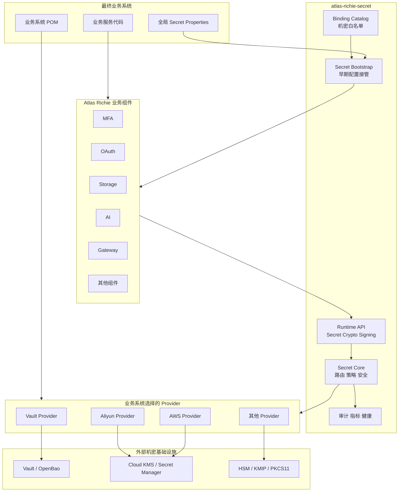

#### 责任分层

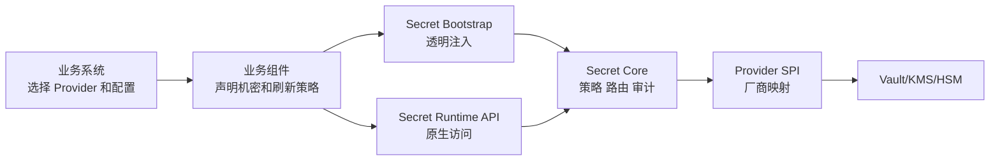

#### 数据面与控制面

| 平面 | 典型操作 | 默认是否启用 | 权限特征 |
|---|---|---:|---|
| Bootstrap Data Plane | 启动时读取 Secret Bundle | 启用 Secret 时开启 | 只读 |
| Runtime Data Plane | 读取 Secret、解密、签名 | 按 Capability 开启 | 使用权限 |
| Refresh Plane | 读取新版本、替换快照 | 显式配置 | 只读 + 事件 |
| Management Plane | 创建/更新 Secret 版本 | 默认关闭 | 写权限 |
| Key Admin Plane | 创建、轮换、禁用、删除 Key | 独立模块 | 管理权限 |

业务应用默认只装配前三者。管理平面和 Key Admin 平面必须通过独立依赖、独立配置和更严格身份启用。

### 模块与依赖架构

#### 目标模块结构

```text
atlas-richie-secret-parent
├── atlas-richie-secret-api
├── atlas-richie-secret-bootstrap
├── atlas-richie-secret-core
├── atlas-richie-secret-spring-boot-starter
├── atlas-richie-secret-management
├── atlas-richie-secret-testkit
├── atlas-richie-secret-provider-vault
├── atlas-richie-secret-provider-openbao
├── atlas-richie-secret-provider-aws
├── atlas-richie-secret-provider-azure
├── atlas-richie-secret-provider-gcp
├── atlas-richie-secret-provider-aliyun
├── atlas-richie-secret-provider-tencent
├── atlas-richie-secret-provider-huawei
├── atlas-richie-secret-provider-volcengine
├── atlas-richie-secret-provider-kmip
└── atlas-richie-secret-provider-pkcs11
```

#### 模块职责

| 模块 | 职责 | 是否包含厂商 SDK |
|---|---|---:|
| `secret-api` | 引用、DTO、Capability、运行期 Facade | 否 |
| `secret-bootstrap` | 早期 Provider SPI、Binding Catalog、PropertySource | 否 |
| `secret-core` | 路由、策略、信封加密、事件、审计 | 否 |
| `secret-spring-boot-starter` | Core 自动配置的内部复用模块，不要求最终应用单独引入 | 否 |
| `secret-management` | Secret 写入、轮换编排、Key Admin 扩展 | 否/按接口 |
| `secret-testkit` | Provider 契约测试、伪 Backend、故障注入 | 否 |
| `secret-provider-*` | 厂商启动期和运行期实现 | 是 |

#### 依赖方向

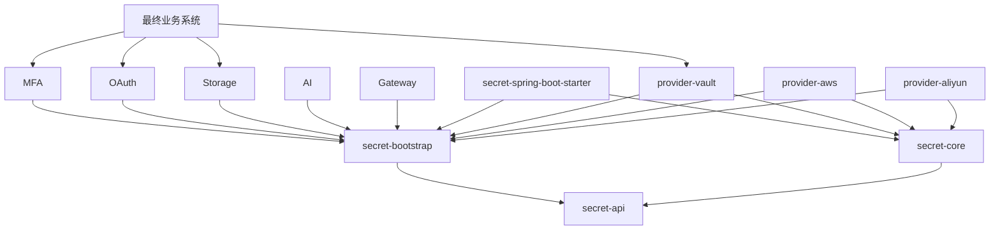

#### 强制依赖规则

- 业务组件只允许依赖 `secret-bootstrap` 和必要的 `secret-api`。
- 业务组件不得依赖任何 `secret-provider-*`。
- Provider 不得反向依赖 MFA、OAuth、Storage、AI 或 Gateway。
- Core 不得在公开 API 中暴露厂商 SDK 类型。
- Provider 的 SDK 版本由平台依赖管理统一约束，但是否引入由最终业务系统决定。
- Provider 最终包必须传递带齐运行所需的 Bootstrap/Core/自动配置；已经使用中台业务组件的最终应用不再额外引入 `secret-spring-boot-starter`。
- 禁止提供一个被所有业务组件传递引入的“全 Provider 大包”。

### 启用与禁用状态模型

#### 状态定义

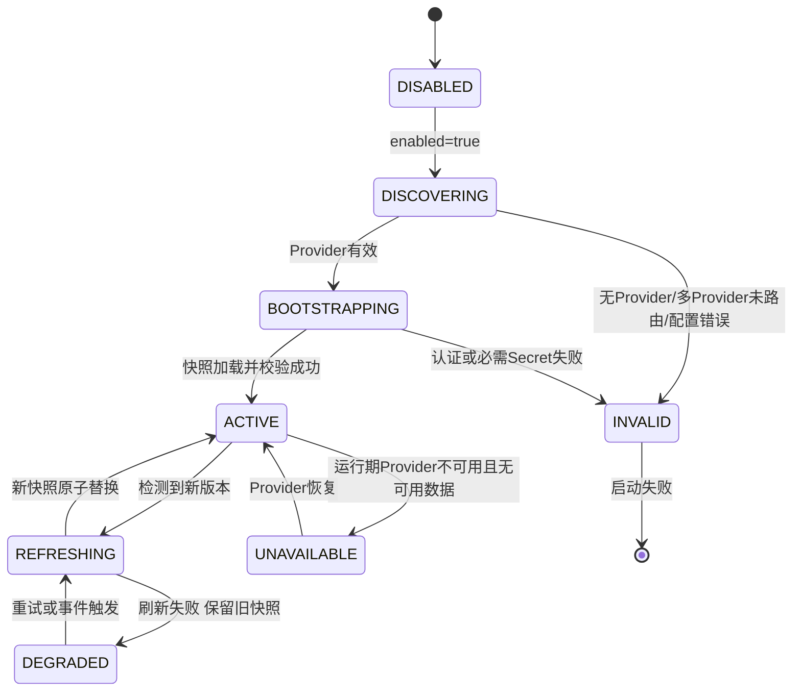

#### 禁用契约

当 `platform.component.secret.enabled` 缺失或为 `false` 时：

- `AtlasSecretEnvironmentPostProcessor` 只读取开关并立即返回。
- 不发现或实例化 Provider。
- 不加载 Binding Catalog。
- 不创建 Secret PropertySource。
- 不访问网络、文件凭据或实例元数据端点。
- 不注册刷新调度器、监听器、HealthIndicator、MeterBinder。
- 不改变任何现有 `@ConfigurationProperties` 的来源和结果。
- 不要求业务系统引入 Provider。
- 不输出 Info/Warn 日志；最多允许 Debug 级“disabled”诊断。

#### 启用契约

当 `enabled=true` 时：

- 必须发现至少一个启动期 Provider Factory。
- 单 Provider 自动选择；多 Provider 必须显式路由。
- 必须先验证 Bootstrap 配置，后连接外部服务。
- 必需 Secret 缺失时启动失败。
- Strict Mode 下本地同名机密不得作为回退来源。
- PropertySource 必须在业务组件配置绑定前生效。
- 运行期 Backend 必须与启动期 Provider 身份和配置一致。

#### 禁用启动时序

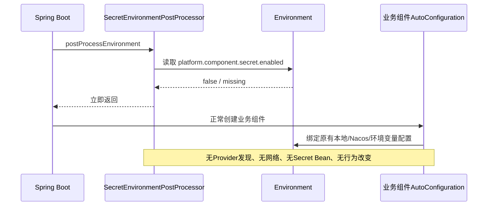

#### 启用启动时序

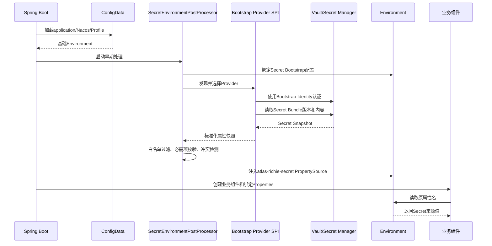

## 📎 🔐 Secret核心机制

### 启动期透明配置接管

#### 为什么必须发生在 Context 刷新前

普通 Spring AutoConfiguration 创建 Bean 时，许多业务组件的 `@ConditionalOnProperty`、`@ConfigurationProperties` 和 SDK Client 已经开始求值或创建。此时再修改配置会导致：

- 条件装配判断已经使用旧值。
- Properties 虽可重绑，但已构造客户端不会自动重建。
- 一部分 Bean 使用 Secret，一部分 Bean 使用本地值。
- 启动日志和异常可能提前暴露本地机密。

因此，透明配置接管必须在 ConfigData 已加载、ApplicationContext 尚未刷新时完成。

#### 处理器顺序

目标处理器：

```text
cn.richie696.component.secret.bootstrap.AtlasSecretEnvironmentPostProcessor
```

设计顺序：

1. Spring Boot 加载默认、系统、命令行和 ConfigData。
2. Secret Processor 在 `ConfigDataEnvironmentPostProcessor.ORDER` 之后执行。
3. Secret Processor 使用最终激活 Profile 和 `spring.application.name` 计算路径。
4. Secret PropertySource 在 Context 刷新前加入 Environment。
5. 业务 AutoConfiguration 开始条件判断和属性绑定。

处理器通过 `META-INF/spring.factories` 注册，并使用 Spring Boot 4.x 当前的 `org.springframework.boot.EnvironmentPostProcessor`。

#### Bootstrap Context

Processor 使用 `ConfigurableBootstrapContext` 保存：

- 解析后的只读 Bootstrap Properties。
- 选中的 `SecretBootstrapProviderFactory`。
- 启动期 Provider Client。
- 已加载 `SecretSnapshot`。

运行期 AutoConfiguration 可从 Bootstrap Context 接管已创建的线程安全 Client，避免重复认证和重复连接。若厂商 Client 不支持转移，则关闭启动期 Client 并用同一配置创建运行期 Client。

#### PropertySource 行为

目标名称：

```text
atlas-richie-secret[<providerId>:<snapshotVersion>]
```

属性来源需携带：

- Provider ID。
- Secret Bundle 逻辑路径。
- Secret 版本，但不得携带 Secret 值。
- 加载时间和哈希摘要。
- 原始厂商 Request ID（仅内部审计）。

#### 加载流程

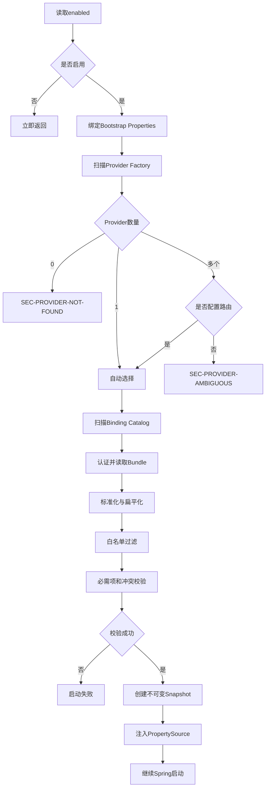

#### Secret Bundle 组织方式

默认上下文：

```text
atlas-richie/<environment>/<application>/common
atlas-richie/<environment>/<application>/components
atlas-richie/<environment>/<application>/<active-profile>
```

加载顺序从通用到具体，后者覆盖前者，但只能覆盖同一个已声明机密属性。Provider 负责把厂商路径、Secret 名称和版本映射为统一 Bundle。

#### 防止配置注入扩大权限

Bundle 即使包含以下属性，也必须被丢弃并记录安全事件：

```text
server.port
spring.datasource.url
platform.component.secret.enabled
platform.component.oauth.enabled
platform.gateway.authentication.mode
management.endpoints.web.exposure.include
```

除非这些属性由业务系统显式加入自定义机密白名单，并且不属于禁止覆盖列表。Secret 的职责是提供机密，不是远程改变系统安全策略。

### 组件机密目录

#### 目的

Binding Catalog 是业务组件与 Secret Bootstrap 之间的静态契约，回答四个问题：

1. 哪些配置属性属于机密？
2. 哪些机密是必需的，必需条件是什么？
3. Secret 变化后如何使业务组件生效？
4. 是否允许把值导出到 Spring Environment？

#### 文件位置

每个业务组件 Jar 提供：

```text
META-INF/atlas-richie/secret-bindings.json
```

选择 JSON 而非 Spring Bean 的原因是启动期尚未创建 ApplicationContext，Processor 必须直接从 classpath 读取静态元数据。

#### 元数据模型

```json
{
  "schemaVersion": "1",
  "component": "atlas-richie-storage-core",
  "bindings": [
    {
      "property": "platform.component.storage.object.access-key-secret",
      "logicalName": "storage.object.access-key-secret",
      "kind": "CREDENTIAL",
      "exposure": "PROPERTY_SOURCE",
      "requiredWhen": {
        "property": "platform.component.storage.object.engine",
        "in": ["aliyun_oss", "tencent_cos", "huawei_obs", "aws_s3"]
      },
      "refresh": "RECREATE_CLIENT",
      "owner": "storage"
    }
  ]
}
```

#### 字段定义

| 字段 | 必填 | 含义 |
|---|---:|---|
| `schemaVersion` | 是 | Catalog 格式版本 |
| `component` | 是 | 声明组件 Artifact ID |
| `property` | 是 | 现有 Spring 属性全名 |
| `logicalName` | 是 | Provider 无关逻辑名称 |
| `kind` | 是 | `CREDENTIAL`、`TOKEN`、`PASSWORD`、`PRIVATE_KEY` 等 |
| `exposure` | 是 | `PROPERTY_SOURCE` 或 `NATIVE_HANDLE` |
| `requiredWhen` | 否 | 条件必需规则 |
| `refresh` | 是 | 刷新策略 |
| `owner` | 是 | 审计和冲突定位所有者 |
| `allowLocalWhenDisabled` | 否 | 关闭时是否允许现有本地值，默认 `true` |
| `allowLocalWhenEnabled` | 否 | 启用后是否允许本地值，生产默认 `false` |
| `maxLength` | 否 | 输入上限，仅用于校验，不记录实际长度 |

#### 机密类型

| Kind | 示例 | 默认 Exposure |
|---|---|---|
| `API_KEY` | AI Provider API Key | `PROPERTY_SOURCE` |
| `ACCESS_KEY_ID` | 云厂商 AccessKey ID | `PROPERTY_SOURCE` |
| `ACCESS_KEY_SECRET` | 云厂商 Secret | `PROPERTY_SOURCE` |
| `PASSWORD` | FTP/SFTP/SMB/DB Password | `PROPERTY_SOURCE` |
| `CLIENT_SECRET` | OAuth Client Secret | `PROPERTY_SOURCE` |
| `TOKEN_SECRET` | HMAC Token Secret | `PROPERTY_SOURCE` 或 `NATIVE_HANDLE` |
| `SIGNING_KEY` | Gateway/OAuth 签名 Key | `PROPERTY_SOURCE` 或 `NATIVE_HANDLE` |
| `ENCRYPTION_KEY` | 数据加密 KEK | `NATIVE_HANDLE` |
| `PRIVATE_KEY` | 签名私钥 | `NATIVE_HANDLE` |
| `CERTIFICATE` | 证书 | `PROPERTY_SOURCE`/专用 Certificate API |
| `USER_SECRET` | TOTP 用户密钥 | `NATIVE_HANDLE` |

#### 刷新策略

| Refresh | 含义 | 适用场景 |
|---|---|---|
| `STATIC` | 仅启动加载，变化需重启 | 不支持安全重建的旧组件 |
| `REBIND_PROPERTIES` | 重绑 Properties 即可 | 每次调用实时读取 Properties |
| `RECREATE_CLIENT` | 原子创建新客户端并切换 | Storage、HTTP SDK Client |
| `REFRESH_SERVICE` | 调用组件显式 `refresh()` | AI 模型和 Key Pool |
| `DUAL_VERSION` | 新旧版本并存一段时间 | OAuth 签名、数据库凭据轮换 |
| `NATIVE` | 组件直接按引用和版本读取 | MFA 用户 Secret、动态凭据 |

#### Catalog 合并规则

- 相同 `property`、相同元数据：去重。
- 相同 `property`、不同 `kind/exposure`：启动失败。
- 相同 `logicalName` 映射多个 Property：允许，但必须显式 `shared=true`。
- 不识别的 Schema Version：启动失败，不做猜测解析。
- 自定义业务 Catalog 与中台 Catalog 冲突：业务系统不能覆盖中台安全分类，只能补充更严格规则。

动态 Map/List 属性只允许两种受约束占位符：`{name}` 匹配一个规范化 kebab-case 属性段，
`{index}` 匹配非负数字下标。占位符模式不能声明 `requiredWhen`，运行时若一个属性同时命中多个模式则失败关闭。
Catalog 不接受 `*`、`**`、任意正则或跨属性段匹配，避免 AI 模型名等动态键扩大成整棵配置树的注入权限。

#### Catalog 验证流程

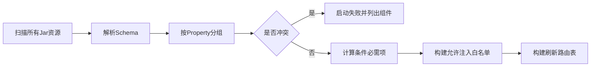

### Provider 发现、选择与生命周期

#### Provider 包最终目标

每个 `atlas-richie-secret-provider-*` 都是一个可独立引入的最终实现包，同时包含：

1. Bootstrap Provider Factory。
2. Runtime Provider Factory/AutoConfiguration。
3. 厂商 Properties 校验器。
4. Capability Descriptor。
5. 厂商异常到统一错误码的映射。
6. 客户端生命周期、TLS、代理、超时和认证实现。
7. Provider Contract Test。
8. 最小权限示例和运维文档。

#### 单 Provider 选择

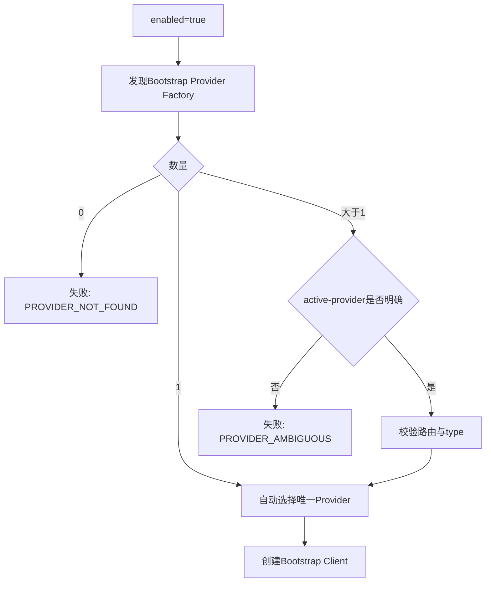

#### Provider 包不能自行启用

即使业务系统引入 `provider-vault`，如果 `enabled=false`，Provider 不得创建 `VaultTemplate`、认证 Token Supplier、Lease Scheduler 或 Health Check。是否启用只能由全局 Secret 开关决定。

#### 客户端生命周期

- Client 默认单例并复用连接池。
- Provider 必须声明 Client 是否线程安全。
- Bootstrap Client 与 Runtime Client 可安全复用时由 Bootstrap Context 移交。
- Provider Session 在 Spring Context 关闭时统一关闭。
- 认证 Token/STS Credential 的刷新由 Provider 内部完成，不暴露给业务组件。
- Provider 不得在每次业务调用前执行额外的远端 `isAvailable()`。

#### Provider 配置一致性

启动期和运行期使用同一份不可变 Provider Configuration Hash。若运行期发现配置 Hash 不一致，拒绝复用 Bootstrap Client，并记录配置漂移事件。

#### 多 Provider 路由

路由按 Capability 进行，禁止按业务调用临时猜测：

```text
PROPERTY_SOURCE -> vault-primary
SECRET_READ     -> vault-primary
ENVELOPE_CRYPTO -> aws-kms
SIGNING         -> aws-kms
```

每个逻辑 Key/Secret 也可指定固定 Backend，但必须在启动时解析为路由表，运行期不读取任意用户输入决定 Provider。

### Secret Store 设计

#### 两种存储模式

| 模式 | 说明 | 适用后端 |
|---|---|---|
| `REMOTE_STORE` | Secret 值保存在专用 Secret Store，应用按引用读取 | Vault KV、AWS/Aliyun/GCP Secrets Manager、Azure Key Vault Secrets |
| `ENCRYPTED_CONFIG` | 密文保存在 YAML/Nacos/DB，启动或运行期调用 KMS 解密 | 只有 KMS、没有 Secret Store 的环境 |

KMS 通常负责密钥和密码运算，并不天然等于任意 Secret 存储。Provider 必须根据真实能力声明模式。

#### Bundle 模型

```java
public record SecretSnapshot(
        String providerId,
        String logicalPath,
        String version,
        Instant loadedAt,
        Map<String, SecretValue> values,
        SecretSnapshotMetadata metadata
) implements AutoCloseable {
}
```

快照必须不可变。刷新时构建完整新快照，校验通过后用原子引用替换，再销毁旧快照。

#### Bundle 扁平化

Provider 可返回平铺 Map 或嵌套 JSON。Core 使用 Spring Relaxed Binding 兼容的规范化规则转为属性名，但禁止不确定转换：

- `accessKeySecret` 与 `access-key-secret` 统一到 canonical key。
- List 使用 `[index]`。
- Map Key 保留原意并进行路径字符校验。
- 同一 canonical key 由多个原始字段产生时启动失败。

#### 版本选择

生产推荐：

- 启动时解析明确版本或受控 Alias。
- 不直接把所有应用永久绑定到 `latest`。
- 轮换先创建新版本，再灰度修改 Alias/Stage。
- 验证失败时可以回退 Alias 到旧版本，但不能把旧值复制为“新 latest”而不记录审计。

#### Secret 读取时序

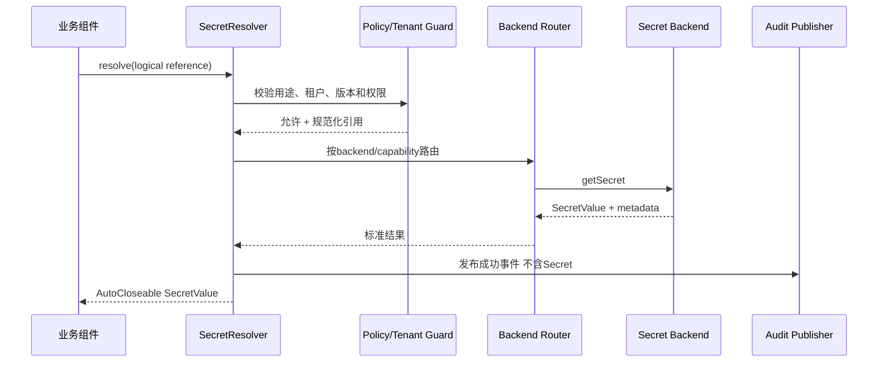

#### Secret 写入

写入默认不装配。启用后仍需：

- 指定预期旧版本或 ETag，避免盲覆盖。
- 新版本写入后先验证外部依赖，再推进 Alias。
- 删除采用软删除/计划删除语义，Provider 不支持时明确标记差异。
- 任何写入和删除均产生高优先级审计事件。

#### 动态凭据

动态凭据与静态 Secret 分开建模：

```java
public record SecretLease(
        LeaseId id,
        SecretValue value,
        Instant expiresAt,
        boolean renewable
) implements AutoCloseable {
}
```

租约必须支持续期失败通知、到期销毁和主动撤销。不得把动态凭据注入一个永久存在的静态 PropertySource 后失去租约生命周期。

### 密码运算与信封加密

#### 默认算法

- 数据加密：AES-256-GCM。
- Nonce：每个 DEK/消息唯一的 96-bit 随机值。
- Authentication Tag：128 bit。
- DEK：默认 256 bit。
- 随机源：平台安全随机源或 Provider 数据密钥 API。
- 禁止 ECB。
- CBC、PKCS#1 v1.5 等仅允许显式兼容模式，不作为新数据默认值。

#### 为什么默认信封加密

- 云 KMS 直接加密通常适合小数据且存在大小限制。
- 本地 AEAD 处理业务数据性能更稳定。
- KEK 永不以明文离开 KMS/Vault/HSM。
- 更换 KEK 时只重包装 DEK，不必重新加密业务大对象。
- 可以为一个 DEK 保存多个 Wrapped Key，实现真实灾备解密路径。

#### 加密流程

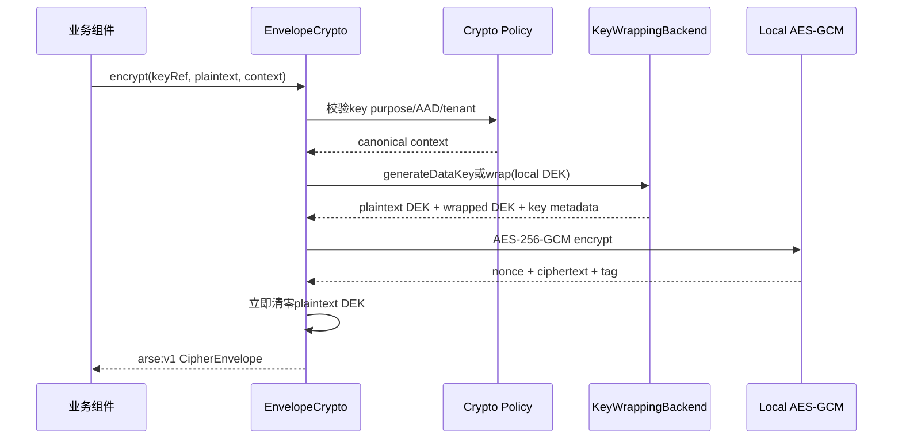

#### 解密流程

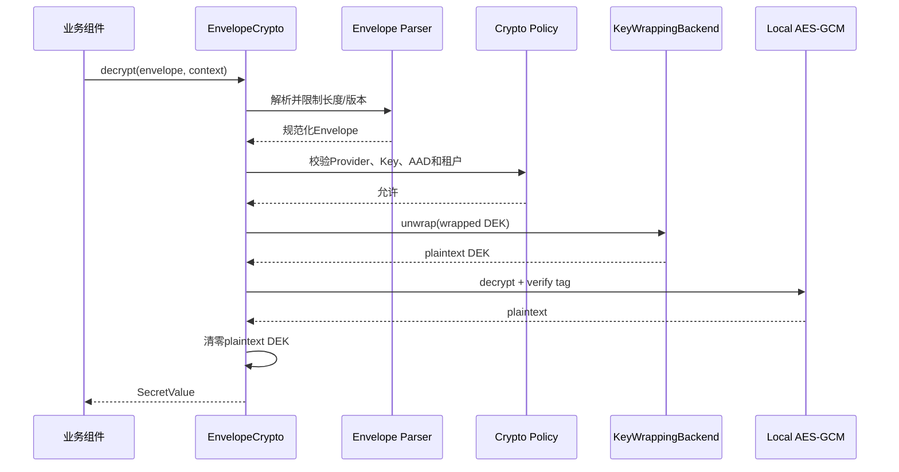

#### 密文格式 `arse:v1`

逻辑结构：

```json
{
  "format": "arse",
  "version": 1,
  "key": {
    "logical": "oauth-signing",
    "version": "current",
    "purpose": "ENVELOPE_ENCRYPTION"
  },
  "wrapAlgorithm": "KMS_NATIVE",
  "contentAlgorithm": "AES_256_GCM",
  "wrappedDataKeys": ["base64..."],
  "nonce": "base64...",
  "ciphertext": "base64...",
  "tag": "base64...",
  "aadSchema": "atlas-context-v1"
}
```

`arse:v1` 是稳定的文本封装前缀，内部版本字节当前为 V2；V1 仅保留解密兼容。二进制编码仍为严格长度前缀，文本形态为 `arse:v1:` 加 URL-safe Base64（无 Padding）。V2 顺序编码 Magic、版本、内容算法、逻辑 Key Reference、包装算法、Wrapped DEK、Nonce 和包含 GCM Tag 的 Ciphertext，并将逻辑 Key、逻辑版本、用途、Envelope 版本、算法和 nonce 摘要与调用方 Context 一起纳入 AAD。V1 使用旧的 `arse\0v1\0AES_256_GCM\0` AAD 规则，仅允许解密；新写入和 Rewrap 统一生成 V2。Rewrap 会重新计算 AAD、生成新的 nonce 和内容密文，因此不再承诺业务密文 bytes 不变。Provider 和物理 Key ID 由 Provider 根据逻辑 Key、版本与自身受信任配置解析，不要求业务项目了解，也不允许业务请求注入。

实现必须：

- 有固定 Magic/Prefix 和版本。
- 有总长度、字段长度和集合数量限制。
- 拒绝未知关键字段和不支持版本。
- Header 与调用方 Context 一并纳入 AAD。
- 不从 Envelope 接受任意 Endpoint、Region 或认证配置。

#### AAD 设计

默认 AAD Schema：

```text
application=<logical application>
environment=<environment>
purpose=<secret purpose>
tenant=<non-PII tenant identifier or pseudonym>
resourceType=<type>
resourceId=<non-sensitive stable identifier>
logicalKey=<canonical logical key>
keyVersion=<logical key version>
keyPurpose=<key purpose>
envelopeVersion=<envelope version>
algorithm=<content algorithm>
nonceSha256=<nonce digest>
```

AAD 可能进入云审计日志，因此禁止姓名、手机号、邮箱、证件号、Secret、Token 和完整业务载荷。

#### Rewrap

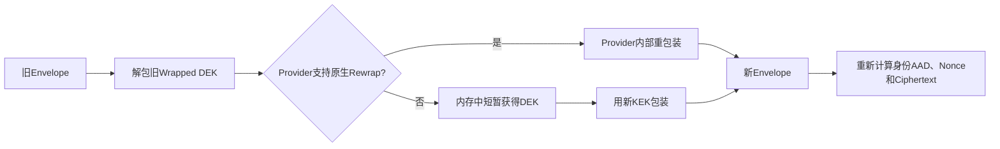

跨 Provider Rewrap 需要在可信进程内短暂解包 DEK，并为身份 AAD 重新计算内容密文；业务明文只在组件受控内存中短暂存在，随后立即清零。操作必须单独授权、审计并限制批次。

#### 数据密钥缓存

默认关闭。若高频 MFA 验证或低延迟场景确需缓存，必须：

- 显式启用并记录风险接受。
- 使用短 TTL、最大条目数和主动清零。
- 缓存 Key 包含 Provider、Key Version、Tenant、Purpose。
- 密钥禁用、轮换或租户停用时立即失效。
- 不将缓存状态作为 KMS 故障时无限期继续运行的依据。

### 认证与启动信任链

#### Bootstrap 悖论

应用访问 Secret 系统需要身份。如果访问凭据本身也只能从同一个 Secret 系统读取，将形成无法启动的递归。解决方式是把初始身份交给运行环境，而不是应用配置。

#### 推荐认证顺序

| Provider | 推荐生产认证 |
|---|---|
| AWS | EKS Web Identity、ECS/EC2 IAM Role、Default Credential Chain |
| Azure | Workload Identity、Managed Identity、DefaultAzureCredential |
| GCP | Workload Identity Federation、Attached Service Account、ADC |
| 阿里云 | RAM Role、OIDC RAM Role、ECS Instance Role |
| 腾讯云 | CAM Role、TKE Workload Identity/临时凭据 |
| 华为云 | IAM Agency、工作负载身份/临时凭据 |
| 火山引擎 | IAM Role、STS 临时凭据 |
| Vault/OpenBao | Kubernetes Auth、JWT/OIDC、AppRole + Response Wrapping、mTLS |
| KMIP/HSM | mTLS、硬件槽位认证、受保护 PIN 来源 |

#### 静态凭据兼容模式

如厂商或部署环境无法使用工作负载身份，可支持文件挂载、环境注入或外部 Credential Process，但：

- 默认不接受 YAML 中的长期 Secret Key。
- 凭据文件权限必须校验。
- 不记录文件内容、Token 或完整路径。
- 必须支持过期和刷新。
- 生产启用静态凭据时产生安全告警指标。

#### TLS

- 生产 Endpoint 默认必须为 HTTPS/mTLS。
- 禁止全局信任所有证书和关闭主机名验证。
- 自定义 CA 通过独立 Trust Store 配置。
- 证书轮换不得要求禁用校验。
- Endpoint 只能来自 Bootstrap 配置，不能来自业务请求或 Envelope。

#### 最小权限

运行时应用角色原则上只包含：

- 读取指定 Secret 路径/版本。
- 对指定 Key 执行 Encrypt/Decrypt/GenerateDataKey/Sign 等必需操作。
- 读取必要 Key Metadata。

禁止默认包含：

- 创建、导入、导出、删除 Key。
- 修改 Policy/Role。
- 枚举整个 Secret 空间。
- 读取其他应用或租户命名空间。
- 开启/关闭审计和修改保留策略。

### 多租户与命名空间隔离

#### 隔离目标

- 租户 A 不能构造引用读取租户 B 的 Secret。
- 相同逻辑名称在不同租户中映射到不同命名空间。
- 租户身份必须来自可信 Tenant Context，不接受普通请求参数直接决定物理路径。
- Secret Backend 的 IAM/Policy 与应用内策略形成纵深防御。

#### 命名空间模型

```text
atlas-richie/<environment>/<application>/shared/<logical-name>
atlas-richie/<environment>/<application>/tenants/<tenant-token>/<logical-name>
```

`tenant-token` 使用经过规范化和长度限制的稳定标识，必要时使用不可逆映射，禁止直接拼接包含 `/`、`..`、URL 编码分隔符的输入。

#### Key 粒度

默认建议：

- 每环境 + 应用 + 用途一个 KEK。
- Tenant 作为 AAD 绑定。
- 高隔离或监管租户可以配置独立 KEK。

不建议默认每个租户创建多个云 KMS Key，因为会带来配额、成本、轮换和策略运维压力。

#### 租户访问流程

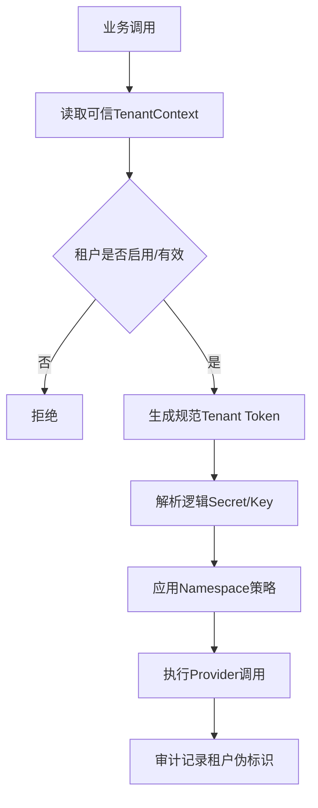

#### 共享 Secret

共享 Secret 必须显式标记 `scope=APPLICATION`，租户作用域默认为 `TENANT`。禁止在找不到租户 Secret 时自动回退共享 Secret，除非 Binding Catalog 明确声明继承策略。

### 动态刷新、轮换与客户端重建

#### 刷新目标

Secret 发生版本变化后，框架应把新值安全、完整地传递给已运行组件，同时避免部分配置生效、连接中断和旧版本立即失效。

#### 事件模型

```java
public record SecretSnapshotChangedEvent(
        String previousProviderId,
        String previousVersion,
        String currentProviderId,
        String currentVersion,
        Instant changedAt
) {}
```

事件不包含新旧值。若存在 Spring Cloud Context，Core 再桥接 `EnvironmentChangeEvent`；不存在时业务组件监听 Secret 原生事件。

#### 原子刷新流程

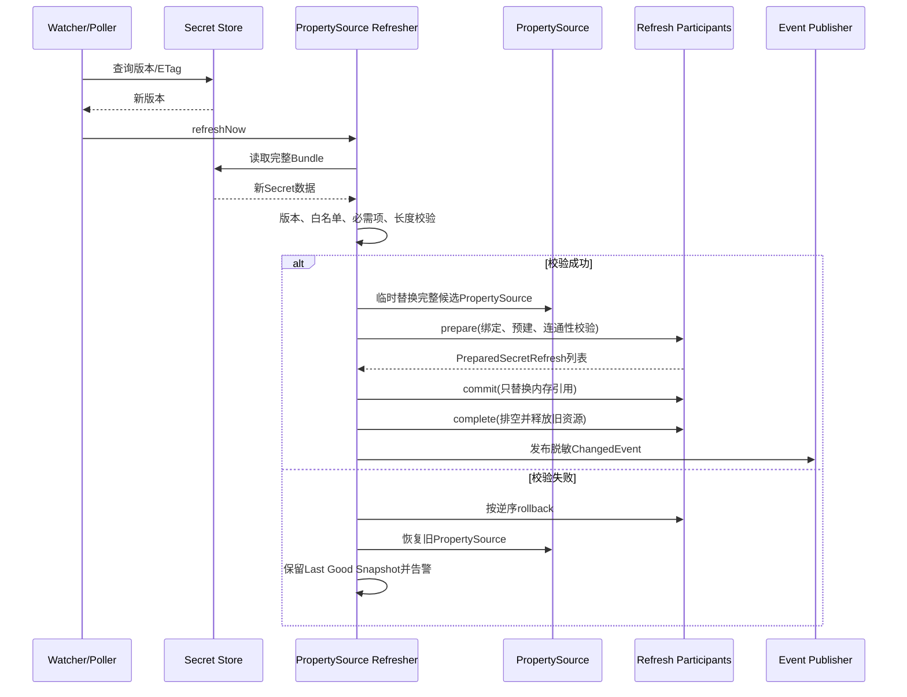

#### 两阶段刷新内部契约

运行期刷新由 Starter 内部的 `SecretRefreshParticipant` 与 `PreparedSecretRefresh` 协作，普通业务系统不注入、不调用这两个 SPI：

1. `prepare`：从候选 `Environment` 绑定业务组件原有 Properties，完成格式校验、SDK Client/模型/Key Pool/signer 的预构建；不得发布候选状态。
2. `commit`：只允许执行不可变快照或代理 delegate 的内存引用切换，不得发起网络 I/O。
3. `rollback`：任一后续参与者失败时按逆序恢复旧引用，并释放未采用的候选资源。
4. `complete`：全部参与者提交后排空在途请求，释放上一代连接池/客户端；清理异常只告警，不回滚已经一致提交的新版本。

执行器使用单线程固定延迟轮询，只有 `platform.component.secret.enabled=true` 且 `refresh.enabled=true` 时创建守护线程。同一实例内的 `refreshNow` 串行执行；Provider 与版本均未变化时直接返回，不重建客户端，也不发布事件。

当前业务域的提交单元如下：

| 业务域 | prepare | commit | rollback/complete |
| --- | --- | --- | --- |
| Storage | 为所有已注册且非 Local 的引擎执行 validate/create/afterPropertiesSet | 同一临界区替换类型代理、对象代理、Normalizer 与 Engine ID | 回滚全部引用；成功后取得代理写锁，等待在途调用退出再 destroy 旧引擎 |
| AI | 隔离构建 Chat Client、Key Pool、五类多模态模型与 STS signer 列表；任一配置条目未成功构建即拒绝 | `AtomicReference`/不可变 Map 发布完整代际 | 回滚 Chat/模型/Pool/signer 代际；无借用中的旧 Pool 立即关闭，其余延迟回收 |
| Gateway | 只绑定并校验 authentication Secret | 写入 `volatile secretKey` | 恢复上一 Secret；算法、路由与安全开关不参与 Secret 刷新 |
| OAuth HMAC | 绑定新 Token Secret 并验证窗口为正数 | 当前版本用于新签名，上一版本记录截止时间 | 回滚当前/上一版本与 Properties；窗口结束后旧版本不再参与验签 |
| OAuth RSA/OIDC | 授权服务先装载完整新 Key Material | signer 原子替换 current/previous KeyWindow | Access Token 验签按 `kid` 选择当前/上一公钥；JWKS 只在窗口内发布两把公钥 |

#### 组件刷新并不等于 Properties 重绑

`@ConfigurationProperties` 重绑只能改变配置对象。已经构造的 SDK Client、连接池、签名器和 Key Pool 可能仍持有旧值。因此每个 Binding 必须声明 Refresh Strategy，业务组件提供对应 Refresher。

#### 双版本轮换

适用于 OAuth 签名密钥和数据库凭据：

1. 创建新版本。
2. 验证新版本可用。
3. 新写入/签名使用新版本。
4. 旧版本继续解密/验签或接受连接。
5. 等待令牌 TTL、连接排空或灰度窗口。
6. 禁用旧版本。
7. 观察后计划删除。

OAuth 默认 `platform.component.oauth.signing-key-verification-window=2h`，生产配置必须不小于系统内最长 Access Token/ID Token TTL（还应包含允许的时钟偏差）。HMAC 轮换由 Secret 刷新参与者自动驱动；RSA Access Token 与 OIDC ID Token 的 Key Material 通常来自不可导出 KMS/HSM 或授权服务专用加载器，因此不进入通用字符串 PropertySource，而由该加载器调用 signer 的受控轮换入口。无论来源如何，新签名只使用 current，验签/JWKS 在窗口内同时接受 current 与 previous，窗口结束后 previous 自动从验签候选和 JWKS 消失。

#### 刷新失败策略

- 启动首次加载失败：Fail Closed，应用不启动。
- 运行期新版本加载失败：保留 Last Good Snapshot，并告警。
- 当前快照已被远端强制吊销：涉及安全事件时不得无限期继续使用。
- 客户端重建失败：保持旧客户端，禁止半切换。
- 多实例应用：优先事件广播；轮询必须带随机抖动，避免同时打满 Provider。

#### 删除值的语义

删除配置值后，普通 `EnvironmentChangeEvent` 可能无法使所有 Bean 正确感知“属性不存在”。Secret Refresh 使用完整快照替换，并由组件 Refresher 显式处理删除，不能只依赖字段重绑。

### 容错、降级与灾备

#### 故障分类

| 故障 | 示例 | 默认处理 |
|---|---|---|
| 配置错误 | Endpoint、Region、Mount 缺失 | 启动失败 |
| 认证错误 | Token 过期、Role 无权限 | 启动失败/运行期熔断告警 |
| Secret 缺失 | 必需字段不存在 | 启动失败 |
| 临时网络错误 | Timeout、5xx、限流 | 有界重试 + 熔断 |
| 永久权限错误 | 403、Key disabled | 不重试，明确失败 |
| 密文损坏 | Tag 校验失败、格式错误 | 安全错误，不降级 |
| 新版本错误 | 格式不合法、客户端无法连接 | 保留旧快照 |
| Provider 不可用 | Vault/KMS 宕机 | 按操作和可用快照处理，不回退明文 |

#### 重试规则

- 只对厂商明确标识的临时错误重试。
- 使用指数退避、最大次数和随机抖动。
- Secret Read、Metadata、Decrypt 可安全重试。
- Encrypt 重试可能产生多个合法密文，只返回最终成功结果并记录调用次数。
- Create、Rotate、Delete 必须使用幂等 Token/ETag 或禁止自动重试。

#### 熔断

熔断按 Provider + Capability 维度隔离。Secret Store 故障不应自动熔断本地 AES-GCM；AWS Signing 故障不应阻断 Vault KV 读取。

#### 透明故障切换限制

只有满足以下条件之一才能切换解密 Provider：

1. 同一个 DEK 已分别被主、备 KEK 包装，Envelope 包含多个 Wrapped DEK。
2. Provider 原生提供经验证的多区域/副本 Key。
3. 完成受控跨 Provider Rewrap，并持久化新 Envelope。

仅配置一个备用 Provider 不能让它解开另一个 Provider 的密文。

#### 多重包装灾备

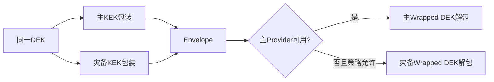

灾备 Key 的使用必须有独立审计、告警和策略许可，不能静默发生。

#### 本地缓存边界

- 已加载配置型 Secret Snapshot 可作为运行期 Last Good Snapshot。
- 不得把 Snapshot 持久化到磁盘明文缓存。
- 应用重启后仍必须从 Provider 重新获取，不能依赖上一次内存状态。
- 动态凭据到期后不能因 Provider 故障继续无限期使用。

### 安全设计与威胁模型

#### 保护资产

- Secret 明文。
- 未包装 DEK。
- 非对称私钥和 HMAC Key。
- Bootstrap Token、临时云凭据、mTLS 私钥。
- Secret/Key 的路径、租户映射和版本关系。
- Provider Policy 和访问审计。

#### 信任边界图

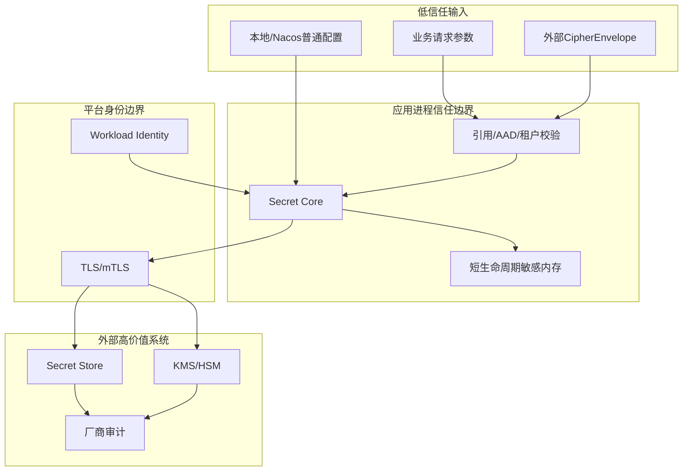

#### 威胁与控制

| 威胁 | 控制 |
|---|---|
| 本地明文覆盖 Secret | Strict Mode、受管属性 Secret 优先、重复源检测 |
| Secret Bundle 修改普通安全配置 | Catalog 白名单 + 禁止覆盖列表 |
| 跨租户路径注入 | Trusted Tenant Context、结构化引用、路径规范化 |
| 恶意 Envelope 指向攻击者 Endpoint | Endpoint 只来自 Bootstrap，Key Allowlist |
| 密文篡改 | AES-GCM Tag + Header/AAD 绑定 |
| AAD 泄露 PII | Schema 白名单、日志检查、禁止敏感字段 |
| Provider SDK 异常泄露 Secret | 统一异常映射和消息清洗 |
| 日志/Actuator 暴露 | `toString` 脱敏、SanitizingFunction、默认隐藏值 |
| SSRF | Endpoint 非业务输入、Scheme/Host Allowlist、禁用任意重定向 |
| 长期 AK/SK 泄露 | Workload Identity 优先、静态模式告警 |
| 启动身份权限过大 | 运行时/管理身份分离、最小权限模板 |
| Provider 伪实现 | Contract Test 禁止明文等价、真实 E2E |
| 内存转储 | 短生命周期数组、禁用 Heap Dump 或加密保护、运维访问控制 |
| 供应链冲突 | Provider SDK 隔离、BOM、依赖扫描和签名制品 |
| 重放旧 Secret 版本 | 版本策略、Alias 推进、最小版本约束 |

#### 日志规则

允许记录：

- Provider ID、Capability、逻辑 Key 名称。
- 规范化错误码、耗时、Request ID。
- Secret Version 的不可逆摘要或非敏感 Alias。
- Tenant 伪标识。

禁止记录：

- Secret、Token、Password、Private Key、DEK。
- Ciphertext 和 Wrapped DEK 全文。
- 可能包含用户名/密码的 URI。
- Vault Token、云临时凭据。
- 原始请求 Body 或 Provider 原始异常 Body。

#### Actuator

- `/env`、`/configprops` 保持 `show-values=never` 推荐值。
- 注册基于 Binding Catalog 的 `SanitizingFunction`，即使业务系统改为 `when-authorized` 或 `always` 仍强制清洗 Secret 属性。
- Health Details 不包含 Endpoint 完整路径、Secret 路径和 Policy 内容。
- 禁止通过 Actuator 写 Environment 来覆盖受管机密。

## 🚀 业务组件接入指南

### 中台业务组件集成规范

#### 总体原则

MFA、OAuth、Storage、AI、Gateway 等组件统一引入轻量 `atlas-richie-secret-bootstrap`，但不得选择具体 Provider。业务组件只做三件事：

1. 声明哪些现有属性是机密。
2. 声明启用 Secret 后的刷新策略。
3. 对不可导出 Key 或用户级 Secret 使用原生 API。

#### 集成架构

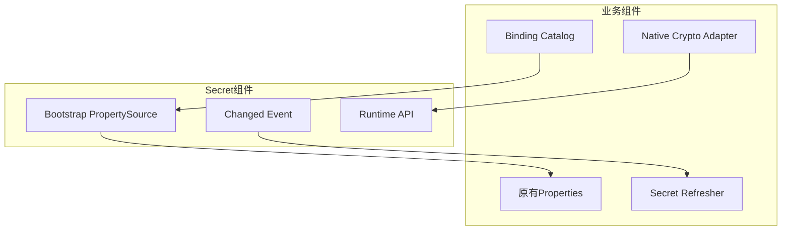

#### Storage

透明属性：

- 对象存储 Access Key ID/Secret。
- FTP/SFTP/SMB Password。
- 代理认证信息。

刷新策略：`RECREATE_CLIENT`。利用现有 Storage Registry/Proxy 先创建并验证新客户端，再原子替换 Delegate，旧客户端等待在途请求结束后关闭。

优先级说明：若云 SDK 支持 Workload Identity，推荐不保存 AK/SK；Secret 只作为无法使用工作负载身份时的凭据来源。

#### AI

透明属性：

- API Key、API Key Pool。
- Secret ID/Secret Key。
- App Code、Vendor Token。

刷新策略：`REFRESH_SERVICE`。复用现有 AI Refresh 机制重建 Model、Signer 和 Key Pool，禁止只重绑 Properties 而保留旧池。

#### Gateway

透明属性：

- 内部 Token/HMAC Secret。
- 第三方 OAuth Client Secret。
- 需要加载的证书口令。

刷新策略按用途划分：普通 Client Secret 可 `REBIND_PROPERTIES`/重建客户端；签名 Key 使用 `DUAL_VERSION`。安全认证模式、路由开关不属于 Secret 白名单。

#### OAuth

- 可导出的外部 Client Secret 可通过 PropertySource。
- Authorization Server 私钥优先使用 `SigningService` 和不可导出 `KeyReference`。
- 轮换必须允许旧公钥继续验签直到全部 Token 过期。
- JWKS 同时发布当前和仍处于验证窗口的旧 Key。

#### MFA

- MFA Provider 连接配置统一迁出到 Secret 组件。
- 用户 TOTP Secret 是业务数据，不是应用全局属性，业务侧只使用 `SecretOperations` 外观。
- 不允许 KMS 不可用时返回明文 Secret。
- Local Crypto 仅存在于测试 Provider，不能作为生产默认值。

#### 其他组件

任何新组件包含 Password、Token、API Key、Private Key、Certificate Password 时，必须同时提交 Binding Catalog 和脱敏/刷新测试，不能只增加一个 `String secret` 字段。

#### 业务组件验收矩阵

| 场景 | 必须结果 |
|---|---|
| 未引入 Provider + Secret disabled | 正常启动，行为与改造前一致 |
| 引入 Provider + Secret disabled | 正常启动，无 Provider 网络访问 |
| Secret enabled + Provider 缺失 | 启动失败，错误信息可操作 |
| Secret enabled + Bundle 正确 | 组件使用 Secret 值 |
| Secret enabled + 必需值缺失 | 启动失败，不回退本地值 |
| Secret 刷新成功 | 客户端/服务按策略原子切换 |
| Secret 刷新失败 | 保留旧实例并告警 |

### MFA 迁移设计

本项目按全新系统建设，当前没有历史 MFA 数据；因此不安排历史批量迁移、双写观察窗口或回填任务。以下章节仅保留新写路径的安全边界，供未来确有存量数据时另行立项。

#### 迁移目标

删除 MFA 内部对 Vault、Cloud KMS、HSM 和 Local Crypto 的通用实现职责，MFA 仅保留 TOTP Secret 的生成、绑定、验证和业务生命周期。

#### 当前风险处理

迁移前必须识别并禁止：

- 云 KMS 占位实现返回 Base64 原文。
- `isAvailable=false` 时加密返回明文。
- Vault 启动时自动创建 Transit Key。
- 配置中长期保存云 Access Key Secret。
- 接口将 Secret CRUD 与 KMS 加解密混为一体。

#### 目标存储策略

推荐把 TOTP Secret 作为 `arse:v1` 信封密文保存在 MFA 数据库：

- 数据库保存业务密文、Wrapped DEK 和 Key Metadata。
- KEK 只存在于 Vault/KMS/HSM。
- Provider 切换通过 Rewrap 完成。
- 数据库泄露不能直接获得 TOTP Secret。

如客户明确要求 Secret 不进入业务数据库，可选用 Vault KV/Secret Manager 引用模式，但必须评估每次验证的网络依赖、延迟、成本和缓存风险。

#### 兼容桥接

迁移期提供：

```text
MfaKeyManagementBridge
```

桥接旧 MFA 接口到新 `SecretOperations` 外观，只作为过渡，不允许新增调用方直接依赖低层 Crypto/SPI。

当前阶段 3 实现约束：

- Secret 关闭时，旧 `KeyManagementProvider`、Vault/KMS/Local 配置与读取路径保持不变。
- Secret 开启时，MFA 自带的旧 Provider 不实例化，由 `MfaKeyManagementBridge` 作为 Primary 兼容桥接。
- 新绑定把 `arse:v1` 信封写入 `mfa_user_info.secret_reference`；旧模式仍可在该列保存外部逻辑引用。
- 验证端优先读取记录或缓存中的 `secret_reference`；历史记录为空时只在 Secret 关闭的旧模式下使用确定性旧路径。
- 已存在的 Vault/Redis 旧引用不能在 Secret 开启后被猜测或静默当成明文；必须在阶段 5 显式迁移后切换。
- MFA 只持有固定逻辑 Key `mfa.totp.data-key`，物理 Key 映射由最终业务系统在 Provider `key-bindings` 中提供。

#### 数据迁移状态机

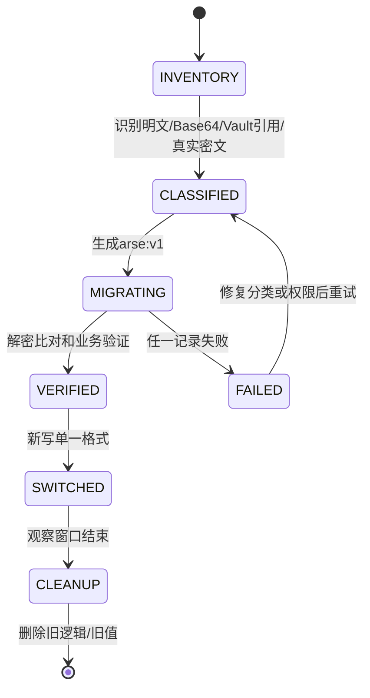

#### 迁移约束

- 不自动猜测一个 Base64 字符串是否为真实密文。
- 每种旧格式必须有显式类型或可靠证据。
- 迁移前备份，迁移任务幂等，并保存记录级状态但不保存明文。
- 双读期间只允许“新格式优先、已知旧格式兼容”，不能把任意未知值当明文。
- 新写从迁移开始即只写 `arse:v1`。
- 工程已提供 `MfaSecretMigrationService`：按 `batchSize` 限批、支持 `dryRun`、失败记录可重试，只持久化新引用并返回计数；实际切换前仍必须完成备份、旧 Provider 读取权限验证和目标 Provider E2E。
- 清理旧 Key/Secret 必须等待全量校验和回滚窗口。

## 📚 接口详细说明

### 核心 API 与 SPI

#### API 分层

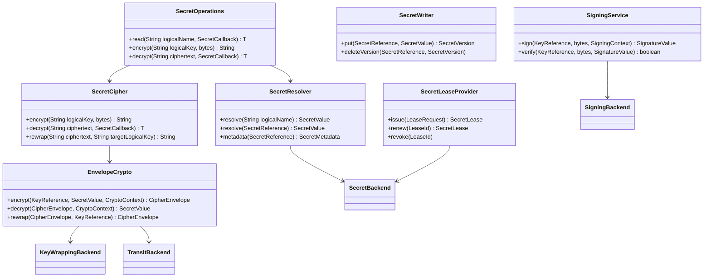

### 非导出密钥签名/验签的实际公开边界

上图中的 `SigningService` 已对应到源码中的运行期能力。业务侧不接触
`KeyReference`、Provider SDK、物理 Key 名或私钥，最小调用面为：

```java
SignatureValue signature = secretOperations.sign("oauth.signing", payload);
boolean valid = secretOperations.verify("oauth.signing", payload, signature);
```

`SignatureValue` 是 Provider 无关的不可解析值对象。Provider 可以在其编码值中保留
Transit/KMS/HSM 所需的签名格式、密钥版本和轮换信息，业务侧只能保存、传递和回传，
不能拆解或修改。私钥永远不会通过 `read`、配置属性或回调进入应用内存。

Core 内部通过 `SigningBackend` SPI 将逻辑 Key 映射为 `KeyPurpose.SIGNING`，再交给
Provider 执行签名和验签。Provider Session 只有在同时声明 `SIGN`、`VERIFY` 时才会
注册 `SigningService`；能力不足时调用会快速失败，禁止降级到本地私钥、明文或普通
`encrypt/decrypt`。

```mermaid
sequenceDiagram
    participant B as 业务组件
    participant O as SecretOperations
    participant S as SigningService
    participant P as SigningBackend
    participant V as Vault/KMS/HSM

    B->>O: sign(logicalKey, payload)
    O->>S: sign(logicalKey, payload)
    S->>S: 构造 SIGNING KeyReference
    S->>P: sign(KeyReference, payload, context)
    P->>V: Provider 原生 sign
    V-->>P: opaque signature
    P-->>S: SignatureValue
    S-->>O: SignatureValue
    O-->>B: SignatureValue
    B->>O: verify(logicalKey, payload, signature)
    O->>S: verify(logicalKey, payload, signature)
    S->>P: verify(KeyReference, payload, signature)
    P->>V: Provider 原生 verify
    V-->>P: valid/invalid
    P-->>O: boolean
    O-->>B: boolean
```

Vault Transit 当前使用 `/transit/sign/:key` 和 `/transit/verify/:key`；OpenBao 使用
兼容的 `v1/{mount}/sign/{key}` 与 `v1/{mount}/verify/{key}`。云 KMS/HSM Provider
必须按同一 SPI 接入，并且只有真实实现后才可把 `SIGN`、`VERIFY` 加入能力声明。

#### `SecretReference`

```java
public record SecretReference(
        String logicalName,
        SecretVersionSelector version,
        String field
) {
}
```

约束：

- `logicalName` 是业务与中台约定的稳定逻辑名称，Provider 负责映射厂商路径。
- `version` 支持 `latest`、固定版本、Stage/Alias，但生产配置型机密优先固定或灰度 Alias。
- `field` 仅用于结构化 Secret Bundle，必须经过允许列表校验。
- Backend 选择、应用/租户命名空间和物理路径不进入项目 API，由 Core 根据配置和受信任上下文构造。

#### `KeyReference`

```java
public record KeyReference(
        String logicalKey,
        String version,
        KeyPurpose purpose
) {
}
```

项目只声明逻辑 Key、逻辑版本和用途。ARN、Vault Transit Key、云 Key Resource 等物理标识只能存在于 Provider 配置或 Provider 私有 Handle 中；业务 API、外部请求和业务数据库字段不得决定 Endpoint、账号或物理 Key ID。

#### 项目 API 与扩展 SPI 边界

普通业务项目只注入 `SecretOperations`。默认外观仅保留 `read/encrypt/decrypt`，返回可直接持久化的 `arse:v1` 字符串，并通过 `SecretCallback` 在受控生命周期内提供临时明文；调用方不需要管理 `SecretValue`、组装 `KeyReference`、构造 `CryptoContext`、解析 `CipherEnvelope` 或选择包装算法。元数据、Rewrap、写入和 Key 管理属于专用扩展面，不进入默认业务外观。

`SecretResolver`、`SecretCipher`、`SecretValue`、`CryptoContext`、`EnvelopeCrypto`、`CipherEnvelope`、`KeyWrappingBackend`、`SecretBackend`、`SecretProviderFactory` 和 Bootstrap SPI 是 Core/Provider 扩展契约。Provider 实现可以了解厂商能力和物理标识，但不得把这些知识反向传播到业务项目。

#### `SecretValue`

```java
public interface SecretValue extends AutoCloseable {
    byte[] copyBytes();
    char[] copyChars();
    int size();
    boolean destroyed();
    @Override void close();
}
```

设计要求：

- 内部优先使用可覆盖的 `byte[]/char[]`。
- `close()` 后覆盖内部数组并拒绝再次读取。
- `toString()` 固定返回脱敏标识。
- 不提供隐式 JSON 序列化。
- 复制调用必须显式，调用者负责尽快清零副本。
- Java GC、JIT 和第三方 SDK 可能产生不可控副本，文档不得宣称绝对内存擦除。

#### Capability

```java
public enum SecretCapability {
    SECRET_READ,
    SECRET_WRITE,
    SECRET_VERSIONING,
    SECRET_DELETE,
    DYNAMIC_CREDENTIAL,
    LEASE_RENEW,
    DIRECT_ENCRYPT,
    DIRECT_DECRYPT,
    DATA_KEY_GENERATE,
    KEY_WRAP,
    KEY_UNWRAP,
    REWRAP,
    SIGN,
    VERIFY,
    HMAC,
    RANDOM,
    KEY_ROTATE
}
```

业务 Facade 在调用前检查 Capability；Provider Testkit 必须对声明的每项能力执行正向和负向契约测试。

#### 启动期 SPI

```java
public interface SecretBootstrapProviderFactory {
    String providerType();
    boolean supports(BootstrapSecretProperties properties);
    Set<SecretCapability> capabilities();
    SecretBootstrapClient create(
            BootstrapSecretProperties properties,
            BootstrapContext context);
}
```

启动期 SPI 通过 `ServiceLoader` 或专用 Spring Factory 发现，不能依赖普通 Spring Bean，因为 ApplicationContext 尚未创建。

#### 运行期 SPI

```java
public interface SecretProviderFactory {
    String providerType();
    SecretProviderDescriptor descriptor();
    SecretProviderSession open(SecretProviderConfiguration configuration);
}
```

`SecretProviderSession` 持有线程安全客户端和各 Capability Backend，统一实现 `AutoCloseable`。

#### 管理 API 隔离

`SecretWriter`、`KeyLifecycleAdmin` 不进入默认 Starter。业务运行时如果只需要读取，classpath 中不应存在写入和 Key Admin 自动配置，防止误注入和权限扩大。

## 🔧 核心能力

### Provider 支持矩阵与演进顺序

#### 目标支持矩阵

| Provider | Secret Store | Direct Crypto | Data Key/Wrap | Sign/Verify | Dynamic Secret | 首期 |
|---|---:|---:|---:|---:|---:|---|
| HashiCorp Vault | KV v2 | Transit | Transit Datakey | 是 | Database 等 | M1 |
| AWS | Secrets Manager | KMS | GenerateDataKey/ReEncrypt | 是/HMAC | 轮换集成 | M1 |
| 阿里云 | Secrets Manager | KMS | GenerateDataKey | 是 | 部分动态/轮换 | M1 |
| Azure | Key Vault Secrets | Key Vault/Managed HSM | Wrap/Unwrap | 是 | 版本/轮换 | M2 |
| Google Cloud | Secret Manager | Cloud KMS | 本地DEK + KMS Wrap | 是/MAC | 版本/轮换工作流 | M2 |
| 腾讯云 | SSM/KMS配套 | KMS | GenerateDataKey | 是 | 按官方能力 | M2 |
| 华为云 | CSMS/DEW配套 | DEW KMS | GenerateDataKey | 是 | 按官方能力 | M2 |
| 火山引擎 | 配套Secret能力 | KMS | GenerateDataKey | 是 | 按官方能力 | M2 |
| OCI Vault | Vault Secrets | OCI Vault/KMS | Wrap/Unwrap | 依服务能力 | 版本/轮换 | M2 |
| IBM Key Protect | 无（当前包） | Key Protect | Wrap/Unwrap | 依服务能力 | 否 | M2 |
| 百度云 KMS | 无（当前包） | KMS | Wrap/Unwrap | 依服务能力 | 否 | M2 |
| OpenBao | KV | Transit | Transit Datakey | 是 | Database 等 | M3 |
| OpenStack Barbican | Secret/Container | 依Plugin | 依Plugin | 依Plugin | 否/扩展 | M3 |
| KMIP 2.1 | Key对象 | 是 | Wrap/Unwrap | 是 | 否 | M3 |
| PKCS#11 HSM | Key对象 | 本地硬件运算 | Wrap/Unwrap | 是 | 否 | M3 |

#### 厂商签名与工作负载身份兼容矩阵

该矩阵描述代码已经收口的认证/签名边界；真实环境一栏必须在目标账号、身份 Agent、证书和中间件实例可用后执行，不能以 Contract Test 代替生产兼容性结论。

| Provider | 工作负载身份/凭据入口 | 请求签名或协议 | TLS/代理边界 | 代码状态 | 真实环境状态 |
|---|---|---|---|---|---|
| AWS | SDK 默认链、EKS/ECS/EC2 Role | AWS SDK 原生签名 | SDK HTTPS | Contract | 待真实云账号 |
| 阿里云 | 默认链、RAM Role/ACK/ECS | SDK 原生签名 | SDK HTTPS | Contract | 待真实云账号 |
| Azure | Bearer、Token File、Managed Identity Agent | 无通用 HMAC | TrustStore/Proxy | Wire/Contract | 待真实云账号 |
| GCP | Bearer、Token File、Workload Identity Agent | 无通用 HMAC | TrustStore/Proxy | Wire/Contract | 待真实云账号 |
| OCI | Bearer、Token File、Instance/Resource Principal Agent | 无通用 HMAC | TrustStore/Proxy | Wire/Contract | 待真实云账号 |
| IBM Key Protect | Bearer、Token File | 无通用 HMAC | TrustStore/Proxy | Wire/Contract | 待真实云账号 |
| 腾讯云 | AccessKey、Token File/身份 Agent | TC3-HMAC-SHA256 | TrustStore/Proxy | 签名 Contract | 待真实云账号 |
| 华为云 | AccessKey、Token File/Agency Agent | SDK-HMAC-SHA256 | TrustStore/Proxy | 签名 Contract | 待真实云账号 |
| 火山引擎 | AccessKey、Token File/身份 Agent | HMAC-SHA256 | TrustStore/Proxy | 签名 Contract | 待真实云账号 |
| 百度云 KMS | AccessKey、Token File/身份 Agent | BCE v2 | TrustStore/Proxy | 签名 Contract | 待真实云账号 |
| OpenBao | Token、Token File；其他认证由 Agent 换取 Token | OpenBao HTTP/KV/Transit | TrustStore/Proxy | OpenBao 2.6.2 Docker E2E | 目标环境续期/轮换待验收 |
| Barbican | Bearer、Token File | Barbican REST | TrustStore/Proxy | 协议门禁 | 本机缺 Keystone/Barbican 服务栈 |
| KMIP 2.1 | mTLS 客户端证书 | KMIP TTLV | mTLS；不内置 HTTP 代理 | 本地 TLS/TTLV 连通 | PyKMIP AES KWP 能力不足；目标 KMIP 待验收 |
| PKCS#11 HSM | Token/PIN、slot/token-label | HSM/JCA Sign/Verify | 本地接口；不走 HTTP 代理 | SoftHSM2 E2E | 真实 HSM 待验收 |

统一 REST Transport 已实现工作负载 Token File、TLS TrustStore/KeyStore、代理及代理认证的启动期校验；华为、腾讯、火山和百度的签名器分别实现官方 HMAC 形态。工作负载身份交换由云平台 Agent 或部署系统负责，组件只读取短期令牌并在请求时使用，不持久化长期凭据。

#### 本地验证结论（2026-08-23）

| Provider | 本地验证依赖 | 结论 | 证据与边界 |
|---|---|---|---|
| OpenBao | Docker `openbao/openbao:latest`（2.6.2） | 通过 | KV v2 读写、Transit RSA 签名/验签；`OpenBaoIntegrationTest` 1/1。 |
| PKCS#11 | SoftHSM2 2.7.0、JDK SunPKCS11 | 通过 | AES 包裹/解包、RSA 签名/验签；`Pkcs11IntegrationTest` 1/1。SoftHSM2 不能证明真实 HSM 的硬件隔离、审计、HA 或厂商机制。 |
| KMIP | PyKMIP 0.10.0、TLS 客户端/信任库 | 部分通过 | TLS 握手、KMIP 2.0 TTLV 请求解析和服务端响应已验证；PyKMIP 加密引擎不支持 Provider 默认的 AES Key Wrap Padding，完整 Wrap/Unwrap 回环必须在支持该模式的 KMIP 服务上验收。 |
| Barbican | 本机无 Keystone/Barbican 服务栈 | 未测试 | Provider 配置/单元测试可运行；真实 Secret API、Bearer/Token File 和租户权限需要 OpenStack 环境。 |

上述结果只代表本地依赖的可复现事实，不替代生产环境的证书轮换、权限拒绝、认证续期、协议扩展、HA、审计和性能故障演练。

M2 当前已落地 Provider artifact、ServiceLoader 工厂、能力声明、统一配置绑定/校验、严格 JSON Transport、官方 REST wire profile、华为/腾讯/火山/百度请求签名、Workload Token File、TLS/代理配置和生命周期移交。GCP/Azure/OCI/IBM 使用短期 Bearer Token 或 Token File，Token 交换由 workload identity Agent 负责；真实云 E2E 仍需账号到位后逐一核验。M3 已进一步落地独立 OpenBao HTTP、Barbican Secret API、KMIP 2.1 TTLV TLS 和 JDK PKCS#11 实现，并提供真实环境 E2E 门禁；这些实现仍需以对应版本的官方兼容矩阵和目标环境测试核验，不能因为协议包编译通过就自动宣称生产支持。

#### 演进顺序依据

##### M1：Vault + AWS + 阿里云

三者分别验证：

- Vault 同时拥有 KV、Transit、Datakey 和租约语义。
- AWS 将 KMS 与 Secrets Manager 分离，验证多服务组合 Provider。
- 阿里云验证国内云认证、SDK、KMS 实例和 Secret Manager 语义。

##### M2：主流云覆盖

完成 Azure、GCP、腾讯云、华为云、火山引擎后形成 `1.0 GA`，覆盖国际主流和国内常用云环境。

##### M3：自建与标准协议

OpenBao 必须独立认证，不能只因与 Vault API 相近就共享未测试标识。KMIP 与 PKCS#11 分别面向远程标准协议和本地 HSM 接口，不共用一个模糊 HSM Provider。

#### Provider 完成定义

一个 Provider 只有同时满足以下条件才标记支持：

- 无占位实现、无明文回退、无 Base64 伪加密。
- 声明能力全部通过 Contract Test。
- 至少完成一次真实服务 E2E。
- 认证链、超时、代理、TLS 和客户端关闭完成测试。
- 权限拒绝、Key disabled、Secret missing、Version mismatch 等负向测试完成。
- README 有依赖、配置、最小权限和运维说明。
- 依赖漏洞和 License 审查完成。

## ⚙️ 配置说明

### 配置模型与优先级

#### 配置前缀

统一配置前缀：

```text
platform.component.secret
```

禁止各业务组件再新增自己的 Vault、KMS、Secret Manager 连接配置。迁移完成后，MFA、OAuth、Storage、AI、Gateway 只能声明业务机密逻辑名称或原生 Key Reference，具体 Provider 连接统一位于 Secret 配置下。

#### 单 Provider 推荐配置

```yaml
platform:
  component:
    secret:
      enabled: true
      strict-mode: true

      property-source:
        application: ${spring.application.name}
        environment: prod
        paths:
          - common
          - components
        missing-policy: fail
        local-fallback: false

      refresh:
        enabled: true
        mode: event-or-poll
        poll-interval: 60s
        failure-policy: keep-last-good

      vault:
        endpoint: https://vault.example.com
        namespace: platform
        authentication:
          type: kubernetes
          role: atlas-richie-app
          kubernetes-path: kubernetes
        kv:
          mount: secret
          version: 2
        transit:
          mount: transit
```

单 Provider 场景不需要配置 `provider: vault`，因为最终业务系统引入的 Provider Artifact 已经表达选择。

#### 多 Provider 高级配置

```yaml
platform:
  component:
    secret:
      enabled: true
      active-provider: vault-primary

      providers:
        vault-primary:
          type: vault
          endpoint: https://vault.example.com
          authentication:
            type: kubernetes
            role: atlas-richie-app

        aws-kms:
          type: aws
          region: ap-southeast-1
          authentication:
            type: default-chain

      routing:
        property-source: vault-primary
        secret-read: vault-primary
        envelope-crypto: aws-kms
        signing: aws-kms
```

多 Provider 仅用于明确的混合场景。禁止在发现多个 Provider 时按 classpath 顺序、Bean 顺序或名称猜测默认实现。

#### Bootstrap 配置与受管机密分离

以下配置属于 Bootstrap Trust，不允许从 Secret Bundle 注入：

- `enabled`
- Provider Endpoint、Region、Namespace
- Auth Type、Role、Audience、Mount
- TLS Trust Store 路径
- Bundle 路径和版本策略
- 路由和 Strict Mode
- Timeout、Retry、Proxy、安全允许列表

这些值可来自本地非敏感配置、Nacos、环境变量或平台注入。Bootstrap 身份凭据优先来自 Workload Identity，不应以明文配置值出现。

#### PropertySource 优先级

启用 Strict Mode 后，对进入 Binding Catalog 的属性采用：

```text
Secret Snapshot
    >
命令行 / 系统属性 / 环境变量 / Nacos / application.yml 中的同名受管机密
```

对未进入 Catalog 的普通属性，Spring 原有优先级完全不变。

这样做的原因是：若允许环境变量覆盖 Secret，旧部署脚本中的明文会在无提示情况下重新成为真实凭据来源，破坏“启用即接管”的语义。

#### 本地重复值策略

| 环境 | 默认行为 |
|---|---|
| prod/staging | 检测到同名本地机密时告警；可配置直接失败 |
| dev/test | Secret 值优先，可显式允许本地回退 |
| Secret disabled | 完全沿用现有本地配置 |

日志只记录属性名和 PropertySource 名，不记录任何值或可推导长度。

#### 缺失策略

| 策略 | 行为 | 允许环境 |
|---|---|---|
| `fail` | 必需项缺失时启动失败 | 生产默认 |
| `keep-last-good` | 刷新缺失时继续旧快照 | 仅运行期刷新 |
| `local` | 回退本地值 | dev/test 显式开启 |
| `ignore` | 忽略可选项 | 仅 `required=false` |

## 📎 🧪 测试与演进

### 测试策略与验收标准

#### 测试金字塔

```mermaid
flowchart TB
    E2E[真实Provider E2E\n最少但关键]
    IT[容器/沙箱集成测试]
    Contract[Provider Contract Test]
    Unit[Core/Parser/Policy单元测试]
    Unit --> Contract --> IT --> E2E
```

#### Core 单元测试

- Catalog 扫描、冲突、Schema Version。
- 属性规范化和禁止覆盖列表。
- Provider 数量与选择规则。
- Strict/Disabled 状态。
- Secret Snapshot 原子替换。
- Envelope 解析、长度限制、AAD 和篡改检测。
- 引用规范化、路径穿越、租户越权。
- 异常脱敏和 `toString()`。

#### Disabled Contract Test

每个业务组件都必须证明：

- Secret 依赖存在但关闭时不创建 Secret Bean。
- 不调用 Provider Factory。
- 不启动线程和网络连接。
- 原有配置值、Bean 数量和条件装配结果保持一致。
- 构建、单元测试和代表性集成测试与改造前一致。

#### Provider Contract Test

按声明 Capability 自动执行：

- Secret 写/读/版本/删除。
- Encrypt/Decrypt 正向闭环。
- 错误 AAD、错误 Key、篡改 Ciphertext 必须失败。
- Data Key 长度、随机性和 Wrapped Key 可解包。
- Rotate 后旧密文仍按策略可解密。
- Sign/Verify 正向及篡改负向。
- 认证过期、权限不足、限流、超时、TLS 错误。
- Client 并发和关闭。
- 日志捕获中不含测试 Secret。

#### 真实云 E2E

模拟器不能证明真实 IAM、KMS 密文格式、轮换和审计。每个 GA Provider 必须在隔离测试账号执行真实 E2E：

- 临时创建测试 Secret/Key 或使用预置测试资源。
- 使用最小权限角色。
- 测试结束计划删除并核验资源清理。
- CI 输出只保留资源 ID 摘要和 Request ID。
- 测试 Secret 为随机临时值，不使用生产凭据。

#### 安全测试

- SSRF、自定义 Endpoint、重定向。
- Path Traversal、双重 URL 编码、Unicode 混淆。
- 恶意超大 Envelope、深层 JSON、压缩炸弹。
- 日志、Actuator、Trace、Heap Dump 暴露检查。
- 多租户交叉引用。
- Local Fallback 绕过。
- Provider 伪实现返回原文检测。

#### 刷新测试

- 新版本成功切换。
- 新版本缺字段保留旧快照。
- AI Key Pool 重建。
- Storage Client 原子替换和在途请求排空。
- OAuth 新旧 Key 验签窗口。
- 多实例事件/轮询不产生惊群。

#### 1.0 GA 验收

- Core、Bootstrap、Starter、Testkit 完成。
- M1/M2 目标 Provider 通过 Contract 和真实 E2E。
- MFA/OAuth/Storage/AI/Gateway 完成 Disabled 与 Enabled 集成测试。
- 无明文回退代码路径。
- 文档、README、配置元数据和最小权限模板齐全。
- 依赖扫描、License、SBOM 和安全评审完成。

### 兼容性、版本化与演进

#### 兼容性承诺

- Secret disabled 行为是 1.x 的强兼容契约。
- 公开 API 遵循语义化版本。
- Provider Capability 增加为向后兼容；删除或改变语义需要主版本。
- Binding Catalog Schema 独立版本化。
- CipherEnvelope 格式独立版本化，并保持旧版本只读解密窗口。

#### 配置兼容

- 新增配置提供安全默认值。
- 不静默重命名 Provider 属性。
- 旧属性迁移需提供 Metadata Deprecation 和启动告警。
- 不通过“匹配不到新配置就读任意旧值”实现兼容。

#### Provider 升级

Provider SDK 升级必须验证：

- 默认凭据链是否变化。
- HTTP Client、代理、TLS 和线程模型。
- 密文/签名格式和算法默认值。
- Retry 和超时默认值。
- 异常分类与 Request ID。
- Native Image/AOT 约束。

#### AOT 和 Native Image

启动期 SPI、ServiceLoader、反射、SDK 序列化和 Spring Cloud Refresh 可能需要 Runtime Hint。Native Image 不支持的动态刷新能力必须在构建时明确关闭或提供替代实现，不能在运行时无提示失效。

### 实施路线图

#### 阶段 0：设计固化

- [x] 完成本设计文档和 README。
- [x] 确认模块命名、SPI、Properties 和错误码。
- [x] 评审 Secret Bundle、Strict Mode、Provider 选择和 MFA 迁移。

#### 阶段 1：Core 与 Testkit

- [x] 创建 parent/api/bootstrap/core/starter/testkit。
- [x] 实现 Disabled Contract、Catalog、Provider Discovery。
- [x] 实现 PropertySource、Snapshot、事件、Sanitizer。
- [x] 实现 `arse:v1` 和信封加密核心。

#### 阶段 2：M1 Provider

- [x] Vault KV v2、Transit Key Wrap/Unwrap 与逻辑引用映射基线。
- [x] Vault Transit Sign/Verify、最小 `SecretOperations.sign/verify` 外观与 `SignatureValue`。
- [x] OpenBao Transit Sign/Verify 协议适配与能力声明。
- [x] Vault Bootstrap Factory、Runtime AutoConfiguration、配置校验与生命周期移交。
- [x] Vault 1.21.2 真实 KV v2 + Transit E2E 和最小权限模板。
- [x] Vault 权限拒绝、Kubernetes Token 续租、TLS、代理、超时与故障演练的环境门禁已提供。
- [ ] 在目标 Vault 集群执行上述权限、续租、TLS、代理和故障演练。
- [x] AWS Secrets Manager + KMS 基线、默认凭据链/Profile、逻辑映射与模块契约测试。
- [x] 阿里云 KMS Secret Manager + KMS 基线、默认凭据链、共享/专属网关与模块契约测试。
- [ ] AWS、阿里云真实云服务 E2E、权限拒绝、身份续期、TLS/代理和故障演练。

Vault Provider 当前声明 `SECRET_READ`、`SECRET_VERSIONING`、`KEY_WRAP`、`KEY_UNWRAP`、`SIGN` 和 `VERIFY`；签名通过 Transit sign/verify 执行，私钥不导出。AWS KMS 和 PKCS#11 HSM 也已接入同一签名 SPI，其中 AWS 使用 `RSASSA_PSS_SHA_256` 默认算法，PKCS#11 使用可配置 JCA 签名算法。M2 REST Provider 的 HMAC 请求签名只在厂商明确支持并配置对应能力时启用；其他 Provider 仍不声明尚未实现的 `SIGN`、`VERIFY`、`DIRECT_ENCRYPT`、`DIRECT_DECRYPT` 或 `REWRAP`。

#### 阶段 3：业务组件接入

- [x] Storage 启动期透明属性目录与 Enabled/Disabled 绑定测试。
- [x] AI 受约束动态模型目录与 Enabled/Disabled 绑定测试。
- [x] Gateway 鉴权密钥目录与 Enabled/Disabled 绑定测试；ECC 私钥保持非 PropertySource。
- [x] OAuth Token/Introspection Secret 目录与 Enabled/Disabled 绑定测试。
- [x] MFA `SecretOperations` 桥接、`arse:v1` 新写路径、字段迁移与旧 Provider 隔离。
- [x] Storage/AI/Gateway 的运行期刷新执行器与原子客户端切换。
- [x] OAuth 双版本签名验证窗口与 JWKS 轮换实现。

#### 阶段 4：M2 Provider 与 1.0 GA

- [x] Azure、GCP、腾讯、华为、火山引擎、OCI、IBM Key Protect、百度云 Provider 适配包、统一严格 Transport 与可配置官方 REST wire profile（包含嵌套字段和 Base64 载荷解码）。
- [x] 完成 M2 Provider 的官方 REST wire 映射、华为/腾讯/火山/百度请求签名、Workload Token File、凭证/区域/TLS/代理配置校验。
- [ ] 完成云厂商真实账号凭证、临时身份续期和权限矩阵验收。
- [ ] 完成性能、故障、轮换和安全测试。
- [ ] 发布 1.0 GA。

#### 阶段 5：M3 自建与标准协议

- [x] OpenBao 独立 KV v2/Transit Provider、Token/Token File 认证和版本元数据。
- [x] OpenStack Barbican Secret/Metadata/Raw Payload Provider；只声明 Secret Read/Versioning。
- [x] KMIP 2.1 TLS/TTLV Encrypt/Decrypt（AES Key Wrap Padding）Provider；只声明 Key Wrap/Unwrap。
- [x] PKCS#11 JCA Provider；使用 HSM Token 上的 AES Wrap/Unwrap，不导出包裹密钥。
- [x] 增加 OpenBao、Barbican、KMIP 服务与 PKCS#11 HSM 的显式环境变量 E2E 门禁；OpenBao Docker 与 SoftHSM2 本地 E2E 已通过。
- [x] 完成本地依赖可验证项：OpenBao、SoftHSM2/PKCS#11；KMIP 已完成 TLS/TTLV 连通性验证并记录 PyKMIP AES KWP 能力边界。
- [ ] 在目标环境执行 OpenBao、Barbican、KMIP、PKCS#11 真实 E2E、证书轮换、权限拒绝、协议扩展和性能故障测试。

#### 阶段 6：迁移与扩展

- [x] MFA 新项目路径使用 Secret Bridge 和 `arse:v1` 新写保护；当前项目无历史数据，不执行历史迁移。
- [x] MFA 历史数据迁移不纳入本项目交付范围。
- 动态凭据和管理平面。
- 多重包装灾备和跨 Provider Rewrap。

### 架构决策记录

#### ADR-001：Secret 默认禁用

**决定**：`enabled=false` 为默认值。
**原因**：引入依赖不能改变现有业务系统行为。
**后果**：Provider 包必须延迟初始化；每个业务组件要有 Disabled Contract Test。

#### ADR-002：Provider 由最终业务系统 POM 决定

**决定**：业务组件和中台不选择具体 Provider。
**原因**：Secret 基础设施是最终部署环境的企业决策。
**后果**：业务系统引入一个或多个 `secret-provider-*` 并配置路由。

#### ADR-003：单 Provider 不重复配置类型

**决定**：classpath 只有一个 Provider 时自动选择，无需 `provider: vault`。
**原因**：避免 POM 和 YAML 表达不一致。
**后果**：多个 Provider 时必须使用命名和显式路由。

#### ADR-004：透明接入使用启动期 PropertySource

**决定**：配置型机密在 Context 刷新前注入原属性名。
**原因**：保持现有业务 Properties 和条件装配不变。
**后果**：Provider 包必须同时提供 Bootstrap SPI，普通 AutoConfiguration 不足以完成接入。

#### ADR-005：Secret Bundle 受 Catalog 白名单约束

**决定**：不允许 Secret Store 注入任意配置。
**原因**：Secret Manager 不能获得修改所有系统行为的隐式权限。
**后果**：每个组件维护静态 Binding Catalog。

#### ADR-006：配置型机密与 Native Handle 双轨

**决定**：兼容型凭据进入 PropertySource；非导出 Key/用户 Secret 使用原生 API。
**原因**：完全 String 化会破坏 KMS/HSM 的安全价值。
**后果**：OAuth、MFA 等组件需要专用适配，而非只声明属性。

#### ADR-007：生产 Fail Closed

**决定**：Provider 故障或必需 Secret 缺失时不回退本地明文。
**原因**：明文降级会把可用性故障转化为数据泄露。
**后果**：首次加载失败阻止启动；刷新失败仅保留已验证旧快照。

#### ADR-008：生产 Key 由运维预创建

**决定**：运行时 Provider 不自动创建 Key/Mount/Policy。
**原因**：保持最小权限和变更审计。
**后果**：README 和 Provider 文档必须提供预置清单与 IaC 示例。

#### ADR-009：默认信封加密

**决定**：业务数据使用 AES-256-GCM + Provider 包装 DEK。
**原因**：性能、大小限制、轮换和可移植性。
**后果**：定义版本化 `arse` Envelope，并实现严格解析。

#### ADR-010：`arse:v1` 使用严格二进制编码

**决定**：文本保持 `arse:v1:` 兼容前缀，内部版本字节使用 V2 绑定新的身份 AAD；V1 仅用于历史密文解密。
**原因**：避免 JSON 字段别名、重复键、深层结构和规范化差异，限制解析前内存分配，并保持密文紧凑。
**后果**：字段顺序和长度上限属于兼容性协议；新增不兼容字段必须发布新 Envelope 版本。

### 非目标、限制与待决问题

#### 已确认非目标

- 1.0 不建设集中式 Secret Proxy Service。
- 1.0 不自动部署 Vault/HSM。
- 1.0 不提供所有 Provider 的管理控制台。
- 1.0 不承诺跨语言 SDK。
- 1.0 不把整个 Nacos 配置迁入 Secret Store。
- 1.0 不提供任意业务字段的透明数据库列加密。

#### 已知限制

- PropertySource 兼容模式会使明文以 String 形式进入部分 Spring/SDK 对象。
- 不同 Secret Manager 对 Secret 大小、名称、版本、Alias 和轮换支持不同。
- 多云切换需要 Key/Secret 数据准备，不能只改一个 Provider 名称。
- Spring Cloud `@RefreshScope` 不能自动安全重建所有有状态 Bean。
- Native Image 下动态刷新和部分 SDK 可能受限。

#### 后续阶段待确认

1. Binding Catalog 是否提供 JSON Schema 并加入 Maven 校验插件。
2. Secret Bundle 默认按应用聚合还是按组件拆分，以及各 Provider 大小限制下的切分策略。
3. Provider 是否在 `ServiceLoader` 之外同时提供 Spring Factory 注册，以增强 AOT 兼容性。
4. Refresh Watcher 是否在 1.0 对每个 Provider 都要求事件模式，还是允许轮询作为统一基线。
5. MFA 高并发验证是否允许短 TTL DEK Cache，以及对应风险接受流程。
6. 管理平面是否在 1.x 独立发布。

## 🔧 故障排查与运维

### 异常模型与错误码

#### 异常层次

```text
SecretException
├── SecretBootstrapException
├── SecretProviderException
├── SecretAuthenticationException
├── SecretAuthorizationException
├── SecretNotFoundException
├── SecretVersionException
├── SecretCapabilityException
├── SecretCryptoException
├── SecretIntegrityException
├── SecretTenantIsolationException
├── SecretRefreshException
└── SecretConfigurationException
```

#### 错误码

| 错误码 | 含义 | 重试 |
|---|---|---:|
| `SEC-BOOT-001` | Secret 已启用但未发现 Provider | 否 |
| `SEC-BOOT-002` | 多 Provider 未指定路由 | 否 |
| `SEC-BOOT-003` | Bootstrap 配置非法 | 否 |
| `SEC-AUTH-001` | Provider 认证失败 | 视凭据刷新 |
| `SEC-AUTHZ-001` | Provider 权限不足 | 否 |
| `SEC-STORE-001` | 必需 Secret 不存在 | 否 |
| `SEC-STORE-002` | Secret 版本不存在/失效 | 否 |
| `SEC-CAP-001` | Provider 不支持所需能力 | 否 |
| `SEC-CRYPTO-001` | 加密失败 | 仅临时错误 |
| `SEC-CRYPTO-002` | 解密失败 | 仅临时错误 |
| `SEC-CRYPTO-003` | 完整性/AAD 校验失败 | 否 |
| `SEC-TENANT-001` | 租户上下文缺失或越权 | 否 |
| `SEC-REFRESH-001` | 新快照加载失败 | 有界 |
| `SEC-PROVIDER-001` | Provider 临时不可用 | 是 |
| `SEC-PROVIDER-002` | Key 禁用/计划删除 | 否 |

#### 异常信息

对外消息只包含错误码、Provider 逻辑 ID、操作和可操作建议。Provider 原始错误保存在受控诊断上下文中，并经过 Header/Body/URI 清洗。

禁止异常消息拼接 Secret Value、Ciphertext、Token、完整物理路径或认证响应体。

### 可观测性与审计

#### 指标

建议指标：

```text
atlas.richie.secret.operation.duration
atlas.richie.secret.operation.count
atlas.richie.secret.operation.errors
atlas.richie.secret.bootstrap.duration
atlas.richie.secret.refresh.count
atlas.richie.secret.refresh.failures
atlas.richie.secret.snapshot.age
atlas.richie.secret.credential.expiry
atlas.richie.secret.circuit.state
atlas.richie.secret.static.credential.detected
```

允许 Tag：

```text
provider
capability
operation
result
error_code
```

禁止把 Secret Name、Key ARN、Tenant ID、User ID、Path 作为默认 Tag，避免泄露和高基数。

#### 健康检查

| 组 | 检查方式 | 说明 |
|---|---|---|
| Liveness | 仅检查本地 Core 状态 | Provider 故障不应杀死进程循环重启 |
| Readiness | 缓存后的最小权限探测 | Provider/当前快照不可用时摘流量 |
| Startup | 首次快照与必需能力 | 失败则应用不启动 |

健康检查不得在每次探测时执行真实加密或高成本 Key 列表操作。Provider 应提供轻量 Metadata/Permission Probe，并设置独立超时和缓存。

#### 审计事件

```java
public record SecretAuditEvent(
        String requestId,
        String application,
        String providerId,
        String capability,
        String operation,
        String logicalResource,
        String tenantToken,
        String result,
        String errorCode,
        long durationMillis,
        Instant occurredAt
) {
}
```

#### 审计链路

```mermaid
flowchart LR
    A[业务调用] --> B[Secret Core审计事件]
    B --> C[应用日志/消息审计]
    A --> D[Provider API调用]
    D --> E[云审计/Vault Audit Device]
    C --> F[按Request ID关联]
    E --> F
    F --> G[安全分析与告警]
```

Core 审计记录“谁通过哪个应用调用了什么逻辑能力”，厂商审计记录“哪个云身份对哪个物理 Key/Secret 执行了什么操作”。两者通过 Request ID 或厂商请求 ID 关联。

#### 告警建议

- Bootstrap 失败。
- Provider 权限拒绝或认证连续失败。
- Secret Refresh 连续失败。
- Secret/凭据距离过期时间低于阈值。
- 使用静态云凭据。
- 灾备 Wrapped Key 被启用。
- Key 被禁用、计划删除或版本低于最小允许版本。
- Tag 校验失败、跨租户访问拒绝或异常高频解密。

### 性能、容量与资源模型

#### 性能目标不是统一承诺

Provider 延迟、限流、配额和费用由具体产品、Region、网络和账号策略决定。组件不承诺脱离环境的统一 QPS/TPS，只定义控制手段和可测量指标。

#### 关键性能策略

- Secret Bundle 启动期批量读取，避免每个属性一次远端调用。
- Runtime Client 单例复用连接池。
- 元数据/Readiness 探测短期缓存。
- 刷新轮询加入随机抖动。
- 密码大数据使用本地信封加密，不直接发送 KMS。
- Provider 批量 API 仅作为能力扩展，不改变单项语义。
- 不在调用前同步执行 `isAvailable()`。

#### 限制项

必须配置并验证：

- Bundle 最大字节数。
- 单 Secret 最大字节数。
- 属性数量和嵌套深度。
- Envelope 最大长度、Wrapped Key 数量。
- Provider 并发数、连接池、调用超时。
- Refresh 最小间隔。
- 动态租约最大并发量。

#### 启动时间预算

Secret Bootstrap 是启动关键路径，应独立记录：

```text
provider discovery
authentication
bundle fetch
catalog merge
validation
property source install
```

生产可配置总启动超时，但超时后不能跳过 Secret 继续启动。

#### 内存模型

- 快照只保留当前和刷新过渡期旧版本。
- 旧快照在客户端切换完成后及时销毁。
- 不复制未使用的 Bundle 字段。
- 对 PropertySource 暴露值不可避免会形成 String，应将该模式限制在兼容型配置机密；高价值不可导出密钥使用 Native Handle。

### 部署与运维

#### 典型 Kubernetes 部署

```mermaid
flowchart TB
    SA[Kubernetes ServiceAccount] --> Pod[业务Pod]
    Pod --> SecretLib[atlas-richie-secret]
    SecretLib --> IDP[OIDC/JWT Auth]
    IDP --> Vault[Vault或Cloud IAM]
    SecretLib --> Store[Secret Store]
    SecretLib --> KMS[KMS/HSM]
    Store --> Audit[审计系统]
    KMS --> Audit
```

#### 启动前运维准备

1. 创建应用身份和最小权限 Role。
2. 创建或导入 KEK，设置用途、轮换和删除保护。
3. 创建 Secret Namespace/Path 和初始版本。
4. 配置审计日志和告警。
5. 配置网络策略、DNS、TLS Trust 和防火墙。
6. 将 Provider Artifact 纳入业务系统构建。
7. 配置 `platform.component.secret.enabled=true`。
8. 在预发布验证 Bundle、轮换、回滚和故障行为。

#### 运维 Runbook

必须覆盖：

- Provider 认证失败。
- Secret 版本错误和 Alias 回滚。
- Key disabled/计划删除恢复。
- Vault Seal/不可用或云 KMS Region 故障。
- 动态凭据续期失败。
- 轮换后部分实例未刷新。
- 灾备 Wrapped Key 启用。
- 审计日志缺失或延迟。

#### 备份与恢复

Secret 组件本身不备份 Provider 数据。运维必须针对具体产品定义：

- Vault Raft Snapshot/灾备策略。
- 云 Secret Manager 版本和复制策略。
- KMS Key 的删除保护、备份/导入策略和区域副本。
- HSM Key Backup 和 M-of-N 控制。

恢复演练必须验证历史密文可解密，而不是只验证 Key 元数据存在。

## 📎 📚 附录

### 配置、清单与参考资料

#### 完整配置草案

```yaml
platform:
  component:
    secret:
      enabled: false
      strict-mode: true

      property-source:
        application: ${spring.application.name}
        environment: ${ATLAS_ENVIRONMENT:dev}
        paths:
          - common
          - components
        missing-policy: fail
        local-fallback: false
        reject-local-duplicates: true

      refresh:
        enabled: false
        mode: event-or-poll
        poll-interval: 60s
        initial-delay: 30s
        jitter: 10s
        failure-policy: keep-last-good

      resilience:
        connect-timeout: 3s
        read-timeout: 5s
        max-attempts: 3
        initial-backoff: 200ms
        max-backoff: 2s
        circuit-breaker:
          enabled: true
          failure-rate-threshold: 50
          open-duration: 30s

      envelope:
        format: arse
        version: 1
        algorithm: AES_256_GCM
        data-key-bits: 256
        data-key-cache:
          enabled: false

      audit:
        enabled: true
        include-provider-request-id: true
        include-tenant-token: true

      providers: {}
      routing: {}
```

#### Vault 单 Provider 示例

```yaml
platform:
  component:
    secret:
      enabled: true
      strict-mode: true
      property-source:
        application: ${spring.application.name}
        environment: prod
        paths: [common, components]
        missing-policy: fail
        local-fallback: false
      vault:
        endpoint: https://vault.example.com
        namespace: atlas
        authentication:
          type: kubernetes
          role: order-service
          kubernetes-path: kubernetes
        kv:
          mount: secret
          version: 2
        transit:
          mount: transit
```

#### AWS 单 Provider 示例

```yaml
platform:
  component:
    secret:
      enabled: true
      property-source:
        application: ${spring.application.name}
        environment: prod
        paths: [common, components]
      aws:
        region: ap-southeast-1
        authentication:
          type: default-chain
        secrets-manager:
          path-prefix: company
        kms:
          key-bindings:
            default-envelope: arn:aws:kms:ap-southeast-1:123456789012:key/...
```

#### 阿里云单 Provider 示例

```yaml
platform:
  component:
    secret:
      enabled: true
      property-source:
        application: ${spring.application.name}
        environment: prod
        paths: [common, components]
      aliyun:
        region: cn-hangzhou
        secrets-manager:
          path-prefix: company
        kms:
          key-bindings:
            default-envelope: alias/order-service
```

阿里云 Provider 固定使用官方默认凭据链，Properties 不接收 AccessKey。专属 KMS 网关需要额外配置 HTTPS `endpoint` 和 `ca-file`；业务代码仍只使用逻辑 Secret/Key 名称。

#### Secret Bundle 示例

```json
{
  "platform.component.storage.object.access-key-id": "example-id",
  "platform.component.storage.object.access-key-secret": "example-secret",
  "platform.component.ai.chat.openai.api-keys[0]": "example-api-key",
  "platform.component.oauth.token-secret": "example-token-secret",
  "platform.gateway.authentication.secret-key": "example-gateway-secret"
}
```

文档中的值仅用于展示结构，禁止复制到生产。

#### Provider 最小交付清单

- [ ] Bootstrap Factory
- [ ] Runtime Factory/AutoConfiguration
- [ ] Properties + Validation
- [ ] Capability Descriptor
- [ ] Secret Backend
- [ ] Crypto/Wrap Backend（如支持）
- [ ] Signing Backend（如支持）
- [ ] Credential Chain
- [ ] TLS/Proxy/Timeout
- [ ] Exception Mapper
- [ ] Metrics/Audit Request ID
- [ ] Contract Test
- [ ] Real E2E
- [ ] README 和最小权限模板
- [ ] 依赖漏洞/License/SBOM

#### 业务组件接入清单

- [ ] 引入 `secret-bootstrap`，未引入具体 Provider
- [ ] 创建 Binding Catalog
- [ ] 标记 Exposure 和 Refresh Strategy
- [ ] Disabled Contract Test
- [ ] Enabled Integration Test
- [ ] Missing Secret Fail-Closed Test
- [ ] 日志和 Actuator 脱敏测试
- [x] 客户端重建/双版本测试
- [ ] README 补充 Secret 接入说明

#### 官方参考资料

- [Spring Boot Externalized Configuration](https://docs.spring.io/spring-boot/reference/features/external-config.html)
- [Spring Boot EnvironmentPostProcessor](https://docs.spring.io/spring-boot/api/java/org/springframework/boot/EnvironmentPostProcessor.html)
- [Spring Cloud Context Refresh](https://docs.spring.io/spring-cloud-commons/reference/spring-cloud-commons/application-context-services.html)
- [Spring Cloud Vault ConfigData](https://docs.spring.io/spring-cloud-vault/docs/current/reference/html/config-data.html)
- [HashiCorp Vault Transit](https://developer.hashicorp.com/vault/docs/secrets/transit)
- [HashiCorp Vault KV](https://developer.hashicorp.com/vault/docs/secrets/kv)
- [AWS KMS Envelope Encryption](https://docs.aws.amazon.com/kms/latest/developerguide/kms-cryptography.html)
- [AWS Encryption Context](https://docs.aws.amazon.com/kms/latest/developerguide/encrypt_context.html)
- [AWS Secrets Manager](https://docs.aws.amazon.com/secretsmanager/latest/userguide/intro.html)
- [Azure Key Vault Keys](https://learn.microsoft.com/en-us/azure/key-vault/keys/about-keys)
- [Google Cloud KMS Envelope Encryption](https://docs.cloud.google.com/kms/docs/envelope-encryption)
- [Google Secret Manager Rotation](https://docs.cloud.google.com/secret-manager/regional-secrets/about-rotation-schedules-rs)
- [Alibaba Cloud KMS](https://www.alibabacloud.com/help/en/kms/key-management-service/product-overview/what-is-key-management-service-1)
- [OpenBao Transit](https://openbao.org/docs/secrets/transit/)
- [OASIS KMIP 2.1](https://docs.oasis-open.org/kmip/kmip-spec/v2.1/os/kmip-spec-v2.1-os.html)
- [OpenStack Barbican](https://docs.openstack.org/barbican/latest/)

## 📎 ⏱️ 时序图详解

为保持时序图与其设计约束紧邻，完整图形保留在对应机制章节中。本节提供统一索引：

- [禁用启动时序](#禁用启动时序)
- [启用启动时序](#启用启动时序)
- [Secret 读取时序](#secret-读取时序)
- [加密流程](#加密流程)
- [解密流程](#解密流程)
- [原子刷新流程](#原子刷新流程)

## 📎 文档结论

`atlas-richie-secret` 的核心不是增加一套厂商客户端封装，而是建立一条可验证的全局机密治理协议：最终业务系统通过 Provider 依赖和一套 Properties 做出部署选择；中台业务组件在 Secret 关闭时保持原状，在启用后自动接收受控 Secret PropertySource；不可导出密钥和用户级机密通过原生 API 保持 KMS/HSM 安全语义；任何故障都不能退化为明文继续运行。

后续实现、测试和发布必须以本文的禁用透明性、Provider 边界、Fail-Closed、Binding Catalog、原子刷新和真实 E2E 验收为基线。
