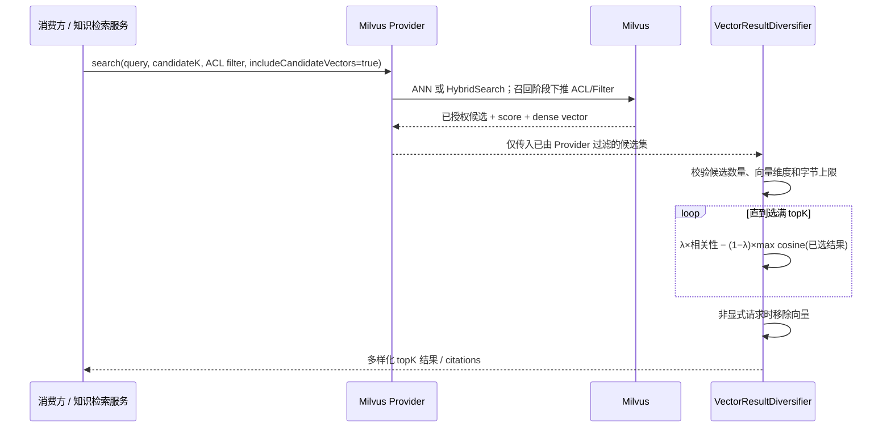

# Milvus Provider 组件设计

本模块是通用向量组件的 Milvus Provider 实现。它负责 Milvus SDK 调用、Collection Schema 与生命周期、过滤条件编译，以及仅对真实请求链路已经证明的能力进行声明；不包含知识库、提示词、MCP、租户或任何使用项目的领域模型。

English version: [README.md](README.md)。

## 1. 范围与兼容性

| 范围 | 状态 | 约定 |
|---|---|---|
| 单进程多逻辑 Store | 已实现 | 一个连接句柄可创建多个独立、绑定逻辑索引的 `VectorStoreHandle`。 |
| 基础 dense 检索与生命周期 | 已实现 | `VectorService`、索引生命周期和记录读取保留原有路径。 |
| Provider Filter 与 ACL Filter | 已实现 | `MilvusVectorFilterCompiler` 编译为 Milvus 表达式，随检索请求下推。 |
| 类型化查询调优 | 已实现 | HNSW 使用 `milvus.ef`；IVF 使用 `milvus.nprobe`；不匹配的索引或参数组合直接拒绝。 |
| ACL-safe 原生 hybrid | 已实现，按需开启 | 新建索引配置 `hybrid-enabled: true`；dense/sparse 两路召回下推同一 ACL 表达式。 |
| 候选向量与客户端 MMR | 已实现 | Core 负责多样化；Milvus 仅在显式内部请求时投影已存 dense 向量，并声明 `CANDIDATE_VECTOR`。 |
| 服务端 MMR | 不支持 | Milvus 不提供，组件不得声明 `SERVER_SIDE_MMR`。 |

默认仍是普通 dense 路径。未使用高级配置的 Store 不创建 V2 Client、不创建 sparse 字段/BM25 Function，也不返回向量载荷。

## 2. 运行时架构

```text
VectorServiceRegistry
  -> MilvusVectorProviderFactory
       -> MilvusConnectionHandle（V1 Client；仅 hybrid Store 创建 V2 Client）
       -> VectorStoreHandle（一个已配置的逻辑 Store/Index）
            -> MilvusVectorServiceImpl        ：dense CRUD、Schema、Filter、类型化检索
            -> MilvusAdvancedSearchOperations ：查询默认值和调优回执
            -> MilvusAclAwareHybridSearchOperations（仅 hybrid Store）
                 -> Milvus V2 HybridSearchReq
```

`MilvusVectorProviderFactory` 是能力声明的唯一权威。它读取默认索引的 `additionalFields["hybrid-enabled"]`；不能仅因 SDK 有某个类就声明能力。V1 Client 继续服务已有 Spring AI 与生命周期代码；原生 BM25 Function、`HybridSearchReq` 使用 V2 API，因此 V2 Client 按需延迟创建。两类 Client 均由同一连接句柄关闭。

## 3. 索引 Schema 与生命周期

### 标准 dense 索引（默认）

兼容历史实现的 Schema 为 `id`、`vector`、`content`、`metadata` 和已配置标量字段。`MilvusVectorServiceImpl` 创建/加载 Collection、写入 dense embedding，并使用配置的 dense 索引和 metric。

### 原生 hybrid 索引（显式开启）

首次创建或 rebuild Collection 时，在索引的 `additional-fields` 中声明：

```yaml
additional-fields:
  hybrid-enabled: true
  tenantId: { data_type: VarChar }
  knowledgeBaseId: { data_type: VarChar }
  projectionVersionId: { data_type: VarChar }
```

| 字段 | 类型 | 用途 |
|---|---|---|
| `id` | `VarChar` 主键 | 稳定的向量记录标识 |
| `vector` | `FloatVector` | dense 召回；后续 MMR 的多样性计算来源 |
| `content` | 开启 analyzer 的 `VarChar` | 服务端 BM25 的输入 |
| `sparse_vector` | `SparseFloatVector` | Milvus `BM25(content)` Function 的输出 |
| `metadata` | `VarChar` JSON | 可移植的结果元数据 |
| 已声明标量字段 | 配置类型 | tenant、版本等 Filter/ACL 字段 |

Provider 会创建配置的 dense index，并创建使用 `BM25` 与 `DAAT_MAXSCORE` 的 `SPARSE_INVERTED_INDEX`。写入时调用方提供 `id`、`vector`、`content`、`metadata` 和已声明标量字段；不计算也不写入 `sparse_vector`，由 Milvus Function 自动生成。

已有纯 dense Collection 缺少 sparse 字段与 Function，不能原地转换。应通过 `rebuildIndex` 建立替代 Collection，从权威数据源重新写入/重新 embedding，验收后切换逻辑 Store 或 alias。不能只给旧 Collection 对应的 Store 加上 `hybrid-enabled` 就期待安全迁移。

## 4. ACL-safe hybrid 检索

只有 `hybrid-enabled` Store 才声明 `ACL_SAFE_HYBRID`，并注册 `VectorAclAwareHybridSearchOperations`。

```text
结构化 ACL VectorFilter
  -> MilvusVectorFilterCompiler.compile(filter) = expression
  -> dense AnnSearchReq(vector, expression)
  -> sparse AnnSearchReq(sparse_vector + EmbeddedText, 同一 expression)
  -> 一个 HybridSearchReq + WeightedRanker
  -> 已在 Provider 召回前过滤的融合结果
```

Filter 不是在融合后才处理。调用在 SDK 请求前拒绝：缺失 ACL Filter、`SearchOptions.filter` 冲突、权重非法或和不为 1、查询为空、limit 非法。不带显式 ACL Filter 的重载被刻意拒绝，避免后续调用方退化成大范围召回后再 JVM 过滤。

返回分数是 Milvus 加权融合分数，仅在当前请求内有意义，不能视为全局可比较的 dense similarity。

## 5. 客户端 MMR 与候选向量支持

> **实现状态：** Core 负责有资源限制、确定性的 MMR 算法。Milvus 现在仅在 `SearchOptions.includeCandidateVectors=true` 时返回已存 dense 候选向量；基础检索仍不携带向量。Provider 声明 `CANDIDATE_VECTOR`，但绝不声明 `SERVER_SIDE_MMR`。

### 5.1 MMR 解决什么问题

普通 Top-K 向量检索天然以相关性优先。一个文档被切成相似段落时，检索可能返回五个几乎重复的 Chunk，却遗漏第二份同样相关的资料。最大边际相关性（Maximum Marginal Relevance，MMR）会在 **已完成 Provider Filter 的候选集合** 中重新排序，让结果同时兼顾相关性与多样性。它不生成向量、不修复错误的 Embedding 模型，也不取代 Milvus 的召回排序。

每一步选择时，MMR 选择分值最大的候选 `d`：

```text
MMR(d) = λ × relevance(d, query)
         − (1 − λ) × max similarity(d, alreadySelected)
```

在本组件中的含义：

- `relevance(d, query)`：Provider 返回的最终分数；普通检索使用 dense score，hybrid 检索使用 Milvus 加权融合分数。
- `similarity(d, alreadySelected)`：候选与已选结果的 stored dense embedding 余弦相似度。
- `λ`：范围 `[0, 1]`；`1.0` 等价于纯相关性排序，值越小，对重复段落的惩罚越强。
- 首个结果没有已选邻居，因此冗余惩罚为 0。

算法采用贪心且确定性的选择策略：分数相同按通常结果分数、记录 ID 排序。计划实现会缓存候选相对于已选集合的最大相似度，在不改变公式语义的前提下降低重复计算。

### 5.2 安全工作时序



这个顺序是安全边界：ACL 和结构化 Filter 必须由 Milvus 在 **MMR 之前** 完成。MMR 永远不能看见未授权候选，也绝不能作为 Filter 下推的替代方案。

### 5.3 何时适合启用 MMR

仅当以下条件大致同时成立时推荐启用：

| 场景 | MMR 的价值 |
|---|---|
| 面向分块文档的 RAG 问答 | 防止同一文档的相邻 Chunk 占满全部证据位置。 |
| 一个问题需要多个文档、制度或来源类型共同回答 | 提升证据覆盖面和来源多样性。 |
| 候选池明显大于最终返回数量 | MMR 需要备选项；建议先从 `candidateK = 3–5 × topK` 开始。 |
| 可以接受少量相关性让步 | MMR 可能刻意选择分数略低但不重复的 Chunk。 |

推荐起始参数：`topK=5`、`candidateK=20`、`lambda=0.6`。准确性比覆盖面更重要时，可将 `lambda` 提高到 `0.7–0.8`；重复 Chunk 过多时，可降低到 `0.4–0.5`。`lambda=1.0` 已等价纯相关性排序，通常应直接关闭 MMR。

本设计实现后的知识检索概念用法：

```java
new KnowledgeSearchRequest(
        /* query */ "数据保留制度有哪些变更？",
        /* candidateK */ 20,
        /* topK */ 5,
        /* mmr */ true,
        /* mmrLambda */ 0.6D,
        ...);
```

使用 Store 绑定的高级查询 API 时，设置 `VectorDiversificationOptions(false, true, 0.6D)`。首个 `false` 表示向量仅在组件内参与 MMR；只有业务确有必要时，才由高级调用方显式设置 `includeVectors=true` 接收原始向量。

### 5.4 不应启用 MMR 的场景

不应把 MMR 作为所有查询的默认开关。以下情况应保持关闭：

| 场景 | 原因 |
|---|---|
| 精确 ID、关键词、合规条款或已知文档定位 | 需求是相关性/顺序本身；多样性可能替换最佳的精确证据。 |
| `candidateK` 与 `topK` 相等或非常接近 | 没有足够的备选项可以做多样化。 |
| 需要同一文档连续段落，例如全文还原或法律原文引用 | 惩罚相邻 Chunk 会破坏完整性和连续性。 |
| 极低延迟、高吞吐且无法承担额外向量载荷 | 候选向量会增加网络、内存和 CPU 成本。 |
| Provider/Store 无法安全返回候选向量，或触发资源上限 | 组件必须拒绝请求，不能假装已执行 MMR。 |
| 未建立显式可比较分数契约的跨 Store 分数融合 | MMR 的相关性输入语义不确定。 |

MMR 也不能解决 Chunk 切分差、ACL 谓词缺失、Embedding 不相关或候选池太小等根因，应先处理这些问题。

### 5.5 启用后的效果与代价

在候选池足够宽且已授权的前提下，MMR 应减少近重复结果、提升文档/来源覆盖率，为大模型提供互补性更强的证据。它可能降低结果的平均原始相关性分数，并刻意选择分数稍低的 Chunk；同时增加向量投影和贪心比较开销。是否值得开启，应结合代表性问题的答案质量、时延、citation 覆盖率和来源多样性验证，不能只看离线相似度分数。

### 5.6 具体改造任务

1. **先补 Core 契约。** 在 `SearchOptions` 增加默认 `false` 的 `includeCandidateVectors`。它是内部数据面请求，不等于允许把向量暴露给调用方。仅当 `KnowledgeSearchRequest.mmr=true` 时，由 `DefaultKnowledgeBaseVectorService` 设置；`HybridSearchOptions` 已携带同一个 `SearchOptions`，因此普通 dense 与 hybrid 检索复用同一条传递链路。这是必要前提：只实现 `VectorAdvancedSearchOperations` 会导致现有普通和 hybrid 知识检索仍无法执行 MMR。
2. 修改 `MilvusVectorServiceImpl`：仅当 `SearchOptions.includeCandidateVectors=true` 时才把 `vector` 加入 Milvus `outFields`，解析返回 float 向量到 `VectorSearchResult.vector`；默认输出字段与现有行为完全一致。ACL-safe hybrid 实现读取同一选项，仅在 dense 分支结果实体中额外投影 `vector`。
3. 用 `VectorResultDiversifier` 替代知识层重复的 MMR 循环（或让旧入口委托到该唯一实现），使所有路径使用一致的候选量/维度/字节数/并发限制，并在生成 citation 前去掉内部向量。
4. 修改 `MilvusAdvancedSearchOperations.search`：当 `query.diversification().requiresCandidateVectors()` 为真时设置同一选项，并使用 `VectorResultDiversifier.apply(candidates, topK, diversification)`，替代直接截取前 `topK`。
5. Milvus Capability 增加 `CANDIDATE_VECTOR`，约束为 `default=disabled`、`client-mmr=true`、`server-mmr=false`；绝不增加 `SERVER_SIDE_MMR`。若 Provider 被要求返回候选向量却做不到，必须拒绝请求，不能静默退化为非 MMR 检索。
6. 保持隐私边界：MMR 在组件内部使用向量，但除非高级调用方显式 `includeVectors=true`，Diversifier 在返回前必须去除向量。

MMR 的相关性使用 Provider 返回的最终 dense 或融合分数；冗余度使用候选 dense embedding 的余弦相似度。Core 负责候选量、维度、候选向量字节数、总响应字节数、超时和并发限制。现有确定性 Diversifier 可以在本次改造中缓存每个候选相对于已选集合的最大相似度，以降低重复计算，但不得改变结果语义。

## 6. MMR 测试与验收计划

| 层级 | 必须证明的事项 |
|---|---|
| 单元测试 | 默认 `outFields` 不含 `vector`；候选模式才含；向量解析正确处理合法、缺失、畸形数据。 |
| 单元测试 | Capability 为 `CANDIDATE_VECTOR=true`、`SERVER_SIDE_MMR=false`；普通默认行为不变。 |
| 契约测试 | 候选向量维度受校验；MMR 结果确定；默认隐藏向量；Core 的资源上限生效。 |
| 本地 Milvus E2E | 写入一组近重复向量和一个相关但多样的向量；断言 MMR 选择多样结果；ACL 在 MMR 前排除拒绝租户；`includeVectors=false` 对外无向量。 |
| hybrid E2E | 使用共享 `SearchOptions` 传递链路，证明融合 hybrid + MMR 不含未授权候选，并精确清理唯一 Collection。 |

内存受限的开发机必须一次只启动一个 Provider。每个 E2E 运行创建唯一 Collection，在 `finally` 精确删除，并在结束后停止 Milvus compose 栈。

## 7. 当前验证状态

ACL-safe hybrid 与候选向量投影已由 Factory/请求契约测试和可选本地测试 `MilvusAclSafeHybridLiveIT`（`VECTOR_MILVUS_IT_RUN=true`）覆盖。该测试创建隔离 hybrid Collection，写入 content/vector 相同但租户不同的允许与拒绝记录，以允许 ACL 查询并请求候选向量，断言拒绝记录不会返回、允许记录携带 dense 向量，随后删除 Collection。

跨 Provider 的统一能力约定见 [../docs/advanced-query-capabilities.md](../docs/advanced-query-capabilities.md)。
