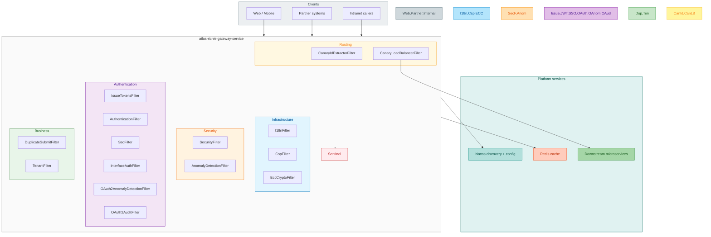
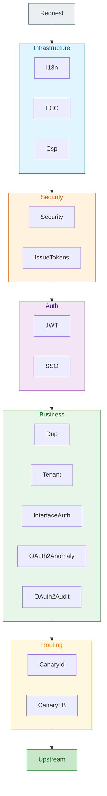

# Atlas Richie Gateway Service

**Languages:** [English](README.md) | [简体中文](README.zh.md)

## Table of contents

- [Overview](#overview)
- [Detailed design docs](#detailed-design-docs)
- [Deployment architecture](#deployment-architecture)
- [Deployment modes](#deployment-modes)
- [Filter architecture](#filter-architecture)
- [Core capabilities](#core-capabilities)
- [Design deep dives](#design-deep-dives)
- [Built-in HTTP APIs](#built-in-http-apis)
- [Configuration](#configuration)
- [Quick start](#quick-start)
- [Monitoring and logging](#monitoring-and-logging)
- [Development guide](#development-guide)
- [Client SDKs](#client-sdks)
- [Version history](#version-history)
- [Related documentation](#related-documentation)

## Overview

**Atlas Richie Gateway Service** (`atlas-richie-gateway-service`) is the unified API gateway for the Atlas Richie middle platform. It is built on **Spring Cloud Gateway (WebFlux)** and ships as a **single deployable artifact** that supports multiple deployment personalities through configuration:

| Deployment mode | Typical audience | Primary authentication |
|-----------------|------------------|------------------------|
| **Microservice gateway** | Internal apps, BFF, employee portals | JWT (`platform.gateway.token.enable=true`) |
| **OpenAPI gateway** | Partners, third-party integrations | OAuth 2.0 Client Credentials (`platform.gateway.interface-auth.enable=true`) |
| **Internal gateway** | Intranet, service-to-service edge | Often minimal auth (both auth switches off + network isolation) |

> **Mutual exclusion:** `platform.gateway.token.enable` and `platform.gateway.interface-auth.enable` **cannot both be `true`**. `GatewayAuthConfigValidator` fails fast at startup if they conflict.

Shared cross-service settings (`token`, `tenant`, `deploy`, `audit-enabled`) live in **`atlas-richie-contract`** as `GatewayContract` under prefix `platform.gateway`. Gateway-only settings (CSP, ECC, SSO, anomaly detection, duplicate submit, hardware fingerprint, fallback) are in **`GatewayConfig`** with the same prefix.

The gateway is **configuration-driven**: one artifact switches microservice / OpenAPI / internal personalities via Nacos without code changes.

## Detailed design docs

> This README is the overview and runbook. The following documents contain full topology diagrams, sequence charts, and tuning guides (primarily in Chinese).

| Document | Topics |
|----------|--------|
| [Gateway Design Document](docs/en/gateway-design.md) | ECS/K8s, five filter layers, ECC, duplicate submit, auth, canary, Sentinel, JVM |
| [Circuit Breaker Architecture](docs/en/circuit-breaker-architecture.md) | Sentinel flow, degrade, fallback chain |
| [Canary Release — Store Dimension](docs/en/canary-store-dimension.md) | Store-level canary ID extraction |
| [K8s Canary Deployment](docs/en/k8s-canary-deployment.md) | Gateway Pod canary |
| [Degraded Response Configuration](docs/en/degraded-response-configuration.md) | Path-specific fallback messages |
| [CSP Security Header Configuration](docs/en/csp-security-header.md) | CSP policy configuration, full-chain protection guide (gateway + Nginx/ALB), directive reference |
| [OAuth2 Authentication Architecture](docs/en/oauth2-authentication-architecture.md) | Client credentials, scope, audit |
| [k8s-deployment-example.yaml](docs/en/k8s-deployment-example.yaml) | Sample K8s manifests |

## Deployment architecture

Production usually runs on **ECS** or **Kubernetes**. Logically you may still operate separate clusters for external ToB/ToC, intranet, and OpenAPI.

Application name: `platform-gateway-service`, default port **9500**. The `prod` profile is activated by default (via `${ENV:prod}` in `bootstrap.yml`). Functional profiles (`cache`, `gateway`) can be included via `spring.profiles.include`.

### ECS (summary)

```
Internet: client → LB → Nginx (optional Keepalive VIP) → external gateway (ToB / ToC) → services
Intranet: internal client → internal gateway → services
```

- External and internal gateway clusters are **isolated**.
- **All ingress** (including intranet) should pass through the gateway for authentication.
- Discovery: Nacos (`server-addr: 127.0.0.1:8848`, namespace `public`, group `global`); upstream URIs: `lb://service-id`.
- Nacos config imports: `platform-cache.yaml` (Redis), `platform-gateway.yaml` (routes & features); append `platform-gateway-openapi.yaml` for OpenAPI mode.

### Kubernetes (summary)

```
North-south: client → LB → Ingress → Gateway Service → Gateway Pod → business Service → Pod
East-west: pod → target Service (CoreDNS), typically **without** the gateway
```

- Public traffic goes through the gateway; pod-to-pod calls rely on **NetworkPolicy** instead of app-level signing.
- Scale via Deployment / HPA; config still from Nacos.
- Image build: **Jib Maven Plugin** pushes to Harbor registry (`${harbor.url}/platform/${project.artifactId}`) with tags `${docker.image.version}` (current `4.0.0`) and `latest`.
- Base image: `ghcr.io/graalvm/jdk-community:25`; JVM args `-Xmx8g` with Java 25 `--add-opens` flags.
- Alternative Dockerfile: supports `docker build`, exposes port 9500, entrypoint `nohup java -jar /app.jar`.

### Observability

The gateway exposes all Actuator endpoints (`management.endpoints.web.exposure.include: "*"`), including:

| Endpoint | Purpose |
|----------|---------|
| `/actuator/health` | Health check (with details) |
| `/actuator/metrics` | Application metrics |
| `/actuator/prometheus` | Prometheus scraping |
| `/actuator/sentinel` | Sentinel rules & monitoring |
| `springdoc` | API docs (`springdoc.api-docs.enabled: true`) |

### ECS vs K8s

| Dimension | ECS | K8s |
|-----------|-----|-----|
| Entry | LB + Nginx | LB + Ingress |
| Discovery | Nacos | Nacos (cross-cluster) / CoreDNS + Service (in-cluster) |
| Config center | Nacos | Nacos |
| Service-to-service | Optional gateway / signing | Often direct calls, NetworkPolicy |
| Isolation | Separate gateway fleets | Namespace / NetworkPolicy |
| Log collection | File → Logstash / Filebeat | Stdout → Fluentd / Promtail |
| Scaling | Manual add/remove instances | Deployment / HPA automation |
| Image build | Manual docker build + push | Jib plugin auto-push to Harbor |
| Operations | Manual Nginx / Keepalive | Orchestration, HPA |

See [Gateway Design Document · Deployment](docs/en/gateway-design.md).

## Architecture



**Color legend**

| Color | Domain |
|-------|--------|
| Grey-blue | Clients / ingress |
| Light blue | Infrastructure (I18n, Csp, ECC) |
| Orange | Security (IP policy, anomaly detection) |
| Purple | Authentication (JWT, SSO, OAuth2) |
| Green | Business (duplicate submit, tenant) |
| Yellow | Routing (canary, load balancing) |
| Red | Traffic governance (Sentinel) |
| Teal | Platform (Nacos, Redis, downstream services) |

### Package layout

```
atlas-richie-gateway-service/
├── src/main/java/com/richie/gateway/
│   ├── config/              # GatewayConfig, SSO, ECC, Sentinel, Swagger, validators
│   ├── filter/
│   │   ├── common/          # Shared filters (all deployment modes)
│   │   │   ├── infrastructure/   # I18n, EccCrypto
│   │   │   ├── security/         # Security, AnomalyDetection
│   │   │   └── routing/          # CanaryLoadBalancer
│   │   ├── internal/        # Microservice / internal gateway
│   │   │   ├── auth/             # IssueTokens, Authentication, Sso
│   │   │   ├── business/         # DuplicateSubmit, Tenant
│   │   │   └── routing/          # CanaryIdExtractor
│   │   └── thirdparty/      # OpenAPI gateway
│   │       └── auth/             # InterfaceAuth, OAuth2Anomaly, OAuth2Audit
│   ├── controller/          # OAuth2TokenController
│   ├── client/              # AuthController (logout, invalidate)
│   ├── service/             # OAuth2, audit, ECC, duplicate submit, signature
│   ├── handler/             # GlobalErrorWebExceptionHandler
│   ├── fallback/            # GlobalFallbackController
│   └── balancer/            # CanaryLoadBalancer
├── src/main/resources/
│   ├── application-gateway.yml          # Microservice gateway sample
│   ├── application-gateway-openapi.yml  # OpenAPI gateway sample
│   ├── bootstrap.yml                    # Nacos imports
│   ├── client-library/                  # Multi-language client SDKs & examples
│   └── i18n/                            # 35+ locale message bundles
└── docs/                                # Detailed design docs (Chinese)
```

### Filter chain (`FilterOrder`)

Lower order values run first. All filters extend `AbstractBaseFilter` and skip logic when `enableVerifyFilter` returns `false`.

| Order | Filter | Layer | Active when |
|------:|--------|-------|-------------|
| -1000 | `I18nFilter` | Infrastructure | Always (locale from headers) |
| -900 | `EccCryptoFilter` | Infrastructure | `platform.gateway.ecc-crypto.enabled` |
| -850 | `CspFilter` | Infrastructure | `platform.gateway.csp.enable` |
| -800 | `SecurityFilter` | Security | `platform.gateway.security.enable` |
| -799 | `AnomalyDetectionFilter` | Security | Anomaly config enabled |
| -700 | `IssueTokensFilter` | Auth | Login URI matched (`token` flow) |
| 0 | `AuthenticationFilter` | Auth | `token.enable` + path not in `ignore-uri-list` |
| 100 | `SsoFilter` | Auth | SSO enabled |
| 200 | `DuplicateSubmitFilter` | Business | Duplicate submit enabled |
| 300 | `TenantFilter` | Business | `tenant.enabled` (contract) |
| 400 | `InterfaceAuthFilter` | Business | `interface-auth.enable` (OpenAPI) |
| 401 | `OAuth2AnomalyDetectionFilter` | Business | OpenAPI + anomaly config |
| 402 | `OAuth2AuditFilter` | Business | `audit-enabled` (contract) |
| 450 | `CanaryIdExtractorFilter` | Routing | Canary/deploy enabled |
| LB+2 | `CanaryLoadBalancerFilter` | Routing | Canary load balancing enabled |


## Deployment modes

### Microservice gateway

**Use for:** Nacos-backed internal APIs, admin consoles, mobile backends.

**Enable:**

```yaml
platform:
  gateway:
    token:
      enable: true
      secret: <jwt-secret>
      login-uri-list:
        - /gateway/login
      ignore-uri-list:
        - (/actuator).+
    interface-auth:
      enable: false
    tenant:
      enabled: true
    deploy:
      enabled: true   # canary
    sso:
      enable: true    # optional
```

**Capabilities:** JWT validation and renewal, token blacklist, login token issuance (`IssueTokensFilter`), optional **MFA** on configured login URIs (`platform.gateway.token.mfa-enabled-login-uri-list`), SSO duplicate-login detection, multi-tenant headers, duplicate-submit protection, hardware fingerprint binding, canary routing.

**Nacos:** `optional:nacos:platform-gateway.yaml` (see `bootstrap.yml`).

### OpenAPI gateway

**Use for:** Partner and third-party HTTP APIs.

**Enable:**

```yaml
platform:
  gateway:
    token:
      enable: false
    interface-auth:
      enable: true
      token-secret: <signing-secret>
    audit-enabled: true   # OAuth2 audit publish
```

**Capabilities:**

- **OAuth 2.0** (`/api/oauth2/token`): `client_credentials`, `refresh_token` (RFC 6749)
- **Token revoke** (`/api/oauth2/revoke`)
- **Token introspect** (`/api/oauth2/introspect`, non-`prod` profile only)
- `InterfaceAuthFilter`: Bearer token validation, per-client **IP whitelist**, **scope** checks, `clientId` forwarded to downstream
- `OAuth2AnomalyDetectionFilter`: token replay, abnormal refresh, client rate limits
- `OAuth2AuditFilter`: response capture and audit events (`OAuth2AuditEvent` → messaging when enabled)

**Nacos:** `optional:nacos:platform-gateway-openapi.yaml` (uncomment in `bootstrap.yml` for OpenAPI deployments).

### Internal gateway

**Use for:** East-west traffic inside a VPC/VNet; callers are already trusted by network policy.

**Typical pattern:** `token.enable: false` and `interface-auth.enable: false`; rely on private network, optional `security` / Sentinel, and route definitions only. Tune `ignore-uri-list` or disable filters you do not need.

> Still use **one auth mode** if exposing any path to less-trusted callers—do not enable both JWT and OAuth2.

## Core capabilities

### 1. Authentication (microservice gateway)

- **JWT** (`AuthenticationFilter`): header `x-rd-request-apitoken`; Redis blacklist prefix `blacklist-path`
- **Renewal** within `expiration-renewal-time` minutes before expiry
- **Login token issue** (`IssueTokensFilter`) on `login-uri-list`; optional **MFA** (`mfa-enabled-login-uri-list`)
- **SSO** (`SsoFilter`): online tokens, portal check, duplicate-login detection
- **Hardware fingerprint** on issue/validate
- **APIs:** `/api/auth/invalid/{token}`, `/api/auth/logout` (incl. MFA header `x-rd-request-mfa-token`)

### 2. OpenAPI / OAuth 2.0

- `POST /api/oauth2/token` — `client_credentials`, `refresh_token` (RFC 6749)
- `POST /api/oauth2/revoke`; `POST /api/oauth2/introspect` (non-`prod` only)
- `InterfaceAuthFilter`: Bearer, per-client **IP whitelist**, **scope**, downstream `clientId`
- `OAuth2AnomalyDetectionFilter`, `OAuth2AuditFilter` (`audit-enabled` must match consumers)

See [OAuth2 Authentication Architecture](docs/en/oauth2-authentication-architecture.md).

### 3. Routing, discovery, canary

- Nacos + `lb://`; routes in `platform-gateway.yaml`
- `CanaryLoadBalancer`; headers `X-Canary-Env`, `X-Canary-Category`, `X-Canary-Id`
- Auto store ID: [Canary Release — Store Dimension](docs/en/canary-store-dimension.md)

### 4. Sentinel

Nacos rules: `flow`, `degrade`, `param-flow`, `system`, `authority`. Fallback: [Degraded Response Configuration](docs/en/degraded-response-configuration.md).

### 5. Security

`SecurityFilter`, `AnomalyDetectionFilter`, ECC, duplicate submit ([deep dives](#design-deep-dives)), global CORS.

#### CSP (Content-Security-Policy) Protection

CSP is an HTTP response header that tells the browser which resource origins are allowed to load and execute. It defends against:

| Attack Type | How CSP Defends |
|-------------|-----------------|
| **XSS** | `script-src` restricts script sources; browser refuses any script outside the whitelist |
| **Data injection** | `default-src` limits resource loading to trusted origins |
| **Clickjacking** | `frame-ancestors 'none'` prevents your page from being embedded in third-party iframes |
| **Data exfiltration** | `connect-src 'self'` restricts XHR/fetch to same-origin only |
| **Base-URI injection** | `base-uri 'self'` locks `<base>` tag to the page's origin |

**Full-chain coverage** requires **two layers**:

| Layer | Protects | How to configure |
|-------|----------|-----------------|
| **Gateway (CspFilter)** | All API responses proxied through the gateway (`/api/**`) | `platform.gateway.csp` in Nacos (see below) |
| **Proxy (Nginx/ALB)** | SPA HTML pages and static assets (served directly by Nginx) | Nginx `add_header Content-Security-Policy "..." always;` |

> ⚠️ The gateway only covers API responses. SPA HTML pages are served by Nginx/ALB directly and need a separate `add_header` directive. Confirm proxy config by setting `proxy-csp-configured: true` to silence the startup warning from `CspFilter`.

**Quick start — Gateway layer** (in Nacos `platform-gateway.yaml`):

```yaml
platform:
  gateway:
    csp:
      enable: true
      policy: "default-src 'self'; script-src 'self' 'unsafe-inline'; style-src 'self' 'unsafe-inline'; img-src 'self' data: https:; font-src 'self' data:; connect-src 'self'; frame-src 'self'; frame-ancestors 'none'; base-uri 'self'"
      proxy-csp-configured: false   # set true after Nginx/ALB is configured
```

**Quick start — Proxy layer** (Nginx):

```nginx
add_header Content-Security-Policy "default-src 'self'; script-src 'self' 'unsafe-inline'; style-src 'self' 'unsafe-inline'; img-src 'self' data: https:; font-src 'self' data:; connect-src 'self'; frame-src 'self'; frame-ancestors 'none'; base-uri 'self'" always;
```

**Verification**: Browser DevTools → Network → verify both API and HTML responses include `content-security-policy` header.

**Deployment notes**:
- **Grafana embedding**: relax `frame-src` to `frame-src 'self' https://grafana.example.com`
- **Gradual rollout**: use `Content-Security-Policy-Report-Only` mode first (change header name in CspFilter), observe for one week, then switch to enforcement
- **`unsafe-inline`**: required by Angular/PrimeNG; consider nonce or hash strategies for stricter environments
- **Full design doc**: [CSP Security Header Configuration](docs/en/csp-security-header.md) covers directive reference, relaxation scenarios, report-uri setup, and deployment checklist

### 6. Multi-tenant

`TenantFilter` + `GatewayContract.tenant`.

### 7. i18n (35 locales)

`Accept-Language` or `X-RD-Request-Language`; bundles under `src/main/resources/i18n/` (full locale list in [README.zh.md](README.zh.md#7-国际化)).

### 8. Global errors

| Environment | Behavior |
|-------------|----------|
| dev/test | Type, message, stack |
| prod | i18n message + **16-char error ID**; stack in logs only |

| HTTP | Key |
|------|-----|
| 400 | ERROR_BAD_REQUEST |
| 401 | ERROR_UNAUTHORIZED |
| 403 | ERROR_FORBIDDEN |
| 404 | ERROR_NOT_FOUND |
| 405 | ERROR_METHOD_NOT_ALLOWED |
| 500 | ERROR_INTERNAL_SERVER |
| 502 | ERROR_BAD_GATEWAY |
| 503 | ERROR_SERVICE_UNAVAILABLE |
| 504 | ERROR_GATEWAY_TIMEOUT |
| other | ERROR_INTERNAL |

### 9. Observability

SpringDoc, Actuator/Prometheus, Sentinel dashboard, Logback access logs.

## Design deep dives

### ECC encryption

ECDH + **AES-GCM**. Exchange: `POST /api/crypto/exchange`; body via `X-Encrypted-Data` + `X-Gateway-KeyId`. **423** when `KeyPair` rotates (`KeyPairManager`). Config: `platform.gateway.ecc-crypto`. Full diagrams: [Gateway Design Document · ECC](docs/en/gateway-design.md#41-ecc-encrypted-communication).

### Duplicate submit

Client queue + `DuplicateSubmitFilter` (Redis).  
`requestId = MD5(path + method + timeBucket + optional IP/user/bodyHash)`.  
Sample: `application-duplicate-submit.yml`; **429** / `DUPLICATE_SUBMIT`. Details: [Gateway Design Document · Duplicate Submit](docs/en/gateway-design.md#42-duplicate-submit-prevention).

### Canary

Simple: `X-Canary-Env: true`. Auto ID order: `X-Canary-Id` → `x-rd-request-shopcode` → JWT `storeId`/`shopCode` → path/query `storeId`.

### Five-layer filters



## Built-in HTTP APIs

| Path | Controller | Description |
|------|------------|-------------|
| `POST /api/oauth2/token` | `OAuth2TokenController` | Issue / refresh tokens |
| `POST /api/oauth2/revoke` | `OAuth2TokenController` | Revoke token |
| `POST /api/oauth2/introspect` | `OAuth2TokenController` | Introspection (`@Profile("!prod")`) |
| `GET /api/auth/invalid/{token}` | `AuthController` | Blacklist token |
| `GET /api/auth/logout` | `AuthController` | Logout (access + MFA tokens) |
| `GET /fallback/default` | `GlobalFallbackController` | Sentinel / circuit fallback body |
| SpringDoc | `SwaggerConfig` | API docs when `springdoc.*.enabled=true` |

## Configuration reference

### Nacos imports (`bootstrap.yml`)

```yaml
spring:
  config:
    import:
      - optional:nacos:platform-cache.yaml?refreshEnabled=true
      - optional:nacos:platform-gateway.yaml?refreshEnabled=true
      # OpenAPI deployments:
      # - optional:nacos:platform-gateway-openapi.yaml?refreshEnabled=true
```

### Shared contract (`GatewayContract`)

Bound under `platform.gateway` in `atlas-richie-contract`:

- `audit-enabled` — OAuth2 audit pipeline
- `token` — JWT filter lists, blacklist path, MFA login URIs
- `tenant` — multi-tenant filter
- `deploy` — canary / gray release

Business services can depend on `atlas-richie-contract` only to read the same YAML shape.

### Gateway-only (`GatewayConfig`)

| Key | Purpose |
|-----|---------|
| `security` | IP throttling and ban policies |
| `interface-auth` | OAuth2 third-party filter |
| `sso` | Single sign-on |
| `ecc-crypto` | ECC/AES-GCM encryption |
| `duplicate-submit` | Anti double-submit |
| `fallback` | Degrade response messages |
| `hardware-fingerprint` | Device binding |
| `csp` | CSP security header (XSS/injection defense; requires gateway + Nginx/ALB two-layer deployment) |

Local samples: `application-gateway.yml`, `application-gateway-openapi.yml`.

### Nacos sample (microservice gateway)

```yaml
spring.cloud.sentinel.datasource:  # flow, degrade — see application-gateway.yml
spring.cloud.gateway.routes:
  - id: sample-service
    uri: lb://sample-service
    predicates: [Path=/api/sample/**]

platform.gateway:
  token:
    enable: true
    token-valid-duration: 1
    expiration-renewal-time: 10
    secret: <random>
    login-uri-list: [/gateway/login]
    ignore-uri-list: [(/actuator).+]
  tenant.enabled: true
  deploy.enabled: true
  security.enable: true
  csp:
    enable: true
    policy: "default-src 'self'; script-src 'self' 'unsafe-inline'; style-src 'self' 'unsafe-inline'; img-src 'self' data: https:; font-src 'self' data:; connect-src 'self'; frame-src 'self'; frame-ancestors 'none'; base-uri 'self'"
    proxy-csp-configured: false
```

Field reference: `token-valid-duration`, `expiration-renewal-time`, `security.rule`, `deploy.canary-category` — see [README.zh.md](README.zh.md#配置项说明) (Chinese table, same property names).

## Quick start

### Requirements

- JDK 25+
- Maven 3.9+
- Redis 6+ (cache, blacklist, OAuth2 clients, duplicate submit)
- Nacos 2+ (discovery + config)
- Sentinel Dashboard (optional, for rule tuning)

### Run locally

```bash
cd atlas-richie-gateway-service
mvn spring-boot:run -Dspring-boot.run.profiles=dev
```

Default port: **9500** (`application.yml`). Activate gateway profile via Nacos or:

```yaml
spring:
  profiles:
    include: cache,gateway
```

**JAR:** `java -jar atlas-richie-gateway-service-${revision}.jar --spring.config.additional-location=./application.yml`  
**K8s:** [docs/k8s-deployment-example.yaml](docs/k8s-deployment-example.yaml)

### Switch deployment mode

1. Choose **one** auth switch: `token.enable` **or** `interface-auth.enable`.
2. Point Nacos import to `platform-gateway.yaml` or `platform-gateway-openapi.yaml`.
3. Align `audit-enabled`, `tenant`, and `deploy` with downstream consumers (see [atlas-richie-base/README.md](../atlas-richie-base/README.md)).

## Client SDKs

Multi-language helpers and examples live under [`src/main/resources/client-library/`](src/main/resources/client-library/README.md):

| Language | Path |
|----------|------|
| Web (TS) | `client-library/web/` |
| Node.js | `client-library/nodejs/` |
| Mini program | `client-library/miniprogram/` |
| Go | `client-library/go/` |
| Rust | `client-library/rust/` |
| C++ | `client-library/cpp/` |
| Kotlin (Android) | `client-library/kotlin/` |
| Swift (iOS) | `client-library/swift/` |

Includes ECC crypto, duplicate-submit headers, and device fingerprint samples.

## Monitoring and logging

- Logback: `logback-spring.xml`; correlate prod issues via error ID in logs
- Health: `GET /actuator/health`
- Metrics: Actuator + Prometheus; Sentinel dashboard from `spring.cloud.sentinel.transport.dashboard`

## Development guide

1. Extend `AbstractBaseFilter`, add order in `FilterOrder`, register `@Component`
2. Add routes in Nacos `platform-gateway.yaml` for hot refresh
3. Never enable `token.enable` and `interface-auth.enable` together (`GatewayAuthConfigValidator`)

## Related documentation

- [Atlas Richie Platform](../README.md) · [简体中文](../README.zh.md)
- [Atlas Richie Base](../atlas-richie-base/README.md) · [简体中文](../atlas-richie-base/README.zh.md)
- [Atlas Richie Component](../atlas-richie-component/README.md)
- [Contributing](../CONTRIBUTING.md) · [简体中文](../CONTRIBUTING.zh.md)

## Version matrix

| Item | Version |
|------|---------|
| Platform Version | `1.0.0-SNAPSHOT` |
| JDK | 25 |
| Spring Boot | 4.0.6 |
| Spring Cloud Gateway | 4.x (WebFlux) |

---

**Atlas Richie Gateway** — one gateway, multiple deployment modes, configuration-driven security and routing
