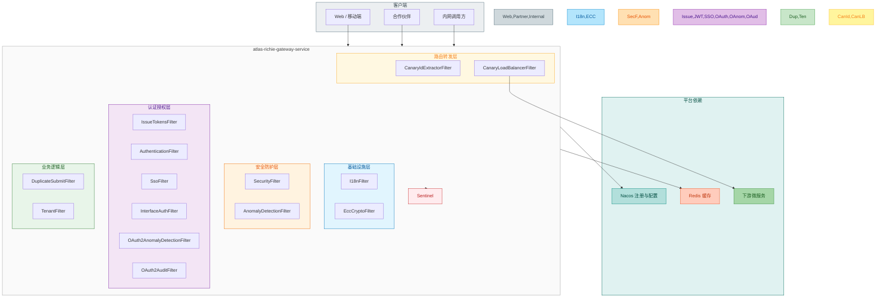
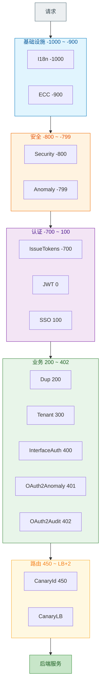

# Atlas Richie Gateway Service

**语言：** [English](README.md) | [简体中文](README.zh.md)

## 目录

- [概述](#概述)
- [详细设计文档](#详细设计文档)
- [部署架构](#部署架构)
- [部署模式](#部署模式)
- [过滤器架构](#过滤器架构)
- [核心功能](#核心功能)
- [功能设计细节](#功能设计细节)
- [内置 HTTP 接口](#内置-http-接口)
- [配置说明](#配置说明)
- [快速开始](#快速开始)
- [监控和日志](#监控和日志)
- [开发指南](#开发指南)
- [客户端 SDK](#客户端-sdk)
- [版本历史](#版本历史)
- [相关文档](#相关文档)

## 概述

**Atlas Richie Gateway Service**（`atlas-richie-gateway-service`）是 Atlas Richie 技术中台的**统一 API 网关**，基于 **Spring Cloud Gateway（WebFlux）** 构建。同一套制品可通过配置切换为不同部署形态：

| 部署模式 | 典型场景 | 主认证方式 |
|----------|----------|------------|
| **微服务网关** | 内部应用、BFF、员工端 | JWT（`platform.gateway.token.enable=true`） |
| **OpenAPI 网关** | 合作伙伴、第三方对接 | OAuth 2.0 客户端凭证（`platform.gateway.interface-auth.enable=true`） |
| **内网网关** | VPC 东西向、服务间入口 | 常关闭双认证，依赖网络隔离 + 可选 Sentinel |

> **互斥约束：** `platform.gateway.token.enable` 与 `platform.gateway.interface-auth.enable` **不能同时为 `true`**。启动时 `GatewayAuthConfigValidator` 会校验并失败，避免认证链冲突。

跨服务共享配置（`token`、`tenant`、`deploy`、`audit-enabled`）在 **`atlas-richie-contract`** 的 `GatewayContract` 中，前缀 `platform.gateway`。网关专属配置（ECC、SSO、异常检测、防重复提交、硬件指纹、降级文案等）由 **`GatewayConfig`** 承载，前缀相同，字段各取所需。

网关采用**配置化设计**：同一制品通过 Nacos 配置切换微服务 / OpenAPI / 内网形态，无需改代码。

## 详细设计文档

> 模块 README 覆盖概览、部署模式与常用配置；下列文档包含完整架构图、时序图与调优说明。

| 文档 | 内容 |
|------|------|
| [网关设计文档](docs/zh/gateway-design.md) | ECS/K8s 拓扑、五层过滤器、ECC/防重/认证/灰度/Sentinel 详解、JVM 调优 |
| [网关熔断器架构图](docs/zh/circuit-breaker-architecture.md) | Sentinel 流控、熔断、降级与 Fallback 链路 |
| [灰度发布最佳实践-按门店维度](docs/zh/canary-store-dimension.md) | `CanaryIdExtractorFilter` 门店 ID 自动提取 |
| [K8s 灰度部署方案](docs/zh/k8s-canary-deployment.md) | Gateway Pod 灰度 |
| [降级响应配置说明](docs/zh/degraded-response-configuration.md) | `GlobalFallbackController` 按路径文案 |
| [第三方 OAuth2.0 认证架构](docs/zh/oauth2-authentication-architecture.md) | Client Credentials、Scope、审计 |
| [k8s-deployment-example.yaml](docs/zh/k8s-deployment-example.yaml) | K8s 部署样例 |

## 部署架构

网关在生产中常见两种基础设施形态；**逻辑上**还可拆为外网 ToB/ToC、内网、OpenAPI 等多套实例，物理隔离。

### ECS 部署（摘要）

```
外网：客户端 → LB → Nginx（可选 Keepalive VIP）→ 外网 Gateway（ToB / ToC 集群）→ 业务服务
内网：ECS 内网客户端 → 内网 Gateway → 业务服务
```

- 内外网 Gateway **集群独立**，公网与内网流量隔离。
- **所有入口流量**（含内网）建议经网关鉴权，避免绕过身份校验直连业务。
- 服务发现：Nacos；下游路由：`lb://service-id`。

### K8s 部署（摘要）

```
公网：客户端 → LB → Ingress → Gateway Service → Gateway Pod → 业务 Service → Pod
东西向：业务 Pod → 目标 Service（CoreDNS），通常不经 Gateway
```

- 公网流量必经 Gateway；Pod 间调用可用 Service + **NetworkPolicy**，无需应用层签名。
- 扩缩容：Deployment / HPA；配置仍可由 Nacos 下发。

### ECS vs K8s

| 维度 | ECS | K8s |
|------|-----|-----|
| 入口 | LB + Nginx | LB + Ingress |
| 服务发现 | Nacos | CoreDNS + Service |
| 服务间调用 | 可选经 Gateway / 签名 | 多直连，NetworkPolicy 兜底 |
| 隔离 | 独立 Gateway 集群（内外网、ToB/ToC） | Namespace / NetworkPolicy |
| 运维 | Nginx、Keepalive 手工维护 | 编排与 HPA 自动化 |

详见 [网关设计文档 · 部署架构](docs/zh/gateway-design.md)。

## 架构



**配色图例**

| 色块 | 功能域 |
|------|--------|
| 灰蓝 | 客户端 / 请求入口 |
| 浅蓝 | 基础设施层（I18n、ECC） |
| 橙 | 安全防护层（IP 安全、异常检测） |
| 紫 | 认证授权层（JWT、SSO、OAuth2 鉴权） |
| 绿 | 业务逻辑层（防重、租户） |
| 黄 | 路由转发层（灰度、负载均衡） |
| 红 | 流量治理（Sentinel） |
| 青绿 | 平台依赖（Nacos、Redis、下游服务） |

### 代码结构

```
atlas-richie-gateway-service/
├── src/main/java/com/richie/gateway/
│   ├── config/              # GatewayConfig、SSO、ECC、Sentinel、Swagger、启动校验
│   ├── filter/
│   │   ├── common/          # 各模式共用
│   │   │   ├── infrastructure/   # 国际化、ECC 加解密
│   │   │   ├── security/         # IP 安全、通用异常检测
│   │   │   └── routing/          # 灰度负载均衡
│   │   ├── internal/        # 微服务 / 内网网关
│   │   │   ├── auth/             # 签发 Token、JWT 认证、SSO
│   │   │   ├── business/         # 防重复提交、多租户
│   │   │   └── routing/          # 灰度 ID 提取
│   │   └── thirdparty/      # OpenAPI 网关
│   │       └── auth/             # OAuth2 鉴权、专属异常检测、审计
│   ├── controller/          # OAuth2TokenController
│   ├── client/              # AuthController（登出、作废令牌）
│   ├── service/             # OAuth2、审计、ECC、防重、签名
│   ├── handler/             # 全局异常
│   ├── fallback/            # 降级响应
│   └── balancer/            # CanaryLoadBalancer
├── src/main/resources/
│   ├── application-gateway.yml          # 微服务网关示例
│   ├── application-gateway-openapi.yml  # OpenAPI 网关示例
│   ├── bootstrap.yml
│   ├── client-library/                  # 多语言客户端 SDK 与示例
│   └── i18n/                            # 35+ 语言包
└── docs/                                # 详细设计文档
```

### 过滤器链（`FilterOrder`）

数值越小越先执行。过滤器继承 `AbstractBaseFilter`，`enableVerifyFilter` 为 `false` 时直接放行。

| 顺序 | 过滤器 | 层级 | 启用条件 |
|------|--------|------|----------|
| -1000 | `I18nFilter` | 基础设施 | 始终（按请求头解析语言） |
| -900 | `EccCryptoFilter` | 基础设施 | `ecc-crypto.enabled` |
| -800 | `SecurityFilter` | 安全 | `security.enable` |
| -799 | `AnomalyDetectionFilter` | 安全 | 异常检测配置开启 |
| -700 | `IssueTokensFilter` | 认证 | 命中 `login-uri-list` |
| 0 | `AuthenticationFilter` | 认证 | `token.enable` 且路径不在 `ignore-uri-list` |
| 100 | `SsoFilter` | 认证 | SSO 开启 |
| 200 | `DuplicateSubmitFilter` | 业务 | 防重复提交开启 |
| 300 | `TenantFilter` | 业务 | `tenant.enabled`（契约） |
| 400 | `InterfaceAuthFilter` | 业务 | `interface-auth.enable`（OpenAPI） |
| 401 | `OAuth2AnomalyDetectionFilter` | 业务 | OpenAPI + 异常检测 |
| 402 | `OAuth2AuditFilter` | 业务 | `audit-enabled`（契约） |
| 450 | `CanaryIdExtractorFilter` | 路由 | 灰度开启 |
| LB+2 | `CanaryLoadBalancerFilter` | 路由 | 灰度负载均衡开启 |


## 部署模式

### 微服务网关

**适用：** 基于 Nacos 的内部 API、管理端、移动后端。

```yaml
platform:
  gateway:
    token:
      enable: true
      secret: <jwt-密钥>
      login-uri-list:
        - /gateway/login
      ignore-uri-list:
        - (/actuator).+
    interface-auth:
      enable: false
    tenant:
      enabled: true
    deploy:
      enabled: true
    sso:
      enable: true   # 可选
```

**能力：** JWT 校验与续期、黑名单、登录响应签发 Token（`IssueTokensFilter`）、按 URI 启用 **MFA**（`mfa-enabled-login-uri-list`）、SSO 重复登录检测、多租户、防重复提交、硬件指纹绑定、金丝雀路由。

**Nacos：** `optional:nacos:platform-gateway.yaml`（见 `bootstrap.yml`）。

### OpenAPI 网关

**适用：** 对外开放、合作伙伴 HTTP API。

```yaml
platform:
  gateway:
    token:
      enable: false
    interface-auth:
      enable: true
      token-secret: <签名密钥>
    audit-enabled: true
```

**能力：**

- **OAuth 2.0**（`/api/oauth2/token`）：`client_credentials`、`refresh_token`（RFC 6749）
- **撤销**（`/api/oauth2/revoke`）
- **自省**（`/api/oauth2/introspect`，仅非 `prod` 环境）
- `InterfaceAuthFilter`：Bearer 校验、按客户端 **IP 白名单**、**Scope** 校验、向下游传递 `clientId`
- `OAuth2AnomalyDetectionFilter`：Token 重放、异常刷新、客户端限流
- `OAuth2AuditFilter`：审计事件（`OAuth2AuditEvent`，可对接消息组件）

**Nacos：** 在 `bootstrap.yml` 中启用 `platform-gateway-openapi.yaml` 导入。

### 内网网关

**适用：** 专有云 / 内网东西向流量，调用方已由网络策略信任。

**常见配置：** `token.enable` 与 `interface-auth.enable` 均为 `false`，仅保留路由、可选 `security` / Sentinel。按路径收紧 `ignore-uri-list` 或关闭不需要的过滤器。

> 若部分路径暴露给低信任调用方，仍应启用**一种**认证方式，勿同时开启 JWT 与 OAuth2。

## 核心功能

### 1. 统一鉴权认证（微服务网关）

- **JWT 认证**（`AuthenticationFilter`）：请求头 `x-rd-request-apitoken`；`JwtUtils` 校验签名与过期；黑名单 Redis 前缀 `blacklist-path`
- **自动续期**：到期前 `expiration-renewal-time`（分钟）内访问可续签
- **登录签发**（`IssueTokensFilter`）：匹配 `login-uri-list` 时拦截登录 JSON 响应，写入 JWT；支持 **MFA**（`mfa-enabled-login-uri-list` + `atlas-richie-component-mfa-validation`）
- **SSO**（`SsoFilter`）：在线 Token、门户校验、重复登录检测（`sso.online-token-path`）
- **硬件指纹**（`HardwareFingerprintUtils`）：签发/校验时绑定设备，降低 Token 盗用风险
- **令牌管理 API**：`/api/auth/invalid/{token}`、`/api/auth/logout`（含 MFA 临时令牌头 `x-rd-request-mfa-token`）

### 2. OpenAPI / OAuth 2.0（OpenAPI 网关）

- **Token 端点** `POST /api/oauth2/token`：`client_credentials`、`refresh_token`（RFC 6749）
- **撤销** `POST /api/oauth2/revoke`；**自省** `POST /api/oauth2/introspect`（仅非 `prod`）
- **InterfaceAuthFilter**：`Authorization: Bearer`、按 `clientId` 的 **IP 白名单**、**Scope** 校验、向下游传递客户端标识
- **OAuth2AnomalyDetectionFilter**：Token 重放、异常刷新、客户端级限流
- **OAuth2AuditFilter**：响应体审计 → `OAuth2AuditEvent`（需 `audit-enabled` 与消息消费端一致）

详见 [第三方 OAuth2.0 认证架构](docs/zh/oauth2-authentication-architecture.md)。

### 3. 路由、发现与灰度

- **动态路由**：Nacos 服务发现 + `lb://`；路由定义在 Nacos `platform-gateway.yaml` 或本地 `spring.cloud.gateway.routes`
- **负载均衡**：Spring Cloud LoadBalancer；灰度场景使用自定义 `CanaryLoadBalancer`
- **金丝雀**：`deploy.enable` + `canary-category`（`NONE` / `ID` / `VERSION`）+ `id-list`；请求头 `X-Canary-Env`、`X-Canary-Category`、`X-Canary-Id` 等（见 [配置说明](#配置说明)）
- **门店维度自动提取**：`CanaryIdExtractorFilter` 默认从 `storeId`/`shopCode` 等提取，可自定义字段；详见 [灰度发布最佳实践](docs/zh/canary-store-dimension.md)

### 4. Sentinel 限流、熔断与降级

Nacos 数据源（示例见 `application-gateway.yml`）：

| 规则类型 | `rule-type` | 作用 |
|----------|-------------|------|
| 流控 | `flow` | QPS、并发线程数、预热、排队 |
| 熔断降级 | `degrade` | 慢调用比例、异常比例/数量 |
| 热点参数 | `param-flow` | 按参数值细粒度限流 |
| 系统保护 | `system` | 负载、CPU、RT、入口 QPS |
| 授权 | `authority` | 黑白名单来源 |

降级响应：`GlobalFallbackController` + `platform.gateway.fallback` 按路径配置文案（见 [降级响应配置说明](docs/zh/degraded-response-configuration.md)）。

### 5. 安全防护

- **SecurityFilter**：时间窗口内访问次数超 `security-threshold` 触发 `banned_ip` / `custom_http_status` / `redirect`
- **AnomalyDetectionFilter**：暴力破解、异常 IP、通用限流（不限于 OAuth2）
- **ECC + AES-GCM**：应用层混合加密（见 [功能设计细节 · ECC](#ecc-加密通信)）
- **防重复提交**：客户端 + 网关 Redis 双道防线（见 [功能设计细节 · 防重复提交](#防重复提交)）
- **CORS**：`spring.cloud.gateway.server.webflux.globalcors`

### 6. 多租户

- **TenantFilter**：从 Token 解析租户；校验租户状态与过期；请求头约定见 `GatewayContract.tenant`
- 与业务库 `tenantId` 字段配合（参见 Base 包 `TenantAuditDomain`）

### 7. 国际化

- **35 种语言**错误与网关提示（`src/main/resources/i18n/messages_*.properties`）
- 识别：`Accept-Language` 或 `X-RD-Request-Language`；默认 `platform.component.i18n.default-locale`
- 与业务系统字典可同步（`atlas-richie-component-i18n`）

**亚洲（12）**：zh_CN、zh_TW、ja_JP、ko_KR、th_TH、vi_VN、id_ID、ms_MY、hi_IN、ar_SA、ur_PK、bn_BD  

**欧洲（19）**：en_US、de_DE、fr_FR、it_IT、es_ES、pt_PT、ru_RU、nl_NL、pl_PL、tr_TR、sv_SE、nb_NO、da_DK、fi_FI、cs_CZ、hu_HU、ro_RO、el_GR、uk_UA  

**美洲（2）**：es_MX、pt_BR · **中东（2）**：he_IL、fa_IR

### 8. 全局异常处理

`GlobalErrorWebExceptionHandler` + `ErrorStrategy` / `ErrorStrategyContext`：

| 环境 | 行为 |
|------|------|
| dev/test | 返回异常类型、消息、堆栈，便于调试 |
| prod | 返回 i18n 通用文案 + **16 位错误 ID**；完整堆栈仅写日志 |

**排查步骤：** ① 从响应提取错误 ID → ② 日志搜索 `错误ID: xxx` → ③ 根据路径、异常类分析。

| HTTP | i18n Key | 说明 |
|------|----------|------|
| 400 | ERROR_BAD_REQUEST | 参数错误 |
| 401 | ERROR_UNAUTHORIZED | 未登录 |
| 403 | ERROR_FORBIDDEN | 无权限 |
| 404 | ERROR_NOT_FOUND | 资源不存在 |
| 405 | ERROR_METHOD_NOT_ALLOWED | 方法不允许 |
| 500 | ERROR_INTERNAL_SERVER | 服务内部错误 |
| 502 | ERROR_BAD_GATEWAY | 网关错误 |
| 503 | ERROR_SERVICE_UNAVAILABLE | 服务不可用 |
| 504 | ERROR_GATEWAY_TIMEOUT | 网关超时 |
| 其他 | ERROR_INTERNAL | 系统内部错误 |

### 9. 其他

- **SpringDoc**：网关自带 API 文档（`springdoc.api-docs.enabled`）
- **Actuator / Prometheus**：健康检查与指标导出
- **访问日志**：路径、方法、头、状态码、耗时（Logback：`logback-spring.xml`）

## 功能设计细节

### ECC 加密通信

**方案：** ECDH 交换 AES-GCM 会话密钥（ECC 做密钥协商，AES-GCM 加密业务体）。

**流程概要：**

1. **密钥交换**：`POST /api/crypto/exchange`，交换客户端/网关公钥，双方 ECDH 得到相同共享密钥（网关 `KeyPairManager` 可定期轮换，默认约 6 小时内存密钥对，可配置固定密钥对）。
2. **加密请求**：请求头携带 `X-Encrypted-Data`、`X-Gateway-KeyId`；Body 为 Base64(IV + 密文 + Tag)。
3. **KeyId 过期**：返回 HTTP 423，客户端用新公钥重新握手后重试。

**配置：**

```yaml
platform:
  gateway:
    ecc-crypto:
      enabled: true
      encrypt-paths: ["/api/payment/**"]
      exclude-paths: ["/api/public/**", "/api/crypto/exchange", "/actuator/**"]
      client-key-cache-expire: 3600
      gateway-key-expire: 6   # 小时；未配置固定密钥对时内存轮换
```

客户端：见 `src/main/resources/client-library/` 各语言 `ecc_crypto` / `http-client` 示例。完整时序图见 [网关设计文档 · ECC](docs/zh/gateway-design.md#41-ecc加密通信)。

### 防重复提交

**双重防护：** 客户端本地队列（`client-library`）+ 网关 `DuplicateSubmitFilter`（Redis）。

**requestId 生成（网关与客户端算法一致）：**

```
MD5(路径 + HTTP方法 + floor(时间/时间窗口) + 可选IP + 可选用户ID + 可选MD5(请求体))
```

**Redis 键：** `platform:gateway:duplicate-submit:{requestId}`，TTL 建议为 `time-window` 的 2～3 倍。

**配置示例：** `application-duplicate-submit.yml`

| 配置项 | 说明 |
|--------|------|
| `time-window` | 去重窗口（毫秒），默认 3000 |
| `cache-expire` | Redis 过期（毫秒） |
| `enable-body-hash` | 相同 body 窗口内拦截 |
| `enable-user-level` / `enable-ip-level` | 用户级 / IP 级 |
| `include-paths` / `exclude-paths` | Ant 路径 |

重复时返回 HTTP 429，`error-code: DUPLICATE_SUBMIT`。流程图见 [网关设计文档 · 防重复提交](docs/zh/gateway-design.md#42-防重复提交)。

### 灰度发布（补充）

**简单模式：** 请求头 `X-Canary-Env: true`

**高级模式：**

```
X-Canary-Category: ID | VERSION
X-Canary-Version: v2          # CATEGORY=VERSION 时
X-Canary-Id: 22123            # CATEGORY=ID 时；若已配置自动提取，通常无需手写
```

**自动提取优先级（`CanaryIdExtractorFilter`）：**

1. 已有 `X-Canary-Id`
2. `x-rd-request-shopcode`
3. JWT 内 `storeId` / `shopCode`
4. 路径参数 / 查询参数 `storeId`

### 五层过滤器模型



**核心组件：** `GatewayConfig`、`GatewayContract`、`AbstractBaseFilter`、`FilterOrder`、`JwtUtils`、`NetworkUtils`、`GlobalCache`。

## 内置 HTTP 接口

| 路径 | 类 | 说明 |
|------|-----|------|
| `POST /api/oauth2/token` | `OAuth2TokenController` | 获取 / 刷新令牌 |
| `POST /api/oauth2/revoke` | `OAuth2TokenController` | 撤销令牌 |
| `POST /api/oauth2/introspect` | `OAuth2TokenController` | 令牌自省（`@Profile("!prod")`） |
| `GET /api/auth/invalid/{token}` | `AuthController` | 拉黑令牌 |
| `GET /api/auth/logout` | `AuthController` | 登出（访问令牌 + MFA 令牌） |
| `GET /fallback/default` | `GlobalFallbackController` | Sentinel / 熔断降级体 |
| SpringDoc | `SwaggerConfig` | `springdoc.*.enabled=true` 时开放文档 |

## 配置说明

### Nacos 导入（`bootstrap.yml`）

```yaml
spring:
  config:
    import:
      - optional:nacos:platform-cache.yaml?refreshEnabled=true
      - optional:nacos:platform-gateway.yaml?refreshEnabled=true
      # OpenAPI 部署：
      # - optional:nacos:platform-gateway-openapi.yaml?refreshEnabled=true
```

### 共享契约（`GatewayContract`）

前缀 `platform.gateway`，定义于 `atlas-richie-contract`：

- `audit-enabled` — OAuth2 审计总开关
- `token` — JWT 黑白名单、登录路径、MFA 登录 URI 等
- `tenant` — 多租户过滤器
- `deploy` — 灰度 / 金丝雀

业务服务仅依赖 `atlas-richie-contract` 即可与网关对齐同一份 YAML 结构。

### 网关专属（`GatewayConfig`）

| 配置项 | 用途 |
|--------|------|
| `security` | IP 限流与封禁策略 |
| `interface-auth` | 第三方 OAuth2 过滤器 |
| `sso` | 单点登录 |
| `ecc-crypto` | ECC/AES-GCM |
| `duplicate-submit` | 防重复提交 |
| `fallback` | 降级文案 |
| `hardware-fingerprint` | 设备指纹 |

本地示例：`application-gateway.yml`、`application-gateway-openapi.yml`。

### Nacos 配置示例（微服务网关）

在 Nacos 创建 `platform-gateway.yaml`（与 `bootstrap.yml` 导入名一致），可参考：

```yaml
spring:
  cloud:
    sentinel:
      transport:
        dashboard: localhost:8899
        port: 8719
      datasource:
        flow:
          nacos:
            server-addr: ${spring.cloud.nacos.server-addr}
            data-id: gateway-flow-rules.json
            groupId: gateway
            data-type: json
            rule-type: flow
        degrade:
          nacos:
            server-addr: ${spring.cloud.nacos.server-addr}
            data-id: gateway-degrade-rules.json
            groupId: gateway
            data-type: json
            rule-type: degrade
    gateway:
      server:
        webflux:
          httpclient:
            connect-timeout: 30
            response-timeout: 10s
          routes:
            - id: sample-service
              uri: lb://sample-service
              predicates:
                - Path=/api/sample/**
              filters:
                - StripPrefix=1

platform:
  gateway:
    visit-record-path: "platform:gateway:visit:"
    token:
      enable: true
      token-valid-duration: 1          # 小时
      expiration-renewal-time: 10      # 分钟
      secret: <强随机密钥>
      blacklist-path: "platform:gateway:token:"
      login-uri-list: [/gateway/login]
      ignore-uri-list: [(/actuator).+]
      mfa-enabled-login-uri-list: [/gateway/login]
    tenant:
      enabled: true
    deploy:
      enabled: true
      canary-category: ID
      id-list: ['1001', '1002']
    security:
      enable: true
      rule: banned_ip
      security-threshold: 120
      security-time-interval-unit: minutes
      security-time-interval-value: 1
    sso:
      enable: true
      online-token-path: "platform:gateway:online-token:"
    duplicate-submit:
      enabled: true
      time-window: 3000
      cache-expire: 10000
```

### 配置项说明

**Token（`GatewayContract.token`）**

| 配置项 | 说明 |
|--------|------|
| `enable` | 是否启用 JWT 过滤器 |
| `token-valid-duration` | 有效期（小时） |
| `expiration-renewal-time` | 到期前续签窗口（分钟） |
| `secret` | JWT HMAC 密钥 |
| `blacklist-path` | Redis 黑名单前缀 |
| `login-uri-list` | 登录路径（正则），触发 `IssueTokensFilter` |
| `ignore-uri-list` | 跳过 JWT 校验的路径（正则） |
| `mfa-enabled-login-uri-list` | 启用 MFA 检查的登录路径 |

**安全（`platform.gateway.security`）**

| 配置项 | 说明 |
|--------|------|
| `rule` | `banned_ip` / `custom_http_status` / `redirect` |
| `security-threshold` | 时间窗口内最大请求次数 |
| `security-time-interval-unit` / `value` | 统计窗口 |
| `banned.permanent` | 是否永久封禁 |
| `custom-return` / `redirect` | 非封禁 IP 时的响应策略 |

**灰度（`GatewayContract.deploy`）**

| 配置项 | 说明 |
|--------|------|
| `enabled` | 是否启用灰度 |
| `canary-category` | `NONE` / `ID` / `VERSION` |
| `id-list` | 参与灰度的 ID 列表（如门店 ID） |

**路由**

遵循 Spring Cloud Gateway 标准：

```yaml
spring.cloud.gateway.routes:
  - id: my-service
    uri: lb://my-service
    predicates: [Path=/api/my/**]
    filters: [StripPrefix=1]
```

## 快速开始

### 环境要求

- JDK 25+
- Maven 3.9+
- Redis 6+（缓存、黑名单、OAuth2 客户端、防重）
- Nacos 2+（注册与配置）
- Sentinel Dashboard（可选）

### 本地运行

```bash
cd atlas-richie-gateway-service
mvn spring-boot:run -Dspring-boot.run.profiles=dev
```

默认端口：**9500**。通过 Nacos 加载网关配置，或本地：

```yaml
spring:
  profiles:
    include: cache,gateway
```

### 其他启动方式

**JAR：**

```bash
java -jar atlas-richie-gateway-service-${revision}.jar \
  --spring.config.additional-location=./application.yml
```

**Docker：** 将配置挂载至容器内工作目录，镜像构建见模块 `pom.xml`（Jib）。K8s 样例见 [docs/k8s-deployment-example.yaml](docs/k8s-deployment-example.yaml)。

### 切换部署模式

1. **二选一** 开启认证：`token.enable` 或 `interface-auth.enable`。
2. Nacos 指向 `platform-gateway.yaml` 或 `platform-gateway-openapi.yaml`。
3. `audit-enabled`、`tenant`、`deploy` 与下游、消息消费端保持一致（参见 [atlas-richie-base/README.zh.md](../atlas-richie-base/README.zh.md)）。

## 客户端 SDK

多语言示例位于 [`src/main/resources/client-library/`](src/main/resources/client-library/README.md)：

| 语言 | 目录 |
|------|------|
| Web (TypeScript) | `client-library/web/` |
| Node.js | `client-library/nodejs/` |
| 小程序 | `client-library/miniprogram/` |
| Go | `client-library/go/` |
| Rust | `client-library/rust/` |
| C++ | `client-library/cpp/` |
| Kotlin (Android) | `client-library/kotlin/` |
| Swift (iOS) | `client-library/swift/` |

含 ECC 加解密、防重复提交请求头、设备指纹示例。

## 监控和日志

- **日志：** `logging.config=classpath:logback-spring.xml`；生产环境通过错误 ID 关联详细堆栈
- **健康检查：** `GET /actuator/health`
- **指标：** `management.endpoints.web.exposure.include` 可含 `prometheus`、`sentinel`
- **Sentinel：** 控制台地址 `spring.cloud.sentinel.transport.dashboard`；规则由 Nacos 推送

```bash
curl http://localhost:9500/actuator/health
```

## 开发指南

### 新增过滤器

1. 继承 `AbstractBaseFilter`，实现 `doFilter` 与 `enableVerifyFilter`
2. 在 `FilterOrder` 增加枚举项（建议与相邻过滤器间隔 100）
3. 注册为 `@Component`，构造器注入 `GatewayConfig` 与 `I18nResolver`

### 扩展路由

在 Nacos 的 `platform-gateway.yaml` 中追加 `spring.cloud.gateway.routes`，`refreshEnabled=true` 时支持动态刷新。

### 认证模式切换

修改 Nacos 中 `token.enable` / `interface-auth.enable` 后滚动重启；勿同时开启（见 `GatewayAuthConfigValidator`）。

## 相关文档

- [Atlas Richie Platform 总览](../README.md) · [简体中文](../README.zh.md)
- [Atlas Richie Base](../atlas-richie-base/README.md) · [简体中文](../atlas-richie-base/README.zh.md)
- [Atlas Richie Component](../atlas-richie-component/README.md)
- [贡献指南](../CONTRIBUTING.md) · [简体中文](../CONTRIBUTING.zh.md)

## 版本信息

| 项 | 版本 |
|----|------|
| 平台版本 | `1.0.0-SNAPSHOT` |
| JDK | 25 |
| Spring Boot | 4.0.6 |
| Spring Cloud Gateway | 4.x（WebFlux） |

---

**Atlas Richie Gateway** — 一套网关、多种部署模式，配置驱动的安全与路由
