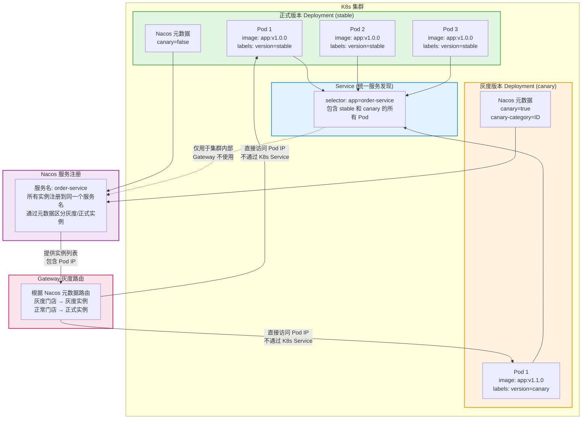

# K8s 灰度发布部署方案

> **作者：** 王锦阳
> **日期：** 2025-12-09

------

[TOC]

------

## 一、问题分析

### 问题场景

在 K8s 环境中，如果使用单个 Deployment 的滚动更新（RollingUpdate）：
- ❌ 会重启所有 Pod 实例
- ❌ 所有实例都会更新为新版本
- ❌ 失去灰度发布的意义
- ❌ 如果新版本有问题，会导致所有服务都受影响

### 解决方案

**使用多个 Deployment 策略**：
- ✅ 正式版本 Deployment（stable）：保持运行，不受影响
- ✅ 灰度版本 Deployment（canary）：独立部署和更新
- ✅ 通过 Nacos 元数据区分：Gateway 根据元数据路由流量
- ✅ 独立扩缩容：灰度实例和正式实例可以独立调整

## 二、K8s 部署架构

### 2.1 架构设计



## 三、部署配置

### 3.1 正式版本 Deployment（stable）

```yaml
apiVersion: apps/v1
kind: Deployment
metadata:
  name: order-service-stable
  namespace: production
  labels:
    app: order-service
    version: stable
spec:
  replicas: 3  # 正式版本实例数
  selector:
    matchLabels:
      app: order-service
      version: stable
  template:
    metadata:
      labels:
        app: order-service
        version: stable
    spec:
      containers:
      - name: order-service
        image: registry.example.com/order-service:v1.0.0
        ports:
        - containerPort: 8080
        env:
        - name: SPRING_APPLICATION_NAME
          value: order-service
        - name: NACOS_DISCOVERY_METADATA_CANARY
          value: "false"
        - name: NACOS_DISCOVERY_METADATA_CANARY_CATEGORY
          value: "CUSTOM"
        # 其他配置...
```

### 3.2 灰度版本 Deployment（canary）

```yaml
apiVersion: apps/v1
kind: Deployment
metadata:
  name: order-service-canary
  namespace: production
  labels:
    app: order-service
    version: canary
spec:
  replicas: 1  # 灰度版本实例数（通常较小）
  selector:
    matchLabels:
      app: order-service
      version: canary
  template:
    metadata:
      labels:
        app: order-service
        version: canary
    spec:
      containers:
      - name: order-service
        image: registry.example.com/order-service:v1.1.0  # 新版本
        ports:
        - containerPort: 8080
        env:
        - name: SPRING_APPLICATION_NAME
          value: order-service
        # 关键：设置 Nacos 元数据，标记为灰度实例
        - name: NACOS_DISCOVERY_METADATA_CANARY
          value: "true"
        - name: NACOS_DISCOVERY_METADATA_CANARY_CATEGORY
          value: "ID"
        # 其他配置...
```

### 3.3 Service（统一服务发现）

```yaml
apiVersion: v1
kind: Service
metadata:
  name: order-service
  namespace: production
spec:
  selector:
    app: order-service  # 同时选择 stable 和 canary 的 Pod
  ports:
  - port: 8080
    targetPort: 8080
  type: ClusterIP
```

**⚠️ 重要说明：**

1. **K8s Service 仅用于集群内部，Gateway 不使用**
   - Service 的 `selector` 只选择 `app: order-service`，不包含 `version` 标签
   - 这样会同时选择 stable 和 canary 的 Pod
   - **但 Gateway 必须通过 Nacos 服务发现直接访问 Pod IP，不能通过 K8s Service**

2. **Gateway 路由配置**
   ```yaml
   spring:
     cloud:
       gateway:
         routes:
           - id: order-service-route
             uri: lb://order-service  # 使用 lb:// 格式，通过 Nacos 服务发现
             predicates:
               - Path=/api/order/**
   ```
   - `lb://order-service` 表示通过 Spring Cloud LoadBalancer 访问
   - LoadBalancer 从 Nacos 获取所有注册的实例（包含 Pod IP）
   - `CanaryLoadBalancer` 根据 `X-Canary-Id` 和 Nacos 元数据选择具体的实例
   - **直接访问 Pod IP，绕过 K8s Service**

3. **为什么不能使用 K8s Service？**
   - K8s Service 的负载均衡会在 Gateway 的灰度负载均衡之前执行
   - Gateway 无法精确控制路由到哪个 Pod（灰度或正式）
   - 会导致灰度路由失效，所有请求可能被随机分发

4. **正确的架构流程**
   ```
   Gateway → Nacos 服务发现 → 获取所有实例（Pod IP） → CanaryLoadBalancer 选择 → 直接访问 Pod IP
   ```
   
   **错误的架构（会导致冲突）：**
   ```
   Gateway → K8s Service → CoreDNS 负载均衡 → Pod（无法精确控制）
   ```

## 四、灰度发布流程

### 4.1 初始状态

```
正式版本 Deployment (stable)
  ├── Pod 1 (v1.0.0, canary=false)
  ├── Pod 2 (v1.0.0, canary=false)
  └── Pod 3 (v1.0.0, canary=false)

Gateway 配置：
  - enable: false  # 未启用灰度
  - 所有流量路由到正式实例
```

### 4.2 部署灰度版本

**步骤 1：创建灰度 Deployment**

```bash
kubectl apply -f order-service-canary.yaml
```

**步骤 2：验证灰度实例启动**

```bash
# 查看灰度 Pod
kubectl get pods -l version=canary -n production

# 查看 Nacos 注册情况
# 应该看到灰度实例注册，元数据包含 canary=true
```

**步骤 3：启用 Gateway 灰度配置**

在 Nacos 配置中心修改：

```yaml
platform:
  gateway:
    deploy:
      enable: true
      canary-category: ID
      id-list:
        - '1001'  # 指定门店参与灰度
```

**步骤 4：验证灰度路由**

- 门店 1001 的请求 → 路由到灰度实例（v1.1.0）
- 其他门店的请求 → 路由到正式实例（v1.0.0）

### 4.3 更新灰度版本

**场景：** 灰度版本需要更新（如修复 bug）

**操作：** 只更新灰度 Deployment

```bash
# 方式1：更新镜像版本
kubectl set image deployment/order-service-canary \
  order-service=registry.example.com/order-service:v1.1.1 \
  -n production

# 方式2：修改 Deployment YAML 后 apply
kubectl apply -f order-service-canary.yaml
```

**关键点：**
- ✅ 只更新灰度 Deployment，不影响正式 Deployment
- ✅ 正式实例继续运行 v1.0.0，不受影响
- ✅ 如果新版本有问题，可以快速回滚灰度 Deployment

### 4.4 扩大灰度范围

**操作：** 在 Nacos 配置中心增加灰度门店

```yaml
platform:
  gateway:
    deploy:
      enable: true
      canary-category: ID
      id-list:
        - '1001'
        - '1002'  # 新增
        - '1003'  # 新增
```

**效果：**
- 更多门店的流量路由到灰度实例
- 无需重启任何 Pod，配置秒级生效

### 4.5 全量发布

**方案 1：逐步替换（推荐）**

```bash
# 步骤1：扩大灰度范围（所有门店）
# 在 Nacos 配置中心，将所有门店加入灰度列表

# 步骤2：增加灰度实例数
kubectl scale deployment/order-service-canary --replicas=3 -n production

# 步骤3：逐步减少正式实例数
kubectl scale deployment/order-service-stable --replicas=2 -n production
kubectl scale deployment/order-service-stable --replicas=1 -n production
kubectl scale deployment/order-service-stable --replicas=0 -n production

# 步骤4：删除正式 Deployment
kubectl delete deployment/order-service-stable -n production

# 步骤5：将灰度 Deployment 重命名为正式 Deployment
kubectl patch deployment/order-service-canary \
  -p '{"metadata":{"labels":{"version":"stable"}}}' \
  -n production
```

**方案 2：直接切换（快速但风险较高）**

```bash
# 步骤1：关闭 Gateway 灰度配置
# 在 Nacos 配置中心设置 enable: false

# 步骤2：更新正式 Deployment 镜像为新版本
kubectl set image deployment/order-service-stable \
  order-service=registry.example.com/order-service:v1.1.0 \
  -n production

# 步骤3：等待正式版本滚动更新完成

# 步骤4：删除灰度 Deployment
kubectl delete deployment/order-service-canary -n production
```

### 4.6 快速回滚

**场景：** 灰度版本发现问题，需要快速回滚

**操作：**

```bash
# 方式1：删除灰度 Deployment（最快）
kubectl delete deployment/order-service-canary -n production

# 方式2：关闭 Gateway 灰度配置
# 在 Nacos 配置中心设置 enable: false

# 方式3：清空灰度门店列表
# 在 Nacos 配置中心设置 id-list: []
```

**效果：**
- ✅ 所有流量立即路由到正式实例
- ✅ 正式实例未受影响，继续正常运行
- ✅ 秒级回滚，无需等待 Pod 重启

## 五、完整部署示例

### 5.1 快速开始

**使用提供的示例文件：**

```bash
# 部署正式版本
kubectl apply -f k8s-deployment-example.yaml

# 查看部署状态
kubectl get deployments -n production -l app=order-service
kubectl get pods -n production -l app=order-service

# 查看 Service
kubectl get svc order-service -n production
```

**示例文件位置：** `docs/k8s-deployment-example.yaml`

### 5.2 通过环境变量设置 Nacos 元数据

**正式版本：**

```yaml
env:
- name: NACOS_DISCOVERY_METADATA_CANARY
  value: "false"
- name: NACOS_DISCOVERY_METADATA_CANARY_CATEGORY
  value: "CUSTOM"
```

**灰度版本：**

```yaml
env:
- name: NACOS_DISCOVERY_METADATA_CANARY
  value: "true"
- name: NACOS_DISCOVERY_METADATA_CANARY_CATEGORY
  value: "ID"
```

### 5.2 通过 ConfigMap 管理配置

```yaml
apiVersion: v1
kind: ConfigMap
metadata:
  name: order-service-config
  namespace: production
data:
  application.yml: |
    spring:
      cloud:
        nacos:
          discovery:
            metadata:
              canary: "true"  # 灰度实例设置为 true
              canary-category: "ID"
```

### 5.3 通过 Java 代码设置（推荐）

在应用启动时，根据环境变量或配置判断是否为灰度实例：

```java
@Configuration
public class NacosConfig {
    
    @Bean
    @ConditionalOnProperty(name = "platform.instance.canary.enabled", havingValue = "true")
    public NacosDiscoveryProperties nacosProperties() {
        NacosDiscoveryProperties properties = new NacosDiscoveryProperties();
        Map<String, String> metadata = new HashMap<>();
        metadata.put("canary", "true");
        metadata.put("canary-category", "ID");
        properties.setMetadata(metadata);
        return properties;
    }
}
```

**K8s Deployment 中设置环境变量：**

```yaml
env:
- name: PLATFORM_INSTANCE_CANARY_ENABLED
  value: "true"  # 灰度实例设置为 true
```

## 六、最佳实践

### 6.1 部署策略

1. **独立 Deployment**
   - ✅ 正式版本和灰度版本使用独立的 Deployment
   - ✅ 互不影响，可以独立更新和扩缩容

2. **统一 Service**
   - ✅ 使用同一个 Service，通过 Label 选择所有 Pod
   - ✅ Gateway 通过 Nacos 元数据区分路由

3. **元数据标记**
   - ✅ 灰度实例必须设置 `canary=true` 和 `canary-category=ID`
   - ✅ 正式实例设置 `canary=false` 或不设置

### 6.2 更新策略

1. **灰度版本更新**
   - ✅ 只更新灰度 Deployment
   - ✅ 正式实例保持不变
   - ✅ 如果新版本有问题，只影响灰度流量

2. **正式版本更新**
   - ✅ 灰度验证通过后，再更新正式版本
   - ✅ 可以逐步替换，降低风险

3. **回滚策略**
   - ✅ 删除灰度 Deployment（最快）
   - ✅ 关闭 Gateway 灰度配置（秒级生效）
   - ✅ 正式实例未受影响，继续运行

### 6.3 监控告警

1. **实例监控**
   - 分别监控正式实例和灰度实例的健康状态
   - 设置独立的告警规则

2. **流量监控**
   - 监控灰度流量占比
   - 监控灰度请求的成功率和响应时间

3. **异常告警**
   - 灰度实例异常率 > 5%
   - 灰度请求响应时间 > 正常请求 2 倍

## 七、常见问题

### Q1: 如何判断当前 Pod 是否为灰度实例？

**A:** 通过环境变量或 Nacos 元数据判断：

```bash
# 查看 Pod 环境变量
kubectl exec <pod-name> -n production -- env | grep CANARY

# 查看 Nacos 注册信息
# 登录 Nacos 控制台，查看服务实例的元数据
```

### Q2: 灰度实例和正式实例可以共享资源吗？

**A:** 可以，但需要注意：
- ✅ 可以共享 ConfigMap、Secret
- ✅ 可以共享 Service（统一服务发现）
- ⚠️ 数据库、缓存等共享资源需要注意数据兼容性
- ⚠️ 消息队列需要注意消息格式兼容性

### Q3: 如何控制灰度实例的数量？

**A:** 通过 Deployment 的 `replicas` 控制：

```bash
# 增加灰度实例
kubectl scale deployment/order-service-canary --replicas=2 -n production

# 减少灰度实例
kubectl scale deployment/order-service-canary --replicas=1 -n production
```

### Q4: 灰度验证通过后，如何全量发布？

**A:** 推荐方案：
1. 扩大灰度范围（所有门店）
2. 逐步增加灰度实例数
3. 逐步减少正式实例数
4. 删除正式 Deployment
5. 将灰度 Deployment 重命名为正式 Deployment

## 八、常用操作命令

### 8.1 部署和更新

```bash
# 部署正式版本
kubectl apply -f order-service-stable.yaml -n production

# 部署灰度版本
kubectl apply -f order-service-canary.yaml -n production

# 更新灰度版本镜像（只更新灰度，不影响正式）
kubectl set image deployment/order-service-canary \
  order-service=registry.example.com/order-service:v1.1.1 \
  -n production

# 查看部署状态
kubectl get deployments -n production -l app=order-service
kubectl get pods -n production -l app=order-service -o wide
```

### 8.2 扩缩容

```bash
# 增加灰度实例数
kubectl scale deployment/order-service-canary --replicas=2 -n production

# 减少正式实例数（全量发布时）
kubectl scale deployment/order-service-stable --replicas=2 -n production

# 查看实例状态
kubectl get pods -n production -l app=order-service --show-labels
```

### 8.3 回滚操作

```bash
# 方式1：删除灰度 Deployment（最快）
kubectl delete deployment/order-service-canary -n production

# 方式2：回滚灰度 Deployment 到上一个版本
kubectl rollout undo deployment/order-service-canary -n production

# 方式3：回滚到指定版本
kubectl rollout undo deployment/order-service-canary \
  --to-revision=2 -n production

# 查看回滚历史
kubectl rollout history deployment/order-service-canary -n production
```

### 8.4 查看和调试

```bash
# 查看 Pod 环境变量（确认 Nacos 元数据配置）
kubectl exec <pod-name> -n production -- env | grep NACOS

# 查看 Pod 日志
kubectl logs <pod-name> -n production -f

# 查看 Service 选择的所有 Pod
kubectl get endpoints order-service -n production

# 查看 Nacos 注册情况（需要登录 Nacos 控制台）
# 或通过 API：
curl http://nacos-server:8848/nacos/v1/ns/instance/list?serviceName=order-service
```

### 8.5 验证灰度路由

```bash
# 1. 查看 Gateway 配置
# 在 Nacos 配置中心查看 platform.gateway.deploy

# 2. 测试灰度门店请求
curl -H "X-Canary-Id: 1001" http://gateway-service/api/order/list

# 3. 测试正常门店请求
curl -H "X-Canary-Id: 2001" http://gateway-service/api/order/list

# 4. 查看请求路由到的 Pod
# 在应用日志中查看请求处理的 Pod IP
```

## 九、注意事项

### 9.1 关键配置

1. **Service Selector**
   - ✅ 只选择 `app: order-service`，不包含 `version`
   - ❌ 错误：`app: order-service, version: stable`（只会选择正式版本）

2. **Nacos 元数据**
   - ✅ 灰度实例必须设置：`canary=true, canary-category=ID`
   - ✅ 正式实例设置：`canary=false` 或不设置
   - ❌ 错误：灰度实例未设置元数据（Gateway 无法识别）

3. **应用名称**
   - ✅ 正式版本和灰度版本必须使用相同的 `spring.application.name`
   - ✅ 这样才会注册到同一个 Nacos 服务名
   - ❌ 错误：使用不同的服务名（Gateway 无法统一路由）

### 9.2 常见错误

1. **错误：Service 只选择了正式版本**
   ```yaml
   # ❌ 错误配置
   selector:
     app: order-service
     version: stable  # 这样只会选择正式版本
   
   # ✅ 正确配置
   selector:
     app: order-service  # 同时选择 stable 和 canary
   ```

2. **错误：灰度实例未设置 Nacos 元数据**
   ```yaml
   # ❌ 错误：未设置元数据
   env:
   - name: SPRING_APPLICATION_NAME
     value: "order-service"
   
   # ✅ 正确：设置元数据
   env:
   - name: SPRING_APPLICATION_NAME
     value: "order-service"
   - name: SPRING_CLOUD_NACOS_DISCOVERY_METADATA_CANARY
     value: "true"
   - name: SPRING_CLOUD_NACOS_DISCOVERY_METADATA_CANARY_CATEGORY
     value: "ID"
   ```

3. **错误：使用单个 Deployment 滚动更新**
   ```bash
   # ❌ 错误：会更新所有实例
   kubectl set image deployment/order-service \
     order-service=registry.example.com/order-service:v1.1.0
   
   # ✅ 正确：只更新灰度 Deployment
   kubectl set image deployment/order-service-canary \
     order-service=registry.example.com/order-service:v1.1.0
   ```

### 9.3 最佳实践检查清单

部署前检查：
- [ ] 正式版本和灰度版本使用独立的 Deployment
- [ ] Service selector 只选择 `app` 标签，不包含 `version`
- [ ] 灰度实例设置了正确的 Nacos 元数据（canary=true, canary-category=ID）
- [ ] 正式实例和灰度实例使用相同的 `spring.application.name`
- [ ] Gateway 配置已启用灰度发布（platform.gateway.deploy.enable=true）

更新前检查：
- [ ] 确认只更新灰度 Deployment，不影响正式 Deployment
- [ ] 确认 Gateway 灰度配置已正确设置
- [ ] 确认监控告警已配置

回滚准备：
- [ ] 保留正式 Deployment，确保可以快速回滚
- [ ] 准备好删除灰度 Deployment 的命令
- [ ] 准备好关闭 Gateway 灰度配置的方案

## 十、总结

### 核心要点

1. **使用多个 Deployment**
   - 正式版本和灰度版本独立部署
   - 互不影响，可以独立更新

2. **通过 Nacos 元数据区分**
   - 灰度实例：`canary=true, canary-category=ID`
   - 正式实例：`canary=false` 或不设置

3. **Gateway 统一路由**
   - 根据 Nacos 元数据自动路由
   - 灰度门店 → 灰度实例
   - 正常门店 → 正式实例

4. **独立更新和回滚**
   - 只更新灰度 Deployment，不影响正式实例
   - 快速回滚：删除灰度 Deployment 或关闭 Gateway 配置

### 优势

- ✅ **风险隔离**：灰度版本问题不影响正式服务
- ✅ **独立更新**：只更新灰度实例，正式实例保持不变
- ✅ **快速回滚**：秒级回滚，无需等待 Pod 重启
- ✅ **灵活扩缩容**：灰度实例和正式实例可以独立调整
- ✅ **统一管理**：Gateway 配置统一控制所有服务的灰度
