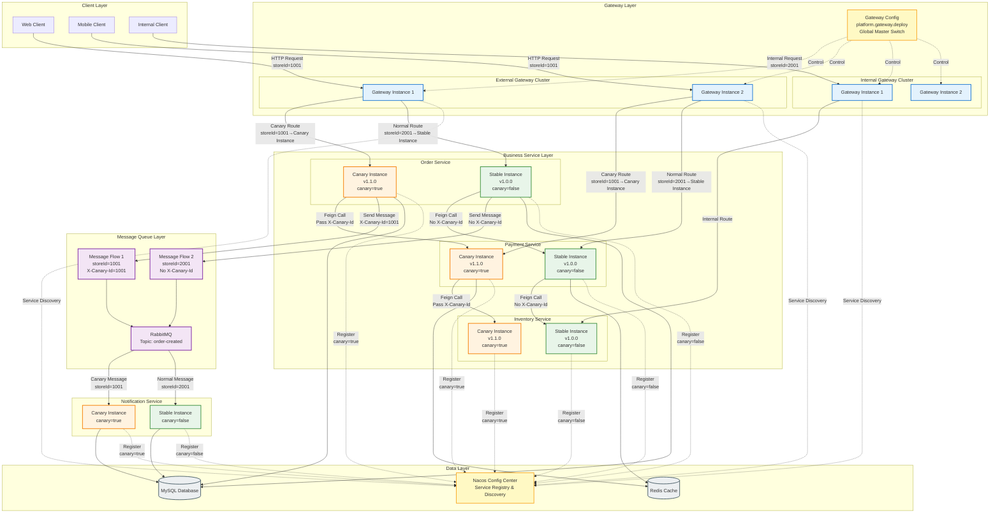
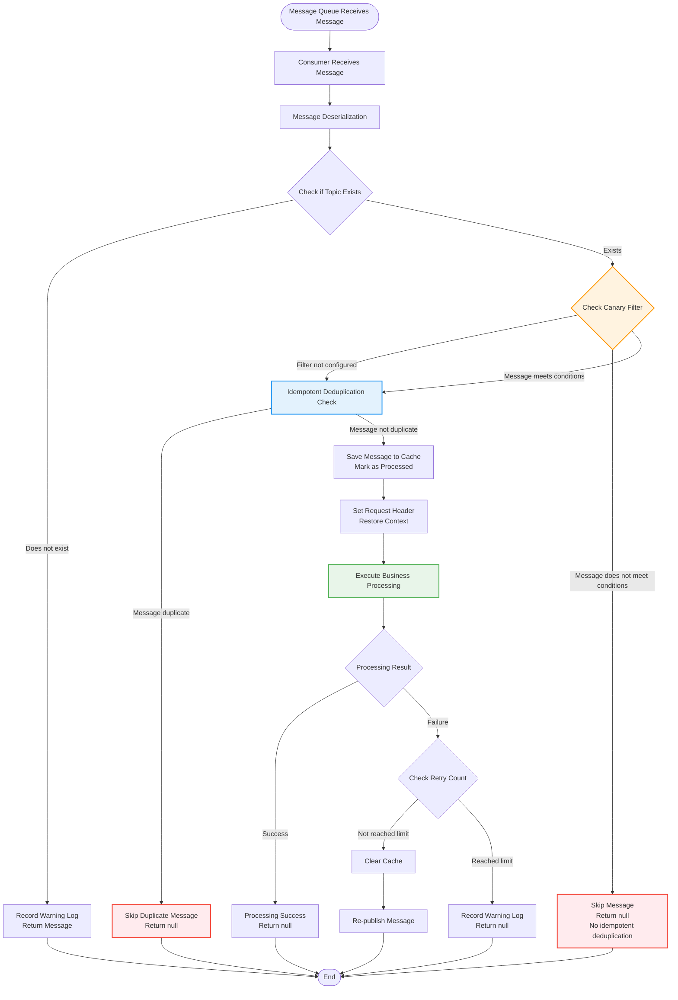
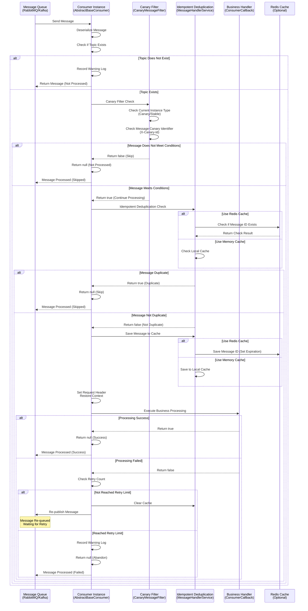

# Canary Release Best Practices: Store ID-Based Routing

> **Author:** Wang Jinyang
> **Date:** 2025-12-09

------

[TOC]

------

**Global Master Switch:** Gateway configuration (`platform.gateway.deploy`) uniformly controls canary release for all services, including HTTP requests, message queues, and inter-service calls.

> **Tip:** If your project has a multi-version architecture coexistence and cannot uniformly upgrade to the `4.6.0` architecture version, consider using the [K8s-Ingress-Based Canary Release Solution (Compromise Solution)](./基于K8s-Ingress的灰度发布方案.md). This solution requires no business code modifications and implements canary routing through the infrastructure layer.

## Complete Canary Architecture Diagram



### Architecture Description

**1. Client Layer → Gateway Layer**
- Client initiates HTTP request with `storeId` (Store ID)
- External network clients → External Gateway
- Internal network clients → Internal Gateway

**2. Gateway Layer → Business Service Layer**
- Gateway automatically extracts `storeId` and sets `X-Canary-Id` request header
- Gateway routes based on `X-Canary-Id` and Nacos metadata:
  - Canary stores (storeId=1001) → Canary instances (canary=true)
  - Normal stores (storeId=2001) → Stable instances (canary=false)

**3. Inter-Service Calls (Feign)**
- When a canary instance makes a call, it automatically passes the `X-Canary-Id` request header
- The called service routes to the corresponding instance based on the request header

**4. Message Queue (MQ)**
- Producer: Automatically retrieves `X-Canary-Id` from `HeaderContextHolder` and sets it in the message header
- Consumer: `CanaryMessageFilter` determines routing based on message header:
  - Canary messages (X-Canary-Id in canary list) → Processed by canary instances
  - Normal messages (X-Canary-Id not in canary list) → Processed by stable instances

**5. Service Registry (Nacos)**
- All service instances register with Nacos
- Canary/stable instances are distinguished through metadata (canary, canary-category)
- Gateway retrieves service list from Nacos and routes based on metadata

**6. Global Master Control**
- Gateway configuration (`platform.gateway.deploy`) uniformly controls canary release for all services
- One configuration controls canary release for HTTP, MQ, and Feign

## 1. Solution Selection Recommendations

### Recommended Solution: Gateway Layer Implementation

**Reasons:**
1. **Already Implemented**: Gateway has canary release implemented, supporting ID-based routing
2. **Unified Management**: Internal and external network traffic is uniformly controlled at the Gateway, facilitating monitoring and operations
3. **Flexible Configuration**: Dynamically adjust canary rules through the configuration center (Nacos), taking effect within seconds
4. **Clear Business Semantics**: Directly route based on business parameters (storeId), no conversion needed
5. **Fast Rollback**: Configuration changes enable rollback without redeploying K8s resources

### K8s Solution Applicable Scenarios

The K8s solution is suitable for the following scenarios:
- Need to canary based on traffic percentage (e.g., 10% traffic goes to new version)
- Need complex condition combinations routing based on request headers, paths, etc.
- Already using Service Mesh (e.g., Istio) for traffic management
- Need unified management at the infrastructure layer, independent of application code

**However, considering:**
- Both internal and external network traffic goes through Gateway, unified control at Gateway is more reasonable
- Store ID dimension is exact matching, Gateway's ID list approach is more intuitive
- Gateway implementation already exists, no additional development needed

## 2. Internal and External Gateway Deployment Recommendations

### Strongly Recommended: Deploy Internal and External Gateways Separately

Although both internal and external network traffic goes through Gateway, **strongly recommend deploying internal and external Gateways separately**, using independent Gateway instance clusters.

### 2.1 Core Benefits of Separate Deployment

#### 1. Security Isolation
- **Physical/Logical Isolation**: Internal and external Gateways are completely independent, reducing security risks
- **Attack Surface Isolation**: External Gateway is exposed to the public network, more vulnerable to attacks; internal Gateway is only in the internal network, with smaller attack surface
- **Permission Isolation**: Different security policies, IP whitelists, and access control rules can be configured for internal and external networks
- **Data Isolation**: Even if external Gateway is compromised, internal Gateway can still operate normally

#### 2. Independent Scaling
- **Different Traffic Characteristics**:
  - External network traffic: Highly volatile, significantly affected by business activities and marketing campaigns
  - Internal network traffic: Relatively stable, mainly internal system calls
- **Resource Optimization**: Independently adjust instance count and resource configuration based on respective traffic characteristics
- **Cost Control**: Avoid over-provisioning internal network resources to handle external network traffic peaks

#### 3. Independent Configuration Management
- **Different Security Policies**:
  - External Gateway: Requires stricter rate limiting, brush protection, and WAF rules
  - Internal Gateway: Can relax some restrictions but needs stricter internal permission control
- **Different Canary Strategies**:
  - External Gateway: Canary releases require more caution, larger impact scope
  - Internal Gateway: Can perform canary testing more flexibly
- **Different Monitoring Alerts**: Different monitoring metrics and alert thresholds can be set for internal and external networks

#### 4. Fault Isolation
- **Fault Non-Spread**: External Gateway fault does not affect internal network system calls, internal Gateway fault does not affect external network user access
- **Independent Operations**: Maintenance, upgrades, and restarts can be performed separately without affecting each other
- **Faster Recovery**: Only need to recover the corresponding Gateway cluster during faults, with shorter recovery time

#### 5. Performance Optimization
- **Network Optimization**:
  - External Gateway: Optimize public network access paths, consider CDN and multi-region deployment
  - Internal Gateway: Optimize internal network communication, reduce network hops
- **Caching Strategy**: Different caching strategies and TTLs can be configured for internal and external networks
- **Connection Pool Optimization**: Optimize connection pool parameters based on internal and external network call characteristics

#### 6. Compliance and Audit
- **Access Log Separation**: Internal and external network access logs are stored separately, facilitating audit and compliance checks
- **Permission Audit**: Access permissions and operation records for internal and external networks can be audited separately
- **Data Compliance**: Meet data compliance requirements in different scenarios

### 2.2 Deployment Architecture Recommendation

```
┌─────────────────────────────────────────┐
│         External Gateway Cluster         │
│  ┌──────────┐  ┌──────────┐  ┌────────┐│
│  │ Gateway 1│  │ Gateway 2│  │Gateway N││
│  └──────────┘  └──────────┘  └────────┘│
│       Handling External Requests (ToB/ToC)          │
└─────────────────────────────────────────┘
               ↓
         ┌─────────┐
         │Business │
         │Services │
         └─────────┘
               ↑
┌─────────────────────────────────────────┐
│         Internal Gateway Cluster         │
│  ┌──────────┐  ┌──────────┐  ┌────────┐│
│  │ Gateway 1│  │ Gateway 2│  │Gateway N││
│  └──────────┘  └──────────┘  └────────┘│
│       Handling Internal Requests (ECS Internal)     │
└─────────────────────────────────────────┘
```

### 2.3 Configuration Examples

**External Gateway Configuration:**
```yaml
platform:
  gateway:
    # External Gateway specific configuration
    security:
      # Stricter rate limiting rules
      rate-limit: 1000
      # WAF rules
      waf-enabled: true
    deploy:
      # External canary release is more cautious
      enable: true
      canary-category: ID
      id-list: []  # Initially empty, add gradually
```

**Internal Gateway Configuration:**
```yaml
platform:
  gateway:
    # Internal Gateway specific configuration
    security:
      # Internal network can relax rate limiting
      rate-limit: 10000
      # Internal network does not need WAF
      waf-enabled: false
    deploy:
      # Internal canary release can be more flexible
      enable: true
      canary-category: ID
      id-list:
        - '1001'  # Internal test store
        - '1002'
```

### 2.4 Notes

1. **Service Registry Differentiation**: Ensure internal and external Gateways register to different service discovery namespaces or use different service names
2. **Configuration Center Isolation**: Internal and external Gateways use different configuration groups to avoid configuration conflicts
3. **Monitoring Alert Separation**: Set up separate monitoring dashboards and alert rules for internal and external Gateways
4. **Independent Canary Rules**: Internal and external networks can have different canary store lists without affecting each other

## 3. Implementation Solution

### 2.1 Architecture Design

```
Client Request
    ↓
Gateway (Automatically Extracts storeId)
    ↓
Set X-Canary-Id Request Header
    ↓
CanaryLoadBalancerFilter (Canary Routing)
    ↓
Match Canary Rules Based on storeId
    ↓
Route to Canary Service Instance / Stable Service Instance
```

### 2.2 Implementation Steps

#### Step 1: Create StoreIdCanaryFilter

Automatically extract `storeId` from the request and set it to the `X-Canary-Id` request header.

**Extraction Priority:**
1. Request header `X-Canary-Id` (if it already exists, use directly without re-extracting)
2. Request headers (custom fields or built-in rules: `x-rd-request-shopcode`)
3. JWT Token (custom fields or built-in rules: `storeId`, `shopCode`)
4. Request body JSON (custom fields or built-in rules: `storeId`, `shopId`, `shopCode`)
5. Path parameters (custom patterns or built-in rules: `/api/store/{id}/xxx`)
6. Query parameters (custom fields or built-in rules: `?storeId=xxx`)

**Field Name Configuration (Optional):**

If the field name in the request body does not match built-in rules, customize in Nacos configuration center:

```yaml
platform:
  gateway:
    deploy:
      enable: true
      canary-category: ID
      id-list: ['1001', '1002']
      # Custom field name configuration (optional)
      field-config:
        # Field name in request header (if not configured, use built-in: x-rd-request-shopcode)
        header-field-name: "x-custom-shop-id"
        # Field name list in JWT Token (by priority, if not configured, use built-in: storeId, shopCode)
        token-field-names:
          - "customStoreId"
          - "customShopCode"
        # Field pattern in path parameters (if not configured, use built-in: store|shop|门店)
        path-field-pattern: "store|shop|门店|shopId"
        # Field name in query parameters (if not configured, use built-in: storeId)
        query-field-name: "shopId"
        # Field name list in request body (JSON) (by priority, if not configured, use built-in: storeId, shopId, shopCode)
        body-field-names:
          - "customStoreId"
          - "storeId"
          - "shopId"
```

**Configuration Description:**
- If a field is not configured, built-in rules are used (backward compatible)
- If custom fields are configured, custom fields are prioritized; built-in rules are used as fallback
- If no fields are found, consider there is no canary identifier, route to stable instance

#### Step 2: Configure Canary Rules

Configure the list of store IDs and service lists participating in canary in the Nacos configuration center:

```yaml
platform:
  gateway:
    deploy:
      enable: true
      canary-category: ID
      # List of store IDs participating in canary
      id-list:
        - '1001'  # Store ID 1
        - '1002'  # Store ID 2
        - '1003'  # Store ID 3
      # List of services participating in canary (optional)
      # If empty or contains "*", all services participate in canary
      # If a service list is specified, only services in the list will undergo canary routing
      service-list:
        - 'order-service'      # Order service participates in canary
        - 'payment-service'    # Payment service participates in canary
        - 'inventory-service'  # Inventory service participates in canary
        # notification-service is not listed, does not participate in canary (even if canary instances exist, routing goes to stable instance)
```

#### Step 3: Service Instance Labeling

Add metadata to canary service instances in K8s Deployment:

```yaml
metadata:
  labels:
    canary: "true"
    canary-category: "ID"
```

Or add metadata when registering with Nacos:

```java
@Bean
public NacosDiscoveryProperties nacosProperties() {
    NacosDiscoveryProperties properties = new NacosDiscoveryProperties();
    Map<String, String> metadata = new HashMap<>();
    metadata.put("canary", "true");
    metadata.put("canary-category", "ID");
    properties.setMetadata(metadata);
    return properties;
}
```

## 4. Configuration Examples

### 3.1 Gateway Configuration (Nacos) - Global Master Switch

**Important:** Gateway configuration is the **global canary master switch**, uniformly controlling:
- HTTP request canary routing (Gateway layer)
- Message queue canary filtering (message component layer)
- Inter-service call canary propagation (Feign layer)

**Configuration Path:** `platform.gateway.deploy` (all services use this configuration uniformly)

```yaml
platform:
  gateway:
    deploy:
      # Global canary master switch (controls canary release for all services)
      enable: true
      # Canary dimension: ID (by store ID)
      canary-category: ID
      # List of store IDs participating in canary (supports dynamic updates)
      id-list:
        - '1001'
        - '1002'
        - '1003'
      # List of services participating in canary (optional, if empty or contains "*", all services participate)
      # If a service list is specified, only services in the list will undergo canary routing
      service-list:
        - 'order-service'      # Order service participates in canary
        - 'payment-service'    # Payment service participates in canary
        - 'inventory-service'  # Inventory service participates in canary
        # 'notification-service'  # Notification service does not participate in canary (not listed)
      # Custom field name configuration (optional, if not configured, use built-in rules)
      field-config:
        # Field name in request header (if not configured, use built-in: x-rd-request-shopcode)
        header-field-name: "x-rd-request-shopcode"
        # Field name list in JWT Token (by priority, if not configured, use built-in: storeId, shopCode)
        token-field-names:
          - "storeId"
          - "shopCode"
        # Field pattern in path parameters (if not configured, use built-in: store|shop|门店)
        path-field-pattern: "store|shop|门店"
        # Field name in query parameters (if not configured, use built-in: storeId)
        query-field-name: "storeId"
        # Field name list in request body (JSON) (by priority, if not configured, use built-in: storeId, shopId, shopCode)
        body-field-names:
          - "storeId"
          - "shopId"
          - "shopCode"
```

**Configuration Description:**
- `enable: true`: Enable global canary release, all services (HTTP, MQ, Feign) are controlled by this configuration
- `enable: false`: Disable global canary release, all services return to normal routing
- `canary-category: ID`: Canary by store ID dimension
- `id-list`: List of store IDs participating in canary, supports dynamic updates
- `service-list`: List of services participating in canary (optional)
  - If empty or contains `"*"`: All services participate in canary
  - If a service list is specified: Only services in the list will undergo canary routing
  - Services not listed: Even if canary instances exist, no canary routing occurs; always route to stable instance
- `field-config`: Canary field name configuration (optional)
  - **If not configured**: Use built-in rules (backward compatible)
  - **If custom fields are configured**: Prioritize custom fields; use built-in rules as fallback
  - **If no fields are found**: Consider there is no canary identifier, route to stable instance
  - **Supported field type configurations**:
    - `header-field-name`: Field name in request header (default: x-rd-request-shopcode)
    - `token-field-names`: Field name list in JWT Token (default: storeId, shopCode)
    - `path-field-pattern`: Field pattern in path parameters (default: store|shop|门店)
    - `query-field-name`: Field name in query parameters (default: storeId)
    - `body-field-names`: Field name list in request body JSON (default: storeId, shopId, shopCode)

### 3.2 Service Instance Configuration

**Stable Environment Service Instance:**
- Do not set `canary` metadata, or set to `false`
- Do not set `canary-category` or set to `CUSTOM`

**Canary Environment Service Instance:**
- `canary: "true"`
- `canary-category: "ID"`

### 3.3 K8s Deployment Configuration (Important)

**Problem 1:** In a K8s environment, if using a single Deployment's rolling update, all instances will restart, losing the meaning of canary.

**Solution:** Use multiple Deployment strategies, stable and canary versions deployed independently.

**Problem 2:** K8s Service + CoreDNS load balancing conflicts with Gateway canary load balancing

**Important Note:**

Gateway's canary load balancer (`CanaryLoadBalancer`) needs **precise control** over which service instance to route to (canary or stable). Therefore:

1. **Gateway must access Pod IP directly through Nacos service discovery, not through K8s Service**
   - Gateway uses Spring Cloud LoadBalancer, obtains service instance list through Nacos service discovery
   - Gateway's `CanaryLoadBalancer` selects specific `ServiceInstance` (containing Pod IP and port) based on `X-Canary-Id` and Nacos metadata
   - Gateway routing configuration should use `lb://service-name` format (e.g., `lb://order-service`)

2. **Role of K8s Service**
   - K8s Service is mainly used for **in-cluster** service discovery and load balancing
   - For scenarios where Gateway serves as external entry, **should not access backend services through K8s Service**
   - K8s Service load balancing executes before Gateway's canary load balancing, preventing precise routing control

3. **Correct Architecture**
   ```
   Gateway → Nacos Service Discovery → Get All Instances (including Pod IP) → CanaryLoadBalancer Selects Instance → Access Pod IP Directly
   ```
   
   **Incorrect Architecture (causes conflict):**
   ```
   Gateway → K8s Service → CoreDNS Load Balancing → Pod (cannot precisely control)
   ```

4. **K8s Service Retained Use Cases**
   - Inter-service calls within the cluster (if using K8s Service)
   - Health checks, service monitoring
   - But Gateway as external entry must bypass K8s Service

**Detailed Solution:** Please refer to [K8s Canary Deployment Solution](./K8s灰度部署方案.md)

**Core Points:**
1. **Stable Version Deployment (stable)**
   - Independent Deployment, keep running
   - Environment variable: `NACOS_DISCOVERY_METADATA_CANARY=false`
   - **Must register to Nacos**, Gateway accesses through Nacos service discovery

2. **Canary Version Deployment (canary)**
   - Independent Deployment, can be updated independently
   - Environment variable: `NACOS_DISCOVERY_METADATA_CANARY=true, NACOS_DISCOVERY_METADATA_CANARY_CATEGORY=ID`
   - **Must register to Nacos**, Gateway accesses through Nacos service discovery

3. **Nacos Service Registration (Critical)**
   - All Pods (stable and canary) register to Nacos using the same service name (e.g., `order-service`)
   - Distinguish canary/stable instances through Nacos metadata (`canary`, `canary-category`)
   - Gateway obtains all instances through Nacos service discovery, then `CanaryLoadBalancer` precisely selects

4. **K8s Service (Optional, for in-cluster use only)**
   - Can create Service for in-cluster inter-service calls
   - **But Gateway should not access backend services through Service**
   - Gateway must access Pod IP directly through Nacos service discovery

5. **Update Strategy**
   - Only update canary Deployment, does not affect stable Deployment
   - If new version has problems, can quickly delete canary Deployment without affecting stable service

## 5. Use Cases

### Scenario 1: New Feature Canary Verification

1. Deploy new version service instance, mark as canary instance
2. Configure specified store ID list to participate in canary
3. Requests from specified stores automatically route to new version
4. After verification, gradually expand canary scope or full release

### Scenario 2: Problem Investigation and Rollback

1. Identify problematic store, quickly add to canary list
2. Route problematic store traffic to stable version
3. After investigating problem, remove from canary list

### Scenario 3: A/B Testing

1. Deploy A/B two version service instances
2. Implement traffic allocation by configuring different store ID lists
3. Compare business metrics of two versions

## 6. Monitoring and Alerts

### 5.1 Key Metrics

- Canary traffic percentage
- Canary service instance health status
- Canary request success rate, response time
- Canary rule hit rate

### 5.2 Alert Rules

- Canary service instance exception rate > 5%
- Canary request response time > 2x normal request
- Canary rule configuration changes

## 7. Best Practices

### 6.1 Canary Release Process

1. **Preparation Phase**
   - Deploy new version service instance (canary marked)
   - Configure canary store ID list (small scope, e.g., 1-3 stores)
   - Verify canary service instance health status

2. **Verification Phase**
   - Monitor canary traffic metrics
   - Collect business feedback
   - Compare canary version with stable version metrics

3. **Expansion Phase**
   - Gradually increase number of canary stores
   - Continuously monitor key metrics
   - If problems found, quickly rollback (remove store ID)

4. **Full Release**
   - Option 1: Add all stores to canary list (recommended)
   - Option 2: Promote by service gradually (safer)
   - Option 3: Remove canary marking, new version becomes stable version

### 6.2 Promoting Canary Instance to Stable Instance (Zero-Downtime Switch)

**Scenario:** After canary verification passes, need to convert canary instance to stable instance without restarting service.

#### Option 1: Dynamic Switch via Configuration Center (Recommended)

**Core Idea:**
- Use configuration center (Nacos) to manage canary state
- Supports dynamic refresh without restarting service
- Automatically clears cache, takes effect immediately

**Implementation Steps:**

**Step 1: Modify Gateway Configuration in Nacos Configuration Center**

```yaml
# Gateway Global Configuration (platform-gateway.yaml or global config)
platform:
  gateway:
    deploy:
      # Global canary master switch
      enable: true   # Enable global canary
      canary-category: ID
      id-list:
        - '1001'
        - '1002'
```

**Step 2: Configure Auto Refresh**

Ensure Gateway configuration supports dynamic refresh:

```yaml
spring:
  cloud:
    nacos:
      config:
        refresh-enabled: true  # Enable configuration refresh
```

**Step 3: Switch Canary State**

**Option A: Full Promotion (Disable Global Canary)**

```yaml
# Convert from canary instance to stable instance (disable global canary)
platform:
  gateway:
    deploy:
      enable: false  # Disable global canary, all services return to normal
      canary-category: ID
      id-list: []    # Clear canary list
      service-list: []  # Clear service list
```

**Option B: Promote by Service (Recommended)**

```yaml
# Phase 1: Order service promotion (removed from service list)
platform:
  gateway:
    deploy:
      enable: true
      canary-category: ID
      id-list: ['1001', '1002']
      service-list:
        - 'payment-service'    # Order service removed, promoted
        - 'inventory-service'  # Keep other services in canary

# Phase 2: Payment service promotion
platform:
  gateway:
    deploy:
      enable: true
      canary-category: ID
      id-list: ['1001', '1002']
      service-list:
        - 'inventory-service'  # Only keep inventory service in canary

# Phase 3: All promoted
platform:
  gateway:
    deploy:
      enable: false  # Or service-list: []
```

**Option C: Keep Canary Feature Enabled but No Stores Participating**

```yaml
# Keep canary feature enabled but no stores participating in canary (all traffic goes to stable instance)
platform:
  gateway:
    deploy:
      enable: true
      canary-category: ID
      id-list: []    # Clear list, no stores participate in canary
      service-list: []  # Or keep service list but no stores participate
```

Configuration auto refreshes, `CanaryInstanceManager` re-reads configuration, `CanaryMessageFilter` cache auto clears.

**Step 4: Verify Switch Result**

Query status via management endpoint:

```bash
curl http://localhost:8080/actuator/canary/status
```

Response example:
```json
{
  "gatewayCanaryEnabled": true,
  "gatewayCanaryCategory": "ID",
  "gatewayCanaryIdList": ["1001", "1002"],
  "gatewayCanaryServiceList": ["order-service", "payment-service"],
  "isServiceInCanary": true,
  "isCanaryInstance": false,
  "applicationName": "atlas-richie-order-service",
  "configSource": "platform.gateway.deploy (Global Control)"
}
```

#### Option 2: Manual Refresh via Management Endpoint

If configuration is updated but not auto-refreshed, manually trigger:

```bash
# Trigger configuration refresh
curl -X POST http://localhost:8080/actuator/canary/refresh
```

#### Option 3: Update Metadata via Nacos Console (Fallback Solution)

**Applicable Scenario:** If Gateway configuration is not enabled, can control individual instance canary state via Nacos metadata.

**Operation Steps:**
1. Log in to Nacos console
2. Go to "Service Management" → "Service List"
3. Find target service instance
4. Edit instance metadata:
   - `canary`: `true` → `false`
   - `canary-category`: `ID` (keep unchanged or delete)
5. After saving, `CanaryMessageFilter` reads latest metadata on next judgment

**Note:**
- This method only takes effect when Gateway configuration is not enabled (fallback solution)
- If Gateway configuration is enabled, prioritize using Gateway configuration
- Recommend unified use of Gateway configuration management (Option 1)

#### Option 4: Via Environment Variables/Startup Parameters (Requires Restart)

**Applicable Scenario:** If need to specify at startup, can use environment variables:

```bash
# Start canary instance
java -jar app.jar --platform.instance.canary.enabled=true --platform.instance.canary.category=ID

# Start stable instance
java -jar app.jar --platform.instance.canary.enabled=false
```

**Drawback:** Requires service restart, not zero-downtime switch.

### 6.3 Service-Level Canary Control

#### Problem Scenario

In a microservice architecture, not all services need canary release:
- Some services may not have canary versions (e.g., basic services, utility services)
- Some services may temporarily not need canary (e.g., stable services)
- During canary promotion, may need to promote by service gradually, not overall promotion

#### Solution: Service List Configuration

**Specify service list participating in canary in Gateway configuration:**

```yaml
platform:
  gateway:
    deploy:
      enable: true
      canary-category: ID
      id-list:
        - '1001'
        - '1002'
      # Specify service list participating in canary
      service-list:
        - 'order-service'      # Order service participates in canary
        - 'payment-service'    # Payment service participates in canary
        - 'inventory-service'  # Inventory service participates in canary
        # notification-service is not listed, does not participate in canary
```

**How It Works:**
1. **Services in canary list**:
   - Gateway routes to canary/stable instance based on `X-Canary-Id`
   - Message queue filters based on message header, canary messages only processed by canary instances

2. **Services not in canary list**:
   - Gateway always routes to stable instance (even if canary instance exists, it is ignored)
   - Message queue does not perform canary filtering, all messages are processed

### 7.3 Message Queue Broadcast Mode Configuration

#### Problem Scenario

In canary release scenarios, if using the default cluster consumption mode (same `group`), a message will only be consumed by one consumer (load balancing). This causes:
- Canary messages may be consumed by stable instance (wastes resources although filtered)
- Normal messages may be consumed by canary instance (wastes resources although filtered)

**If need to implement message broadcast (all instances receive messages), need to configure different consumer groups.**

#### Consumer-Side Message Processing Flow

The following flowchart and sequence diagram show the complete processing flow after the consumer side receives a message, including canary filtering, idempotent deduplication, business processing, and other key steps.

**Flowchart:**



**Key Flow Description:**
1. **Message Reception and Deserialization**: Receive message from message queue and deserialize to `MessageEvent` object
2. **Topic Check**: Verify if message's Topic has registered consumers
3. **Canary Filtering (Priority Execution)**: Check if message meets current instance's processing conditions (canary/stable)
4. **Idempotent Deduplication**: Check if message is duplicate (using Redis or memory cache)
5. **Save Cache**: Save message ID to cache, mark as processed
6. **Set Request Header**: Restore request context (language, timezone, tenant, canary identifier, etc.)
7. **Business Processing**: Call registered business callback function to process message
8. **Retry Mechanism**: If processing fails and retry limit not reached, clear cache and re-publish message

**Sequence Diagram:**



**Sequence Diagram Description:**
- **Message Queue**: RabbitMQ, Kafka and other message middleware
- **Consumer Instance**: `AbstractBaseConsumer`, responsible for message reception and flow orchestration
- **Canary Filter**: `CanaryMessageFilter`, determines if message meets current instance's processing conditions
- **Idempotent Deduplication**: `MessageHandlerService`, supports Redis or memory cache modes
- **Business Handler**: User-registered business callback function, executes specific business logic
- **Redis Cache**: Optional, used for idempotent deduplication in distributed environments

**Important Notes:**
- Canary filtering executes before idempotent deduplication to prevent non-qualifying instances from affecting shared cache
- If message is filtered by canary filter, idempotent deduplication is not executed, ensuring other instances can process normally
- When using broadcast mode (different consumer groups), both canary and stable instances receive messages; filter decides whether to process

#### Solution: Use Different Consumer Groups

**Option 1: Canary and Stable Instances Use Different Consumer Groups (Recommended)**

```yaml
spring:
  cloud:
    stream:
      bindings:
        normalProcess-in-0:
          destination: order-created-topic
          content-type: application/json
          # Dynamically set consumer group based on instance type
          # Canary instance uses: group: canary-group
          # Stable instance uses: group: stable-group
          group: ${CANARY_GROUP:stable-group}  # Controlled via environment variable
          consumer:
            max-attempts: 3
```

**Configuration Description:**
- Canary instance sets environment variable: `CANARY_GROUP=canary-group`
- Stable instance sets environment variable: `CANARY_GROUP=stable-group` (or not set, use default)
- This way, canary and stable instances use different consumer groups and both receive messages
- Then `CanaryMessageFilter` filters; only instances meeting conditions process

**Option 2: Each Instance Uses Unique Consumer Group (Complete Broadcast)**

```yaml
spring:
  cloud:
    stream:
      bindings:
        normalProcess-in-0:
          destination: order-created-topic
          content-type: application/json
          # Use instance ID as consumer group to achieve complete broadcast
          group: ${spring.application.name}-${spring.cloud.client.ip-address}-${server.port}
          consumer:
            max-attempts: 3
```

**Configuration Description:**
- Each instance uses unique consumer group (based on app name, IP, port)
- All instances receive messages (complete broadcast)
- `CanaryMessageFilter` filters; only instances meeting conditions process
- **Note:** This approach causes all instances to consume messages, with higher resource consumption

**Option 3: Keep Default Cluster Mode (Recommended for Production)**

```yaml
spring:
  cloud:
    stream:
      bindings:
        normalProcess-in-0:
          destination: order-created-topic
          content-type: application/json
          # Use same consumer group (default cluster mode)
          group: order-service-group
          consumer:
            max-attempts: 3
```

**Configuration Description:**
- All instances use the same consumer group (`order-service-group`)
- A message is only consumed by one instance (load balancing)
- If message is consumed by non-qualifying instance, it is filtered by `CanaryMessageFilter` (skipped)
- Message is marked as processed (return null), no retry
- **This is the default recommended approach, with lowest resource consumption**

#### Recommendation Comparison

| Option | Consumption Mode | Resource Consumption | Applicable Scenario |
|--------|-----------------|---------------------|---------------------|
| **Option 1: Different Consumer Groups** | Canary/Stable consume separately | Medium | Requires both canary and stable instances to receive messages |
| **Option 2: Unique Consumer Group** | Complete Broadcast | High | Requires all instances to receive messages (not recommended) |
| **Option 3: Same Consumer Group** | Cluster Mode (Default) | Low | Production recommended, lowest resource consumption |

#### Notes

1. **Processing After Message Filtering**
   - If message is filtered by `CanaryMessageFilter` (returns null), message is marked as processed
   - No retry occurs, and the message will not be consumed by other instances
   - This is a design trade-off: avoids message duplicate processing, but may cause some instances to not receive messages

2. **If Need to Ensure Message Processing**
   - Use Option 1 (different consumer groups), ensuring both canary and stable instances receive messages
   - Or send two messages at message sending time (one marked as canary, one marked as stable)

3. **Differences Between Kafka and RabbitMQ**
   - **Kafka**: Using different consumer groups, each consumer group receives messages
   - **RabbitMQ**: Using different queues (through different `group`), each queue receives messages
   - Specific configuration methods may differ slightly, refer to corresponding MQ documentation

4. **Execution Order (Important)**
   - Message processing order: **Canary Filtering → Idempotent Deduplication → Business Processing**
   - **Why should canary filtering execute before idempotent deduplication?**
     - If using Redis shared cache, after canary message is consumed by non-qualifying instance, it first executes idempotent deduplication (writes to Redis), then is filtered by canary filter
     - If using broadcast mode, qualifying instances (e.g., canary instances) also receive messages, but at this point Redis may have already marked as duplicate, causing message to be mistakenly identified as duplicate
     - Performing canary filtering first avoids non-qualifying instances performing unnecessary idempotent deduplication checks, improving performance
     - Canary filtering is a lightweight check and should execute first
   - **If message is filtered by canary filter (returns null)**:
     - Message is marked as processed (skipped), no retry
     - **Idempotent deduplication is not executed**, avoiding affecting other instances' processing
     - If using broadcast mode, qualifying instances can still process messages normally

#### Service Promotion Flow by Service

**Scenario:** Multiple services participate in canary, need to promote by service gradually

**Step 1: Verify Single Service**

```yaml
# Only keep one service in canary list
platform:
  gateway:
    deploy:
      enable: true
      canary-category: ID
      id-list:
        - '1001'
        - '1002'
      service-list:
        - 'order-service'  # Only keep order service in canary
        # payment-service and inventory-service are promoted (removed from list)
```

**Step 2: Gradually Promote Other Services**

```yaml
# Order service verification passed, promoted
platform:
  gateway:
    deploy:
      enable: true
      canary-category: ID
      id-list:
        - '1001'
        - '1002'
      service-list:
        - 'payment-service'  # Now only keep payment service in canary
        # order-service is promoted (removed from list)
```

**Step 3: All Promoted**

```yaml
# All services verification passed, disable canary or clear service list
platform:
  gateway:
    deploy:
      enable: false  # Disable global canary
      # Or
      # service-list: []  # Clear service list
```

#### Configuration Examples

**Scenario 1: All Services Participate in Canary (Default)**

```yaml
platform:
  gateway:
    deploy:
      enable: true
      canary-category: ID
      id-list: ['1001', '1002']
      # service-list not configured or contains "*", indicating all services participate
```

**Scenario 2: Specify Services to Participate in Canary**

```yaml
platform:
  gateway:
    deploy:
      enable: true
      canary-category: ID
      id-list: ['1001', '1002']
      service-list:
        - 'order-service'
        - 'payment-service'
        # Other services do not participate in canary
```

**Scenario 3: Promote by Service Gradually (Recommended)**

```yaml
# Initial state: Multiple services participate in canary
platform:
  gateway:
    deploy:
      enable: true
      canary-category: ID
      id-list: ['1001', '1002']
      service-list:
        - 'order-service'
        - 'payment-service'
        - 'inventory-service'

# Phase 1: Order service verification passed, promoted (removed from service list)
platform:
  gateway:
    deploy:
      enable: true
      canary-category: ID
      id-list: ['1001', '1002']
      service-list:
        - 'payment-service'    # Order service removed, promoted
        - 'inventory-service' # Keep other services in canary

# Phase 2: Payment service verification passed, promoted
platform:
  gateway:
    deploy:
      enable: true
      canary-category: ID
      id-list: ['1001', '1002']
      service-list:
        - 'inventory-service'  # Only keep inventory service in canary

# Phase 3: All promoted
platform:
  gateway:
    deploy:
      enable: false  # Disable global canary, or service-list: []
```

**Promotion Effect:**
- Services removed from `service-list`: Immediately promoted, all traffic routes to stable instance
- Services retained in `service-list`: Continue participating in canary, routing based on store ID
- Supports gradual promotion by service, reducing overall risk

### 6.4 Notes

1. **Canary Scope Control**
   - Initially select 1-3 stores for verification
   - Gradually expand scope, avoid one-time full deployment

2. **Monitoring and Alerts**
   - Set reasonable alert thresholds
   - Real-time attention to canary service health status

3. **Fast Rollback**
   - Quickly remove store ID via configuration center to achieve second-level rollback
   - Retain stable version service instances to ensure rollback has available instances

4. **Data Consistency**
   - Ensure canary version is data compatible with stable version
   - Pay attention to impact of shared resources like cache and message queue

5. **Service-Level Control**
   - Clearly specify which services participate in canary (`service-list`)
   - Services not listed will not undergo canary routing even if canary instances exist
   - Promote by service gradually to reduce overall risk

## 8. Comparison with K8s Solution

| Dimension | Gateway Solution | K8s Solution |
|-----------|-----------------|---------------|
| **Implementation Cost** | Already implemented, just configure | Need to configure Service/Ingress or Service Mesh |
| **Flexibility** | Dynamic adjustment via configuration center | Need to modify K8s resources |
| **Unified Management** | Unified internal/external network control | Need to configure separately |
| **Business Semantics** | Directly based on storeId | Need to convert to labels/selectors |
| **Rollback Speed** | Configuration takes effect in seconds | Need to redeploy/update resources |
| **Traffic Percentage** | Need to manually calculate store count | Natively supports percentage |
| **Complex Conditions** | Mainly supports ID/version | Supports multi-condition combination |

## 9. Canary Release Strategy in Microservice Architecture

### 9.1 Traffic Type Analysis

In microservice architecture, traffic is mainly divided into three types:

| Traffic Type | Passes Through Gateway | Example Scenario | Canary Solution |
|--------------|------------------------|-----------------|-----------------|
| **External HTTP Request** | Yes | Client → Gateway → Business Service | Gateway Layer Canary Routing |
| **Inter-Service HTTP Call** | Partial | Service A → Gateway → Service B<br/>Service A → Service B (Direct Call) | Gateway Layer + Feign Call Chain Propagation |
| **Message Queue Communication** | No | Service A → RabbitMQ → Service B | Message Header Propagation + Consumer-Side Routing |

### 9.2 Solution 1: Gateway Layer Canary (Applicable to External HTTP Requests)

**Applicable Scenarios:**
- HTTP requests initiated by clients
- Inter-service calls routed through Gateway

**Implementation:**
- Gateway automatically extracts `storeId` and sets `X-Canary-Id` request header
- `CanaryLoadBalancerFilter` routes to canary/stable instance based on `X-Canary-Id`
- Already implemented, no additional development needed

### 9.3 Solution 2: Message Queue Canary (Applicable to MQ Communication)

**Problem:** Services communicate via RabbitMQ/Kafka and other message queues, traffic does not pass through Gateway. How to implement canary?

#### Option 2.1: Message Header Propagation + Consumer-Side Auto Filtering (Recommended, Already Implemented)

**Core Idea:**
1. **Producer**: Automatically retrieves `X-Canary-Id` from `HeaderContextHolder` and sets it in message header
2. **Consumer**: `CanaryMessageFilter` automatically determines whether to process based on message header
   - Canary messages (X-Canary-Id in canary list): Only canary instances process
   - Normal messages (X-Canary-Id not in canary list): Only normal instances process

**Implementation Principle:**

**1. Sender Auto Propagation (Already Implemented)**

`MessageServiceImpl` automatically retrieves `X-Canary-Id` from `HeaderContextHolder` and sets it in message header:

```java
// Already implemented in MessageServiceImpl.getMessage() method
var canaryId = HeaderContextHolder.getHeader(GlobalConstants.X_CANARY_ID);
if (StringUtils.isNotBlank(canaryId)) {
    builder.setHeader(GlobalConstants.X_CANARY_ID, canaryId);
}
```

**2. Consumer Auto Filtering (Already Implemented)**

`AbstractBaseConsumer` has integrated `CanaryMessageFilter` to automatically filter messages:

```java
// Already implemented in AbstractBaseConsumer.getMessageFunction() method
if (canaryMessageFilter != null && !canaryMessageFilter.shouldProcess(message)) {
    log.debug("Message skipped by canary filter, message ID: {}", event.getMessageId());
    return null;  // Skip message, do not process
}
```

**3. Usage (Zero Intrusion)**

Business code requires no modification, takes effect automatically:

```java
@Service
public class OrderService {
    
    @Autowired
    private MessageService messageService;
    
    public void createOrder(OrderDTO orderDTO) {
        // Create order
        Order order = orderMapper.insert(orderDTO);
        
        // If X-Canary-Id already exists in HeaderContextHolder (propagated from upstream HTTP request),
        // MessageService will automatically carry it in message header
        // If triggered from message queue, need to set manually
        HeaderContextHolder.setHeader(GlobalConstants.X_CANARY_ID, order.getStoreId());
        
        // Send message, canary identifier is automatically propagated
        messageService.send("order-created-topic", order);
    }
}

@Component
public class InventoryConsumer extends BaseConsumer {
    
    @PostConstruct
    public void init() {
        // Register consumer, canary filtering is auto-integrated
        registerConsumer("order-created-topic", this::handleOrderCreated);
    }
    
    private boolean handleOrderCreated(MessageEvent event) {
        // Only messages that should be processed arrive here
        // Canary messages are only processed by canary instances, normal messages are only processed by normal instances
        return inventoryService.process(event);
    }
}
```

**4. Configuration Requirements**

Ensure the following configuration is set:

```yaml
platform:
  gateway:
    deploy:
      enable: true
      canary-category: ID
      id-list:
        - '1001'
        - '1002'
```

**5. Service Instance Labeling**

Canary service instances need to add metadata when registering with Nacos:

```java
@Bean
public NacosDiscoveryProperties nacosProperties() {
    NacosDiscoveryProperties properties = new NacosDiscoveryProperties();
    Map<String, String> metadata = new HashMap<>();
    metadata.put("canary", "true");
    metadata.put("canary-category", "ID");
    properties.setMetadata(metadata);
    return properties;
}
```

**Advantages:**
- **Zero Intrusion**: Business code requires no modification
- **Auto Propagation**: Sender automatically retrieves canary identifier from context
- **Auto Filtering**: Consumer automatically filters based on message and instance type
- **Unified Configuration**: Unified management with Gateway canary configuration

**Step 3: Configure Canary Topic/Queue (Optional)**

If using independent canary Topic, configure as follows:

```yaml
spring:
  cloud:
    stream:
      bindings:
        # Stable Topic
        order-created-out-0:
          destination: order-created-topic
        # Canary Topic
        order-created-canary-out-0:
          destination: order-created-topic-canary
```

#### Option 2.2: Independent Canary Topic/Queue (Suitable for Large-Scale Canary)

**Core Idea:**
- Create independent Topic/Queue for canary traffic
- Producer determines which Topic to send based on `storeId`
- Consumer consumes stable and canary Topics separately

**Advantages:**
- Complete isolation, no mutual impact
- Can independently scale consumer side
- Easy for monitoring and statistics

**Disadvantages:**
- Need to maintain two sets of Topics
- Relatively complex configuration

**Implementation Example:**

```java
@Service
public class OrderService {
    
    @Autowired
    private MessageService messageService;
    
    @Autowired
    private GatewayConfig gatewayConfig;  // Get canary configuration
    
    public void createOrder(OrderDTO orderDTO) {
        Order order = orderMapper.insert(orderDTO);
        
        // Determine if canary store
        boolean isCanary = isCanaryStore(order.getStoreId());
        
        // Select Topic based on canary identifier
        String topic = isCanary 
            ? "order-created-topic-canary" 
            : "order-created-topic";
        
        messageService.send(topic, order);
    }
    
    private boolean isCanaryStore(String storeId) {
        List<String> canaryStoreIds = gatewayConfig.getDeploy().getIdList();
        return canaryStoreIds.contains(storeId);
    }
}
```

### 9.4 Solution 3: Inter-Service HTTP Call Canary (Applicable to Feign Calls)

**Problem:** Service A calls Service B directly via Feign without passing through Gateway. How to canary?

#### Option 3.1: Feign Call Chain Propagation of Canary Identifier (Recommended)

**Core Idea:**
- Pass `X-Canary-Id` in Feign request header
- Called service routes to canary instance based on request header

**Implementation Steps:**

**Step 1: Feign Interceptor Propagates Canary Identifier**

```java
@Component
public class CanaryFeignRequestInterceptor implements RequestInterceptor {
    
    @Override
    public void apply(RequestTemplate template) {
        // Get storeId from current request context (if exists)
        String storeId = getStoreIdFromContext();
        if (StringUtils.isNotBlank(storeId)) {
            template.header("X-Canary-Id", storeId);
            template.header("X-Canary-Category", "ID");
        }
    }
    
    private String getStoreIdFromContext() {
        // Method 1: Get from ThreadLocal (if set by upstream)
        // Method 2: Get from request header (if called by Gateway)
        // Method 3: Get from business context (e.g., storeId in order service)
        return HeaderContextHolder.get("X-Canary-Id");
    }
}
```

**Step 2: Called Service Routes Based on Request Header**

Called service's (Service B) Gateway or load balancer automatically routes to canary instance (if configured) based on `X-Canary-Id` request header.

#### Option 3.2: Route Inter-Service Calls Through Gateway

**Core Idea:**
- Unify inter-service calls to pass through Gateway
- Gateway uniformly handles canary routing

**Configuration Example:**

```yaml
spring:
  cloud:
    gateway:
      routes:
        - id: service-b-route
          uri: lb://service-b
          predicates:
            - Path=/api/service-b/**
```

**Advantages:**
- Unified management, all traffic passes through Gateway
- Canary rules are uniformly configured

**Disadvantages:**
- Increases network hops, may affect performance
- Need to ensure Gateway high availability

### 9.5 Complete Canary Release Strategy Summary

```
┌─────────────────────────────────────────────────────────┐
│            Microservice Canary Release Strategy          │
└─────────────────────────────────────────────────────────┘

【External HTTP Request】
Client → Gateway (Extract storeId) → Business Service
✅ Gateway Layer Auto-Handled, Already Implemented

【Inter-Service HTTP Call】
Service A → Feign (Pass X-Canary-Id) → Service B
✅ Feign Interceptor Propagates Canary Identifier, Called Service Auto-Routes

【Message Queue Communication】
Service A → MQ (Message Header Carries storeId) → Service B
✅ Consumer Routes Based on Message Header, or Use Independent Canary Topic

【Direct Inter-Service Call (Not Recommended)】
Service A → Service B (Direct Call)
⚠️ Recommend Changing to Route Through Gateway or Feign, Unify Canary Management
```

### 9.6 Best Practice Recommendations

1. **Unified Canary Identifier Propagation**
   - HTTP Request: Propagate via `X-Canary-Id` request header
   - Message Queue: Propagate canary identifier via message header
   - Inter-Service Call: Auto-propagate via Feign interceptor

2. **Unified Canary Configuration Management**
   - All services read canary store list from the same configuration center (Nacos)
   - Ensure canary rule consistency

3. **Monitoring and Alerts**
   - Monitor canary traffic for HTTP requests and MQ messages separately
   - Set independent alert rules

4. **Progressive Canary**
   - First canary HTTP requests (external traffic)
   - Then canary inter-service calls (internal traffic)
   - Finally canary message queues (async traffic)

## 10. Summary

**Recommended to Use Gateway Solution**, because:
1. Already has complete implementation, no additional development needed
2. Unified control at application layer, more aligned with business needs
3. Flexible configuration, supports dynamic adjustment
4. Internal and external network traffic uniformly managed (but recommend deploying Gateway instances separately)

**Regarding Internal/External Network Deployment:**
- ✅ **Strongly Recommend Separate Deployment**: Internal and external Gateways use independent instance clusters
- ✅ **Core Advantages**: Security isolation, independent scaling, independent configuration, fault isolation, performance optimization, compliance audit
- ⚠️ **Notes**: Service registry differentiation, configuration center isolation, monitoring alert separation, independent canary rules

**Regarding Microservice Canary Release:**
- ✅ **HTTP Request**: Gateway Layer Auto-Handled, Already Implemented
- ✅ **Inter-Service Call**: Propagate canary identifier via Feign interceptor
- ✅ **Message Queue**: Propagate canary identifier via message header, consumer-side routing
- ✅ **Service-Level Control**: Specify which services participate in canary via `service-list`, supports promotion by service
- ⚠️ **Unified Management**: All services read canary rules uniformly from configuration center, ensuring consistency

**Regarding Service-Level Canary Control:**
- ✅ **Flexible Configuration**: Specify services participating in canary via `service-list`; services not listed do not undergo canary routing
- ✅ **Promotion by Service**: Supports gradual promotion by service; remove service from `service-list` to promote
- ✅ **Overall Promotion**: Clear `service-list` or set `enable: false` to promote all at once
- ⚠️ **Default Behavior**: If `service-list` is empty or contains `"*"`, all services participate in canary

**K8s Solution** is suitable for scenarios requiring unified infrastructure layer management or complex traffic rules. However, considering the current architecture and requirements, Gateway solution is more appropriate.

**Note:** In a K8s environment, must use **Multiple Deployment Strategy** (stable and canary versions deployed independently) to avoid rolling update causing all instances to update simultaneously. For detailed solution, please refer to: [K8s Canary Deployment Solution](./K8s灰度部署方案.md)
