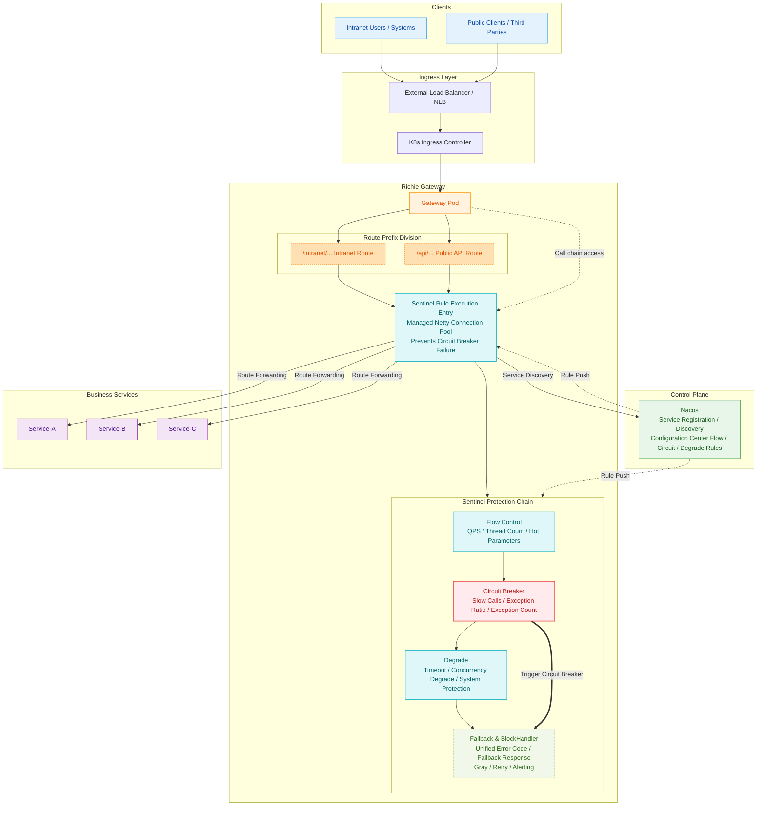

# Gateway Circuit Breaker Architecture

```mermaid
flowchart TB
  %% Emphasis: Alibaba Sentinel rate limiting, circuit breaking, and degradation in Gateway, along with sentinel-spring-cloud-gateway-adapter managing the Netty connection pool to prevent circuit breaker failure

  %% Entry layer: internal and external clients
  subgraph Clients[Clients]
    direction TB
    C1[Intranet Users / Systems]:::client
    C2[Public Clients / Third Parties]:::client
  end

  %% K8s/Network entry
  subgraph Ingress[Ingress Layer]
    direction TB
    LB[External Load Balancer / NLB]
    IG[K8s Ingress Controller]
    LB --> IG
  end

  %% Gateway instances (same JAR, different prefixes distinguish intranet/extranet)
  subgraph Gateway[Richie Gateway]
    direction TB
    G[Gateway Pod]:::gateway

    subgraph RouteSplit[Route Prefix Division]
      direction TB
      R1["/intranet/... Intranet Route"]:::route
      R2["/api/... Public API Route"]:::route
    end

    G --> R1
    G --> R2

    %% Sentinel adapter / connection pool management
    SA[Sentinel Rule Execution Entry<br>Managed Netty Connection Pool<br>Prevents Circuit Breaker Failure]:::sentinel

    %% Regardless of intranet/extranet routes, all enter Sentinel first
    R1 --> SA
    R2 --> SA
    G -. Call chain access .-> SA

    %% Circuit breaking / rate limiting / degradation processing chain
    subgraph Protect[Sentinel Protection Chain]
      direction TB
      FCR[Flow Control<br>QPS / Thread Count / Hot Parameters]:::sentinel
      CB[Circuit Breaker<br>Slow Calls / Exception Ratio / Exception Count]:::breaker
      DG[Degrade<br>Timeout / Concurrency Degrade / System Protection]:::sentinel
      FH[Fallback & BlockHandler<br>Unified Error Code / Fallback Response<br>Gray / Retry / Alerting]:::fallback

      FCR --> CB --> DG --> FH
    end

    SA --> Protect
  end

  %% Control plane: configuration and service discovery
  subgraph ControlPlane[Control Plane]
    direction TB
    NACOS[Nacos<br>Service Registration / Discovery<br>Configuration Center Flow / Circuit / Degrade Rules]:::nacos
  end

  %% Service side: downstream application services
  subgraph Services[Business Services]
    direction TB
    S1[Service-A]:::svc
    S2[Service-B]:::svc
    S3[Service-C]:::svc
  end

  %% Network flow
  C1 --> LB
  C2 --> LB
  IG --> G

  %% Gateway to downstream (via Sentinel discovery and forwarding)
  SA -->|Service Discovery| NACOS
  SA -->|Route Forwarding| S1
  SA -->|Route Forwarding| S2
  SA -->|Route Forwarding| S3

  %% Sentinel rule sources (configuration push)
  NACOS -. Rule Push .-> SA
  NACOS -. Rule Push .-> Protect

  %% Circuit breaker emphasis: When circuit breaker triggers, fail fast and go to fallback
  CB ==> |Trigger Circuit Breaker| FH

  %% Style definitions
  classDef client fill:#e3f2fd,stroke:#2196f3,color:#0d47a1,stroke-width:1px
  classDef gateway fill:#fff3e0,stroke:#fb8c00,color:#e65100,stroke-width:1px
  classDef route fill:#ffe0b2,stroke:#f57c00,color:#e65100,stroke-width:1px,stroke-dasharray: 3 2
  classDef nacos fill:#e8f5e9,stroke:#43a047,color:#1b5e20,stroke-width:1px
  classDef svc fill:#f3e5f5,stroke:#8e24aa,color:#4a148c,stroke-width:1px
  classDef sentinel fill:#e0f7fa,stroke:#00acc1,color:#006064,stroke-width:1px
  classDef breaker fill:#ffebee,stroke:#e53935,color:#b71c1c,stroke-width:2px
  classDef fallback fill:#f1f8e9,stroke:#7cb342,color:#33691e,stroke-width:1px,stroke-dasharray: 5 3

```

