# Richie Gateway Design Document

> **Version**: 1.0.0
> **Updated**: 2025-11-03
> **Author**: richie696

## 📋 Table of Contents

- [1. Quick Overview](#1-quick-overview)
- [2. Deployment Architecture](#2-deployment-architecture)
- [3. Filter Architecture](#3-filter-architecture)
- [4. Core Features](#4-core-features)
- [5. Configuration Guide](#5-configuration-guide)
- [6. Client Integration](#6-client-integration)
- [7. JVM Optimization Configuration](#7-jvm-optimization-configuration)
- [8. Appendix](#8-appendix)

---

## 1. Quick Overview

### 1.1 Core Features

| Feature | Description | Status |
|---------|-------------|--------|
| 🔐 **ECC Encryption** | ECC+AES-GCM end-to-end encryption | ✅ Production Ready |
| 🛡️ **Duplicate Submit Prevention** | Multi-dimensional duplicate submission protection | ✅ Production Ready |
| 🔑 **Authentication & Authorization** | JWT tokens, SSO single sign-on | ✅ Production Ready |
| 🏢 **Multi-Tenant** | Tenant isolation and access control | ✅ Production Ready |
| 🚀 **Canary Release** | Multi-dimensional Canary release | ✅ Production Ready |
| ⚡ **Circuit Breaker & Rate Limiting** | Sentinel unified protection | ✅ Production Ready |
| 🌍 **Internationalization** | Multi-language support | ✅ Production Ready |

### 1.2 Technology Stack

| Technology | Version |
|------------|--------|
| Spring Cloud Gateway | 4.x |
| Java | 25 (ZGC) |
| Sentinel | Latest |
| Redis | 6.x+ |
| Nacos | 2.x |

---

## 2. Deployment Architecture

The gateway supports two mainstream deployment modes: ECS traditional deployment and K8S containerized deployment. In different deployment environments, the gateway's position and responsibilities in the network architecture vary.

### 2.1 ECS Deployment Architecture

#### 2.1.1 Architecture Overview

In the ECS deployment environment, the gateway serves as the unified entry point, and all internal and external network requests must pass through the gateway for authentication and routing. Internal and external network requests use independent gateway instances to ensure security isolation.

#### 2.1.2 Network Topology

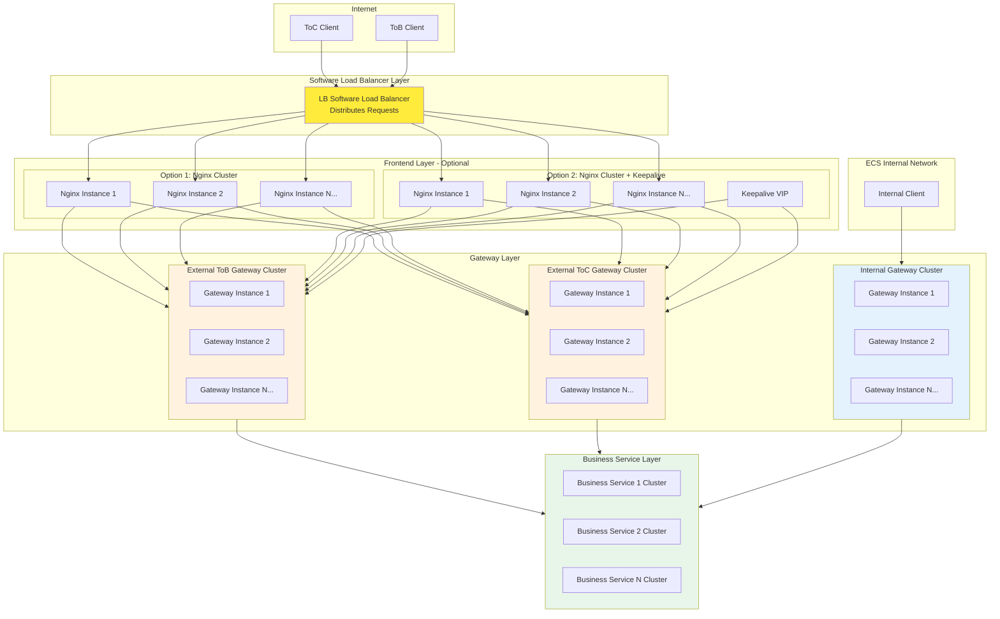

#### 2.1.3 Core Characteristics

**Frontend Layer**:
- **LB Software Load Balancer**: Receives all public requests, distributes to multiple Nginx instances
- **Option 1**: `Nginx Multi-Instance` - LB distributes to multiple Nginx instances, Nginx forwards to Gateway
- **Option 2**: `Nginx Multi-Instance + Keepalive` - LB distributes to multiple Nginx instances, Nginx achieves VIP high availability through Keepalive, then forwards to Gateway

**Gateway Layer**:
- **External Gateway**: Independent cluster, divided into ToB and ToC two sets of independent gateway instances
  - ToB Gateway: Handles enterprise customer requests
  - ToC Gateway: Handles individual user requests
- **Internal Gateway**: Independent cluster, handles ECS internal network requests
- **Multi-Instance Deployment**: All gateways use multi-instance deployment to ensure high availability

**Security Mechanisms**:
- ✅ **Internal/External Network Isolation**: Internal and external network gateways are completely independent, physically/logically isolated
- ✅ **Mandatory Authentication**: All requests (including internal network requests) must pass through gateway authentication
- ✅ **Prevent Illegal Access**: Prevents illegal access to ECS internal network, even internal requests need to verify identity through the gateway

**Request Flow**:
```
External Request: Client → LB → Nginx → External Gateway (ToB/ToC) → Business Service Cluster
Internal Request: ECS Internal Network Client → Internal Gateway → Business Service Cluster
```

#### 2.1.4 Traffic Isolation Explanation

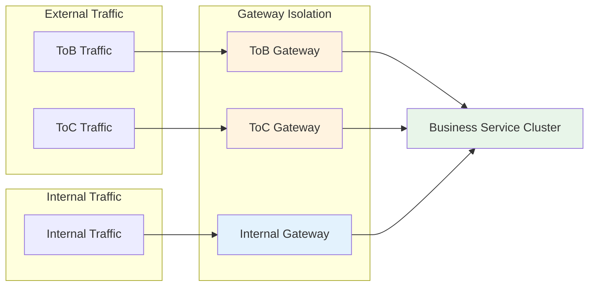

**Isolation Strategy**:
- 🔒 ToB and ToC gateways are completely isolated, not interfering with each other
- 🔒 Internal gateway is independently deployed, physically isolated from public gateways
- 🔒 All gateways require authentication to prevent illegal access

---

### 2.2 K8S Deployment Architecture

#### 2.2.1 Architecture Overview

In the K8S containerized deployment environment, the gateway serves as the cluster entry point, and all public network requests must pass through the gateway. Inter-service requests can communicate directly through K8s Service without passing through the gateway, utilizing K8s's CoreDNS and Service mechanisms for load balancing and routing.

#### 2.2.2 Network Topology

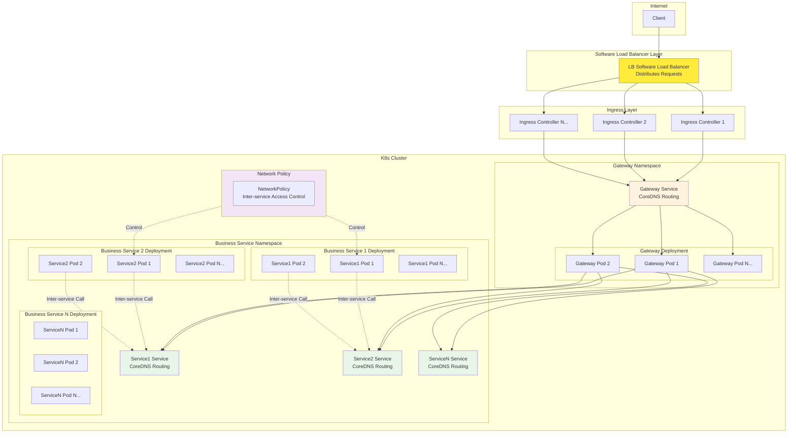

#### 2.2.3 Core Characteristics

**Entry Layer**:
- **LB Software Load Balancer**: Receives public network requests, distributes to multiple Ingress Controller instances
- **Ingress Controller**: Multi-instance deployment, routes requests to Gateway Service according to Ingress rules

**Gateway Layer**:
- **Gateway Service**: K8s Service, performs service discovery through CoreDNS
- **Gateway Pods**: Multi-instance deployment, achieves load balancing through Service
- **Public Traffic**: All public network requests must pass through Gateway Pod

**Business Service Layer**:
- **Inter-Service Communication**: Inter-service requests can be called directly without going through Gateway
- **CoreDNS + Service**: Utilizes K8s native service discovery and load balancing
- **NetworkPolicy**: K8s network policy ensures inter-service security, replacing request signatures

**Security Mechanisms**:
- ✅ **K8s Security**: Ensures service security through mechanisms like NetworkPolicy, RBAC
- ✅ **No Signature Required**: Inter-service requests do not require signature verification, secured by K8s
- ✅ **CoreDNS Routing**: Achieves service discovery and load balancing through CoreDNS

**Request Flow**:
```
Public Request: Client → LB Load Balancer → Ingress Controller → Gateway Service → Gateway Pod → Business Service → Business Pod
Inter-service Request: Service Pod → Target Service (CoreDNS) → Target Pod (Direct connection, no Gateway required)
```

#### 2.2.4 Inter-Service Communication Pattern

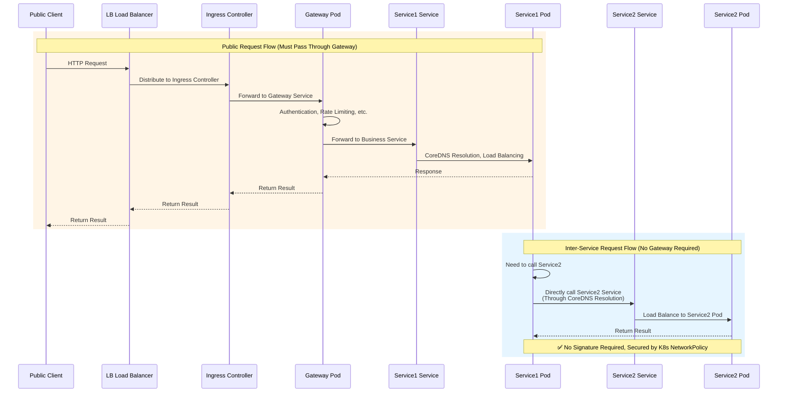

#### 2.2.5 K8s Service Routing Mechanism

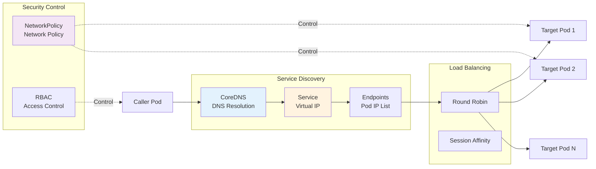

**K8s Native Capabilities**:
- 🔍 **CoreDNS**: Automatically resolves Service names to ClusterIP
- ⚖️ **Service Load Balancing**: Automatically distributes requests among Pods
- 🔒 **NetworkPolicy**: Defines network access rules between Pods
- 🛡️ **RBAC**: Controls Pod access permissions

---

### 2.3 Comparison of Two Deployment Modes

| Comparison Dimension | ECS Deployment | K8S Deployment |
|---------------------|----------------|-----------------|
| **Frontend Layer** | LB Load Balancer → Nginx Multi-Instance or Nginx Multi-Instance + Keepalive | LB Load Balancer → Ingress Controller Multi-Instance |
| **Gateway Deployment** | Multi-instance independent deployment | Multi-Pod deployment through Deployment |
| **Request Path** | All requests must pass through Gateway | Public requests pass through Gateway, inter-service direct connection |
| **Load Balancing** | Nginx/LB | CoreDNS + Service |
| **Service Discovery** | Registration Center (Nacos) | CoreDNS + Service |
| **Security Mechanism** | Gateway Authentication + Request Signature | K8s NetworkPolicy + RBAC |
| **Inter-Service Communication** | Requires signature, optionally through Gateway | No signature required, direct connection, secured by K8s |
| **Isolation Strategy** | Internal/external network independent gateway, ToB/ToC independent | Isolated through Namespace |
| **Operational Complexity** | Requires manual configuration of Nginx, Keepalive | K8s automated management |
| **Scalability** | Manual scaling | Auto scaling (HPA) |

#### 2.3.1 Selection Recommendations

**Choose ECS Deployment**:
- ✅ Traditional enterprise environment with existing ECS infrastructure
- ✅ Requires strict network isolation (internal/external, ToB/ToC)
- ✅ Low containerization requirements
- ✅ Requires fine-grained control over each gateway instance

**Choose K8S Deployment**:
- ✅ Containerized environment with existing K8s cluster
- ✅ Requires automated operations and elastic scaling
- ✅ Frequent inter-service calls, wants to reduce gateway burden
- ✅ Utilizes K8s native capabilities (Service, NetworkPolicy, etc.)

---

## 3. Filter Architecture

### 3.1 Five-Layer Architecture

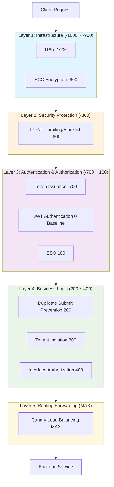

### 3.2 Filter Checklist

| Order | Filter | Function | Layer |
|-------|--------|----------|-------|
| -1000 | I18nFilter | Internationalization Processing | Infrastructure |
| -900 | EccCryptoFilter | ECC+AES-GCM Encryption | Infrastructure |
| -800 | SecurityFilter | IP Rate Limiting, Blacklist | Security |
| -700 | IssueTokensFilter | Token Issuance | Authentication |
| **0** | **AuthenticationFilter** | **JWT Authentication (Baseline)** | Authentication |
| 100 | SsoFilter | Single Sign-On | Authentication |
| 200 | DuplicateSubmitFilter | Duplicate Submit Prevention | Business Logic |
| 300 | TenantFilter | Tenant Isolation | Business Logic |
| 400 | InterfaceAuthFilter | Interface Authorization | Business Logic |
| MAX | CanaryLoadBalancerFilter | Canary Load Balancing | Routing |

---

## 4. Core Features

### 4.1 ECC Encrypted Communication

#### Technical Principle

**ECC (Elliptic Curve Cryptography) + AES-GCM (Symmetric Encryption) Hybrid Encryption Scheme**

**Why Use Hybrid Encryption?**

- **ECC**: Secure but slow, used for key exchange
- **AES-GCM**: Fast and secure, used for data encryption
- **Combination**: Use ECC to exchange keys, use AES-GCM to encrypt data

#### ECC+AES-GCM vs Simple HTTPS Comparison

| Comparison Dimension | ECC+AES-GCM Hybrid Encryption | Simple HTTPS Encryption | Description |
|---------------------|------------------------------|------------------------|-------------|
| **🔐 Encryption Method** |
| Transport Layer Encryption | ❌ None (Application Layer Encryption) | ✅ TLS/SSL | HTTPS relies on TLS protocol |
| Application Layer Encryption | ✅ ECC Key Exchange + AES-GCM | ❌ None | Double encryption, more secure |
| End-to-End Encryption | ✅ Client↔Gateway↔Backend (Optional) | ❌ Client↔Gateway only | ECC can extend to backend |
| **🛡️ Security** |
| Confidentiality | ✅ AES-256 | ✅ TLS 1.2+ (AES-128/256) | Comparable encryption strength |
| Integrity Protection | ✅ AES-GCM Tag Authentication | ✅ TLS MAC | Both have integrity checks |
| Forward Secrecy | ✅ KeyPair periodic update (24 hours) | ⚠️ Depends on TLS version | ECC can actively rotate keys |
| Key Leakage Risk | ✅ Independent key per session | ⚠️ Long-term certificate key | ECC session keys more secure |
| Man-in-the-Middle Attack Protection | ✅ ECC Key Exchange Verification | ✅ Certificate Chain Verification | Different protection mechanisms |
| **⚡ Performance** |
| Encryption/Decryption Overhead | ⚠️ Application layer processing (10-50ms) | ✅ TLS hardware acceleration (<5ms) | HTTPS has hardware acceleration advantage |
| Initial Handshake Latency | ⚠️ Key exchange (100-200ms) | ✅ TLS handshake (50-100ms) | HTTPS handshake slightly faster |
| Data Transfer Performance | ✅ AES-GCM efficient | ✅ TLS encryption efficient | Comparable performance |
| CPU Usage | ⚠️ Higher (ECC computation) | ✅ Lower (hardware acceleration) | HTTPS more CPU-efficient |
| **🔧 Deployment & Operations** |
| Certificate Management | ✅ No CA certificate required | ❌ Requires CA certificate/Let's Encrypt | ECC no certificate management |
| Certificate Expiration Issue | ✅ None | ❌ Requires periodic renewal | ECC avoids certificate expiration |
| Certificate Cost | ✅ Zero cost | ⚠️ Enterprise certificates require payment | ECC no certificate cost |
| Configuration Complexity | ⚠️ Requires client integration | ✅ Server configuration only | HTTPS simpler to configure |
| Client Adaptation | ⚠️ Requires client library integration | ✅ Browser/HTTP client native support | HTTPS better compatibility |
| **🎯 Applicable Scenarios** |
| Public Websites | ❌ Not applicable | ✅ Preferred | HTTPS more suitable |
| Mobile Apps | ✅ Perfect fit | ✅ Also applicable | Both can be used |
| Internal Systems | ✅ More flexible | ✅ Also applicable | ECC more flexible |
| High Security Requirements | ✅ End-to-end encryption | ⚠️ Transport encryption only | ECC higher security |
| Financial Payment | ✅ Recommended | ✅ Also applicable | ECC more suitable for sensitive data |
| **🔑 Key Management** |
| Key Generation | ✅ Client and server each generate independently | ❌ Server certificate only | ECC key pairs independently generated |
| Key Rotation | ✅ Can rotate dynamically (24 hours) | ⚠️ Rotates only when certificate expires | ECC more flexible rotation |
| Key Storage | ✅ In memory, not persisted | ❌ Certificate file storage | ECC keys more secure |
| Multi-Tenant Keys | ✅ Can support multiple KeyPairs | ⚠️ Requires multiple certificates | ECC more flexible |
| **🌍 Compatibility** |
| Browser Support | ✅ Web Crypto API | ✅ Native TLS | Both supported |
| Mobile Support | ✅ Requires library integration | ✅ Native support | HTTPS better compatibility |
| Backend Services | ✅ Optional encryption | ✅ Must use HTTPS | ECC optional |
| Legacy System Compatibility | ⚠️ Requires client upgrade | ✅ Widely compatible | HTTPS better compatibility |
| **💰 Cost** |
| Certificate Fees | ✅ Free | ⚠️ Enterprise certificates require payment | ECC no certificate cost |
| Development Cost | ⚠️ Requires client development | ✅ Almost no development required | HTTPS lower development cost |
| Operations Cost | ✅ No certificate management | ⚠️ Requires certificate management | ECC simpler operations |
| **📊 Controllability** |
| Encryption Granularity | ✅ Configurable per interface/path | ❌ Full site encryption | ECC fine-grained control |
| Encryption Algorithm Selection | ✅ Fully controllable | ⚠️ Depends on TLS version | ECC algorithm controllable |
| Performance Tuning | ✅ Can optimize encryption path | ⚠️ Depends on TLS configuration | ECC more controllable |
| Logging & Audit | ✅ Can record encryption information | ⚠️ TLS layer not visible | ECC better auditability |

#### Selection Recommendations

**Scenarios to Use ECC+AES-GCM**:
- ✅ Business systems with high security requirements (finance, payment, healthcare)
- ✅ Scenarios requiring end-to-end encryption
- ✅ Want to avoid certificate management complexity
- ✅ Need fine-grained encryption control (per interface/path)
- ✅ Mobile App internal communication
- ✅ Multi-tenant systems (different tenants use different keys)

**Scenarios to Use Simple HTTPS**:
- ✅ Public websites and web applications
- ✅ Standard HTTP API services
- ✅ Need rapid deployment and zero client development
- ✅ Browser access as primary scenario
- ✅ Scenarios where compatibility is priority

**Best Practice: Hybrid Usage**:
- 🌐 **Public Interfaces**: Use HTTPS (zero configuration, good compatibility)
- 🔐 **Sensitive Interfaces**: Use ECC+AES-GCM (high security, end-to-end encryption)
- 📱 **Mobile Apps**: Prefer ECC+AES-GCM (no certificate management, more flexible)

#### Key Exchange Principle (ECDH)

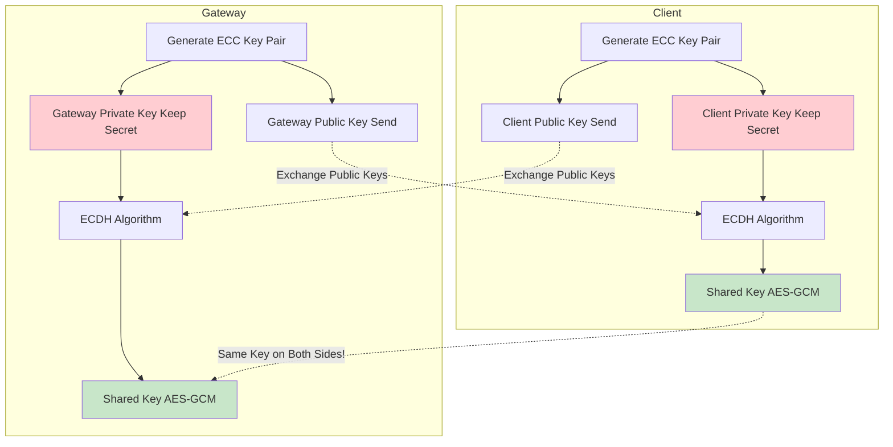

**Core Characteristics**:
- 🔐 Both parties generate their own key pairs, private keys are never transmitted
- 🤝 After exchanging public keys, the **same shared key** is calculated through the ECDH algorithm
- ⚡ The shared key is used only for this session, Gateway KeyPair will be updated periodically

#### Complete Encryption Flow

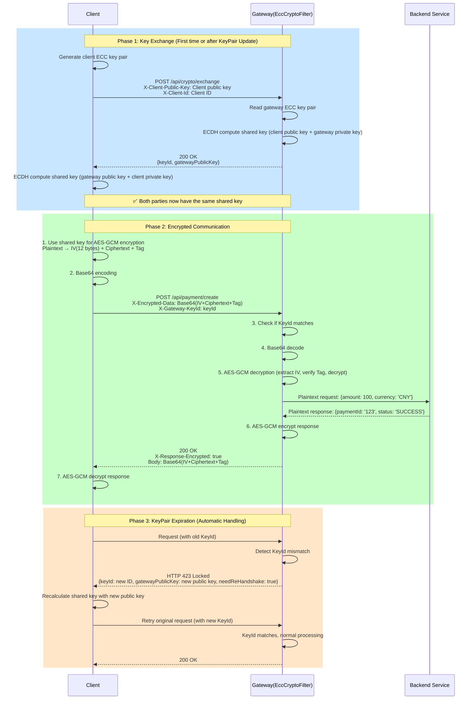

#### AES-GCM Encryption Details

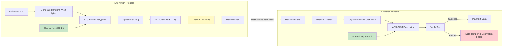

**Security Features**:
- 🔒 **Confidentiality**: AES-256 encryption, unbreakable
- ✅ **Integrity**: Tag authentication, tamper-proof
- 🔄 **Forward Security**: KeyPair updates periodically, old keys become invalid
- 🚀 **High Performance**: AES-GCM has hardware acceleration

#### Configuration

```yaml
platform:
  gateway:
    ecc-crypto:
      enabled: true           # Enable ECC encryption
      key-pair-ttl: 86400000  # KeyPair validity 24 hours
      include-paths:
        - "/api/auth/**"      # Encrypt authentication interfaces
        - "/api/payment/**"   # Encrypt payment interfaces
      exclude-paths:
        - "/api/public/**"    # Public interfaces not encrypted
```

#### Client Integration

See: [client-library/examples/](../src/main/resources/client-library/examples/)

---

### 4.2 Duplicate Submit Prevention

#### Technical Principle

**Dual Protection Mechanism**: Client-side protection (local queue) + Server-side protection (Redis cache)

**Core Idea**:
- Generate a unique identifier (requestId) for each request
- Within the time window, requests with the same requestId are only allowed once
- After the time window expires, records are automatically cleaned up

#### Request Identifier Generation Algorithm

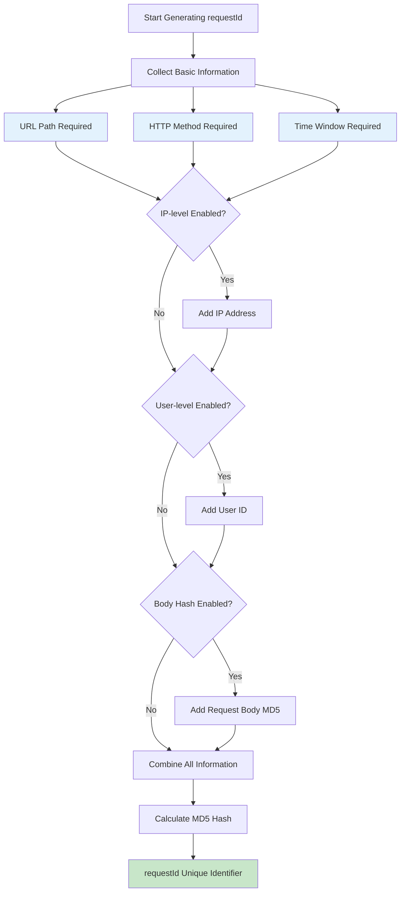

**Generation Formula**:
```javascript
requestId = MD5(
    URL Path + 
    HTTP Method + 
    ⌊Current Time / Time Window⌋ +  // Time slice, same within window
    IP Address (optional) + 
    User ID (optional) + 
    MD5(Request Body) (optional)
)
```

**Example**:
```
URL: /api/order/submit
Method: POST
Time Window: 3000ms
Current Time: 1730419200000
User ID: user123
IP: 192.168.1.100
Request Body: {"orderId":"12345","amount":100}

requestId = MD5(
    "/api/order/submit" + 
    "POST" + 
    "576806400" +              // ⌊1730419200000 / 3000⌋
    "192.168.1.100" +
    "user123" +
    "a1b2c3d4e5f6"            // MD5(Request Body)
) = "7f8a9b1c2d3e4f5a"
```

#### Dual Protection Flow

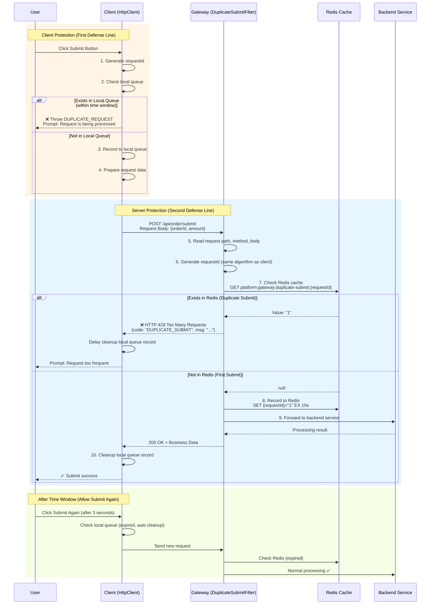

#### Multi-Dimensional Protection

| Dimension | Description | Configuration Item | Applicable Scenario |
|-----------|-------------|-------------------|---------------------|
| **Path** | Specify which APIs need checking | `include-paths`<br/>`exclude-paths` | All scenarios |
| **Method** | Only check write operations | Auto-identify | All scenarios |
| **Time Window** | Deduplicate within same window | `time-window: 3000` | All scenarios |
| **User** | Same user cannot submit duplicate within time window | `enable-user-level: true` | Post-login operations |
| **IP** | Same IP cannot submit duplicate within time window | `enable-ip-level: true` | Prevent malicious attacks |
| **Request Body** | Deduplicate by same request body hash | `enable-body-hash: true` | Prevent duplicate data |

#### Time Window Mechanism

```mermaid
gantt
    title Duplicate Submit Prevention Timeline (Time Window=3s)
    dateFormat X
    axisFormat %S秒

    section Request 1
    Request Sent       :a1, 0, 1s
    Cache Record       :a2, after a1, 10s
    Time Window       :crit, a3, 0, 3s
    
    section Duplicate Request
    Attempt Send (1s)  :crit, b1, 1, 1s
    Blocked           :done, b2, after b1, 0s
    Attempt Send (2s)  :crit, b3, 2, 1s
    Blocked           :done, b4, after b3, 0s
    
    section Allowed Request
    Send After 3s     :c1, 4, 1s
    Allowed Through   :active, c2, after c1, 0s
```

**Description**:
- ⏰ **Time Window**: Same requestId only allowed once within 3 seconds
- 🔄 **Auto Cleanup**: Cache expiration time is usually 2-3x the time window
- ✅ **After Window**: New requests automatically allowed after time window expires

#### Cache Strategy

**Redis Cache Key Structure**:
```
platform:gateway:duplicate-submit:{requestId}
```

**Value**: Fixed as `"1"`
**Expiration Time**: 10 seconds (3x the time window)

**Why is expiration time greater than time window?**
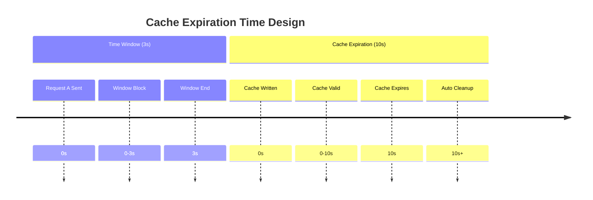

**Reasons**:
- ⏱️ Prevent duplicate submissions under edge conditions
- 🔄 Give Redis some cleanup buffer time
- 🛡️ Add extra security boundary

#### Configuration

```yaml
platform:
  gateway:
    duplicate-submit:
      enabled: true                    # Enable
      time-window: 3000               # Time window 3 seconds
      cache-expire: 10000             # Cache 10 seconds
      enable-user-level: true         # User-level checking
      enable-ip-level: true           # IP-level checking
      enable-body-hash: true          # Request body hash
      include-paths: ["/api/**"]
      exclude-paths: 
        - "/api/health/**"
        - "/api/auth/login"           # Login allows retry
      error-code: "DUPLICATE_SUBMIT"
      error-message: "Request too frequent, please try again later"
```

#### Dual Protection

```
Client Check (Local Queue) → Server Check (Redis Cache)
      ↓                          ↓
   Immediate Rejection         HTTP 429
```

---

### 4.3 Authentication & Authorization

#### 4.3.1 JWT Token

**Lifecycle**:

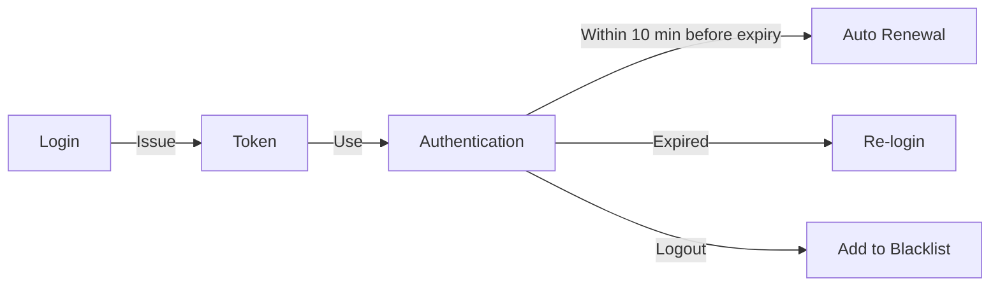

**Configuration**:

```yaml
platform:
  gateway:
    token:
      expire-time: 2                    # Validity 2 hours
      expiration-renewal-time: 10       # Renew within 10 minutes before expiry
      secret: "your-jwt-secret-key"     # JWT secret
      blacklist-path: "platform:gateway:token:"
      login-uri-list:
        - /api/auth/login               # Login interface
      ignore-uri-list:
        - /api/public/**                # Ignore public interfaces
```

#### 4.3.2 SSO Single Sign-On

**Function**: Same account can only login in one place, new login kicks out old session

**Configuration**:

```yaml
platform:
  gateway:
    sso:
      enable: true
      sso-login-url: "http://localhost:8080/sso/login"
      online-token-path: "platform:gateway:online-token:"
```

---

### 4.4 Security Protection

#### IP Rate Limiting Policy

| Rule | Description |
|------|-------------|
| `banned_ip` | Ban IP address |
| `custom_http_status` | Return custom error |
| `redirect` | Redirect to error page |

#### Configuration Example

```yaml
platform:
  gateway:
    security:
      enable: true
      rule: banned_ip                   # Ban policy
      security-threshold: 60            # 60 times/minute
      security-time-interval-value: 1
      security-time-interval-unit: minutes
      banned:
        permanent: false                # Non-permanent ban
        security-block-time: 5          # Ban for 5 minutes
        security-block-time-unit: minutes
```

---

### 4.5 Canary Release

#### Three Dimensions

| Dimension | Description | Use Case |
|-----------|-------------|----------|
| **VERSION** | Based on version number | Server-side control |
| **ID** | Based on characteristic ID (user ID, store ID, etc.) | Specified user testing |
| **CUSTOM** | Client dynamically specifies | Flexible control |

#### Configuration

```yaml
platform:
  gateway:
    deploy:
      enable: true
      canary-category: VERSION    # Or ID, CUSTOM
      id-list:                    # Used in ID mode
        - 111
        - 222
```

---

### 4.6 Sentinel Circuit Breaker

#### Core Advantages

- ✅ **Managed Netty Connection Pool** - Prevents circuit breaker failure
- ✅ **Unified Protection** - Internal and external network requests uniformly pass through Sentinel
- ✅ **Dynamic Rules** - Rules dynamically下发 through Nacos
- ✅ **Multi-Dimensional Protection** - Flow control, circuit breaking, degradation, hotspot parameters, system protection

#### Architecture Diagram

> 📊 **Detailed Architecture Diagram**: Please refer to [Gateway Circuit Breaker Architecture](./网关熔断器架构图.md), this document details the complete architecture of Sentinel in the gateway, including:
> - Client to gateway request flow
> - Internal/external network routing division
> - Sentinel rule execution entry and connection pool hosting
> - Flow control, circuit breaking, degradation, fallback handling chain
> - Nacos configuration center rule下发
> - Downstream service routing and forwarding

#### Configuration

```yaml
spring:
  cloud:
    sentinel:
      transport:
        dashboard: 10.100.0.90:8899
      datasource:
        flow:
          nacos:
            server-addr: 10.100.0.112:8848
            data-id: gateway-flow-rules.json
            rule-type: flow
        degrade:
          nacos:
            server-addr: 10.100.0.112:8848
            data-id: gateway-degrade-rules.json
            rule-type: degrade
```

---

## 5. Configuration Guide

### 5.1 Minimal Configuration

#### application.yml (Local Configuration)

```yaml
server:
  port: 8080

spring:
  application:
    name: atlas-richie-gateway-service
  cloud:
    nacos:
      discovery:
        server-addr: 10.100.0.51:8848
        namespace: production
      config:
        server-addr: 10.100.0.51:8848
        namespace: production
        name: gateway-service.yaml
        group: global
        file-extension: yaml

logging:
  config: ./logback-spring.xml
```

#### gateway-service.yaml (Nacos Configuration Center)

```yaml
# Redis Configuration
spring:
  data:
    redis:
      host: 10.100.0.87
      port: 6379
      password: your-password
      database: 0
      lettuce:
        pool:
          max-active: 100
          max-idle: 10
          min-idle: 5

# Route Configuration
  cloud:
    gateway:
      routes:
        - id: user-service
          uri: lb://user-service
          predicates:
            - Path=/api/user/**
          filters:
            - StripPrefix=1

# Sentinel Circuit Breaker
    sentinel:
      transport:
        dashboard: 10.100.0.90:8899
      datasource:
        flow:
          nacos:
            server-addr: 10.100.0.112:8848
            data-id: gateway-flow-rules.json

# Gateway Function Configuration
platform:
  gateway:
    # ECC Encryption
    ecc-crypto:
      enabled: true
      
    # Duplicate Submit Prevention
    duplicate-submit:
      enabled: true
      time-window: 3000
      
    # JWT Authentication
    token:
      expire-time: 2
      secret: your-jwt-secret
      
    # Security Protection
    security:
      enable: true
      rule: banned_ip
      security-threshold: 60
```

### 5.2 Core Configuration Reference Table

| Feature | Configuration Path | Default Value | Description |
|---------|-------------------|---------------|-------------|
| ECC Encryption | `platform.gateway.ecc-crypto.enabled` | false | Whether to enable |
| Duplicate Submit Prevention | `platform.gateway.duplicate-submit.enabled` | false | Whether to enable |
| Time Window | `platform.gateway.duplicate-submit.time-window` | 3000 | Milliseconds |
| JWT Validity Period | `platform.gateway.token.expire-time` | 2 | Hours |
| Token Renewal | `platform.gateway.token.expiration-renewal-time` | 10 | Minutes |
| IP Rate Limiting | `platform.gateway.security.security-threshold` | 120 | Times/minute |
| SSO | `platform.gateway.sso.enable` | false | Whether to enable |
| Multi-Tenant | `platform.gateway.tenant.enable` | false | Whether to enable |
| Canary Release | `platform.gateway.deploy.enable` | false | Whether to enable |

---

## 6. Client Integration

### 6.1 Client Library

**Location**: `src/main/resources/client-library/`

**Supported Frameworks**:
- ⚛️ React 18+
- 🅰️ Angular 17+
- 🟢 Vue 3

### 6.2 Quick Start

#### Step 1: Define URL

```typescript
import { Url, Method } from './framework/url';

export class AppUrl {
    // Public data: not encrypted, no duplicate prevention
    public static readonly MENU_ALL = new Url(
        'MENU_ALL', '/api/menu/all', Method.GET
    );

    // Login: encrypted, no duplicate prevention
    public static readonly USER_LOGIN = new Url(
        'USER_LOGIN', '/api/auth/login', Method.POST,
        true,   // Encrypt
        false   // No duplicate prevention
    );

    // Payment: encrypted, duplicate prevention
    public static readonly PAYMENT_CREATE = new Url(
        'PAYMENT_CREATE', '/api/payment/create', Method.POST,
        true,   // Encrypt
        true    // Duplicate prevention
    );
}
```

#### Step 2: Use Client

**React**:
```tsx
const client = useHttpClient();
await client.request(AppUrl.USER_LOGIN, {
    body: { username, password }
});
```

**Angular**:
```typescript
private httpClient = inject(HttpClientService);
await this.httpClient.request(AppUrl.USER_LOGIN, {
    body: { username, password }
});
```

**Vue**:
```vue
<script setup>
const client = useHttpClient();
await client.request(AppUrl.USER_LOGIN, {
    body: { username, password }
});
</script>
```

### 6.3 Four Configuration Combinations

| Encryption | Duplicate Prevention | Applicable Scenario | Example |
|------------|---------------------|---------------------|---------|
| ❌ | ❌ | Public read-only data | Menu, Dictionary |
| ✅ | ❌ | Sensitive data, retry allowed | Login, Query |
| ❌ | ✅ | Normal operations, duplicate prevention | File upload |
| ✅ | ✅ | High security operations | Payment, Order |

---

## 7. JVM Optimization Configuration

### 7.1 JDK25 Generational ZGC Configuration (4C8G POD)

**Complete Configuration Example**:

```bash
# JDK25 Generational ZGC Optimization (for POD starting from 4C8G)
java -Xms3g -Xmx6g \
     -XX:+UseZGC \
     -XX:+ZGenerational \
     -XX:+UnlockExperimentalVMOptions \
     -XX:+UseStringDeduplication \
     -XX:MaxMetaspaceSize=512m \
     -XX:MaxDirectMemorySize=1g \
     -XX:+HeapDumpOnOutOfMemoryError \
     -XX:HeapDumpPath=/app/logs/gateway/heapdump.hprof \
     -XX:+PrintGCDetails \
     -XX:+PrintGCDateStamps \
     -Xlog:gc*:file=/app/logs/gateway/gc.log:time:filecount=5,filesize=100M \
     -XX:+UseGCLogFileRotation \
     -XX:NumberOfGCLogFiles=5 \
     -XX:GCLogFileSize=100M \
     -Djava.security.egd=file:/dev/./urandom \
     -Dfile.encoding=UTF-8 \
     -Duser.timezone=Asia/Shanghai \
     -jar atlas-richie-gateway-service.jar
```

**Configuration Item Detailed Explanation**:

| Configuration Item | Value | Reason | Description |
|-------------------|-------|--------|-------------|
| `-Xms3g -Xmx6g` | 3GB-6GB | Heap memory configuration | Reserve 2GB for system and other processes, avoid OOM |
| `-XX:+UseZGC` | Enable ZGC | Low-latency garbage collector | ZGC pause time <1ms, suitable for gateway high-concurrency scenarios |
| `-XX:+ZGenerational` | Enable Generational ZGC | Improve throughput and memory reclamation efficiency | Generational ZGC not enabled by default in JDK25, need to add this parameter manually |
| `-XX:+UnlockExperimentalVMOptions` | Enable Experimental Options | Support experimental features like ZGC | ZGC still requires this parameter in JDK25 |
| `-XX:+UseStringDeduplication` | Enable String Deduplication | Reduce memory usage | Gateway processes many HTTP requests, string deduplication can save memory |
| `-XX:MaxMetaspaceSize=512m` | 512MB | Metaspace size limit | Prevent metaspace from growing infinitely, affecting system stability |
| `-XX:MaxDirectMemorySize=1g` | 1GB | Direct memory limit | Limit NIO buffer usage, prevent memory leaks |
| `-XX:+HeapDumpOnOutOfMemoryError` | Enable Heap Dump | Fault diagnosis | Auto-generate heap dump file when OOM occurs, convenient for problem analysis |
| `-XX:HeapDumpPath=/app/logs/gateway/heapdump.hprof` | Heap dump path | File storage location | Specify heap dump file save path |
| `-XX:+PrintGCDetails` | Enable Detailed GC Logs | Performance monitoring | Record detailed GC information, convenient for performance tuning |
| `-XX:+PrintGCDateStamps` | Enable GC Timestamp | Time tracking | Add timestamp to GC logs, convenient for problem location |
| `-Xloggc:/app/logs/gateway/gc.log` | GC log path | Log storage | Specify GC log file save path |
| `-XX:+UseGCLogFileRotation` | Enable Log Rotation | Disk space management | Prevent GC log files from becoming too large, auto rotate |
| `-XX:NumberOfGCLogFiles=5` | 5 log files | History retention | Keep the most recent 5 GC log files |
| `-XX:GCLogFileSize=100M` | 100MB | Single file size | Maximum 100MB per GC log file |
| `-Djava.security.egd=file:/dev/./urandom` | Random number generator | Startup performance | Use /dev/urandom to speed up startup, avoid blocking |
| `-Dfile.encoding=UTF-8` | UTF-8 encoding | Character encoding | Ensure correct encoding of logs and messages |
| `-Duser.timezone=Asia/Shanghai` | Shanghai timezone | Time handling | Set system timezone, ensure correct log time |

### 7.2 ZGC Garbage Collector Advantages

**ZGC Characteristics**:

1. **Extremely Low Latency**: ZGC pause time is usually less than 1 millisecond, very suitable for latency-sensitive services like gateways
2. **Scalability**: ZGC pause time does not increase with heap size, suitable for large memory scenarios
3. **Concurrent Processing**: Most of ZGC's work is done concurrently, does not block application threads
4. **Memory Efficiency**: ZGC has high memory usage efficiency and low fragmentation

**Memory Allocation Strategy**:

- **Heap Memory**: Set to 75% of total memory, reserve 25% for system and other processes
- **Direct Memory**: Set to 12.5% of total memory, used for NIO buffers
- **Metaspace**: Set to 6.25% of total memory, used for class metadata
- **System Reserved**: Reserve 6.25% for operating system and other processes

### 7.3 Performance Monitoring Recommendations

**GC Monitoring Indicators**:
- GC Frequency: Monitor how often GC occurs
- GC Pause Time: Monitor pause time for each GC
- Memory Usage: Monitor heap memory and direct memory usage

**Key Performance Indicators**:
- Response Time: Monitor API response time
- Throughput: Monitor requests processed per second
- Error Rate: Monitor request error rate

**Alert Settings**:
- Alert when GC pause time >10ms
- Alert when memory usage >80%
- Alert when response time >1s

**Tuning Recommendations**:
1. **Adjust heap size based on actual load**: Monitor memory usage, adjust heap size appropriately, avoid setting heap memory too large which affects GC efficiency
2. **Monitor GC logs**: Regularly analyze GC logs, discover performance issues, adjust related parameters based on GC situation
3. **System resource monitoring**: Monitor CPU usage, avoid CPU becoming a bottleneck; monitor network IO, ensure network performance meets requirements

### 7.4 POD Resources and JVM Configuration Recommendations in K8s Environment

In Kubernetes (K8s) environment, it is recommended to adopt a "small and many" POD deployment strategy, reasonably allocate single POD resources, and improve overall throughput and high availability through horizontal scaling with replica count.

**Resource Allocation Principles**:
- Single POD memory should not be too large, recommended not to exceed 4G, CPU not to exceed 2-4 cores
- JVM heap memory is recommended to be 50%-70% of POD memory, the rest is for direct memory, metaspace and system
- Prioritize improving capability by increasing POD replica count (horizontal scaling), rather than unlimited increase of single POD heap memory
- Production environment recommends POD replica count ≥3 to ensure high availability and elastic scaling

**Recommended Configuration Table**:

| Business Scale | POD Replica Count | CPU | Memory | JVM Heap Recommendation | Applicable Scenario |
|---------------|------------------|------|--------|------------------------|---------------------|
| Dev/Test | 1-2 | 0.5-1 core | 1-2G | 512m-1g | Low concurrency/Functional verification |
| Small Production | 2-3 | 1-2 cores | 2-3G | 1g-1.5g | Daily active <50k |
| Medium Production | 3-5 | 2 cores | 2-4G | 1.5g-2g | Daily active 50k-200k |
| Large Production | 5-8 | 2-4 cores | 3-6G | 2g-3g | Daily active 200k-1M |

> **Description**: JVM parameter recommendation `-Xms=-Xmx=`, the rest of memory allocated to direct memory, metaspace and system.

**Horizontal Scaling Advantages**:
- **High Availability**: Single POD failure has limited impact, K8s can automatically rebuild replicas
- **Elastic Scaling**: Can automatically scale up/down based on traffic, high resource utilization
- **Fault Isolation**: Single POD crash will not drag down the entire service, improving system robustness
- **Smooth Upgrades**: Supports rolling upgrades, zero downtime

**K8s Resource Configuration YAML Example**:

```yaml
resources:
  requests:
    memory: "2Gi"
    cpu: "1"
  limits:
    memory: "3Gi"
    cpu: "2"
```

JVM parameter recommendation: `-Xms1g -Xmx1.5g -XX:MaxDirectMemorySize=512m ...`

**Best Practice Recommendations in K8s**:
1. Prioritize horizontal scaling of replica count, single POD memory should not exceed 4G
2. Monitor POD memory and GC logs, when frequent Full GC or OOM occurs, prioritize increasing replica count rather than single POD resources
3. Reasonably set HPA (auto scaling), automatically scale based on CPU/memory/custom QPS and other indicators
4. Upgrades/releases use rolling approach, avoid full restart
5. Nodes need to reserve some resources for system and other services, avoid resource contention

> **This section is dedicated to POD resources and JVM configuration recommendations in K8s environment, applicable to production deployment of Spring Cloud Gateway and other microservice gateways on Kubernetes platform.**

---

## 8. Appendix

### 8.1 Quick Commands

#### Health Check

```bash
curl http://localhost:8080/actuator/health
```

#### Test Login

```bash
curl -X POST http://localhost:8080/api/auth/login \
  -H "Content-Type: application/json" \
  -d '{"username":"test","password":"test"}'
```

#### Request with Token

```bash
curl -X GET http://localhost:8080/api/user/profile \
  -H "x-rd-request-apitoken: YOUR_TOKEN"
```

---

### 8.2 FAQ

| Problem | Cause | Solution |
|---------|-------|----------|
| Startup failure | Configuration error, port occupied | Check configuration syntax, check port |
| Nacos connection failure | Wrong address, network issue | Check server-addr configuration |
| Token verification failure | Secret mismatch, Token expired | Check secret configuration |
| Duplicate submit false interception | Time window too long | Adjust time-window |
| Encryption failure | KeyPair expired | Client will automatically re-handshake |

---

### 8.3 Monitoring Metrics

#### Key Metrics

| Metric | Monitoring Item | Alert Threshold |
|--------|-----------------|----------------|
| Response Time | P95 Response Time | >1s |
| Error Rate | 5xx Error Rate | >1% |
| Throughput | QPS | Based on capacity planning |
| Memory | Heap Memory Usage | >80% |
| GC | GC Pause Time | >10ms |

#### Prometheus Configuration

```yaml
management:
  endpoints:
    web:
      exposure:
        include: health,metrics,prometheus
