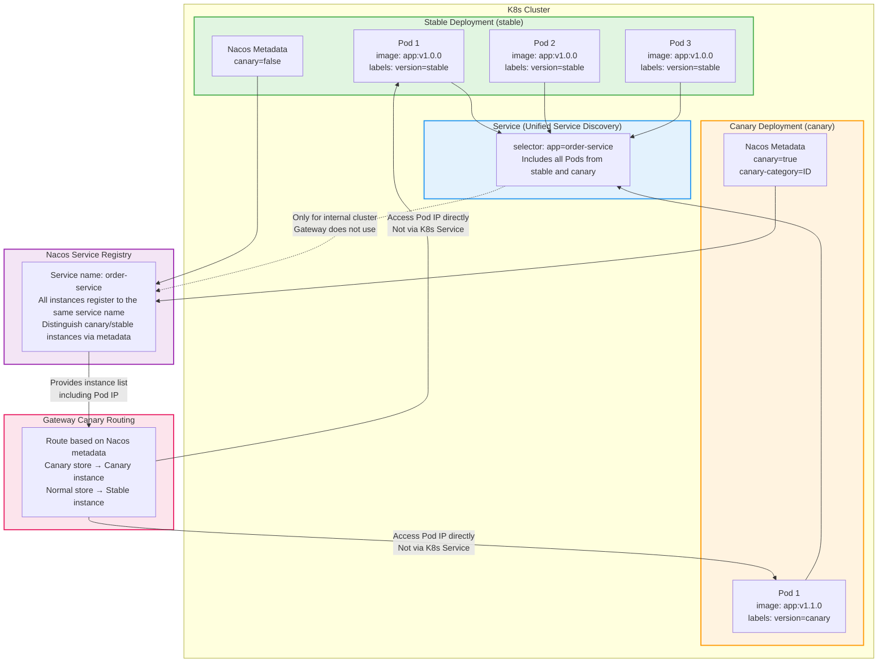

# K8s Canary Deployment Strategy

> **Author:** Wang Jinyang
> **Date:** 2025-12-09

------

[TOC]

------

## 1. Problem Analysis

### Problem Scenario

In a K8s environment, if you use RollingUpdate with a single Deployment:
- ❌ All Pod instances will be restarted
- ❌ All instances will be updated to the new version
- ❌ This defeats the purpose of canary deployment
- ❌ If the new version has issues, all services will be affected

### Solution

**Use multiple Deployment strategy**:
- ✅ Stable Deployment (stable): Keeps running, unaffected
- ✅ Canary Deployment (canary): Independent deployment and updates
- ✅ Distinguish via Nacos metadata: Gateway routes traffic based on metadata
- ✅ Independent scaling: Canary and stable instances can be scaled independently

## 2. K8s Deployment Architecture

### 2.1 Architecture Design



## 3. Deployment Configuration

### 3.1 Stable Deployment (stable)

```yaml
apiVersion: apps/v1
kind: Deployment
metadata:
  name: order-service-stable
  namespace: production
  labels:
    app: order-service
    version: stable
spec:
  replicas: 3  # Number of stable instances
  selector:
    matchLabels:
      app: order-service
      version: stable
  template:
    metadata:
      labels:
        app: order-service
        version: stable
    spec:
      containers:
      - name: order-service
        image: registry.example.com/order-service:v1.0.0
        ports:
        - containerPort: 8080
        env:
        - name: SPRING_APPLICATION_NAME
          value: order-service
        - name: NACOS_DISCOVERY_METADATA_CANARY
          value: "false"
        - name: NACOS_DISCOVERY_METADATA_CANARY_CATEGORY
          value: "CUSTOM"
        # Other configuration...
```

### 3.2 Canary Deployment (canary)

```yaml
apiVersion: apps/v1
kind: Deployment
metadata:
  name: order-service-canary
  namespace: production
  labels:
    app: order-service
    version: canary
spec:
  replicas: 1  # Number of canary instances (usually smaller)
  selector:
    matchLabels:
      app: order-service
      version: canary
  template:
    metadata:
      labels:
        app: order-service
        version: canary
    spec:
      containers:
      - name: order-service
        image: registry.example.com/order-service:v1.1.0  # New version
        ports:
        - containerPort: 8080
        env:
        - name: SPRING_APPLICATION_NAME
          value: order-service
        # Key: Set Nacos metadata to mark as canary instance
        - name: NACOS_DISCOVERY_METADATA_CANARY
          value: "true"
        - name: NACOS_DISCOVERY_METADATA_CANARY_CATEGORY
          value: "ID"
        # Other configuration...
```

### 3.3 Service (Unified Service Discovery)

```yaml
apiVersion: v1
kind: Service
metadata:
  name: order-service
  namespace: production
spec:
  selector:
    app: order-service  # Selects both stable and canary Pods
  ports:
  - port: 8080
    targetPort: 8080
  type: ClusterIP
```

**⚠️ Important Notes:**

1. **K8s Service is only for internal cluster use; Gateway does not use it**
   - The Service's `selector` only selects `app: order-service`, without the `version` label
   - This selects both stable and canary Pods
   - **But Gateway must access Pod IP directly via Nacos service discovery, not via K8s Service**

2. **Gateway Routing Configuration**
   ```yaml
   spring:
     cloud:
       gateway:
         routes:
           - id: order-service-route
             uri: lb://order-service  # Use lb:// format, via Nacos service discovery
             predicates:
               - Path=/api/order/**
   ```
   - `lb://order-service` means access via Spring Cloud LoadBalancer
   - LoadBalancer gets all registered instances from Nacos (including Pod IP)
   - `CanaryLoadBalancer` selects specific instance based on `X-Canary-Id` and Nacos metadata
   - **Access Pod IP directly, bypassing K8s Service**

3. **Why K8s Service cannot be used?**
   - K8s Service load balancing executes before Gateway's canary load balancing
   - Gateway cannot precisely control which Pod (canary or stable) to route to
   - This causes canary routing to fail, all requests may be randomly distributed

4. **Correct Architecture Flow**
   ```
   Gateway → Nacos Service Discovery → Get all instances (Pod IP) → CanaryLoadBalancer selects → Access Pod IP directly
   ```
   
   **Incorrect Architecture (causes conflicts):**
   ```
   Gateway → K8s Service → CoreDNS Load Balancing → Pod (cannot control precisely)
   ```

## 4. Canary Deployment Process

### 4.1 Initial State

```
Stable Deployment (stable)
  ├── Pod 1 (v1.0.0, canary=false)
  ├── Pod 2 (v1.0.0, canary=false)
  └── Pod 3 (v1.0.0, canary=false)

Gateway Configuration:
  - enable: false  # Canary not enabled
  - All traffic routes to stable instances
```

### 4.2 Deploy Canary Version

**Step 1: Create Canary Deployment**

```bash
kubectl apply -f order-service-canary.yaml
```

**Step 2: Verify Canary Instance Started**

```bash
# Check canary Pods
kubectl get pods -l version=canary -n production

# Check Nacos registration
# Should see canary instance registered with metadata containing canary=true
```

**Step 3: Enable Gateway Canary Configuration**

Modify in Nacos Config Center:

```yaml
platform:
  gateway:
    deploy:
      enable: true
      canary-category: ID
      id-list:
        - '1001'  # Specified stores participating in canary
```

**Step 4: Verify Canary Routing**

- Requests from store 1001 → Routes to canary instance (v1.1.0)
- Requests from other stores → Routes to stable instance (v1.0.0)

### 4.3 Update Canary Version

**Scenario:** Canary version needs update (e.g., bug fix)

**Operation:** Only update canary Deployment

```bash
# Method 1: Update image version
kubectl set image deployment/order-service-canary \
  order-service=registry.example.com/order-service:v1.1.1 \
  -n production

# Method 2: Modify Deployment YAML and apply
kubectl apply -f order-service-canary.yaml
```

**Key Points:**
- ✅ Only update canary Deployment, stable Deployment is not affected
- ✅ Stable instances continue running v1.0.0, unaffected
- ✅ If new version has issues, can quickly rollback canary Deployment

### 4.4 Expand Canary Scope

**Operation:** Add canary stores in Nacos Config Center

```yaml
platform:
  gateway:
    deploy:
      enable: true
      canary-category: ID
      id-list:
        - '1001'
        - '1002'  # New addition
        - '1003'  # New addition
```

**Effect:**
- More stores' traffic routes to canary instance
- No Pod restart needed, configuration takes effect in seconds

### 4.5 Full Release

**Option 1: Gradual Replacement (Recommended)**

```bash
# Step 1: Expand canary scope (all stores)
# In Nacos Config Center, add all stores to canary list

# Step 2: Increase canary instance count
kubectl scale deployment/order-service-canary --replicas=3 -n production

# Step 3: Gradually reduce stable instance count
kubectl scale deployment/order-service-stable --replicas=2 -n production
kubectl scale deployment/order-service-stable --replicas=1 -n production
kubectl scale deployment/order-service-stable --replicas=0 -n production

# Step 4: Delete stable Deployment
kubectl delete deployment/order-service-stable -n production

# Step 5: Rename canary Deployment to stable Deployment
kubectl patch deployment/order-service-canary \
  -p '{"metadata":{"labels":{"version":"stable"}}}' \
  -n production
```

**Option 2: Direct Switch (Faster but Higher Risk)**

```bash
# Step 1: Disable Gateway canary configuration
# In Nacos Config Center, set enable: false

# Step 2: Update stable Deployment image to new version
kubectl set image deployment/order-service-stable \
  order-service=registry.example.com/order-service:v1.1.0 \
  -n production

# Step 3: Wait for stable version rolling update to complete

# Step 4: Delete canary Deployment
kubectl delete deployment/order-service-canary -n production
```

### 4.6 Quick Rollback

**Scenario:** Issues found in canary version, need quick rollback

**Operation:**

```bash
# Method 1: Delete canary Deployment (fastest)
kubectl delete deployment/order-service-canary -n production

# Method 2: Disable Gateway canary configuration
# In Nacos Config Center, set enable: false

# Method 3: Clear canary store list
# In Nacos Config Center, set id-list: []
```

**Effect:**
- ✅ All traffic immediately routes to stable instances
- ✅ Stable instances are unaffected, continue running normally
- ✅ Second-level rollback, no need to wait for Pod restart

## 5. Complete Deployment Example

### 5.1 Quick Start

**Use the provided example files:**

```bash
# Deploy stable version
kubectl apply -f k8s-deployment-example.yaml

# Check deployment status
kubectl get deployments -n production -l app=order-service
kubectl get pods -n production -l app=order-service

# Check Service
kubectl get svc order-service -n production
```

**Example file location:** `docs/k8s-deployment-example.yaml`

### 5.2 Set Nacos Metadata via Environment Variables

**Stable version:**

```yaml
env:
- name: NACOS_DISCOVERY_METADATA_CANARY
  value: "false"
- name: NACOS_DISCOVERY_METADATA_CANARY_CATEGORY
  value: "CUSTOM"
```

**Canary version:**

```yaml
env:
- name: NACOS_DISCOVERY_METADATA_CANARY
  value: "true"
- name: NACOS_DISCOVERY_METADATA_CANARY_CATEGORY
  value: "ID"
```

### 5.2 Manage Configuration via ConfigMap

```yaml
apiVersion: v1
kind: ConfigMap
metadata:
  name: order-service-config
  namespace: production
data:
  application.yml: |
    spring:
      cloud:
        nacos:
          discovery:
            metadata:
              canary: "true"  # Set canary instances to true
              canary-category: "ID"
```

### 5.3 Set via Java Code (Recommended)

At application startup, determine if it's a canary instance based on environment variables or configuration:

```java
@Configuration
public class NacosConfig {
    
    @Bean
    @ConditionalOnProperty(name = "platform.instance.canary.enabled", havingValue = "true")
    public NacosDiscoveryProperties nacosProperties() {
        NacosDiscoveryProperties properties = new NacosDiscoveryProperties();
        Map<String, String> metadata = new HashMap<>();
        metadata.put("canary", "true");
        metadata.put("canary-category", "ID");
        properties.setMetadata(metadata);
        return properties;
    }
}
```

**Set Environment Variable in K8s Deployment:**

```yaml
env:
- name: PLATFORM_INSTANCE_CANARY_ENABLED
  value: "true"  # Set canary instances to true
```

## 6. Best Practices

### 6.1 Deployment Strategy

1. **Independent Deployment**
   - ✅ Stable and canary versions use independent Deployments
   - ✅ No mutual impact, can be independently updated and scaled

2. **Unified Service**
   - ✅ Use the same Service, select all Pods via Label
   - ✅ Gateway distinguishes routing via Nacos metadata

3. **Metadata Tagging**
   - ✅ Canary instances must set `canary=true` and `canary-category=ID`
   - ✅ Stable instances set `canary=false` or do not set

### 6.2 Update Strategy

1. **Canary Version Update**
   - ✅ Only update canary Deployment
   - ✅ Stable instances remain unchanged
   - ✅ If new version has issues, only canary traffic is affected

2. **Stable Version Update**
   - ✅ Update stable version only after canary verification passes
   - ✅ Can replace gradually to reduce risk

3. **Rollback Strategy**
   - ✅ Delete canary Deployment (fastest)
   - ✅ Disable Gateway canary configuration (takes effect in seconds)
   - ✅ Stable instances are unaffected, continue running

### 6.3 Monitoring and Alerting

1. **Instance Monitoring**
   - Monitor health status of stable and canary instances separately
   - Set independent alerting rules

2. **Traffic Monitoring**
   - Monitor canary traffic ratio
   - Monitor canary request success rate and response time

3. **Exception Alerting**
   - Canary instance exception rate > 5%
   - Canary request response time > 2x normal requests

## 7. FAQ

### Q1: How to determine if current Pod is a canary instance?

**A:** Judge via environment variables or Nacos metadata:

```bash
# Check Pod environment variables
kubectl exec <pod-name> -n production -- env | grep CANARY

# Check Nacos registration info
# Log into Nacos console, view metadata of service instance
```

### Q2: Can canary and stable instances share resources?

**A:** They can, but note:
- ✅ Can share ConfigMap, Secret
- ✅ Can share Service (unified service discovery)
- ⚠️ Database, cache and other shared resources need to pay attention to data compatibility
- ⚠️ Message queues need to pay attention to message format compatibility

### Q3: How to control canary instance count?

**A:** Control via Deployment's `replicas`:

```bash
# Increase canary instances
kubectl scale deployment/order-service-canary --replicas=2 -n production

# Decrease canary instances
kubectl scale deployment/order-service-canary --replicas=1 -n production
```

### Q4: After canary verification passes, how to do full release?

**A:** Recommended approach:
1. Expand canary scope (all stores)
2. Gradually increase canary instance count
3. Gradually decrease stable instance count
4. Delete stable Deployment
5. Rename canary Deployment to stable Deployment

## 8. Common Operations Commands

### 8.1 Deployment and Update

```bash
# Deploy stable version
kubectl apply -f order-service-stable.yaml -n production

# Deploy canary version
kubectl apply -f order-service-canary.yaml -n production

# Update canary version image (only updates canary, does not affect stable)
kubectl set image deployment/order-service-canary \
  order-service=registry.example.com/order-service:v1.1.1 \
  -n production

# Check deployment status
kubectl get deployments -n production -l app=order-service
kubectl get pods -n production -l app=order-service -o wide
```

### 8.2 Scaling

```bash
# Increase canary instance count
kubectl scale deployment/order-service-canary --replicas=2 -n production

# Decrease stable instance count (during full release)
kubectl scale deployment/order-service-stable --replicas=2 -n production

# Check instance status
kubectl get pods -n production -l app=order-service --show-labels
```

### 8.3 Rollback Operations

```bash
# Method 1: Delete canary Deployment (fastest)
kubectl delete deployment/order-service-canary -n production

# Method 2: Rollback canary Deployment to previous version
kubectl rollout undo deployment/order-service-canary -n production

# Method 3: Rollback to specified version
kubectl rollout undo deployment/order-service-canary \
  --to-revision=2 -n production

# Check rollback history
kubectl rollout history deployment/order-service-canary -n production
```

### 8.4 Viewing and Debugging

```bash
# Check Pod environment variables (confirm Nacos metadata configuration)
kubectl exec <pod-name> -n production -- env | grep NACOS

# Check Pod logs
kubectl logs <pod-name> -n production -f

# Check all Pods selected by Service
kubectl get endpoints order-service -n production

# Check Nacos registration (need to log into Nacos console)
# Or via API:
curl http://nacos-server:8848/nacos/v1/ns/instance/list?serviceName=order-service
```

### 8.5 Verify Canary Routing

```bash
# 1. Check Gateway configuration
# View platform.gateway.deploy in Nacos Config Center

# 2. Test canary store request
curl -H "X-Canary-Id: 1001" http://gateway-service/api/order/list

# 3. Test normal store request
curl -H "X-Canary-Id: 2001" http://gateway-service/api/order/list

# 4. Check which Pod the request was routed to
# View Pod IP in application logs
```

## 9. Precautions

### 9.1 Key Configuration

1. **Service Selector**
   - ✅ Only select `app: order-service`, without `version`
   - ❌ Wrong: `app: order-service, version: stable` (will only select stable version)

2. **Nacos Metadata**
   - ✅ Canary instances must set: `canary=true, canary-category=ID`
   - ✅ Stable instances set: `canary=false` or do not set
   - ❌ Wrong: Canary instance not setting metadata (Gateway cannot identify)

3. **Application Name**
   - ✅ Stable and canary versions must use the same `spring.application.name`
   - ✅ This way they register to the same Nacos service name
   - ❌ Wrong: Using different service names (Gateway cannot route uniformly)

### 9.2 Common Errors

1. **Error: Service only selects stable version**
   ```yaml
   # ❌ Wrong configuration
   selector:
     app: order-service
     version: stable  # This will only select stable version
   
   # ✅ Correct configuration
   selector:
     app: order-service  # Selects both stable and canary
   ```

2. **Error: Canary instance not setting Nacos metadata**
   ```yaml
   # ❌ Wrong: Metadata not set
   env:
   - name: SPRING_APPLICATION_NAME
     value: "order-service"
   
   # ✅ Correct: Set metadata
   env:
   - name: SPRING_APPLICATION_NAME
     value: "order-service"
   - name: SPRING_CLOUD_NACOS_DISCOVERY_METADATA_CANARY
     value: "true"
   - name: SPRING_CLOUD_NACOS_DISCOVERY_METADATA_CANARY_CATEGORY
     value: "ID"
   ```

3. **Error: Using single Deployment rolling update**
   ```bash
   # ❌ Wrong: Will update all instances
   kubectl set image deployment/order-service \
     order-service=registry.example.com/order-service:v1.1.0
   
   # ✅ Correct: Only update canary Deployment
   kubectl set image deployment/order-service-canary \
     order-service=registry.example.com/order-service:v1.1.0
   ```

### 9.3 Best Practices Checklist

Pre-deployment checks:
- [ ] Stable and canary versions use independent Deployments
- [ ] Service selector only selects `app` label, does not include `version`
- [ ] Canary instances set correct Nacos metadata (canary=true, canary-category=ID)
- [ ] Stable and canary instances use the same `spring.application.name`
- [ ] Gateway configuration has canary release enabled (platform.gateway.deploy.enable=true)

Pre-update checks:
- [ ] Confirm only updating canary Deployment, stable Deployment is not affected
- [ ] Confirm Gateway canary configuration is set correctly
- [ ] Confirm monitoring alerting is configured

Rollback preparation:
- [ ] Keep stable Deployment to ensure quick rollback
- [ ] Prepare command to delete canary Deployment
- [ ] Prepare plan to disable Gateway canary configuration

## 10. Summary

### Core Points

1. **Use Multiple Deployments**
   - Stable and canary versions are deployed independently
   - No mutual impact, can be independently updated

2. **Distinguish via Nacos Metadata**
   - Canary instance: `canary=true, canary-category=ID`
   - Stable instance: `canary=false` or do not set

3. **Gateway Unified Routing**
   - Automatically route based on Nacos metadata
   - Canary store → Canary instance
   - Normal store → Stable instance

4. **Independent Update and Rollback**
   - Only update canary Deployment, stable instances are not affected
   - Quick rollback: Delete canary Deployment or disable Gateway configuration

### Advantages

- ✅ **Risk Isolation**: Canary version issues do not affect stable service
- ✅ **Independent Update**: Only update canary instances, stable instances remain unchanged
- ✅ **Quick Rollback**: Second-level rollback, no need to wait for Pod restart
- ✅ **Flexible Scaling**: Canary and stable instances can be adjusted independently
- ✅ **Unified Management**: Gateway configuration uniformly controls canary release for all services
