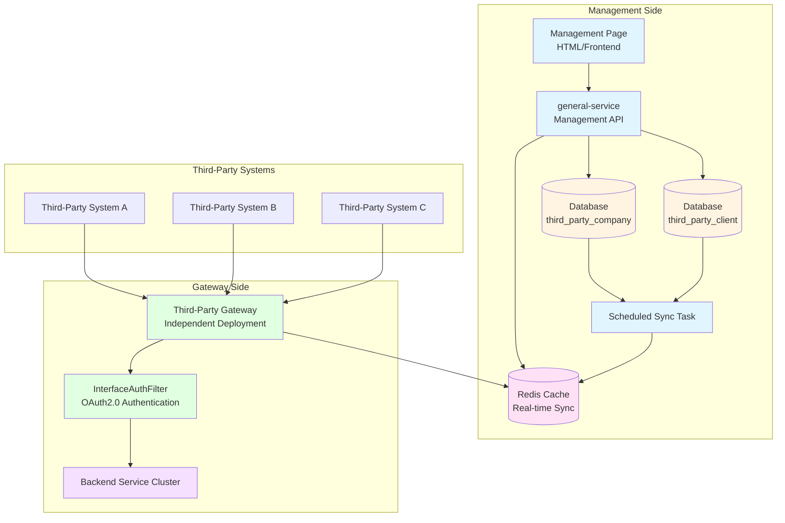
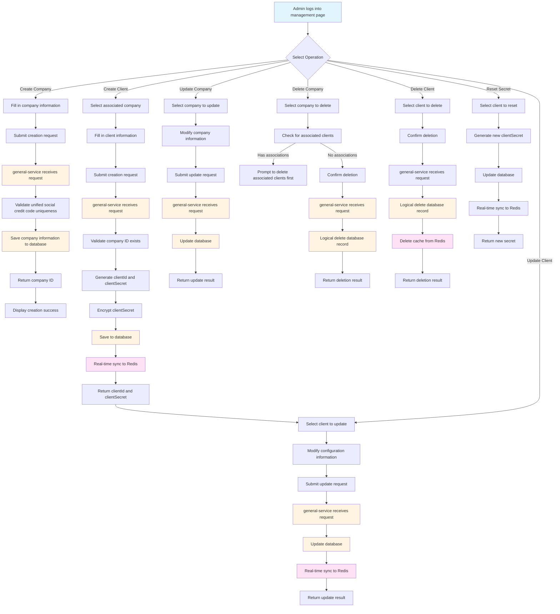
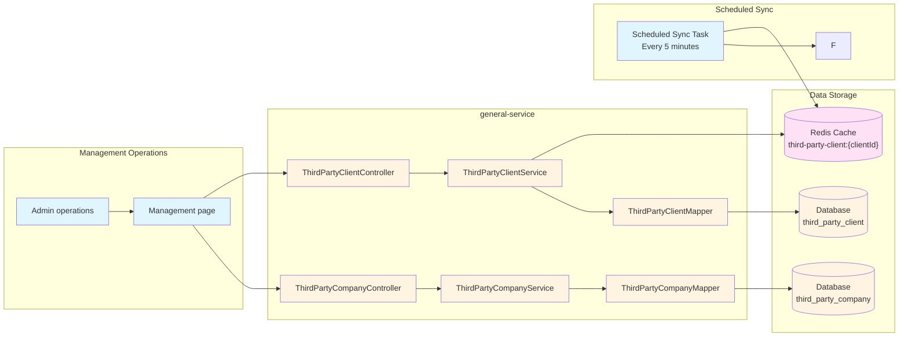
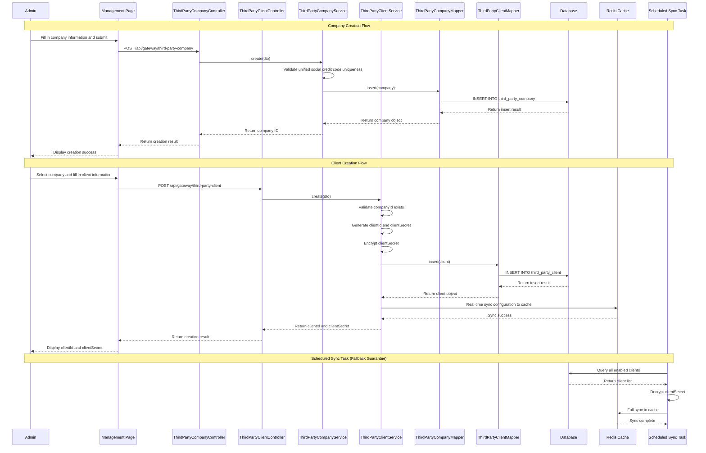
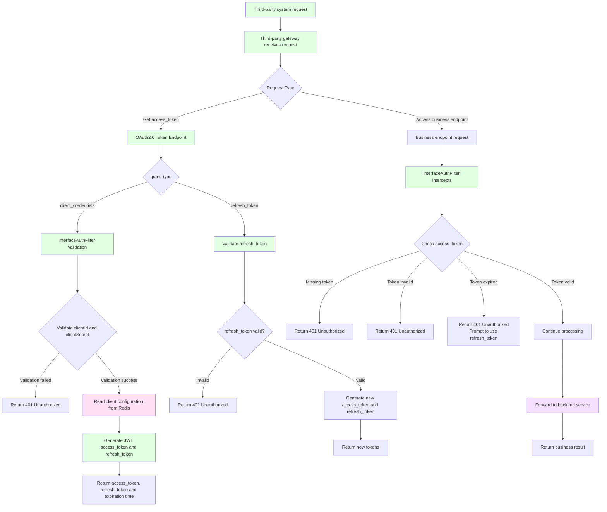
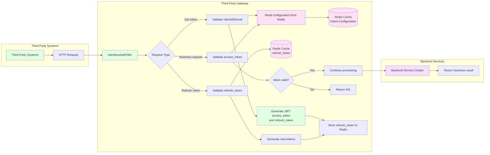
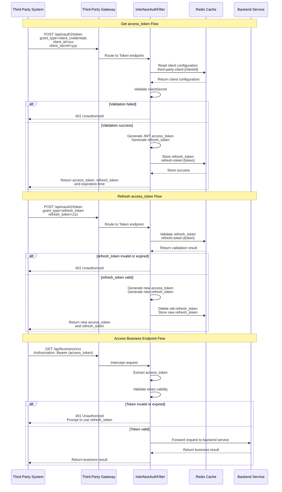
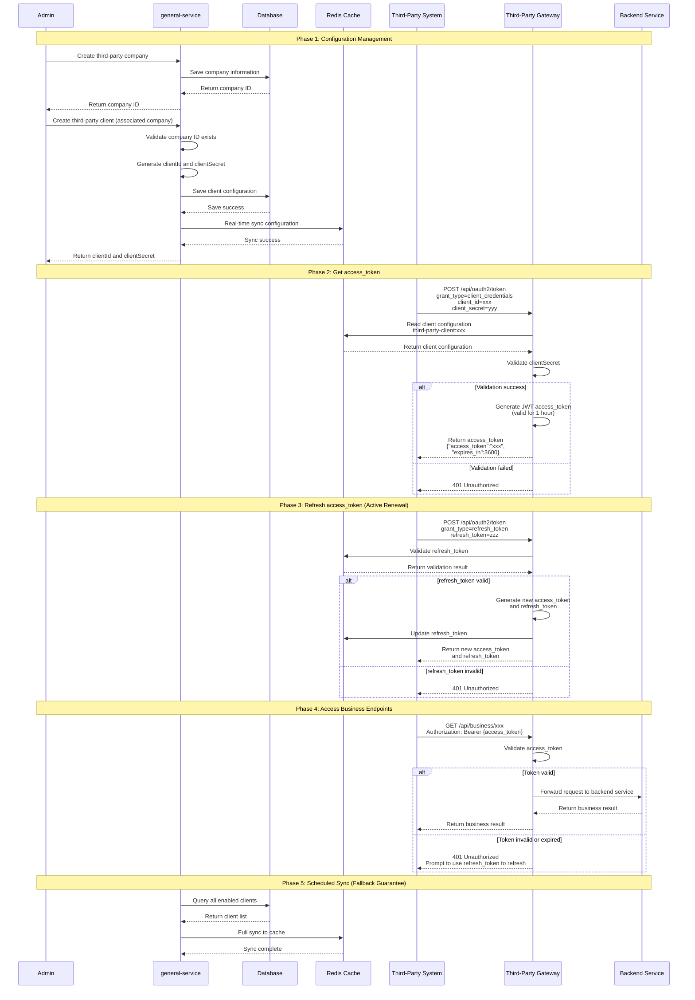
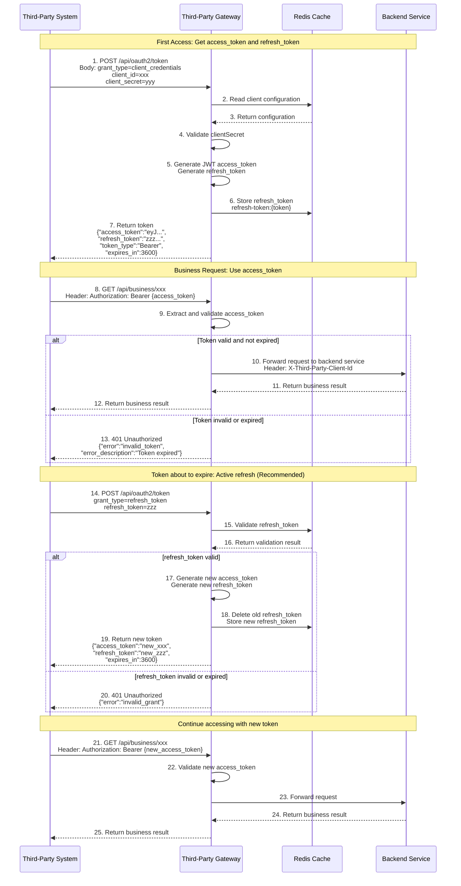

# Third-Party System OAuth2.0 Client Credentials Authentication Architecture Design Document

## 1. Overview

### 1.1 Background

This document describes the unified API access authentication mechanism provided for third-party systems, using the OAuth2.0 Client Credentials flow to achieve secure and efficient API access control.

### 1.2 Design Goals

- **Security**: Complete isolation between third-party systems and internal systems, with no mutual impact
- **Performance**: Gateway reads configuration from Redis cache only, zero database access
- **Maintainability**: Unified management of third-party client configuration through the management interface
- **Scalability**: Support for multi-third-party system integration with flexible configuration

### 1.3 Technology Selection

- **Authentication Protocol**: OAuth2.0 Client Credentials flow (RFC 6749)
- **Token Format**:
  - **access_token**: JWT (JSON Web Token, RFC 7519) format, valid for 1 hour
  - **refresh_token**: Random string format, stored in Redis, valid for 30 days
  - HMAC256 signature algorithm ensures access_token security
  - Consistent with internal system JWT token technology stack, reusing existing utility classes
- **Token Renewal Mechanism**: Standard OAuth2.0 refresh_token solution
  - Third-party systems actively call the refresh endpoint to obtain new tokens
  - Conforms to OAuth2.0 standard practices, allowing third-party systems to proactively control renewal timing
- **Configuration Management**: general-service + database + Redis cache
- **Database Version Management**: Liquibase
- **Deployment Solution**: Independent deployment of third-party gateway

---

## 2. Overall Architecture

### 2.1 System Architecture Diagram



### 2.2 Core Component Description

| Component | Responsibility | Technology Implementation |
|-----------|----------------|--------------------------|
| **Management Page** | Provides CRUD interface for third-party company and client configuration | HTML + JavaScript / Vue / React |
| **general-service** | Manages third-party company and client configuration, provides REST API | Spring Boot + MyBatis-Plus |
| **Database** | Persistently stores third-party company and client configuration | MySQL + Liquibase |
| **Redis Cache** | Stores client configuration for fast gateway access | Redis |
| **Scheduled Sync Task** | Periodically performs full sync from database to Redis (fallback guarantee) | Spring @Scheduled |
| **Third-Party Gateway** | Independently deployed gateway service handling third-party system requests | Spring Cloud Gateway |
| **InterfaceAuthFilter** | OAuth2.0 authentication filter validating access_token | Gateway Filter |

---

## 3. Management Side Solution

### 3.1 Business Flow



### 3.2 Data Flow Diagram



### 3.3 Management Side Sequence Diagram



---

## 4. Gateway Side Solution

### 4.1 Business Flow



### 4.2 Data Flow Diagram



### 4.3 Gateway Side Sequence Diagram



---

## 5. Third-Party System and Gateway Interaction Flow

### 5.1 Complete Interaction Swimlane Diagram



### 5.2 Third-Party System Interaction Sequence Diagram



---

## 6. Data Model Design

### 6.1 Database Table Structure

#### 6.1.1 Third-Party Company Information Table

**Table Name: `third_party_company`**

| Field Name | Type | Description | Constraint |
|-----------|------|-------------|------------|
| id | BIGINT | Primary key ID | PRIMARY KEY |
| company_name | VARCHAR(256) | Company name | NOT NULL |
| company_code | VARCHAR(64) | Unified social credit code | UNIQUE, NOT NULL |
| contact_name | VARCHAR(64) | Contact person name | |
| contact_email | VARCHAR(128) | Contact email | |
| contact_phone | VARCHAR(32) | Contact phone | |
| company_status | VARCHAR(32) | Company status | DEFAULT 'NORMAL' |
| create_id | VARCHAR(64) | Creator ID | |
| create_time | DATETIME | Create time | |
| update_id | VARCHAR(64) | Updater ID | |
| update_time | DATETIME | Update time | |
| deleted | TINYINT(1) | Delete flag | DEFAULT 0 |

**Indexes:**
- `idx_company_code` (company_code) - Unified social credit code unique index
- `idx_company_name` (company_name) - Company name index
- `idx_company_status` (company_status) - Company status index
- `idx_deleted` (deleted) - Delete flag index

**Notes:**
- One company can associate with multiple clients (client_id)
- Company information is relatively stable with low change frequency
- Must check for associated clients before deleting a company

#### 6.1.2 Third-Party Client Table

**Table Name: `third_party_client`**

| Field Name | Type | Description | Constraint |
|-----------|------|-------------|------------|
| id | BIGINT | Primary key ID | PRIMARY KEY |
| company_id | BIGINT | Associated company ID | FOREIGN KEY, NOT NULL |
| client_id | VARCHAR(64) | Client ID (appId) | UNIQUE, NOT NULL |
| client_secret | VARCHAR(256) | Client secret (encrypted storage) | NOT NULL |
| client_name | VARCHAR(128) | Client name | NOT NULL |
| description | VARCHAR(512) | Description | |
| scopes | VARCHAR(512) | Permission scopes (JSON array or comma-separated) | |
| enabled | TINYINT(1) | Whether enabled | DEFAULT 1 |
| ip_whitelist | TEXT | IP whitelist (JSON array) | |
| token_valid_duration | INT | Token validity duration (hours) | DEFAULT 24 |
| expiration_renewal_time | INT | Pre-expiration renewal time (minutes) | DEFAULT 60 |
| contact_name | VARCHAR(64) | Contact person name | |
| contact_email | VARCHAR(128) | Contact email | |
| contact_phone | VARCHAR(32) | Contact phone | |
| create_id | VARCHAR(64) | Creator ID | |
| create_time | DATETIME | Create time | |
| update_id | VARCHAR(64) | Updater ID | |
| update_time | DATETIME | Update time | |
| deleted | TINYINT(1) | Delete flag | DEFAULT 0 |

**Indexes:**
- `idx_company_id` (company_id) - Company ID index (foreign key)
- `idx_client_id` (client_id) - Client ID unique index
- `idx_enabled` (enabled) - Enabled status index
- `idx_deleted` (deleted) - Delete flag index

**Foreign Key Constraints:**
- `fk_client_company` (company_id) REFERENCES `third_party_company`(id)

**Notes:**
- Each client must associate with one company
- One company can have multiple clients
- Must delete or transfer all associated clients before deleting a company

### 6.2 Redis Cache Structure

#### 6.2.1 Client Configuration Cache

**Key Format:** `third-party-client:{clientId}`

**Value Structure (Hash):**
```
third-party-client:client-001
  ├── clientId: "client-001"
  ├── clientSecret: "plain_secret_xxx"  (plain text, for validation)
  ├── clientName: "Third-Party System A"
  ├── scopes: "read,write"
  ├── enabled: "true"
  ├── ipWhitelist: "[\"192.168.1.1\", \"10.0.0.0/8\"]"
  ├── tokenValidDuration: "1"  (hours)
  └── refreshTokenValidDuration: "720"  (hours, 30 days)
```

#### 6.2.2 Refresh Token Cache

**Key Format:** `refresh-token:{token_value}`

**Value Structure (Hash):**
```
refresh-token:abc123def456...
  ├── clientId: "client-001"
  ├── scopes: "read,write"
  ├── issuedAt: "1234567890"
  ├── expiresAt: "1237246290"  (30 days later)
  └── enabled: "true"
```

**TTL Settings:** Consistent with refresh_token validity period (e.g., 30 days), Redis auto-cleanup on expiration

### 6.3 JWT Token Structure

#### 6.3.1 Token Format Description

The `access_token` issued by the OAuth2.0 Client Credentials flow uses **JWT (JSON Web Token)** format. Although the OAuth2.0 specification (RFC 6749) does not mandate that access_token must be JWT format, using JWT format provides the following advantages:

- **Self-contained**: Token itself contains client information (client_id, scopes, etc.), no database query needed for validation
- **Stateless**: Gateway does not need to store token state, supports horizontal scaling and high concurrency
- **Verifiable**: HMAC256 signature algorithm verifies token integrity and authenticity
- **Parsable**: Client information and permission scopes can be extracted directly from the token
- **Technology Unification**: Consistent with internal system JWT token technology stack, reusing existing `JwtUtils` utility class

#### 6.3.2 JWT Structure Definition

**Header:**
```json
{
  "alg": "HS256",    // Signature algorithm: HMAC SHA256
  "typ": "JWT"       // Token type: JSON Web Token
}
```

**Payload:**
```json
{
  "client_id": "client-001",              // Client ID (required)
  "scopes": ["read", "write"],            // Permission scopes (required)
  "iat": 1234567890,                      // Issued At
  "exp": 1234654290,                      // Expiration Time
  "jti": "550e8400-e29b-41d4-a716-446655440000",  // JWT ID (for replay prevention)
  "iss": "Richie Gateway",                // Issuer
  "sub": "client_credentials",            // Subject, identifies OAuth2.0 flow
  "aud": "api.rydeen.com"                 // Audience, API service address
}
```

#### 6.3.5 Refresh Token Description

**Refresh Token Characteristics:**
- **Format**: Random string (not JWT), stored in Redis
- **Validity**: Usually longer than access_token (e.g., 30 days)
- **Purpose**: Used to obtain new access_token without re-providing client_secret
- **Storage Location**: Redis, Key format: `refresh-token:{token_value}`
- **Security Requirement**: refresh_token must be securely stored and not leaked

**Refresh Token Storage Structure (Redis):**
```
refresh-token:abc123def456...
  ├── clientId: "client-001"
  ├── scopes: "read,write"
  ├── issuedAt: 1234567890
  ├── expiresAt: 1237246290  (30 days later)
  └── enabled: "true"
```

**Signature:**
```
HMACSHA256(
  base64UrlEncode(header) + "." +
  base64UrlEncode(payload),
  secret
)
```

#### 6.3.3 Differences from Internal System JWT

| Feature | Internal System JWT | Third-Party System JWT |
|---------|---------------------|------------------------|
| **User Identifier** | `username` | `client_id` |
| **Tenant Information** | `tenantCode` (optional) | None |
| **Permission Scope** | User role permissions | `scopes` (OAuth2.0 standard) |
| **Signing Key** | Internal system dedicated key | Third-party system dedicated key |
| **Subject** | `"Interactive token"` | `"client_credentials"` |
| **Audience** | Username | API service address |
| **Purpose** | User login authentication | OAuth2.0 Client Credentials authentication |

#### 6.3.4 Token Generation Example

```java
// Generate JWT access_token for third-party systems
public static String generateThirdPartyAccessToken(
    String clientId, 
    List<String> scopes, 
    String secret, 
    long expiredTime) {
    
    var algorithm = Algorithm.HMAC256(secret);
    var builder = JWT.create()
            .withClaim("client_id", clientId)
            .withClaim("scopes", scopes)
            .withIssuedAt(new Date())
            .withExpiresAt(new Date(expiredTime))
            .withJWTId(UUID.randomUUID().toString())
            .withIssuer("Richie Gateway")
            .withSubject("client_credentials")
            .withAudience("api.rydeen.com");
    
    return builder.sign(algorithm);
}

// Generate refresh_token (random string)
public static String generateRefreshToken() {
    return UUID.randomUUID().toString().replace("-", "") + 
           SecureRandom.getInstanceStrong().nextLong();
}
```

---

## 7. Security Design

### 7.1 Key Management

- **Database Storage**: `clientSecret` is encrypted (using platform encryption utility)
- **Redis Cache**: Stores plaintext `clientSecret` (only for fast validation)
- **Transport Security**: All endpoints use HTTPS

### 7.2 Access Control

- **IP Whitelist**: Supports configurable IP whitelist (optional)
- **Permission Scope**: Access control through `scopes`
- **Enable/Disable**: Supports dynamic enable/disable of clients

### 7.3 Token Security

#### 7.3.1 JWT Token Security Features

- **Signature Verification**: Uses HMAC256 algorithm to sign tokens ensuring tokens are not tampered with
- **Validity Period Control**: access_token default 1 hour validity, controlled through `exp` field
- **Replay Attack Prevention**: Each token uniquely identified through `jti` (JWT ID) field, supports blacklist mechanism
- **Key Isolation**: Third-party systems use independent signing key, separated from internal system JWT key
- **Token Blacklist**: Supports adding tokens to blacklist (optional), used for proactive token revocation

#### 7.3.2 Refresh Token Security Features

- **Independent Storage**: refresh_token stored in Redis, separated from access_token
- **Longer Validity**: refresh_token validity is usually 30 days, longer than access_token
- **One-time Use**: Each use of refresh_token to obtain new token invalidates the old refresh_token
- **Client Binding**: refresh_token bound to client_id, preventing cross-client usage
- **Scope Preservation**: New access_token obtained using refresh_token preserves original scopes
- **Proactive Revocation**: Supports adding refresh_token to blacklist for immediate invalidation
- **Concurrent Refresh Protection**: Uses Redis distributed lock + Lua script atomic operations to prevent security issues from concurrent refresh
  - Issue: If third-party system concurrently calls refresh endpoint, multiple requests may simultaneously pass validation and generate multiple new refresh_tokens
  - Solution: Uses distributed lock to ensure same refresh_token can only be processed by one request, uses Lua script to ensure atomic validation and deletion

#### 7.3.3 Token Validation Flow

**Access Token Validation Flow:**
1. **Extract Token**: Extract from request header `Authorization: Bearer {access_token}`
2. **Verify Signature**: Use third-party system dedicated key to verify token signature
3. **Verify Validity Period**: Check `exp` field ensuring token is not expired
4. **Verify Client**: Extract `client_id` from token, verify client is enabled
5. **Verify Permissions**: Check `scopes` field, verify client has permission to access the resource
6. **Blacklist Check**: Check if token is in blacklist (optional)

**Refresh Token Validation Flow (with Concurrent Protection):**
1. **Acquire Distributed Lock**: Use `refresh-token-lock:{token}` as lock key to prevent concurrent refresh
2. **Extract Token**: Extract from request parameter `refresh_token`
3. **Atomic Validation and Deletion**: Use Lua script to atomically validate refresh_token existence and delete from Redis
4. **Verify Client**: Verify refresh_token bound client_id matches
5. **Verify Enabled Status**: Check if refresh_token is disabled or revoked
6. **Generate New Token**: After validation passes, generate new access_token and refresh_token
7. **Update Storage**: Store new refresh_token
8. **Release Lock**: Release distributed lock

**Concurrent Refresh Protection Implementation Example:**
```java
public TokenResponse refreshToken(String refreshToken) {
    String lockKey = "refresh-token-lock:" + refreshToken;
    
    // 1. Acquire distributed lock (prevent concurrent refresh)
    if (!GlobalCache.pessimisticLockWithRenewal(lockKey, 5, TimeUnit.SECONDS)) {
        throw new BusinessException("Refresh token is being processed, please retry later");
    }
    
    try {
        // 2. Atomic validation and deletion (using Lua script)
        String luaScript = 
            "if redis.call('exists', KEYS[1]) == 1 then " +
            "  local data = redis.call('hgetall', KEYS[1]); " +
            "  redis.call('del', KEYS[1]); " +
            "  return data; " +
            "else " +
            "  return nil; " +
            "end";
        
        // 3. Execute atomic operation
        Map<String, String> tokenData = executeLuaScript(luaScript, refreshTokenKey);
        
        if (tokenData == null) {
            throw new BusinessException("invalid_grant", "Refresh token is invalid or has been used");
        }
        
        // 4. Generate new token
        return generateNewTokens(tokenData);
    } finally {
        // 5. Release lock
        GlobalCache.releaseLock(lockKey);
    }
}
```

#### 7.3.4 Error Information Leakage Prevention

**Problem Description:**
- Error responses may leak sensitive information (e.g., whether client_id exists)
- Attackers may enumerate valid client_ids through error messages

**Solution:**
- **Unified Error Response Format**: Conforms to OAuth2.0 standard (RFC 6749)
- **Don't Distinguish Error Types**: client_id not exists and client_secret incorrect both return `invalid_client`
- **Standard Error Codes**:
  - `invalid_request`: Missing or malformed request parameters
  - `invalid_client`: Client authentication failed (not distinguishing client_id or secret)
  - `invalid_grant`: Authorization code, refresh_token, etc. is invalid
  - `unauthorized_client`: Client is not authorized to use this authorization type
  - `unsupported_grant_type`: Unsupported grant_type
  - `invalid_scope`: Requested scope is invalid
  - `invalid_token`: Access token is invalid or expired
  - `rate_limit_exceeded`: Too many requests

**Standard Error Response Format:**
```json
{
  "error": "invalid_client",
  "error_description": "Client authentication failed",
  "error_uri": "https://docs.rydeen.com/oauth2/errors#invalid_client"
}
```

#### 7.3.5 Token Revocation Mechanism

**Revocation Endpoint:**
```java
@PostMapping("/api/oauth2/revoke")
public ResultVO<Void> revokeToken(@RequestParam String token) {
    // 1. Verify token type (access_token or refresh_token)
    // 2. Add token to blacklist
    // 3. If refresh_token, delete from Redis
    // 4. Record revocation log
}
```

**Revocation Scenarios:**
- Third-party system proactively revokes leaked token
- Admin forcibly revokes tokens for a client
- After client secret reset, automatically revoke all related tokens

#### 7.3.6 Key Rotation Mechanism

**Configuration Example:**
```yaml
platform:
  gateway:
    interface-auth:
      token-secret: "current-secret"
      token-secret-rotation:
        enabled: true
        rotation-interval-days: 90  # Rotate every 90 days
        previous-secrets:           # Keep old keys for validation (multi-version support)
          - "previous-secret-1"
          - "previous-secret-2"
```

**Rotation Strategy:**
- Regularly rotate signing keys (recommended every 90 days)
- Keep old keys for validating already-issued tokens (multi-version key support)
- New tokens are signed with new key
- Old tokens can still be validated with old key before expiration

#### 7.3.7 Security Best Practices

- **HTTPS Transport**: All token transmission must use HTTPS to prevent man-in-the-middle attacks
- **Key Management**: Regularly rotate signing keys, use strong random keys
- **Token Storage**:
  - access_token: Client memory storage, clear immediately after use
  - refresh_token: Client secure storage (encrypted storage or secure key vault)
- **Principle of Least Privilege**: Assign minimum necessary `scopes` permissions to each client
- **Token Rotation**: After each use of refresh_token, the old refresh_token is immediately invalidated
- **Monitoring and Alerting**: Monitor abnormal token usage (e.g., frequent refresh, abnormal IPs) and alert timely
- **Regular Refresh**: Recommend third-party systems proactively refresh before access_token expires to avoid business interruption
- **Error Information Protection**: Unified error response format, do not leak sensitive information
- **Concurrent Protection**: Use distributed locks and atomic operations to prevent concurrent refresh issues

---

## 8. Performance Optimization and Rate Limiting

### 8.1 Rate Limiting Mechanism

**Problem Description:**
- Token endpoint lacks rate limiting protection, which may lead to brute force attacks or resource exhaustion

**Rate Limiting Strategy:**
- **Token Endpoint (by client_id)**: 10 times/minute
- **Token Endpoint (by IP)**: 30 times/minute (unauthenticated requests)
- **Refresh Token Endpoint**: 5 times/minute (prevent frequent refresh)
- **Business Endpoints**: QPS limit based on client configuration

**Implementation Example:**
```java
@Component
public class InterfaceAuthFilter extends AbstractBaseFilter {
    
    @Override
    public Mono<Void> doFilter(ServerWebExchange exchange, GatewayFilterChain chain) {
        String path = exchange.getRequest().getURI().getPath();
        
        // Token endpoint rate limiting
        if (path.equals("/api/oauth2/token")) {
            String clientId = extractClientId(exchange);
            String ip = getClientIp(exchange);
            
            // Rate limit by client_id: max 10 times per minute
            String limitKey = "token-limit:client:" + clientId;
            if (!GlobalCache.tryAcquire(limitKey, 10, 60)) {
                return NetworkUtils.returnError(
                    exchange.getResponse(), 
                    HttpStatus.TOO_MANY_REQUESTS,
                    OAuth2ErrorResponse.rateLimitExceeded()
                );
            }
            
            // Rate limit by IP: max 30 times per minute (prevent unauthenticated brute force)
            String ipLimitKey = "token-limit:ip:" + ip;
            if (!GlobalCache.tryAcquire(ipLimitKey, 30, 60)) {
                return NetworkUtils.returnError(
                    exchange.getResponse(), 
                    HttpStatus.TOO_MANY_REQUESTS,
                    OAuth2ErrorResponse.rateLimitExceeded()
                );
            }
        }
        
        return chain.filter(exchange);
    }
}
```

### 8.2 Cache Pre-warming and Degradation

**Cache Pre-warming:**
```java
@PostConstruct
public void warmupCache() {
    // Load all enabled client configurations from database to Redis
    // Ensure cache is ready after service startup
}
```

**Cache Degradation Strategy:**
- **Priority Read from Redis**: Read client configuration from Redis under normal conditions
- **Degrade to Database**: Temporarily read from database when Redis is unavailable (emergency only)
- **Record Alerts**: Record alert logs during degradation for operations staff to handle promptly

**Implementation Example:**
```java
public ThirdPartyClientConfig getClientConfig(String clientId) {
    // Priority read from Redis
    ThirdPartyClientConfig config = getFromRedis(clientId);
    if (config != null) {
        return config;
    }
    
    // Degrade to database when Redis is unavailable (record alert)
    if (isRedisDown()) {
        log.warn("Redis unavailable, degrading to database read: clientId={}", clientId);
        return getFromDatabase(clientId);
    }
    
    return null;
}
```

### 8.3 Refresh Token Batch Cleanup

**Problem Description:**
- Expired refresh_tokens rely on Redis TTL automatic cleanup
- If a large number of refresh_tokens expire, they may occupy Redis memory

**Solution:**
```java
// Scheduled task: Clean up expired refresh_tokens
@Scheduled(cron = "0 0 2 * * ?")  // Execute at 2 AM daily
public void cleanupExpiredRefreshTokens() {
    // Scan all refresh-token:* keys
    // Check expiration time, delete expired tokens
    // Record cleanup count
}
```

---

## 9. Deployment Solution

### 8.1 Deployment Architecture

```
┌─────────────────────────────────────────────────────────┐
│  Management Side (general-service)                      │
│  - Management API (REST API)                             │
│  - Management Page (HTML/Frontend)                       │
│  - Scheduled Sync Task                                   │
│  - Database Connection (MySQL)                            │
│  - Redis Connection (Write)                              │
└─────────────────────────────────────────────────────────┘

┌─────────────────────────────────────────────────────────┐
│  Third-Party Gateway (Independent Deployment)            │
│  - InterfaceAuthFilter (OAuth2.0 Authentication)          │
│  - Route Forwarding                                      │
│  - Redis Connection (Read-only)                          │
│  - No Database Connection                                 │
└─────────────────────────────────────────────────────────┘

┌─────────────────────────────────────────────────────────┐
│  Backend Service Cluster                                  │
│  - Business Service A                                    │
│  - Business Service B                                    │
│  - Business Service C                                    │
└─────────────────────────────────────────────────────────┘
```

### 8.2 Configuration Isolation

- **Third-Party Gateway**: Independent configuration file, does not contain internal system related configuration
- **Filter Enable**: Third-party gateway only enables necessary filters
- **Performance Isolation**: Third-party system access does not affect internal system performance

---

## 10. Monitoring and Operations

### 10.1 Key Metrics Monitoring

**Core Metrics:**
- **Token Issuance Volume**: Number of access_tokens issued per minute
- **Token Refresh Volume**: Number of refresh_tokens refreshed per minute
- **Authentication Failure Rate**: Proportion of failed authentication requests (classified by error type)
- **Cache Hit Rate**: Redis cache hit rate
- **Sync Task Execution**: Scheduled sync task execution status
- **Rate Limit Trigger Count**: Number of times rate limiting mechanism is triggered
- **Abnormal IP Access Statistics**: Access frequency and failure count of abnormal IPs
- **Client Activity Statistics**: Token usage frequency of each client

**Metrics Collection Implementation:**
```java
@Component
public class OAuth2Metrics {
    
    // Token issuance counter
    private final Counter tokenIssuedCounter;
    
    // Token refresh counter
    private final Counter tokenRefreshedCounter;
    
    // Authentication failure counter (by error type)
    private final Counter authFailureCounter;
    
    // Rate limit trigger counter
    private final Counter rateLimitCounter;
    
    public void recordTokenIssued(String clientId) {
        tokenIssuedCounter.increment("client_id", clientId);
    }
    
    public void recordAuthFailure(String clientId, String errorType) {
        authFailureCounter.increment("client_id", clientId, "error", errorType);
    }
}
```

### 10.2 Alert Rules

**Alert Threshold Recommendations:**
- **Authentication failure rate > 10%**: Possible attack or configuration error
- **Same IP authentication failures > 50 times/hour**: Possible brute force attack
- **Refresh Token refresh failure rate > 5%**: Possible token leakage
- **Token issuance volume abnormal growth > 200%**: Possible abnormal access
- **Redis cache hit rate < 90%**: Cache may have issues
- **Sync task failure**: Data sync exception, requires immediate handling

### 10.3 Health Check Endpoint

**Health Check Endpoint:**
```java
@GetMapping("/api/oauth2/health")
public ResultVO<Map<String, Object>> health() {
    Map<String, Object> health = new HashMap<>();
    health.put("status", "UP");
    health.put("redis", checkRedisHealth());
    health.put("cache", checkCacheHealth());
    health.put("timestamp", System.currentTimeMillis());
    return ResultVO.success(health);
}
```

**Health Check Items:**
- Redis connection status
- Cache availability
- Sync task status
- Overall service status

### 10.4 Logging

**Log Classification:**
- **Management Operation Logs**: Record all CRUD operations for client configuration (including operator, operation time, operation content)
- **Authentication Logs**: Record token issuance and validation process (including client_id, IP, time, result)
- **Exception Logs**: Record authentication failures, sync failures and other exceptions (including error type, error details)
- **Audit Logs**: Record all security-related operations (including token revocation, secret reset, etc.)

**Audit Log Implementation:**
```java
@Aspect
public class OAuth2AuditAspect {
    
    @Around("@annotation(OAuth2Operation)")
    public Object audit(ProceedingJoinPoint joinPoint) {
        String operation = getOperation(joinPoint);
        String clientId = extractClientId(joinPoint);
        String ip = getClientIp(joinPoint);
        
        try {
            Object result = joinPoint.proceed();
            // Record success log
            auditLogService.logSuccess(operation, clientId, ip);
            return result;
        } catch (Exception e) {
            // Record failure log (including error type)
            auditLogService.logFailure(operation, clientId, ip, e);
            throw e;
        }
    }
}
```

---

## 11. Configuration Management Optimization

### 11.1 Client Configuration Versioning

**Problem Description:**
- After client configuration changes, rollback is not possible
- Missing configuration change history

**Solution:**
```sql
-- Add configuration version table
CREATE TABLE third_party_client_history (
    id BIGINT PRIMARY KEY,
    client_id VARCHAR(64) NOT NULL,
    config_snapshot TEXT,  -- Configuration snapshot in JSON format
    change_type VARCHAR(32),  -- CREATE/UPDATE/DELETE
    change_reason VARCHAR(512),
    operator_id VARCHAR(64),
    change_time DATETIME,
    INDEX idx_client_id (client_id),
    INDEX idx_change_time (change_time)
);
```

**Feature Capabilities:**
- Record complete snapshot of each configuration change
- Support configuration rollback
- Provide configuration change history query
- Record change reason and operator

### 11.2 Configuration Templates and Batch Operations (Optional)

**Configuration Template:**
```java
@Data
public class ClientConfigTemplate {
    private String templateName;
    private String scopes;
    private Integer tokenValidDuration;
    private Integer refreshTokenValidDuration;
    // ...
}
```

**Batch Create:**
```java
@PostMapping("/api/gateway/third-party-client/batch")
public ResultVO<List<Long>> batchCreate(@RequestBody List<ThirdPartyClientDTO> clients) {
    // Batch create clients
}
```

---

## 12. Implementation Plan

### 12.1 Development Phase

1. **Phase 1: Database and Model**
   - Create Liquibase changelog (company table, client table)
   - Create entity classes (ThirdPartyCompany, ThirdPartyClient)
   - Create DTO, VO classes
   - Create Mapper interfaces

2. **Phase 2: Management Functionality**
   - **Company Information Management**
     - Implement ThirdPartyCompanyService business logic
     - Implement ThirdPartyCompanyController REST API
     - Implement company information CRUD functionality
   - **Client Management**
     - Implement ThirdPartyClientService business logic (add company association validation)
     - Implement ThirdPartyClientController REST API
     - Implement client information CRUD functionality
   - **Management Page (Frontend)**
     - Implement company information management page
     - Implement client management page (support selecting associated company)

3. **Phase 3: Gateway Functionality**
   - Refactor InterfaceAuthFilter
   - Implement OAuth2.0 Token endpoint
   - Implement access_token validation and renewal

4. **Phase 4: Sync Mechanism**
   - Implement real-time sync logic
   - Implement scheduled sync task
   - Test data consistency

### 12.2 Testing Phase

- **Unit Tests**: Service, Filter and other core logic
- **Integration Tests**: End-to-end flow testing
- **Performance Tests**: Gateway performance, cache performance
- **Security Tests**: Authentication security, data security

### 12.3 Launch Phase

- **Gradual Release**: Launch management function first, then launch gateway function
- **Monitoring and Alerting**: Configure key metrics monitoring and alerting
- **Documentation Delivery**: API documentation, user manual

---

### 12.4 Improvement Priority

**Red - High Priority (Must Implement):**
1. Refresh Token concurrent refresh issue (use distributed lock + atomic operation)
2. Error information leakage risk (unified error response format)
3. Rate limiting mechanism (prevent brute force and resource exhaustion)
4. OAuth2.0 standard error response (conform to RFC 6749)
5. Key metrics monitoring and alerting

**Yellow - Medium Priority (Recommended to Implement):**
1. Refresh Token revocation mechanism
2. Key rotation mechanism
3. Cache degradation strategy
4. Error logging and audit
5. Configuration version management
6. Health check endpoint

**Green - Low Priority (Optional to Implement):**
1. Refresh Token batch cleanup
2. Configuration templates and batch operations
3. Token usage statistics
4. Multi-environment support

---

## 13. Appendix

### 13.1 Reference Documentation

- [OAuth2.0 RFC 6749](https://tools.ietf.org/html/rfc6749)
- [JWT RFC 7519](https://tools.ietf.org/html/rfc7519)
- [Liquibase Official Documentation](https://docs.liquibase.com/)

### 13.2 Glossary

| Term | Description |
|------|-------------|
| **company_id** | Company ID, associated with third-party company information table |
| **company_code** | Unified social credit code, uniquely identifies third-party company |
| **client_id** | Client identifier, uniquely identifies third-party system |
| **client_secret** | Client secret, used to verify client identity |
| **access_token** | Access token, used to access protected resources (JWT format, short validity like 1 hour) |
| **refresh_token** | Refresh token, used to obtain new access_token (random string format, long validity like 30 days) |
| **scopes** | Permission scopes, defines resources the client can access |
| **JWT** | JSON Web Token, a compact, URL-safe token format |
| **grant_type** | Authorization type, specifies how to obtain token in OAuth2.0 (e.g., client_credentials, refresh_token) |

---

**Document Version:** v1.0  
**Creation Date:** 2025-01-XX  
**Author:** richie696