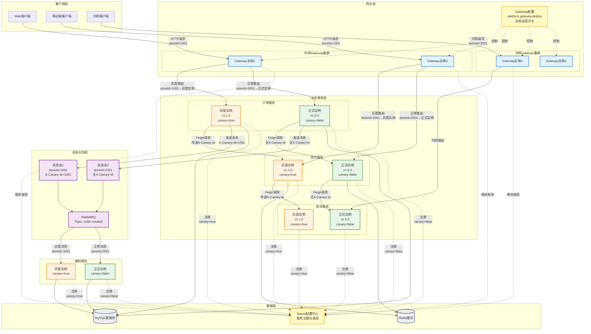
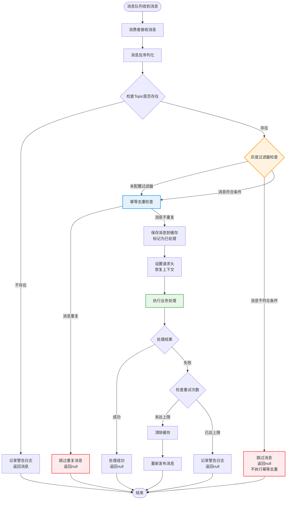
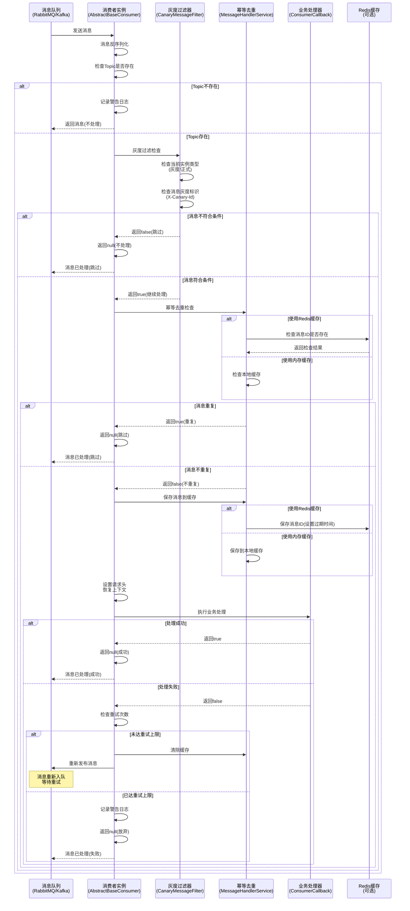

# 灰度发布最佳实践：按门店维度（storeId）路由

> **作者：** 王锦阳
> **日期：** 2025-12-09

------

[TOC]

------

**全局总控开关：** Gateway 配置（`platform.gateway.deploy`）统一控制所有服务的灰度发布，包括 HTTP 请求、消息队列、服务间调用。

> **💡 提示：** 如果您的项目存在多版本架构并存、无法统一升级到 `4.6.0` 架构版本的情况，可以考虑使用 [基于K8s-Ingress的灰度发布方案（折中方案）](./基于K8s-Ingress的灰度发布方案.md)，该方案无需修改业务代码，通过基础设施层实现灰度路由。

## 📊 完整灰度架构图



### 架构说明

**1. 客户端层 → 网关层**
- 客户端发起 HTTP 请求，携带 `storeId`（门店ID）
- 外网客户端 → 外网 Gateway
- 内网客户端 → 内网 Gateway

**2. 网关层 → 业务服务层**
- Gateway 自动提取 `storeId`，设置 `X-Canary-Id` 请求头
- Gateway 根据 `X-Canary-Id` 和 Nacos 元数据路由：
  - 灰度门店（storeId=1001）→ 灰度实例（canary=true）
  - 正常门店（storeId=2001）→ 正式实例（canary=false）

**3. 服务间调用（Feign）**
- 灰度实例调用时，自动传递 `X-Canary-Id` 请求头
- 被调用服务根据请求头路由到对应实例

**4. 消息队列（MQ）**
- 生产端：自动从 `HeaderContextHolder` 获取 `X-Canary-Id`，设置到消息头
- 消费端：`CanaryMessageFilter` 根据消息头判断：
  - 灰度消息（X-Canary-Id 在灰度列表中）→ 灰度实例处理
  - 正常消息（X-Canary-Id 不在灰度列表中）→ 正式实例处理

**5. 服务注册（Nacos）**
- 所有服务实例注册到 Nacos
- 通过元数据（canary、canary-category）区分灰度/正式实例
- Gateway 从 Nacos 获取服务列表，根据元数据路由

**6. 全局总控**
- Gateway 配置（`platform.gateway.deploy`）统一控制所有服务的灰度
- 一个配置控制 HTTP、MQ、Feign 的灰度发布

## 一、方案选择建议

### ✅ 推荐方案：Gateway 层实现

**理由：**
1. **已具备能力**：Gateway 已实现金丝雀发布，支持按 ID 维度路由
2. **统一管理**：内外网流量统一在 Gateway 控制，便于监控和运维
3. **灵活配置**：通过配置中心（Nacos）动态调整灰度规则，秒级生效
4. **业务语义清晰**：可直接基于业务参数（storeId）进行路由，无需转换
5. **回滚快速**：配置修改即可回滚，无需重新部署 K8s 资源

### ⚠️ K8s 方案适用场景

K8s 方案适合以下场景：
- 需要基于流量百分比进行灰度（如 10% 流量走新版本）
- 需要基于请求头、路径等复杂条件组合路由
- 已使用 Service Mesh（如 Istio）进行流量管理
- 需要基础设施层统一管理，不依赖应用代码

**但考虑到：**
- 内外网流量都走 Gateway，统一在 Gateway 控制更合理
- 按门店维度是精确匹配，Gateway 的 ID 列表方式更直观
- 已有 Gateway 实现，无需额外开发

## 二、内外网 Gateway 部署建议

### ✅ 强烈推荐：内外网 Gateway 分开部署

虽然内外网流量都走 Gateway，但**强烈建议将内外网 Gateway 分开部署**，使用独立的 Gateway 实例集群。

### 2.1 分开部署的核心优点

#### 1. **安全隔离** 🔒
- **物理/逻辑隔离**：内外网 Gateway 完全独立，降低安全风险
- **攻击面隔离**：外网 Gateway 暴露在公网，更容易受到攻击；内网 Gateway 仅在内网环境，攻击面更小
- **权限隔离**：内外网可以配置不同的安全策略、IP 白名单、访问控制规则
- **数据隔离**：即使外网 Gateway 被攻破，内网 Gateway 仍可正常运行

#### 2. **独立扩缩容** 📈
- **流量特征不同**：
  - 外网流量：波动大，受业务活动、营销活动影响明显
  - 内网流量：相对稳定，主要是内部系统调用
- **资源优化**：根据各自流量特征独立调整实例数量和资源配置
- **成本控制**：避免为应对外网流量峰值而过度配置内网资源

#### 3. **独立配置管理** ⚙️
- **安全策略差异**：
  - 外网 Gateway：需要更严格的限流、防刷、WAF 规则
  - 内网 Gateway：可以放宽部分限制，但需要更严格的内部权限控制
- **灰度策略差异**：
  - 外网 Gateway：灰度发布需要更谨慎，影响范围大
  - 内网 Gateway：可以更灵活地进行灰度测试
- **监控告警差异**：内外网可以设置不同的监控指标和告警阈值

#### 4. **故障隔离** 🛡️
- **故障不扩散**：外网 Gateway 故障不影响内网系统调用，内网 Gateway 故障不影响外网用户访问
- **独立运维**：可以分别进行维护、升级、重启，互不影响
- **快速恢复**：故障时只需恢复对应的 Gateway 集群，恢复时间更短

#### 5. **性能优化** ⚡
- **网络优化**：
  - 外网 Gateway：优化公网访问路径，考虑 CDN、多地域部署
  - 内网 Gateway：优化内网通信，减少网络跳数
- **缓存策略**：内外网可以配置不同的缓存策略和 TTL
- **连接池优化**：根据内外网调用特点，分别优化连接池参数

#### 6. **合规与审计** 📋
- **访问日志分离**：内外网访问日志分开存储，便于审计和合规检查
- **权限审计**：可以分别审计内外网的访问权限和操作记录
- **数据合规**：满足不同场景下的数据合规要求

### 2.2 部署架构建议

```
┌─────────────────────────────────────────┐
│           外网 Gateway 集群              │
│  ┌──────────┐  ┌──────────┐  ┌────────┐│
│  │ Gateway 1│  │ Gateway 2│  │Gateway N││
│  └──────────┘  └──────────┘  └────────┘│
│        处理外网请求（ToB/ToC）           │
└─────────────────────────────────────────┘
              ↓
        ┌─────────┐
        │业务服务 │
        └─────────┘
              ↑
┌─────────────────────────────────────────┐
│           内网 Gateway 集群              │
│  ┌──────────┐  ┌──────────┐  ┌────────┐│
│  │ Gateway 1│  │ Gateway 2│  │Gateway N││
│  └──────────┘  └──────────┘  └────────┘│
│        处理内网请求（ECS内网）            │
└─────────────────────────────────────────┘
```

### 2.3 配置示例

**外网 Gateway 配置：**
```yaml
platform:
  gateway:
    # 外网 Gateway 特定配置
    security:
      # 更严格的限流规则
      rate-limit: 1000
      # WAF 规则
      waf-enabled: true
    deploy:
      # 外网灰度发布更谨慎
      enable: true
      canary-category: ID
      id-list: []  # 初始为空，逐步添加
```

**内网 Gateway 配置：**
```yaml
platform:
  gateway:
    # 内网 Gateway 特定配置
    security:
      # 内网可以放宽限流
      rate-limit: 10000
      # 内网不需要 WAF
      waf-enabled: false
    deploy:
      # 内网灰度发布可以更灵活
      enable: true
      canary-category: ID
      id-list:
        - '1001'  # 内网测试门店
        - '1002'
```

### 2.4 注意事项

1. **服务注册区分**：确保内外网 Gateway 注册到不同的服务发现命名空间或使用不同的服务名
2. **配置中心隔离**：内外网 Gateway 使用不同的配置分组，避免配置冲突
3. **监控告警分离**：为内外网 Gateway 分别设置监控大盘和告警规则
4. **灰度规则独立**：内外网可以有不同的灰度门店列表，互不影响

## 三、实现方案

### 2.1 架构设计

```
客户端请求
    ↓
Gateway (自动提取 storeId)
    ↓
设置 X-Canary-Id 请求头
    ↓
CanaryLoadBalancerFilter (灰度路由)
    ↓
根据 storeId 匹配灰度规则
    ↓
路由到灰度服务实例 / 正式服务实例
```

### 2.2 实现步骤

#### 步骤 1：创建 StoreIdCanaryFilter

自动从请求中提取 `storeId`，并设置到 `X-Canary-Id` 请求头。

**提取优先级：**
1. 请求头 `X-Canary-Id`（已存在则直接使用，不重复提取）
2. 请求头（自定义字段或内置规则：`x-rd-request-shopcode`）
3. JWT Token（自定义字段或内置规则：`storeId`, `shopCode`）
4. 请求体 JSON（自定义字段或内置规则：`storeId`, `shopId`, `shopCode`）
5. 路径参数（自定义模式或内置规则：`/api/store/{id}/xxx`）
6. 查询参数（自定义字段或内置规则：`?storeId=xxx`）

**字段名称配置（可选）：**

如果请求体中的字段名称不符合内置规则，可以在 Nacos 配置中心自定义：

```yaml
platform:
  gateway:
    deploy:
      enable: true
      canary-category: ID
      id-list: ['1001', '1002']
      # 自定义字段名称配置（可选）
      field-config:
        # 请求头中的字段名称（如果不配置，使用内置：x-rd-request-shopcode）
        header-field-name: "x-custom-shop-id"
        # JWT Token 中的字段名称列表（按优先级，如果不配置，使用内置：storeId, shopCode）
        token-field-names:
          - "customStoreId"
          - "customShopCode"
        # 路径参数中的字段模式（如果不配置，使用内置：store|shop|门店）
        path-field-pattern: "store|shop|门店|shopId"
        # 查询参数中的字段名称（如果不配置，使用内置：storeId）
        query-field-name: "shopId"
        # 请求体（JSON）中的字段名称列表（按优先级，如果不配置，使用内置：storeId, shopId, shopCode）
        body-field-names:
          - "customStoreId"
          - "storeId"
          - "shopId"
```

**配置说明：**
- 如果不配置某个字段，则使用内置规则（向后兼容）
- 如果配置了自定义字段，优先使用自定义字段，找不到时再使用内置规则
- 所有字段都找不到时，认为没有灰度标识，路由到正式实例

#### 步骤 2：配置灰度规则

在 Nacos 配置中心配置参与灰度的门店 ID 列表和服务列表：

```yaml
platform:
  gateway:
    deploy:
      enable: true
      canary-category: ID
      # 参与灰度的门店ID列表
      id-list:
        - '1001'  # 门店ID 1
        - '1002'  # 门店ID 2
        - '1003'  # 门店ID 3
      # 参与灰度的服务列表（可选）
      # 如果为空或包含"*"，表示所有服务都参与灰度
      # 如果指定了服务列表，只有列表中的服务才会进行灰度路由
      service-list:
        - 'order-service'      # 订单服务参与灰度
        - 'payment-service'    # 支付服务参与灰度
        - 'inventory-service'  # 库存服务参与灰度
        # notification-service 未列出，不参与灰度（即使有灰度实例也会路由到正式实例）
```

#### 步骤 3：服务实例标记

在 K8s Deployment 中为灰度服务实例添加元数据：

```yaml
metadata:
  labels:
    canary: "true"
    canary-category: "ID"
```

或在 Nacos 服务注册时添加元数据：

```java
@Bean
public NacosDiscoveryProperties nacosProperties() {
    NacosDiscoveryProperties properties = new NacosDiscoveryProperties();
    Map<String, String> metadata = new HashMap<>();
    metadata.put("canary", "true");
    metadata.put("canary-category", "ID");
    properties.setMetadata(metadata);
    return properties;
}
```

## 四、配置示例

### 3.1 Gateway 配置（Nacos）- 全局总控开关

**重要：** Gateway 配置是**全局灰度总控开关**，统一控制：
- ✅ HTTP 请求的灰度路由（Gateway 层）
- ✅ 消息队列的灰度过滤（消息组件层）
- ✅ 服务间调用的灰度传递（Feign 层）

**配置路径：** `platform.gateway.deploy`（所有服务统一使用此配置）

```yaml
platform:
  gateway:
    deploy:
      # 全局灰度总控开关（控制所有服务的灰度发布）
      enable: true
      # 灰度维度：ID（按门店ID）
      canary-category: ID
      # 参与灰度的门店ID列表（支持动态更新）
      id-list:
        - '1001'
        - '1002'
        - '1003'
      # 参与灰度的服务列表（可选，如果为空或包含"*"表示所有服务都参与）
      # 如果指定了服务列表，只有列表中的服务才会进行灰度路由
      service-list:
        - 'order-service'      # 订单服务参与灰度
        - 'payment-service'    # 支付服务参与灰度
        - 'inventory-service'  # 库存服务参与灰度
        # 'notification-service'  # 通知服务不参与灰度（未列出）
      # 自定义字段名称配置（可选，如果不配置则使用内置规则）
      field-config:
        # 请求头中的字段名称（如果不配置，使用内置：x-rd-request-shopcode）
        header-field-name: "x-rd-request-shopcode"
        # JWT Token 中的字段名称列表（按优先级，如果不配置，使用内置：storeId, shopCode）
        token-field-names:
          - "storeId"
          - "shopCode"
        # 路径参数中的字段模式（如果不配置，使用内置：store|shop|门店）
        path-field-pattern: "store|shop|门店"
        # 查询参数中的字段名称（如果不配置，使用内置：storeId）
        query-field-name: "storeId"
        # 请求体（JSON）中的字段名称列表（按优先级，如果不配置，使用内置：storeId, shopId, shopCode）
        body-field-names:
          - "storeId"
          - "shopId"
          - "shopCode"
```

**配置说明：**
- `enable: true`：启用全局灰度发布，所有服务（HTTP、MQ、Feign）都受此配置控制
- `enable: false`：关闭全局灰度发布，所有服务恢复正常路由
- `canary-category: ID`：按门店ID维度进行灰度
- `id-list`：参与灰度的门店ID列表，支持动态更新
- `service-list`：参与灰度的服务列表（可选）
  - 如果为空或包含 `"*"`：所有服务都参与灰度
  - 如果指定了服务列表：只有列表中的服务才会进行灰度路由
  - 未列出的服务：即使有灰度实例，也不会进行灰度路由，始终路由到正式实例
- `field-config`：灰度字段名称配置（可选）
  - **如果不配置**：使用内置规则（向后兼容）
  - **如果配置了自定义字段**：优先使用自定义字段，找不到时再使用内置规则
  - **所有字段都找不到**：认为没有灰度标识，路由到正式实例
  - **支持配置的字段类型**：
    - `header-field-name`：请求头中的字段名称（默认：x-rd-request-shopcode）
    - `token-field-names`：JWT Token 中的字段名称列表（默认：storeId, shopCode）
    - `path-field-pattern`：路径参数中的字段模式（默认：store|shop|门店）
    - `query-field-name`：查询参数中的字段名称（默认：storeId）
    - `body-field-names`：请求体（JSON）中的字段名称列表（默认：storeId, shopId, shopCode）

### 3.2 服务实例配置

**正式环境服务实例：**
- 不设置 `canary` 元数据，或设置为 `false`
- `canary-category` 不设置或设置为 `CUSTOM`

**灰度环境服务实例：**
- `canary: "true"`
- `canary-category: "ID"`

### 3.3 K8s 部署配置（重要）

**问题 1：** 在 K8s 环境中，如果使用单个 Deployment 的滚动更新，会重启所有实例，失去灰度意义。

**解决方案：** 使用多个 Deployment 策略，正式版本和灰度版本独立部署。

**问题 2：** K8s Service + CoreDNS 负载均衡与 Gateway 灰度负载均衡冲突

**⚠️ 重要说明：**

Gateway 的灰度负载均衡器（`CanaryLoadBalancer`）需要**精确控制**路由到哪个服务实例（灰度或正式），因此：

1. **Gateway 必须通过 Nacos 服务发现直接访问 Pod IP，而不是通过 K8s Service**
   - Gateway 使用 Spring Cloud LoadBalancer，通过 Nacos 服务发现获取服务实例列表
   - Gateway 的 `CanaryLoadBalancer` 根据 `X-Canary-Id` 和 Nacos 元数据选择具体的 `ServiceInstance`（包含 Pod IP 和端口）
   - Gateway 路由配置应使用 `lb://service-name` 格式（如 `lb://order-service`）

2. **K8s Service 的作用**
   - K8s Service 主要用于**集群内部**的服务发现和负载均衡
   - 对于 Gateway 作为外部入口的场景，**不应通过 K8s Service 访问后端服务**
   - K8s Service 的负载均衡会在 Gateway 的灰度负载均衡之前执行，导致无法精确控制路由

3. **正确的架构**
   ```
   Gateway → Nacos 服务发现 → 获取所有实例（包含 Pod IP） → CanaryLoadBalancer 选择实例 → 直接访问 Pod IP
   ```
   
   **错误的架构（会导致冲突）：**
   ```
   Gateway → K8s Service → CoreDNS 负载均衡 → Pod（无法精确控制）
   ```

4. **K8s Service 的保留用途**
   - 集群内部服务间调用（如果使用 K8s Service）
   - 健康检查、服务监控
   - 但 Gateway 作为外部入口，必须绕过 K8s Service

**详细方案：** 请参考 [K8s灰度部署方案.md](./K8s灰度部署方案.md)

**核心要点：**
1. **正式版本 Deployment (stable)**
   - 独立 Deployment，保持运行
   - 环境变量：`NACOS_DISCOVERY_METADATA_CANARY=false`
   - **必须注册到 Nacos**，Gateway 通过 Nacos 服务发现访问

2. **灰度版本 Deployment (canary)**
   - 独立 Deployment，可以独立更新
   - 环境变量：`NACOS_DISCOVERY_METADATA_CANARY=true, NACOS_DISCOVERY_METADATA_CANARY_CATEGORY=ID`
   - **必须注册到 Nacos**，Gateway 通过 Nacos 服务发现访问

3. **Nacos 服务注册（关键）**
   - 所有 Pod（stable 和 canary）都注册到 Nacos，使用相同的服务名（如 `order-service`）
   - 通过 Nacos 元数据（`canary`、`canary-category`）区分灰度/正式实例
   - Gateway 通过 Nacos 服务发现获取所有实例，然后由 `CanaryLoadBalancer` 精确选择

4. **K8s Service（可选，仅用于集群内部）**
   - 可以创建 Service 用于集群内部服务间调用
   - **但 Gateway 不应通过 Service 访问后端服务**
   - Gateway 必须通过 Nacos 服务发现直接访问 Pod IP

5. **更新策略**
   - 只更新灰度 Deployment，不影响正式 Deployment
   - 如果新版本有问题，可以快速删除灰度 Deployment，不影响正式服务

## 五、使用场景

### 场景 1：新功能灰度验证

1. 部署新版本服务实例，标记为灰度实例
2. 配置指定门店 ID 列表参与灰度
3. 指定门店的请求自动路由到新版本
4. 验证通过后，逐步扩大灰度范围或全量发布

### 场景 2：问题排查与回滚

1. 发现问题门店，快速加入灰度列表
2. 将问题门店流量路由到稳定版本
3. 排查问题后，从灰度列表移除

### 场景 3：A/B 测试

1. 部署 A/B 两个版本服务实例
2. 通过配置不同门店 ID 列表，实现流量分配
3. 对比两个版本的业务指标

## 六、监控与告警

### 5.1 关键指标

- 灰度流量占比
- 灰度服务实例健康状态
- 灰度请求成功率、响应时间
- 灰度规则命中率

### 5.2 告警规则

- 灰度服务实例异常率 > 5%
- 灰度请求响应时间 > 正常请求 2 倍
- 灰度规则配置变更

## 七、最佳实践

### 6.1 灰度发布流程

1. **准备阶段**
   - 部署新版本服务实例（灰度标记）
   - 配置灰度门店 ID 列表（小范围，如 1-3 个门店）
   - 验证灰度服务实例健康状态

2. **验证阶段**
   - 监控灰度流量指标
   - 收集业务反馈
   - 对比灰度版本与正式版本指标

3. **扩大阶段**
   - 逐步增加灰度门店数量
   - 持续监控关键指标
   - 如发现问题，快速回滚（移除门店 ID）

4. **全量发布**
   - 方案1：所有门店加入灰度列表（推荐）
   - 方案2：按服务逐步转正（更安全）
   - 方案3：移除灰度标记，新版本成为正式版本

### 6.2 灰度实例转正式实例（无痛转换）

**场景：** 灰度验证通过后，需要将灰度实例转为正式实例，无需重启服务。

#### 方案 1：通过配置中心动态切换（推荐）✅

**核心思路：**
- 使用配置中心（Nacos）管理灰度状态
- 支持动态刷新，无需重启服务
- 自动清除缓存，立即生效

**实现步骤：**

**步骤 1：在 Nacos 配置中心修改 Gateway 配置**

```yaml
# Gateway 全局配置（platform-gateway.yaml 或全局配置）
platform:
  gateway:
    deploy:
      # 全局灰度总控开关
      enable: true   # 启用全局灰度
      canary-category: ID
      id-list:
        - '1001'
        - '1002'
```

**步骤 2：配置自动刷新**

确保 Gateway 配置支持动态刷新：

```yaml
spring:
  cloud:
    nacos:
      config:
        refresh-enabled: true  # 启用配置刷新
```

**步骤 3：切换灰度状态**

**方案 A：整体转正（关闭全局灰度）**

```yaml
# 从灰度实例转为正式实例（关闭全局灰度）
platform:
  gateway:
    deploy:
      enable: false  # 关闭全局灰度，所有服务恢复正常
      canary-category: ID
      id-list: []    # 清空灰度列表
      service-list: []  # 清空服务列表
```

**方案 B：按服务转正（推荐）**

```yaml
# 阶段1：订单服务转正（从服务列表中移除）
platform:
  gateway:
    deploy:
      enable: true
      canary-category: ID
      id-list: ['1001', '1002']
      service-list:
        - 'payment-service'    # 订单服务已移除，转正
        - 'inventory-service'  # 保留其他服务参与灰度

# 阶段2：支付服务转正
platform:
  gateway:
    deploy:
      enable: true
      canary-category: ID
      id-list: ['1001', '1002']
      service-list:
        - 'inventory-service'  # 只保留库存服务参与灰度

# 阶段3：全部转正
platform:
  gateway:
    deploy:
      enable: false  # 或 service-list: []
```

**方案 C：保持灰度功能，但无门店参与**

```yaml
# 保持灰度功能开启，但无门店参与灰度（所有流量走正式实例）
platform:
  gateway:
    deploy:
      enable: true
      canary-category: ID
      id-list: []    # 清空列表，无门店参与灰度
      service-list: []  # 或保留服务列表，但无门店参与
```

配置会自动刷新，`CanaryInstanceManager` 会重新读取配置，`CanaryMessageFilter` 缓存会自动清除。

**步骤 4：验证切换结果**

调用管理接口查询状态：

```bash
curl http://localhost:8080/actuator/canary/status
```

响应示例：
```json
{
  "gatewayCanaryEnabled": true,
  "gatewayCanaryCategory": "ID",
  "gatewayCanaryIdList": ["1001", "1002"],
  "gatewayCanaryServiceList": ["order-service", "payment-service"],
  "isServiceInCanary": true,
  "isCanaryInstance": false,
  "applicationName": "atlas-richie-order-service",
  "configSource": "platform.gateway.deploy (Global Control)"
}
```

#### 方案 2：通过管理接口手动刷新

如果配置已更新但未自动刷新，可以手动触发：

```bash
# 触发配置刷新
curl -X POST http://localhost:8080/actuator/canary/refresh
```

#### 方案 3：通过 Nacos 控制台更新元数据（兜底方案）

**适用场景：** 如果 Gateway 配置未启用，可以通过 Nacos 元数据控制单个实例的灰度状态。

**操作步骤：**
1. 登录 Nacos 控制台
2. 进入「服务管理」→「服务列表」
3. 找到目标服务实例
4. 编辑实例元数据：
   - `canary`: `true` → `false`
   - `canary-category`: `ID`（保持不变或删除）
5. 保存后，`CanaryMessageFilter` 会在下次判断时读取最新元数据

**注意：** 
- 此方式仅在 Gateway 配置未启用时生效（兜底方案）
- 如果 Gateway 配置已启用，优先使用 Gateway 配置
- 建议统一使用 Gateway 配置管理（方案 1）

#### 方案 4：通过环境变量/启动参数（需要重启）

**适用场景：** 如果需要在启动时指定，可以通过环境变量：

```bash
# 启动灰度实例
java -jar app.jar --platform.instance.canary.enabled=true --platform.instance.canary.category=ID

# 启动正式实例
java -jar app.jar --platform.instance.canary.enabled=false
```

**缺点：** 需要重启服务，不是无痛转换。

### 6.3 服务级别的灰度控制

#### 问题场景

在微服务架构中，不是所有服务都需要灰度发布：
- 某些服务可能没有灰度版本（如基础服务、工具服务）
- 某些服务可能暂时不需要灰度（如稳定服务）
- 灰度转正时，可能需要按服务逐步转正，而不是整体转正

#### 解决方案：服务列表配置

**在 Gateway 配置中指定参与灰度的服务列表：**

```yaml
platform:
  gateway:
    deploy:
      enable: true
      canary-category: ID
      id-list:
        - '1001'
        - '1002'
      # 指定参与灰度的服务列表
      service-list:
        - 'order-service'      # 订单服务参与灰度
        - 'payment-service'    # 支付服务参与灰度
        - 'inventory-service'  # 库存服务参与灰度
        # notification-service 未列出，不参与灰度
```

**工作原理：**
1. **在灰度列表中的服务**：
   - Gateway 会根据 `X-Canary-Id` 路由到灰度/正式实例
   - 消息队列会根据消息头过滤，灰度消息只有灰度实例处理

2. **不在灰度列表中的服务**：
   - Gateway 始终路由到正式实例（即使有灰度实例也会忽略）
   - 消息队列不进行灰度过滤，所有消息都处理

### 7.3 消息队列广播模式配置

#### 问题场景

在灰度发布场景中，如果使用默认的集群消费模式（同一个 `group`），一条消息只会被一个消费者消费（负载均衡）。这会导致：
- 灰度消息可能被正式实例消费（虽然会被过滤，但浪费资源）
- 正常消息可能被灰度实例消费（虽然会被过滤，但浪费资源）

**如果需要实现消息广播（所有实例都收到消息），需要配置不同的消费组。**

#### 消费者端消息处理流程

以下流程图和时序图展示了消费者端收到消息后的完整处理流程，包括灰度过滤、幂等去重、业务处理等关键步骤。

**流程图：**



**关键流程说明：**
1. **消息接收与反序列化**：从消息队列接收消息并反序列化为 `MessageEvent` 对象
2. **Topic 检查**：验证消息的 Topic 是否已注册消费者
3. **灰度过滤（优先执行）**：检查消息是否符合当前实例的处理条件（灰度/正式）
4. **幂等去重**：检查消息是否重复（使用 Redis 或内存缓存）
5. **保存缓存**：将消息ID保存到缓存，标记为已处理
6. **设置请求头**：恢复请求上下文（语言、时区、租户、灰度标识等）
7. **业务处理**：调用注册的业务回调函数处理消息
8. **重试机制**：如果处理失败且未达重试上限，清除缓存并重新发布消息

**时序图：**



**时序图说明：**
- **消息队列**：RabbitMQ、Kafka 等消息中间件
- **消费者实例**：`AbstractBaseConsumer`，负责消息接收和流程编排
- **灰度过滤器**：`CanaryMessageFilter`，判断消息是否符合当前实例的处理条件
- **幂等去重**：`MessageHandlerService`，支持 Redis 或内存缓存两种模式
- **业务处理器**：用户注册的业务回调函数，执行具体的业务逻辑
- **Redis 缓存**：可选，用于分布式环境下的幂等去重

**重要提示：**
- 灰度过滤在幂等去重之前执行，避免不符合条件的实例影响共享缓存
- 如果消息被灰度过滤器过滤，不会执行幂等去重，确保其他实例可以正常处理
- 使用广播模式（不同消费组）时，灰度实例和正式实例都能收到消息，由过滤器决定是否处理

#### 解决方案：使用不同的消费组

**方案 1：灰度实例和正式实例使用不同的消费组（推荐）**

```yaml
spring:
  cloud:
    stream:
      bindings:
        normalProcess-in-0:
          destination: order-created-topic
          content-type: application/json
          # 根据实例类型动态设置消费组
          # 灰度实例使用：group: canary-group
          # 正式实例使用：group: stable-group
          group: ${CANARY_GROUP:stable-group}  # 通过环境变量控制
          consumer:
            max-attempts: 3
```

**配置说明：**
- 灰度实例设置环境变量：`CANARY_GROUP=canary-group`
- 正式实例设置环境变量：`CANARY_GROUP=stable-group`（或不设置，使用默认值）
- 这样，灰度实例和正式实例会使用不同的消费组，都能收到消息
- 然后由 `CanaryMessageFilter` 过滤，只有符合条件的实例处理

**方案 2：每个实例使用唯一的消费组（完全广播）**

```yaml
spring:
  cloud:
    stream:
      bindings:
        normalProcess-in-0:
          destination: order-created-topic
          content-type: application/json
          # 使用实例ID作为消费组，实现完全广播
          group: ${spring.application.name}-${spring.cloud.client.ip-address}-${server.port}
          consumer:
            max-attempts: 3
```

**配置说明：**
- 每个实例使用唯一的消费组（基于应用名、IP、端口）
- 所有实例都会收到消息（完全广播）
- 由 `CanaryMessageFilter` 过滤，只有符合条件的实例处理
- **注意：** 这种方式会导致所有实例都消费消息，资源消耗较大

**方案 3：保持默认集群模式（推荐用于生产环境）**

```yaml
spring:
  cloud:
    stream:
      bindings:
        normalProcess-in-0:
          destination: order-created-topic
          content-type: application/json
          # 使用相同的消费组（默认集群模式）
          group: order-service-group
          consumer:
            max-attempts: 3
```

**配置说明：**
- 所有实例使用相同的消费组（`order-service-group`）
- 一条消息只会被一个实例消费（负载均衡）
- 如果消息被不符合条件的实例消费，会被 `CanaryMessageFilter` 过滤（跳过）
- 消息会被标记为已处理（返回 null），不会重试
- **这是默认推荐的方式，资源消耗最小**

#### 推荐方案对比

| 方案 | 消费模式 | 资源消耗 | 适用场景 |
|------|---------|---------|---------|
| **方案 1：不同消费组** | 灰度/正式分别消费 | 中等 | 需要灰度实例和正式实例都收到消息 |
| **方案 2：唯一消费组** | 完全广播 | 高 | 需要所有实例都收到消息（不推荐） |
| **方案 3：相同消费组** | 集群模式（默认） | 低 | 生产环境推荐，资源消耗最小 |

#### 注意事项

1. **消息过滤后的处理**
   - 如果消息被 `CanaryMessageFilter` 过滤（返回 null），消息会被标记为已处理
   - 不会进行重试，也不会被其他实例消费
   - 这是设计上的权衡：避免消息重复处理，但可能导致某些实例收不到消息

2. **如果需要确保消息被处理**
   - 使用方案 1（不同消费组），确保灰度实例和正式实例都能收到消息
   - 或者，在消息发送时发送两条消息（一条标记为灰度，一条标记为正式）

3. **Kafka 和 RabbitMQ 的差异**
   - **Kafka**：使用不同的消费组，每个消费组都会收到消息
   - **RabbitMQ**：使用不同的队列（通过不同的 `group`），每个队列都会收到消息
   - 具体配置方式可能略有不同，请参考对应 MQ 的文档

4. **执行顺序（重要）**
   - 消息处理顺序：**灰度过滤 → 幂等去重 → 业务处理**
   - **为什么灰度过滤要在幂等去重之前？**
     - 如果使用 Redis 共享缓存，灰度消息被不符合条件的实例消费后，会先执行幂等去重（写入 Redis），然后被灰度过滤器过滤
     - 如果使用广播模式，符合条件的实例（如灰度实例）也会收到消息，但此时 Redis 中可能已经标记为重复，导致消息被误判为重复
     - 先进行灰度过滤，可以避免不符合条件的实例进行不必要的幂等去重检查，提高性能
     - 灰度过滤是轻量级检查，应该优先执行
   - **如果消息被灰度过滤器过滤（返回 null）**：
     - 消息会被标记为已处理（跳过），不进行重试
     - **不会执行幂等去重**，避免影响其他实例的处理
     - 如果使用广播模式，符合条件的实例仍然可以正常处理消息

#### 按服务转正流程

**场景：** 多个服务参与灰度，需要按服务逐步转正

**步骤 1：验证单个服务**

```yaml
# 只保留一个服务在灰度列表中
platform:
  gateway:
    deploy:
      enable: true
      canary-category: ID
      id-list:
        - '1001'
        - '1002'
      service-list:
        - 'order-service'  # 只保留订单服务参与灰度
        # payment-service 和 inventory-service 已转正（从列表中移除）
```

**步骤 2：逐步转正其他服务**

```yaml
# 订单服务验证通过，转正
platform:
  gateway:
    deploy:
      enable: true
      canary-category: ID
      id-list:
        - '1001'
        - '1002'
      service-list:
        - 'payment-service'  # 现在只保留支付服务参与灰度
        # order-service 已转正（从列表中移除）
```

**步骤 3：全部转正**

```yaml
# 所有服务验证通过，关闭灰度或清空服务列表
platform:
  gateway:
    deploy:
      enable: false  # 关闭全局灰度
      # 或者
      # service-list: []  # 清空服务列表
```

#### 配置示例

**场景 1：所有服务都参与灰度（默认）**

```yaml
platform:
  gateway:
    deploy:
      enable: true
      canary-category: ID
      id-list: ['1001', '1002']
      # service-list 不配置或包含 "*"，表示所有服务都参与
```

**场景 2：指定服务参与灰度**

```yaml
platform:
  gateway:
    deploy:
      enable: true
      canary-category: ID
      id-list: ['1001', '1002']
      service-list:
        - 'order-service'
        - 'payment-service'
        # 其他服务不参与灰度
```

**场景 3：按服务逐步转正（推荐）**

```yaml
# 初始状态：多个服务参与灰度
platform:
  gateway:
    deploy:
      enable: true
      canary-category: ID
      id-list: ['1001', '1002']
      service-list:
        - 'order-service'
        - 'payment-service'
        - 'inventory-service'

# 阶段1：订单服务验证通过，转正（从服务列表中移除）
platform:
  gateway:
    deploy:
      enable: true
      canary-category: ID
      id-list: ['1001', '1002']
      service-list:
        - 'payment-service'    # 订单服务已移除，转正
        - 'inventory-service' # 保留其他服务参与灰度

# 阶段2：支付服务验证通过，转正
platform:
  gateway:
    deploy:
      enable: true
      canary-category: ID
      id-list: ['1001', '1002']
      service-list:
        - 'inventory-service'  # 只保留库存服务参与灰度

# 阶段3：全部转正
platform:
  gateway:
    deploy:
      enable: false  # 关闭全局灰度，或 service-list: []
```

**转正效果：**
- 从 `service-list` 移除的服务：立即转正，所有流量路由到正式实例
- 保留在 `service-list` 的服务：继续参与灰度，根据门店ID路由
- 支持按服务逐步转正，降低整体风险

### 6.4 注意事项

1. **灰度范围控制**
   - 初期选择 1-3 个门店进行验证
   - 逐步扩大范围，避免一次性全量

2. **监控告警**
   - 设置合理的告警阈值
   - 实时关注灰度服务健康状态

3. **快速回滚**
   - 通过配置中心快速移除门店 ID，实现秒级回滚
   - 保留稳定版本服务实例，确保回滚有可用实例

4. **数据一致性**
   - 确保灰度版本与正式版本数据兼容
   - 注意缓存、消息队列等共享资源的影响

5. **服务级别控制**
   - 明确指定哪些服务参与灰度（`service-list`）
   - 未列出的服务即使有灰度实例，也不会进行灰度路由
   - 按服务逐步转正，降低整体风险

## 八、与 K8s 方案对比

| 维度 | Gateway 方案 | K8s 方案 |
|------|------------|---------|
| **实现成本** | ✅ 已实现，只需配置 | ⚠️ 需要配置 Service/Ingress 或 Service Mesh |
| **灵活性** | ✅ 配置中心动态调整 | ⚠️ 需要修改 K8s 资源 |
| **统一管理** | ✅ 内外网统一控制 | ⚠️ 需要分别配置 |
| **业务语义** | ✅ 直接基于 storeId | ⚠️ 需要转换为标签/选择器 |
| **回滚速度** | ✅ 配置秒级生效 | ⚠️ 需要重新部署/更新资源 |
| **流量百分比** | ⚠️ 需要手动计算门店数量 | ✅ 原生支持百分比 |
| **复杂条件** | ⚠️ 主要支持 ID/版本 | ✅ 支持多条件组合 |

## 九、微服务架构下的灰度发布策略

### 9.1 流量类型分析

在微服务架构中，流量主要分为三类：

| 流量类型 | 是否经过 Gateway | 示例场景 | 灰度方案 |
|---------|----------------|---------|---------|
| **外部 HTTP 请求** | ✅ 是 | 客户端 → Gateway → 业务服务 | Gateway 层灰度路由 |
| **服务间 HTTP 调用** | ⚠️ 部分 | Service A → Gateway → Service B<br/>Service A → Service B（直接调用） | Gateway 层 + Feign 调用链传递 |
| **消息队列通信** | ❌ 否 | Service A → RabbitMQ → Service B | 消息头传递 + 消费端路由 |

### 9.2 方案一：Gateway 层灰度（适用于外部 HTTP 请求）

**适用场景：**
- 客户端发起的 HTTP 请求
- 通过 Gateway 路由的服务间调用

**实现方式：**
- Gateway 自动提取 `storeId`，设置 `X-Canary-Id` 请求头
- `CanaryLoadBalancerFilter` 根据 `X-Canary-Id` 路由到灰度/正式实例
- 已实现，无需额外开发

### 9.3 方案二：消息队列灰度（适用于 MQ 通信）

**问题：** 服务间通过 RabbitMQ/Kafka 等消息队列通信，流量不经过 Gateway，如何实现灰度？

#### 方案 2.1：消息头传递 + 消费端自动过滤（推荐，已实现）✅

**核心思路：**
1. **生产端**：自动从 `HeaderContextHolder` 获取 `X-Canary-Id`，设置到消息头
2. **消费端**：`CanaryMessageFilter` 自动根据消息头判断是否处理
   - 灰度消息（X-Canary-Id 在灰度列表中）：只有灰度实例处理
   - 正常消息（X-Canary-Id 不在灰度列表中）：只有正常实例处理

**实现原理：**

**1. 发送端自动传递（已实现）**

`MessageServiceImpl` 已自动从 `HeaderContextHolder` 获取 `X-Canary-Id` 并设置到消息头：

```java
// MessageServiceImpl.getMessage() 方法中已实现
var canaryId = HeaderContextHolder.getHeader(GlobalConstants.X_CANARY_ID);
if (StringUtils.isNotBlank(canaryId)) {
    builder.setHeader(GlobalConstants.X_CANARY_ID, canaryId);
}
```

**2. 消费端自动过滤（已实现）**

`AbstractBaseConsumer` 已集成 `CanaryMessageFilter`，自动过滤消息：

```java
// AbstractBaseConsumer.getMessageFunction() 方法中已实现
if (canaryMessageFilter != null && !canaryMessageFilter.shouldProcess(message)) {
    log.debug("消息被灰度过滤器跳过，消息ID: {}", event.getMessageId());
    return null;  // 跳过消息，不处理
}
```

**3. 使用方式（零侵入）**

业务代码无需修改，自动生效：

```java
@Service
public class OrderService {
    
    @Autowired
    private MessageService messageService;
    
    public void createOrder(OrderDTO orderDTO) {
        // 创建订单
        Order order = orderMapper.insert(orderDTO);
        
        // 如果 HeaderContextHolder 中已有 X-Canary-Id（从上游 HTTP 请求传递），
        // MessageService 会自动携带到消息头
        // 如果是从消息队列触发的，需要手动设置
        HeaderContextHolder.setHeader(GlobalConstants.X_CANARY_ID, order.getStoreId());
        
        // 发送消息，灰度标识会自动传递
        messageService.send("order-created-topic", order);
    }
}

@Component
public class InventoryConsumer extends BaseConsumer {
    
    @PostConstruct
    public void init() {
        // 注册消费者，灰度过滤已自动集成
        registerConsumer("order-created-topic", this::handleOrderCreated);
    }
    
    private boolean handleOrderCreated(MessageEvent event) {
        // 只有应该处理的消息才会到达这里
        // 灰度消息只有灰度实例会处理，正常消息只有正常实例会处理
        return inventoryService.process(event);
    }
}
```

**4. 配置要求**

确保以下配置已设置：

```yaml
platform:
  gateway:
    deploy:
      enable: true
      canary-category: ID
      id-list:
        - '1001'
        - '1002'
```

**5. 服务实例标记**

灰度服务实例需要在 Nacos 注册时添加元数据：

```java
@Bean
public NacosDiscoveryProperties nacosProperties() {
    NacosDiscoveryProperties properties = new NacosDiscoveryProperties();
    Map<String, String> metadata = new HashMap<>();
    metadata.put("canary", "true");
    metadata.put("canary-category", "ID");
    properties.setMetadata(metadata);
    return properties;
}
```

**优点：**
- ✅ **零侵入**：业务代码无需修改
- ✅ **自动传递**：发送端自动从上下文获取灰度标识
- ✅ **自动过滤**：消费端自动根据消息和实例类型过滤
- ✅ **统一配置**：与 Gateway 灰度配置统一管理

**步骤 3：配置灰度 Topic/Queue（可选）**

如果使用独立的灰度 Topic，可以这样配置：

```yaml
spring:
  cloud:
    stream:
      bindings:
        # 正式环境 Topic
        order-created-out-0:
          destination: order-created-topic
        # 灰度环境 Topic
        order-created-canary-out-0:
          destination: order-created-topic-canary
```

#### 方案 2.2：独立灰度 Topic/Queue（适合大规模灰度）

**核心思路：**
- 为灰度流量创建独立的 Topic/Queue
- 生产端根据 `storeId` 判断发送到哪个 Topic
- 消费端分别消费正式和灰度 Topic

**优点：**
- 完全隔离，互不影响
- 可以独立扩缩容消费端
- 便于监控和统计

**缺点：**
- 需要维护两套 Topic
- 配置相对复杂

**实现示例：**

```java
@Service
public class OrderService {
    
    @Autowired
    private MessageService messageService;
    
    @Autowired
    private GatewayConfig gatewayConfig;  // 获取灰度配置
    
    public void createOrder(OrderDTO orderDTO) {
        Order order = orderMapper.insert(orderDTO);
        
        // 判断是否灰度门店
        boolean isCanary = isCanaryStore(order.getStoreId());
        
        // 根据灰度标识选择 Topic
        String topic = isCanary 
            ? "order-created-topic-canary" 
            : "order-created-topic";
        
        messageService.send(topic, order);
    }
    
    private boolean isCanaryStore(String storeId) {
        List<String> canaryStoreIds = gatewayConfig.getDeploy().getIdList();
        return canaryStoreIds.contains(storeId);
    }
}
```

### 9.4 方案三：服务间 HTTP 调用灰度（适用于 Feign 调用）

**问题：** Service A 通过 Feign 直接调用 Service B，不经过 Gateway，如何灰度？

#### 方案 3.1：Feign 调用链传递灰度标识（推荐）

**核心思路：**
- 在 Feign 请求头中传递 `X-Canary-Id`
- 被调用服务根据请求头路由到灰度实例

**实现步骤：**

**步骤 1：Feign 拦截器传递灰度标识**

```java
@Component
public class CanaryFeignRequestInterceptor implements RequestInterceptor {
    
    @Override
    public void apply(RequestTemplate template) {
        // 从当前请求上下文获取 storeId（如果存在）
        String storeId = getStoreIdFromContext();
        if (StringUtils.isNotBlank(storeId)) {
            template.header("X-Canary-Id", storeId);
            template.header("X-Canary-Category", "ID");
        }
    }
    
    private String getStoreIdFromContext() {
        // 方式1：从 ThreadLocal 获取（如果上游已设置）
        // 方式2：从请求头获取（如果是 Gateway 发起的调用）
        // 方式3：从业务上下文获取（如订单服务中的 storeId）
        return HeaderContextHolder.get("X-Canary-Id");
    }
}
```

**步骤 2：被调用服务根据请求头路由**

被调用服务（Service B）的 Gateway 或负载均衡器会根据 `X-Canary-Id` 请求头自动路由到灰度实例（如果已配置）。

#### 方案 3.2：通过 Gateway 代理服务间调用

**核心思路：**
- 服务间调用也统一经过 Gateway
- Gateway 统一处理灰度路由

**配置示例：**

```yaml
spring:
  cloud:
    gateway:
      routes:
        - id: service-b-route
          uri: lb://service-b
          predicates:
            - Path=/api/service-b/**
```

**优点：**
- 统一管理，所有流量都经过 Gateway
- 灰度规则统一配置

**缺点：**
- 增加网络跳数，可能影响性能
- 需要确保 Gateway 高可用

### 9.5 完整灰度发布策略总结

```
┌─────────────────────────────────────────────────────────┐
│                   微服务灰度发布策略                      │
└─────────────────────────────────────────────────────────┘

【外部 HTTP 请求】
客户端 → Gateway (提取 storeId) → 业务服务
✅ Gateway 层自动处理，已实现

【服务间 HTTP 调用】
Service A → Feign (传递 X-Canary-Id) → Service B
✅ Feign 拦截器传递灰度标识，被调用服务自动路由

【消息队列通信】
Service A → MQ (消息头携带 storeId) → Service B
✅ 消费端根据消息头路由，或使用独立灰度 Topic

【服务间直接调用（不推荐）】
Service A → Service B (直接调用)
⚠️ 建议改为通过 Gateway 或 Feign，统一灰度管理
```

### 9.6 最佳实践建议

1. **统一灰度标识传递**
   - HTTP 请求：通过 `X-Canary-Id` 请求头传递
   - 消息队列：通过消息头传递 `X-Canary-Id`
   - 服务间调用：通过 Feign 拦截器自动传递

2. **灰度配置统一管理**
   - 所有服务从同一个配置中心（Nacos）读取灰度门店列表
   - 确保灰度规则一致性

3. **监控和告警**
   - 分别监控 HTTP 请求和 MQ 消息的灰度流量
   - 设置独立的告警规则

4. **渐进式灰度**
   - 先灰度 HTTP 请求（外部流量）
   - 再灰度服务间调用（内部流量）
   - 最后灰度消息队列（异步流量）

## 十、总结

**推荐使用 Gateway 方案**，因为：
1. 已具备完整实现，无需额外开发
2. 统一在应用层控制，更符合业务需求
3. 配置灵活，支持动态调整
4. 内外网流量统一管理（但建议分开部署 Gateway 实例）

**关于内外网部署**：
- ✅ **强烈推荐分开部署**：内外网 Gateway 使用独立的实例集群
- ✅ **核心优势**：安全隔离、独立扩缩容、独立配置、故障隔离、性能优化、合规审计
- ⚠️ **注意事项**：服务注册区分、配置中心隔离、监控告警分离、灰度规则独立

**关于微服务灰度发布**：
- ✅ **HTTP 请求**：Gateway 层自动处理，已实现
- ✅ **服务间调用**：通过 Feign 拦截器传递灰度标识
- ✅ **消息队列**：通过消息头传递灰度标识，消费端路由
- ✅ **服务级别控制**：通过 `service-list` 指定哪些服务参与灰度，支持按服务转正
- ⚠️ **统一管理**：所有服务从配置中心统一读取灰度规则，确保一致性

**关于服务级别灰度控制**：
- ✅ **灵活配置**：通过 `service-list` 指定参与灰度的服务，未列出的服务不进行灰度路由
- ✅ **按服务转正**：支持按服务逐步转正，从 `service-list` 中移除服务即可转正
- ✅ **整体转正**：清空 `service-list` 或设置 `enable: false` 即可整体转正
- ⚠️ **默认行为**：如果 `service-list` 为空或包含 `"*"`，所有服务都参与灰度

**K8s 方案**适合需要基础设施层统一管理、或需要复杂流量规则的场景，但考虑到当前架构和需求，Gateway 方案更合适。

**注意：** 在 K8s 环境中，必须使用**多个 Deployment 策略**（正式版本和灰度版本独立部署），避免滚动更新导致所有实例同时更新。详细方案请参考：[K8s灰度部署方案.md](./K8s灰度部署方案.md)
