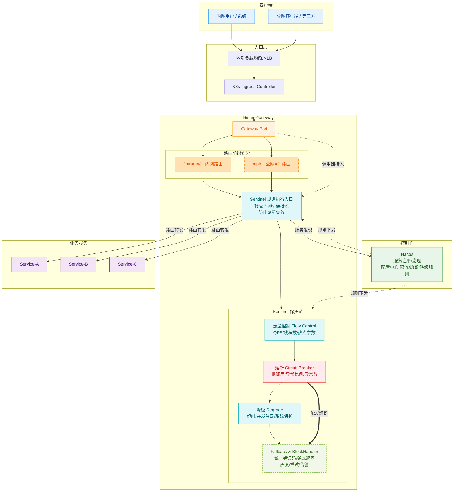

# 网关熔断器架构图

```mermaid
flowchart TB
  %% 强调：Alibaba Sentinel 在 Gateway 中的限流/熔断/降级，以及通过 sentinel-spring-cloud-gateway-adapter 托管 Netty 连接池，避免熔断失效

  %% 入口层：内外网客户端
  subgraph Clients[客户端]
    direction TB
    C1[内网用户 / 系统]:::client
    C2[公网客户端 / 第三方]:::client
  end

  %% K8s/网络入口
  subgraph Ingress[入口层]
    direction TB
    LB[外部负载均衡/NLB]
    IG[K8s Ingress Controller]
    LB --> IG
  end

  %% 网关实例（同一 JAR，不同前缀区分内外网）
  subgraph Gateway[Richie Gateway]
    direction TB
    G[Gateway Pod]:::gateway

    subgraph RouteSplit[路由前缀划分]
      direction TB
      R1["/intranet/... 内网路由"]:::route
      R2["/api/... 公网API路由"]:::route
    end

    G --> R1
    G --> R2

    %% Sentinel 适配器/连接池托管
    SA[Sentinel 规则执行入口<br>托管 Netty 连接池<br>  防止熔断失效]:::sentinel

    %% 无论内/外网路由，统一先进入 Sentinel
    R1 --> SA
    R2 --> SA
    G -. 调用链接入 .-> SA

    %% 熔断/限流/降级处理链
    subgraph Protect[Sentinel 保护链]
      direction TB
      FCR[流量控制 Flow Control<br>QPS/线程数/热点参数]:::sentinel
      CB[熔断 Circuit Breaker<br>慢调用/异常比例/异常数]:::breaker
      DG[降级 Degrade<br>超时/并发降级/系统保护]:::sentinel
      FH[Fallback & BlockHandler<br>统一错误码/兜底返回<br>灰度/重试/告警]:::fallback

      FCR --> CB --> DG --> FH
    end

    SA --> Protect
  end

  %% 控制面：配置与注册发现
  subgraph ControlPlane[控制面]
    direction TB
    NACOS[Nacos<br>服务注册/发现<br>配置中心 限流/熔断/降级规则]:::nacos
  end

  %% 服务侧：下游应用服务
  subgraph Services[业务服务]
    direction TB
    S1[Service-A]:::svc
    S2[Service-B]:::svc
    S3[Service-C]:::svc
  end

  %% 网络流向
  C1 --> LB
  C2 --> LB
  IG --> G

  %% 网关到下游（经 Sentinel 再发现与转发）
  SA -->|服务发现| NACOS
  SA -->|路由转发| S1
  SA -->|路由转发| S2
  SA -->|路由转发| S3

  %% Sentinel 规则来源（配置下发）
  NACOS -. 规则下发 .-> SA
  NACOS -. 规则下发 .-> Protect

  %% 熔断强调：当触发熔断时，快速失败并走兜底
  CB ==> |触发熔断| FH

  %% 样式定义
  classDef client fill:#e3f2fd,stroke:#2196f3,color:#0d47a1,stroke-width:1px
  classDef gateway fill:#fff3e0,stroke:#fb8c00,color:#e65100,stroke-width:1px
  classDef route fill:#ffe0b2,stroke:#f57c00,color:#e65100,stroke-width:1px,stroke-dasharray: 3 2
  classDef nacos fill:#e8f5e9,stroke:#43a047,color:#1b5e20,stroke-width:1px
  classDef svc fill:#f3e5f5,stroke:#8e24aa,color:#4a148c,stroke-width:1px
  classDef sentinel fill:#e0f7fa,stroke:#00acc1,color:#006064,stroke-width:1px
  classDef breaker fill:#ffebee,stroke:#e53935,color:#b71c1c,stroke-width:2px
  classDef fallback fill:#f1f8e9,stroke:#7cb342,color:#33691e,stroke-width:1px,stroke-dasharray: 5 3

```

