# Richie网关设计文档

> **版本**: 1.0.0  
> **更新**: 2025-11-03  
> **作者**: richie696

## 📋 目录

- [1. 快速了解](#1-快速了解)
- [2. 部署架构](#2-部署架构)
- [3. 过滤器架构](#3-过滤器架构)
- [4. 核心功能](#4-核心功能)
- [5. 配置指南](#5-配置指南)
- [6. 客户端集成](#6-客户端集成)
- [7. JVM优化配置](#7-jvm优化配置)
- [8. 附录](#8-附录)

---

## 1. 快速了解

### 1.1 核心特性

| 功能 | 说明 | 状态 |
|------|------|------|
| 🔐 **ECC加密** | ECC+AES-GCM端到端加密 | ✅ 生产可用 |
| 🛡️ **防重复提交** | 多维度防重复提交保护 | ✅ 生产可用 |
| 🔑 **认证授权** | JWT令牌、SSO单点登录 | ✅ 生产可用 |
| 🏢 **多租户** | 租户隔离和权限控制 | ✅ 生产可用 |
| 🚀 **灰度发布** | 多维度Canary发布 | ✅ 生产可用 |
| ⚡ **熔断限流** | Sentinel统一保护 | ✅ 生产可用 |
| 🌍 **国际化** | 多语言支持 | ✅ 生产可用 |

### 1.2 技术栈

| 技术 | 版本 |
|------|------|
| Spring Cloud Gateway | 4.x |
| Java | 25 (ZGC) |
| Sentinel | 最新版 |
| Redis | 6.x+ |
| Nacos | 2.x |

---

## 2. 部署架构

网关支持两种主流部署模式：ECS传统部署和K8S容器化部署。不同部署环境下，网关在网络架构中所处的位置和职责有所不同。

### 2.1 ECS部署架构

#### 2.1.1 架构概述

在ECS部署环境中，网关作为统一入口，所有内外网请求都必须经过网关进行鉴权和路由转发。内外网请求使用独立的网关实例，确保安全隔离。

#### 2.1.2 网络拓扑

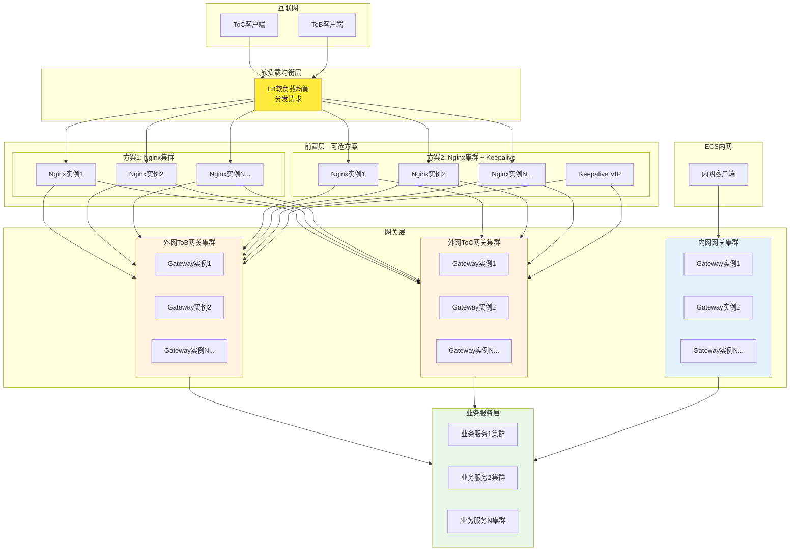

#### 2.1.3 核心特点

**前置层**:
- **LB软负载均衡**: 接收所有公网请求，分发到多个Nginx实例
- **方案1**: `Nginx多实例` - LB分发到多台Nginx实例，Nginx转发到Gateway
- **方案2**: `Nginx多实例 + Keepalive` - LB分发到多台Nginx实例，Nginx通过Keepalive实现VIP高可用，再转发到Gateway

**网关层**:
- **外网网关**: 独立集群，分为ToB和ToC两套独立的网关实例
  - ToB网关：处理企业客户请求
  - ToC网关：处理个人用户请求
- **内网网关**: 独立集群，处理ECS内网请求
- **多实例部署**: 所有网关均采用多实例部署，确保高可用

**安全机制**:
- ✅ **内外网隔离**: 内外网网关完全独立，物理/逻辑隔离
- ✅ **强制鉴权**: 所有请求（包括内网请求）都必须经过网关鉴权
- ✅ **防非法访问**: 防止ECS内网非法访问，即使内网请求也需要通过网关验证身份

**请求流向**:
```
外网请求: 客户端 → LB → Nginx → 外网Gateway(ToB/ToC) → 业务服务集群
内网请求: ECS内网客户端 → 内网Gateway → 业务服务集群
```

#### 2.1.4 流量隔离说明

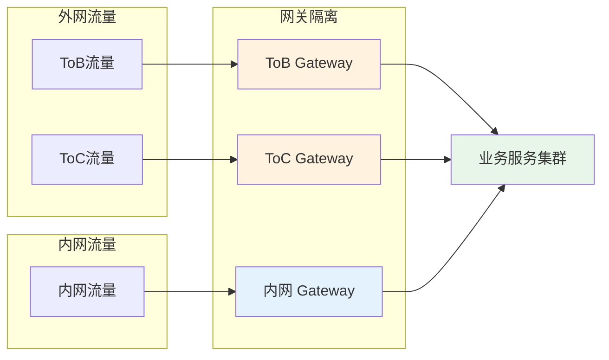

**隔离策略**:
- 🔒 ToB和ToC网关完全隔离，互不干扰
- 🔒 内网网关独立部署，与公网网关物理隔离
- 🔒 所有网关均需进行鉴权，防止非法访问

---

### 2.2 K8S部署架构

#### 2.2.1 架构概述

在K8S容器化部署环境中，网关作为集群入口，所有公网请求必须经过网关。服务间请求可以通过K8s Service直接通信，无需经过网关，利用K8s的CoreDNS和Service机制实现负载均衡和路由。

#### 2.2.2 网络拓扑

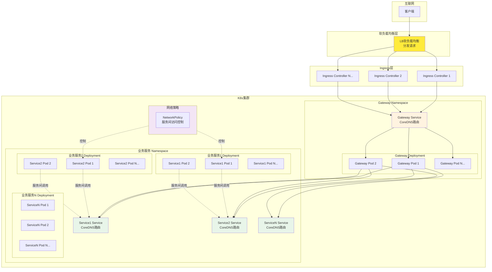

#### 2.2.3 核心特点

**入口层**:
- **LB软负载均衡**: 接收公网请求，分发到多个Ingress Controller实例
- **Ingress Controller**: 多实例部署，根据Ingress规则将请求路由到Gateway Service

**网关层**:
- **Gateway Service**: K8s Service，通过CoreDNS进行服务发现
- **Gateway Pods**: 多实例部署，通过Service实现负载均衡
- **公网流量**: 所有公网请求必须经过Gateway Pod

**业务服务层**:
- **Service间通信**: 服务间请求可直接调用，无需经过Gateway
- **CoreDNS + Service**: 利用K8s原生服务发现和负载均衡
- **NetworkPolicy**: K8s网络策略保证服务间安全，替代请求签名

**安全机制**:
- ✅ **K8s安全**: 通过NetworkPolicy、RBAC等机制保证服务安全
- ✅ **无需签名**: 服务间请求无需签名验证，由K8s保证安全
- ✅ **CoreDNS路由**: 通过CoreDNS实现服务发现和负载均衡

**请求流向**:
```
公网请求: 客户端 → LB软负载均衡 → Ingress Controller → Gateway Service → Gateway Pod → 业务Service → 业务Pod
服务间请求: Service Pod → 目标Service (CoreDNS) → 目标Pod (直连，无需Gateway)
```

#### 2.2.4 服务间通信模式

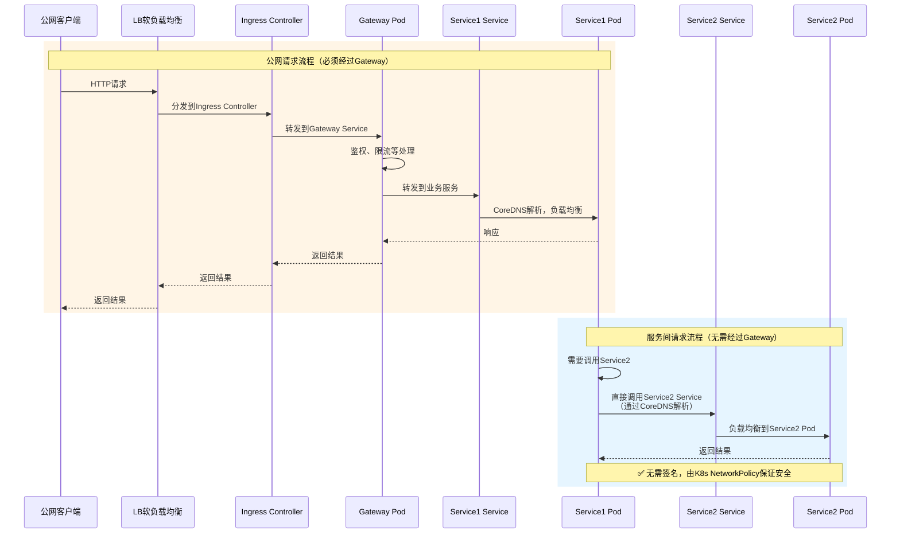

#### 2.2.5 K8s Service路由机制

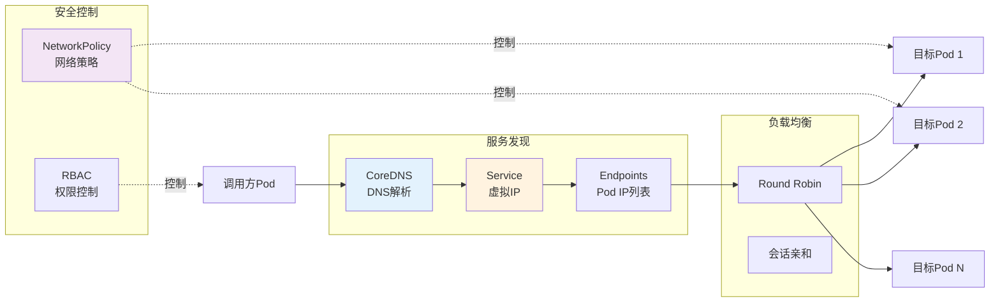

**K8s原生能力**:
- 🔍 **CoreDNS**: 自动解析Service名称到ClusterIP
- ⚖️ **Service负载均衡**: 自动在Pod间分发请求
- 🔒 **NetworkPolicy**: 定义Pod间网络访问规则
- 🛡️ **RBAC**: 控制Pod的访问权限

---

### 2.3 两种部署模式对比

| 对比维度      | ECS部署                                     | K8S部署                           |
|-----------|-------------------------------------------|---------------------------------|
| **前置层**   | LB软负载均衡 → Nginx多实例 或 Nginx多实例 + Keepalive | LB软负载均衡 → Ingress Controller多实例 |
| **网关部署**  | 多实例独立部署                                   | 多Pod通过Deployment部署              |
| **请求路径**  | 所有请求必过Gateway                             | 公网请求过Gateway，服务间直连              |
| **负载均衡**  | Nginx/LB                                  | CoreDNS + Service               |
| **服务发现**  | 注册中心(Nacos)                               | CoreDNS + Service               |
| **安全机制**  | 网关鉴权 + 请求签名                               | K8s NetworkPolicy + RBAC        |
| **服务间通信** | 需要签名，可选过Gateway                           | 无需签名，直连，由K8s保证安全                |
| **隔离策略**  | 内外网独立网关，ToB/ToC独立                         | 通过Namespace隔离                   |
| **运维复杂度** | 需要手动配置Nginx、Keepalive                     | K8s自动化管理                        |
| **扩展性**   | 手动扩容                                      | 自动扩缩容(HPA)                      |

#### 2.3.1 选择建议

**选择ECS部署**:
- ✅ 传统企业环境，已有ECS基础设施
- ✅ 需要严格的网络隔离（内外网、ToB/ToC）
- ✅ 对容器化要求不高
- ✅ 需要精细控制每个网关实例

**选择K8S部署**:
- ✅ 容器化环境，已有K8s集群
- ✅ 需要自动化运维和弹性扩缩容
- ✅ 服务间调用频繁，希望减少网关负担
- ✅ 利用K8s原生能力（Service、NetworkPolicy等）

---

## 3. 过滤器架构

### 3.1 五层架构

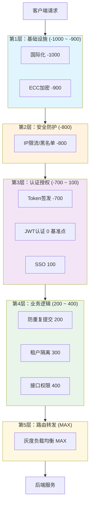

### 3.2 过滤器清单

| 顺序    | 过滤器                      | 功能             | 层级   |
|-------|--------------------------|----------------|------|
| -1000 | I18nFilter               | 国际化处理          | 基础设施 |
| -900  | EccCryptoFilter          | ECC+AES-GCM加密  | 基础设施 |
| -800  | SecurityFilter           | IP限流、黑名单       | 安全防护 |
| -700  | IssueTokensFilter        | Token签发        | 认证授权 |
| **0** | **AuthenticationFilter** | **JWT认证（基准点）** | 认证授权 |
| 100   | SsoFilter                | 单点登录           | 认证授权 |
| 200   | DuplicateSubmitFilter    | 防重复提交          | 业务逻辑 |
| 300   | TenantFilter             | 租户隔离           | 业务逻辑 |
| 400   | InterfaceAuthFilter      | 接口权限           | 业务逻辑 |
| MAX   | CanaryLoadBalancerFilter | 灰度负载均衡         | 路由转发 |

---

## 4. 核心功能

### 4.1 ECC加密通信

#### 技术原理

**ECC（椭圆曲线加密）+ AES-GCM（对称加密）混合加密方案**

**为什么使用混合加密？**

- **ECC**: 安全但慢，用于密钥交换
- **AES-GCM**: 快速且安全，用于数据加密
- **结合**: 用ECC交换密钥，用AES-GCM加密数据

#### ECC+AES-GCM vs 简单HTTPS 对比

| 对比维度         | ECC+AES-GCM混合加密     | 简单HTTPS加密                | 说明           |
|--------------|---------------------|--------------------------|--------------|
| **🔐 加密方式**  |
| 传输层加密        | ❌ 无（应用层加密）          | ✅ TLS/SSL                | HTTPS依赖TLS协议 |
| 应用层加密        | ✅ ECC密钥交换 + AES-GCM | ❌ 无                      | 双重加密，更安全     |
| 端到端加密        | ✅ 客户端↔网关↔后端（可选）     | ❌ 仅客户端↔网关                | ECC可以延伸到后端   |
| **🛡️ 安全性**  |
| 机密性          | ✅ AES-256           | ✅ TLS 1.2+ (AES-128/256) | 加密强度相当       |
| 完整性保护        | ✅ AES-GCM Tag认证     | ✅ TLS MAC                | 都有完整性校验      |
| 前向安全性        | ✅ KeyPair定期更新（24小时） | ⚠️ 依赖TLS版本               | ECC可以主动轮换密钥  |
| 密钥泄露风险       | ✅ 每会话独立密钥           | ⚠️ 长期证书密钥                | ECC会话密钥更安全   |
| 中间人攻击防护      | ✅ ECC密钥交换验证         | ✅ 证书链验证                  | 防护机制不同       |
| **⚡ 性能**     |
| 加密/解密开销      | ⚠️ 应用层处理（10-50ms）   | ✅ TLS硬件加速（<5ms）          | HTTPS有硬件加速优势 |
| 首次握手延迟       | ⚠️ 密钥交换（100-200ms）  | ✅ TLS握手（50-100ms）        | HTTPS握手稍快    |
| 数据传输性能       | ✅ AES-GCM高效         | ✅ TLS加密高效                | 性能相当         |
| CPU占用        | ⚠️ 较高（ECC计算）        | ✅ 较低（硬件加速）               | HTTPS更省CPU   |
| **🔧 部署与运维** |
| 证书管理         | ✅ 无需CA证书            | ❌ 需要CA证书/Let's Encrypt   | ECC无需证书管理    |
| 证书过期问题       | ✅ 无                 | ❌ 需要定期续期                 | ECC避免证书过期    |
| 证书成本         | ✅ 零成本               | ⚠️ 企业证书需付费               | ECC无证书成本     |
| 配置复杂度        | ⚠️ 需要客户端集成          | ✅ 服务器配置即可                | HTTPS配置更简单   |
| 客户端适配        | ⚠️ 需要集成客户端库         | ✅ 浏览器/HTTP客户端原生支持        | HTTPS兼容性更好   |
| **🎯 适用场景**  |
| 公开网站         | ❌ 不适用               | ✅ 首选                     | HTTPS更适合     |
| 移动App        | ✅ 完美适用              | ✅ 也适用                    | 两者都可用        |
| 内部系统         | ✅ 更灵活               | ✅ 也适用                    | ECC更灵活       |
| 高安全要求        | ✅ 端到端加密             | ⚠️ 仅传输加密                 | ECC安全性更高     |
| 金融支付         | ✅ 推荐                | ✅ 也适用                    | ECC更适合敏感数据   |
| **🔑 密钥管理**  |
| 密钥生成         | ✅ 客户端和服务端各自生成       | ❌ 仅服务端证书                 | ECC密钥对独立生成   |
| 密钥轮换         | ✅ 可动态轮换（24小时）       | ⚠️ 证书过期才轮换               | ECC轮换更灵活     |
| 密钥存储         | ✅ 内存中，不持久化          | ❌ 证书文件存储                 | ECC密钥更安全     |
| 多租户密钥        | ✅ 可支持多KeyPair       | ⚠️ 需要多证书                 | ECC更灵活       |
| **🌍 兼容性**   |
| 浏览器支持        | ✅ Web Crypto API    | ✅ 原生TLS                  | 都支持          |
| 移动端支持        | ✅ 需要集成库             | ✅ 原生支持                   | HTTPS兼容性更好   |
| 后端服务         | ✅ 可选加密              | ✅ 必须HTTPS                | ECC可选        |
| 旧系统兼容        | ⚠️ 需要升级客户端          | ✅ 广泛兼容                   | HTTPS兼容性更好   |
| **💰 成本**    |
| 证书费用         | ✅ 免费                | ⚠️ 企业证书需付费               | ECC无证书成本     |
| 开发成本         | ⚠️ 需要客户端开发          | ✅ 几乎无需开发                 | HTTPS开发成本低   |
| 运维成本         | ✅ 无需证书管理            | ⚠️ 需要证书管理                | ECC运维更简单     |
| **📊 可控制性**  |
| 加密粒度         | ✅ 按接口/路径配置          | ❌ 全站加密                   | ECC可精细控制     |
| 加密算法选择       | ✅ 完全可控              | ⚠️ 依赖TLS版本               | ECC算法可控      |
| 性能调优         | ✅ 可优化加密路径           | ⚠️ 依赖TLS配置               | ECC更可控       |
| 日志与审计        | ✅ 可记录加密信息           | ⚠️ TLS层不可见               | ECC可审计性更好    |

#### 选择建议

**使用 ECC+AES-GCM 的场景**：
- ✅ 高安全要求的业务系统（金融、支付、医疗）
- ✅ 需要端到端加密的场景
- ✅ 希望避免证书管理的复杂性
- ✅ 需要精细控制加密粒度（按接口/路径）
- ✅ 移动App内部通信
- ✅ 多租户系统（不同租户使用不同密钥）

**使用 简单HTTPS 的场景**：
- ✅ 公开网站和Web应用
- ✅ 标准HTTP API服务
- ✅ 需要快速部署和零客户端开发
- ✅ 浏览器访问为主要场景
- ✅ 需要兼容性优先的场景

**最佳实践：混合使用**
- 🌐 **公开接口**：使用HTTPS（零配置，兼容性好）
- 🔐 **敏感接口**：使用ECC+AES-GCM（高安全性，端到端加密）
- 📱 **移动App**：优先使用ECC+AES-GCM（无需证书管理，更灵活）

#### 密钥交换原理（ECDH）

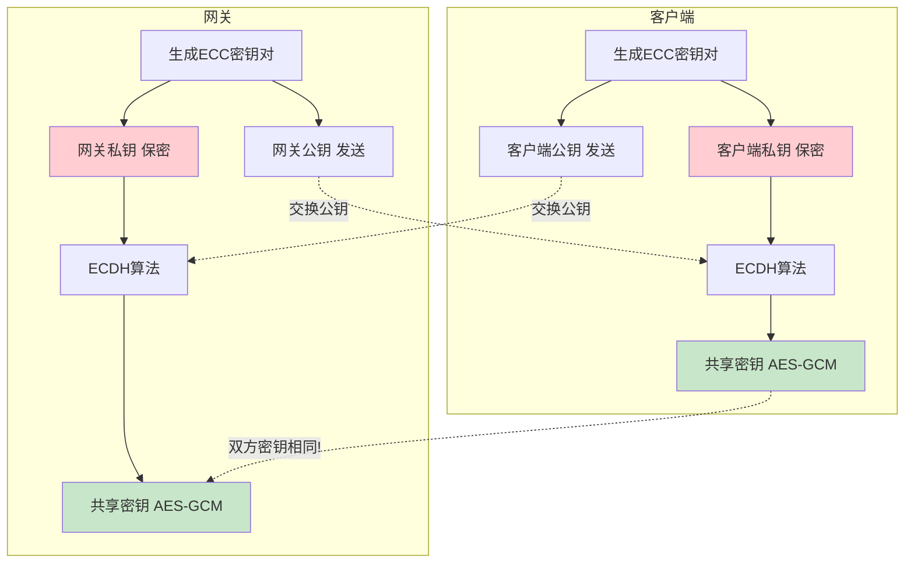

**核心特点**：
- 🔐 双方各自生成密钥对，私钥永不传输
- 🤝 交换公钥后，通过ECDH算法计算出**相同的共享密钥**
- ⚡ 共享密钥仅用于本次会话，网关KeyPair会定期更新

#### 完整加密流程

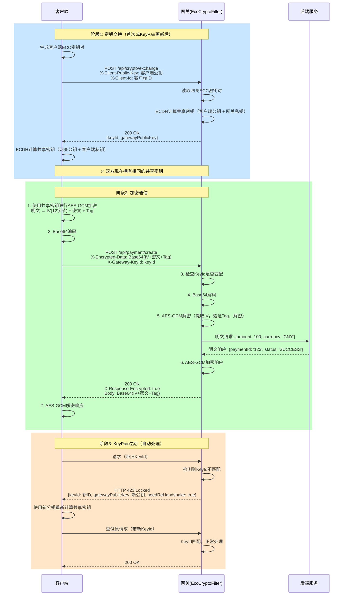

#### AES-GCM加密详解

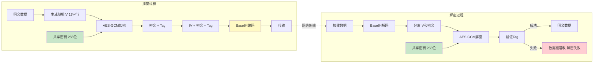

**安全特性**：
- 🔒 **机密性**: AES-256加密，无法破解
- ✅ **完整性**: Tag认证标签，防篡改
- 🔄 **前向安全**: KeyPair定期更新，旧密钥失效
- 🚀 **高性能**: AES-GCM有硬件加速

#### 配置

```yaml
platform:
  gateway:
    ecc-crypto:
      enabled: true           # 启用ECC加密
      key-pair-ttl: 86400000  # KeyPair有效期24小时
      include-paths:
        - "/api/auth/**"      # 认证接口加密
        - "/api/payment/**"   # 支付接口加密
      exclude-paths:
        - "/api/public/**"    # 公开接口不加密
```

#### 客户端集成

参见: [client-library/examples/](../src/main/resources/client-library/examples/)

---

### 4.2 防重复提交

#### 技术原理

**双重防护机制**: 客户端防护（本地队列）+ 服务端防护（Redis缓存）

**核心思想**: 
- 为每个请求生成唯一标识（requestId）
- 在时间窗口内，相同requestId的请求只允许一次
- 超过时间窗口后，自动清理记录

#### 请求标识生成算法

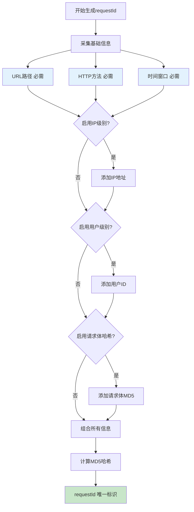

**生成公式**：
```javascript
requestId = MD5(
    URL路径 + 
    HTTP方法 + 
    ⌊当前时间 / 时间窗口⌋ +  // 时间分片，同一窗口内相同
    IP地址(可选) + 
    用户ID(可选) + 
    MD5(请求体)(可选)
)
```

**示例**：
```
URL: /api/order/submit
方法: POST
时间窗口: 3000ms
当前时间: 1730419200000
用户ID: user123
IP: 192.168.1.100
请求体: {"orderId":"12345","amount":100}

requestId = MD5(
    "/api/order/submit" + 
    "POST" + 
    "576806400" +              // ⌊1730419200000 / 3000⌋
    "192.168.1.100" +
    "user123" +
    "a1b2c3d4e5f6"            // MD5(请求体)
) = "7f8a9b1c2d3e4f5a"
```

#### 双重防护流程

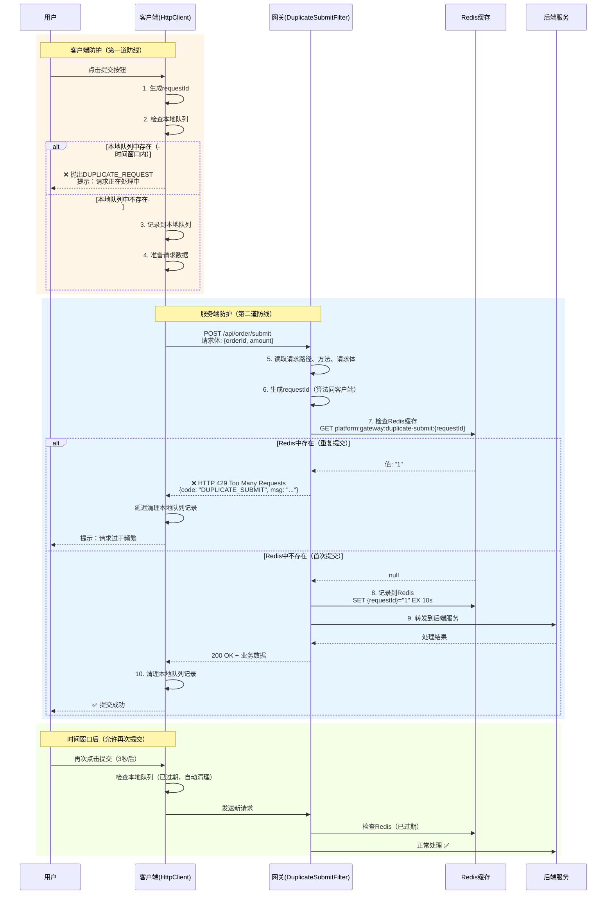

#### 多维度防护

| 维度       | 说明            | 配置项                                 | 适用场景  |
|----------|---------------|-------------------------------------|-------|
| **路径**   | 指定哪些API需要检查   | `include-paths`<br/>`exclude-paths` | 所有场景  |
| **方法**   | 只检查写操作        | 自动识别                                | 所有场景  |
| **时间窗口** | 同一窗口内去重       | `time-window: 3000`                 | 所有场景  |
| **用户**   | 同一用户时间窗口内不能重复 | `enable-user-level: true`           | 登录后操作 |
| **IP**   | 同一IP时间窗口内不能重复 | `enable-ip-level: true`             | 防恶意攻击 |
| **请求体**  | 相同请求体哈希去重     | `enable-body-hash: true`            | 防重复数据 |

#### 时间窗口机制

```mermaid
gantt
    title 防重复提交时间线（时间窗口=3秒）
    dateFormat X
    axisFormat %S秒

    section 请求1
    请求发送       :a1, 0, 1s
    缓存记录       :a2, after a1, 10s
    时间窗口       :crit, a3, 0, 3s
    
    section 重复请求
    尝试发送(1秒)  :crit, b1, 1, 1s
    被拦截         :done, b2, after b1, 0s
    尝试发送(2秒)  :crit, b3, 2, 1s
    被拦截         :done, b4, after b3, 0s
    
    section 允许的请求
    3秒后发送      :c1, 4, 1s
    允许通过       :active, c2, after c1, 0s
```

**说明**：
- ⏰ **时间窗口**: 3秒内同一requestId只允许一次
- 🔄 **自动清理**: 缓存过期时间通常是时间窗口的2-3倍
- ✅ **窗口后**: 时间窗口过后，自动允许新请求

#### 缓存策略

**Redis缓存键结构**：
```
platform:gateway:duplicate-submit:{requestId}
```

**值**: 固定为`"1"`  
**过期时间**: 10秒（时间窗口的3倍）

**为什么过期时间要大于时间窗口？**
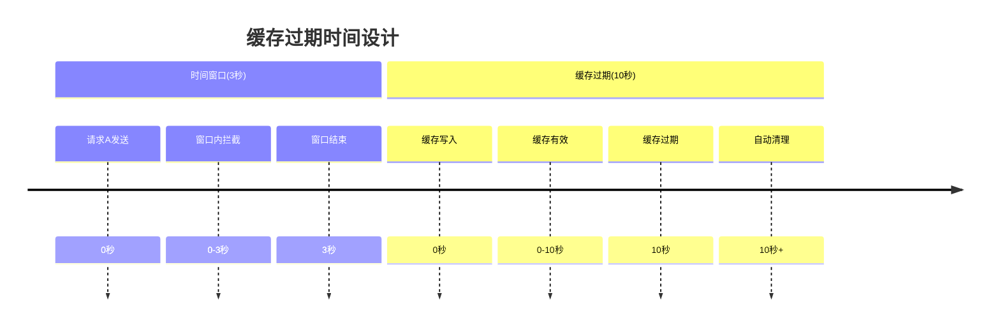

**原因**: 
- ⏱️ 防止边界条件下的重复提交
- 🔄 给Redis一些清理缓冲时间
- 🛡️ 增加额外的安全边界

#### 配置

```yaml
platform:
  gateway:
    duplicate-submit:
      enabled: true                    # 启用
      time-window: 3000               # 时间窗口3秒
      cache-expire: 10000             # 缓存10秒
      enable-user-level: true         # 用户级别检查
      enable-ip-level: true           # IP级别检查
      enable-body-hash: true          # 请求体哈希
      include-paths: ["/api/**"]
      exclude-paths: 
        - "/api/health/**"
        - "/api/auth/login"           # 登录允许重试
      error-code: "DUPLICATE_SUBMIT"
      error-message: "请求过于频繁，请稍后再试"
```

#### 双重防护

```
客户端检查 (本地队列) → 服务端检查 (Redis缓存)
     ↓                          ↓
  立即拒绝                   HTTP 429
```

---

### 4.3 认证授权

#### 4.3.1 JWT令牌

**生命周期**:

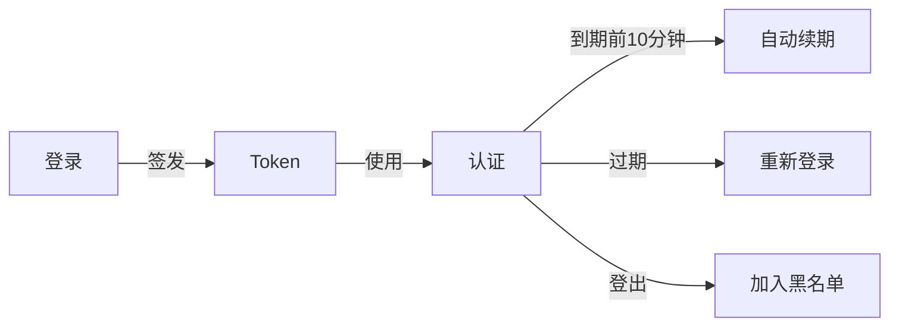

**配置**:

```yaml
platform:
  gateway:
    token:
      expire-time: 2                    # 有效期2小时
      expiration-renewal-time: 10       # 到期前10分钟续期
      secret: "your-jwt-secret-key"     # JWT密钥
      blacklist-path: "platform:gateway:token:"
      login-uri-list:
        - /api/auth/login               # 登录接口
      ignore-uri-list:
        - /api/public/**                # 忽略公开接口
```

#### 4.3.2 SSO单点登录

**功能**: 同一账号只能在一处登录，新登录会踢掉旧会话

**配置**:

```yaml
platform:
  gateway:
    sso:
      enable: true
      sso-login-url: "http://localhost:8080/sso/login"
      online-token-path: "platform:gateway:online-token:"
```

---

### 4.4 安全防护

#### IP限流策略

| 规则                   | 说明       |
|----------------------|----------|
| `banned_ip`          | 封禁IP地址   |
| `custom_http_status` | 返回自定义错误  |
| `redirect`           | 重定向到错误页面 |

#### 配置示例

```yaml
platform:
  gateway:
    security:
      enable: true
      rule: banned_ip                   # 封禁策略
      security-threshold: 60            # 60次/分钟
      security-time-interval-value: 1
      security-time-interval-unit: minutes
      banned:
        permanent: false                # 非永久封禁
        security-block-time: 5          # 封禁5分钟
        security-block-time-unit: minutes
```

---

### 4.5 灰度发布

#### 三种维度

| 维度          | 说明                 | 使用场景   |
|-------------|--------------------|--------|
| **VERSION** | 基于版本号              | 服务端控制  |
| **ID**      | 基于特征ID（用户ID、门店ID等） | 指定用户测试 |
| **CUSTOM**  | 客户端动态指定            | 灵活控制   |

#### 配置

```yaml
platform:
  gateway:
    deploy:
      enable: true
      canary-category: VERSION    # 或 ID, CUSTOM
      id-list:                    # ID模式时使用
        - 111
        - 222
```

---

### 4.6 Sentinel熔断器

#### 核心优势

- ✅ **托管Netty连接池** - 防止熔断失效
- ✅ **统一保护** - 内外网请求统一经过Sentinel
- ✅ **动态规则** - 规则通过Nacos动态下发
- ✅ **多维度保护** - 流控、熔断、降级、热点参数、系统保护

#### 架构图

> 📊 **详细架构图**：请参考 [网关熔断器架构图](./网关熔断器架构图.md)，该文档详细展示了 Sentinel 在网关中的完整架构，包括：
> - 客户端到网关的请求流程
> - 内外网路由划分
> - Sentinel 规则执行入口和连接池托管
> - 流量控制、熔断、降级、Fallback 处理链
> - Nacos 配置中心规则下发
> - 下游服务路由转发

#### 配置

```yaml
spring:
  cloud:
    sentinel:
      transport:
        dashboard: 10.100.0.90:8899
      datasource:
        flow:
          nacos:
            server-addr: 10.100.0.112:8848
            data-id: gateway-flow-rules.json
            rule-type: flow
        degrade:
          nacos:
            server-addr: 10.100.0.112:8848
            data-id: gateway-degrade-rules.json
            rule-type: degrade
```

---

## 5. 配置指南

### 5.1 最小化配置

#### application.yml (本地配置)

```yaml
server:
  port: 8080

spring:
  application:
    name: atlas-richie-gateway-service
  cloud:
    nacos:
      discovery:
        server-addr: 10.100.0.51:8848
        namespace: production
      config:
        server-addr: 10.100.0.51:8848
        namespace: production
        name: gateway-service.yaml
        group: global
        file-extension: yaml

logging:
  config: ./logback-spring.xml
```

#### gateway-service.yaml (Nacos配置中心)

```yaml
# Redis配置
spring:
  data:
    redis:
      host: 10.100.0.87
      port: 6379
      password: your-password
      database: 0
      lettuce:
        pool:
          max-active: 100
          max-idle: 10
          min-idle: 5

# 路由配置
  cloud:
    gateway:
      routes:
        - id: user-service
          uri: lb://user-service
          predicates:
            - Path=/api/user/**
          filters:
            - StripPrefix=1

# Sentinel熔断器
    sentinel:
      transport:
        dashboard: 10.100.0.90:8899
      datasource:
        flow:
          nacos:
            server-addr: 10.100.0.112:8848
            data-id: gateway-flow-rules.json

# 网关功能配置
platform:
  gateway:
    # ECC加密
    ecc-crypto:
      enabled: true
      
    # 防重复提交
    duplicate-submit:
      enabled: true
      time-window: 3000
      
    # JWT认证
    token:
      expire-time: 2
      secret: your-jwt-secret
      
    # 安全防护
    security:
      enable: true
      rule: banned_ip
      security-threshold: 60
```

### 5.2 核心配置对照表

| 功能      | 配置路径                                             | 默认值   | 说明   |
|---------|--------------------------------------------------|-------|------|
| ECC加密   | `platform.gateway.ecc-crypto.enabled`            | false | 是否启用 |
| 防重复提交   | `platform.gateway.duplicate-submit.enabled`      | false | 是否启用 |
| 时间窗口    | `platform.gateway.duplicate-submit.time-window`  | 3000  | 毫秒   |
| JWT有效期  | `platform.gateway.token.expire-time`             | 2     | 小时   |
| Token续期 | `platform.gateway.token.expiration-renewal-time` | 10    | 分钟   |
| IP限流    | `platform.gateway.security.security-threshold`   | 120   | 次/分钟 |
| SSO     | `platform.gateway.sso.enable`                    | false | 是否启用 |
| 多租户     | `platform.gateway.tenant.enable`                 | false | 是否启用 |
| 灰度发布    | `platform.gateway.deploy.enable`                 | false | 是否启用 |

---

## 6. 客户端集成

### 6.1 客户端库

**位置**: `src/main/resources/client-library/`

**支持框架**:
- ⚛️ React 18+
- 🅰️ Angular 17+
- 🟢 Vue 3

### 6.2 快速开始

#### 步骤1: 定义URL

```typescript
import { Url, Method } from './framework/url';

export class AppUrl {
    // 公开数据：不加密，不防重复
    public static readonly MENU_ALL = new Url(
        'MENU_ALL', '/api/menu/all', Method.GET
    );

    // 登录：加密，不防重复
    public static readonly USER_LOGIN = new Url(
        'USER_LOGIN', '/api/auth/login', Method.POST,
        true,   // 加密
        false   // 不防重复
    );

    // 支付：加密，防重复
    public static readonly PAYMENT_CREATE = new Url(
        'PAYMENT_CREATE', '/api/payment/create', Method.POST,
        true,   // 加密
        true    // 防重复
    );
}
```

#### 步骤2: 使用客户端

**React**:
```tsx
const client = useHttpClient();
await client.request(AppUrl.USER_LOGIN, {
    body: { username, password }
});
```

**Angular**:
```typescript
private httpClient = inject(HttpClientService);
await this.httpClient.request(AppUrl.USER_LOGIN, {
    body: { username, password }
});
```

**Vue**:
```vue
<script setup>
const client = useHttpClient();
await client.request(AppUrl.USER_LOGIN, {
    body: { username, password }
});
</script>
```

### 6.3 四种配置组合

| 加密 | 防重复 | 适用场景     | 示例    |
|----|-----|----------|-------|
| ❌  | ❌   | 公开只读数据   | 菜单、字典 |
| ✅  | ❌   | 敏感数据，可重试 | 登录、查询 |
| ❌  | ✅   | 普通操作，防重复 | 文件上传  |
| ✅  | ✅   | 高安全操作    | 支付、订单 |

---

## 7. JVM优化配置

### 7.1 JDK25 分代ZGC配置（4C8G POD）

**完整配置示例**：

```bash
# JDK25 分代ZGC优化配置（适用于4C8G起步的POD）
java -Xms3g -Xmx6g \
     -XX:+UseZGC \
     -XX:+ZGenerational \
     -XX:+UnlockExperimentalVMOptions \
     -XX:+UseStringDeduplication \
     -XX:MaxMetaspaceSize=512m \
     -XX:MaxDirectMemorySize=1g \
     -XX:+HeapDumpOnOutOfMemoryError \
     -XX:HeapDumpPath=/app/logs/gateway/heapdump.hprof \
     -XX:+PrintGCDetails \
     -XX:+PrintGCDateStamps \
     -Xlog:gc*:file=/app/logs/gateway/gc.log:time:filecount=5,filesize=100M \
     -XX:+UseGCLogFileRotation \
     -XX:NumberOfGCLogFiles=5 \
     -XX:GCLogFileSize=100M \
     -Djava.security.egd=file:/dev/./urandom \
     -Dfile.encoding=UTF-8 \
     -Duser.timezone=Asia/Shanghai \
     -jar atlas-richie-gateway-service.jar
```

**配置项详细说明**：

| 配置项                                                 | 配置值      | 配置原因         | 说明                      |
|-----------------------------------------------------|----------|--------------|-------------------------|
| `-Xms3g -Xmx6g`                                     | 3GB-6GB  | 堆内存配置        | 预留2GB给系统和其他进程，避免OOM     |
| `-XX:+UseZGC`                                       | 启用ZGC    | 低延迟垃圾收集器     | ZGC暂停时间<1ms，适合网关高并发场景   |
| `-XX:+ZGenerational`                                | 启用分代ZGC  | 提升吞吐量和内存回收效率 | JDK25默认未开启分代ZGC，需手动加此参数 |
| `-XX:+UnlockExperimentalVMOptions`                  | 启用实验性选项  | 支持ZGC等实验性功能  | JDK25中ZGC仍需要此参数         |
| `-XX:+UseStringDeduplication`                       | 启用字符串去重  | 减少内存占用       | 网关处理大量HTTP请求，字符串去重可节省内存 |
| `-XX:MaxMetaspaceSize=512m`                         | 512MB    | 元空间大小限制      | 防止元空间无限增长，影响系统稳定性       |
| `-XX:MaxDirectMemorySize=1g`                        | 1GB      | 直接内存限制       | 限制NIO缓冲区使用，防止内存泄漏       |
| `-XX:+HeapDumpOnOutOfMemoryError`                   | 启用堆转储    | 故障诊断         | OOM时自动生成堆转储文件，便于问题分析    |
| `-XX:HeapDumpPath=/app/logs/gateway/heapdump.hprof` | 堆转储路径    | 文件存储位置       | 指定堆转储文件保存路径             |
| `-XX:+PrintGCDetails`                               | 启用详细GC日志 | 性能监控         | 记录详细的GC信息，便于性能调优        |
| `-XX:+PrintGCDateStamps`                            | 启用GC时间戳  | 时间追踪         | 在GC日志中添加时间戳，便于问题定位      |
| `-Xloggc:/app/logs/gateway/gc.log`                  | GC日志路径   | 日志存储         | 指定GC日志文件保存路径            |
| `-XX:+UseGCLogFileRotation`                         | 启用日志轮转   | 磁盘空间管理       | 防止GC日志文件过大，自动轮转         |
| `-XX:NumberOfGCLogFiles=5`                          | 5个日志文件   | 历史保留         | 保留最近5个GC日志文件            |
| `-XX:GCLogFileSize=100M`                            | 100MB    | 单个文件大小       | 单个GC日志文件最大100MB         |
| `-Djava.security.egd=file:/dev/./urandom`           | 随机数生成器   | 启动性能         | 使用/dev/urandom加速启动，避免阻塞 |
| `-Dfile.encoding=UTF-8`                             | UTF-8编码  | 字符编码         | 确保日志和消息的正确编码            |
| `-Duser.timezone=Asia/Shanghai`                     | 上海时区     | 时间处理         | 设置系统时区，确保日志时间正确         |

### 7.2 ZGC垃圾收集器优势

**ZGC特性**：

1. **极低延迟**：ZGC的暂停时间通常小于1毫秒，非常适合网关这种对延迟敏感的服务
2. **可扩展性**：ZGC的暂停时间不会随着堆大小增加而增加，适合大内存场景
3. **并发处理**：ZGC的大部分工作都是并发进行的，不会阻塞应用线程
4. **内存效率**：ZGC的内存使用效率高，碎片化程度低

**内存分配策略**：

- **堆内存**：设置为总内存的75%，为系统和其他进程预留25%
- **直接内存**：设置为总内存的12.5%，用于NIO缓冲区
- **元空间**：设置为总内存的6.25%，用于类元数据
- **系统预留**：预留6.25%给操作系统和其他进程

### 7.3 性能监控建议

**GC监控指标**：
- GC频率：监控GC发生的频率
- GC暂停时间：监控每次GC的暂停时间
- 内存使用率：监控堆内存和直接内存的使用情况

**关键性能指标**：
- 响应时间：监控API响应时间
- 吞吐量：监控每秒处理的请求数
- 错误率：监控请求错误率

**告警设置**：
- GC暂停时间>10ms时告警
- 内存使用率>80%时告警
- 响应时间>1s时告警

**调优建议**：
1. **根据实际负载调整堆内存大小**：监控内存使用情况，适当调整堆内存大小，避免设置过大的堆内存影响GC效率
2. **监控GC日志**：定期分析GC日志，发现性能问题，根据GC情况调整相关参数
3. **系统资源监控**：监控CPU使用率，避免CPU成为瓶颈；监控网络IO，确保网络性能满足需求

### 7.4 K8s环境下POD资源与JVM配置建议

在Kubernetes（K8s）环境下，建议采用"小而多"的POD部署策略，合理分配单POD资源，通过副本数横向扩展提升整体吞吐和高可用性。

**资源分配原则**：
- 单POD内存不宜过大，建议不超过4G，CPU不超过2-4核
- JVM堆内存建议为POD内存的50%-70%，其余留给直接内存、元空间和系统
- 优先通过增加POD副本数（横向扩展）提升能力，而非单POD堆内存无限增大
- 生产环境建议POD副本数≥3，保证高可用和弹性伸缩

**推荐配置表**：

| 业务规模  | POD副本数 | CPU    | 内存   | JVM堆建议  | 适用场景      |
|-------|--------|--------|------|---------|-----------|
| 开发/测试 | 1-2    | 0.5-1核 | 1-2G | 512m-1g | 低并发/功能验证  |
| 小型生产  | 2-3    | 1-2核   | 2-3G | 1g-1.5g | 日活<5万     |
| 中型生产  | 3-5    | 2核     | 2-4G | 1.5g-2g | 日活5-20万   |
| 大型生产  | 5-8    | 2-4核   | 3-6G | 2g-3g   | 日活20-100万 |

> **说明**：JVM参数建议 `-Xms=-Xmx=`，其余内存分配给直接内存、元空间和系统。

**横向扩展优势**：
- **高可用**：单POD故障影响面小，K8s可自动重建副本
- **弹性伸缩**：可根据流量自动扩缩容，资源利用率高
- **故障隔离**：单POD崩溃不会拖垮整体服务，提升系统健壮性
- **升级平滑**：支持滚动升级，零停机

**K8s资源配置YAML示例**：

```yaml
resources:
  requests:
    memory: "2Gi"
    cpu: "1"
  limits:
    memory: "3Gi"
    cpu: "2"
```

JVM参数建议：`-Xms1g -Xmx1.5g -XX:MaxDirectMemorySize=512m ...`

**K8s下的最佳实践建议**：
1. 优先横向扩展副本数，单POD内存不宜超过4G
2. 监控POD内存和GC日志，发现频繁Full GC或OOM时，优先增加副本数而非单POD资源
3. 合理设置HPA（自动扩缩容），根据CPU/内存/自定义QPS等指标自动扩容
4. 升级/发布采用滚动方式，避免全量重启
5. 节点需预留部分资源给系统和其他服务，避免资源争抢

> **本节内容为K8s环境下POD资源与JVM配置专用建议，适用于Spring Cloud Gateway等微服务网关在Kubernetes平台的生产部署。**

---

## 8. 附录

### 8.1 快速命令

#### 健康检查

```bash
curl http://localhost:8080/actuator/health
```

#### 测试登录

```bash
curl -X POST http://localhost:8080/api/auth/login \
  -H "Content-Type: application/json" \
  -d '{"username":"test","password":"test"}'
```

#### 带Token请求

```bash
curl -X GET http://localhost:8080/api/user/profile \
  -H "x-rd-request-apitoken: YOUR_TOKEN"
```

---

### 8.2 常见问题

| 问题        | 原因            | 解决方案            |
|-----------|---------------|-----------------|
| 启动失败      | 配置错误、端口占用     | 检查配置语法、检查端口     |
| Nacos连接失败 | 地址错误、网络问题     | 检查server-addr配置 |
| Token验证失败 | 密钥不匹配、Token过期 | 检查secret配置      |
| 重复提交误拦截   | 时间窗口过长        | 调整time-window   |
| 加密失败      | KeyPair过期     | 客户端会自动重新握手      |

---

### 8.3 监控指标

#### 关键指标

| 指标   | 监控项     | 告警阈值   |
|------|---------|--------|
| 响应时间 | P95响应时间 | >1s    |
| 错误率  | 5xx错误率  | >1%    |
| 吞吐量  | QPS     | 根据容量规划 |
| 内存   | 堆内存使用率  | >80%   |
| GC   | GC暂停时间  | >10ms  |

#### Prometheus配置

```yaml
management:
  endpoints:
    web:
      exposure:
        include: health,metrics,prometheus
  metrics:
    export:
      prometheus:
        enabled: true
```

---

### 8.4 更新日志

| 版本    | 日期      | 更新内容                                    |
|-------|---------|-----------------------------------------|
| 1.0.0 | 2025-11 | 新增客户端库（React/Angular/Vue），优化ECC加密和防重复提交 |
| 4.5.0 | 2025-01 | 采用Sentinel替代Resilience4j，优化熔断器架构        |
| 4.3.0 | 2024-07 | 新增SSO功能，完善国际化                           |
| 4.2.0 | 2024-05 | 新增多租户支持                                 |

---

## 📚 相关资源

- **客户端库**: [client-library/](../src/main/resources/client-library/)
- **Spring Cloud Gateway**: https://spring.io/projects/spring-cloud-gateway
- **Sentinel文档**: https://sentinelguard.io/zh-cn/docs/introduction.html
- **Nacos文档**: https://nacos.io/zh-cn/docs/quick-start.html

---

**说明**: 
- 本文档保留所有核心功能和配置，以简洁的表格和图表呈现
- 详细的使用示例请参考各章节
- 客户端集成请查看 `client-library` 目录


