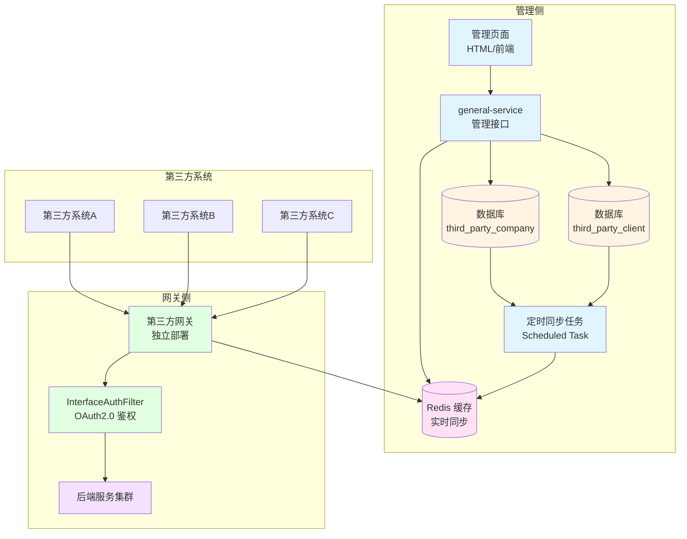
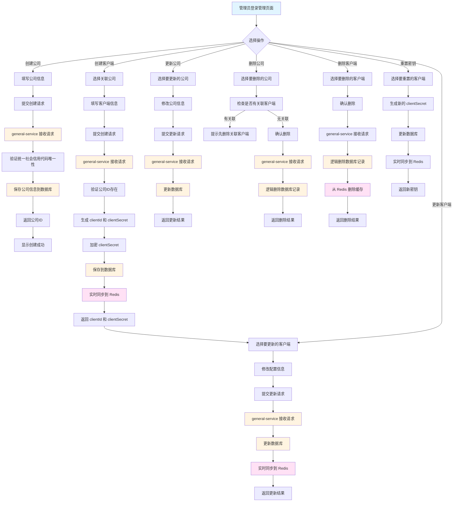
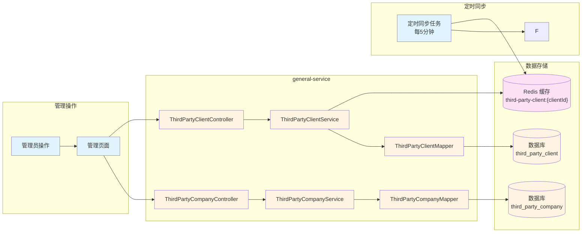
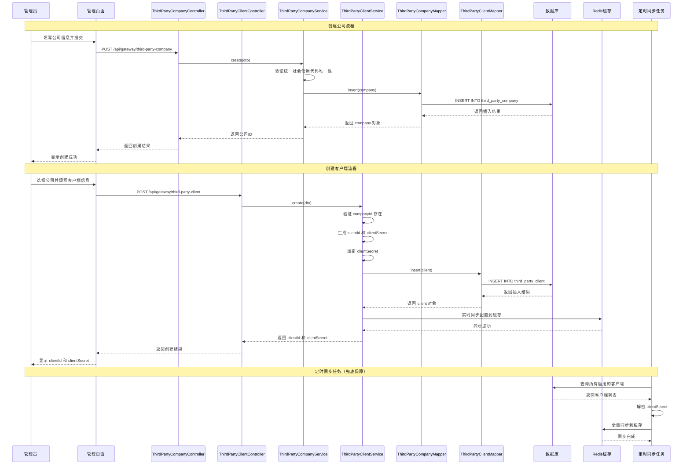
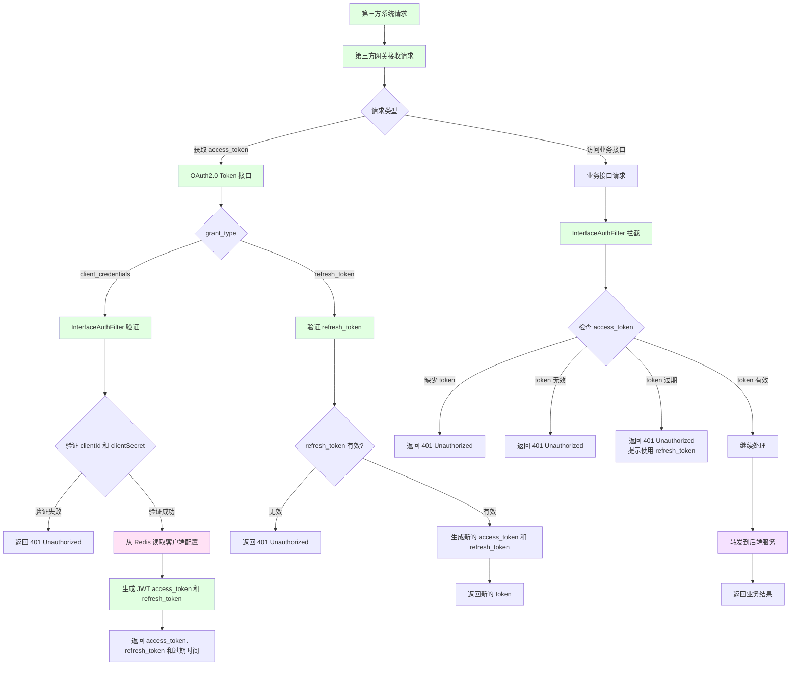
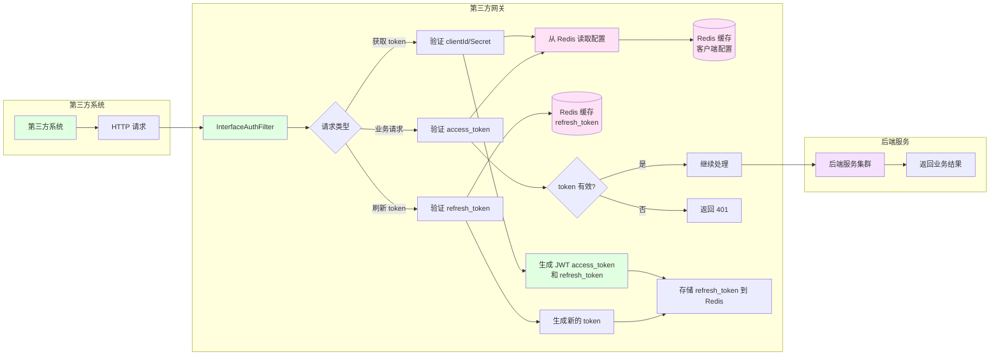
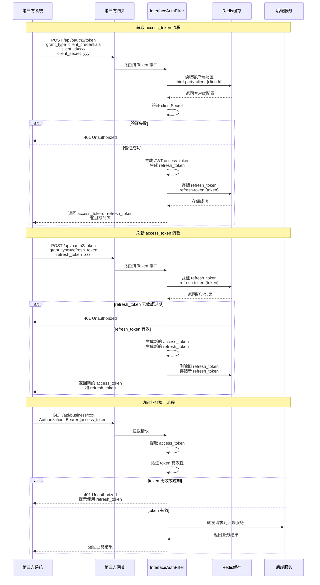
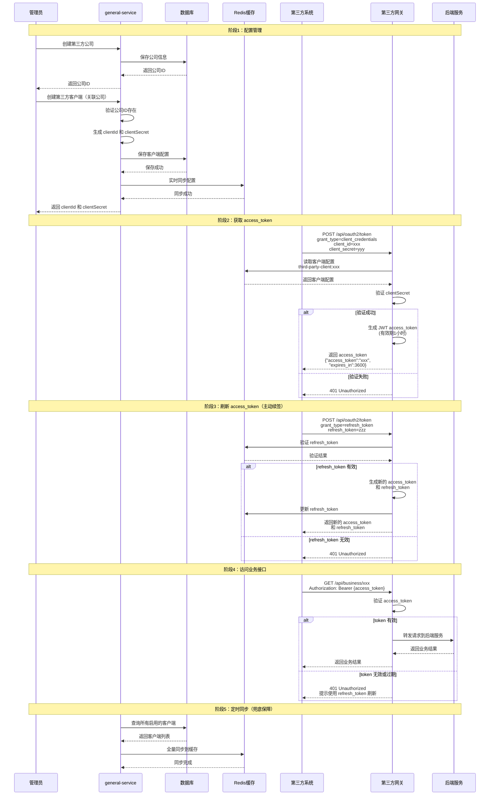
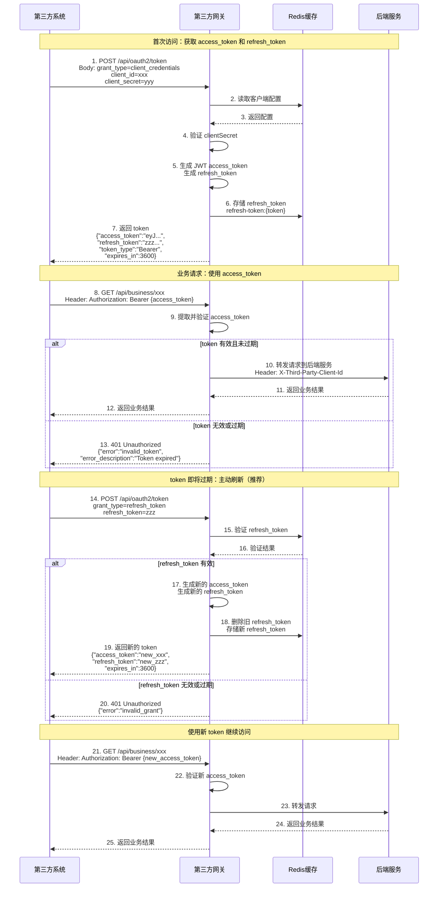

# 第三方系统 OAuth2.0 Client Credentials 认证架构设计文档

## 1. 概述

### 1.1 背景

为第三方系统提供统一的接口访问认证机制，采用 OAuth2.0 Client Credentials 模式，实现安全、高效的 API 访问控制。

### 1.2 设计目标

- **安全性**：第三方系统与自有系统完全隔离，互不影响
- **性能**：网关仅从 Redis 缓存读取配置，零数据库访问
- **可维护性**：通过管理界面统一管理第三方客户端配置
- **可扩展性**：支持多第三方系统接入，配置灵活

### 1.3 技术选型

- **认证协议**：OAuth2.0 Client Credentials 模式（RFC 6749）
- **令牌格式**：
  - **access_token**：JWT (JSON Web Token, RFC 7519) 格式，有效期 1 小时
  - **refresh_token**：随机字符串格式，存储在 Redis，有效期 30 天
  - 使用 HMAC256 签名算法确保 access_token 安全
  - 与自有系统 JWT token 技术栈保持一致，复用现有工具类
- **续签机制**：标准 OAuth2.0 refresh_token 方案
  - 第三方系统主动调用刷新接口获取新 token
  - 符合 OAuth2.0 标准实践，第三方系统可主动控制续签时机
- **配置管理**：general-service + 数据库 + Redis 缓存
- **数据库版本管理**：Liquibase
- **部署方案**：第三方网关独立部署

---

## 2. 整体架构

### 2.1 系统架构图



### 2.2 核心组件说明

| 组件 | 职责 | 技术实现 |
|------|------|----------|
| **管理页面** | 提供第三方公司信息和客户端配置的增删改查界面 | HTML + JavaScript / Vue / React |
| **general-service** | 管理第三方公司信息和客户端配置，提供 REST API | Spring Boot + MyBatis-Plus |
| **数据库** | 持久化存储第三方公司信息和客户端配置 | MySQL + Liquibase |
| **Redis 缓存** | 存储客户端配置，供网关快速读取 | Redis |
| **定时同步任务** | 定时全量同步数据库到 Redis（兜底保障） | Spring @Scheduled |
| **第三方网关** | 独立部署的网关服务，处理第三方系统请求 | Spring Cloud Gateway |
| **InterfaceAuthFilter** | OAuth2.0 认证过滤器，验证 access_token | Gateway Filter |

---

## 3. 管理侧方案

### 3.1 业务流程



### 3.2 数据流图



### 3.3 管理侧时序图



---

## 4. 网关侧方案

### 4.1 业务流程



### 4.2 数据流图



### 4.3 网关侧时序图



---

## 5. 第三方系统与网关交互流程

### 5.1 完整交互泳道图



### 5.2 第三方系统交互时序图



---

## 6. 数据模型设计

### 6.1 数据库表结构

#### 6.1.1 第三方公司信息表

**表名：`third_party_company`**

| 字段名 | 类型 | 说明 | 约束 |
|--------|------|------|------|
| id | BIGINT | 主键ID | PRIMARY KEY |
| company_name | VARCHAR(256) | 公司名称 | NOT NULL |
| company_code | VARCHAR(64) | 统一社会信用代码 | UNIQUE, NOT NULL |
| contact_name | VARCHAR(64) | 联系人姓名 | |
| contact_email | VARCHAR(128) | 联系人邮箱 | |
| contact_phone | VARCHAR(32) | 联系人电话 | |
| company_status | VARCHAR(32) | 公司状态 | DEFAULT 'NORMAL' |
| create_id | VARCHAR(64) | 创建人ID | |
| create_time | DATETIME | 创建时间 | |
| update_id | VARCHAR(64) | 更新人ID | |
| update_time | DATETIME | 更新时间 | |
| deleted | TINYINT(1) | 删除标识 | DEFAULT 0 |

**索引：**
- `idx_company_code` (company_code) - 统一社会信用代码唯一索引
- `idx_company_name` (company_name) - 公司名称索引
- `idx_company_status` (company_status) - 公司状态索引
- `idx_deleted` (deleted) - 删除标识索引

**说明：**
- 一个公司可以关联多个客户端（client_id）
- 公司信息相对稳定，变更频率较低
- 删除公司前需检查是否有关联的客户端

#### 6.1.2 第三方客户端表

**表名：`third_party_client`**

| 字段名 | 类型 | 说明 | 约束 |
|--------|------|------|------|
| id | BIGINT | 主键ID | PRIMARY KEY |
| company_id | BIGINT | 关联的公司ID | FOREIGN KEY, NOT NULL |
| client_id | VARCHAR(64) | 客户端ID（appId） | UNIQUE, NOT NULL |
| client_secret | VARCHAR(256) | 客户端密钥（加密存储） | NOT NULL |
| client_name | VARCHAR(128) | 客户端名称 | NOT NULL |
| description | VARCHAR(512) | 描述信息 | |
| scopes | VARCHAR(512) | 权限范围（JSON数组或逗号分隔） | |
| enabled | TINYINT(1) | 是否启用 | DEFAULT 1 |
| ip_whitelist | TEXT | IP白名单（JSON数组） | |
| token_valid_duration | INT | Token有效期（小时） | DEFAULT 24 |
| expiration_renewal_time | INT | 到期前续签时间（分钟） | DEFAULT 60 |
| contact_name | VARCHAR(64) | 联系人姓名 | |
| contact_email | VARCHAR(128) | 联系人邮箱 | |
| contact_phone | VARCHAR(32) | 联系人电话 | |
| create_id | VARCHAR(64) | 创建人ID | |
| create_time | DATETIME | 创建时间 | |
| update_id | VARCHAR(64) | 更新人ID | |
| update_time | DATETIME | 更新时间 | |
| deleted | TINYINT(1) | 删除标识 | DEFAULT 0 |

**索引：**
- `idx_company_id` (company_id) - 公司ID索引（外键）
- `idx_client_id` (client_id) - 客户端ID唯一索引
- `idx_enabled` (enabled) - 启用状态索引
- `idx_deleted` (deleted) - 删除标识索引

**外键约束：**
- `fk_client_company` (company_id) REFERENCES `third_party_company`(id)

**说明：**
- 每个客户端必须关联一个公司
- 一个公司可以拥有多个客户端
- 删除公司前需先删除或转移所有关联的客户端

### 6.2 Redis 缓存结构

#### 6.2.1 客户端配置缓存

**Key 格式：** `third-party-client:{clientId}`

**Value 结构（Hash）：**
```
third-party-client:client-001
  ├── clientId: "client-001"
  ├── clientSecret: "plain_secret_xxx"  (明文，用于验证)
  ├── clientName: "第三方系统A"
  ├── scopes: "read,write"
  ├── enabled: "true"
  ├── ipWhitelist: "[\"192.168.1.1\", \"10.0.0.0/8\"]"
  ├── tokenValidDuration: "1"  (小时)
  └── refreshTokenValidDuration: "720"  (小时，30天)
```

#### 6.2.2 Refresh Token 缓存

**Key 格式：** `refresh-token:{token_value}`

**Value 结构（Hash）：**
```
refresh-token:abc123def456...
  ├── clientId: "client-001"
  ├── scopes: "read,write"
  ├── issuedAt: "1234567890"
  ├── expiresAt: "1237246290"  (30天后)
  └── enabled: "true"
```

**TTL 设置**：与 refresh_token 有效期一致（如 30 天），Redis 自动过期清理

### 6.3 JWT Token 结构

#### 6.3.1 Token 格式说明

OAuth2.0 Client Credentials 模式签发的 `access_token` 采用 **JWT (JSON Web Token)** 格式。虽然 OAuth2.0 规范（RFC 6749）并未强制要求 access_token 必须是 JWT 格式，但使用 JWT 格式具有以下优势：

- **自包含性**：Token 本身包含客户端信息（client_id、scopes 等），无需查询数据库即可验证
- **无状态性**：网关无需存储 token 状态，支持水平扩展和高并发
- **可验证性**：通过 HMAC256 签名算法验证 token 的完整性和真实性
- **可解析性**：可直接从 token 中提取客户端信息和权限范围
- **技术统一**：与自有系统的 JWT token 保持技术栈一致，复用现有 `JwtUtils` 工具类

#### 6.3.2 JWT 结构定义

**Header（头部）：**
```json
{
  "alg": "HS256",    // 签名算法：HMAC SHA256
  "typ": "JWT"       // Token 类型：JSON Web Token
}
```

**Payload（载荷）：**
```json
{
  "client_id": "client-001",              // 客户端ID（必需）
  "scopes": ["read", "write"],            // 权限范围（必需）
  "iat": 1234567890,                      // 签发时间（Issued At）
  "exp": 1234654290,                      // 过期时间（Expiration Time）
  "jti": "550e8400-e29b-41d4-a716-446655440000",  // JWT ID（用于防重放）
  "iss": "Richie Gateway",                // 签发者（Issuer）
  "sub": "client_credentials",            // 主题（Subject），标识 OAuth2.0 模式
  "aud": "api.abc.com"                 // 受众（Audience），API 服务地址
}
```

#### 6.3.5 Refresh Token 说明

**Refresh Token 特点：**
- **格式**：随机字符串（非 JWT），存储在 Redis 中
- **有效期**：通常比 access_token 更长（如 30 天）
- **用途**：用于获取新的 access_token，无需重新提供 client_secret
- **存储位置**：Redis，Key 格式：`refresh-token:{token_value}`
- **安全要求**：refresh_token 必须安全存储，不能泄露

**Refresh Token 存储结构（Redis）：**
```
refresh-token:abc123def456...
  ├── clientId: "client-001"
  ├── scopes: "read,write"
  ├── issuedAt: 1234567890
  ├── expiresAt: 1237246290  (30天后)
  └── enabled: "true"
```

**Signature（签名）：**
```
HMACSHA256(
  base64UrlEncode(header) + "." +
  base64UrlEncode(payload),
  secret
)
```

#### 6.3.3 与自有系统 JWT 的区别

| 特性 | 自有系统 JWT | 第三方系统 JWT |
|------|-------------|---------------|
| **用户标识** | `username` | `client_id` |
| **租户信息** | `tenantCode`（可选） | 无 |
| **权限范围** | 用户角色权限 | `scopes`（OAuth2.0 标准） |
| **签发密钥** | 自有系统专用密钥 | 第三方系统专用密钥 |
| **Subject** | `"Interactive token"` | `"client_credentials"` |
| **Audience** | 用户名 | API 服务地址 |
| **用途** | 用户登录认证 | OAuth2.0 Client Credentials 认证 |

#### 6.3.4 Token 生成示例

```java
// 为第三方系统生成 JWT access_token
public static String generateThirdPartyAccessToken(
    String clientId, 
    List<String> scopes, 
    String secret, 
    long expiredTime) {
    
    var algorithm = Algorithm.HMAC256(secret);
    var builder = JWT.create()
            .withClaim("client_id", clientId)
            .withClaim("scopes", scopes)
            .withIssuedAt(new Date())
            .withExpiresAt(new Date(expiredTime))
            .withJWTId(UUID.randomUUID().toString())
            .withIssuer("Richie Gateway")
            .withSubject("client_credentials")
            .withAudience("api.abc.com");
    
    return builder.sign(algorithm);
}

// 生成 refresh_token（随机字符串）
public static String generateRefreshToken() {
    return UUID.randomUUID().toString().replace("-", "") + 
           SecureRandom.getInstanceStrong().nextLong();
}
```

---

## 7. 安全设计

### 7.1 密钥管理

- **数据库存储**：`clientSecret` 加密存储（使用平台加密工具）
- **Redis 缓存**：存储明文 `clientSecret`（仅用于快速验证）
- **传输安全**：所有接口使用 HTTPS

### 7.2 访问控制

- **IP 白名单**：支持配置 IP 白名单（可选）
- **权限范围**：通过 `scopes` 控制访问权限
- **启用/禁用**：支持动态启用/禁用客户端

### 7.3 Token 安全

#### 7.3.1 JWT Token 安全特性

- **签名验证**：使用 HMAC256 算法对 token 进行签名，确保 token 未被篡改
- **有效期控制**：access_token 默认 1 小时有效期，通过 `exp` 字段控制
- **防重放攻击**：通过 `jti` (JWT ID) 字段唯一标识每个 token，支持黑名单机制
- **密钥隔离**：第三方系统使用独立的签名密钥，与自有系统 JWT 密钥分离
- **Token 黑名单**：支持将 token 加入黑名单（可选），用于主动撤销 token

#### 7.3.2 Refresh Token 安全特性

- **独立存储**：refresh_token 存储在 Redis 中，与 access_token 分离
- **更长有效期**：refresh_token 有效期通常为 30 天，比 access_token 更长
- **一次性使用**：每次使用 refresh_token 获取新 token 后，旧的 refresh_token 失效
- **客户端绑定**：refresh_token 与 client_id 绑定，防止跨客户端使用
- **权限范围保持**：使用 refresh_token 获取的新 access_token 保持原有 scopes
- **主动撤销**：支持将 refresh_token 加入黑名单，立即失效
- **并发刷新保护**：使用 Redis 分布式锁 + Lua 脚本原子操作，防止并发刷新导致的安全问题
  - 问题：如果第三方系统并发调用刷新接口，可能导致多个请求同时验证通过，生成多个新的 refresh_token
  - 解决方案：使用分布式锁确保同一 refresh_token 只能被一个请求处理，使用 Lua 脚本确保验证和删除的原子性

#### 7.3.3 Token 验证流程

**Access Token 验证流程：**
1. **提取 Token**：从请求头 `Authorization: Bearer {access_token}` 中提取
2. **验证签名**：使用第三方系统专用密钥验证 token 签名
3. **验证有效期**：检查 `exp` 字段，确保 token 未过期
4. **验证客户端**：从 token 中提取 `client_id`，验证客户端是否启用
5. **验证权限**：检查 `scopes` 字段，验证客户端是否有权限访问该资源
6. **黑名单检查**：检查 token 是否在黑名单中（可选）

**Refresh Token 验证流程（含并发保护）：**
1. **获取分布式锁**：使用 `refresh-token-lock:{token}` 作为锁键，防止并发刷新
2. **提取 Token**：从请求参数 `refresh_token` 中提取
3. **原子验证和删除**：使用 Lua 脚本原子性地验证 refresh_token 存在性并从 Redis 删除
4. **验证客户端**：验证 refresh_token 绑定的 client_id 是否匹配
5. **验证启用状态**：检查 refresh_token 是否被禁用或撤销
6. **生成新 Token**：验证通过后，生成新的 access_token 和 refresh_token
7. **更新存储**：存储新的 refresh_token
8. **释放锁**：释放分布式锁

**并发刷新保护实现示例：**
```java
public TokenResponse refreshToken(String refreshToken) {
    String lockKey = "refresh-token-lock:" + refreshToken;
    
    // 1. 获取分布式锁（防止并发刷新）
    if (!GlobalCache.pessimisticLockWithRenewal(lockKey, 5, TimeUnit.SECONDS)) {
        throw new BusinessException("刷新令牌正在处理中，请稍后重试");
    }
    
    try {
        // 2. 原子性验证和删除（使用 Lua 脚本）
        String luaScript = 
            "if redis.call('exists', KEYS[1]) == 1 then " +
            "  local data = redis.call('hgetall', KEYS[1]); " +
            "  redis.call('del', KEYS[1]); " +
            "  return data; " +
            "else " +
            "  return nil; " +
            "end";
        
        // 3. 执行原子操作
        Map<String, String> tokenData = executeLuaScript(luaScript, refreshTokenKey);
        
        if (tokenData == null) {
            throw new BusinessException("invalid_grant", "刷新令牌无效或已使用");
        }
        
        // 4. 生成新 token
        return generateNewTokens(tokenData);
    } finally {
        // 5. 释放锁
        GlobalCache.releaseLock(lockKey);
    }
}
```

#### 7.3.4 错误信息泄露防护

**问题描述：**
- 错误响应可能泄露敏感信息（如 client_id 是否存在）
- 攻击者可能通过错误信息枚举有效的 client_id

**解决方案：**
- **统一错误响应格式**：符合 OAuth2.0 标准（RFC 6749）
- **不区分错误类型**：client_id 不存在和 client_secret 错误统一返回 `invalid_client`
- **标准错误码**：
  - `invalid_request`：请求参数缺失或格式错误
  - `invalid_client`：客户端认证失败（不区分 client_id 或 secret）
  - `invalid_grant`：授权码、refresh_token 等无效
  - `unauthorized_client`：客户端无权使用此授权类型
  - `unsupported_grant_type`：不支持的 grant_type
  - `invalid_scope`：请求的 scope 无效
  - `invalid_token`：访问令牌无效或已过期
  - `rate_limit_exceeded`：请求过于频繁

**标准错误响应格式：**
```json
{
  "error": "invalid_client",
  "error_description": "客户端认证失败",
  "error_uri": "https://docs.richie696.cn/oauth2/errors#invalid_client"
}
```

#### 7.3.5 Token 撤销机制

**撤销接口：**
```java
@PostMapping("/api/oauth2/revoke")
public ResultVO<Void> revokeToken(@RequestParam String token) {
    // 1. 验证 token 类型（access_token 或 refresh_token）
    // 2. 将 token 加入黑名单
    // 3. 如果是 refresh_token，从 Redis 删除
    // 4. 记录撤销日志
}
```

**撤销场景：**
- 第三方系统主动撤销已泄露的 token
- 管理员强制撤销某个客户端的 token
- 客户端密钥重置后，自动撤销所有相关 token

#### 7.3.6 密钥轮换机制

**配置示例：**
```yaml
platform:
  gateway:
    interface-auth:
      token-secret: "current-secret"
      token-secret-rotation:
        enabled: true
        rotation-interval-days: 90  # 90天轮换一次
        previous-secrets:           # 保留旧密钥用于验证（支持多版本）
          - "previous-secret-1"
          - "previous-secret-2"
```

**轮换策略：**
- 定期轮换签名密钥（建议 90 天）
- 保留旧密钥用于验证已签发的 token（支持多版本密钥）
- 新签发的 token 使用新密钥
- 旧 token 在过期前仍可使用旧密钥验证

#### 7.3.7 安全最佳实践

- **HTTPS 传输**：所有 token 传输必须使用 HTTPS，防止中间人攻击
- **密钥管理**：签名密钥定期轮换，使用强随机密钥
- **Token 存储**：
  - access_token：客户端内存存储，使用后立即清除
  - refresh_token：客户端安全存储（加密存储或安全密钥库）
- **最小权限原则**：为每个客户端分配最小必要的 `scopes` 权限
- **Token 轮换**：每次使用 refresh_token 后，旧的 refresh_token 立即失效
- **监控告警**：监控异常 token 使用情况（如频繁刷新、异常 IP），及时告警
- **定期刷新**：建议第三方系统在 access_token 到期前主动刷新，避免业务中断
- **错误信息保护**：统一错误响应格式，不泄露敏感信息
- **并发保护**：使用分布式锁和原子操作防止并发刷新问题

---

## 8. 性能优化与限流

### 8.1 限流机制

**问题描述：**
- Token 接口缺少限流保护，可能导致暴力破解攻击或资源耗尽

**限流策略：**
- **Token 接口（按 client_id）**：10 次/分钟
- **Token 接口（按 IP）**：30 次/分钟（未认证请求）
- **Refresh Token 接口**：5 次/分钟（防止频繁刷新）
- **业务接口**：根据客户端配置的 QPS 限制

**实现示例：**
```java
@Component
public class InterfaceAuthFilter extends AbstractBaseFilter {
    
    @Override
    public Mono<Void> doFilter(ServerWebExchange exchange, GatewayFilterChain chain) {
        String path = exchange.getRequest().getURI().getPath();
        
        // Token 接口限流
        if (path.equals("/api/oauth2/token")) {
            String clientId = extractClientId(exchange);
            String ip = getClientIp(exchange);
            
            // 按 client_id 限流：每分钟最多 10 次
            String limitKey = "token-limit:client:" + clientId;
            if (!GlobalCache.tryAcquire(limitKey, 10, 60)) {
                return NetworkUtils.returnError(
                    exchange.getResponse(), 
                    HttpStatus.TOO_MANY_REQUESTS,
                    OAuth2ErrorResponse.rateLimitExceeded()
                );
            }
            
            // 按 IP 限流：每分钟最多 30 次（防止未认证的暴力破解）
            String ipLimitKey = "token-limit:ip:" + ip;
            if (!GlobalCache.tryAcquire(ipLimitKey, 30, 60)) {
                return NetworkUtils.returnError(
                    exchange.getResponse(), 
                    HttpStatus.TOO_MANY_REQUESTS,
                    OAuth2ErrorResponse.rateLimitExceeded()
                );
            }
        }
        
        return chain.filter(exchange);
    }
}
```

### 8.2 缓存预热和降级

**缓存预热：**
```java
@PostConstruct
public void warmupCache() {
    // 从数据库加载所有启用的客户端配置到 Redis
    // 确保服务启动后缓存已就绪
}
```

**缓存降级策略：**
- **优先从 Redis 读取**：正常情况下从 Redis 读取客户端配置
- **降级到数据库**：Redis 不可用时，临时从数据库读取（仅限紧急情况）
- **记录告警**：降级时记录告警日志，便于运维人员及时处理

**实现示例：**
```java
public ThirdPartyClientConfig getClientConfig(String clientId) {
    // 优先从 Redis 读取
    ThirdPartyClientConfig config = getFromRedis(clientId);
    if (config != null) {
        return config;
    }
    
    // Redis 不可用时，降级到数据库（记录告警）
    if (isRedisDown()) {
        log.warn("Redis 不可用，降级到数据库读取: clientId={}", clientId);
        return getFromDatabase(clientId);
    }
    
    return null;
}
```

### 8.3 Refresh Token 批量清理

**问题描述：**
- 过期的 refresh_token 依赖 Redis TTL 自动清理
- 如果大量 refresh_token 过期，可能占用 Redis 内存

**解决方案：**
```java
// 定时任务：清理过期的 refresh_token
@Scheduled(cron = "0 0 2 * * ?")  // 每天凌晨 2 点执行
public void cleanupExpiredRefreshTokens() {
    // 扫描所有 refresh-token:* 键
    // 检查过期时间，删除已过期的 token
    // 记录清理数量
}
```

---

## 9. 部署方案

### 8.1 部署架构

```
┌─────────────────────────────────────────────────────────┐
│  管理侧（general-service）                                │
│  - 管理接口（REST API）                                   │
│  - 管理页面（HTML/前端）                                  │
│  - 定时同步任务                                           │
│  - 数据库连接（MySQL）                                    │
│  - Redis 连接（写入）                                     │
└─────────────────────────────────────────────────────────┘

┌─────────────────────────────────────────────────────────┐
│  第三方网关（独立部署）                                    │
│  - InterfaceAuthFilter（OAuth2.0 认证）                   │
│  - 路由转发                                               │
│  - Redis 连接（只读）                                     │
│  - 无数据库连接                                           │
└─────────────────────────────────────────────────────────┘

┌─────────────────────────────────────────────────────────┐
│  后端服务集群                                             │
│  - 业务服务A                                              │
│  - 业务服务B                                              │
│  - 业务服务C                                              │
└─────────────────────────────────────────────────────────┘
```

### 8.2 配置隔离

- **第三方网关**：独立配置文件，不包含自有系统相关配置
- **过滤器启用**：第三方网关只启用必要的过滤器
- **性能隔离**：第三方系统访问不影响自有系统性能

---

## 10. 监控与运维

### 10.1 关键指标监控

**核心指标：**
- **Token 签发量**：每分钟签发的 access_token 数量
- **Token 刷新量**：每分钟刷新的 refresh_token 数量
- **认证失败率**：认证失败的请求占比（按错误类型分类）
- **缓存命中率**：Redis 缓存命中率
- **同步任务执行情况**：定时同步任务执行状态
- **限流触发次数**：限流机制触发的次数
- **异常 IP 访问统计**：异常 IP 的访问频率和失败次数
- **客户端活跃度统计**：各客户端的 token 使用频率

**指标采集实现：**
```java
@Component
public class OAuth2Metrics {
    
    // Token 签发计数器
    private final Counter tokenIssuedCounter;
    
    // Token 刷新计数器
    private final Counter tokenRefreshedCounter;
    
    // 认证失败计数器（按错误类型）
    private final Counter authFailureCounter;
    
    // 限流触发计数器
    private final Counter rateLimitCounter;
    
    public void recordTokenIssued(String clientId) {
        tokenIssuedCounter.increment("client_id", clientId);
    }
    
    public void recordAuthFailure(String clientId, String errorType) {
        authFailureCounter.increment("client_id", clientId, "error", errorType);
    }
}
```

### 10.2 告警规则

**告警阈值建议：**
- **认证失败率 > 10%**：可能存在攻击或配置错误
- **同一 IP 认证失败 > 50 次/小时**：可能存在暴力破解
- **Refresh Token 刷新失败率 > 5%**：可能存在 token 泄露
- **Token 签发量异常增长 > 200%**：可能存在异常访问
- **Redis 缓存命中率 < 90%**：缓存可能存在问题
- **同步任务失败**：数据同步异常，需要立即处理

### 10.3 健康检查接口

**健康检查接口：**
```java
@GetMapping("/api/oauth2/health")
public ResultVO<Map<String, Object>> health() {
    Map<String, Object> health = new HashMap<>();
    health.put("status", "UP");
    health.put("redis", checkRedisHealth());
    health.put("cache", checkCacheHealth());
    health.put("timestamp", System.currentTimeMillis());
    return ResultVO.success(health);
}
```

**健康检查项：**
- Redis 连接状态
- 缓存可用性
- 同步任务状态
- 服务整体状态

### 10.4 日志记录

**日志分类：**
- **管理操作日志**：记录所有客户端配置的增删改操作（包含操作人、操作时间、操作内容）
- **认证日志**：记录 token 签发和验证过程（包含 client_id、IP、时间、结果）
- **异常日志**：记录认证失败、同步失败等异常情况（包含错误类型、错误详情）
- **审计日志**：记录所有安全相关操作（包含 token 撤销、密钥重置等）

**审计日志实现：**
```java
@Aspect
public class OAuth2AuditAspect {
    
    @Around("@annotation(OAuth2Operation)")
    public Object audit(ProceedingJoinPoint joinPoint) {
        String operation = getOperation(joinPoint);
        String clientId = extractClientId(joinPoint);
        String ip = getClientIp(joinPoint);
        
        try {
            Object result = joinPoint.proceed();
            // 记录成功日志
            auditLogService.logSuccess(operation, clientId, ip);
            return result;
        } catch (Exception e) {
            // 记录失败日志（包含错误类型）
            auditLogService.logFailure(operation, clientId, ip, e);
            throw e;
        }
    }
}
```

---

## 11. 配置管理优化

### 11.1 客户端配置版本化

**问题描述：**
- 客户端配置变更后，无法回滚
- 缺少配置变更历史

**解决方案：**
```sql
-- 添加配置版本表
CREATE TABLE third_party_client_history (
    id BIGINT PRIMARY KEY,
    client_id VARCHAR(64) NOT NULL,
    config_snapshot TEXT,  -- JSON 格式的配置快照
    change_type VARCHAR(32),  -- CREATE/UPDATE/DELETE
    change_reason VARCHAR(512),
    operator_id VARCHAR(64),
    change_time DATETIME,
    INDEX idx_client_id (client_id),
    INDEX idx_change_time (change_time)
);
```

**功能特性：**
- 记录每次配置变更的完整快照
- 支持配置回滚
- 提供配置变更历史查询
- 记录变更原因和操作人

### 11.2 配置模板和批量操作（可选）

**配置模板：**
```java
@Data
public class ClientConfigTemplate {
    private String templateName;
    private String scopes;
    private Integer tokenValidDuration;
    private Integer refreshTokenValidDuration;
    // ...
}
```

**批量创建：**
```java
@PostMapping("/api/gateway/third-party-client/batch")
public ResultVO<List<Long>> batchCreate(@RequestBody List<ThirdPartyClientDTO> clients) {
    // 批量创建客户端
}
```

---

## 12. 实施计划

### 12.1 开发阶段

1. **Phase 1：数据库与模型**
   - 创建 Liquibase changelog（公司表、客户端表）
   - 创建实体类（ThirdPartyCompany、ThirdPartyClient）
   - 创建 DTO、VO 类
   - 创建 Mapper 接口

2. **Phase 2：管理功能**
   - **公司信息管理**
     - 实现 ThirdPartyCompanyService 业务逻辑
     - 实现 ThirdPartyCompanyController REST API
     - 实现公司信息的增删改查功能
   - **客户端管理**
     - 实现 ThirdPartyClientService 业务逻辑（增加公司关联验证）
     - 实现 ThirdPartyClientController REST API
     - 实现客户端信息的增删改查功能
   - **管理页面（前端）**
     - 实现公司信息管理页面
     - 实现客户端管理页面（支持选择关联公司）

3. **Phase 3：网关功能**
   - 重构 InterfaceAuthFilter
   - 实现 OAuth2.0 Token 接口
   - 实现 access_token 验证和续签

4. **Phase 4：同步机制**
   - 实现实时同步逻辑
   - 实现定时同步任务
   - 测试数据一致性

### 12.2 测试阶段

- **单元测试**：Service、Filter 等核心逻辑
- **集成测试**：端到端流程测试
- **性能测试**：网关性能、缓存性能
- **安全测试**：认证安全、数据安全

### 12.3 上线阶段

- **灰度发布**：先上线管理功能，再上线网关功能
- **监控告警**：配置关键指标监控和告警
- **文档交付**：API 文档、使用手册

---

### 12.4 改进优先级

**🔴 高优先级（必须实现）：**
1. ✅ Refresh Token 并发刷新问题（使用分布式锁 + 原子操作）
2. ✅ 错误信息泄露风险（统一错误响应格式）
3. ✅ 限流机制（防止暴力破解和资源耗尽）
4. ✅ OAuth2.0 标准错误响应（符合 RFC 6749）
5. ✅ 关键指标监控和告警

**🟡 中优先级（建议实现）：**
1. Refresh Token 撤销机制
2. 密钥轮换机制
3. 缓存降级策略
4. 错误日志和审计
5. 配置版本管理
6. 健康检查接口

**🟢 低优先级（可选实现）：**
1. Refresh Token 批量清理
2. 配置模板和批量操作
3. Token 使用统计
4. 多环境支持

---

## 13. 附录

### 13.1 参考文档

- [OAuth2.0 RFC 6749](https://tools.ietf.org/html/rfc6749)
- [JWT RFC 7519](https://tools.ietf.org/html/rfc7519)
- [Liquibase 官方文档](https://docs.liquibase.com/)

### 13.2 术语表

| 术语 | 说明 |
|------|------|
| **company_id** | 公司ID，关联到第三方公司信息表 |
| **company_code** | 统一社会信用代码，唯一标识第三方公司 |
| **client_id** | 客户端标识符，唯一标识第三方系统 |
| **client_secret** | 客户端密钥，用于验证客户端身份 |
| **access_token** | 访问令牌，用于访问受保护的资源（JWT 格式，有效期较短，如 1 小时） |
| **refresh_token** | 刷新令牌，用于获取新的 access_token（随机字符串，有效期较长，如 30 天） |
| **scopes** | 权限范围，定义客户端可以访问的资源 |
| **JWT** | JSON Web Token，一种紧凑的、URL 安全的令牌格式 |
| **grant_type** | 授权类型，OAuth2.0 中指定获取 token 的方式（如 client_credentials、refresh_token） |

---

**文档版本：** v1.0  
**编写日期：** 2025-01-XX  
**作者：** richie696
