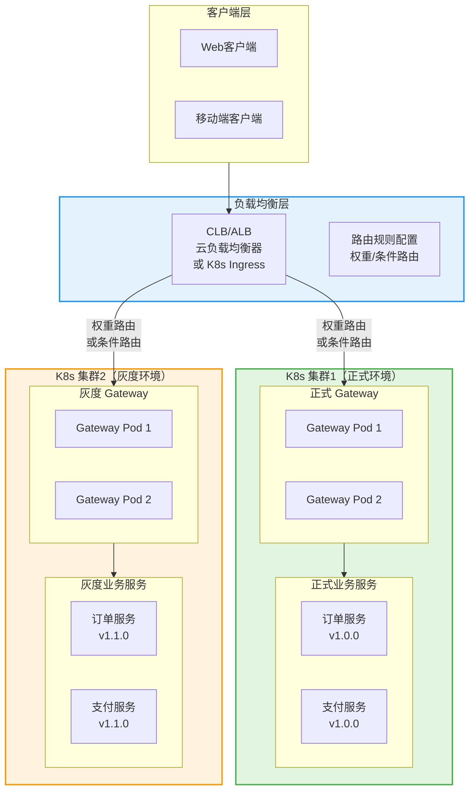
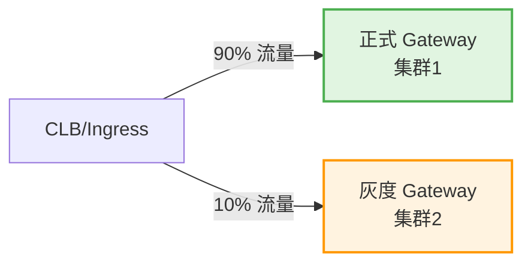
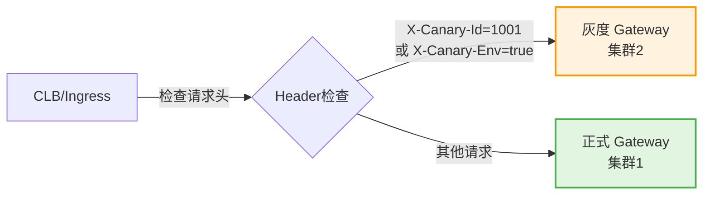
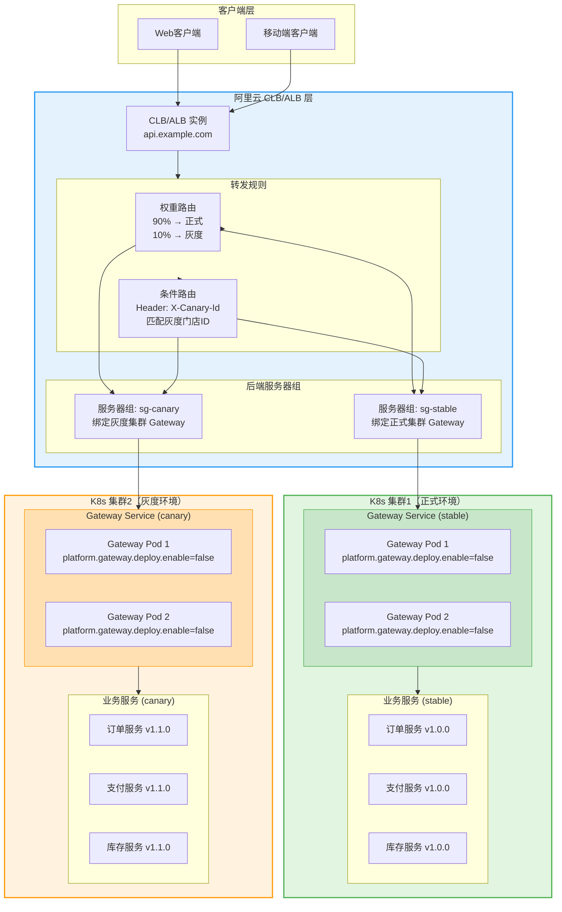

# 基于 K8s Ingress / CLB 的灰度发布方案（折中方案）

> **作者：** 王锦阳  
> **日期：** 2025-12-09  
> **适用场景：** 多版本架构并存，无法统一升级到 4.6.0 架构版本的项目

## 一、方案背景

### 问题场景

在跨1-2年周期、分多个部分迭代的项目中：
- ❌ 底层架构不统一（部分服务是旧版本，部分是新版本）
- ❌ 统一升级到 4.6.0 架构版本改造工作量过大（40个微服务）
- ❌ 无法使用基于 Gateway + Nacos 的统一灰度方案
- ❌ 需要快速实现灰度发布能力

### 折中方案

**使用 K8s Ingress / CLB（云负载均衡器）做前置路由，实现灰度发布：**
- ✅ 不需要统一底层架构
- ✅ 不需要修改业务代码
- ✅ 通过基础设施层实现灰度路由
- ✅ 改造工作量最小

## 二、方案架构

### 2.1 整体架构



### 2.2 路由策略

**策略 1：权重路由（Weight-based Routing）**



**策略 2：条件路由（Header-based Routing）**



## 三、实施方案

### 3.1 方案 A：使用 K8s Ingress（推荐）

**适用场景：**

- 使用 K8s 原生 Ingress Controller（如 Nginx Ingress、Traefik、Istio Gateway）
- 需要灵活的规则配置和动态更新

#### 3.1.1 Nginx Ingress 配置示例

**权重路由配置：**

```yaml
apiVersion: networking.k8s.io/v1
kind: Ingress
metadata:
  name: gateway-canary-ingress
  namespace: production
  annotations:
    # 使用 Nginx Ingress 的 canary 功能
    nginx.ingress.kubernetes.io/canary: "true"
    nginx.ingress.kubernetes.io/canary-weight: "10"  # 10% 流量到灰度
spec:
  ingressClassName: nginx
  rules:
  - host: api.example.com
    http:
      paths:
      - path: /
        pathType: Prefix
        backend:
          service:
            name: gateway-service-canary  # 灰度 Gateway Service
            port:
              number: 8080
---
apiVersion: networking.k8s.io/v1
kind: Ingress
metadata:
  name: gateway-stable-ingress
  namespace: production
spec:
  ingressClassName: nginx
  rules:
  - host: api.example.com
    http:
      paths:
      - path: /
        pathType: Prefix
        backend:
          service:
            name: gateway-service-stable  # 正式 Gateway Service
            port:
              number: 8080
```

**条件路由配置（基于 Header）：**

```yaml
apiVersion: networking.k8s.io/v1
kind: Ingress
metadata:
  name: gateway-canary-ingress
  namespace: production
  annotations:
    nginx.ingress.kubernetes.io/canary: "true"
    # 基于 Header 的条件路由
    nginx.ingress.kubernetes.io/canary-by-header: "X-Canary-Id"
    nginx.ingress.kubernetes.io/canary-by-header-value: "1001,1002,1003"  # 灰度门店ID列表
    # 或者使用正则表达式
    # nginx.ingress.kubernetes.io/canary-by-header-pattern: "^100[1-3]$"
spec:
  ingressClassName: nginx
  rules:
  - host: api.example.com
    http:
      paths:
      - path: /
        pathType: Prefix
        backend:
          service:
            name: gateway-service-canary
            port:
              number: 8080
```

**条件路由配置（基于 Cookie）：**

```yaml
apiVersion: networking.k8s.io/v1
kind: Ingress
metadata:
  name: gateway-canary-ingress
  namespace: production
  annotations:
    nginx.ingress.kubernetes.io/canary: "true"
    nginx.ingress.kubernetes.io/canary-by-cookie: "canary"
spec:
  ingressClassName: nginx
  rules:
  - host: api.example.com
    http:
      paths:
      - path: /
        pathType: Prefix
        backend:
          service:
            name: gateway-service-canary
            port:
              number: 8080
```

#### 3.1.2 Traefik IngressRoute 配置示例

```yaml
apiVersion: traefik.containo.us/v1alpha1
kind: IngressRoute
metadata:
  name: gateway-canary-route
  namespace: production
spec:
  entryPoints:
  - web
  routes:
  - match: Host(`api.example.com`)
    kind: Rule
    services:
    # 权重路由
    - name: gateway-service-stable
      port: 8080
      weight: 90
    - name: gateway-service-canary
      port: 8080
      weight: 10
    # 或者条件路由
    # - match: Host(`api.example.com`) && Headers(`X-Canary-Id`, `1001|1002|1003`)
    #   kind: Rule
    #   services:
    #   - name: gateway-service-canary
    #     port: 8080
```

#### 3.1.3 Istio VirtualService 配置示例

```yaml
apiVersion: networking.istio.io/v1beta1
kind: VirtualService
metadata:
  name: gateway-route
  namespace: production
spec:
  hosts:
  - api.example.com
  http:
  # 条件路由：基于 Header
  - match:
    - headers:
        x-canary-id:
          regex: "1001|1002|1003"
    route:
    - destination:
        host: gateway-service-canary
        port:
          number: 8080
      weight: 100
  # 默认路由：正式环境
  - route:
    - destination:
        host: gateway-service-stable
        port:
          number: 8080
      weight: 100
```

### 3.2 方案 B：使用云负载均衡器（阿里云 CLB/ALB）【无需改动业务代码】

**适用场景：**

- 项目存在多版本架构并存，无法统一升级到 4.6.0
- 只需要对入口 HTTP 流量做灰度，不改业务代码
- 可以接受增加一套集群的资源成本

**⚠️ 重要说明：**

- **Gateway 无需配置灰度功能**：灰度路由完全由云负载均衡器（CLB/ALB）在入口层完成
- **Gateway 保持原有配置**：正式集群和灰度集群的 Gateway 都使用相同的配置，无需开启 `platform.gateway.deploy.enable`
- **灰度逻辑在基础设施层**：CLB/ALB 根据权重或条件（Header）将流量路由到不同集群，Gateway 只负责接收和转发请求

#### 3.2.1 部署架构图（阿里云 CLB/ALB）

**完整部署架构：**



**关键说明：**
- ✅ **CLB/ALB 负责灰度路由**：根据权重或条件（Header）将流量分发到不同集群
- ✅ **Gateway 无需配置灰度**：两个集群的 Gateway 都设置 `platform.gateway.deploy.enable: false`
- ✅ **Gateway 只负责转发**：接收 CLB/ALB 转发的请求，转发到后端业务服务
- ✅ **业务服务无需改动**：保持原有配置，无需任何代码修改

#### 3.2.2 配置思路（阿里云 SLB/ALB）

**核心原则：Gateway 无需配置灰度功能，灰度路由由 CLB/ALB 完成**

1) **准备两个后端服务器组（RS Group）**
   - `sg-stable`：指向集群1的 Gateway Service（或直接业务 Service）
   - `sg-canary`：指向集群2的 Gateway Service（或灰度业务 Service）
   
   **注意：** 两个集群的 Gateway 配置相同，都设置 `platform.gateway.deploy.enable: false`

2) **权重路由配置（SLB 7 层转发）**

**通过阿里云控制台配置：**
1. 登录阿里云控制台 → 传统型负载均衡 SLB
2. 选择 SLB 实例 → 监听 → 添加监听（HTTP/HTTPS）
3. 配置转发规则：
   - 域名：`api.example.com`
   - URL：`/`
   - 后端服务器组1：`sg-stable`，权重：90
   - 后端服务器组2：`sg-canary`，权重：10

**通过 Terraform 配置：**
```hcl
# 创建后端服务器组
resource "alicloud_slb_server_group" "stable" {
  load_balancer_id = "lb-xxx"
  name             = "sg-stable"
  servers {
    server_ids = ["ecs-stable-1", "ecs-stable-2"]
    port       = 8080
    weight     = 100
  }
}

resource "alicloud_slb_server_group" "canary" {
  load_balancer_id = "lb-xxx"
  name             = "sg-canary"
  servers {
    server_ids = ["ecs-canary-1"]
    port       = 8080
    weight     = 100
  }
}

# 配置转发规则（权重路由）
resource "alicloud_slb_rule" "canary_rule" {
  load_balancer_id = "lb-xxx"
  frontend_port    = 80
  domain           = "api.example.com"
  url              = "/"
  
  # 后端服务器组1：正式环境（权重 90%）
  server_group_id_1 = alicloud_slb_server_group.stable.id
  weight_1          = 90
  
  # 后端服务器组2：灰度环境（权重 10%）
  server_group_id_2 = alicloud_slb_server_group.canary.id
  weight_2          = 10
}
```

3) **条件路由配置（ALB 转发规则）【推荐】**

**通过阿里云控制台配置：**
1. 登录阿里云控制台 → 应用型负载均衡 ALB
2. 选择 ALB 实例 → 监听 → 添加转发规则
3. **规则1：灰度流量（优先级 100）**
   - 条件类型：Header
   - Header 名称：`X-Canary-Id`
   - 匹配值：`1001,1002,1003`（灰度门店ID列表，逗号分隔）
   - 动作：转发到服务器组 `sg-canary`，权重：100
4. **规则2：默认流量（优先级 200）**
   - 条件类型：默认
   - 动作：转发到服务器组 `sg-stable`，权重：100

**通过 Terraform 配置：**
```hcl
# 创建后端服务器组
resource "alicloud_alb_server_group" "stable" {
  load_balancer_id = "alb-xxx"
  server_group_name = "sg-stable"
  protocol          = "HTTP"
  vpc_id           = "vpc-xxx"
  
  servers {
    server_id = "ecs-stable-1"
    port      = 8080
    weight    = 100
  }
  servers {
    server_id = "ecs-stable-2"
    port      = 8080
    weight    = 100
  }
}

resource "alicloud_alb_server_group" "canary" {
  load_balancer_id = "alb-xxx"
  server_group_name = "sg-canary"
  protocol          = "HTTP"
  vpc_id           = "vpc-xxx"
  
  servers {
    server_id = "ecs-canary-1"
    port      = 8080
    weight    = 100
  }
}

# 规则1：灰度流量（优先级 100，优先匹配）
resource "alicloud_alb_rule" "canary_rule" {
  listener_id = "lsn-xxx"
  priority    = 100
  
  # 条件：Header X-Canary-Id 匹配灰度门店ID
  rule_conditions {
    type = "Header"
    header_config {
      key    = "X-Canary-Id"
      values = ["1001", "1002", "1003"]  # 灰度门店ID列表
    }
  }
  
  # 动作：转发到灰度服务器组
  rule_actions {
    type = "ForwardGroup"
    forward_group_config {
      server_group_tuples {
        server_group_id = alicloud_alb_server_group.canary.id
        weight          = 100
      }
    }
  }
}

# 规则2：默认流量（优先级 200，最后匹配）
resource "alicloud_alb_rule" "default_rule" {
  listener_id = "lsn-xxx"
  priority    = 200
  
  # 条件：默认（所有其他请求）
  rule_conditions {
    type = "Default"
  }
  
  # 动作：转发到正式服务器组
  rule_actions {
    type = "ForwardGroup"
    forward_group_config {
      server_group_tuples {
        server_group_id = alicloud_alb_server_group.stable.id
        weight          = 100
      }
    }
  }
}
```

**条件路由的优势：**
- ✅ 精确控制：可以精确指定哪些门店ID走灰度
- ✅ 动态调整：可以在控制台动态修改灰度门店ID列表，无需重启
- ✅ 易于回滚：只需修改转发规则，将灰度门店ID从列表中移除即可

4) **健康检查**
   - 为 `sg-stable`、`sg-canary` 分别配置健康检查（HTTP/HTTPS）
   - 超时/失败阈值合理设置，避免误杀灰度实例
   - 健康检查路径：`/actuator/health` 或业务健康检查接口

5) **域名与证书**
   - CLB/ALB 负责域名与 SSL 终止，后端走内网 HTTP
   - 可按需开启 WAF/Anti-DDoS

6) **Gateway 配置（重要）**
   - 正式集群和灰度集群的 Gateway 都设置 `platform.gateway.deploy.enable: false`
   - 不需要配置 `canary-category`、`id-list` 等灰度参数
   - 灰度路由完全由 CLB/ALB 在入口层完成，Gateway 只负责转发请求

#### 3.2.3 操作步骤（不改业务代码）

**步骤 1：准备灰度集群**

在第二个 K8s 集群（或同集群的不同 Namespace）中部署灰度版本的服务：
- 部署灰度版本的 Gateway（无需配置灰度功能，保持默认配置）
- 部署灰度版本的业务服务
- 确保服务注册到服务发现（Nacos），可以使用不同的服务名或相同的服务名

**步骤 2：配置 Gateway（无需灰度配置）**

**正式集群 Gateway 配置：**
```yaml
platform:
  gateway:
    deploy:
      enable: false  # 必须关闭，灰度路由由 CLB/ALB 完成
    # 不需要配置 canary-category、id-list 等参数
    token:
      expire-time: 1
      renew-time: 10
      secret: "your-secret-key"
    security:
      enable: true
      rule: banned_ip
    # 其他配置保持不变
```

**灰度集群 Gateway 配置：**
```yaml
platform:
  gateway:
    deploy:
      enable: false  # 必须关闭，灰度路由由 CLB/ALB 完成
    # 配置与正式集群保持一致（除了版本号）
    token:
      expire-time: 1
      renew-time: 10
      secret: "your-secret-key"  # 与正式集群保持一致
    security:
      enable: true
      rule: banned_ip
    # 其他配置与正式集群保持一致
```

**关键点：**
- ✅ **Gateway 必须设置 `platform.gateway.deploy.enable: false`**
- ✅ Gateway 不需要配置 `canary-category`、`id-list`、`service-list`、`field-config` 等灰度参数
- ✅ 灰度路由完全由 CLB/ALB 在入口层完成
- ✅ Gateway 只负责接收请求并转发到后端服务
- ✅ 两个集群的 Gateway 配置保持一致（除了版本号），确保行为一致

**步骤 3：创建 CLB/ALB 后端服务器组**

在阿里云控制台创建两个后端服务器组：

**服务器组 `sg-stable`（正式环境）：**
- 名称：`sg-stable`
- 协议：HTTP
- 端口：8080（Gateway Service 端口）
- 后端服务器：绑定正式集群的 Gateway Service 的 NodePort 或 LoadBalancer IP
- 健康检查：启用，路径 `/actuator/health`

**服务器组 `sg-canary`（灰度环境）：**
- 名称：`sg-canary`
- 协议：HTTP
- 端口：8080（Gateway Service 端口）
- 后端服务器：绑定灰度集群的 Gateway Service 的 NodePort 或 LoadBalancer IP
- 健康检查：启用，路径 `/actuator/health`

**注意：**
- 如果 Gateway Service 使用 NodePort，需要获取 Node 的 IP 和 NodePort
- 如果 Gateway Service 使用 LoadBalancer，可以直接使用 LoadBalancer 的 IP
- 建议使用内网 IP，避免暴露到公网

**步骤 4：配置转发规则**

**方案 A：权重路由（适合逐步放量）**

在 CLB/ALB 监听器中配置转发规则：
- 域名：`api.example.com`
- URL：`/`
- 后端服务器组1：`sg-stable`，权重：90
- 后端服务器组2：`sg-canary`，权重：10

**方案 B：条件路由（推荐，适合按门店ID灰度）**

在 ALB 监听器中配置转发规则：

**规则1：灰度流量（优先级 100）**
- 条件类型：Header
- Header 名称：`X-Canary-Id`
- 匹配值：`1001,1002,1003`（灰度门店ID列表）
- 动作：转发到 `sg-canary`，权重：100

**规则2：默认流量（优先级 200）**
- 条件类型：默认
- 动作：转发到 `sg-stable`，权重：100

**步骤 5：配置健康检查**

为两个后端服务器组分别配置健康检查：

**健康检查配置：**
- 协议：HTTP
- 端口：8080
- 路径：`/actuator/health`（Gateway 健康检查接口）
- 检查间隔：5-10 秒
- 超时时间：3-5 秒
- 健康阈值：2-3 次（连续成功次数）
- 不健康阈值：2-3 次（连续失败次数）
- HTTP 状态码：200-399 视为健康

**重要：**
- 确保 Gateway 的健康检查接口可访问
- 如果健康检查失败，CLB/ALB 会自动将流量切到健康的服务器组
- 避免设置过于严格的健康检查，导致误杀正常实例

**步骤 6：逐步放量**

**如果使用权重路由：**

1. **初始阶段**：10% 流量到灰度环境，观察 1-2 天
   - 在 CLB/ALB 控制台调整权重：`sg-stable: 90`，`sg-canary: 10`
   - 监控灰度环境的错误率、响应时间、业务指标

2. **扩大阶段**：如果验证通过，逐步增加灰度流量
   - 阶段2：`sg-stable: 80`，`sg-canary: 20`（观察 1-2 天）
   - 阶段3：`sg-stable: 50`，`sg-canary: 50`（观察 1-2 天）
   - 阶段4：`sg-stable: 0`，`sg-canary: 100`（全量灰度）

3. **每个阶段**：
   - 观察错误率、响应时间、业务指标
   - 对比正式环境和灰度环境的指标
   - 如发现问题，立即回滚

**如果使用条件路由：**

1. **初始阶段**：指定少量门店ID参与灰度
   - 在 ALB 转发规则中配置：`X-Canary-Id: 1001,1002,1003`
   - 观察 1-2 天

2. **扩大阶段**：逐步增加灰度门店数量
   - 阶段2：增加门店ID：`1001,1002,1003,1004,1005`（观察 1-2 天）
   - 阶段3：继续增加门店ID（观察 1-2 天）
   - 阶段4：所有门店参与灰度（全量灰度）

3. **动态调整**：
   - 可以在 ALB 控制台动态修改 Header 匹配值
   - 无需重启，配置秒级生效

**步骤 7：全量发布或回滚**

**全量发布：**
1. 将正式集群升级到新版本（与灰度版本一致）
2. 验证正式集群服务健康
3. 关闭灰度路由：
   - 权重路由：将权重调整为 `sg-stable: 100`，`sg-canary: 0`
   - 条件路由：删除或禁用灰度转发规则
4. 下线灰度集群（可选）

**回滚：**
1. **快速回滚**：
   - 权重路由：将权重调整为 `sg-stable: 100`，`sg-canary: 0`
   - 条件路由：删除或禁用灰度转发规则，或清空 Header 匹配值
2. **验证回滚**：
   - 确认所有流量已切回正式环境
   - 验证正式环境服务正常
3. **下线灰度集群**（可选）：
   - 如果灰度版本有问题，可以删除灰度集群
   - 释放资源，降低成本

#### 3.2.4 Gateway 配置说明

**⚠️ 重要：Gateway 无需配置灰度功能，灰度路由由 CLB/ALB 完成**

使用阿里云 CLB/ALB 方案时，Gateway 的配置非常简单：

**正式集群 Gateway 配置示例：**

```yaml
platform:
  gateway:
    deploy:
      enable: false  # 必须关闭，灰度路由由 CLB/ALB 完成
    # 不需要配置 canary-category、id-list 等参数
    token:
      expire-time: 1
      renew-time: 10
      secret: "your-secret-key"
    security:
      enable: true
      rule: banned_ip
    # 其他配置保持不变
```

**灰度集群 Gateway 配置示例：**

```yaml
platform:
  gateway:
    deploy:
      enable: false  # 必须关闭，灰度路由由 CLB/ALB 完成
    # 配置与正式集群保持一致（除了版本号）
    token:
      expire-time: 1
      renew-time: 10
      secret: "your-secret-key"  # 与正式集群保持一致
    security:
      enable: true
      rule: banned_ip
    # 其他配置与正式集群保持一致
```

**为什么 Gateway 不需要配置灰度功能？**

1. **CLB/ALB 已完成路由**：
   - CLB/ALB 根据权重或条件（Header）将流量分发到不同集群
   - 正式集群的 Gateway 只接收正式流量
   - 灰度集群的 Gateway 只接收灰度流量

2. **避免双重路由**：
   - 如果 Gateway 也开启灰度功能，会导致双重路由判断
   - 可能造成流量混乱或路由错误

3. **简化配置**：
   - Gateway 只负责接收请求并转发到后端服务
   - 无需关心灰度逻辑，配置更简单

**配置对比表：**

| 配置项 | Gateway 方案 | CLB/ALB 方案 |
|--------|-------------|-------------|
| `platform.gateway.deploy.enable` | `true` | `false`（必须关闭） |
| `platform.gateway.deploy.canary-category` | 需要配置 | 不需要 |
| `platform.gateway.deploy.id-list` | 需要配置 | 不需要 |
| `platform.gateway.deploy.service-list` | 需要配置 | 不需要 |
| `platform.gateway.deploy.field-config` | 需要配置 | 不需要 |
| 灰度路由位置 | Gateway 层 | CLB/ALB 层（入口层） |
| 业务代码改动 | 需要（消息队列等） | 不需要 |
| Gateway 复杂度 | 高（需要灰度逻辑） | 低（只负责转发） |

#### 3.2.5 方案优劣

**优点：**
- ✅ **无需改动业务代码**：完全在基础设施层实现
- ✅ **快速上线**：配置即可生效，无需等待架构升级
- ✅ **与现有架构解耦**：支持多版本架构并存
- ✅ **Gateway 配置简单**：无需配置灰度相关参数
- ✅ **易于回滚**：只需调整 CLB/ALB 配置即可

**缺点：**
- ❌ **仅支持入口 HTTP 流量**：不支持消息队列灰度
- ❌ **不支持服务间调用灰度**：无法自动传递灰度标识
- ❌ **需要额外集群资源**：增加运维和成本
- ❌ **灰度粒度较粗**：只能实现集群级或服务级灰度
- ❌ **配置管理分散**：需要在云控制台或 Terraform 中管理路由规则

### 3.3 方案 C：混合方案（Ingress + CLB）

**架构：**
```
客户端 → CLB（域名解析、SSL终止） → K8s Ingress（路由规则） → Gateway Service
```

**优势：**
- CLB 负责外部流量入口、SSL 终止、DDoS 防护
- Ingress 负责内部路由规则、灰度策略
- 灵活性最高，可随时调整路由规则

## 四、实施步骤

### 4.1 准备工作

1. **采购/准备第二个 K8s 集群**
   - 可以是独立的 K8s 集群
   - 也可以是同一集群的不同 Namespace（资源隔离）

2. **部署灰度环境服务**
   - 在集群2中部署灰度版本的 Gateway 和业务服务
   - 确保服务注册到不同的服务名或使用不同的标签

3. **配置服务发现**
   - 如果使用 Nacos，可以：
     - 使用不同的 Namespace 隔离
     - 或使用不同的 Group 隔离
     - 或使用不同的服务名（如 `order-service-canary`）

### 4.2 配置路由规则

**⚠️ 重要：使用 CLB/ALB 方案时，Gateway 无需配置灰度功能**

如果使用阿里云 CLB/ALB 方案，请确保：
- Gateway 配置中 `platform.gateway.deploy.enable: false`
- 灰度路由完全由 CLB/ALB 在入口层完成
- Gateway 只负责接收请求并转发到后端服务

#### 步骤 1：创建 Gateway Service

**正式环境 Service：**

```yaml
apiVersion: v1
kind: Service
metadata:
  name: gateway-service-stable
  namespace: production
spec:
  selector:
    app: gateway-service
    version: stable
  ports:
  - port: 8080
    targetPort: 8080
  type: ClusterIP
```

**灰度环境 Service：**

```yaml
apiVersion: v1
kind: Service
metadata:
  name: gateway-service-canary
  namespace: production
spec:
  selector:
    app: gateway-service
    version: canary
  ports:
  - port: 8080
    targetPort: 8080
  type: ClusterIP
```

#### 步骤 2：配置 Ingress 路由规则

根据选择的 Ingress Controller，配置相应的路由规则（参考 3.1 节示例）。

#### 步骤 3：验证路由

```bash
# 测试权重路由
for i in {1..100}; do
  curl -H "Host: api.example.com" http://ingress-ip/
done

# 测试条件路由
curl -H "Host: api.example.com" -H "X-Canary-Id: 1001" http://ingress-ip/
curl -H "Host: api.example.com" -H "X-Canary-Id: 2001" http://ingress-ip/
```

### 4.3 灰度发布流程

1. **部署灰度版本**
   - 在集群2中部署新版本服务
   - 验证服务健康状态

2. **配置灰度路由**
   - 初始：10% 流量到灰度环境
   - 逐步增加：20% → 50% → 100%

3. **监控和验证**
   - 监控灰度环境的错误率、响应时间
   - 对比正式环境和灰度环境的业务指标

4. **全量发布或回滚**
   - 如果验证通过：将正式环境升级到新版本，关闭灰度路由
   - 如果验证失败：关闭灰度路由，灰度环境流量切回正式环境

## 五、方案对比

### 5.1 与 Gateway 方案的对比

| 维度             | Gateway 方案       | CLB/ALB 方案                    |
|----------------|------------------|-------------------------------|
| **架构统一性**      | 需要统一到 4.6.0 架构   | 不需要，支持多版本并存                   |
| **改造工作量**      | 大（40个微服务）        | 小（仅基础设施配置）                    |
| **代码侵入性**      | 需要修改业务代码         | 无需修改业务代码                      |
| **Gateway 配置** | 需要配置灰度参数         | **无需配置灰度参数**（`enable: false`） |
| **灰度路由位置**     | Gateway 层        | CLB/ALB 层（入口层）                |
| **灰度粒度**       | 细粒度（服务级、接口级）     | 粗粒度（集群级、服务级）                  |
| **消息队列支持**     | 支持（需要代码改造）       | 不支持（仅 HTTP 流量）                |
| **服务间调用**      | 支持（Feign 传递灰度标识） | 不支持（仅入口流量）                    |
| **动态配置**       | 支持（Nacos 配置中心）   | 部分支持（CLB/ALB 控制台或 Terraform）  |
| **成本**         | 低（无需额外集群）        | 高（需要额外集群资源）                   |
| **运维复杂度**      | 中（统一管理）          | 高（多集群管理）                      |
| **配置管理**       | 统一在 Nacos 配置中心   | 分散在云控制台或 Terraform            |

### 5.2 方案选择建议

**选择 Gateway 方案，如果：**
- ✅ 可以统一升级到 4.6.0 架构版本
- ✅ 需要细粒度灰度控制（服务级、接口级）
- ✅ 需要消息队列和服务间调用的灰度支持
- ✅ 需要动态配置和统一管理

**选择 Ingress/CLB 方案，如果：**
- ✅ 无法统一升级架构版本
- ✅ 需要快速实现灰度发布能力
- ✅ 改造工作量需要最小化
- ✅ 仅需要 HTTP 入口流量的灰度
- ✅ 有预算采购额外集群资源

## 六、注意事项和限制

### 6.1 方案限制

1. **仅支持 HTTP 入口流量**
   - 不支持消息队列的灰度
   - 不支持服务间调用的灰度传递
   - 仅适用于入口 HTTP 请求的灰度

2. **灰度粒度较粗**
   - 无法实现服务级、接口级的细粒度灰度
   - 只能实现集群级或服务级的灰度

3. **服务间调用问题**
   - 如果服务A调用服务B，无法自动传递灰度标识
   - 需要手动在服务间调用时传递 Header（如 `X-Canary-Id`）

4. **配置管理**
   - CLB/ALB 规则修改需要在云控制台或通过 Terraform 操作
   - 不如 Nacos 配置中心灵活和统一

5. **Gateway 灰度功能必须关闭**
   - 使用 CLB/ALB 方案时，Gateway 的 `platform.gateway.deploy.enable` 必须设置为 `false`
   - 如果 Gateway 也开启了灰度功能，会导致双重路由，可能造成流量混乱
   - 灰度路由完全由 CLB/ALB 在入口层完成，Gateway 只负责转发
   - **配置检查清单：**
     - ✅ 正式集群 Gateway：`platform.gateway.deploy.enable: false`
     - ✅ 灰度集群 Gateway：`platform.gateway.deploy.enable: false`
     - ✅ 两个集群的 Gateway 其他配置保持一致

### 6.2 最佳实践

1. **使用不同的服务名或 Namespace**
   - 正式环境：`order-service`（集群1）
   - 灰度环境：`order-service-canary`（集群2）
   - 避免服务发现冲突

2. **配置健康检查**
   - 确保 Ingress/CLB 只路由到健康的实例
   - 配置合理的健康检查间隔和超时时间

3. **监控和告警**
   - 监控灰度环境的错误率、响应时间
   - 设置告警阈值，及时发现问题

4. **逐步扩大灰度范围**
   - 初始：10% 流量
   - 验证通过后：逐步增加到 20% → 50% → 100%
   - 每个阶段观察 1-2 天

5. **回滚预案**
   - 准备快速回滚方案
   - 可以快速关闭灰度路由，切回正式环境

### 6.3 成本考虑

1. **集群资源成本**
   - 需要额外的 K8s 集群资源
   - 灰度环境通常只需要少量实例（1-2个）

2. **网络成本**
   - 跨集群的网络流量可能产生额外成本
   - 如果使用同一集群的不同 Namespace，可以避免

3. **运维成本**
   - 需要维护两套环境
   - 配置同步、监控、日志等需要额外工作

## 七、混合方案建议

### 7.1 渐进式迁移策略

**阶段 1：使用 Ingress/CLB 方案（快速实现）**
- 快速实现灰度发布能力
- 满足当前业务需求
- 无需大规模改造

**阶段 2：逐步升级架构（长期规划）**
- 新服务统一使用 4.6.0 架构版本
- 旧服务逐步迁移到新架构
- 最终统一使用 Gateway 方案

**阶段 3：统一管理（最终目标）**
- 所有服务统一到 Gateway 方案
- 关闭 Ingress/CLB 的灰度路由
- 实现细粒度灰度控制

### 7.2 双方案并存

**可以同时使用两种方案：**
- **新服务**：使用 Gateway 方案（4.6.0 架构）
- **旧服务**：使用 Ingress/CLB 方案（无需改造）

**路由规则：**
- Ingress/CLB 根据服务名或路径路由到不同的 Gateway
- 新服务的 Gateway 使用 Gateway 方案的路由规则
- 旧服务的 Gateway 使用 Ingress/CLB 的路由规则

## 八、总结

### 8.1 方案可行性

✅ **方案可行**，适用于以下场景：
- 无法统一升级架构版本
- 需要快速实现灰度发布
- 改造工作量需要最小化
- 仅需要 HTTP 入口流量的灰度

### 8.2 推荐方案

**如果选择阿里云 CLB/ALB 方案：**

**短期（1-3个月）：**
- 使用 **阿里云 ALB（应用型负载均衡器）** 实现条件路由（推荐）或权重路由
- Gateway 配置：`platform.gateway.deploy.enable: false`（必须关闭）
- 快速满足灰度发布需求，无需改动业务代码
- **推荐使用条件路由**：可以精确控制哪些门店ID走灰度，易于动态调整

**配置要点：**
- ✅ Gateway：`platform.gateway.deploy.enable: false`
- ✅ CLB/ALB：配置权重路由或条件路由
- ✅ 健康检查：确保只路由到健康的实例
- ✅ 监控告警：监控灰度环境的健康状态

**中期（3-6个月）：**
- 新服务统一使用 Gateway 方案（开启 `platform.gateway.deploy.enable: true`）
- 旧服务继续使用 CLB/ALB 方案（Gateway 关闭灰度功能）
- 双方案并存，互不干扰

**长期（6个月以上）：**
- 逐步迁移旧服务到新架构
- 旧服务升级后，关闭 CLB/ALB 的灰度路由
- 最终统一使用 Gateway 方案，实现细粒度灰度控制

**配置要点总结：**
- ✅ **CLB/ALB 方案**：Gateway `enable: false`，灰度路由在入口层
- ✅ **Gateway 方案**：Gateway `enable: true`，灰度路由在 Gateway 层
- ❌ **禁止混用**：不能同时开启 CLB/ALB 和 Gateway 的灰度功能，会导致双重路由

### 8.3 关键成功因素

1. **清晰的灰度策略**
   - 定义灰度范围（门店ID列表）
   - 定义灰度验证标准
   - 定义回滚条件

2. **完善的监控体系**
   - 监控灰度环境的健康状态
   - 对比正式环境和灰度环境的指标
   - 及时发现问题

3. **规范的发布流程**
   - 灰度发布流程文档
   - 回滚预案
   - 应急响应机制

---

**相关文档：**
- [灰度发布最佳实践-按门店维度.md](./灰度发布最佳实践-按门店维度.md) - Gateway 方案详细文档
- [K8s灰度部署方案.md](./K8s灰度部署方案.md) - K8s 部署详细方案
